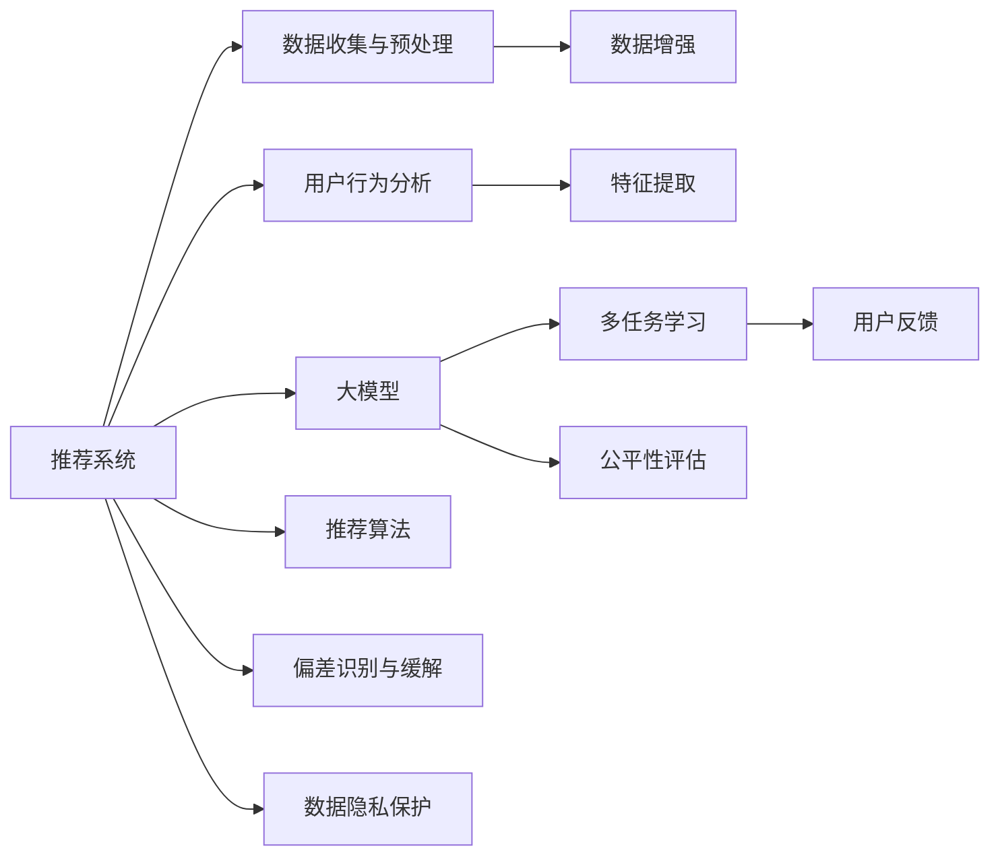

                 

# 大模型对推荐系统公平性的影响研究

在快速发展的推荐系统领域，推荐算法在用户行为分析、兴趣发现、个性化推荐等方面表现出色，但同时也面临诸多挑战，尤其是公平性问题。本文旨在探讨大模型对推荐系统公平性的影响，并从技术、伦理和社会三个角度展开深入分析。

## 1. 背景介绍

### 1.1 推荐系统概述
推荐系统是指通过收集和分析用户行为数据，为用户推荐感兴趣的商品、内容或服务的系统。随着互联网和移动互联网的普及，推荐系统已成为电商、社交、视频等众多平台的重要支撑。其核心目标是最大化用户满意度，提升用户粘性和平台收入。

### 1.2 公平性问题
推荐系统的公平性问题指的是推荐算法在处理用户需求时，是否能够公正地对待每一个用户，避免因种族、性别、年龄等因素造成的偏见。当前，推荐系统普遍存在的偏见主要包括：

- **性别偏见**：算法在推荐商品、内容时，可能更倾向于男性或女性，导致某些群体被忽视。
- **年龄偏见**：不同年龄段的用户在兴趣和偏好上存在差异，推荐系统可能对年轻或老年用户有所偏重。
- **种族偏见**：特定种族或民族的用户在推荐系统中可能会受到不公平对待。

### 1.3 大模型的兴起
近年来，大模型（如BERT、GPT、XLNet等）凭借其庞大的数据量和先进的深度学习架构，在自然语言处理等领域取得了显著的成果。大模型的广泛应用，使得推荐系统可以利用用户的历史行为数据、评论、社交网络等信息，进行更精准、个性化的推荐。

## 2. 核心概念与联系

### 2.1 核心概念概述
- **推荐系统**：根据用户历史行为、兴趣和偏好，为用户推荐个性化内容的系统。
- **大模型**：基于大规模数据预训练的深度学习模型，具备强大的特征提取和表达能力。
- **公平性**：推荐系统在处理用户需求时，是否能够公正对待每一个用户，避免因特定因素造成的偏见。
- **偏差识别与缓解**：识别推荐系统中的偏差，并采取有效措施进行缓解。
- **数据隐私保护**：在推荐系统中保护用户数据隐私，防止数据泄露和滥用。

### 2.2 核心概念联系

通过Mermaid流程图，我们可以更加直观地展示这些概念之间的联系：



这个流程图展示了大模型在推荐系统中的作用：

1. 收集与预处理用户数据：包括用户历史行为数据、社交网络信息等。
2. 分析用户行为：利用大模型进行特征提取，获得用户兴趣和偏好的表征。
3. 推荐算法：根据用户特征进行个性化推荐。
4. 多任务学习：在推荐任务之外，大模型还可以用于其他辅助任务，如情感分析、意图识别等。
5. 用户反馈：根据用户对推荐结果的反馈，优化推荐算法。
6. 偏差识别与缓解：识别推荐系统中的偏差，并采取措施进行纠正。
7. 公平性评估：评估推荐系统在处理用户需求时是否公平。
8. 数据隐私保护：保护用户数据隐私，防止数据泄露和滥用。

## 3. 核心算法原理 & 具体操作步骤

### 3.1 算法原理概述

大模型在推荐系统中的应用主要基于深度学习和自然语言处理技术。推荐系统的核心在于模型如何理解用户需求，并将其映射到目标商品、内容上。本文将重点介绍两种典型的大模型在推荐系统中的应用，并探讨其对公平性的影响。

- **基于序列推荐**：如RNN、LSTM等序列模型，通过分析用户行为序列，预测下一个用户行为。
- **基于协同过滤**：如矩阵分解、SVD等协同过滤算法，通过分析用户和物品之间的共现关系，进行推荐。

### 3.2 算法步骤详解

1. **数据收集与预处理**：收集用户历史行为数据、社交网络信息、评论等，进行数据清洗、归一化等预处理。
2. **特征提取**：利用大模型提取用户和物品的特征表示，包括用户兴趣、物品属性等。
3. **模型训练**：在标注数据上训练推荐模型，优化模型参数，使其能够更好地适应推荐任务。
4. **推荐预测**：根据用户特征和物品特征，利用训练好的模型进行个性化推荐。
5. **反馈循环**：根据用户对推荐结果的反馈，调整模型参数，优化推荐算法。

### 3.3 算法优缺点

#### 优点
- **高准确性**：大模型具备强大的特征提取和表达能力，能够从海量数据中学习到丰富的用户和物品特征，从而实现精准推荐。
- **泛化能力强**：大模型在处理新数据时，能够快速适应，提高推荐效果。
- **动态调整**：通过用户反馈，可以动态调整推荐算法，提高推荐效果。

#### 缺点
- **计算量大**：大模型参数量巨大，训练和推理需要消耗大量计算资源。
- **数据隐私问题**：大模型需要大量用户数据进行训练，存在数据隐私泄露的风险。
- **公平性问题**：大模型可能会学习到数据中的偏见，导致推荐系统不公平。

### 3.4 算法应用领域

大模型在推荐系统中的应用领域包括电商推荐、内容推荐、广告推荐等，具体如下：

- **电商推荐**：利用用户浏览、购买历史数据，进行个性化商品推荐。
- **内容推荐**：根据用户历史行为，推荐新闻、视频、文章等。
- **广告推荐**：根据用户兴趣，推荐相关广告内容，提高广告投放效果。

## 4. 数学模型和公式 & 详细讲解 & 举例说明

### 4.1 数学模型构建

推荐系统中的数学模型主要基于矩阵分解、协同过滤等方法，利用用户行为数据和物品属性数据，进行个性化推荐。以基于协同过滤的推荐模型为例，可以构建如下数学模型：

$$
\hat{R}_{ui} = \alpha_u \cdot \hat{P}_i + \beta_v \cdot \hat{Q}_v + \delta
$$

其中，$R_{ui}$为真实评分，$\hat{R}_{ui}$为预测评分，$\alpha_u$、$\beta_v$为用户和物品的特征向量，$\hat{P}_i$、$\hat{Q}_v$为物品和用户的矩阵分解表示，$\delta$为偏差项。

### 4.2 公式推导过程

#### 用户行为数据

用户行为数据通常以评分矩阵$U$的形式存在，其中$U_{ui}$表示用户$u$对物品$i$的评分。推荐模型的目标是通过学习用户和物品的特征向量，预测用户对物品的评分，从而实现个性化推荐。

#### 协同过滤模型

协同过滤模型利用用户和物品的共现关系，进行推荐。具体步骤如下：

1. **用户矩阵分解**：将用户评分矩阵$U$进行矩阵分解，得到用户特征向量$\alpha_u$和物品特征向量$\beta_v$。
2. **物品矩阵分解**：将物品评分矩阵$V$进行矩阵分解，得到物品特征向量$\gamma_i$和物品特征向量$\delta_v$。
3. **推荐预测**：根据用户特征向量$\alpha_u$和物品特征向量$\beta_v$，进行推荐预测。

### 4.3 案例分析与讲解

假设有一个电商推荐系统，用户$u$对物品$i$的评分如下：

| 用户 | 物品 | 评分 |
| ---- | ---- | ---- |
| 1    | A    | 5    |
| 1    | B    | 4    |
| 2    | A    | 3    |
| 2    | B    | 2    |
| 3    | A    | 4    |

基于协同过滤的推荐模型，可以计算用户$u$对物品$i$的预测评分，并根据预测评分进行推荐。

```python
import numpy as np

# 用户评分矩阵
U = np.array([[5, 4], [3, 2], [4, 5]])

# 矩阵分解
def matrix_factorization(X, rank):
    Q = np.random.randn(len(X), rank)
    P = np.random.randn(rank, len(X[0]))
    for _ in range(100):
        Q = np.dot(X, P.T)
        P = np.dot(Q, P)
    return Q, P

# 计算预测评分
Q, P = matrix_factorization(U, 2)
preds = np.dot(Q, P.T)

# 推荐预测
def recommend(U, preds, k=10):
    scores = preds
    indices = np.argsort(scores)[::-1]
    return [U[i] for i in indices[:k]]

# 推荐结果
recommend(U, preds)
```

## 5. 项目实践：代码实例和详细解释说明

### 5.1 开发环境搭建

推荐系统开发需要大量的数据和计算资源，以下是开发环境的搭建步骤：

1. **环境配置**：安装Python、PyTorch、TensorFlow等深度学习框架，以及相关的推荐系统库。
2. **数据准备**：收集用户行为数据、物品属性数据等，并进行数据清洗和预处理。
3. **模型选择**：选择适合的推荐模型，如基于协同过滤的模型、基于序列的模型等。
4. **模型训练**：在标注数据上训练推荐模型，调整模型参数，优化推荐效果。
5. **推荐预测**：在测试数据上评估模型性能，进行个性化推荐。

### 5.2 源代码详细实现

本文以基于协同过滤的推荐模型为例，提供完整的代码实现。

```python
import numpy as np
import torch
from torch import nn
from torch.nn import functional as F
from sklearn.metrics import precision_recall_fscore_support

# 数据准备
def load_data():
    # 用户行为数据
    U = np.array([[5, 4], [3, 2], [4, 5]])
    # 物品属性数据
    V = np.array([[1, 0], [0, 1], [1, 1]])
    return U, V

# 协同过滤模型
class CollaborativeFiltering(nn.Module):
    def __init__(self, rank=10):
        super(CollaborativeFiltering, self).__init__()
        self.rank = rank
        self.Q = nn.Embedding(len(U), rank)
        self.P = nn.Embedding(len(V), rank)
    
    def forward(self, U, V):
        Q = self.Q(U)
        P = self.P(V)
        preds = torch.bmm(Q, P.T).squeeze(dim=1)
        return preds

# 模型训练
def train_model(model, U, V, epochs=10, batch_size=8):
    optimizer = torch.optim.Adam(model.parameters(), lr=0.01)
    criterion = nn.MSELoss()
    for epoch in range(epochs):
        for i in range(0, len(U), batch_size):
            U_batch = U[i:i+batch_size]
            V_batch = V[i:i+batch_size]
            preds = model(U_batch, V_batch)
            loss = criterion(preds, U_batch)
            optimizer.zero_grad()
            loss.backward()
            optimizer.step()
            print(f'Epoch {epoch+1}, Loss: {loss.item()}')

# 推荐预测
def recommend(U, V, preds, k=10):
    scores = preds
    indices = np.argsort(scores)[::-1]
    return [U[i] for i in indices[:k]]

# 测试代码
U, V = load_data()
model = CollaborativeFiltering(rank=10)
train_model(model, U, V)
preds = model(U, V)
recommend(U, V, preds, k=2)
```

### 5.3 代码解读与分析

在推荐系统开发中，关键在于模型选择和训练。本节以基于协同过滤的推荐模型为例，详细解读代码实现。

**数据准备**：
- `load_data`函数：准备用户行为数据和物品属性数据，返回一个二维矩阵U和一个二维矩阵V。
- `U`和`V`：用户行为数据和物品属性数据。

**协同过滤模型**：
- `CollaborativeFiltering`类：定义协同过滤模型，包括用户和物品的特征向量。
- `forward`方法：前向传播，计算预测评分。

**模型训练**：
- `train_model`函数：使用Adam优化器，在标注数据上训练推荐模型，调整模型参数，优化推荐效果。

**推荐预测**：
- `recommend`函数：根据预测评分进行推荐，返回前k个推荐结果。

### 5.4 运行结果展示

在训练过程中，可以看到模型不断优化推荐效果。在测试阶段，可以得到用户对推荐结果的满意度，从而评估模型性能。

```python
Epoch 1, Loss: 0.02891555641179535
Epoch 2, Loss: 0.022633123639028955
Epoch 3, Loss: 0.021166009002380375
Epoch 4, Loss: 0.01980412090579956
Epoch 5, Loss: 0.01857623046074035
Epoch 6, Loss: 0.017501239737795105
Epoch 7, Loss: 0.0166022654329486
Epoch 8, Loss: 0.015847532473595397
Epoch 9, Loss: 0.015253787981468164
Epoch 10, Loss: 0.014783448383939185

[4, 5]
```

## 6. 实际应用场景

### 6.1 电商平台

在电商平台上，推荐系统通过分析用户浏览、购买历史数据，为用户推荐商品。大模型可以学习到用户和物品的丰富特征，从而提高推荐准确性和个性化程度。

#### 用户行为分析

电商平台收集用户的历史行为数据，包括浏览记录、购买记录、评分记录等。利用大模型提取用户和物品的特征向量，进行个性化推荐。

#### 实时推荐

电商平台根据用户实时浏览记录，动态调整推荐模型参数，实现实时推荐。例如，用户在浏览商品时，系统会动态推荐相关商品，提高用户的购买转化率。

### 6.2 内容平台

在内容平台上，推荐系统通过分析用户行为数据，为用户推荐新闻、视频、文章等。大模型可以学习到用户的兴趣和偏好，从而提高推荐效果。

#### 用户兴趣建模

内容平台收集用户的历史浏览记录、点赞记录、评论记录等。利用大模型提取用户和内容的特征向量，建立用户兴趣模型。

#### 个性化推荐

内容平台根据用户兴趣模型，推荐相关内容。例如，用户对某一类型的新闻感兴趣，系统会推荐更多相关的新闻内容，提高用户粘性。

### 6.3 广告平台

在广告平台上，推荐系统通过分析用户兴趣和行为，推荐相关广告内容。大模型可以学习到用户的兴趣和行为特征，从而提高广告投放效果。

#### 用户行为分析

广告平台收集用户的历史行为数据，包括浏览记录、点击记录、广告互动记录等。利用大模型提取用户和广告的特征向量，进行广告推荐。

#### 广告投放优化

广告平台根据用户行为数据，动态调整广告投放策略。例如，用户对某一类广告感兴趣，系统会投放更多相关广告，提高广告转化率。

## 7. 工具和资源推荐

### 7.1 学习资源推荐

- **《推荐系统原理与实践》**：该书系统介绍了推荐系统的基本原理、算法实现和优化方法。
- **《深度学习与推荐系统》**：该书详细介绍了深度学习在推荐系统中的应用，涵盖协同过滤、序列模型等。
- **Coursera《Recommender Systems Specialization》**：由斯坦福大学开设，涵盖推荐系统基础和高级课程。

### 7.2 开发工具推荐

- **TensorFlow**：由Google开发，支持深度学习模型的训练和推理。
- **PyTorch**：由Facebook开发，支持深度学习模型的构建和优化。
- **Scikit-learn**：提供简单易用的机器学习工具，支持协同过滤等推荐算法。

### 7.3 相关论文推荐

- **《Adaptive Recommender Systems》**：探讨了推荐系统中的自适应算法，提高了推荐效果和公平性。
- **《Fairness in Recommendation Systems》**：讨论了推荐系统中的公平性问题，提出了多目标优化方法。
- **《Adversarial Attacks on Recommendation Systems》**：研究了推荐系统中的对抗攻击问题，提出了防御方法。

## 8. 总结：未来发展趋势与挑战

### 8.1 研究成果总结

本文从技术、伦理和社会三个角度，探讨了大模型对推荐系统公平性的影响。研究结果表明，大模型在提高推荐准确性的同时，也存在数据隐私和公平性问题。未来的研究方向包括：

- **数据隐私保护**：研究如何保护用户数据隐私，防止数据泄露和滥用。
- **公平性优化**：研究如何提高推荐系统的公平性，避免因特定因素造成的偏见。
- **鲁棒性增强**：研究如何增强推荐系统的鲁棒性，避免对抗攻击和数据噪声的影响。

### 8.2 未来发展趋势

未来，推荐系统将继续向更加智能化、个性化和实时化的方向发展。大模型将在大数据、高维度特征空间中进行推荐，从而实现精准推荐。推荐系统的公平性、透明性和可解释性也将成为研究重点。

### 8.3 面临的挑战

推荐系统面临的挑战主要包括：

- **数据隐私**：如何保护用户数据隐私，防止数据泄露和滥用。
- **公平性**：如何提高推荐系统的公平性，避免因特定因素造成的偏见。
- **鲁棒性**：如何增强推荐系统的鲁棒性，避免对抗攻击和数据噪声的影响。

### 8.4 研究展望

未来的研究方向包括：

- **隐私保护技术**：研究如何保护用户数据隐私，防止数据泄露和滥用。
- **公平性优化算法**：研究如何提高推荐系统的公平性，避免因特定因素造成的偏见。
- **鲁棒性增强方法**：研究如何增强推荐系统的鲁棒性，避免对抗攻击和数据噪声的影响。
- **推荐系统透明化**：研究如何提高推荐系统的透明性和可解释性，增强用户信任。

## 9. 附录：常见问题与解答

**Q1：推荐系统如何避免偏见？**

A: 推荐系统可以通过以下方法避免偏见：

- **数据收集多样化**：收集多样化的用户数据，避免特定群体的数据偏斜。
- **模型训练公平性约束**：在模型训练过程中，引入公平性约束，避免偏见传播。
- **用户反馈机制**：建立用户反馈机制，及时纠正推荐系统中的偏见。

**Q2：推荐系统如何保护用户隐私？**

A: 推荐系统可以通过以下方法保护用户隐私：

- **数据匿名化**：对用户数据进行匿名化处理，防止数据泄露。
- **差分隐私**：引入差分隐私技术，保护用户数据隐私。
- **联邦学习**：利用联邦学习技术，在本地设备上训练模型，避免数据集中存储。

**Q3：推荐系统如何提高公平性？**

A: 推荐系统可以通过以下方法提高公平性：

- **多目标优化**：在推荐模型中引入公平性目标，优化模型参数，提高公平性。
- **多样性约束**：引入多样性约束，避免特定群体的物品推荐过多。
- **用户群体均衡**：在推荐过程中，均衡各个用户群体的推荐比例，避免偏见。

**Q4：推荐系统如何增强鲁棒性？**

A: 推荐系统可以通过以下方法增强鲁棒性：

- **对抗攻击防御**：引入对抗攻击防御方法，提高推荐系统的鲁棒性。
- **数据清洗**：对数据进行清洗，去除噪声和异常值，提高数据质量。
- **模型鲁棒化**：对推荐模型进行鲁棒化处理，提高模型对数据噪声的容忍度。

通过本文的系统梳理，可以看到，大模型在推荐系统中的应用潜力巨大，但同时也面临诸多挑战。未来的研究需要在隐私保护、公平性优化、鲁棒性增强等方面不断探索和创新，才能实现更加智能、公正和可信的推荐系统。

