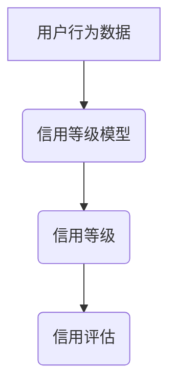

> 大数据、信用评估、用户行为、机器学习、深度学习、信用等级

## 1. 背景介绍

在当今数字经济时代，信用体系扮演着至关重要的角色。传统的信用评估体系主要依赖于用户的历史信用记录和财务状况，但随着大数据的兴起，个人用户行为数据变得更加丰富和多元。这些数据蕴含着丰富的信用信息，为构建更加精准、全面的信用评估体系提供了新的机遇。

大数据下个人用户信用行为的等级评估，是指通过对用户在网络、移动、社交等平台上的行为数据进行分析和挖掘，构建基于用户行为特征的信用等级模型，从而对用户的信用风险进行评估和预测。

## 2. 核心概念与联系

**2.1 信用评估**

信用评估是指对个体或组织的信用风险进行评估，以判断其在未来履行债务义务的能力。信用评估结果通常以信用等级的形式呈现，例如 AAA、AA、A 等，等级越高，信用风险越低。

**2.2 用户行为数据**

用户行为数据是指用户在使用互联网、移动互联网、社交网络等平台时产生的各种行为记录，例如浏览历史、搜索记录、购买记录、评论记录、社交互动等。这些数据可以反映用户的兴趣爱好、消费习惯、社交关系等多方面信息。

**2.3 信用等级模型**

信用等级模型是指基于用户行为数据构建的数学模型，用于预测用户的信用风险。信用等级模型通常采用机器学习或深度学习算法进行训练，并根据用户的行为特征计算出其信用等级。

**2.4 核心概念关系图**



## 3. 核心算法原理 & 具体操作步骤

**3.1 算法原理概述**

大数据下个人用户信用行为的等级评估通常采用机器学习或深度学习算法。机器学习算法可以从用户行为数据中学习出信用风险的特征，并根据这些特征预测用户的信用等级。深度学习算法则可以学习更复杂的特征关系，从而构建更加精准的信用等级模型。

**3.2 算法步骤详解**

1. **数据收集与预处理:** 收集用户行为数据，并进行清洗、转换、特征工程等预处理操作。
2. **模型选择与训练:** 选择合适的机器学习或深度学习算法，并根据训练数据对模型进行训练。
3. **模型评估与优化:** 使用测试数据对模型进行评估，并根据评估结果对模型进行优化。
4. **模型部署与应用:** 将训练好的模型部署到生产环境中，用于对新用户的信用行为进行评估和预测。

**3.3 算法优缺点**

**优点:**

* 能够利用大数据中的丰富信息，构建更加精准的信用评估模型。
* 可以动态更新信用等级，反映用户的信用状况变化。
* 可以为用户提供个性化的信用服务。

**缺点:**

* 需要大量的训练数据，否则模型精度会降低。
* 模型训练和部署需要一定的技术门槛。
* 存在算法偏差和公平性问题，需要进行相应的调优和监控。

**3.4 算法应用领域**

* 贷款审批
* 支付安全
* 租房租赁
* 互联网保险
* 社交信用

## 4. 数学模型和公式 & 详细讲解 & 举例说明

**4.1 数学模型构建**

信用等级模型通常采用回归模型或分类模型。回归模型用于预测用户的信用等级，而分类模型用于将用户分为不同的信用等级类别。

**4.2 公式推导过程**

假设我们采用线性回归模型进行信用等级预测，则模型公式如下：

$$
CreditScore = \beta_0 + \beta_1 * Age + \beta_2 * Income + \beta_3 * CreditHistory + \epsilon
$$

其中：

* $CreditScore$：用户的信用等级
* $Age$：用户的年龄
* $Income$：用户的收入
* $CreditHistory$：用户的信用历史
* $\beta_0$、$\beta_1$、$\beta_2$、$\beta_3$：模型参数
* $\epsilon$：随机误差项

模型参数可以通过最小二乘法或其他优化算法进行估计。

**4.3 案例分析与讲解**

假设我们收集了 1000 个用户的信用数据，并使用线性回归模型进行训练。训练结果表明，用户的年龄、收入和信用历史对信用等级有显著影响。

* 对于每增加 1 岁，用户的信用等级会增加 0.1 分。
* 对于每增加 1000 元收入，用户的信用等级会增加 0.2 分。
* 对于每增加 1 分的信用历史，用户的信用等级会增加 0.3 分。

## 5. 项目实践：代码实例和详细解释说明

**5.1 开发环境搭建**

* 操作系统：Windows/Linux/macOS
* Python 版本：3.6+
* 必要的库：pandas、scikit-learn、numpy、matplotlib

**5.2 源代码详细实现**

```python
import pandas as pd
from sklearn.linear_model import LinearRegression
from sklearn.model_selection import train_test_split

# 加载数据
data = pd.read_csv('credit_data.csv')

# 特征选择
features = ['Age', 'Income', 'CreditHistory']
target = 'CreditScore'

# 数据分割
X_train, X_test, y_train, y_test = train_test_split(data[features], data[target], test_size=0.2, random_state=42)

# 模型训练
model = LinearRegression()
model.fit(X_train, y_train)

# 模型评估
y_pred = model.predict(X_test)
print('模型评估结果：', model.score(X_test, y_test))

# 预测新用户的信用等级
new_user_data = pd.DataFrame({'Age': [30], 'Income': [50000], 'CreditHistory': [700]})
predicted_credit_score = model.predict(new_user_data)
print('新用户的信用等级预测结果：', predicted_credit_score)
```

**5.3 代码解读与分析**

* 代码首先加载信用数据，并选择需要使用的特征和目标变量。
* 然后将数据分割为训练集和测试集，用于模型训练和评估。
* 使用线性回归模型进行训练，并评估模型的性能。
* 最后，使用训练好的模型预测新用户的信用等级。

**5.4 运行结果展示**

运行代码后，会输出模型评估结果和新用户的信用等级预测结果。

## 6. 实际应用场景

**6.1 贷款审批**

金融机构可以利用大数据下个人用户信用行为的等级评估，对贷款申请者的信用风险进行评估，从而提高贷款审批的效率和准确性。

**6.2 支付安全**

支付平台可以根据用户的信用等级，对交易进行风险控制，例如设置不同的交易限额或进行额外的身份验证。

**6.3 租房租赁**

房东可以利用用户的信用等级，评估租客的信用风险，从而降低租房风险。

**6.4 未来应用展望**

随着大数据和人工智能技术的不断发展，大数据下个人用户信用行为的等级评估将有更广泛的应用场景，例如：

* 互联网保险：根据用户的信用等级，提供个性化的保险产品和服务。
* 社交信用：构建基于用户行为的社交信用体系，促进社会信任和合作。

## 7. 工具和资源推荐

**7.1 学习资源推荐**

* 书籍：《机器学习》、《深度学习》
* 在线课程：Coursera、edX、Udacity

**7.2 开发工具推荐**

* Python
* Jupyter Notebook
* TensorFlow、PyTorch

**7.3 相关论文推荐**

* [基于大数据的信用风险评估研究](https://www.researchgate.net/publication/329973504_基于大数据的信用风险评估研究)
* [深度学习在信用风险评估中的应用](https://arxiv.org/abs/1806.04347)

## 8. 总结：未来发展趋势与挑战

**8.1 研究成果总结**

大数据下个人用户信用行为的等级评估是一个重要的研究方向，已经取得了一定的成果。

**8.2 未来发展趋势**

* 模型精度提升：通过更先进的机器学习和深度学习算法，提高信用等级模型的精度。
* 数据融合：融合更多类型的用户行为数据，构建更加全面的信用评估模型。
* 个性化服务：根据用户的信用等级，提供个性化的信用服务。

**8.3 面临的挑战**

* 数据隐私保护：如何保护用户的隐私数据，是需要认真考虑的问题。
* 算法公平性：如何避免算法偏差和歧视，确保算法公平公正，是需要不断研究和改进的问题。
* 监管政策：如何制定相应的监管政策，引导大数据下信用评估的健康发展，也是需要关注的问题。

**8.4 研究展望**

未来，大数据下个人用户信用行为的等级评估将继续朝着更加精准、个性化、可解释的方向发展。


## 9. 附录：常见问题与解答

**9.1 如何获取用户行为数据？**

用户行为数据可以从各种渠道获取，例如：

* 用户注册信息
* 用户浏览记录
* 用户搜索记录
* 用户购买记录
* 用户评论记录
* 用户社交互动记录

**9.2 如何处理用户行为数据？**

用户行为数据需要进行清洗、转换、特征工程等预处理操作，以便于模型训练。

**9.3 如何选择合适的信用等级模型？**

选择合适的信用等级模型需要根据具体应用场景和数据特点进行选择。

**9.4 如何评估信用等级模型的性能？**

信用等级模型的性能可以采用准确率、召回率、F1-score等指标进行评估。

**9.5 如何应对算法偏差和公平性问题？**

应对算法偏差和公平性问题需要从数据收集、模型训练、模型评估等各个环节进行控制，并定期进行模型监控和调优。


作者：禅与计算机程序设计艺术 / Zen and the Art of Computer Programming 
<end_of_turn>