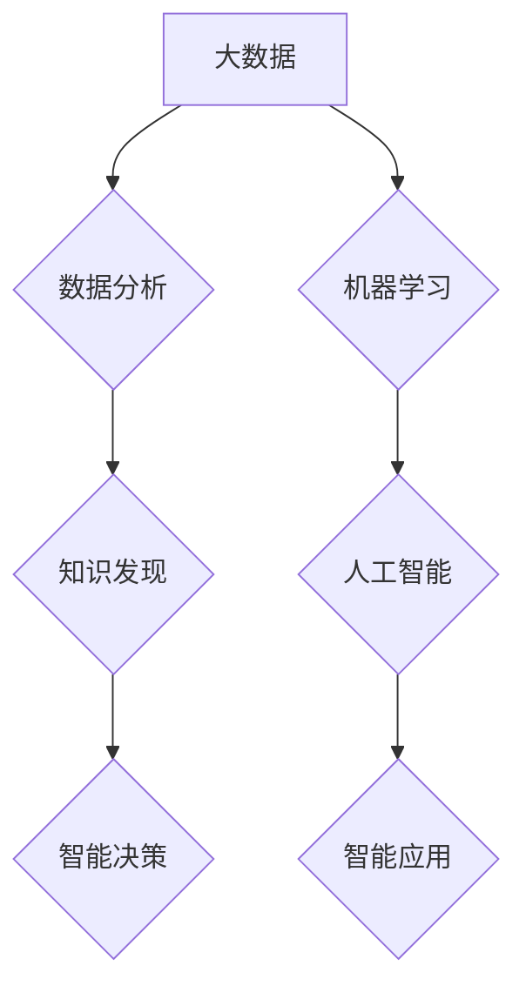

> 大数据，人工智能，机器学习，深度学习，云计算，数据可视化，伦理问题

## 1. 背景介绍

大数据和人工智能（AI）是21世纪最具颠覆性的技术力量之一，它们正在深刻地改变着我们的生活、工作和世界观。大数据是指海量、高速、多样化的数据，而人工智能是指模拟人类智能的计算机系统。两者相结合，催生出强大的数据分析、预测和决策能力，为各个领域带来了前所未有的机遇。

近年来，随着互联网、移动互联网、物联网等技术的快速发展，数据爆炸式增长，为大数据和AI的发展提供了充足的燃料。同时，计算能力的提升、算法的进步以及硬件设施的完善，也为AI技术的突破提供了坚实的基础。

## 2. 核心概念与联系

**2.1 大数据**

大数据是指规模庞大、结构复杂、更新速度快、类型多样化的数据。其特征通常被概括为“五V”：

* **Volume（体积）**: 数据量巨大，难以用传统方法处理。
* **Velocity（速度）**: 数据生成和更新速度快，需要实时处理。
* **Variety（多样性）**: 数据类型多样，包括结构化数据、非结构化数据和半结构化数据。
* **Veracity（真实性）**: 数据质量参差不齐，需要进行清洗和验证。
* **Value（价值）**: 数据蕴含着巨大的价值，需要进行挖掘和分析。

**2.2 人工智能**

人工智能是指模拟人类智能的计算机系统，使其能够像人类一样学习、推理、决策和解决问题。AI技术主要包括：

* **机器学习**: 算法从数据中学习，不断改进预测和决策能力。
* **深度学习**: 利用多层神经网络，模拟人类大脑的学习机制，实现更复杂的智能。
* **自然语言处理**: 使计算机能够理解和处理人类语言。
* **计算机视觉**: 使计算机能够“看”图像和视频，并从中提取信息。

**2.3 大数据与AI的联系**

大数据为AI提供了训练数据，而AI则可以帮助我们更好地分析和理解大数据。两者相互促进，共同推动着智能化时代的到来。



## 3. 核心算法原理 & 具体操作步骤

### 3.1 算法原理概述

机器学习算法是一种能够从数据中学习并不断改进的算法。它通过训练模型，使模型能够对输入数据进行预测或分类。常见的机器学习算法包括：

* **线性回归**: 用于预测连续数值。
* **逻辑回归**: 用于预测分类结果。
* **决策树**: 用于分类和回归问题。
* **支持向量机**: 用于分类问题。
* **神经网络**: 用于复杂问题，例如图像识别和自然语言处理。

### 3.2 算法步骤详解

机器学习算法的训练过程通常包括以下步骤：

1. **数据收集和预处理**: 收集相关数据，并进行清洗、转换和特征工程等预处理工作。
2. **模型选择**: 根据具体问题选择合适的机器学习算法。
3. **模型训练**: 使用训练数据训练模型，调整模型参数，使模型能够准确地预测或分类。
4. **模型评估**: 使用测试数据评估模型的性能，例如准确率、召回率和F1-score。
5. **模型部署**: 将训练好的模型部署到实际应用场景中。

### 3.3 算法优缺点

不同的机器学习算法具有不同的优缺点，需要根据具体问题选择合适的算法。

* **线性回归**: 优点：简单易懂，计算速度快。缺点：对非线性关系的拟合能力较差。
* **逻辑回归**: 优点：适用于分类问题，易于解释。缺点：对复杂关系的拟合能力较差。
* **决策树**: 优点：易于理解和解释，可以处理非线性关系。缺点：容易过拟合。
* **支持向量机**: 优点：对高维数据具有较好的泛化能力。缺点：训练时间较长。
* **神经网络**: 优点：可以处理复杂关系，具有强大的学习能力。缺点：训练时间长，参数众多，易于过拟合。

### 3.4 算法应用领域

机器学习算法广泛应用于各个领域，例如：

* **医疗保健**: 疾病诊断、药物研发、患者风险评估。
* **金融**: 欺诈检测、信用评分、投资预测。
* **电商**: 商品推荐、用户画像、价格优化。
* **交通**: 交通预测、自动驾驶、路线规划。
* **制造业**: 质量控制、设备故障预测、生产优化。

## 4. 数学模型和公式 & 详细讲解 & 举例说明

### 4.1 数学模型构建

机器学习算法通常基于数学模型，例如线性回归模型、逻辑回归模型和神经网络模型。这些模型通过数学公式来描述数据之间的关系。

**4.1.1 线性回归模型**

线性回归模型假设数据之间存在线性关系，可以用以下公式表示：

$$y = w_0 + w_1x_1 + w_2x_2 + ... + w_nx_n + \epsilon$$

其中：

* $y$ 是预测值。
* $w_0, w_1, w_2, ..., w_n$ 是模型参数。
* $x_1, x_2, ..., x_n$ 是输入特征。
* $\epsilon$ 是误差项。

**4.1.2 逻辑回归模型**

逻辑回归模型用于预测分类结果，将线性回归模型的输出映射到0到1之间的概率值。其公式如下：

$$p(y=1|x) = \frac{1}{1 + e^{-(w_0 + w_1x_1 + w_2x_2 + ... + w_nx_n)}}$$

其中：

* $p(y=1|x)$ 是预测类别为1的概率。
* $w_0, w_1, w_2, ..., w_n$ 是模型参数。
* $x_1, x_2, ..., x_n$ 是输入特征。

### 4.2 公式推导过程

机器学习算法的数学模型和公式通常通过最大似然估计或最小二乘法等方法推导出来的。

**4.2.1 最大似然估计**

最大似然估计是一种常用的参数估计方法，其目标是找到最能解释观测数据的模型参数。

**4.2.2 最小二乘法**

最小二乘法是一种常用的回归模型参数估计方法，其目标是找到使模型预测值与实际值误差平方和最小的模型参数。

### 4.3 案例分析与讲解

**4.3.1 线性回归案例**

假设我们想要预测房屋价格，已知房屋面积和房间数量等特征数据。我们可以使用线性回归模型来建立房屋价格与特征之间的关系。通过训练模型，我们可以得到房屋价格的预测公式，并根据房屋面积和房间数量等特征预测房屋价格。

**4.3.2 逻辑回归案例**

假设我们想要预测客户是否会购买某个产品，已知客户的年龄、收入等特征数据。我们可以使用逻辑回归模型来建立客户购买概率与特征之间的关系。通过训练模型，我们可以得到客户购买概率的预测公式，并根据客户的特征预测其是否会购买产品。

## 5. 项目实践：代码实例和详细解释说明

### 5.1 开发环境搭建

本项目使用Python语言进行开发，需要安装以下软件：

* Python 3.x
* Jupyter Notebook
* scikit-learn

### 5.2 源代码详细实现

```python
# 导入必要的库
import pandas as pd
from sklearn.model_selection import train_test_split
from sklearn.linear_model import LinearRegression
from sklearn.metrics import mean_squared_error

# 加载数据
data = pd.read_csv('house_price.csv')

# 选择特征和目标变量
features = ['area', 'rooms']
target = 'price'

# 将数据划分为训练集和测试集
X_train, X_test, y_train, y_test = train_test_split(data[features], data[target], test_size=0.2, random_state=42)

# 创建线性回归模型
model = LinearRegression()

# 训练模型
model.fit(X_train, y_train)

# 预测测试集数据
y_pred = model.predict(X_test)

# 计算模型性能
mse = mean_squared_error(y_test, y_pred)
print(f'Mean Squared Error: {mse}')
```

### 5.3 代码解读与分析

这段代码实现了房屋价格预测的线性回归模型。

1. 首先导入必要的库，包括pandas用于数据处理、scikit-learn用于机器学习算法。
2. 加载数据，选择特征和目标变量。
3. 将数据划分为训练集和测试集，用于训练和评估模型。
4. 创建线性回归模型，并使用训练集训练模型。
5. 使用训练好的模型预测测试集数据，并计算模型性能。

### 5.4 运行结果展示

运行代码后，会输出模型的均方误差（MSE）值，该值越小，模型性能越好。

## 6. 实际应用场景

### 6.1 医疗保健

* **疾病诊断**: 利用机器学习算法分析患者的医疗记录、影像数据等，辅助医生诊断疾病。
* **药物研发**: 利用机器学习算法分析药物的化学结构和生物活性，加速药物研发过程。
* **患者风险评估**: 利用机器学习算法分析患者的医疗历史和生活习惯，预测患者患病风险。

### 6.2 金融

* **欺诈检测**: 利用机器学习算法分析交易数据，识别异常交易行为，防止欺诈行为。
* **信用评分**: 利用机器学习算法分析客户的信用历史和财务状况，评估客户的信用风险。
* **投资预测**: 利用机器学习算法分析市场数据，预测股票价格、债券收益等，辅助投资决策。

### 6.3 电商

* **商品推荐**: 利用机器学习算法分析用户的购买历史和浏览记录，推荐用户可能感兴趣的商品。
* **用户画像**: 利用机器学习算法分析用户的行为数据，构建用户画像，帮助商家了解用户需求。
* **价格优化**: 利用机器学习算法分析市场数据和用户行为，优化商品价格，提高销售额。

### 6.4 未来应用展望

随着大数据和AI技术的不断发展，其应用场景将更加广泛，例如：

* **个性化教育**: 利用机器学习算法分析学生的学习情况，提供个性化的学习方案。
* **智能制造**: 利用机器学习算法优化生产流程，提高生产效率。
* **自动驾驶**: 利用机器学习算法训练自动驾驶系统，实现无人驾驶。

## 7. 工具和资源推荐

### 7.1 学习资源推荐

* **在线课程**: Coursera、edX、Udacity等平台提供丰富的机器学习和AI课程。
* **书籍**: 《深入理解机器学习》、《Python机器学习实战》等书籍对机器学习有深入的讲解。
* **博客**: 许多机器学习和AI领域的专家在博客上分享他们的经验和见解。

### 7.2 开发工具推荐

* **Python**: 机器学习和AI开发的常用语言。
* **Jupyter Notebook**: 用于编写和运行机器学习代码的交互式环境。
* **scikit-learn**: Python机器学习库，提供各种机器学习算法和工具。
* **TensorFlow**: 用于深度学习的开源框架。
* **PyTorch**: 另一个流行的深度学习框架。

### 7.3 相关论文推荐

* **《机器学习》**: Tom Mitchell 著，机器学习的经典教材。
* **《深度学习》**: Ian Goodfellow、Yoshua Bengio 和 Aaron Courville 著，深度学习的经典著作。
* **《自然语言处理》**: Jurafsky 和 Martin 著，自然语言处理的经典教材。

## 8. 总结：