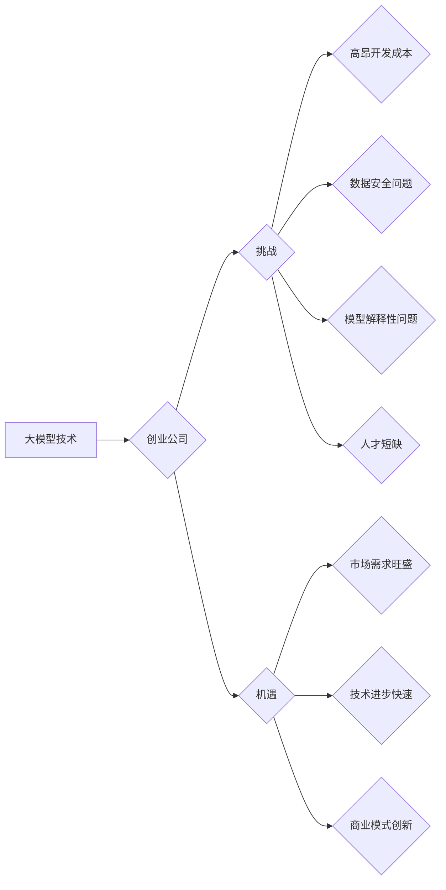

> 大模型、创业公司、挑战、机遇、人工智能、深度学习、商业化

## 1. 背景介绍

近年来，人工智能（AI）技术取得了飞速发展，特别是大模型的出现，为各行各业带来了革命性的变革。大模型是指参数规模庞大、训练数据海量的人工智能模型，具备强大的泛化能力和学习能力，能够在自然语言处理、计算机视觉、语音识别等领域取得突破性进展。

大模型的涌现也催生了一批创业公司，这些公司致力于将大模型技术应用于实际场景，开发出具有商业价值的解决方案。然而，大模型创业公司也面临着诸多挑战，例如高昂的开发成本、数据安全和隐私问题、模型解释性和可信度等。

## 2. 核心概念与联系

### 2.1 大模型

大模型是指参数规模庞大、训练数据海量的人工智能模型，通常拥有数十亿甚至数千亿个参数。其强大的学习能力使其能够在各种复杂任务中表现出色，例如：

* **自然语言处理 (NLP)：** 文本生成、机器翻译、问答系统、情感分析等。
* **计算机视觉 (CV)：** 图像识别、物体检测、图像分割、视频分析等。
* **语音识别 (ASR)：** 语音转文本、语音合成等。

### 2.2 创业公司

创业公司是指以创新为核心，致力于解决特定问题，并通过商业模式实现盈利的新兴企业。大模型创业公司利用大模型技术开发新产品和服务，并通过商业化模式实现盈利。

### 2.3 挑战与机遇

大模型创业公司面临着诸多挑战，但也蕴藏着巨大的机遇。

**挑战：**

* **高昂的开发成本：** 训练大模型需要大量的计算资源和数据，成本非常高昂。
* **数据安全和隐私问题：** 大模型的训练需要大量数据，如何保证数据安全和隐私是一个重要问题。
* **模型解释性和可信度：** 大模型的决策过程往往难以解释，这使得其应用在一些关键领域受到限制。
* **人才短缺：** 大模型领域需要大量具备相关专业知识和技能的人才。

**机遇：**

* **市场需求旺盛：** 大模型技术在各个行业都有广泛的应用前景，市场需求旺盛。
* **技术进步快速：** 大模型技术正在快速发展，新的算法和模型不断涌现。
* **商业模式创新：** 大模型技术可以赋能新的商业模式，例如订阅服务、平台服务等。

**Mermaid 流程图：**



## 3. 核心算法原理 & 具体操作步骤

### 3.1 算法原理概述

大模型的训练主要基于深度学习算法，其中Transformer模型是目前最流行的架构之一。Transformer模型利用注意力机制，能够有效捕捉文本序列中的长距离依赖关系，从而实现更准确的文本理解和生成。

### 3.2 算法步骤详解

1. **数据预处理：** 将原始文本数据进行清洗、分词、词向量化等预处理操作，以便模型训练。
2. **模型构建：** 根据Transformer模型架构，构建模型结构，包括编码器、解码器和注意力机制等模块。
3. **模型训练：** 使用训练数据对模型进行训练，通过反向传播算法不断调整模型参数，使其能够准确地预测目标输出。
4. **模型评估：** 使用测试数据对模型进行评估，并根据评估指标调整模型参数和训练策略。
5. **模型部署：** 将训练好的模型部署到生产环境中，用于实际应用。

### 3.3 算法优缺点

**优点：**

* **强大的泛化能力：** 大模型能够在未见过的文本数据上表现出色。
* **高效的学习能力：** 大模型能够从海量数据中学习到复杂的模式和规律。
* **多任务学习能力：** 大模型能够同时学习多个任务，提高效率。

**缺点：**

* **高昂的开发成本：** 训练大模型需要大量的计算资源和数据。
* **模型解释性差：** 大模型的决策过程难以解释，这使得其应用在一些关键领域受到限制。
* **数据依赖性强：** 大模型的性能取决于训练数据的质量和数量。

### 3.4 算法应用领域

大模型在各个领域都有广泛的应用前景，例如：

* **自然语言处理：** 文本生成、机器翻译、问答系统、情感分析等。
* **计算机视觉：** 图像识别、物体检测、图像分割、视频分析等。
* **语音识别：** 语音转文本、语音合成等。
* **医疗保健：** 疾病诊断、药物研发、患者管理等。
* **金融服务：** 风险评估、欺诈检测、客户服务等。

## 4. 数学模型和公式 & 详细讲解 & 举例说明

### 4.1 数学模型构建

大模型的训练过程可以看作是一个优化问题，目标是找到模型参数，使得模型在训练数据上的损失函数最小。损失函数通常是模型预测值与真实值的差值，例如均方误差（MSE）或交叉熵损失（Cross-Entropy Loss）。

### 4.2 公式推导过程

**均方误差 (MSE)：**

$$MSE = \frac{1}{n} \sum_{i=1}^{n} (y_i - \hat{y}_i)^2$$

其中：

* $y_i$ 是真实值
* $\hat{y}_i$ 是模型预测值
* $n$ 是样本数量

**交叉熵损失 (Cross-Entropy Loss)：**

$$Loss = - \sum_{i=1}^{n} y_i \log(\hat{y}_i) + (1-y_i) \log(1-\hat{y}_i)$$

其中：

* $y_i$ 是真实标签（0或1）
* $\hat{y}_i$ 是模型预测概率

### 4.3 案例分析与讲解

假设我们训练一个图像分类模型，目标是将图像分类为猫或狗。我们可以使用交叉熵损失函数来衡量模型的性能。

如果模型预测图像为猫的概率为0.8，而真实标签为猫，则损失函数的值为：

$$Loss = - 1 \log(0.8) + (1-1) \log(1-0.8) = - \log(0.8)$$

如果模型预测图像为狗的概率为0.2，而真实标签为狗，则损失函数的值为：

$$Loss = - 1 \log(0.2) + (1-1) \log(1-0.2) = - \log(0.2)$$

通过不断调整模型参数，使得损失函数的值最小化，从而提高模型的分类准确率。

## 5. 项目实践：代码实例和详细解释说明

### 5.1 开发环境搭建

大模型的开发通常需要强大的计算资源和特定的软件环境。常见的开发环境包括：

* **云计算平台：** AWS、Google Cloud、Azure等
* **深度学习框架：** TensorFlow、PyTorch、JAX等
* **编程语言：** Python

### 5.2 源代码详细实现

由于篇幅限制，这里只提供一个简单的代码示例，展示如何使用PyTorch训练一个简单的文本分类模型。

```python
import torch
import torch.nn as nn

class TextClassifier(nn.Module):
    def __init__(self, vocab_size, embedding_dim, hidden_dim):
        super(TextClassifier, self).__init__()
        self.embedding = nn.Embedding(vocab_size, embedding_dim)
        self.lstm = nn.LSTM(embedding_dim, hidden_dim)
        self.fc = nn.Linear(hidden_dim, 2)  # 2个类别

    def forward(self, x):
        x = self.embedding(x)
        x, _ = self.lstm(x)
        x = x[:, -1, :]  # 取最后一个时间步的输出
        x = self.fc(x)
        return x

# ... 模型训练代码 ...
```

### 5.3 代码解读与分析

* `TextClassifier`类定义了一个简单的文本分类模型，包含嵌入层、LSTM层和全连接层。
* `embedding`层将单词转换为向量表示。
* `lstm`层对文本序列进行编码，捕捉文本中的上下文信息。
* `fc`层将编码后的文本向量映射到两个类别。
* `forward`方法定义了模型的计算流程。

### 5.4 运行结果展示

模型训练完成后，可以使用测试数据评估模型的性能，例如计算准确率、召回率等指标。

## 6. 实际应用场景

大模型创业公司将大模型技术应用于各个行业，例如：

### 6.1 自然语言处理

* **聊天机器人：** 开发更智能、更自然的聊天机器人，能够理解用户意图并提供更精准的回复。
* **文本生成：** 生成高质量的文本内容，例如新闻文章、广告文案、诗歌等。
* **机器翻译：** 实现更高效、更准确的机器翻译，突破语言障碍。

### 6.2 计算机视觉

* **图像识别：** 自动识别图像中的物体、场景和人物，应用于安防监控、医疗诊断等领域。
* **图像生成：** 生成逼真的图像，应用于游戏开发、艺术创作等领域。
* **视频分析：** 分析视频内容，例如识别人物动作、检测异常事件等。

### 6.3 语音识别

* **语音转文本：** 将语音转换为文本，应用于语音助手、会议记录等领域。
* **语音合成：** 将文本转换为语音，应用于语音导航、语音播报等领域。

### 6.4 其他领域

* **医疗保健：** 辅助医生诊断疾病、预测患者风险、加速药物研发。
* **金融服务：** 识别欺诈交易、评估风险、提供个性化金融服务。
* **教育：** 个性化学习辅导、自动批改作业、提供智能问答服务。

### 6.5 未来应用展望

随着大模型技术的不断发展，其应用场景将更加广泛，例如：

* **个性化推荐：** 基于用户行为和偏好，提供更精准的商品、服务和内容推荐。
* **自动写作：** 自动生成新闻报道、小说、诗歌等各种类型的文本。
* **虚拟助手：** 开发更智能、更人性化的虚拟助手，能够理解用户需求并提供更全面的服务。

## 7. 工具和资源推荐

### 7.1 学习资源推荐

* **书籍：**
    * 《深度学习》
    * 《自然语言处理》
    * 《机器学习》
* **在线课程：**
    * Coursera
    * edX
    * Udacity
* **博客和论坛：**
    * Towards Data Science
    * Machine Learning Mastery
    * Reddit

### 7.2 开发工具推荐

* **深度学习框架：** TensorFlow、PyTorch、JAX
* **云计算平台：** AWS、Google Cloud、Azure
* **编程语言：** Python

### 7.3 相关论文推荐

* **Attention Is All You Need**
* **BERT: Pre-training of Deep Bidirectional Transformers for Language Understanding**
* **GPT-3: Language Models are Few-Shot Learners**

## 8. 总结：未来发展趋势与挑战

### 8.1 研究成果总结

近年来，大模型技术取得了显著进展，模型规模不断扩大，性能不断提升。大模型在各个领域都展现出巨大的应用潜力，为人工智能的未来发展指明了方向。

### 8.2 未来发展趋势

* **模型规模进一步扩大：** 随着