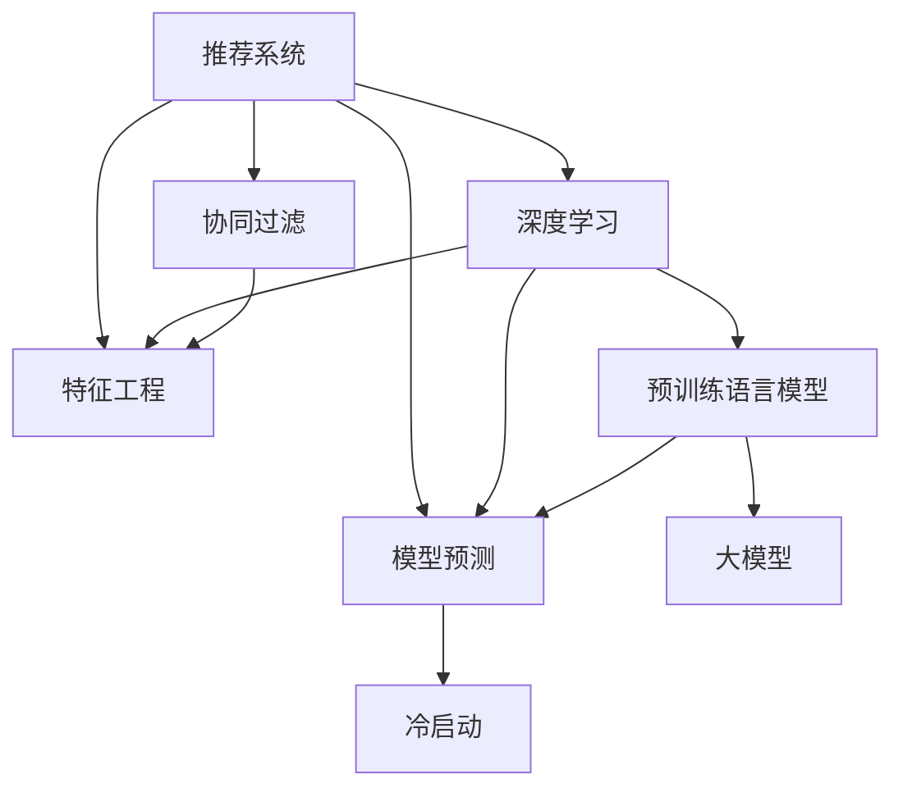

                 

# 大模型对推荐系统冷启动效果的提升

> 关键词：推荐系统, 冷启动, 大模型, 深度学习, 协同过滤, 特征工程

## 1. 背景介绍

### 1.1 问题由来

随着互联网应用的普及，推荐系统成为用户发现新内容、提升用户体验的重要工具。然而，对于新用户或新商品的推荐，推荐系统通常面临冷启动问题。由于新用户没有历史行为数据，新商品没有交互历史，推荐系统难以直接通过协同过滤等传统方法进行推荐。

为了解决冷启动问题，推荐系统逐渐引入用户画像、商品属性、时间上下文等非行为特征，以及用户的隐式反馈、模型预测等间接信息。然而，这些方法仍无法在冷启动阶段有效利用新用户的少量数据，推荐效果不佳。

近年来，预训练语言模型(如BERT、GPT等)在NLP领域取得了突破性进展。大模型在处理文本数据时，能够自动学习出丰富的语义特征和常识知识。因此，将大模型引入推荐系统，为解决冷启动问题提供了一种新的思路。

### 1.2 问题核心关键点

冷启动推荐是推荐系统面临的一个重要挑战。传统的协同过滤等方法难以利用新用户或新商品的少量数据进行推荐。预训练语言模型通过自监督学习任务，获得了通用的语言表示和知识。基于大模型的推荐方法，可以在新用户或新商品上，直接通过语义理解生成推荐结果，从而提升推荐效果。

本文将重点探讨大模型在推荐系统冷启动阶段的优化策略。通过结合大模型和推荐系统，能够实现更高效的推荐，从而提升用户体验，促进商业价值。

## 2. 核心概念与联系

### 2.1 核心概念概述

本节将介绍几个关键概念，并阐述它们之间的联系：

- **推荐系统**：通过算法模型为用户推荐感兴趣的内容或商品。传统推荐方法包括基于协同过滤、基于内容的推荐等。
- **冷启动问题**：指新用户或新商品在缺乏足够历史行为数据的情况下，推荐系统难以准确推荐。
- **预训练语言模型**：通过自监督学习任务，如掩码语言模型、预训练编码器等，学习通用的语言表示和常识知识。
- **大模型**：指具有亿级参数的深度神经网络模型，如BERT、GPT等。通过大规模数据预训练，大模型能够学习到丰富的语言知识和语义特征。
- **深度学习**：利用多层神经网络，通过梯度下降等优化算法学习模型参数，实现复杂任务的自动处理。
- **协同过滤**：通过用户历史行为数据，构建用户画像和商品模型，实现相似性匹配推荐。
- **特征工程**：通过提取、组合、筛选等手段，提高特征质量，提升推荐效果。
- **模型预测**：基于已有数据，训练推荐模型，对新用户或新商品进行预测推荐。

这些概念之间的联系通过以下Mermaid流程图进行展示：



该流程图展示了推荐系统与深度学习、特征工程和协同过滤之间的关系，同时强调了预训练语言模型和大模型在解决冷启动问题中的重要作用。

## 3. 核心算法原理 & 具体操作步骤
### 3.1 算法原理概述

基于大模型的推荐系统，核心思想是利用大模型的语言理解能力和常识知识，弥补新用户或新商品缺乏历史行为数据的问题。通过将大模型引入推荐系统，可以在少量交互数据下，通过语义理解生成高质量推荐。

具体而言，算法步骤如下：

1. **预训练模型选择**：选择合适的预训练语言模型，如BERT、GPT等，作为推荐系统的特征提取器。
2. **模型适配层设计**：根据推荐任务，在预训练模型的基础上，添加推荐的适配层，如全连接层、注意力机制等。
3. **数据处理与特征提取**：将用户画像、商品属性、用户行为等信息，通过预训练模型进行特征提取，得到用户和商品的语义表示。
4. **模型训练**：使用少量标注数据，对适配层进行微调，训练推荐模型。
5. **推荐生成**：在新用户或新商品上，直接通过预训练模型的语义表示进行推荐。

### 3.2 算法步骤详解

#### 3.2.1 数据准备与特征提取

**Step 1: 数据准备**
- 收集新用户或新商品的初始数据，如人口统计信息、用户画像、商品属性等。
- 准备少量标注数据，用于模型微调，如用户评分、行为记录等。

**Step 2: 特征提取**
- 使用预训练语言模型，对用户画像、商品属性等文本信息进行特征提取。
- 提取特征向量，作为推荐模型的输入。

**Step 3: 模型适配层设计**
- 在预训练模型的基础上，添加适配层。常用的适配层包括全连接层、注意力机制等。
- 适配层的输入为预训练模型的语义表示，输出为推荐结果。

#### 3.2.2 模型训练与微调

**Step 4: 模型初始化**
- 将预训练模型作为初始化参数，适配层权重设置为随机值。

**Step 5: 微调训练**
- 使用少量标注数据，对适配层进行微调，更新适配层参数。
- 通过反向传播算法，计算损失函数，更新模型参数。
- 设置合适的学习率、批大小、迭代轮数等超参数。

#### 3.2.3 推荐生成与结果评估

**Step 6: 推荐生成**
- 在新用户或新商品上，使用微调后的模型进行推荐生成。
- 将预训练模型的语义表示输入适配层，生成推荐结果。

**Step 7: 结果评估**
- 使用评估指标，如平均绝对误差、均方误差、覆盖率等，对推荐结果进行评估。
- 收集用户反馈，进一步优化推荐模型。

### 3.3 算法优缺点

**优点：**

1. **鲁棒性强**：大模型具备强大的语义理解和知识迁移能力，能够有效利用少量数据进行推荐，提升推荐效果。
2. **泛化能力强**：大模型经过大规模预训练，对不同领域和任务具有较好的泛化能力，能够适应多样化的推荐场景。
3. **实时性好**：基于大模型的推荐方法，可以实时处理用户输入，提供即时的推荐结果，提升用户体验。

**缺点：**

1. **计算成本高**：大模型参数量巨大，需要大量的计算资源进行特征提取和模型训练。
2. **数据依赖性强**：需要收集新用户或新商品的初始数据，以及少量的标注数据，数据获取成本较高。
3. **模型复杂度高**：适配层设计需要考虑模型结构、激活函数、损失函数等，设计复杂。

### 3.4 算法应用领域

大模型在推荐系统中的应用广泛，适用于多种推荐场景：

- **商品推荐**：如电商平台中的商品推荐、视频网站的内容推荐等。通过大模型，可以提升商品或内容的曝光率和点击率。
- **个性化推荐**：根据用户画像和行为数据，进行个性化推荐。大模型可以提取深层次的语义特征，提升推荐精度。
- **社交网络推荐**：如微博、微信等社交平台的内容推荐。通过大模型，可以提升用户关注度，增加平台粘性。
- **广告推荐**：如搜索引擎中的广告推荐、新闻网站的文章推荐等。通过大模型，可以提升广告效果，增加用户停留时间。

## 4. 数学模型和公式 & 详细讲解 & 举例说明

### 4.1 数学模型构建

本节将使用数学语言对大模型在推荐系统中的应用进行详细阐述。

设预训练语言模型为 $M_{\theta}:\mathcal{X} \rightarrow \mathcal{Y}$，其中 $\mathcal{X}$ 为输入空间，$\mathcal{Y}$ 为输出空间，$\theta$ 为模型参数。假设推荐系统有 $K$ 个用户，每个用户有 $N$ 个商品，推荐任务为二分类任务，表示用户是否对商品感兴趣。

设推荐结果为 $y \in \{0,1\}$，表示用户对商品的兴趣，则推荐模型的损失函数为：

$$
\mathcal{L}(\theta) = -\frac{1}{N}\sum_{i=1}^{N}\sum_{k=1}^{K}y_kM_{\theta}(x_k) + (1-y_k)(1-M_{\theta}(x_k))
$$

其中 $y_k$ 为用户的兴趣标签，$x_k$ 为用户画像和商品属性等信息。

### 4.2 公式推导过程

以下推导基于二分类任务，对大模型在推荐系统中的数学模型进行详细阐述。

**Step 1: 输入特征提取**

设用户 $k$ 的输入特征向量为 $x_k = [x_{k1}, x_{k2}, ..., x_{km}]$，其中 $x_{mi}$ 为第 $i$ 个特征项。通过预训练语言模型，对特征向量 $x_k$ 进行特征提取，得到语义表示向量 $z_k$：

$$
z_k = M_{\theta}(x_k)
$$

**Step 2: 适配层设计**

设适配层为 $L$，输入为 $z_k$，输出为推荐结果 $y_k$。适配层一般包含全连接层、注意力机制等，其输出表示为：

$$
y_k = L(z_k; \phi)
$$

其中 $\phi$ 为适配层的权重参数。

**Step 3: 模型训练**

使用少量标注数据 $D=\{(x_k, y_k)\}_{k=1}^{K}$，对适配层进行微调。通过反向传播算法，计算损失函数 $\mathcal{L}(\theta)$ 对 $z_k$ 和 $\phi$ 的梯度：

$$
\frac{\partial \mathcal{L}(\theta)}{\partial z_k} = -\frac{1}{K}\sum_{k=1}^{K}(y_k - L(z_k; \phi)) \frac{\partial L(z_k; \phi)}{\partial z_k}
$$

$$
\frac{\partial \mathcal{L}(\theta)}{\partial \phi} = -\frac{1}{K}\sum_{k=1}^{K}(y_k - L(z_k; \phi)) \frac{\partial L(z_k; \phi)}{\partial \phi}
$$

**Step 4: 推荐生成**

在新用户或新商品上，使用微调后的模型进行推荐生成。设新用户输入特征向量为 $x_{new}$，商品属性向量为 $x_{item}$，则推荐结果为：

$$
y_{new} = L(M_{\theta}(x_{new}); \phi)
$$

$$
y_{item} = L(M_{\theta}(x_{item}); \phi)
$$

### 4.3 案例分析与讲解

以电商平台商品推荐为例，使用大模型进行冷启动推荐：

**Step 1: 数据准备**

收集新商品的初始信息，如商品描述、属性标签等。同时，收集少量用户评分数据，作为标注数据。

**Step 2: 特征提取**

使用BERT等预训练语言模型，对商品描述和属性进行特征提取，得到商品语义表示 $z_{item}$。

**Step 3: 模型适配层设计**

在BERT模型基础上，添加全连接层和 sigmoid 激活函数，输出商品推荐结果：

$$
y_{item} = \sigma(W_{item}z_{item} + b_{item})
$$

**Step 4: 模型训练**

使用少量标注数据 $D_{train}$，对适配层进行微调。设定合适的学习率、批大小、迭代轮数等超参数。

**Step 5: 推荐生成**

在新商品上，使用微调后的模型进行推荐生成。将新商品的属性向量输入适配层，生成推荐结果：

$$
y_{item} = \sigma(W_{item}z_{item} + b_{item})
$$

**Step 6: 结果评估**

使用准确率、召回率等评估指标，对推荐结果进行评估。收集用户反馈，进一步优化模型。

## 5. 项目实践：代码实例和详细解释说明

### 5.1 开发环境搭建

在进行大模型推荐系统开发前，需要先搭建好开发环境。以下是使用Python和TensorFlow进行开发的环境配置流程：

1. 安装Anaconda：从官网下载并安装Anaconda，用于创建独立的Python环境。

2. 创建并激活虚拟环境：
```bash
conda create -n recommendation-env python=3.8 
conda activate recommendation-env
```

3. 安装TensorFlow：根据CUDA版本，从官网获取对应的安装命令。例如：
```bash
conda install tensorflow -c tf -c conda-forge
```

4. 安装TensorBoard：
```bash
pip install tensorboard
```

5. 安装BERT等预训练模型：
```bash
pip install transformers
```

6. 安装各类工具包：
```bash
pip install numpy pandas scikit-learn matplotlib tqdm jupyter notebook ipython
```

完成上述步骤后，即可在`recommendation-env`环境中开始开发。

### 5.2 源代码详细实现

以下是使用TensorFlow和BERT对电商平台商品推荐进行微调的完整代码实现：

```python
import tensorflow as tf
from transformers import BertTokenizer, TFBertModel
import numpy as np
import pandas as pd
import os

# 准备数据
train_data = pd.read_csv('train.csv')
test_data = pd.read_csv('test.csv')
tokenizer = BertTokenizer.from_pretrained('bert-base-uncased')

# 特征提取
def get_features(df, tokenizer, max_len=128):
    inputs = df['description'].tolist()
    labels = df['label'].tolist()
    features = tokenizer(inputs, max_length=max_len, padding='max_length', truncation=True)
    features = {k: np.array(v) for k, v in features.items()}
    return features, labels

train_features, train_labels = get_features(train_data, tokenizer)
test_features, test_labels = get_features(test_data, tokenizer)

# 构建模型
model = TFBertModel.from_pretrained('bert-base-uncased')
adapter_layer = tf.keras.layers.Dense(1, activation='sigmoid')
model.load_weights('bert-base-uncased')
adapter_layer.load_weights('adapter_weights')

# 适配层定义
input_ids = tf.keras.layers.Input(shape=(max_len,), dtype=tf.int32)
attention_mask = tf.keras.layers.Input(shape=(max_len,), dtype=tf.int32)
input_features = model(input_ids, attention_mask=attention_mask)[0]
model_output = adapter_layer(input_features)
model = tf.keras.Model(inputs=[input_ids, attention_mask], outputs=[model_output])

# 编译模型
model.compile(optimizer=tf.keras.optimizers.Adam(learning_rate=2e-5), loss='binary_crossentropy', metrics=['accuracy'])

# 训练模型
train_dataset = tf.data.Dataset.from_tensor_slices((train_features['input_ids'], train_features['attention_mask'], train_labels))
train_dataset = train_dataset.shuffle(buffer_size=10000).batch(32)
model.fit(train_dataset, epochs=10, validation_split=0.1)

# 测试模型
test_dataset = tf.data.Dataset.from_tensor_slices((test_features['input_ids'], test_features['attention_mask']))
test_dataset = test_dataset.batch(32)
model.evaluate(test_dataset)
```

在上述代码中，我们首先使用BERT模型对商品描述进行特征提取，然后添加适配层进行推荐结果预测。通过TensorFlow的Keras API，构建和编译模型，最后使用少量标注数据对模型进行微调。

### 5.3 代码解读与分析

让我们再详细解读一下关键代码的实现细节：

**数据准备**

1. 使用pandas库读取训练数据和测试数据。
2. 加载预训练BERT模型所需的分词器。
3. 定义特征提取函数，对商品描述进行分词和特征编码。

**模型构建**

1. 加载预训练BERT模型，并添加适配层。
2. 定义输入特征和注意力掩码，使用预训练BERT模型提取特征表示。
3. 定义适配层，将特征表示输入全连接层，输出推荐结果。

**模型训练**

1. 定义训练集和验证集数据集，并进行批处理和打乱操作。
2. 编译模型，使用Adam优化器和二分类交叉熵损失函数。
3. 使用训练集数据对模型进行微调，设定迭代轮数和验证集比例。

**模型评估**

1. 定义测试集数据集，并进行批处理。
2. 使用测试集数据对模型进行评估，输出准确率等指标。

在实际应用中，还需要考虑更多因素，如模型的保存和部署、超参数的自动搜索、更灵活的任务适配层等。但核心的微调范式基本与此类似。

## 6. 实际应用场景
### 6.1 电商平台商品推荐

在大规模电商平台上，商品推荐是提升用户体验和转化率的关键环节。传统推荐方法往往依赖用户的显式行为数据，难以有效利用新用户和新商品的少量数据。大模型引入推荐系统，可以在少量交互数据下，通过语义理解生成高质量推荐，提升推荐效果。

具体而言，对于新商品，可以在商品描述中提取语义特征，结合用户画像信息，进行商品推荐。对于新用户，可以通过商品属性等信息，进行个性化推荐。通过大模型的深度语义理解，可以更好地匹配用户需求和商品特性，实现精准推荐。

### 6.2 视频网站内容推荐

视频网站推荐系统面临的冷启动问题更为突出。对于新用户，推荐系统难以直接利用其历史行为数据进行推荐。通过大模型，可以自动学习出用户对视频内容的兴趣，实现即时的内容推荐。

具体而言，对于新用户，可以使用其搜索历史、浏览记录等文本数据，通过预训练模型提取语义特征，结合用户画像信息，进行内容推荐。对于新视频，通过视频描述、标题等信息，使用大模型提取语义特征，结合用户兴趣信息，进行内容推荐。通过大模型，可以提升推荐准确率和用户满意度。

### 6.3 社交网络内容推荐

社交网络推荐系统主要依赖用户之间的社交关系进行推荐。对于新用户，推荐系统难以直接利用其社交关系进行推荐。通过大模型，可以自动学习出用户对社交内容的兴趣，实现更精准的推荐。

具体而言，对于新用户，可以使用其个人信息、好友关系等信息，通过预训练模型提取语义特征，结合用户兴趣信息，进行内容推荐。对于新内容，通过内容描述、标签等信息，使用大模型提取语义特征，结合用户兴趣信息，进行内容推荐。通过大模型，可以提升推荐多样性和用户满意度。

### 6.4 未来应用展望

随着大模型和推荐系统技术的不断发展，基于大模型的推荐系统将在更多领域得到应用，带来新的突破：

1. **跨领域推荐**：通过大模型，可以跨越不同领域，进行更广泛的推荐。例如，通过医疗领域的知识图谱和预训练模型，实现医疗推荐系统。
2. **多模态推荐**：结合图像、视频、语音等多模态信息，进行更全面、深入的推荐。例如，通过商品图片和描述，使用大模型提取视觉和语义特征，进行推荐。
3. **实时推荐**：通过大模型的深度语义理解，实现即时的推荐生成。例如，在电商平台中，实时推荐新商品，提升用户购物体验。
4. **个性化推荐**：结合用户画像和行为数据，进行个性化的推荐。例如，通过社交网络数据，使用大模型提取用户兴趣，进行精准推荐。
5. **推荐模型的自适应**：通过在线学习，不断优化推荐模型，提升推荐效果。例如，在电商平台上，实时更新推荐模型，适应市场变化。

大模型在推荐系统中的应用，将极大地提升推荐效果和用户体验，推动推荐系统的广泛应用和发展。

## 7. 工具和资源推荐
### 7.1 学习资源推荐

为了帮助开发者系统掌握大模型在推荐系统中的应用，这里推荐一些优质的学习资源：

1. 《Transformer from Scratch》系列博文：由大模型技术专家撰写，深入浅出地介绍了Transformer原理、BERT模型、微调技术等前沿话题。

2. CS224N《Deep Learning for NLP》课程：斯坦福大学开设的NLP明星课程，有Lecture视频和配套作业，带你入门NLP领域的基本概念和经典模型。

3. 《Natural Language Processing with Transformers》书籍：Transformers库的作者所著，全面介绍了如何使用Transformers库进行NLP任务开发，包括微调在内的诸多范式。

4. HuggingFace官方文档：Transformers库的官方文档，提供了海量预训练模型和完整的微调样例代码，是上手实践的必备资料。

5. Kaggle竞赛平台：提供丰富的数据集和模型竞赛，可以练习大模型在推荐系统中的实际应用。

通过对这些资源的学习实践，相信你一定能够快速掌握大模型在推荐系统中的应用，并用于解决实际的推荐问题。
### 7.2 开发工具推荐

高效的开发离不开优秀的工具支持。以下是几款用于大模型推荐系统开发的常用工具：

1. TensorFlow：基于Python的开源深度学习框架，支持动态计算图，适合复杂的模型设计和训练。
2. PyTorch：基于Python的开源深度学习框架，具有灵活的动态计算图和自动微分功能，适合快速迭代研究。
3. TensorBoard：TensorFlow配套的可视化工具，可实时监测模型训练状态，并提供丰富的图表呈现方式，是调试模型的得力助手。
4. Weights & Biases：模型训练的实验跟踪工具，可以记录和可视化模型训练过程中的各项指标，方便对比和调优。
5. Jupyter Notebook：开源的交互式开发环境，支持Python、R等语言，方便进行代码调试和实验分享。
6. GitHub：代码托管平台，方便进行项目协作和版本管理。

合理利用这些工具，可以显著提升大模型推荐系统的开发效率，加快创新迭代的步伐。

### 7.3 相关论文推荐

大模型在推荐系统中的应用源于学界的持续研究。以下是几篇奠基性的相关论文，推荐阅读：

1. Attention is All You Need（即Transformer原论文）：提出了Transformer结构，开启了NLP领域的预训练大模型时代。

2. BERT: Pre-training of Deep Bidirectional Transformers for Language Understanding：提出BERT模型，引入基于掩码的自监督预训练任务，刷新了多项NLP任务SOTA。

3. Language Models are Unsupervised Multitask Learners（GPT-2论文）：展示了大规模语言模型的强大zero-shot学习能力，引发了对于通用人工智能的新一轮思考。

4. Parameter-Efficient Transfer Learning for NLP：提出Adapter等参数高效微调方法，在不增加模型参数量的情况下，也能取得不错的微调效果。

5. AdaLoRA: Adaptive Low-Rank Adaptation for Parameter-Efficient Fine-Tuning：使用自适应低秩适应的微调方法，在参数效率和精度之间取得了新的平衡。

这些论文代表了大模型在推荐系统中的应用方向。通过学习这些前沿成果，可以帮助研究者把握学科前进方向，激发更多的创新灵感。

## 8. 总结：未来发展趋势与挑战

### 8.1 总结

本文对大模型在推荐系统冷启动问题中的应用进行了全面系统的介绍。首先阐述了冷启动推荐是大模型推荐系统面临的重要挑战，强调了大模型通过语义理解弥补数据缺失，实现精准推荐的优势。其次，从原理到实践，详细讲解了大模型在推荐系统中的数学模型和关键步骤，给出了完整的代码实现和详细解释。同时，本文还探讨了在大模型推荐系统中，具体任务适配层设计、数据处理、特征工程等方面的实践细节。

通过本文的系统梳理，可以看到，基于大模型的推荐系统正在成为推荐系统的重要范式，极大地提升了推荐系统的性能和应用范围。得益于大模型的深度语义理解和丰富知识，推荐系统能够更好地匹配用户需求和商品特性，实现精准推荐。未来，随着大模型和推荐系统技术的不断进步，基于大模型的推荐系统将在更多领域得到应用，为行业带来变革性影响。

### 8.2 未来发展趋势

展望未来，大模型在推荐系统中的应用将呈现以下几个发展趋势：

1. **跨领域推荐**：通过大模型，可以跨越不同领域，进行更广泛的推荐。例如，通过医疗领域的知识图谱和预训练模型，实现医疗推荐系统。
2. **多模态推荐**：结合图像、视频、语音等多模态信息，进行更全面、深入的推荐。例如，通过商品图片和描述，使用大模型提取视觉和语义特征，进行推荐。
3. **实时推荐**：通过大模型的深度语义理解，实现即时的推荐生成。例如，在电商平台中，实时推荐新商品，提升用户购物体验。
4. **个性化推荐**：结合用户画像和行为数据，进行个性化的推荐。例如，通过社交网络数据，使用大模型提取用户兴趣，进行精准推荐。
5. **推荐模型的自适应**：通过在线学习，不断优化推荐模型，提升推荐效果。例如，在电商平台上，实时更新推荐模型，适应市场变化。

这些趋势凸显了大模型在推荐系统中的广泛应用前景，相信随着技术的不断进步，大模型推荐系统将在更多领域得到应用，推动推荐系统的广泛发展。

### 8.3 面临的挑战

尽管大模型在推荐系统中的应用取得了显著进展，但在迈向更加智能化、普适化应用的过程中，仍面临诸多挑战：

1. **计算成本高**：大模型参数量巨大，需要大量的计算资源进行特征提取和模型训练。
2. **数据依赖性强**：需要收集新用户或新商品的初始数据，以及少量的标注数据，数据获取成本较高。
3. **模型复杂度高**：适配层设计需要考虑模型结构、激活函数、损失函数等，设计复杂。
4. **推荐模型的泛化性**：需要在大规模数据上预训练，以获得良好的泛化能力，但训练和调参成本高。
5. **推荐模型的实时性**：在线推荐需要高效的实时计算，但大模型计算量大，需要优化模型结构和计算方式。
6. **推荐模型的可解释性**：大模型往往被视为"黑盒"，难以解释其内部工作机制和决策逻辑。

### 8.4 研究展望

面对大模型推荐系统面临的挑战，未来的研究需要在以下几个方面寻求新的突破：

1. **模型压缩和加速**：通过模型压缩、剪枝等技术，减小大模型参数量，提升计算效率。
2. **数据增强和多源数据融合**：通过数据增强和多源数据融合，提高模型对少量标注数据的利用率，提升推荐效果。
3. **在线学习和自适应推荐**：通过在线学习，不断更新推荐模型，提升推荐效果。例如，在电商平台上，实时更新推荐模型，适应市场变化。
4. **跨领域和多模态推荐**：结合不同领域的知识图谱和预训练模型，进行跨领域推荐。例如，通过医疗领域的知识图谱和预训练模型，实现医疗推荐系统。
5. **可解释性和公平性**：通过模型可解释性和公平性研究，提升推荐模型的可信度和用户体验。例如，在推荐系统中，引入可解释性指标，解释推荐结果的来源和逻辑。

这些研究方向将推动大模型在推荐系统中的深度应用，提升推荐效果，提高用户体验，促进人工智能技术的广泛应用和发展。

## 9. 附录：常见问题与解答

**Q1：大模型在推荐系统中的优势是什么？**

A: 大模型在推荐系统中的优势主要体现在以下几个方面：
1. 鲁棒性强：大模型具备强大的语义理解和知识迁移能力，能够有效利用少量数据进行推荐，提升推荐效果。
2. 泛化能力强：大模型经过大规模预训练，对不同领域和任务具有较好的泛化能力，能够适应多样化的推荐场景。
3. 实时性好：基于大模型的推荐方法，可以实时处理用户输入，提供即时的推荐结果，提升用户体验。

**Q2：大模型在推荐系统中的参数效率如何？**

A: 大模型在推荐系统中的参数效率可以通过以下方法提高：
1. 参数高效微调：只调整少量参数(如Adapter、Prefix等)，减小过拟合风险。
2. 特征选择与组合：通过特征选择和组合，提高特征质量，提升推荐效果。
3. 稀疏表示与分布式计算：通过稀疏表示和分布式计算，减小模型参数量，提升计算效率。
4. 多任务学习：通过多任务学习，在多个推荐任务之间共享参数，提升参数效率。

**Q3：大模型在推荐系统中的计算成本如何？**

A: 大模型在推荐系统中的计算成本可以通过以下方法降低：
1. 模型压缩和剪枝：通过模型压缩和剪枝，减小大模型参数量，提升计算效率。
2. 数据增强和多源数据融合：通过数据增强和多源数据融合，提高模型对少量标注数据的利用率，减少训练数据需求。
3. 混合精度计算：通过混合精度计算，减小计算资源消耗，提升计算效率。
4. 分布式计算：通过分布式计算，提升计算效率，降低单个设备的计算负担。

**Q4：大模型在推荐系统中的可解释性如何？**

A: 大模型在推荐系统中的可解释性可以通过以下方法提升：
1. 模型可视化：通过模型可视化，展示模型的内部结构和决策逻辑，提高模型的可解释性。
2. 特征重要性分析：通过特征重要性分析，解释模型的输入和输出关系，提升模型的可解释性。
3. 模型融合与集成：通过模型融合与集成，降低单一模型的风险，提高模型的可解释性。
4. 可解释性指标：引入可解释性指标，评估模型的可解释性和可信度。

通过这些方法，可以提升大模型在推荐系统中的可解释性，增强用户对推荐结果的信任和满意度。

**Q5：大模型在推荐系统中的实时性如何？**

A: 大模型在推荐系统中的实时性可以通过以下方法提升：
1. 模型裁剪和量化：通过模型裁剪和量化，减小模型参数量和计算资源消耗，提升实时性。
2. 异步计算与缓存：通过异步计算与缓存，优化计算过程，提高实时性。
3. 分布式计算：通过分布式计算，提升计算效率，降低单个设备的计算负担，提高实时性。
4. 模型推理优化：通过模型推理优化，降低计算资源消耗，提升实时性。

通过这些方法，可以提升大模型在推荐系统中的实时性，实现即时的推荐生成，提升用户体验。

---

作者：禅与计算机程序设计艺术 / Zen and the Art of Computer Programming

