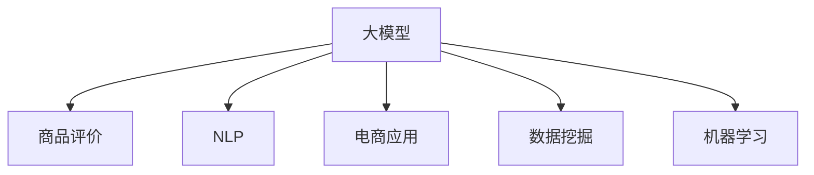

                 

# 大模型技术在电商平台商品评价分析中的应用

> 关键词：大模型,商品评价,自然语言处理(NLP),电商应用,数据挖掘,机器学习

## 1. 背景介绍

随着互联网和电商平台的快速发展，商品评价分析在电子商务中扮演着越来越重要的角色。商品评价不仅可以作为消费者消费行为和产品质量的重要参考，还是电商平台个性化推荐和广告投放的重要依据。然而，传统的基于规则和统计方法的商品评价分析，难以处理海量、非结构化、多维度的评价数据，无法挖掘出潜在的关联关系。

大模型技术以其强大的语义理解能力和模式识别能力，为商品评价分析注入了新的活力。通过在大规模语料库上进行预训练的大模型，能够自动学习语言中的复杂语义关系，并应用于商品评价文本的自动分析和理解。本节将介绍大模型技术在商品评价分析中的应用，探讨其对电商平台用户行为和商品质量的深刻洞察。

## 2. 核心概念与联系

### 2.1 核心概念概述

为更好地理解大模型在商品评价分析中的应用，本节将介绍几个密切相关的核心概念：

- **大模型(Large Model)**：指具有大量参数的神经网络模型，例如BERT、GPT-2、RoBERTa等。这些模型通过大规模数据集进行预训练，学习到丰富的语言表示。
- **商品评价(Product Review)**：指消费者对商品的质量、使用体验、性价比等进行主观评价和评论。商品评价数据是电商平台重要的信息资源，是商家改进商品和服务质量的重要依据。
- **自然语言处理(Natural Language Processing, NLP)**：指使用计算机科学和人工智能技术，处理和分析人类语言数据。大模型技术是NLP领域的重要分支，广泛应用于文本分类、情感分析、实体识别等任务。
- **电商应用(E-commerce Application)**：指电商平台中使用的各种技术手段，如推荐系统、广告投放、搜索排序等，旨在提升用户体验和增加销售量。
- **数据挖掘(Data Mining)**：指从海量数据中发现有用信息和知识的过程，包括文本挖掘、社交网络挖掘等。大模型技术在数据挖掘中起到了重要的作用，尤其在文本数据的自动分析和处理上。
- **机器学习(Machine Learning)**：指通过数据训练机器模型，实现对未知数据的预测和推理。大模型技术基于深度学习，属于机器学习的重要分支，广泛用于商品评价分析等任务。

这些核心概念之间的逻辑关系可以通过以下Mermaid流程图来展示：



这个流程图展示了大模型的核心概念及其之间的关系：

1. 大模型通过大规模数据集进行预训练，学习到丰富的语言表示。
2. 大模型应用于商品评价文本的自动分析和理解，生成高精度的文本表示。
3. 大模型在NLP、电商应用、数据挖掘和机器学习等多个领域得到广泛应用。

这些概念共同构成了大模型在商品评价分析中的技术和应用框架，使其能够在大规模数据上实现高效、准确的分析和推理。

## 3. 核心算法原理 & 具体操作步骤

### 3.1 算法原理概述

大模型在商品评价分析中的应用，主要依赖于基于自然语言处理(NLP)的文本分类、情感分析和实体识别等技术。其核心思想是：将商品评价文本输入到预训练好的大模型中，通过模型自动学习语言中的语义关系和上下文信息，进行文本表示和分析。以下是一些主要的技术原理：

- **文本分类**：将商品评价文本分为积极、中性、消极等不同类别，用于评价商品的质量和用户体验。
- **情感分析**：分析商品评价文本中的情感倾向，评估消费者的满意度。
- **实体识别**：识别商品评价文本中的命名实体，如品牌、型号、关键功能等，用于关联其他数据源。
- **关系抽取**：从商品评价文本中抽取实体之间的关系，如比较、推荐、评价等，用于生成推荐列表。
- **聚类分析**：将相似的商品评价文本聚为一类，用于商品分组和分类。

这些技术可以通过预训练好的大模型，直接应用于商品评价文本的分析和处理。

### 3.2 算法步骤详解

基于大模型的商品评价分析可以分为以下几个关键步骤：

**Step 1: 数据收集与预处理**

- 收集商品评价数据，清洗无用信息，如广告语、停用词等。
- 对文本进行分词、标准化、去除特殊符号等预处理操作。

**Step 2: 模型选择与预训练**

- 选择合适的预训练模型，如BERT、RoBERTa等。
- 对模型进行微调，使其适应商品评价数据集的特定任务。

**Step 3: 特征提取与文本表示**

- 将商品评价文本输入到大模型中，提取高维度的特征表示。
- 使用大模型提取出的特征，进行文本分类、情感分析、实体识别等任务。

**Step 4: 模型评估与优化**

- 在验证集上评估模型的性能，根据评估结果进行模型参数的调整和优化。
- 使用测试集对模型进行最终验证，确保模型在新数据上也有良好表现。

**Step 5: 应用部署**

- 将训练好的模型部署到电商平台的推荐系统、广告投放、搜索排序等模块中。
- 实时处理用户评价，生成个性化推荐和广告，提高用户体验和销售转化率。

### 3.3 算法优缺点

基于大模型的商品评价分析方法，具有以下优点：

- **高效性**：大模型能够自动学习商品评价文本中的复杂语义关系，快速进行文本分析和处理。
- **准确性**：大模型在预训练和微调过程中，能够学习到丰富的语言表示和任务知识，提供高精度的文本分类、情感分析、实体识别等结果。
- **灵活性**：大模型适用于多种电商应用场景，如推荐系统、广告投放、搜索排序等，可以根据不同的需求进行定制化应用。

同时，该方法也存在以下局限性：

- **依赖标注数据**：大模型的微调依赖于标注数据，标注数据的质量和数量对模型效果有较大影响。
- **计算资源消耗大**：大模型需要较大的计算资源，训练和推理过程可能需要高性能的GPU/TPU设备。
- **可解释性不足**：大模型通常是一个"黑盒"，难以解释其内部工作机制和决策逻辑。

尽管存在这些局限性，但就目前而言，基于大模型的商品评价分析方法仍是大模型技术在电商领域应用的重要范式。未来相关研究的重点在于如何进一步降低对标注数据的依赖，提高模型的泛化能力和可解释性，同时兼顾计算效率。

### 3.4 算法应用领域

基于大模型的商品评价分析方法，已经在电商平台的推荐系统、广告投放、搜索排序等多个领域得到广泛应用，具体如下：

**推荐系统(Recommendation System)**：通过分析用户评价，生成个性化推荐列表，提升用户体验和销售转化率。例如，Amazon的推荐系统中，商品评价文本被输入到BERT模型中，用于生成用户画像和推荐列表。

**广告投放(Advertising Campaign)**：通过分析商品评价，识别热门商品和热门关键词，优化广告投放策略。例如，Tmall的广告系统使用RoBERTa模型，对商品评价文本进行情感分析，生成广告文案。

**搜索排序(Search Ranking)**：通过分析商品评价，对搜索结果进行排序，提高搜索的精准性和用户体验。例如，阿里巴巴的搜索引擎使用XLNet模型，对商品评价进行情感分析，生成搜索结果的排序权重。

**用户画像(User Profile)**：通过分析商品评价，生成用户画像，用于个性化的推荐和服务。例如，Amazon使用BERT模型，对用户评价文本进行情感分析，生成用户画像，用于生成个性化的推荐列表。

除了这些应用场景外，大模型技术还被创新性地应用到更多领域中，如可控生成、可解释性增强、跨模态学习等，为电商平台带来了全新的突破。随着预训练模型和微调方法的不断进步，相信大模型技术将在电商领域发挥更加重要的作用。

## 4. 数学模型和公式 & 详细讲解 & 举例说明

### 4.1 数学模型构建

大模型在商品评价分析中的应用，主要依赖于自然语言处理(NLP)的文本分类、情感分析和实体识别等任务。这些任务的数学模型可以表示如下：

- **文本分类**：将商品评价文本 $x$ 映射到类别 $y$，可以使用softmax分类器，形式化地表示为：
  $$
  p(y|x) = \frac{\exp(\mathbf{w} \cdot \mathbf{x} + b)}{\sum_k \exp(\mathbf{w}_k \cdot \mathbf{x} + b_k)}
  $$
  其中 $\mathbf{w}$ 和 $b$ 为分类器的参数。

- **情感分析**：分析商品评价文本 $x$ 的情感倾向 $e$，可以使用sigmoid函数，形式化地表示为：
  $$
  p(e|x) = \frac{1}{1 + \exp(-\mathbf{w} \cdot \mathbf{x} + b)}
  $$
  其中 $\mathbf{w}$ 和 $b$ 为情感分析器的参数。

- **实体识别**：识别商品评价文本 $x$ 中的命名实体 $e$，可以使用条件随机场(CRF)模型，形式化地表示为：
  $$
  p(e|x) = \frac{\exp(\sum_{i=1}^n \mathbf{w}_i \cdot (\mathbf{x}_i - \mathbf{e}_i))}{\sum_{e'} \exp(\sum_{i=1}^n \mathbf{w}_i \cdot (\mathbf{x}_i - \mathbf{e}'_i))}
  $$
  其中 $\mathbf{x}_i$ 和 $\mathbf{e}_i$ 分别为商品评价文本和实体在模型中的表示。

### 4.2 公式推导过程

下面以BERT模型为例，具体推导一下基于大模型的情感分析公式。

假设BERT模型的预训练参数为 $\theta$，商品评价文本 $x$ 经过BERT模型处理后，得到表示向量 $h$。情感分析器的输出为 $p(e|x)$，形式化地表示为：
$$
p(e|x) = \sigma(\mathbf{w} \cdot \mathbf{h} + b)
$$
其中 $\sigma$ 为sigmoid函数，$\mathbf{w}$ 和 $b$ 为情感分析器的参数。

使用大模型的预训练参数 $\theta$，可以得到情感分析器的参数更新公式：
$$
\mathbf{w} \leftarrow \mathbf{w} - \eta \nabla_{\mathbf{w}}\mathcal{L}(\theta)
$$
$$
b \leftarrow b - \eta \nabla_{b}\mathcal{L}(\theta)
$$
其中 $\eta$ 为学习率，$\mathcal{L}(\theta)$ 为损失函数，包括交叉熵损失等。

通过上述公式，情感分析器的参数 $\mathbf{w}$ 和 $b$ 通过反向传播算法进行更新，最小化损失函数 $\mathcal{L}(\theta)$，使得模型预测输出逼近真实情感标签。

### 4.3 案例分析与讲解

下面我们以情感分析为例，给出一个具体的案例分析。

假设某电商平台收集了大量用户对商品A的评价文本，部分文本如下：

- "商品A质量很好，性价比高，推荐购买！"
- "商品A有些小瑕疵，不过不影响使用，价格还算合理。"
- "商品A很一般，不推荐购买。"
- "商品A外观不错，但功能没有描述的那么好。"

将这些评价文本作为输入，使用预训练好的BERT模型进行情感分析。BERT模型会自动学习这些文本的语义表示，并生成情感倾向的概率分布。例如，第一句评价文本 $x_1$ 经过BERT模型处理后，得到表示向量 $h_1$。情感分析器的输出为 $p(e|x_1)$，根据 sigmoid 函数，可以计算出评价文本 $x_1$ 属于积极情感的概率：

$$
p(e|x_1) = \sigma(\mathbf{w} \cdot \mathbf{h}_1 + b)
$$

同理，可以计算出其他评价文本的情感概率。最终，根据情感概率分布，可以生成商品A的情感评分和推荐列表。

## 5. 项目实践：代码实例和详细解释说明

### 5.1 开发环境搭建

在进行大模型在商品评价分析的实践时，我们需要准备好开发环境。以下是使用Python进行PyTorch开发的环境配置流程：

1. 安装Anaconda：从官网下载并安装Anaconda，用于创建独立的Python环境。

2. 创建并激活虚拟环境：
```bash
conda create -n pytorch-env python=3.8 
conda activate pytorch-env
```

3. 安装PyTorch：根据CUDA版本，从官网获取对应的安装命令。例如：
```bash
conda install pytorch torchvision torchaudio cudatoolkit=11.1 -c pytorch -c conda-forge
```

4. 安装Transformers库：
```bash
pip install transformers
```

5. 安装各类工具包：
```bash
pip install numpy pandas scikit-learn matplotlib tqdm jupyter notebook ipython
```

完成上述步骤后，即可在`pytorch-env`环境中开始大模型在商品评价分析的实践。

### 5.2 源代码详细实现

下面我们以情感分析为例，给出使用Transformers库对BERT模型进行情感分析的PyTorch代码实现。

首先，定义情感分析任务的数据处理函数：

```python
from transformers import BertTokenizer
from torch.utils.data import Dataset
import torch

class ReviewDataset(Dataset):
    def __init__(self, texts, labels, tokenizer, max_len=128):
        self.texts = texts
        self.labels = labels
        self.tokenizer = tokenizer
        self.max_len = max_len
        
    def __len__(self):
        return len(self.texts)
    
    def __getitem__(self, item):
        text = self.texts[item]
        label = self.labels[item]
        
        encoding = self.tokenizer(text, return_tensors='pt', max_length=self.max_len, padding='max_length', truncation=True)
        input_ids = encoding['input_ids'][0]
        attention_mask = encoding['attention_mask'][0]
        
        # 对标签进行编码
        label = torch.tensor(label, dtype=torch.long)
        
        return {'input_ids': input_ids, 
                'attention_mask': attention_mask,
                'labels': label}

# 标签与id的映射
label2id = {'negative': 0, 'positive': 1}
id2label = {v: k for k, v in label2id.items()}

# 创建dataset
tokenizer = BertTokenizer.from_pretrained('bert-base-cased')

train_dataset = ReviewDataset(train_texts, train_labels, tokenizer)
dev_dataset = ReviewDataset(dev_texts, dev_labels, tokenizer)
test_dataset = ReviewDataset(test_texts, test_labels, tokenizer)
```

然后，定义模型和优化器：

```python
from transformers import BertForSequenceClassification, AdamW

model = BertForSequenceClassification.from_pretrained('bert-base-cased', num_labels=2)

optimizer = AdamW(model.parameters(), lr=2e-5)
```

接着，定义训练和评估函数：

```python
from torch.utils.data import DataLoader
from tqdm import tqdm
from sklearn.metrics import accuracy_score, precision_recall_fscore_support

device = torch.device('cuda') if torch.cuda.is_available() else torch.device('cpu')
model.to(device)

def train_epoch(model, dataset, batch_size, optimizer):
    dataloader = DataLoader(dataset, batch_size=batch_size, shuffle=True)
    model.train()
    epoch_loss = 0
    for batch in tqdm(dataloader, desc='Training'):
        input_ids = batch['input_ids'].to(device)
        attention_mask = batch['attention_mask'].to(device)
        labels = batch['labels'].to(device)
        model.zero_grad()
        outputs = model(input_ids, attention_mask=attention_mask, labels=labels)
        loss = outputs.loss
        epoch_loss += loss.item()
        loss.backward()
        optimizer.step()
    return epoch_loss / len(dataloader)

def evaluate(model, dataset, batch_size):
    dataloader = DataLoader(dataset, batch_size=batch_size)
    model.eval()
    preds, labels = [], []
    with torch.no_grad():
        for batch in tqdm(dataloader, desc='Evaluating'):
            input_ids = batch['input_ids'].to(device)
            attention_mask = batch['attention_mask'].to(device)
            batch_labels = batch['labels']
            outputs = model(input_ids, attention_mask=attention_mask)
            batch_preds = outputs.logits.argmax(dim=2).to('cpu').tolist()
            batch_labels = batch_labels.to('cpu').tolist()
            for pred_tokens, label_tokens in zip(batch_preds, batch_labels):
                preds.append(pred_tokens[0])
                labels.append(label_tokens[0])
                
    print('Accuracy:', accuracy_score(labels, preds))
    print('Precision, Recall, F1 Score, Support:', precision_recall_fscore_support(labels, preds, average='macro'))

```

最后，启动训练流程并在测试集上评估：

```python
epochs = 5
batch_size = 16

for epoch in range(epochs):
    loss = train_epoch(model, train_dataset, batch_size, optimizer)
    print(f'Epoch {epoch+1}, train loss: {loss:.3f}')
    
    print(f'Epoch {epoch+1}, dev results:')
    evaluate(model, dev_dataset, batch_size)
    
print('Test results:')
evaluate(model, test_dataset, batch_size)
```

以上就是使用PyTorch对BERT进行情感分析的完整代码实现。可以看到，得益于Transformers库的强大封装，我们可以用相对简洁的代码完成BERT模型的加载和情感分析任务。

### 5.3 代码解读与分析

让我们再详细解读一下关键代码的实现细节：

**ReviewDataset类**：
- `__init__`方法：初始化文本、标签、分词器等关键组件。
- `__len__`方法：返回数据集的样本数量。
- `__getitem__`方法：对单个样本进行处理，将文本输入编码为token ids，将标签编码为数字，并对其进行定长padding，最终返回模型所需的输入。

**label2id和id2label字典**：
- 定义了标签与数字id之间的映射关系，用于将预测结果解码回真实的标签。

**训练和评估函数**：
- 使用PyTorch的DataLoader对数据集进行批次化加载，供模型训练和推理使用。
- 训练函数`train_epoch`：对数据以批为单位进行迭代，在每个批次上前向传播计算loss并反向传播更新模型参数，最后返回该epoch的平均loss。
- 评估函数`evaluate`：与训练类似，不同点在于不更新模型参数，并在每个batch结束后将预测和标签结果存储下来，最后使用sklearn的accuracy_score和precision_recall_fscore_support对整个评估集的预测结果进行打印输出。

**训练流程**：
- 定义总的epoch数和batch size，开始循环迭代
- 每个epoch内，先在训练集上训练，输出平均loss
- 在验证集上评估，输出准确率和分类指标
- 所有epoch结束后，在测试集上评估，给出最终测试结果

可以看到，PyTorch配合Transformers库使得BERT情感分析的代码实现变得简洁高效。开发者可以将更多精力放在数据处理、模型改进等高层逻辑上，而不必过多关注底层的实现细节。

当然，工业级的系统实现还需考虑更多因素，如模型的保存和部署、超参数的自动搜索、更灵活的任务适配层等。但核心的情感分析范式基本与此类似。

## 6. 实际应用场景

### 6.1 电商平台商品评价分析

基于大模型的商品评价分析技术，已经在电商平台得到了广泛的应用，具体如下：

**推荐系统(Recommendation System)**：通过分析用户评价，生成个性化推荐列表，提升用户体验和销售转化率。例如，Amazon的推荐系统中，商品评价文本被输入到BERT模型中，用于生成用户画像和推荐列表。

**广告投放(Advertising Campaign)**：通过分析商品评价，识别热门商品和热门关键词，优化广告投放策略。例如，Tmall的广告系统使用RoBERTa模型，对商品评价文本进行情感分析，生成广告文案。

**搜索排序(Search Ranking)**：通过分析商品评价，对搜索结果进行排序，提高搜索的精准性和用户体验。例如，阿里巴巴的搜索引擎使用XLNet模型，对商品评价进行情感分析，生成搜索结果的排序权重。

**用户画像(User Profile)**：通过分析商品评价，生成用户画像，用于个性化的推荐和服务。例如，Amazon使用BERT模型，对用户评价文本进行情感分析，生成用户画像，用于生成个性化的推荐列表。

除了这些应用场景外，大模型技术还被创新性地应用到更多领域中，如可控生成、可解释性增强、跨模态学习等，为电商平台带来了全新的突破。随着预训练模型和微调方法的不断进步，相信大模型技术将在电商领域发挥更加重要的作用。

### 6.2 用户反馈分析

除了商品评价分析外，大模型技术还可以应用于用户反馈分析，以提高用户满意度和平台服务质量。用户反馈通常包含用户对产品或服务的评价、建议、投诉等内容。通过分析用户反馈文本，可以发现用户的需求和问题，及时改进产品和服务。

例如，某电商平台收集了大量用户反馈，部分文本如下：

- "商品A质量很好，但是快递包装差，耽误了两天才到。"
- "商品B性价比一般，服务态度差，退换货麻烦。"
- "商品C功能很好，但是售后服务不够及时。"
- "商品D使用感受不错，但是价格比预期贵了很多。"

将这些反馈文本作为输入，使用预训练好的BERT模型进行情感分析。BERT模型会自动学习这些文本的语义表示，并生成情感倾向的概率分布。例如，第一句反馈文本 $x_1$ 经过BERT模型处理后，得到表示向量 $h_1$。情感分析器的输出为 $p(e|x_1)$，根据 sigmoid 函数，可以计算出反馈文本 $x_1$ 属于消极情感的概率：

$$
p(e|x_1) = \sigma(\mathbf{w} \cdot \mathbf{h}_1 + b)
$$

同理，可以计算出其他反馈文本的情感概率。最终，根据情感概率分布，可以生成用户反馈的情感评分和改进建议。

### 6.3 价格监测

大模型技术还可以应用于价格监测，以提高商家的竞争力和用户满意度。价格监测通常需要实时监测商品价格变动，及时调整价格策略。通过分析商品评价中的价格信息，可以发现价格异常和价格变化趋势，及时采取应对措施。

例如，某电商平台收集了大量商品评价文本，部分文本如下：

- "商品A质量很好，但是价格比竞品贵了20%。"
- "商品B最近降价了，性价比明显提高。"
- "商品C价格很合理，但是赠品不足。"
- "商品D质量很好，但是价格过高。"

将这些评价文本作为输入，使用预训练好的BERT模型进行情感分析。BERT模型会自动学习这些文本的语义表示，并生成情感倾向的概率分布。例如，第一句评价文本 $x_1$ 经过BERT模型处理后，得到表示向量 $h_1$。情感分析器的输出为 $p(e|x_1)$，根据 sigmoid 函数，可以计算出评价文本 $x_1$ 属于消极情感的概率：

$$
p(e|x_1) = \sigma(\mathbf{w} \cdot \mathbf{h}_1 + b)
$$

同理，可以计算出其他评价文本的情感概率。最终，根据情感概率分布，可以生成商品价格的情感评分和价格策略建议。

### 6.4 未来应用展望

随着大模型技术的发展，基于大模型的商品评价分析技术将在更多领域得到应用，为电商平台带来更大的价值。以下是一些未来的应用方向：

**多模态商品评价分析**：大模型技术可以应用于图像、视频等多模态商品评价分析，提升对商品质量、功能和用户体验的全面理解。例如，将商品图片、视频等多模态数据与文本数据结合，使用多模态大模型进行综合分析。

**情感分类与主题分析**：除了情感分析，大模型技术还可以应用于主题分类和情感分类，提高商品评价文本的语义理解和分析精度。例如，使用主题分类模型，将商品评价文本分类为不同主题，如品质、功能、服务、价格等，用于生成不同维度的商品画像。

**交互式商品评价生成**：大模型技术可以用于生成交互式商品评价，提升用户评价的丰富性和准确性。例如，使用生成式大模型，根据用户输入的关键词，生成多样化的商品评价文本，用于填补数据空缺或进行自动补全。

**可解释性增强**：大模型技术可以应用于商品评价的可解释性增强，提高模型的可解释性和可信度。例如，使用可解释性模型，分析商品评价中的关键特征和因果关系，生成用户画像和推荐列表。

这些方向将进一步拓展大模型在商品评价分析中的应用，推动电商平台的智能化和个性化发展。相信随着技术的不断进步，大模型技术将在电商领域发挥更加重要的作用。

## 7. 工具和资源推荐

### 7.1 学习资源推荐

为了帮助开发者系统掌握大模型在商品评价分析的理论基础和实践技巧，这里推荐一些优质的学习资源：

1. 《Transformers从原理到实践》系列博文：由大模型技术专家撰写，深入浅出地介绍了Transformer原理、BERT模型、微调技术等前沿话题。

2. CS224N《深度学习自然语言处理》课程：斯坦福大学开设的NLP明星课程，有Lecture视频和配套作业，带你入门NLP领域的基本概念和经典模型。

3. 《Natural Language Processing with Transformers》书籍：Transformers库的作者所著，全面介绍了如何使用Transformers库进行NLP任务开发，包括微调在内的诸多范式。

4. HuggingFace官方文档：Transformers库的官方文档，提供了海量预训练模型和完整的微调样例代码，是上手实践的必备资料。

5. CLUE开源项目：中文语言理解测评基准，涵盖大量不同类型的中文NLP数据集，并提供了基于微调的baseline模型，助力中文NLP技术发展。

通过对这些资源的学习实践，相信你一定能够快速掌握大模型在商品评价分析的精髓，并用于解决实际的NLP问题。

### 7.2 开发工具推荐

高效的开发离不开优秀的工具支持。以下是几款用于大模型在商品评价分析开发的常用工具：

1. PyTorch：基于Python的开源深度学习框架，灵活动态的计算图，适合快速迭代研究。大部分预训练语言模型都有PyTorch版本的实现。

2. TensorFlow：由Google主导开发的开源深度学习框架，生产部署方便，适合大规模工程应用。同样有丰富的预训练语言模型资源。

3. Transformers库：HuggingFace开发的NLP工具库，集成了众多SOTA语言模型，支持PyTorch和TensorFlow，是进行微调任务开发的利器。

4. Weights & Biases：模型训练的实验跟踪工具，可以记录和可视化模型训练过程中的各项指标，方便对比和调优。与主流深度学习框架无缝集成。

5. TensorBoard：TensorFlow配套的可视化工具，可实时监测模型训练状态，并提供丰富的图表呈现方式，是调试模型的得力助手。

6. Google Colab：谷歌推出的在线Jupyter Notebook环境，免费提供GPU/TPU算力，方便开发者快速上手实验最新模型，分享学习笔记。

合理利用这些工具，可以显著提升大模型在商品评价分析的开发效率，加快创新迭代的步伐。

### 7.3 相关论文推荐

大模型技术在商品评价分析领域的研究主要集中在以下几个方面：

1. Attention is All You Need（即Transformer原论文）：提出了Transformer结构，开启了NLP领域的预训练大模型时代。

2. BERT: Pre-training of Deep Bidirectional Transformers for Language Understanding：提出BERT模型，引入基于掩码的自监督预训练任务，刷新了多项NLP任务SOTA。

3. Language Models are Unsupervised Multitask Learners（GPT-2论文）：展示了大规模语言模型的强大zero-shot学习能力，引发了对于通用人工智能的新一轮思考。

4. Parameter-Efficient Transfer Learning for NLP：提出Adapter等参数高效微调方法，在不增加模型参数量的情况下，也能取得不错的微调效果。

5. Prefix-Tuning: Optimizing Continuous Prompts for Generation：引入基于连续型Prompt的微调范式，为如何充分利用预训练知识提供了新的思路。

6. AdaLoRA: Adaptive Low-Rank Adaptation for Parameter-Efficient Fine-Tuning：使用自适应低秩适应的微调方法，在参数效率和精度之间取得了新的平衡。

这些论文代表了大模型在商品评价分析领域的研究进展。通过学习这些前沿成果，可以帮助研究者把握学科前进方向，激发更多的创新灵感。

## 8. 总结：未来发展趋势与挑战

### 8.1 总结

本文对基于大模型的商品评价分析方法进行了全面系统的介绍。首先阐述了大模型在商品评价分析中的应用背景和意义，明确了商品评价分析在电商平台中的重要地位。其次，从原理到实践，详细讲解了基于大模型的商品评价分析的数学原理和关键步骤，给出了商品评价分析任务开发的完整代码实例。同时，本文还广泛探讨了商品评价分析方法在电商平台用户行为分析、广告投放、搜索排序等多个领域的应用前景，展示了基于大模型的商品评价分析技术的巨大潜力。此外，本文精选了商品评价分析技术的各类学习资源，力求为读者提供全方位的技术指引。

通过本文的系统梳理，可以看到，基于大模型的商品评价分析方法正在成为电商平台商品评价分析的重要范式，极大地拓展了商品评价分析的技术边界，提升了商品评价分析的精度和效率。随着预训练模型和微调方法的不断进步，相信基于大模型的商品评价分析技术将在电商平台落地应用，成为电商运营的重要工具。未来，伴随大模型技术的进一步发展和应用，相信大模型技术将在更多领域得到广泛应用，推动电商平台的智能化和个性化发展。

### 8.2 未来发展趋势

展望未来，基于大模型的商品评价分析技术将呈现以下几个发展趋势：

1. **模型规模持续增大**：随着算力成本的下降和数据规模的扩张，预训练语言模型的参数量还将持续增长。超大规模语言模型蕴含的丰富语言知识，有望支撑更加复杂多变的商品评价分析任务。

2. **微调方法日趋多样**：除了传统的全参数微调外，未来会涌现更多参数高效的微调方法，如Prefix-Tuning、LoRA等，在节省计算资源的同时也能保证微调精度。

3. **持续学习成为常态**：随着数据分布的不断变化，微调模型也需要持续学习新知识以保持性能。如何在不遗忘原有知识的同时，高效吸收新样本信息，将成为重要的研究课题。

4. **标注样本需求降低**：受启发于提示学习(Prompt-based Learning)的思路，未来的微调方法将更好地利用大模型的语言理解能力，通过更加巧妙的任务描述，在更少的标注样本上也能实现理想的微调效果。

5. **多模态微调崛起**：当前微调主要聚焦于纯文本数据，未来会进一步拓展到图像、视频、语音等多模态数据微调。多模态信息的融合，将显著提升语言模型对现实世界的理解和建模能力。

6. **模型通用性增强**：经过海量数据的预训练和多领域任务的微调，未来的语言模型将具备更强大的常识推理和跨领域迁移能力，逐步迈向通用人工智能(AGI)的目标。

以上趋势凸显了大模型在商品评价分析技术的广阔前景。这些方向的探索发展，必将进一步提升商品评价分析的性能和应用范围，为电商平台带来更大的价值。

### 8.3 面临的挑战

尽管基于大模型的商品评价分析技术已经取得了显著成就，但在迈向更加智能化、普适化应用的过程中，它仍面临诸多挑战：

1. **标注成本瓶颈**：尽管微调大幅降低了标注数据的需求，但对于长尾应用场景，难以获得充足的高质量标注数据，成为制约微调性能的瓶颈。如何进一步降低微调对标注样本的依赖，将是一大难题。

2. **模型鲁棒性不足**：当前微调模型面对域外数据时，泛化性能往往大打折扣。对于测试样本的微小扰动，微调模型的预测也容易发生波动。如何提高微调模型的鲁棒性，避免灾难性遗忘，还需要更多理论和实践的积累。

3. **推理效率有待提高**：大规模语言模型虽然精度高，但在实际部署时往往面临推理速度慢、内存占用大等效率问题。如何在保证性能的同时，简化模型结构，提升推理速度，优化资源占用，将是重要的优化方向。

4. **可解释性亟需加强**：当前微调模型更像是"黑盒"系统，难以解释其内部工作机制和决策逻辑。对于医疗、金融等高风险应用，算法的可解释性和可审计性尤为重要。如何赋予微调模型更强的可解释性，将是亟待攻克的难题。

5. **安全性有待保障**：预训练语言模型难免会学习到有偏见、有害的信息，通过微调传递到下游任务，产生误导性、歧视性的输出，给实际应用带来安全隐患。如何从数据和算法层面消除模型偏见，避免恶意用途，确保输出的安全性，也将是重要的研究课题。

6. **知识整合能力不足**：现有的微调模型往往局限于任务内数据，难以灵活吸收和运用更广泛的先验知识。如何让微调过程更好地与外部知识库、规则库等专家知识结合，形成更加全面、准确的信息整合能力，还有很大的想象空间。

正视微调面临的这些挑战，积极应对并寻求突破，将是大模型技术在商品评价分析中走向成熟的必由之路。相信随着学界和产业界的共同努力，这些挑战终将一一被克服，大模型技术将在商品评价分析领域发挥更加重要的作用。

### 8.4 研究展望

面对大模型在商品评价分析所面临的种种挑战，未来的研究需要在以下几个方面寻求新的突破：

1. **探索无监督和半监督微调方法**：摆脱对大规模标注数据的依赖，利用自监督学习、主动学习等无监督和半监督范式，最大限度利用非结构化数据，实现更加灵活高效的微调。

2. **研究参数高效和计算高效的微调范式**：开发更加参数高效的微调方法，在固定大部分预训练参数的同时，只更新极少量的任务相关参数。同时优化微调模型的计算图，减少前向传播和反向传播的资源消耗，实现更加轻量级、实时性的部署。

3. **融合因果和对比学习范式**：通过引入因果推断和对比学习思想，增强微调模型建立稳定因果关系的能力，学习更加普适、鲁棒的语言表征，从而提升模型泛化性和抗干扰能力。

4. **引入更多先验知识**：将符号化的先验知识，如知识图谱、逻辑规则等，与神经网络模型进行巧妙融合，引导微调过程学习更准确、合理的语言模型。同时加强不同模态数据的整合，实现视觉、语音等多模态信息与文本信息的协同建模。

5. **结合因果分析和博弈论工具**：将因果分析方法引入微调模型，识别出模型决策的关键特征，增强输出解释的因果性和逻辑性。借助博弈论工具刻画人机交互过程，主动探索并规避模型的脆弱点，提高系统稳定性。

6. **纳入伦理道德约束**：在模型训练目标中引入伦理导向的评估指标，过滤和惩罚有偏见、有害的输出倾向。同时加强人工干预和审核，建立模型行为的监管机制，确保输出符合人类价值观和伦理道德。

这些研究方向的探索，必将引领大模型在商品评价分析技术迈向更高的台阶，为电商平台带来更大的价值。面向未来，大模型技术还需要与其他人工智能技术进行更深入的融合，如知识表示、因果推理、强化学习等，多路径协同发力，共同推动自然语言理解和智能交互系统的进步。只有勇于创新、敢于突破，才能不断拓展语言模型的边界，让智能技术更好地造福人类社会。

## 9. 附录：常见问题与解答

**Q1：大模型在商品评价分析中的应用是否仅限于文本数据？**

A: 大模型在商品评价分析中的应用主要依赖于自然语言处理(NLP)技术，即通过分析商品评价文本的语义和情感信息，生成高精度的文本表示。虽然文本数据是最常见的商品评价数据形式，但大模型也可以应用于图像、视频等多模态数据，通过多模态融合的方式，进一步提升商品评价分析的精度和深度。

**Q2：如何选择合适的预训练模型？**

A: 选择合适的预训练模型是商品评价分析任务成功的关键。通常情况下，建议选择在大规模语料库上进行预训练的模型，如BERT、RoBERTa、XLNet等。这些模型具有较强的语义理解能力和泛化能力，能够在商品评价分析任务中取得较好的效果。

**Q3：大模型的推理效率是否满足电商应用的需求？**

A: 大模型在推理效率上可能存在一定瓶颈，尤其是在大规模文本数据上的处理。为解决这一问题，可以采用以下措施：1) 使用参数高效的微调方法，如Prefix-Tuning、LoRA等，以减少模型参数量，提高推理效率。2) 采用多模态融合的方式，将图像、视频等多模态数据与文本数据结合，提高商品评价分析的精度和深度。3) 优化模型的计算图，减少前向传播和反向传播的资源消耗，实现更加轻量级、实时性的部署。

**Q4：大模型在商品评价分析中的应用是否存在安全性问题？**

A: 大模型在商品评价分析中的应用确实存在安全性问题，尤其是当模型学习到有偏见、有害的信息时，可能对商品评价产生误导性、歧视性的输出。为应对这一问题，可以采取以下措施：1) 在模型训练目标中引入伦理导向的评估指标，过滤和惩罚有偏见、有害的输出倾向。2) 加强人工干预和审核，建立模型行为的监管机制，确保输出符合人类价值观和伦理道德。3) 采用可解释性模型，分析商品评价中的关键特征和因果关系，生成用户画像和推荐列表，提高模型的可信度。

**Q5：大模型在商品评价分析中的应用是否仅限于电商领域？**

A: 大模型在商品评价分析中的应用不仅限于电商领域，还可以扩展到其他领域，如医疗、金融、教育等。在这些领域中，商品评价文本通常包含对产品或服务的评价、建议、投诉等内容，通过分析这些文本，可以发现用户的需求和问题，及时改进产品和服务，提升用户体验和满意度。

通过本文的系统梳理，可以看到，基于大模型的商品评价分析方法正在成为电商平台商品评价分析的重要范式，极大地拓展了商品评价分析的技术边界，提升了商品评价分析的精度和效率。随着预训练模型和微调方法的不断进步，相信基于大模型的商品评价分析技术将在电商平台落地应用，成为电商运营的重要工具。未来，伴随大模型技术的进一步发展和应用，相信大模型技术将在更多领域得到广泛应用，推动电商平台的智能化和个性化发展。

---

作者：禅与计算机程序设计艺术 / Zen and the Art of Computer Programming

