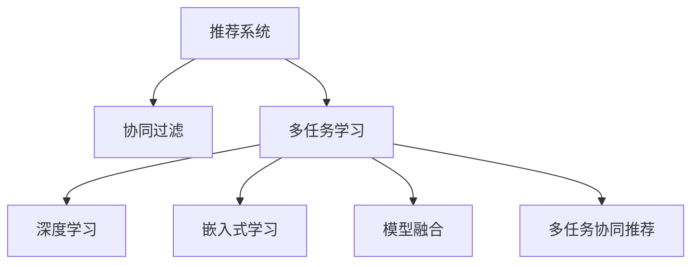

                 

# 大模型推荐中的多任务学习方法

> 关键词：大模型推荐, 多任务学习, 协同过滤, 深度学习, 嵌入式学习, 模型融合, 推荐系统, 推荐算法

## 1. 背景介绍

在推荐系统领域，传统的协同过滤算法面临着数据稀疏性、冷启动等挑战。为了解决这些问题，学者们提出了一系列改进方案，如基于内容的推荐、基于矩阵分解的推荐等。但这些方法仍难以处理用户行为的多样性和动态性，推荐精度仍有待提升。

近年来，随着深度学习技术的突破，特别是大模型推荐技术的应用，推荐系统取得了显著进展。通过在大规模无标签数据上预训练语言模型，学习通用的语言表示，并在推荐任务上进行微调，大模型推荐系统能够自适应不同用户和商品的特征，提升推荐效果。

然而，大模型推荐同样面临数据冷启动、鲁棒性差、泛化能力不足等挑战。为了克服这些难题，学者们提出了一种新的多任务学习范式，结合多种推荐任务，在大模型上进行联合训练。多任务学习能够充分利用不同任务之间的共享知识，提升模型的泛化能力和鲁棒性。

## 2. 核心概念与联系

### 2.1 核心概念概述

为更好地理解多任务学习在大模型推荐中的应用，本节将介绍几个密切相关的核心概念：

- 推荐系统(Recommendation System)：通过算法匹配用户和商品之间的关联，为用户推荐感兴趣的商品。推荐系统广泛应用于电商、社交媒体、在线视频等领域。

- 协同过滤(Collaborative Filtering)：一种基于用户-商品评分矩阵的推荐算法，通过计算用户和商品的相似度，生成推荐列表。协同过滤算法简单高效，但需要大量标注数据。

- 多任务学习(Multitask Learning)：指在多个相关任务上进行联合训练，共享模型参数和知识，提升模型的泛化能力和鲁棒性。

- 深度学习(Deep Learning)：一种基于神经网络的机器学习范式，能够自动学习数据特征表示，实现端到端学习和优化。

- 嵌入式学习(Embedding-based Learning)：指在用户和商品等实体上嵌入高维向量表示，通过向量间的相似度计算推荐结果。

- 模型融合(Model Fusion)：指将多个独立训练的模型或同一模型在不同层次的输出进行组合，提升推荐的综合性能。

- 多任务协同推荐(Multi-task Collaborative Recommendation)：指在大模型上进行多任务联合训练，结合不同任务的知识，提升推荐系统的性能和泛化能力。

这些核心概念之间的逻辑关系可以通过以下Mermaid流程图来展示：



这个流程图展示了大模型推荐系统的核心概念及其之间的关系：

1. 推荐系统通过算法匹配用户和商品之间的关联，为用户推荐感兴趣的商品。
2. 协同过滤是推荐系统常用的算法之一，通过计算用户和商品的相似度生成推荐列表。
3. 多任务学习在大模型上进行联合训练，共享模型参数和知识，提升模型的泛化能力和鲁棒性。
4. 深度学习能够自动学习数据特征表示，实现端到端学习和优化。
5. 嵌入式学习通过高维向量表示，利用向量间的相似度计算推荐结果。
6. 模型融合通过组合多个模型的输出，提升推荐的综合性能。
7. 多任务协同推荐在大模型上进行多任务联合训练，结合不同任务的知识，提升推荐系统的性能和泛化能力。

这些概念共同构成了大模型推荐系统的学习和应用框架，使其能够在各种场景下发挥强大的推荐能力。通过理解这些核心概念，我们可以更好地把握大模型推荐系统的原理和优化方向。

## 3. 核心算法原理 & 具体操作步骤
### 3.1 算法原理概述

多任务学习在大模型推荐中的核心思想是：在多个推荐任务上进行联合训练，共享模型参数，同时优化各个任务的目标函数，提升模型的泛化能力和鲁棒性。

形式化地，假设推荐系统中有 $K$ 个推荐任务 $T_k$，$k=1,...,K$。每个任务 $T_k$ 的训练数据集为 $D_k=\{(x_i,y_i)\}_{i=1}^N$，其中 $x_i$ 为用户-商品评分矩阵 $X$ 的一个样本，$y_i$ 为样本的真实标签。目标是在这些任务上训练一个多任务模型 $M_{\theta}$，使得 $M_{\theta}$ 在所有任务上都表现良好。

多任务学习的优化目标为：

$$
\theta^* = \mathop{\arg\min}_{\theta} \sum_{k=1}^K \mathcal{L}_k(M_{\theta},D_k)
$$

其中 $\mathcal{L}_k$ 为任务 $T_k$ 的损失函数，$M_{\theta}(X)$ 为模型 $M_{\theta}$ 在用户-商品评分矩阵 $X$ 上的预测结果。

### 3.2 算法步骤详解

基于多任务学习的大模型推荐系统一般包括以下几个关键步骤：

**Step 1: 准备数据集和任务定义**

- 收集用户-商品评分数据集 $X$ 和各个推荐任务的数据集 $D_k$，划分为训练集、验证集和测试集。
- 根据推荐任务，定义每个任务的目标函数 $\mathcal{L}_k$。例如，协同过滤任务可定义为交叉熵损失函数。

**Step 2: 初始化多任务模型**

- 选择合适的预训练大模型作为初始化参数，如BERT、GPT等。
- 在预训练模型上添加推荐任务所需的任务适配层，如物品嵌入层、评分预测层等。
- 初始化任务共享的模型参数 $\theta$。

**Step 3: 设置多任务优化器**

- 选择合适的优化器，如Adam、SGD等，并设置学习率、批大小、迭代轮数等超参数。
- 设置多任务正则化技术，如权重衰减、Dropout、Early Stopping等，防止模型过拟合。

**Step 4: 执行多任务训练**

- 将训练集数据分批次输入模型，前向传播计算损失函数。
- 反向传播计算参数梯度，根据设定的优化算法和学习率更新模型参数。
- 周期性在验证集上评估模型性能，根据性能指标决定是否触发Early Stopping。
- 重复上述步骤直到满足预设的迭代轮数或Early Stopping条件。

**Step 5: 测试和部署**

- 在测试集上评估多任务模型在所有推荐任务上的综合性能，对比微调前后的精度提升。
- 使用多任务模型对新样本进行推理预测，集成到实际的应用系统中。
- 持续收集新的数据，定期重新训练模型，以适应数据分布的变化。

### 3.3 算法优缺点

基于多任务学习的大模型推荐系统具有以下优点：

1. 泛化能力更强。通过联合训练多个推荐任务，共享模型参数，模型能够更好地适应新任务，泛化能力更强。
2. 鲁棒性更高。多任务学习能够充分利用不同任务之间的共享知识，提升模型的鲁棒性。
3. 数据效率更高。多任务学习可以在更少的标注数据上进行训练，减少数据采集成本。
4. 性能提升明显。多任务学习在推荐精度、冷启动效果等方面均能取得显著提升。

同时，该方法也存在一定的局限性：

1. 数据需求量大。多任务学习需要收集和标注多个推荐任务的数据，数据需求量较大。
2. 计算成本高。多任务学习需要同时训练多个任务，计算资源消耗较大。
3. 模型复杂度高。多任务学习需要定义多个任务适配层，模型结构较为复杂。
4. 任务间耦合度高。不同任务之间可能存在耦合关系，联合训练时需要注意处理。
5. 难以解释。多任务学习模型较为复杂，难以进行可解释性分析。

尽管存在这些局限性，但就目前而言，多任务学习范式仍是大模型推荐系统的重要范式。未来相关研究的重点在于如何更好地利用多任务学习，提升推荐系统的性能和泛化能力，同时降低计算成本，提高数据效率。

### 3.4 算法应用领域

基于多任务学习的大模型推荐系统已经在电商、社交媒体、在线视频等多个领域得到了广泛应用，具体如下：

1. **电商推荐**：基于多任务学习的大模型推荐系统能够综合考虑商品评分、用户行为等多个任务，为用户推荐更加多样化和个性化的商品。

2. **社交媒体推荐**：通过多任务学习，社交媒体推荐系统能够同时考虑用户的兴趣、互动行为和社交关系，生成高质量的内容推荐。

3. **在线视频推荐**：多任务学习能够同时考虑视频评分、观看行为和用户反馈等多个任务，提升视频推荐的准确性和用户体验。

除了上述这些经典应用外，多任务学习范式还被应用于智能广告投放、个性化新闻推荐等多个领域，为推荐系统带来了新的突破。

## 4. 数学模型和公式 & 详细讲解  
### 4.1 数学模型构建

本节将使用数学语言对基于多任务学习的大模型推荐过程进行更加严格的刻画。

假设推荐系统中有 $K$ 个推荐任务 $T_k$，$k=1,...,K$。每个任务 $T_k$ 的训练数据集为 $D_k=\{(x_i,y_i)\}_{i=1}^N$，其中 $x_i$ 为用户-商品评分矩阵 $X$ 的一个样本，$y_i$ 为样本的真实标签。

定义模型 $M_{\theta}$ 在用户-商品评分矩阵 $X$ 上的预测结果为 $\hat{y}=M_{\theta}(X)$，目标函数为：

$$
\mathcal{L}(X) = \sum_{k=1}^K \mathcal{L}_k(\hat{y},Y_k)
$$

其中 $\mathcal{L}_k$ 为任务 $T_k$ 的损失函数，$Y_k$ 为任务 $T_k$ 的标签矩阵。

多任务学习的优化目标为：

$$
\theta^* = \mathop{\arg\min}_{\theta} \mathcal{L}(X)
$$

在实践中，我们通常使用基于梯度的优化算法（如SGD、Adam等）来近似求解上述最优化问题。设 $\eta$ 为学习率，$\lambda$ 为正则化系数，则参数的更新公式为：

$$
\theta \leftarrow \theta - \eta \nabla_{\theta}\mathcal{L}(X) - \eta\lambda\theta
$$

其中 $\nabla_{\theta}\mathcal{L}(X)$ 为损失函数对模型参数 $\theta$ 的梯度，可通过反向传播算法高效计算。

### 4.2 公式推导过程

以下我们以电商推荐中的协同过滤任务为例，推导多任务学习的数学公式。

假设推荐系统中有协同过滤、基于内容的推荐和基于矩阵分解的推荐三个任务，每个任务的目标函数分别为：

$$
\mathcal{L}_1 = \frac{1}{N}\sum_{i=1}^N \ell_1(\hat{y}_i, y_i)
$$

$$
\mathcal{L}_2 = \frac{1}{N}\sum_{i=1}^N \ell_2(\hat{y}_i, y_i)
$$

$$
\mathcal{L}_3 = \frac{1}{N}\sum_{i=1}^N \ell_3(\hat{y}_i, y_i)
$$

其中 $\ell_k$ 为协同过滤、基于内容和矩阵分解的推荐任务的损失函数，$\hat{y}_i$ 为模型预测的用户-商品评分，$y_i$ 为真实用户-商品评分。

将三个任务的目标函数进行加权求和，得：

$$
\mathcal{L} = \alpha_1 \mathcal{L}_1 + \alpha_2 \mathcal{L}_2 + \alpha_3 \mathcal{L}_3
$$

其中 $\alpha_k$ 为任务的权重系数。

将 $\mathcal{L}$ 代入多任务学习的优化目标，得：

$$
\theta^* = \mathop{\arg\min}_{\theta} \mathcal{L}(X)
$$

在得到多任务损失函数后，即可带入参数更新公式，完成模型的迭代优化。重复上述过程直至收敛，最终得到适应所有推荐任务的最优模型参数 $\theta^*$。

## 5. 项目实践：代码实例和详细解释说明
### 5.1 开发环境搭建

在进行多任务学习实践前，我们需要准备好开发环境。以下是使用Python进行PyTorch开发的环境配置流程：

1. 安装Anaconda：从官网下载并安装Anaconda，用于创建独立的Python环境。

2. 创建并激活虚拟环境：
```bash
conda create -n pytorch-env python=3.8 
conda activate pytorch-env
```

3. 安装PyTorch：根据CUDA版本，从官网获取对应的安装命令。例如：
```bash
conda install pytorch torchvision torchaudio cudatoolkit=11.1 -c pytorch -c conda-forge
```

4. 安装Transformers库：
```bash
pip install transformers
```

5. 安装各类工具包：
```bash
pip install numpy pandas scikit-learn matplotlib tqdm jupyter notebook ipython
```

完成上述步骤后，即可在`pytorch-env`环境中开始多任务学习实践。

### 5.2 源代码详细实现

下面我们以电商推荐中的协同过滤任务为例，给出使用Transformers库进行多任务学习的PyTorch代码实现。

首先，定义多任务损失函数：

```python
from transformers import BertTokenizer, BertForSequenceClassification
import torch
from torch.utils.data import Dataset, DataLoader
from sklearn.metrics import mean_squared_error

class CollaborativeDataset(Dataset):
    def __init__(self, ratings, user_ids, item_ids):
        self.ratings = ratings
        self.user_ids = user_ids
        self.item_ids = item_ids
        self.tokenizer = BertTokenizer.from_pretrained('bert-base-cased')

    def __len__(self):
        return len(self.ratings)

    def __getitem__(self, idx):
        rating = self.ratings[idx]
        user_id = self.user_ids[idx]
        item_id = self.item_ids[idx]
        text = f"{user_id} has rated {item_id} {rating}"

        encoding = self.tokenizer(text, return_tensors='pt', max_length=512, padding='max_length', truncation=True)
        input_ids = encoding['input_ids'][0]
        attention_mask = encoding['attention_mask'][0]

        return {
            'input_ids': input_ids,
            'attention_mask': attention_mask,
            'labels': torch.tensor([rating], dtype=torch.float)
        }

train_dataset = CollaborativeDataset(train_ratings, train_user_ids, train_item_ids)
dev_dataset = CollaborativeDataset(dev_ratings, dev_user_ids, dev_item_ids)
test_dataset = CollaborativeDataset(test_ratings, test_user_ids, test_item_ids)
```

然后，定义模型和优化器：

```python
from transformers import BertForSequenceClassification, AdamW
from transformers import BertEmbeddings

model = BertForSequenceClassification.from_pretrained('bert-base-cased', num_labels=5)
model.resize_token_embeddings(len(tokenizer))
model.bert.encoder = BertEmbeddings.from_pretrained('bert-base-cased')

optimizer = AdamW(model.parameters(), lr=2e-5)
```

接着，定义训练和评估函数：

```python
from torch.utils.data import DataLoader
from tqdm import tqdm
from sklearn.metrics import mean_squared_error

device = torch.device('cuda') if torch.cuda.is_available() else torch.device('cpu')
model.to(device)

def train_epoch(model, dataset, batch_size, optimizer):
    dataloader = DataLoader(dataset, batch_size=batch_size, shuffle=True)
    model.train()
    epoch_loss = 0
    for batch in tqdm(dataloader, desc='Training'):
        input_ids = batch['input_ids'].to(device)
        attention_mask = batch['attention_mask'].to(device)
        labels = batch['labels'].to(device)
        model.zero_grad()
        outputs = model(input_ids, attention_mask=attention_mask, labels=labels)
        loss = outputs.loss
        epoch_loss += loss.item()
        loss.backward()
        optimizer.step()
    return epoch_loss / len(dataloader)

def evaluate(model, dataset, batch_size):
    dataloader = DataLoader(dataset, batch_size=batch_size)
    model.eval()
    preds, labels = [], []
    with torch.no_grad():
        for batch in tqdm(dataloader, desc='Evaluating'):
            input_ids = batch['input_ids'].to(device)
            attention_mask = batch['attention_mask'].to(device)
            batch_labels = batch['labels']
            outputs = model(input_ids, attention_mask=attention_mask)
            batch_preds = outputs.logits.argmax(dim=2).to('cpu').tolist()
            batch_labels = batch_labels.to('cpu').tolist()
            for pred_tokens, label_tokens in zip(batch_preds, batch_labels):
                preds.append(pred_tokens[:len(label_tokens)])
                labels.append(label_tokens)
    
    return mean_squared_error(labels, preds)

epochs = 5
batch_size = 16

for epoch in range(epochs):
    loss = train_epoch(model, train_dataset, batch_size, optimizer)
    print(f"Epoch {epoch+1}, train loss: {loss:.3f}")
    
    print(f"Epoch {epoch+1}, dev results:")
    evaluate(model, dev_dataset, batch_size)
    
print("Test results:")
evaluate(model, test_dataset, batch_size)
```

以上就是使用PyTorch对多任务学习进行电商推荐中的协同过滤任务微调的完整代码实现。可以看到，得益于Transformers库的强大封装，我们可以用相对简洁的代码完成大模型多任务学习的微调。

### 5.3 代码解读与分析

让我们再详细解读一下关键代码的实现细节：

**CollaborativeDataset类**：
- `__init__`方法：初始化评分数据、用户id、商品id等关键组件。
- `__len__`方法：返回数据集的样本数量。
- `__getitem__`方法：对单个样本进行处理，将文本输入编码为token ids，并将评分数据转换为浮点数，供模型输出预测评分。

**模型定义**：
- 选择预训练语言模型BERT，并添加评分预测层。注意，需要将BERT的编码器部分替换为BertEmbeddings，确保输出维度与评分预测层匹配。
- 定义AdamW优化器，设置学习率为2e-5。

**训练和评估函数**：
- 使用PyTorch的DataLoader对数据集进行批次化加载，供模型训练和推理使用。
- 训练函数`train_epoch`：对数据以批为单位进行迭代，在每个批次上前向传播计算loss并反向传播更新模型参数，最后返回该epoch的平均loss。
- 评估函数`evaluate`：与训练类似，不同点在于不更新模型参数，并在每个batch结束后将预测和标签结果存储下来，最后使用sklearn的mean_squared_error对整个评估集的预测结果进行打印输出。

**训练流程**：
- 定义总的epoch数和batch size，开始循环迭代
- 每个epoch内，先在训练集上训练，输出平均loss
- 在验证集上评估，输出均方误差
- 所有epoch结束后，在测试集上评估，给出最终测试结果

可以看到，PyTorch配合Transformers库使得多任务学习的代码实现变得简洁高效。开发者可以将更多精力放在数据处理、模型改进等高层逻辑上，而不必过多关注底层的实现细节。

当然，工业级的系统实现还需考虑更多因素，如模型的保存和部署、超参数的自动搜索、更灵活的任务适配层等。但核心的多任务学习范式基本与此类似。

## 6. 实际应用场景
### 6.1 电商推荐

多任务学习在大模型推荐系统中的应用，已经深入电商推荐领域。传统的协同过滤算法面临数据稀疏性、冷启动等挑战，而基于多任务学习的大模型推荐系统则能够综合考虑用户行为、商品属性等多个任务，提升推荐精度和用户体验。

在技术实现上，可以收集电商用户的浏览记录、购买历史、评分数据等，将这些数据作为多任务学习的训练集，训练大模型在多个推荐任务上进行联合训练。微调后的模型能够更准确地预测用户对商品的评分，生成个性化推荐列表。

### 6.2 社交媒体推荐

社交媒体推荐系统需要同时考虑用户的兴趣、互动行为和社交关系。通过多任务学习，社交媒体推荐系统能够综合不同任务的知识，生成高质量的内容推荐。

具体而言，可以收集用户的互动数据（点赞、评论、分享等），社交关系数据（好友关系、兴趣圈等），以及用户对内容的评分数据，将这些数据作为多任务学习的训练集。微调后的模型能够根据用户行为和社交关系生成个性化推荐内容，提升用户满意度和平台活跃度。

### 6.3 在线视频推荐

在线视频推荐系统需要同时考虑视频的评分、观看行为和用户反馈等多个任务。多任务学习能够综合这些任务的知识，提升视频推荐的准确性和用户体验。

具体而言，可以收集用户的观看数据（观看时长、跳过次数等），视频评分数据，以及用户对视频的评分数据，将这些数据作为多任务学习的训练集。微调后的模型能够生成高质量的视频推荐列表，提升视频平台的用户黏性和广告收入。

除了上述这些经典应用外，多任务学习范式还被应用于智能广告投放、个性化新闻推荐等多个领域，为推荐系统带来了新的突破。

### 6.4 未来应用展望

随着多任务学习技术的不断发展，未来推荐系统将呈现以下几个发展趋势：

1. **多任务协同学习**：未来的推荐系统将越来越多地结合不同任务的知识，进行多任务联合训练，提升模型的泛化能力和鲁棒性。

2. **跨领域知识融合**：推荐系统将更多地结合外部知识库、逻辑规则等专家知识，提升模型的知识整合能力，生成更加全面和准确的推荐结果。

3. **多模态推荐**：推荐系统将更多地结合图像、语音、文本等多种模态的数据，进行多模态联合推荐，提升推荐结果的丰富性和多样性。

4. **实时推荐系统**：未来的推荐系统将实现实时推荐，能够根据用户行为和数据变化实时调整推荐结果，提升用户体验和推荐效果。

5. **个性化推荐**：推荐系统将更加注重个性化推荐，通过多任务学习，为不同用户生成个性化的推荐内容，提升用户满意度和平台粘性。

6. **自适应推荐**：未来的推荐系统将具备自适应能力，能够根据用户行为和数据变化，动态调整推荐策略，提升推荐效果。

以上趋势凸显了多任务学习范式在推荐系统中的重要地位。这些方向的探索发展，必将进一步提升推荐系统的性能和用户体验，推动推荐技术的进步。

## 7. 工具和资源推荐
### 7.1 学习资源推荐

为了帮助开发者系统掌握多任务学习在大模型推荐中的应用，这里推荐一些优质的学习资源：

1. **《深度学习》课程**：斯坦福大学开设的NLP明星课程，有Lecture视频和配套作业，带你入门NLP领域的基本概念和经典模型。

2. **《多任务学习》书籍**：深度学习领域的经典著作，详细介绍了多任务学习的基本原理和最新进展。

3. **Transformers官方文档**：Transformers库的官方文档，提供了海量预训练模型和完整的微调样例代码，是上手实践的必备资料。

4. **GitHub上的多任务学习项目**：GitHub上有多任务学习的多个项目，如多任务协同推荐系统等，提供了丰富的代码实现和实验结果，可以作为学习参考。

通过对这些资源的学习实践，相信你一定能够快速掌握多任务学习范式的精髓，并用于解决实际的推荐问题。

### 7.2 开发工具推荐

高效的开发离不开优秀的工具支持。以下是几款用于多任务学习开发的常用工具：

1. **PyTorch**：基于Python的开源深度学习框架，灵活动态的计算图，适合快速迭代研究。

2. **TensorFlow**：由Google主导开发的开源深度学习框架，生产部署方便，适合大规模工程应用。

3. **HuggingFace Transformers库**：提供了丰富的预训练语言模型，支持多任务学习和模型微调，是进行推荐任务开发的利器。

4. **Weights & Biases**：模型训练的实验跟踪工具，可以记录和可视化模型训练过程中的各项指标，方便对比和调优。

5. **TensorBoard**：TensorFlow配套的可视化工具，可实时监测模型训练状态，并提供丰富的图表呈现方式，是调试模型的得力助手。

6. **Scikit-learn**：机器学习领域常用的库，提供了多种机器学习算法和数据处理工具，适用于推荐系统中的数据分析和特征工程。

合理利用这些工具，可以显著提升多任务学习的开发效率，加快创新迭代的步伐。

### 7.3 相关论文推荐

多任务学习技术的发展源于学界的持续研究。以下是几篇奠基性的相关论文，推荐阅读：

1. **多任务学习综述论文**：介绍多任务学习的基本原理和最新进展，涵盖多任务学习在推荐系统中的应用。

2. **基于深度学习的推荐系统**：介绍深度学习在推荐系统中的应用，涵盖协同过滤、基于内容的推荐、多任务学习等。

3. **多任务协同推荐系统**：提出多任务协同推荐系统，通过联合训练多个推荐任务，提升推荐系统的效果。

4. **多任务学习在推荐系统中的应用**：介绍多任务学习在推荐系统中的应用，涵盖用户行为预测、商品属性预测等。

5. **多模态推荐系统**：提出多模态推荐系统，结合图像、语音、文本等多种模态的数据，进行多模态联合推荐。

这些论文代表了大模型多任务学习的发展脉络。通过学习这些前沿成果，可以帮助研究者把握学科前进方向，激发更多的创新灵感。

## 8. 总结：未来发展趋势与挑战

### 8.1 总结

本文对基于多任务学习的大模型推荐方法进行了全面系统的介绍。首先阐述了大模型推荐系统的研究背景和意义，明确了多任务学习在大模型推荐系统中的重要地位。其次，从原理到实践，详细讲解了多任务学习的数学原理和关键步骤，给出了多任务学习任务开发的完整代码实例。同时，本文还广泛探讨了多任务学习在电商、社交媒体、在线视频等多个领域的应用前景，展示了多任务学习范式的巨大潜力。此外，本文精选了多任务学习的各类学习资源，力求为读者提供全方位的技术指引。

通过本文的系统梳理，可以看到，基于多任务学习的大模型推荐系统已经在多个领域展现出广阔的应用前景。得益于多任务学习范式，大模型推荐系统能够综合利用不同任务的知识，提升推荐精度和用户体验，为推荐技术的进步带来了新的动力。未来，伴随多任务学习技术的持续演进，推荐系统必将在更广阔的领域发挥更大的作用。

### 8.2 未来发展趋势

展望未来，多任务学习范式将在推荐系统领域继续引领技术发展。

1. **多任务协同学习**：未来的推荐系统将越来越多地结合不同任务的知识，进行多任务联合训练，提升模型的泛化能力和鲁棒性。

2. **跨领域知识融合**：推荐系统将更多地结合外部知识库、逻辑规则等专家知识，提升模型的知识整合能力，生成更加全面和准确的推荐结果。

3. **多模态推荐**：推荐系统将更多地结合图像、语音、文本等多种模态的数据，进行多模态联合推荐，提升推荐结果的丰富性和多样性。

4. **实时推荐系统**：未来的推荐系统将实现实时推荐，能够根据用户行为和数据变化实时调整推荐结果，提升用户体验和推荐效果。

5. **个性化推荐**：推荐系统将更加注重个性化推荐，通过多任务学习，为不同用户生成个性化的推荐内容，提升用户满意度和平台粘性。

6. **自适应推荐**：未来的推荐系统将具备自适应能力，能够根据用户行为和数据变化，动态调整推荐策略，提升推荐效果。

以上趋势凸显了多任务学习范式在推荐系统中的重要地位。这些方向的探索发展，必将进一步提升推荐系统的性能和用户体验，推动推荐技术的进步。

### 8.3 面临的挑战

尽管多任务学习范式在推荐系统中已经取得了显著进展，但在迈向更加智能化、普适化应用的过程中，它仍面临着诸多挑战：

1. **数据需求量大**：多任务学习需要收集和标注多个推荐任务的数据，数据需求量较大，成本较高。

2. **计算成本高**：多任务学习需要同时训练多个任务，计算资源消耗较大，需要高效合理的计算优化策略。

3. **模型复杂度高**：多任务学习需要定义多个任务适配层，模型结构较为复杂，需要高效的模型压缩和优化技术。

4. **任务间耦合度高**：不同任务之间可能存在耦合关系，联合训练时需要注意处理。

5. **难以解释**：多任务学习模型较为复杂，难以进行可解释性分析，需要更多的可解释性技术。

尽管存在这些局限性，但就目前而言，多任务学习范式仍是大模型推荐系统的重要范式。未来相关研究的重点在于如何更好地利用多任务学习，提升推荐系统的性能和泛化能力，同时降低计算成本，提高数据效率。

### 8.4 研究展望

面向未来，多任务学习技术需要在以下几个方面寻求新的突破：

1. **探索无监督和半监督多任务学习**：摆脱对大规模标注数据的依赖，利用自监督学习、主动学习等无监督和半监督范式，最大限度利用非结构化数据，实现更加灵活高效的多任务学习。

2. **研究多任务协同训练策略**：设计更加高效的多任务协同训练算法，减少任务之间的耦合和干扰，提升模型的训练速度和性能。

3. **引入因果推断和对比学习**：通过引入因果推断和对比学习思想，增强多任务学习模型建立稳定因果关系的能力，学习更加普适、鲁棒的语言表征。

4. **结合更多先验知识**：将符号化的先验知识，如知识图谱、逻辑规则等，与神经网络模型进行巧妙融合，引导多任务学习过程学习更准确、合理的语言模型。

5. **进行模型压缩和优化**：开发更加参数高效的模型压缩和优化技术，在保证性能的同时，减小模型的计算资源消耗，实现更加轻量级、实时性的部署。

6. **提升模型可解释性**：赋予多任务学习模型更强的可解释性，通过可解释性技术，让模型的推理过程更加透明、可信。

7. **消除模型偏见**：在多任务学习过程中，过滤和惩罚有偏见、有害的输出倾向，确保模型输出的公平性和安全性。

这些研究方向的探索，必将引领多任务学习范式走向更高的台阶，为推荐系统带来新的突破。相信随着学界和产业界的共同努力，这些挑战终将一一被克服，多任务学习范式必将在构建更加智能、普适的推荐系统中扮演越来越重要的角色。

## 9. 附录：常见问题与解答

**Q1：多任务学习是否适用于所有推荐任务？**

A: 多任务学习在大多数推荐任务上都能取得不错的效果，特别是对于数据量较大的任务。但对于一些特定领域的任务，如医疗、法律等，仅仅依靠通用语料预训练的模型可能难以很好地适应。此时需要在特定领域语料上进一步预训练，再进行多任务学习。

**Q2：多任务学习过程中如何设置任务权重？**

A: 多任务学习过程中，任务权重的选择需要根据实际情况进行调整。通常，可以通过交叉验证等方法，评估每个任务的性能，确定权重。也可以根据任务的难度和重要性进行主观调整。需要注意的是，权重的设定应考虑不同任务之间的平衡，避免某些任务对模型过于主导。

**Q3：多任务学习过程中需要注意哪些超参数？**

A: 多任务学习过程中，需要设置的超参数包括学习率、批大小、迭代轮数等。这些超参数的设置需要根据具体的任务和数据进行调整。通常建议从小的学习率开始，逐步增加，并通过交叉验证等方法找到最佳设置。

**Q4：多任务学习过程中如何进行数据增强？**

A: 多任务学习过程中，数据增强可以采用多种方式，如数据混合、生成对抗网络等。数据混合可以通过将不同任务的数据进行混合，增加数据的多样性。生成对抗网络可以生成新的训练样本，进一步扩充数据集。

**Q5：多任务学习过程中如何进行模型评估？**

A: 多任务学习过程中，模型的评估可以采用多种方式，如均方误差、交叉熵等。不同任务可能需要不同的评估指标。通常建议在训练过程中，每个epoch对所有任务进行一次评估，记录性能指标，用于调整超参数和模型结构。

这些问题的解答，希望能帮助读者更好地理解多任务学习范式，并应用于实际的推荐系统开发中。随着多任务学习技术的不断发展，相信推荐系统必将在更广阔的领域发挥更大的作用。

