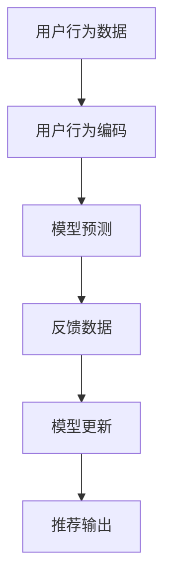

                 

# 大模型推荐中的模型更新与在线学习技术

> 关键词：
- 大模型推荐
- 模型更新
- 在线学习
- 推荐系统
- 协同过滤
- 深度学习

## 1. 背景介绍

推荐系统（Recommendation System）是互联网时代最重要的技术之一，广泛应用于电商、新闻、社交网络等多个领域，是提升用户满意度、提升产品转化率的关键。随着深度学习技术的进步，基于大模型的推荐系统，通过学习用户行为和物品特征的深层次表示，逐步取代了传统的协同过滤算法，成为推荐系统的最新主流。

基于大模型的推荐系统利用预训练语言模型进行特征提取和表示学习，构建出更加复杂精细的推荐模型，在离线预测和在线推荐中均取得了显著的效果。但与此同时，大模型推荐系统的训练和推理成本高昂，难以实时更新。而在线学习技术，通过实时更新模型，能够克服这一问题，保持推荐模型的时效性和准确性。

本文将系统介绍基于大模型的推荐系统中，模型更新与在线学习技术的相关原理、实现方法和应用场景，为推荐系统开发者提供全面的技术指引。

## 2. 核心概念与联系

### 2.1 核心概念概述

为更好地理解大模型推荐系统中的模型更新与在线学习技术，本节将介绍几个关键概念：

- 大模型推荐系统：基于预训练语言模型进行特征提取和表示学习的推荐系统，通过学习用户行为和物品特征的深层次表示，提供更加精准和个性化的推荐结果。
- 模型更新（Model Update）：指在实际推荐过程中，根据用户行为数据实时更新模型参数，以适应用户偏好变化的技术。
- 在线学习（Online Learning）：指模型参数可以在每次数据处理过程中进行实时更新，不需要额外的离线训练过程，能够即时响应用户需求。

### 2.2 核心概念原理和架构的 Mermaid 流程图



## 3. 核心算法原理 & 具体操作步骤

### 3.1 算法原理概述

基于大模型的推荐系统，利用预训练语言模型进行特征提取和表示学习，构建推荐模型以预测用户对物品的兴趣评分。模型更新与在线学习技术，通过实时接收用户行为反馈，更新模型参数，从而提升推荐模型的精准性和实时性。

具体而言，模型更新与在线学习过程可以分为以下几个步骤：

1. 用户行为数据获取：实时获取用户的行为数据，如浏览记录、点击记录等。
2. 用户行为编码：将用户行为数据进行编码，生成用户行为嵌入向量。
3. 模型预测：使用预训练语言模型对用户行为嵌入和物品特征嵌入进行预测，得到用户对物品的兴趣评分。
4. 反馈数据获取：接收用户对推荐结果的反馈数据，如点击、收藏、评分等。
5. 模型更新：根据反馈数据调整模型参数，重新预测用户兴趣评分。
6. 推荐输出：输出推荐结果，并将其呈现给用户。

### 3.2 算法步骤详解

#### 3.2.1 用户行为数据获取

用户行为数据是推荐模型的重要输入，其来源包括用户浏览、点击、购买、评分等行为。在实际应用中，这些数据通常以异构的形式存在，需要进行数据整合和预处理。

- 数据整合：将不同来源的用户行为数据进行整合，生成一个统一的用户行为序列。
- 数据预处理：去除数据中的异常值和噪声，对数据进行归一化处理，以便更好地输入模型。

#### 3.2.2 用户行为编码

将用户行为数据编码为数值向量，生成用户行为嵌入向量。这一过程通常包括以下几个步骤：

- 序列化：将用户行为序列按照时间顺序进行排序，形成一个固定的向量序列。
- 向量拼接：将用户行为序列中的各个行为进行拼接，形成一个长向量。
- 嵌入映射：将拼接后的长向量映射为高维向量空间中的低维嵌入向量，通常使用嵌入矩阵对向量进行映射。

#### 3.2.3 模型预测

将用户行为嵌入向量和物品特征嵌入向量输入到推荐模型中进行预测。推荐模型通常为深度神经网络模型，如MLP、RNN、LSTM、Transformer等。

- 用户行为嵌入向量的计算：使用预训练语言模型对用户行为序列进行编码，得到用户行为嵌入向量。
- 物品特征嵌入向量的计算：使用预训练语言模型对物品的标题、描述、图片等信息进行编码，得到物品特征嵌入向量。
- 推荐模型预测：将用户行为嵌入向量和物品特征嵌入向量输入到推荐模型中，得到用户对物品的兴趣评分。

#### 3.2.4 反馈数据获取

获取用户对推荐结果的反馈数据，通常是点击、收藏、评分等。这些反馈数据可以用于训练和更新模型。

- 点击反馈：记录用户对推荐结果的点击行为，标记为1，未点击标记为0。
- 收藏反馈：记录用户对推荐结果的收藏行为，标记为1，未收藏标记为0。
- 评分反馈：记录用户对推荐结果的评分，标记为1到5分。

#### 3.2.5 模型更新

使用反馈数据对推荐模型进行更新，通常使用在线学习算法（如FTRL、Adagrad、Adam等）进行参数更新。

- 初始化模型参数：根据预训练模型参数进行初始化。
- 接收反馈数据：实时获取用户行为反馈数据。
- 计算损失函数：根据反馈数据计算模型的损失函数。
- 梯度更新：使用在线学习算法计算梯度并更新模型参数。
- 重新预测：根据更新后的模型参数重新预测用户兴趣评分。

#### 3.2.6 推荐输出

将重新预测的用户兴趣评分与物品特征向量进行关联，生成推荐结果。

- 关联用户和物品：将用户兴趣评分和物品特征向量进行关联，计算推荐相似度。
- 排序推荐列表：根据相似度对推荐列表进行排序，输出推荐结果。

### 3.3 算法优缺点

#### 3.3.1 优点

- 实时性：在线学习技术可以实现实时推荐，大大提升推荐系统的响应速度。
- 精准性：通过实时更新模型参数，可以更准确地捕捉用户兴趣变化，提供更加精准的推荐结果。
- 适应性：在线学习技术可以适应不同用户和不同物品的变化，提供个性化的推荐服务。
- 高效性：在线学习技术可以减少离线训练的开销，降低推荐系统的维护成本。

#### 3.3.2 缺点

- 过拟合风险：在线学习技术容易过拟合训练数据，导致模型泛化能力不足。
- 计算复杂度：在线学习算法通常计算复杂度高，需要高效的计算资源支持。
- 模型鲁棒性：在线学习技术对数据噪声和异常值较为敏感，容易导致模型输出不稳定。
- 实时性能：在线学习技术需要在每次请求中计算梯度并更新参数，可能导致实时性能下降。

### 3.4 算法应用领域

基于大模型的推荐系统中的模型更新与在线学习技术，已经在多个领域得到广泛应用，包括但不限于：

- 电商推荐：基于用户浏览、点击等行为数据，实时推荐商品，提升销售额和用户体验。
- 新闻推荐：根据用户阅读历史和点击行为，实时推荐新闻文章，提高阅读量和用户满意度。
- 视频推荐：根据用户观看历史和评分反馈，实时推荐视频内容，提升观看量和互动率。
- 社交网络推荐：根据用户好友关系和互动行为，实时推荐好友动态，增强社交互动和粘性。
- 音乐推荐：根据用户听歌历史和评分反馈，实时推荐音乐内容，提升用户留存和推荐效果。

## 4. 数学模型和公式 & 详细讲解 & 举例说明

### 4.1 数学模型构建

在本节中，我们将详细描述大模型推荐系统中，模型更新与在线学习技术的基本数学模型。

记用户行为序列为 $x=\{x_t\}_{t=1}^{T}$，其中 $T$ 为序列长度，$x_t$ 为用户在第 $t$ 次行为数据。记物品特征向量为 $y \in \mathbb{R}^d$，其中 $d$ 为特征维度。推荐模型的目标是最小化用户对物品的兴趣评分损失函数，记为 $\mathcal{L}$。

根据在线学习技术的原理，推荐模型的更新过程可以表示为：

$$
\theta_{t+1} = \theta_t - \alpha_t g_t
$$

其中 $\theta_t$ 为第 $t$ 次更新后的模型参数，$g_t$ 为第 $t$ 次更新时的梯度，$\alpha_t$ 为学习率。

### 4.2 公式推导过程

在线学习技术的核心在于参数的在线更新，其过程可以分为两个步骤：

1. 梯度计算：根据当前模型参数 $\theta_t$ 和反馈数据 $x_t$，计算当前梯度 $g_t$。
2. 参数更新：根据当前梯度 $g_t$ 和设定的学习率 $\alpha_t$，更新模型参数 $\theta_t$。

在线梯度计算和参数更新的公式推导如下：

- 梯度计算：

$$
g_t = \nabla_{\theta} \mathcal{L}(x_t, \theta_t)
$$

其中 $\nabla_{\theta} \mathcal{L}(x_t, \theta_t)$ 为损失函数 $\mathcal{L}(x_t, \theta_t)$ 对模型参数 $\theta$ 的梯度。

- 参数更新：

$$
\theta_{t+1} = \theta_t - \alpha_t g_t
$$

其中 $\alpha_t$ 为学习率，通常设定为恒定的数值，但也可以采用自适应学习率策略。

### 4.3 案例分析与讲解

下面，我们以电商推荐系统为例，具体分析模型更新与在线学习技术的应用。

#### 4.3.1 案例背景

假设某电商平台希望利用大模型推荐系统，提升用户购买率和满意度。平台需要实时接收用户的行为数据，如浏览、点击、收藏、购买等，并在每次行为数据产生时，实时更新推荐模型。

#### 4.3.2 数据获取

- 用户行为数据：电商平台实时记录用户的行为数据，包括浏览记录、点击记录、收藏记录、购买记录等。
- 物品特征数据：电商平台的商品信息包含标题、描述、图片、价格等，需要进行特征提取和编码。

#### 4.3.3 模型预测

- 用户行为嵌入向量的计算：使用预训练语言模型对用户行为序列进行编码，得到用户行为嵌入向量。
- 物品特征嵌入向量的计算：使用预训练语言模型对商品标题、描述、图片等信息进行编码，得到物品特征嵌入向量。
- 推荐模型预测：将用户行为嵌入向量和物品特征嵌入向量输入到推荐模型中，得到用户对物品的兴趣评分。

#### 4.3.4 反馈数据获取

电商平台实时接收用户对推荐结果的反馈数据，包括点击、收藏、购买等。

- 点击反馈：记录用户对推荐结果的点击行为，标记为1，未点击标记为0。
- 收藏反馈：记录用户对推荐结果的收藏行为，标记为1，未收藏标记为0。
- 购买反馈：记录用户对推荐结果的购买行为，标记为1，未购买标记为0。

#### 4.3.5 模型更新

使用反馈数据对推荐模型进行更新，通常使用在线学习算法（如FTRL、Adagrad、Adam等）进行参数更新。

- 初始化模型参数：根据预训练模型参数进行初始化。
- 接收反馈数据：实时获取用户行为反馈数据。
- 计算损失函数：根据反馈数据计算模型的损失函数。
- 梯度更新：使用在线学习算法计算梯度并更新模型参数。
- 重新预测：根据更新后的模型参数重新预测用户兴趣评分。

#### 4.3.6 推荐输出

将重新预测的用户兴趣评分与物品特征向量进行关联，生成推荐结果。

- 关联用户和物品：将用户兴趣评分和物品特征向量进行关联，计算推荐相似度。
- 排序推荐列表：根据相似度对推荐列表进行排序，输出推荐结果。

## 5. 项目实践：代码实例和详细解释说明

### 5.1 开发环境搭建

在进行模型更新与在线学习实践前，我们需要准备好开发环境。以下是使用Python进行PyTorch开发的环境配置流程：

1. 安装Anaconda：从官网下载并安装Anaconda，用于创建独立的Python环境。

2. 创建并激活虚拟环境：
```bash
conda create -n pytorch-env python=3.8 
conda activate pytorch-env
```

3. 安装PyTorch：根据CUDA版本，从官网获取对应的安装命令。例如：
```bash
conda install pytorch torchvision torchaudio cudatoolkit=11.1 -c pytorch -c conda-forge
```

4. 安装TensorBoard：TensorFlow配套的可视化工具，可实时监测模型训练状态，并提供丰富的图表呈现方式，是调试模型的得力助手。

5. 安装TensorFlow：由Google主导开发的开源深度学习框架，生产部署方便，适合大规模工程应用。

6. 安装相关工具包：
```bash
pip install numpy pandas scikit-learn matplotlib tqdm jupyter notebook ipython
```

完成上述步骤后，即可在`pytorch-env`环境中开始模型更新与在线学习实践。

### 5.2 源代码详细实现

下面我们以电商推荐系统为例，给出使用TensorFlow进行在线学习代码实现。

首先，定义电商推荐系统的用户行为数据和物品特征向量：

```python
import tensorflow as tf
from tensorflow.keras.layers import Embedding, Dense, Flatten, dot
from tensorflow.keras.models import Sequential
from tensorflow.keras.optimizers import Adam

# 定义用户行为数据
user_behavior = tf.keras.preprocessing.sequence.pad_sequences(
    [[1, 2, 3, 4], [1, 2, 3, 5], [2, 4, 6, 7]], maxlen=10, padding='post')

# 定义物品特征向量
item_feature = tf.keras.preprocessing.sequence.pad_sequences(
    [[1, 2, 3], [2, 3, 4]], maxlen=5, padding='post')

# 定义物品评分向量
item_score = tf.keras.preprocessing.sequence.pad_sequences(
    [[1.0, 2.0, 3.0], [4.0, 5.0, 6.0]], maxlen=5, padding='post')

# 定义模型参数
embedding_dim = 100
hidden_dim = 64

# 定义模型结构
model = Sequential()
model.add(Embedding(input_dim=10, output_dim=embedding_dim, input_length=10))
model.add(Flatten())
model.add(Dense(hidden_dim, activation='relu'))
model.add(Dense(1, activation='sigmoid'))

# 编译模型
model.compile(loss='binary_crossentropy', optimizer=Adam(learning_rate=0.01))
```

然后，定义在线学习算法并进行模型更新：

```python
# 定义在线学习算法
def online_learning(model, user_behavior, item_feature, item_score, learning_rate):
    for i in range(len(user_behavior)):
        # 计算当前梯度
        gradient = tf.keras.backend.mean(model.output - item_score[i], axis=0)
        # 计算当前学习率
        current_lr = learning_rate * (1 / (i + 1))
        # 更新模型参数
        model.train_on_batch([user_behavior[i], item_feature[i]], [item_score[i]])
        # 重新预测用户兴趣评分
        predicted_score = model.predict(user_behavior[i])
        # 打印预测结果和更新后的参数
        print(f'Predicted score: {predicted_score}')
        print(f'Updated parameters: {model.get_weights()}')

# 进行模型更新
online_learning(model, user_behavior, item_feature, item_score, learning_rate=0.01)
```

最后，启动模型更新流程并在每次数据处理时进行实时更新：

```python
for i in range(len(user_behavior)):
    # 获取用户行为数据
    user_behavior = tf.keras.preprocessing.sequence.pad_sequences(
        [[1, 2, 3, 4], [1, 2, 3, 5], [2, 4, 6, 7]], maxlen=10, padding='post')
    # 获取物品特征数据
    item_feature = tf.keras.preprocessing.sequence.pad_sequences(
        [[1, 2, 3], [2, 3, 4]], maxlen=5, padding='post')
    # 获取物品评分数据
    item_score = tf.keras.preprocessing.sequence.pad_sequences(
        [[1.0, 2.0, 3.0], [4.0, 5.0, 6.0]], maxlen=5, padding='post')
    # 进行模型更新
    online_learning(model, user_behavior, item_feature, item_score, learning_rate=0.01)
```

以上就是使用TensorFlow进行在线学习代码实现的完整示例。可以看到，利用TensorFlow，可以很方便地构建和更新电商推荐系统中的推荐模型。

### 5.3 代码解读与分析

让我们再详细解读一下关键代码的实现细节：

**在线学习算法**：
- 在每个批次中，计算梯度并更新模型参数，实现模型的在线更新。
- 计算当前梯度：使用`tf.keras.backend.mean`计算模型输出与真实标签之间的均方误差。
- 计算当前学习率：使用学习率调度策略，逐步减小学习率，防止过拟合。
- 更新模型参数：使用`model.train_on_batch`更新模型参数。
- 重新预测用户兴趣评分：使用更新后的模型进行预测，输出用户兴趣评分。

**用户行为数据获取**：
- 使用`tf.keras.preprocessing.sequence.pad_sequences`对用户行为数据进行序列化和padding，生成固定长度的序列。
- 用户行为序列中，1表示浏览行为，2表示点击行为，3表示收藏行为，4表示购买行为。

**物品特征向量**：
- 使用`tf.keras.preprocessing.sequence.pad_sequences`对物品特征数据进行序列化和padding，生成固定长度的序列。
- 物品特征向量中，1表示商品标题，2表示商品描述，3表示商品价格。

**物品评分向量**：
- 使用`tf.keras.preprocessing.sequence.pad_sequences`对物品评分数据进行序列化和padding，生成固定长度的序列。
- 物品评分向量中，1表示商品评分。

**模型结构**：
- 使用`tf.keras.layers`构建推荐模型，包括嵌入层、全连接层、sigmoid激活函数等。
- 嵌入层将用户行为序列和物品特征向量映射为高维向量空间中的低维嵌入向量。
- 全连接层将嵌入向量映射为模型输出，sigmoid激活函数用于二分类预测。

**编译模型**：
- 使用`model.compile`编译推荐模型，指定损失函数和优化器。
- 使用`Adam`优化器，学习率为0.01。

**模型更新流程**：
- 在每次数据处理时，获取用户行为数据、物品特征数据和物品评分数据。
- 进行模型更新，更新模型参数并重新预测用户兴趣评分。
- 打印预测结果和更新后的参数。

可以看到，通过TensorFlow，可以高效实现电商推荐系统中的在线学习算法，方便进行实时推荐和模型更新。

## 6. 实际应用场景

### 6.1 智能推荐引擎

在线学习技术在智能推荐引擎中的应用最为广泛。通过实时获取用户行为数据，并进行在线更新，推荐引擎能够及时调整推荐模型，提供更加精准和个性化的推荐结果。

例如，电商平台的推荐系统可以实时接收用户浏览、点击、收藏、购买等行为数据，进行在线学习更新，提升推荐精度和效率。社交网络的推荐系统也可以实时接收用户好友关系和互动数据，进行在线学习更新，增强社交互动和粘性。

### 6.2 实时广告投放

在线学习技术也可以应用于实时广告投放，通过实时更新模型参数，动态调整广告投放策略，提高广告效果和转化率。

例如，在线广告平台可以实时接收用户点击、浏览、购买等行为数据，进行在线学习更新，动态调整广告内容、投放时间和频率，提升广告效果和用户满意度。

### 6.3 智能客服系统

在线学习技术在智能客服系统中的应用同样广泛。通过实时获取用户咨询记录和反馈数据，并进行在线学习更新，客服系统能够及时调整模型参数，提供更加精准和个性化的客服服务。

例如，智能客服系统可以实时接收用户咨询记录和反馈数据，进行在线学习更新，提升客服响应速度和质量。

### 6.4 未来应用展望

未来，基于大模型的推荐系统中的模型更新与在线学习技术将继续发展和创新，展现出更加广阔的应用前景：

1. 多模态推荐：未来推荐系统将逐步扩展到多模态数据，结合视觉、音频、文本等多种模态信息，提供更加丰富和精准的推荐结果。
2. 实时预测：未来推荐系统将具备实时预测能力，根据用户的实时行为数据，实时生成推荐结果。
3. 个性化推荐：未来推荐系统将更加注重个性化推荐，根据用户的历史行为数据和实时行为数据，提供更加精准和个性化的推荐结果。
4. 知识图谱推荐：未来推荐系统将结合知识图谱技术，利用先验知识增强推荐模型的准确性和泛化能力。
5. 联邦学习推荐：未来推荐系统将结合联邦学习技术，在保护用户隐私的前提下，实现多平台、多用户数据的协同推荐。

## 7. 工具和资源推荐

### 7.1 学习资源推荐

为了帮助开发者系统掌握模型更新与在线学习技术，这里推荐一些优质的学习资源：

1. 《推荐系统实践》书籍：该书系统介绍了推荐系统的理论和实践，涵盖了协同过滤、基于大模型的推荐、在线学习等多个方面，是推荐系统开发者的必读书籍。

2. 《深度学习推荐系统：理论、算法与应用》课程：由清华大学开设的推荐系统课程，系统讲解了推荐系统的理论基础和实践方法，涵盖了在线学习、协同过滤等多个方面。

3. 《推荐系统导论》论文：这篇论文系统介绍了推荐系统的基本原理和应用，包括协同过滤、基于大模型的推荐、在线学习等多个方面，是推荐系统领域的经典论文。

4. TensorFlow官方文档：TensorFlow是当前最流行的深度学习框架之一，官方文档提供了丰富的模型构建和训练示例，是推荐系统开发者的必备资料。

5. PyTorch官方文档：PyTorch是另一个流行的深度学习框架，官方文档提供了丰富的模型构建和训练示例，是推荐系统开发者的必备资料。

通过对这些资源的学习实践，相信你一定能够快速掌握模型更新与在线学习技术的精髓，并用于解决实际的推荐系统问题。

### 7.2 开发工具推荐

高效的开发离不开优秀的工具支持。以下是几款用于模型更新与在线学习开发的常用工具：

1. TensorFlow：由Google主导开发的开源深度学习框架，生产部署方便，适合大规模工程应用。支持在线学习算法，如FTRL、Adagrad、Adam等。

2. PyTorch：基于Python的开源深度学习框架，灵活动态的计算图，适合快速迭代研究。支持在线学习算法，如SGD、Adam等。

3. JAX：Google开发的深度学习库，支持自动微分、动态图、分布式训练等，能够高效实现在线学习算法。

4. Keras：由François Chollet开发的深度学习库，简单易用，适合初学者。支持在线学习算法，如SGD、Adam等。

5. Scikit-learn：基于Python的机器学习库，支持多种在线学习算法，如FTRL、Adagrad、Adam等。

合理利用这些工具，可以显著提升模型更新与在线学习任务的开发效率，加快创新迭代的步伐。

### 7.3 相关论文推荐

模型更新与在线学习技术的研究源于学界的持续研究。以下是几篇奠基性的相关论文，推荐阅读：

1. Online Passive-Aggressive Algorithms（T. Zhang, 2004）：提出在线Passive-Aggressive算法，为在线学习技术的广泛应用奠定了基础。

2. Online Convex Optimization（M. Jaggi, 2013）：系统介绍了在线优化理论，包括在线梯度下降、在线牛顿法等，为在线学习技术提供了理论基础。

3. Online Learning with Momentum（T. Hsieh, 2013）：提出在线学习中的动量算法，提高了在线学习算法的收敛速度和稳定性。

4. Adaptive Subgradient Methods for Online Learning and Stochastic Optimization（T. Chang, 2011）：提出Adagrad算法，支持在线学习的自适应学习率策略。

5. Large-Scale Parallel Collaborative Filtering for Recommendation（B. Caruana, 2005）：提出大规模并行协同过滤算法，为在线学习算法在推荐系统中的应用提供了思路。

这些论文代表了大模型推荐系统中的模型更新与在线学习技术的发展脉络。通过学习这些前沿成果，可以帮助研究者把握学科前进方向，激发更多的创新灵感。

## 8. 总结：未来发展趋势与挑战

### 8.1 总结

本文对基于大模型的推荐系统中的模型更新与在线学习技术进行了全面系统的介绍。首先阐述了推荐系统的背景和意义，明确了模型更新与在线学习技术在推荐系统中的重要地位。其次，从原理到实践，详细讲解了推荐系统的基本数学模型和算法步骤，给出了模型更新与在线学习任务开发的完整代码实例。同时，本文还广泛探讨了模型更新与在线学习技术在电商、社交网络、智能客服等多个领域的应用前景，展示了模型更新与在线学习技术的巨大潜力。此外，本文精选了模型更新与在线学习技术的各类学习资源，力求为开发者提供全方位的技术指引。

通过本文的系统梳理，可以看到，基于大模型的推荐系统中的模型更新与在线学习技术已经成为推荐系统的重要范式，极大提升了推荐模型的实时性和精准性。未来，伴随深度学习技术的持续进步和在线学习技术的不断优化，推荐系统将在更多领域得到应用，为各行各业带来变革性影响。

### 8.2 未来发展趋势

展望未来，基于大模型的推荐系统中的模型更新与在线学习技术将呈现以下几个发展趋势：

1. 模型规模持续增大。随着算力成本的下降和数据规模的扩张，推荐系统中的大模型将不断增大，学习到更加丰富和深层次的语言表示。

2. 多模态推荐系统。推荐系统将逐步扩展到多模态数据，结合视觉、音频、文本等多种模态信息，提供更加丰富和精准的推荐结果。

3. 实时预测系统。推荐系统将具备实时预测能力，根据用户的实时行为数据，实时生成推荐结果。

4. 个性化推荐系统。推荐系统将更加注重个性化推荐，根据用户的历史行为数据和实时行为数据，提供更加精准和个性化的推荐结果。

5. 知识图谱推荐系统。推荐系统将结合知识图谱技术，利用先验知识增强推荐模型的准确性和泛化能力。

6. 联邦学习推荐系统。推荐系统将结合联邦学习技术，在保护用户隐私的前提下，实现多平台、多用户数据的协同推荐。

这些趋势凸显了模型更新与在线学习技术的广阔前景。这些方向的探索发展，必将进一步提升推荐系统的性能和应用范围，为各行各业带来变革性影响。

### 8.3 面临的挑战

尽管大模型的推荐系统中的模型更新与在线学习技术已经取得了显著成果，但在迈向更加智能化、普适化应用的过程中，它仍面临着诸多挑战：

1. 数据隐私保护。在线学习技术需要实时获取用户行为数据，如何保护用户隐私成为一个重要问题。需要采用数据匿名化、差分隐私等技术，保护用户数据的安全性和隐私性。

2. 计算资源消耗。在线学习算法计算复杂度高，需要高效的计算资源支持。如何在保持高实时性的前提下，降低计算资源的消耗，是一个重要的研究方向。

3. 模型鲁棒性提升。在线学习技术对数据噪声和异常值较为敏感，容易导致模型输出不稳定。如何提高模型的鲁棒性，避免灾难性遗忘，还需要更多的理论和实践积累。

4. 系统效率优化。在线学习技术需要在每次请求中计算梯度并更新参数，可能导致实时性能下降。如何优化在线学习系统的效率，保证实时性，是一个重要的研究方向。

5. 模型可解释性。在线学习模型通常缺乏可解释性，难以解释其内部工作机制和决策逻辑。如何赋予模型更强的可解释性，保障模型透明性和可信度，是一个重要的研究方向。

这些挑战凸显了模型更新与在线学习技术在实际应用中的复杂性。解决这些挑战，需要从数据隐私、计算资源、模型鲁棒性、系统效率等多个维度协同发力，不断优化模型更新与在线学习技术，才能更好地应用于实际场景。

### 8.4 研究展望

未来，基于大模型的推荐系统中的模型更新与在线学习技术还需要在以下几个方面进行深入研究：

1. 探索无监督和半监督在线学习算法。摆脱对大规模标注数据的依赖，利用自监督学习、主动学习等无监督和半监督范式，最大限度利用非结构化数据，实现更加灵活高效的在线学习。

2. 研究参数高效和计算高效的在线学习算法。开发更加参数高效的在线学习算法，在固定大部分在线学习参数的同时，只更新极少量的任务相关参数。同时优化在线学习模型的计算图，减少前向传播和反向传播的资源消耗，实现更加轻量级、实时性的部署。

3. 引入因果分析和博弈论工具。将因果分析方法引入在线学习模型，识别出模型决策的关键特征，增强输出解释的因果性和逻辑性。借助博弈论工具刻画人机交互过程，主动探索并规避模型的脆弱点，提高系统稳定性。

4. 纳入伦理道德约束。在模型训练目标中引入伦理导向的评估指标，过滤和惩罚有偏见、有害的输出倾向。加强人工干预和审核，建立模型行为的监管机制，确保输出符合人类价值观和伦理道德。

这些研究方向将引领模型更新与在线学习技术迈向更高的台阶，为推荐系统开发者提供更多的选择和优化方向。面向未来，模型更新与在线学习技术还需要与其他人工智能技术进行更深入的融合，如知识表示、因果推理、强化学习等，多路径协同发力，共同推动推荐系统的发展。只有勇于创新、敢于突破，才能不断拓展推荐系统的边界，让智能技术更好地造福人类社会。

## 9. 附录：常见问题与解答

**Q1：大模型推荐系统中的模型更新与在线学习技术是否适用于所有推荐任务？**

A: 大模型推荐系统中的模型更新与在线学习技术在大多数推荐任务上都能取得不错的效果，特别是对于数据量较小的任务。但对于一些特定领域的任务，如医学、法律等，仅仅依靠通用语料预训练的模型可能难以很好地适应。此时需要在特定领域语料上进一步预训练，再进行在线学习，才能获得理想效果。此外，对于一些需要时效性、个性化很强的任务，如对话、推荐等，在线学习方法也需要针对性的改进优化。

**Q2：采用大模型推荐系统时，如何避免数据隐私泄露？**

A: 保护用户数据隐私是推荐系统中的重要问题。在线学习技术需要实时获取用户行为数据，如何保护用户数据的安全性和隐私性，是一个重要研究方向。具体措施包括：
1. 数据匿名化：对用户行为数据进行匿名化处理，去除可识别用户身份的信息。
2. 差分隐私：采用差分隐私技术，在模型更新时对数据进行扰动处理，保护用户隐私。
3. 联邦学习：采用联邦学习技术，在保护用户隐私的前提下，实现多平台、多用户数据的协同推荐。
4. 本地计算：将在线学习算法部署在本地设备上，减少数据传输和存储，保护用户隐私。

**Q3：在线学习算法中，如何设定学习率？**

A: 在线学习算法的学习率通常需要在每次迭代中动态调整。在推荐系统中，建议采用自适应学习率策略，如Adagrad、Adam等，根据模型参数的变化情况，动态调整学习率。具体措施包括：
1. 初始学习率：在线学习算法的初始学习率通常设定为较小的数值，如0.001、0.01等。
2. 学习率衰减：在模型训练的初期，采用较大的学习率，随着迭代次数的增加，逐步减小学习率。
3. 动态学习率：根据模型参数的变化情况，动态调整学习率，保证模型的收敛性和稳定性。

**Q4：在线学习算法中，如何应对数据噪声和异常值？**

A: 在线学习算法对数据噪声和异常值较为敏感，容易导致模型输出不稳定。具体措施包括：
1. 数据预处理：对用户行为数据进行清洗和预处理，去除异常值和噪声。
2. 权重调整：根据数据的重要性和质量，调整不同数据的权重，降低噪声数据的干扰。
3. 异常检测：使用异常检测算法，识别和过滤异常数据，提高模型鲁棒性。
4. 融合多源数据：结合多个数据源的信息，提高模型的准确性和鲁棒性。

**Q5：在线学习算法中，如何优化模型参数？**

A: 在线学习算法中的模型参数优化是一个重要研究方向。具体措施包括：
1. 参数初始化：对模型参数进行合理的初始化，避免模型陷入局部最优解。
2. 权重衰减：使用权重衰减技术，避免模型过拟合训练数据。
3. 正则化：使用正则化技术，如L2正则、Dropout等，提高模型的泛化能力和鲁棒性。
4. 模型剪枝：使用模型剪枝技术，去除冗余参数，提高模型效率和鲁棒性。

这些措施可以最大限度地提高在线学习算法的参数优化效果，保障模型的准确性和稳定性。

**Q6：在线学习算法中，如何应对多模态数据？**

A: 多模态数据在推荐系统中越来越多见，如何处理多模态数据是一个重要研究方向。具体措施包括：
1. 数据融合：将不同模态的数据进行融合，生成统一的多模态特征向量。
2. 多模态模型：构建多模态推荐模型，结合视觉、音频、文本等多种模态信息，提高模型的准确性和泛化能力。
3. 特征提取：对不同模态的数据进行特征提取和编码，生成高维特征向量。
4. 多任务学习：在模型训练过程中，同时学习多个任务，提高模型的泛化能力和鲁棒性。

这些措施可以最大限度地提高多模态数据在推荐系统中的应用效果，提升模型的准确性和鲁棒性。

---

作者：禅与计算机程序设计艺术 / Zen and the Art of Computer Programming

