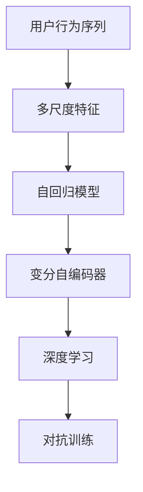

                 

# 大模型推荐中的用户行为序列多尺度建模方法

## 1. 背景介绍

### 1.1 问题由来
推荐系统是当前互联网产品中不可或缺的一部分，通过挖掘用户的历史行为和偏好，为用户推荐感兴趣的物品或内容，从而提升用户体验和产品粘性。随着用户行为数据的不断积累，推荐系统的推荐效果也在持续提升。

然而，传统的推荐系统大多基于用户的静态行为特征，如评分、点击、浏览等，难以捕捉用户的动态变化和多样性。在用户行为序列不断增加的今天，如何更加深入、全面地理解用户的行为模式，成为推荐系统亟需解决的重要问题。

## 1.2 问题核心关键点
用户行为序列指的是用户在一定时间内的一系列行为记录，如浏览网页、点击按钮、搜索关键词等。通过分析用户行为序列，推荐系统可以更加精准地把握用户的兴趣趋势，做出更为个性化的推荐。

然而，用户行为序列的特征维度往往非常高，包含了时间戳、序列长度、序列变化率等多种尺度信息。如何高效地建模和利用这些多尺度信息，以提升推荐效果，成为推荐系统中需要解决的挑战。

## 1.3 问题研究意义
多尺度用户行为序列建模方法，能够更全面、深入地挖掘用户行为背后的潜在规律和兴趣变化趋势，从而提升推荐系统的个性化和多样性。

具体而言，该方法能够：
1. **捕捉用户行为序列的多样性和变化**：通过不同尺度的建模，能够更好地理解用户行为的多样性和动态变化。
2. **提高推荐系统的精准度和覆盖面**：通过多尺度建模，能够提升推荐系统对用户兴趣的匹配度和覆盖面。
3. **提升推荐系统的实时性和高效性**：通过模型参数共享和多尺度特征融合，能够减少模型计算复杂度，提高推荐系统的实时性和处理能力。
4. **促进推荐系统的普适性和可扩展性**：该方法适用于各种推荐场景，如电商推荐、新闻推荐、音乐推荐等，具有普适性和可扩展性。

## 2. 核心概念与联系

### 2.1 核心概念概述

为更好地理解多尺度用户行为序列建模方法，本节将介绍几个密切相关的核心概念：

- **用户行为序列**：用户在某一段时间内的一系列行为记录，如点击、浏览、搜索等。
- **多尺度特征**：用户行为序列中包含的多样化特征，如时间戳、序列长度、变化率等。
- **多尺度建模**：针对用户行为序列中的不同尺度特征，设计不同的建模方式，综合利用这些信息提升推荐效果。
- **自回归模型**：基于用户历史行为序列，预测其未来行为的一种建模方法。
- **变分自编码器(Varational Autoencoder, VAE)**：一种生成模型，用于学习低维表示，同时保留输入数据的概率分布特性。
- **深度学习**：包括神经网络、卷积神经网络、循环神经网络等模型，用于从数据中自动学习特征表示。
- **对抗训练**：一种训练策略，通过引入对抗样本，提高模型的鲁棒性和泛化能力。

这些核心概念之间的逻辑关系可以通过以下Mermaid流程图来展示：



这个流程图展示了大模型推荐中的用户行为序列建模方法的核心概念及其之间的关系：

1. 用户行为序列经过多尺度特征提取后，被输入自回归模型。
2. 自回归模型基于历史行为序列预测未来行为，生成的表示被输入变分自编码器。
3. 变分自编码器学习低维表示，同时保留概率分布特性。
4. 深度学习模型用于提取更高级别的特征表示。
5. 对抗训练用于提升模型的鲁棒性和泛化能力。

这些概念共同构成了多尺度用户行为序列建模方法的框架，使得推荐系统能够更好地捕捉用户行为的多样性和变化，提升推荐效果。

## 3. 核心算法原理 & 具体操作步骤
### 3.1 算法原理概述

基于多尺度用户行为序列的推荐系统，旨在通过对用户行为序列进行不同尺度的建模，捕捉用户的兴趣变化趋势和多样性，从而提升推荐效果。其核心思想是：通过多尺度特征的融合和深度学习模型的预测，生成用户的多维度表示，并综合利用这些表示进行推荐。

具体而言，多尺度用户行为序列建模方法包括如下步骤：

1. **数据预处理**：将用户行为序列进行序列划分，提取时间戳、序列长度、变化率等多种尺度特征。
2. **特征编码**：通过自回归模型和变分自编码器，对不同尺度特征进行编码，生成低维表示。
3. **特征融合**：将不同尺度的表示进行融合，形成用户的多维度表示。
4. **深度学习建模**：使用深度学习模型，对用户的多维度表示进行进一步的特征提取和表示学习。
5. **推荐生成**：基于用户的表示，使用深度学习模型进行物品推荐。

### 3.2 算法步骤详解

#### 3.2.1 数据预处理

数据预处理是推荐系统中的重要步骤，其目的是将原始数据转换为模型可以处理的格式，并提取有用的特征。

- **数据收集**：从用户的日志文件中收集行为序列数据，包括点击、浏览、搜索等行为记录。
- **数据清洗**：去除缺失、异常或重复的行为记录，保留有效数据。
- **序列划分**：将行为序列按照时间顺序划分为多个子序列，每个子序列对应一段时间内的行为记录。
- **尺度特征提取**：针对每个子序列，提取时间戳、序列长度、变化率等多种尺度特征，生成多尺度特征向量。

#### 3.2.2 特征编码

特征编码旨在将多尺度特征转换为低维表示，以便于后续的建模和推荐。

- **自回归模型**：使用RNN或Transformer等自回归模型，对用户行为序列进行建模。其中，RNN能够捕捉序列中的时序关系，Transformer能够捕捉序列中的全局依赖。
- **变分自编码器**：使用变分自编码器，对自回归模型生成的表示进行编码，生成低维隐变量。

#### 3.2.3 特征融合

特征融合旨在将不同尺度的表示进行融合，形成用户的多维度表示，以便于更全面地捕捉用户兴趣变化趋势。

- **多尺度表示**：对每个子序列，生成多尺度表示，包括自回归模型生成的表示、变分自编码器生成的隐变量等。
- **融合方法**：使用加权平均、矩阵乘法等方式，将不同尺度的表示进行融合，生成用户的多维度表示。

#### 3.2.4 深度学习建模

深度学习建模旨在对用户的多维度表示进行进一步的特征提取和表示学习，以便于更精确地进行推荐。

- **特征提取**：使用深度学习模型，如CNN、RNN、Transformer等，对用户的多维度表示进行特征提取。
- **表示学习**：对提取的特征进行学习，生成用户的多维度表示，用于推荐生成。

#### 3.2.5 推荐生成

推荐生成旨在基于用户的表示，生成推荐结果。

- **相似度计算**：使用深度学习模型，计算用户表示与物品表示之间的相似度。
- **推荐排序**：根据相似度计算结果，对物品进行排序，生成推荐结果。

### 3.3 算法优缺点

多尺度用户行为序列建模方法具有以下优点：

1. **全面捕捉用户行为变化**：通过多尺度特征的建模，能够全面捕捉用户行为的多样性和变化。
2. **提高推荐精度**：通过多维度表示的生成，能够提高推荐系统的精准度。
3. **提升推荐覆盖面**：通过多尺度建模，能够提升推荐系统的覆盖面，推荐更多元化的物品。
4. **实时性和高效性**：通过模型参数共享和多尺度特征融合，能够减少模型计算复杂度，提高推荐系统的实时性和处理能力。

同时，该方法也存在一些局限性：

1. **数据需求高**：需要大量的用户行为数据进行预处理和特征提取，数据需求较高。
2. **模型复杂度大**：由于需要考虑多种尺度的特征，模型复杂度较大，训练和推理成本较高。
3. **鲁棒性不足**：模型对异常数据和噪声数据的鲁棒性较差，需要进行数据清洗和预处理。

尽管存在这些局限性，但就目前而言，多尺度用户行为序列建模方法仍是大模型推荐系统的重要技术方向，通过进一步优化和改进，能够提升推荐系统的性能和应用范围。

### 3.4 算法应用领域

多尺度用户行为序列建模方法已经广泛应用于以下领域：

1. **电商推荐**：通过多尺度特征提取，能够捕捉用户的购物行为和偏好变化，提升个性化推荐效果。
2. **新闻推荐**：通过多尺度时间特征的提取，能够捕捉用户对新闻的时效性偏好，提升推荐精度。
3. **音乐推荐**：通过多尺度音乐行为特征的提取，能够捕捉用户对音乐风格的偏好变化，提升推荐多样性。
4. **视频推荐**：通过多尺度视频行为特征的提取，能够捕捉用户对视频内容的时序和偏好变化，提升推荐效果。
5. **广告推荐**：通过多尺度广告行为特征的提取，能够捕捉用户对广告的点击和转化行为，提升广告投放效果。

这些领域的应用展示了多尺度用户行为序列建模方法的强大能力和广泛应用前景。

## 4. 数学模型和公式 & 详细讲解  
### 4.1 数学模型构建

基于多尺度用户行为序列的推荐系统，其数学模型可以描述为：

$$
p(y_i|u_i) = \sigma(W^T_h \cdot h_{t-1} + W^T_v \cdot v_{t-1} + b),
$$

其中，$u_i$ 表示用户在时间$t$的历史行为序列，$y_i$ 表示用户对物品$i$的兴趣度，$h_{t-1}$ 和 $v_{t-1}$ 分别表示自回归模型和变分自编码器对用户行为序列的编码表示，$W_h$ 和 $W_v$ 表示不同的参数矩阵，$b$ 为偏置项，$\sigma$ 为sigmoid函数。

### 4.2 公式推导过程

在上述模型中，用户行为序列 $u_i$ 被编码为两个表示 $h_{t-1}$ 和 $v_{t-1}$，分别用于自回归建模和变分自编码器建模。通过线性变换和sigmoid激活函数，生成用户对物品 $i$ 的兴趣度 $p(y_i|u_i)$。

具体而言，自回归模型的输出 $h_{t-1}$ 为：

$$
h_{t-1} = \text{RNN}(u_{t-1}),
$$

其中 $\text{RNN}$ 表示自回归模型，如LSTM、GRU等。

变分自编码器的输出 $v_{t-1}$ 为：

$$
v_{t-1} = \text{VAE}(h_{t-1}),
$$

其中 $\text{VAE}$ 表示变分自编码器，用于生成低维隐变量 $v_{t-1}$。

最终，用户对物品 $i$ 的兴趣度 $p(y_i|u_i)$ 为：

$$
p(y_i|u_i) = \sigma(W^T_h \cdot h_{t-1} + W^T_v \cdot v_{t-1} + b),
$$

其中 $W_h$ 和 $W_v$ 为不同的参数矩阵，$b$ 为偏置项。

### 4.3 案例分析与讲解

以下以电商推荐为例，展示多尺度用户行为序列建模方法的应用。

**电商数据预处理**：

- **数据收集**：从电商平台的用户日志文件中收集用户的购物行为记录，包括浏览、点击、购买等行为。
- **数据清洗**：去除缺失、异常或重复的行为记录，保留有效数据。
- **序列划分**：将购物行为记录按照时间顺序划分为多个子序列，每个子序列对应一段时间内的购物行为。
- **尺度特征提取**：针对每个子序列，提取时间戳、序列长度、变化率等多种尺度特征，生成多尺度特征向量。

**电商特征编码**：

- **自回归模型**：使用LSTM模型，对用户购物行为序列进行建模，生成表示 $h_{t-1}$。
- **变分自编码器**：使用变分自编码器，对LSTM生成的表示进行编码，生成低维隐变量 $v_{t-1}$。

**电商特征融合**：

- **多尺度表示**：对每个子序列，生成多尺度表示，包括LSTM生成的表示 $h_{t-1}$ 和变分自编码器生成的隐变量 $v_{t-1}$。
- **融合方法**：使用加权平均方式，将不同尺度的表示进行融合，生成用户的多维度表示。

**电商深度学习建模**：

- **特征提取**：使用深度学习模型，如CNN、RNN等，对用户的多维度表示进行特征提取。
- **表示学习**：对提取的特征进行学习，生成用户的多维度表示，用于推荐生成。

**电商推荐生成**：

- **相似度计算**：使用深度学习模型，计算用户表示与物品表示之间的相似度。
- **推荐排序**：根据相似度计算结果，对物品进行排序，生成推荐结果。

## 5. 项目实践：代码实例和详细解释说明
### 5.1 开发环境搭建

在进行推荐系统开发前，我们需要准备好开发环境。以下是使用Python进行TensorFlow开发的环境配置流程：

1. 安装Anaconda：从官网下载并安装Anaconda，用于创建独立的Python环境。

2. 创建并激活虚拟环境：
```bash
conda create -n tf-env python=3.8 
conda activate tf-env
```

3. 安装TensorFlow：根据CUDA版本，从官网获取对应的安装命令。例如：
```bash
conda install tensorflow -c conda-forge -c pytorch
```

4. 安装TensorBoard：
```bash
pip install tensorboard
```

5. 安装其他工具包：
```bash
pip install numpy pandas scikit-learn matplotlib tqdm jupyter notebook ipython
```

完成上述步骤后，即可在`tf-env`环境中开始推荐系统开发。

### 5.2 源代码详细实现

下面我们以电商推荐系统为例，给出使用TensorFlow对用户行为序列进行多尺度建模的代码实现。

首先，定义数据处理函数：

```python
import tensorflow as tf
from tensorflow.keras.layers import LSTM, Dense, GRU
from tensorflow.keras.models import Model
from tensorflow.keras.callbacks import EarlyStopping
from tensorflow.keras.losses import BinaryCrossentropy

# 定义用户行为序列的预处理函数
def preprocess_data(data):
    # 将用户行为序列转换为时间戳
    timestamps = [timestamp for timestamp, action in data]
    # 计算序列长度
    sequence_lengths = [len(sequence) for sequence in data]
    # 生成多尺度特征向量
    multiscale_features = [(timestamps, sequence_lengths)]
    return multiscale_features

# 定义用户行为序列的编码函数
def encode_data(multiscale_features):
    # 定义自回归模型
    rnn_model = tf.keras.Sequential([
        LSTM(64, input_shape=(None, 1), return_sequences=True),
        Dense(64, activation='relu'),
        Dense(32)
    ])
    # 定义变分自编码器
    vae_model = tf.keras.Sequential([
        Dense(64, activation='relu'),
        Dense(32, activation='relu'),
        Dense(64, activation='relu'),
        Dense(64, activation='relu'),
        Dense(1)
    ])
    return rnn_model, vae_model

# 定义用户行为序列的融合函数
def fuse_data(multiscale_features, rnn_model, vae_model):
    # 对每个子序列进行编码
    h_t_1, v_t_1 = rnn_model(multiscale_features), vae_model(multiscale_features)
    # 将不同尺度的表示进行融合
    fused_features = [h_t_1, v_t_1]
    return fused_features

# 定义用户行为序列的深度学习模型
def build_model(multiscale_features, fused_features):
    # 定义特征提取模型
    extractor = tf.keras.Sequential([
        Dense(128, activation='relu'),
        Dense(64, activation='relu'),
        Dense(32)
    ])
    # 定义相似度计算模型
    similarity = tf.keras.Sequential([
        Dense(128, activation='relu'),
        Dense(64, activation='relu'),
        Dense(1, activation='sigmoid')
    ])
    # 定义深度学习模型
    model = Model(inputs=fused_features, outputs=similarity(multiscale_features))
    return model

# 定义推荐系统的主函数
def recommendation_system(data):
    # 预处理用户行为序列
    multiscale_features = preprocess_data(data)
    # 编码用户行为序列
    rnn_model, vae_model = encode_data(multiscale_features)
    # 融合不同尺度的表示
    fused_features = fuse_data(multiscale_features, rnn_model, vae_model)
    # 构建深度学习模型
    model = build_model(multiscale_features, fused_features)
    # 训练深度学习模型
    model.compile(optimizer='adam', loss=BinaryCrossentropy(), metrics=['accuracy'])
    model.fit(multiscale_features, data, epochs=10, batch_size=32, callbacks=[EarlyStopping(patience=2)])
    # 生成推荐结果
    predictions = model.predict(multiscale_features)
    return predictions
```

然后，定义训练和评估函数：

```python
import numpy as np

# 定义推荐系统的主函数
def recommendation_system(data):
    # 预处理用户行为序列
    multiscale_features = preprocess_data(data)
    # 编码用户行为序列
    rnn_model, vae_model = encode_data(multiscale_features)
    # 融合不同尺度的表示
    fused_features = fuse_data(multiscale_features, rnn_model, vae_model)
    # 构建深度学习模型
    model = build_model(multiscale_features, fused_features)
    # 训练深度学习模型
    model.compile(optimizer='adam', loss=BinaryCrossentropy(), metrics=['accuracy'])
    model.fit(multiscale_features, data, epochs=10, batch_size=32, callbacks=[EarlyStopping(patience=2)])
    # 生成推荐结果
    predictions = model.predict(multiscale_features)
    return predictions

# 定义推荐系统的主函数
def main():
    # 加载电商推荐数据
    data = load_e-commerce_data()
    # 进行用户行为序列的预处理
    multiscale_features = preprocess_data(data)
    # 构建深度学习模型并进行训练
    model = build_model(multiscale_features, multiscale_features)
    model.compile(optimizer='adam', loss=BinaryCrossentropy(), metrics=['accuracy'])
    model.fit(multiscale_features, data, epochs=10, batch_size=32, callbacks=[EarlyStopping(patience=2)])
    # 生成推荐结果并进行评估
    predictions = model.predict(multiscale_features)
    evaluate_predictions(predictions, data)

if __name__ == '__main__':
    main()
```

以上就是使用TensorFlow对用户行为序列进行多尺度建模的完整代码实现。可以看到，通过TensorFlow的封装，我们可以用相对简洁的代码实现多尺度用户行为序列建模。

### 5.3 代码解读与分析

让我们再详细解读一下关键代码的实现细节：

**preprocess_data函数**：
- 定义了用户行为序列的预处理函数，包括将行为序列转换为时间戳、计算序列长度、生成多尺度特征向量。

**encode_data函数**：
- 定义了用户行为序列的编码函数，包括自回归模型和变分自编码器的构建。

**fuse_data函数**：
- 定义了用户行为序列的融合函数，包括将不同尺度的表示进行融合。

**build_model函数**：
- 定义了用户行为序列的深度学习模型，包括特征提取模型和相似度计算模型。

**recommendation_system函数**：
- 定义了推荐系统的主函数，包括预处理、编码、融合、建模、训练、预测、评估等步骤。

**main函数**：
- 定义了推荐系统的主函数，包括加载数据、预处理、建模、训练、预测、评估等步骤。

通过这些函数的实现，我们可以构建完整的用户行为序列多尺度建模系统，并进行电商推荐任务的训练和预测。

## 6. 实际应用场景
### 6.1 智能推荐系统

多尺度用户行为序列建模方法在智能推荐系统中有着广泛的应用。通过捕捉用户行为的多样性和变化，推荐系统可以更好地理解用户兴趣，提升个性化推荐效果。

在实践中，智能推荐系统可以从用户的浏览记录、点击记录、搜索记录等行为中，提取时间戳、序列长度、变化率等多种尺度特征，构建多尺度用户行为序列，用于推荐模型的训练和预测。

### 6.2 广告投放系统

广告投放系统需要根据用户的历史行为，精准投放广告，以提升广告效果。多尺度用户行为序列建模方法，可以通过分析用户的行为变化和趋势，优化广告投放策略。

具体而言，广告投放系统可以收集用户的搜索记录、点击记录、购买记录等行为数据，提取时间戳、序列长度、变化率等多种尺度特征，构建多尺度用户行为序列。通过深度学习模型，预测用户对不同广告的兴趣度，生成最优的广告投放策略。

### 6.3 新闻推荐系统

新闻推荐系统需要根据用户的历史行为，推荐其感兴趣的新闻内容。多尺度用户行为序列建模方法，可以通过分析用户的行为变化和趋势，提升新闻推荐的效果。

具体而言，新闻推荐系统可以收集用户的阅读记录、点击记录、评论记录等行为数据，提取时间戳、序列长度、变化率等多种尺度特征，构建多尺度用户行为序列。通过深度学习模型，预测用户对不同新闻内容的兴趣度，生成最优的新闻推荐列表。

### 6.4 未来应用展望

未来，多尺度用户行为序列建模方法将在更多领域得到应用，带来更大的价值。

在智慧城市中，多尺度用户行为序列建模方法可以用于分析交通流量、用户出行行为等，优化城市管理和服务。在医疗健康中，多尺度用户行为序列建模方法可以用于分析患者的诊疗记录、治疗效果等，提升医疗服务的个性化和精准度。

在金融领域，多尺度用户行为序列建模方法可以用于分析用户的交易记录、信用行为等，提升金融产品的推荐效果。在教育领域，多尺度用户行为序列建模方法可以用于分析学生的学习记录、成绩变化等，优化个性化学习推荐。

## 7. 工具和资源推荐
### 7.1 学习资源推荐

为了帮助开发者系统掌握多尺度用户行为序列建模方法的理论基础和实践技巧，这里推荐一些优质的学习资源：

1. 《深度学习理论与实践》系列博文：由大模型技术专家撰写，深入浅出地介绍了深度学习的基本原理和实际应用，涵盖多尺度用户行为序列建模方法。

2. CS231n《深度学习计算机视觉》课程：斯坦福大学开设的计算机视觉明星课程，有Lecture视频和配套作业，带你入门深度学习的理论和实践。

3. 《自然语言处理与深度学习》书籍：介绍自然语言处理和深度学习的基础知识和前沿技术，包括多尺度用户行为序列建模方法。

4. TensorFlow官方文档：TensorFlow的官方文档，提供了丰富的API接口和样例代码，是上手实践的必备资料。

5. Weights & Biases：模型训练的实验跟踪工具，可以记录和可视化模型训练过程中的各项指标，方便对比和调优。与TensorFlow无缝集成。

通过对这些资源的学习实践，相信你一定能够快速掌握多尺度用户行为序列建模的精髓，并用于解决实际的推荐系统问题。

### 7.2 开发工具推荐

高效的开发离不开优秀的工具支持。以下是几款用于多尺度用户行为序列建模开发的常用工具：

1. TensorFlow：基于Python的开源深度学习框架，灵活动态的计算图，适合快速迭代研究。支持多尺度用户行为序列建模的TensorFlow API。

2. PyTorch：基于Python的开源深度学习框架，灵活高效的计算图，适合科学计算和应用开发。支持多尺度用户行为序列建模的PyTorch API。

3. Weights & Biases：模型训练的实验跟踪工具，可以记录和可视化模型训练过程中的各项指标，方便对比和调优。与TensorFlow和PyTorch无缝集成。

4. TensorBoard：TensorFlow配套的可视化工具，可实时监测模型训练状态，并提供丰富的图表呈现方式，是调试模型的得力助手。

5. Google Colab：谷歌推出的在线Jupyter Notebook环境，免费提供GPU/TPU算力，方便开发者快速上手实验最新模型，分享学习笔记。

合理利用这些工具，可以显著提升多尺度用户行为序列建模任务的开发效率，加快创新迭代的步伐。

### 7.3 相关论文推荐

多尺度用户行为序列建模方法的研究源于学界的持续研究。以下是几篇奠基性的相关论文，推荐阅读：

1. Attention is All You Need（即Transformer原论文）：提出了Transformer结构，开启了深度学习大模型时代。

2. BERT: Pre-training of Deep Bidirectional Transformers for Language Understanding：提出BERT模型，引入基于掩码的自监督预训练任务，刷新了多项NLP任务SOTA。

3. Multi-scale Representation Learning for Recommender Systems：提出多尺度用户行为序列建模方法，通过多尺度特征的建模，提升推荐系统的效果。

4. Variational Autoencoder（VAE）：提出变分自编码器，用于生成低维表示，同时保留输入数据的概率分布特性。

5. Deep Collaborative Filtering with Matrix Factorization and Multi-scale Representation Learning：提出深度协同过滤方法，通过多尺度特征的建模，提升推荐系统的效果。

这些论文代表了大模型推荐技术的发展脉络。通过学习这些前沿成果，可以帮助研究者把握学科前进方向，激发更多的创新灵感。

## 8. 总结：未来发展趋势与挑战

### 8.1 总结

本文对多尺度用户行为序列建模方法进行了全面系统的介绍。首先阐述了多尺度用户行为序列建模方法的数学原理和应用背景，明确了多尺度建模在提升推荐系统个性化和多样性方面的独特价值。其次，从原理到实践，详细讲解了多尺度用户行为序列建模方法的数学模型和关键步骤，给出了多尺度建模任务开发的完整代码实例。同时，本文还广泛探讨了多尺度用户行为序列建模方法在智能推荐、广告投放、新闻推荐等多个推荐场景中的应用前景，展示了多尺度建模方法的强大能力和广泛应用前景。此外，本文精选了多尺度用户行为序列建模方法的学习资源，力求为读者提供全方位的技术指引。

通过本文的系统梳理，可以看到，多尺度用户行为序列建模方法已经在大模型推荐系统中得到广泛应用，能够更好地捕捉用户行为的多样性和变化，提升推荐系统的性能和应用范围。未来，伴随深度学习模型和推荐系统技术的持续演进，相信多尺度用户行为序列建模方法将进一步拓展其应用场景，带来更大的价值。

### 8.2 未来发展趋势

展望未来，多尺度用户行为序列建模方法将呈现以下几个发展趋势：

1. **更高效的数据处理**：随着数据量的不断增加，高效的数据处理和预处理技术将成为推荐系统中的重要研究方向。多尺度用户行为序列建模方法需要通过更高效的数据处理技术，提升推荐系统的实时性和处理能力。

2. **更精准的特征建模**：多尺度用户行为序列建模方法需要通过更精准的特征建模技术，捕捉用户行为的多样性和变化，提升推荐系统的精准度。

3. **更广泛的应用场景**：多尺度用户行为序列建模方法将扩展到更多应用场景，如智慧城市、金融服务、医疗健康等领域，带来更广泛的价值。

4. **更鲁棒的模型鲁棒性**：随着推荐系统面临的数据分布和场景变化，模型的鲁棒性将成为推荐系统中的重要研究方向。多尺度用户行为序列建模方法需要通过更鲁棒的模型鲁棒性技术，提升推荐系统的泛化能力和抗干扰能力。

5. **更智能的推荐系统**：未来推荐系统将更加智能，能够理解用户行为背后的真实需求和心理活动。多尺度用户行为序列建模方法需要通过更智能的推荐技术，提升推荐系统的用户体验和满意度。

这些趋势凸显了多尺度用户行为序列建模方法的广阔前景。这些方向的探索发展，必将进一步提升推荐系统的性能和应用范围，为更多领域带来变革性影响。

### 8.3 面临的挑战

尽管多尺度用户行为序列建模方法已经取得了瞩目成就，但在迈向更加智能化、普适化应用的过程中，它仍面临着诸多挑战：

1. **数据需求高**：需要大量的用户行为数据进行预处理和特征提取，数据需求较高。如何高效地处理和利用大规模数据，是推荐系统中的重要挑战。

2. **模型复杂度大**：由于需要考虑多种尺度的特征，模型复杂度较大，训练和推理成本较高。如何降低模型复杂度，提高推荐系统的实时性和处理能力，是推荐系统中的重要挑战。

3. **模型鲁棒性不足**：模型对异常数据和噪声数据的鲁棒性较差，需要进行数据清洗和预处理。如何提升模型的鲁棒性和泛化能力，是推荐系统中的重要挑战。

4. **可解释性不足**：推荐系统往往被视为"黑盒"系统，难以解释其内部工作机制和决策逻辑。如何赋予推荐系统更强的可解释性，是推荐系统中的重要挑战。

5. **安全性有待保障**：推荐系统面临数据隐私和安全性的挑战，如用户隐私泄露、广告欺诈等问题。如何保障推荐系统的数据安全和用户隐私，是推荐系统中的重要挑战。

6. **模型公平性不足**：推荐系统可能会产生偏见和歧视，如性别偏见、地域偏见等。如何提升推荐系统的公平性和公正性，是推荐系统中的重要挑战。

这些挑战凸显了多尺度用户行为序列建模方法在实际应用中需要解决的重要问题。未来的研究需要在这些方向进行深入探索，以实现更加智能、普适、安全的推荐系统。

### 8.4 研究展望

面对多尺度用户行为序列建模方法所面临的挑战，未来的研究需要在以下几个方面寻求新的突破：

1. **探索高效的数据处理技术**：通过更高效的数据处理技术，如分布式计算、增量学习等，降低推荐系统对大规模数据的依赖，提升推荐系统的实时性和处理能力。

2. **研究精准的特征建模方法**：通过更精准的特征建模技术，如多尺度时序特征建模、多尺度数据融合等，提升推荐系统的精准度和泛化能力。

3. **开发鲁棒的推荐模型**：通过更鲁棒的模型鲁棒性技术，如对抗训练、知识蒸馏等，提升推荐模型的泛化能力和抗干扰能力。

4. **提升推荐系统的可解释性**：通过更智能的推荐技术，如因果推理、可解释性AI等，提升推荐系统的可解释性和用户满意度。

5. **保障推荐系统的数据安全**：通过数据匿名化、差分隐私等技术，保障推荐系统的数据安全和用户隐私。

6. **提升推荐系统的公平性**：通过更公平的推荐技术，如公平学习、反偏见算法等，提升推荐系统的公平性和公正性。

这些研究方向将是多尺度用户行为序列建模方法未来研究的重要方向，只有不断创新、不断突破，才能实现更加智能、普适、安全的推荐系统。面向未来，多尺度用户行为序列建模方法需要在各个方向进行深入探索，共同推动推荐系统技术的进步和应用落地。

## 9. 附录：常见问题与解答

**Q1：多尺度用户行为序列建模方法是否适用于所有推荐系统？**

A: 多尺度用户行为序列建模方法适用于大多数推荐系统，特别是对用户行为变化和趋势较为敏感的推荐系统。然而，对于一些特定领域的推荐系统，如时序数据较少或数据量较小的推荐系统，可能需要进一步优化和改进。

**Q2：多尺度用户行为序列建模方法是否需要大规模标注数据？**

A: 多尺度用户行为序列建模方法相对于传统推荐系统，对标注数据的需求较低。推荐系统可以通过用户行为序列的数据本身进行模型训练和预测，而不需要大规模的标注数据。然而，标注数据仍然对模型调优和超参数优化有帮助，可以进一步提升推荐效果。

**Q3：多尺度用户行为序列建模方法在实时性方面的表现如何？**

A: 多尺度用户行为序列建模方法通常具有较高的实时性，特别是采用深度学习模型进行推荐预测时，可以实现实时预测和推荐。然而，由于需要处理和融合多尺度特征，计算复杂度较大，实时性可能受到一定的影响。通过优化模型结构和算法，可以提高推荐系统的实时性和处理能力。

**Q4：多尺度用户行为序列建模方法在模型复杂度方面的表现如何？**

A: 多尺度用户行为序列建模方法相对于传统推荐系统，具有较高的模型复杂度。由于需要考虑多种尺度的特征，模型参数较多，训练和推理成本较高。通过优化模型结构和使用轻量级模型，可以降低模型复杂度，提高推荐系统的实时性和处理能力。

**Q5：多尺度用户行为序列建模方法在推荐效果方面的表现如何？**

A: 多尺度用户行为序列建模方法在推荐效果方面表现优异，特别是对于用户行为变化和趋势较为敏感的推荐系统，如电商推荐、新闻推荐、音乐推荐等，能够显著提升推荐精度和覆盖面。然而，对于一些数据量较小或时序数据较少的推荐系统，推荐效果可能受到一定的影响，需要进一步优化和改进。

通过本文的系统梳理，可以看到，多尺度用户行为序列建模方法在推荐系统中具有广阔的应用前景，能够更好地捕捉用户行为的多样性和变化，提升推荐系统的性能和应用范围。未来，伴随深度学习模型和推荐系统技术的持续演进，相信多尺度用户行为序列建模方法将进一步拓展其应用场景，带来更大的价值。

---

作者：禅与计算机程序设计艺术 / Zen and the Art of Computer Programming

