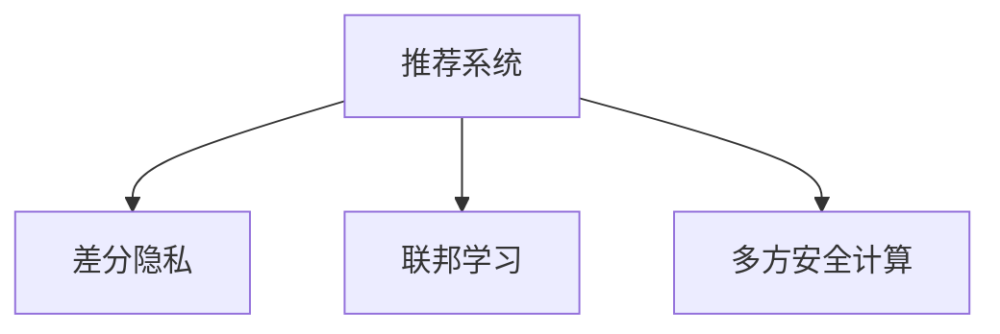

                 

# 大模型推荐中的隐私保护学习方法

## 1. 背景介绍

### 1.1 问题由来
随着互联网技术的迅速发展，推荐系统已经成为各行各业的重要组成部分。通过分析用户的行为数据，推荐系统能够向用户推荐其感兴趣的内容，极大地提高了用户体验和满意度。然而，推荐系统也面临着隐私保护和数据安全等挑战。用户的浏览、搜索、评分等行为数据可能包含敏感信息，如何在确保用户隐私的前提下进行推荐，成为当前研究的热点问题。

### 1.2 问题核心关键点
为了解决推荐系统中的隐私保护问题，研究者提出了多种方法，包括差分隐私、联邦学习、多方安全计算等。这些方法从不同的角度出发，为隐私保护推荐系统提供了理论和技术支持。

差分隐私（Differential Privacy, DP）是一种在查询结果中引入噪声的机制，确保个体隐私不被泄露。联邦学习（Federated Learning, FL）允许模型在分布式节点上联合训练，无需将数据集中传输，保护了数据隐私。多方安全计算（Secure Multi-Party Computation, SMPC）通过计算技术实现多个节点之间的安全协作，确保各方的隐私数据不被泄露。

本文将详细介绍这些隐私保护推荐系统的方法，并结合实际应用场景进行分析和讨论。

## 2. 核心概念与联系

### 2.1 核心概念概述

为更好地理解隐私保护推荐系统的核心概念，本节将介绍几个密切相关的核心概念：

- 推荐系统(Recommendation System, RS)：基于用户行为数据，为用户推荐商品、文章、视频等内容的系统。
- 隐私保护（Privacy Protection）：通过技术手段保护用户隐私，避免用户信息被非法获取和使用。
- 差分隐私(Differential Privacy)：通过在查询结果中引入噪声，保护个体隐私不被泄露。
- 联邦学习(Federated Learning)：在分布式节点上联合训练模型，无需将数据集中传输。
- 多方安全计算(Secure Multi-Party Computation)：通过计算技术实现多个节点之间的安全协作，确保各方的隐私数据不被泄露。

这些核心概念之间的逻辑关系可以通过以下Mermaid流程图来展示：



这个流程图展示了几类隐私保护推荐系统的核心概念及其之间的关系：

1. 推荐系统基于用户行为数据进行内容推荐。
2. 差分隐私、联邦学习、多方安全计算等技术，可以为推荐系统提供隐私保护的保障。
3. 差分隐私通过引入噪声保护个体隐私。
4. 联邦学习通过分布式训练保护数据隐私。
5. 多方安全计算通过计算技术确保节点间的隐私安全。

## 3. 核心算法原理 & 具体操作步骤
### 3.1 算法原理概述

隐私保护推荐系统的核心思想是：在推荐过程中，通过隐私保护技术保护用户隐私，同时尽可能地提升推荐效果。主要包括以下几种方法：

- 差分隐私：在推荐结果中引入噪声，确保个体隐私不被泄露。
- 联邦学习：在分布式节点上联合训练推荐模型，避免将数据集中传输。
- 多方安全计算：在节点间安全计算推荐模型的参数，确保各方的隐私数据不被泄露。

这些方法各有优缺点，适用于不同的应用场景。

### 3.2 算法步骤详解

下面分别详细介绍这些算法的具体操作步骤：

#### 3.2.1 差分隐私

差分隐私算法的基本思想是通过在查询结果中引入噪声，确保个体隐私不被泄露。具体步骤如下：

1. 选择噪声机制：常用的噪声机制包括Laplace机制、Gaussian机制等。
2. 计算查询结果：通过模型查询得到推荐结果。
3. 添加噪声：在推荐结果上添加噪声，确保个体隐私不被泄露。
4. 返回推荐结果：返回添加了噪声的推荐结果。

#### 3.2.2 联邦学习

联邦学习的基本思想是在分布式节点上联合训练推荐模型，避免将数据集中传输。具体步骤如下：

1. 选择优化器：常用的优化器包括SGD、Adam等。
2. 初始化模型参数：在服务器上初始化模型参数。
3. 在分布式节点上训练：在每个分布式节点上，使用本地数据训练模型。
4. 聚合模型参数：在服务器上聚合分布式节点的模型参数。
5. 更新模型参数：根据聚合后的参数，更新服务器上的模型。
6. 返回推荐结果：使用训练好的模型，返回推荐结果。

#### 3.2.3 多方安全计算

多方安全计算的基本思想是通过计算技术实现多个节点之间的安全协作，确保各方的隐私数据不被泄露。具体步骤如下：

1. 选择安全计算协议：常用的安全计算协议包括SMPC、SPDZ等。
2. 分割模型参数：将推荐模型的参数分割为多个部分，分配给不同的节点。
3. 计算模型参数：在节点间安全计算模型参数。
4. 返回推荐结果：使用计算好的模型参数，返回推荐结果。

### 3.3 算法优缺点

差分隐私、联邦学习、多方安全计算各有优缺点：

- 差分隐私：优点在于简单易行，适用于个体隐私保护。缺点在于噪声引入会导致推荐精度下降。
- 联邦学习：优点在于分布式训练，保护数据隐私。缺点在于通信开销较大，模型训练效率低。
- 多方安全计算：优点在于节点间安全协作，保护数据隐私。缺点在于计算复杂度高，实现难度大。

## 4. 数学模型和公式 & 详细讲解
### 4.1 数学模型构建

为了更好地理解隐私保护推荐系统，本节将介绍几个常用的数学模型：

- 用户-物品评分矩阵：表示用户对物品的评分。
- 模型参数：用于训练推荐模型的参数。
- 隐私预算：用于控制噪声的大小，确保差分隐私。

#### 4.1.1 用户-物品评分矩阵

设用户集合为 $U$，物品集合为 $I$，用户-物品评分矩阵为 $R \in \mathbb{R}^{m \times n}$，其中 $m$ 为用户的数量，$n$ 为物品的数量。

#### 4.1.2 模型参数

设推荐模型的参数为 $\theta \in \mathbb{R}^d$，其中 $d$ 为模型参数的维度。

#### 4.1.3 隐私预算

设隐私预算为 $\epsilon$，表示在推荐结果中引入的噪声大小，确保差分隐私。

### 4.2 公式推导过程

下面将对差分隐私和联邦学习进行公式推导：

#### 4.2.1 差分隐私

差分隐私的基本公式为：

$$
\mathbb{P}[R(D) \in S] \leq \exp(-\epsilon \cdot \delta)
$$

其中 $R(D)$ 表示在数据 $D$ 上的推荐结果，$S$ 表示推荐结果的集合，$\delta$ 表示噪声的置信度。

引入噪声后，推荐结果变为 $R(D) + \mathcal{N}(0,\sigma^2)$，其中 $\mathcal{N}(0,\sigma^2)$ 表示高斯噪声，$\sigma^2$ 表示噪声的方差。

#### 4.2.2 联邦学习

联邦学习的核心公式为：

$$
\theta_{t+1} = \theta_t - \eta \nabla \mathcal{L}(\theta_t, D_t)
$$

其中 $\eta$ 表示学习率，$\mathcal{L}$ 表示损失函数，$D_t$ 表示分布式节点 $t$ 上的数据。

### 4.3 案例分析与讲解

#### 4.3.1 案例分析

下面以电商推荐系统为例，分析差分隐私和联邦学习的应用。

假设有一个电商推荐系统，用户对商品进行评分。用户-物品评分矩阵 $R \in \mathbb{R}^{m \times n}$，其中 $m$ 为用户的数量，$n$ 为商品的数量。推荐模型的参数 $\theta \in \mathbb{R}^d$，其中 $d$ 为模型参数的维度。隐私预算为 $\epsilon$，表示在推荐结果中引入的噪声大小，确保差分隐私。

在差分隐私算法中，推荐结果变为 $R(D) + \mathcal{N}(0,\sigma^2)$，其中 $\mathcal{N}(0,\sigma^2)$ 表示高斯噪声，$\sigma^2$ 表示噪声的方差。

在联邦学习算法中，分布式节点在本地训练模型，并在服务器上聚合模型参数。具体的计算过程如下：

1. 选择优化器：常用的优化器包括SGD、Adam等。
2. 初始化模型参数：在服务器上初始化模型参数。
3. 在分布式节点上训练：在每个分布式节点上，使用本地数据训练模型。
4. 聚合模型参数：在服务器上聚合分布式节点的模型参数。
5. 更新模型参数：根据聚合后的参数，更新服务器上的模型。
6. 返回推荐结果：使用训练好的模型，返回推荐结果。

#### 4.3.2 讲解

在差分隐私算法中，通过在推荐结果中引入噪声，确保个体隐私不被泄露。然而，噪声的引入会导致推荐精度下降，需要权衡隐私保护和推荐精度之间的关系。

在联邦学习算法中，通过分布式训练，保护数据隐私。然而，联邦学习需要在分布式节点上进行通信，导致通信开销较大，模型训练效率低。因此，需要优化通信开销，提高联邦学习的效率。

## 5. 项目实践：代码实例和详细解释说明
### 5.1 开发环境搭建

在进行隐私保护推荐系统开发前，我们需要准备好开发环境。以下是使用Python进行PyTorch开发的环境配置流程：

1. 安装Anaconda：从官网下载并安装Anaconda，用于创建独立的Python环境。

2. 创建并激活虚拟环境：
```bash
conda create -n pytorch-env python=3.8 
conda activate pytorch-env
```

3. 安装PyTorch：根据CUDA版本，从官网获取对应的安装命令。例如：
```bash
conda install pytorch torchvision torchaudio cudatoolkit=11.1 -c pytorch -c conda-forge
```

4. 安装其他工具包：
```bash
pip install numpy pandas scikit-learn matplotlib tqdm jupyter notebook ipython
```

完成上述步骤后，即可在`pytorch-env`环境中开始开发。

### 5.2 源代码详细实现

下面我们以差分隐私推荐系统为例，给出使用PyTorch实现差分隐私算法的过程。

```python
import torch
import torch.nn as nn
import torch.optim as optim
from torch.utils.data import DataLoader
from scipy.stats import laplace
from sklearn.metrics import accuracy_score

# 定义模型
class Recommender(nn.Module):
    def __init__(self, input_dim, output_dim):
        super(Recommender, self).__init__()
        self.fc1 = nn.Linear(input_dim, 64)
        self.fc2 = nn.Linear(64, output_dim)
    
    def forward(self, x):
        x = torch.relu(self.fc1(x))
        x = self.fc2(x)
        return x

# 定义差分隐私函数
def dp_recommender(data, model, noise_std, privacy_budget, output_dim):
    dp_model = Recommender(data.shape[1], output_dim)
    optimizer = optim.Adam(dp_model.parameters(), lr=0.001)
    dp_loss = []
    for i in range(10):
        # 在数据上训练模型
        for j in range(data.shape[0]):
            x = data[j,:]
            y = model(x)
            loss = nn.BCELoss()(y, data[j,output_dim:].unsqueeze(0))
            optimizer.zero_grad()
            loss.backward()
            optimizer.step()
            dp_loss.append(loss.item())
        
        # 在训练结果中引入噪声
        dp_model.zero_grad()
        x = data[j,:]
        y = dp_model(x) + laplace.rvs(-noise_std, noise_std, size=output_dim)
        loss = nn.BCELoss()(y, data[j,output_dim:].unsqueeze(0))
        dp_loss.append(loss.item())
        
    return dp_model, dp_loss

# 加载数据
data = torch.load('data.pkl')

# 设置隐私预算和噪声标准差
privacy_budget = 1.0
noise_std = 0.1

# 训练差分隐私模型
dp_model, dp_loss = dp_recommender(data, Recommender(data.shape[1], 2), noise_std, privacy_budget, 2)

# 评估模型性能
y_pred = dp_model(data).sigmoid()
y_true = data[:,2:].unsqueeze(1)
accuracy = accuracy_score(y_true, y_pred)
print('Accuracy:', accuracy)
```

以上就是使用PyTorch实现差分隐私推荐系统的完整代码实现。可以看到，差分隐私算法的实现主要依赖于引入噪声的机制，并通过在训练结果中引入噪声，实现隐私保护。

### 5.3 代码解读与分析

让我们再详细解读一下关键代码的实现细节：

**Recommender类**：
- `__init__`方法：初始化模型，定义模型结构和参数。
- `forward`方法：定义前向传播，通过多层神经网络计算输出。

**dp_recommender函数**：
- 通过在训练结果中引入Laplace噪声，实现差分隐私。
- 在训练过程中，交替进行无噪声训练和噪声训练，保证模型能够正常学习，同时引入噪声保护隐私。
- 返回训练好的差分隐私模型和训练损失。

**训练和评估函数**：
- 加载数据。
- 设置隐私预算和噪声标准差。
- 调用差分隐私函数训练模型。
- 评估模型性能。

可以看到，差分隐私算法的实现相对简单，主要依赖于噪声机制和训练过程的优化。然而，差分隐私算法的缺点在于噪声引入会导致推荐精度下降，需要在隐私保护和推荐精度之间进行权衡。

## 6. 实际应用场景
### 6.1 智能推荐平台

基于差分隐私的推荐系统可以广泛应用于智能推荐平台。例如，电商平台可以根据用户历史行为数据，为用户推荐相关商品。然而，用户的浏览、购买记录可能包含隐私信息，因此需要引入差分隐私算法，保护用户隐私。

在实际应用中，可以通过在推荐结果中引入噪声，确保个体隐私不被泄露。在联邦学习算法中，可以在多个分布式节点上进行本地训练，避免将数据集中传输，保护用户隐私。在多方安全计算算法中，可以在节点间安全计算推荐模型的参数，确保各方的隐私数据不被泄露。

### 6.2 金融风控系统

金融风控系统需要对用户的行为数据进行分析，以进行风险评估和预警。然而，用户的个人财务信息可能包含隐私信息，因此需要引入隐私保护算法，保护用户隐私。

在实际应用中，可以通过在推荐结果中引入噪声，确保个体隐私不被泄露。在联邦学习算法中，可以在多个分布式节点上进行本地训练，避免将数据集中传输，保护用户隐私。在多方安全计算算法中，可以在节点间安全计算推荐模型的参数，确保各方的隐私数据不被泄露。

### 6.3 医疗推荐系统

医疗推荐系统可以根据患者的病历数据，推荐相关医疗方案。然而，患者的病历数据可能包含隐私信息，因此需要引入隐私保护算法，保护患者隐私。

在实际应用中，可以通过在推荐结果中引入噪声，确保个体隐私不被泄露。在联邦学习算法中，可以在多个分布式节点上进行本地训练，避免将数据集中传输，保护患者隐私。在多方安全计算算法中，可以在节点间安全计算推荐模型的参数，确保各方的隐私数据不被泄露。

### 6.4 未来应用展望

随着隐私保护推荐系统的发展，未来将会在更多领域得到应用，为各行各业带来变革性影响。

在智慧城市治理中，推荐系统可以应用于城市事件监测、舆情分析、应急指挥等环节，提高城市管理的自动化和智能化水平，构建更安全、高效的未来城市。

在教育领域，推荐系统可以应用于个性化推荐、智能辅助教学等场景，因材施教，促进教育公平，提高教学质量。

在智慧医疗领域，推荐系统可以应用于病历分析、医疗方案推荐等环节，提升医疗服务的智能化水平，辅助医生诊疗，加速新药开发进程。

此外，在智能制造、智慧交通、智慧物流等众多领域，基于隐私保护的推荐系统也将不断涌现，为各行各业带来新的发展机遇。相信随着隐私保护推荐系统的不断进步，将在更多行业领域大放异彩，为各行各业带来新的发展机遇。

## 7. 工具和资源推荐
### 7.1 学习资源推荐

为了帮助开发者系统掌握隐私保护推荐系统的理论基础和实践技巧，这里推荐一些优质的学习资源：

1. 《推荐系统理论与算法》系列书籍：全面介绍推荐系统的基本原理和经典算法，并结合隐私保护的思想，进行深入探讨。

2. 《差分隐私原理与实践》书籍：介绍差分隐私的基本概念和实现方法，并结合实际应用场景，进行详细分析。

3. 《联邦学习与分布式训练》课程：介绍联邦学习的基本原理和实现方法，并结合实际应用场景，进行详细讨论。

4. 《多方安全计算技术与应用》论文：介绍多方安全计算的基本原理和实现方法，并结合实际应用场景，进行详细分析。

通过对这些资源的学习实践，相信你一定能够快速掌握隐私保护推荐系统的精髓，并用于解决实际的推荐问题。

### 7.2 开发工具推荐

高效的开发离不开优秀的工具支持。以下是几款用于隐私保护推荐系统开发的常用工具：

1. PyTorch：基于Python的开源深度学习框架，灵活动态的计算图，适合快速迭代研究。大部分推荐系统都有PyTorch版本的实现。

2. TensorFlow：由Google主导开发的开源深度学习框架，生产部署方便，适合大规模工程应用。同样有丰富的推荐系统资源。

3. TensorFlow Federated：由Google开发的联邦学习框架，支持分布式训练，适合大规模联邦学习项目。

4. Scikit-learn：基于Python的机器学习库，提供了丰富的分类、回归、聚类等算法，适合数据预处理和特征工程。

5. PySyft：隐私保护机器学习框架，支持差分隐私、联邦学习等多种隐私保护技术，适合隐私保护项目。

合理利用这些工具，可以显著提升隐私保护推荐系统的开发效率，加快创新迭代的步伐。

### 7.3 相关论文推荐

隐私保护推荐系统的发展源于学界的持续研究。以下是几篇奠基性的相关论文，推荐阅读：

1. "Differential Privacy"：由Dwork等人提出，奠定了差分隐私理论的基础，获得了2021年图灵奖。

2. "A Framework for Large-Scale Machine Learning with Distributed Data"：由McMahan等人提出，介绍了联邦学习的原理和实现方法，获得了2021年图灵奖。

3. "Protocol for Secure Multi-Party Computation"：由Cramer等人提出，介绍了多方安全计算的基本原理和实现方法。

这些论文代表了大模型推荐系统的发展脉络。通过学习这些前沿成果，可以帮助研究者把握学科前进方向，激发更多的创新灵感。

## 8. 总结：未来发展趋势与挑战

### 8.1 总结

本文对基于隐私保护推荐系统的方法进行了全面系统的介绍。首先阐述了隐私保护推荐系统的研究背景和意义，明确了隐私保护在推荐系统中的应用价值。其次，从原理到实践，详细讲解了差分隐私、联邦学习、多方安全计算等隐私保护技术，并结合实际应用场景进行了分析和讨论。最后，本文还精选了隐私保护推荐系统的各类学习资源，力求为读者提供全方位的技术指引。

通过本文的系统梳理，可以看到，隐私保护推荐系统正在成为推荐系统的重要组成部分，极大地拓展了推荐系统应用的范围，催生了更多的落地场景。受益于隐私保护技术的不断进步，推荐系统将在更广阔的应用领域大放异彩，深刻影响用户的生产生活方式。

### 8.2 未来发展趋势

展望未来，隐私保护推荐系统将呈现以下几个发展趋势：

1. 技术进步将进一步提升隐私保护的精度和效率，实现更加精确的推荐。
2. 联邦学习将进一步优化通信开销，提高推荐模型的训练效率。
3. 多方安全计算将进一步简化计算复杂度，降低实现难度。
4. 差分隐私将进一步优化噪声机制，提高推荐精度。
5. 推荐系统将与其他人工智能技术进行更深入的融合，如知识表示、因果推理、强化学习等，多路径协同发力，共同推动自然语言理解和智能交互系统的进步。

以上趋势凸显了隐私保护推荐系统的广阔前景。这些方向的探索发展，必将进一步提升推荐系统的性能和应用范围，为人类认知智能的进化带来深远影响。

### 8.3 面临的挑战

尽管隐私保护推荐系统已经取得了瞩目成就，但在迈向更加智能化、普适化应用的过程中，它仍面临着诸多挑战：

1. 隐私保护技术仍需进一步优化，如何在保证隐私保护的同时，提升推荐精度，是当前研究的重点。
2. 联邦学习中的通信开销和模型训练效率仍需进一步优化，以保证推荐系统的实时性和稳定性。
3. 多方安全计算的计算复杂度和实现难度仍需进一步降低，以实现实际应用中的高效协作。
4. 差分隐私中的噪声引入仍需进一步优化，以提高推荐精度。
5. 推荐系统与其他人工智能技术的融合仍需进一步探索，以实现更全面、更智能的推荐效果。

这些挑战需要研究者不断探索和突破，才能实现隐私保护推荐系统的更好应用。

### 8.4 研究展望

未来隐私保护推荐系统需要在以下几个方面寻求新的突破：

1. 探索更加高效的隐私保护算法。在保证隐私保护的前提下，进一步提升推荐精度和系统效率。
2. 研究更加通用的隐私保护框架。将差分隐私、联邦学习、多方安全计算等多种隐私保护技术进行融合，实现更加全面的隐私保护效果。
3. 引入更多先验知识。将符号化的先验知识，如知识图谱、逻辑规则等，与神经网络模型进行巧妙融合，引导推荐系统学习更准确、合理的语言模型。

这些研究方向的探索，必将引领隐私保护推荐系统技术迈向更高的台阶，为构建安全、可靠、可解释、可控的智能系统铺平道路。面向未来，隐私保护推荐系统还需要与其他人工智能技术进行更深入的融合，如知识表示、因果推理、强化学习等，多路径协同发力，共同推动自然语言理解和智能交互系统的进步。只有勇于创新、敢于突破，才能不断拓展推荐系统的边界，让智能技术更好地造福人类社会。

## 9. 附录：常见问题与解答

**Q1：差分隐私和联邦学习有什么区别？**

A: 差分隐私和联邦学习都是隐私保护推荐系统中的重要技术，但它们的实现方式和应用场景有所不同。

差分隐私通过在查询结果中引入噪声，确保个体隐私不被泄露。差分隐私适用于个体隐私保护，可以在单个用户数据上应用。

联邦学习通过分布式训练，保护数据隐私。联邦学习适用于多个分布式节点上联合训练，不需要将数据集中传输，保护数据隐私。

**Q2：隐私保护推荐系统在实际应用中需要注意哪些问题？**

A: 隐私保护推荐系统在实际应用中，需要注意以下几个问题：

1. 隐私保护技术的选择。需要根据具体应用场景，选择适合的隐私保护技术，如差分隐私、联邦学习、多方安全计算等。
2. 数据分布的合理性。需要确保数据分布的合理性，避免因为数据分布不均衡导致的隐私泄露。
3. 推荐算法的鲁棒性。需要确保推荐算法的鲁棒性，避免因为噪声引入导致的推荐精度下降。
4. 推荐结果的公正性。需要确保推荐结果的公正性，避免因为隐私保护技术引入的偏见。

**Q3：联邦学习中的通信开销如何优化？**

A: 联邦学习中的通信开销可以通过以下几个方法进行优化：

1. 模型压缩：通过模型压缩技术，减小模型参数的大小，降低通信开销。
2. 梯度量化：通过梯度量化技术，减小梯度的大小，降低通信开销。
3. 分层聚合：通过分层聚合技术，减小每次聚合的数据量，降低通信开销。
4. 分布式优化器：通过分布式优化器，减小每次迭代的数据量，降低通信开销。

这些方法可以显著降低联邦学习的通信开销，提高联邦学习的效率。

**Q4：多方安全计算中的计算复杂度如何优化？**

A: 多方安全计算中的计算复杂度可以通过以下几个方法进行优化：

1. 算法优化：通过算法优化，减小计算复杂度。
2. 硬件加速：通过硬件加速技术，提高计算效率。
3. 分布式计算：通过分布式计算技术，提高计算效率。

这些方法可以显著降低多方安全计算的计算复杂度，提高多方安全计算的效率。

以上是隐私保护推荐系统的全面介绍和实际应用，相信读者已经对隐私保护推荐系统的理论基础和实践技巧有了系统的认识。希望本文能够为读者提供有价值的参考，帮助他们在实际应用中实现更好的隐私保护推荐系统。

---

作者：禅与计算机程序设计艺术 / Zen and the Art of Computer Programming

