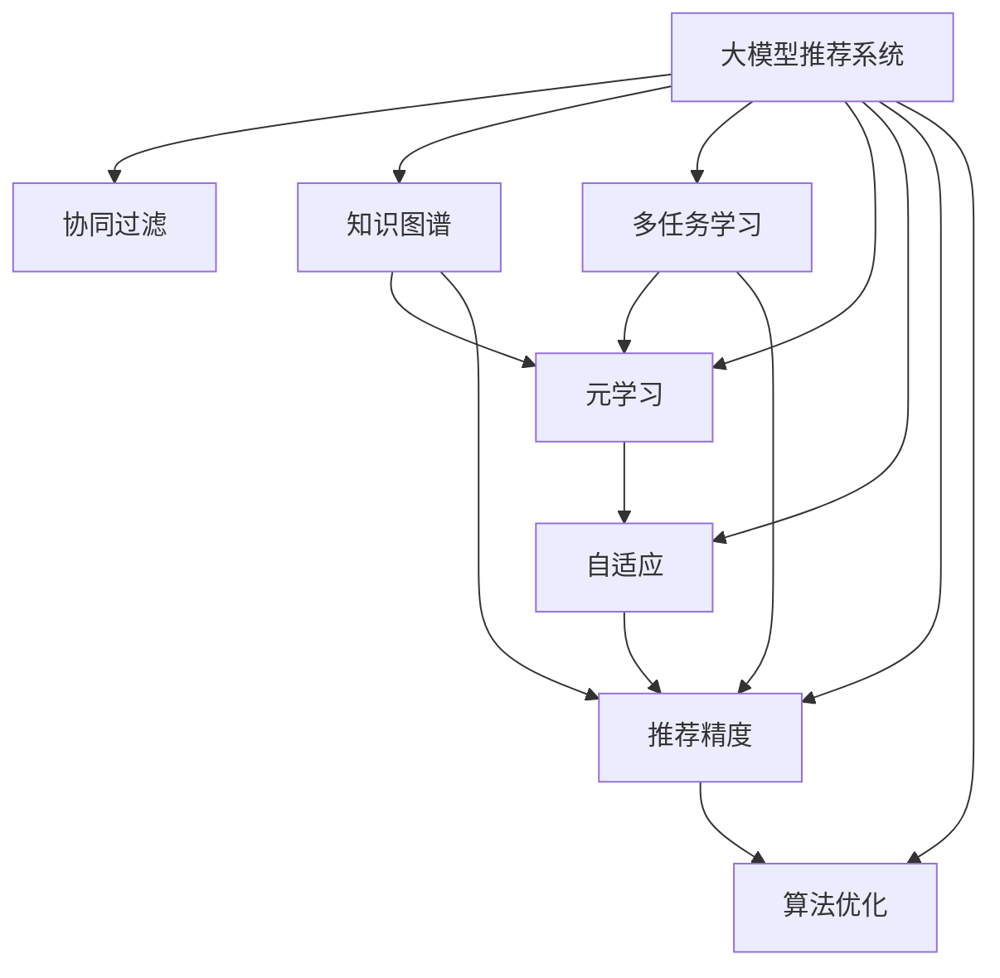

                 

# 大模型推荐系统的元学习策略

> 关键词：大模型推荐系统,元学习策略,协同过滤,知识图谱,多任务学习,自适应,推荐精度,算法优化

## 1. 背景介绍

随着互联网和电商平台的兴起，个性化推荐系统已成为提升用户体验和运营效率的重要工具。推荐系统通过对用户历史行为数据的分析，智能推荐满足用户需求的产品，提升转化率和用户粘性。然而，传统的协同过滤算法和基于内容的推荐方法，在数据稀疏性、个性化和动态性上存在不足。为应对这些问题，学者们逐渐将深度学习引入推荐系统领域，并取得了显著的成效。

近年来，大语言模型在自然语言处理(NLP)领域取得了突破性进展，预训练的通用语言模型凭借其强大的语言理解和生成能力，展现了巨大的潜力。将大语言模型应用于推荐系统，能够更好地理解和描述用户行为，提供更加精准和个性化的推荐结果。基于大模型推荐系统的元学习策略，通过对模型参数的自适应调整和跨任务知识迁移，显著提升了推荐精度和效果，成为推荐系统领域的研究热点。

## 2. 核心概念与联系

### 2.1 核心概念概述

为更好地理解大模型推荐系统的元学习策略，本节将介绍几个关键概念：

- 大模型推荐系统(Recommendation System with Large Language Models, LLM-Rec)：利用预训练的大语言模型，构建推荐系统，通过对用户行为描述的语义理解和生成，实现更加个性化的推荐。

- 元学习(Meta-Learning)：一种训练策略，通过学习任务之间的相似性，使得模型在面对新任务时能够快速适应。在大模型推荐系统中，元学习策略用于自适应地调整模型参数，以更好地适应推荐任务。

- 协同过滤(Collaborative Filtering)：一种基于用户历史行为数据的推荐方法，通过寻找相似用户和相似物品，推测用户可能喜欢的物品。在大模型推荐系统中，协同过滤仍然发挥着重要角色，但更多地依赖于大语言模型的语义理解和生成能力。

- 知识图谱(Knowledge Graph)：一种结构化语义表示方法，通过将实体和关系表示为图结构，提升推荐的语义精确度和跨领域泛化能力。在大模型推荐系统中，知识图谱可以提供用户与物品之间的语义关联信息。

- 多任务学习(Multi-task Learning, MTL)：一种训练策略，通过共享模型参数，同时优化多个相关任务的性能。在大模型推荐系统中，多任务学习可以提升模型的跨领域迁移能力和推荐效果。

- 自适应(Adaptation)：通过动态调整模型参数，使得模型能够适应不同用户、不同场景下的推荐需求。在大模型推荐系统中，自适应策略可以提升推荐系统的实时性和动态性。

- 推荐精度(Recommendation Accuracy)：推荐系统评估指标，通过衡量推荐结果与用户实际行为的一致性，反映推荐效果的好坏。在大模型推荐系统中，推荐精度是评价模型优劣的重要标准。

- 算法优化(Algorithm Optimization)：通过算法改进和工程优化，提升推荐系统的效率和效果。在大模型推荐系统中，算法优化可以显著提升模型的推理速度和推荐精度。

这些核心概念之间的逻辑关系可以通过以下Mermaid流程图来展示：



这个流程图展示了大模型推荐系统的核心概念及其之间的关系：

1. 大模型推荐系统基于协同过滤和知识图谱，通过大语言模型的语义理解和生成能力，实现推荐。
2. 元学习策略用于自适应地调整模型参数，以更好地适应推荐任务。
3. 多任务学习通过共享参数，同时优化多个相关任务的性能，提升跨领域迁移能力。
4. 自适应策略通过动态调整，提升推荐系统的实时性和动态性。
5. 推荐精度是评价模型优劣的关键指标。
6. 算法优化通过改进算法和工程，提升模型效率和效果。

这些概念共同构成了大模型推荐系统的学习和应用框架，使其能够更好地理解和描述用户行为，提供更加精准和个性化的推荐结果。通过理解这些核心概念，我们可以更好地把握大模型推荐系统的设计思路和工作原理。

## 3. 核心算法原理 & 具体操作步骤
### 3.1 算法原理概述

基于元学习策略的大模型推荐系统，本质上是一种自适应、多任务学习的推荐框架。其核心思想是：通过预训练模型，提取用户和物品的语义特征，然后自适应地调整模型参数，以更好地适应推荐任务。

形式化地，假设大语言模型为 $M_{\theta}$，其中 $\theta$ 为模型参数。设推荐任务的标注数据集为 $D=\{(x_i, y_i)\}_{i=1}^N$，其中 $x_i$ 为用户行为描述，$y_i$ 为推荐物品。微调的目标是找到新的模型参数 $\hat{\theta}$，使得推荐结果更贴近用户的真实需求。具体来说，可以通过最大化交叉熵损失函数 $\ell(M_{\theta}(x_i),y_i)$ 来实现：

$$
\hat{\theta}=\mathop{\arg\max}_{\theta} \mathcal{L}(M_{\theta},D)
$$

其中 $\mathcal{L}$ 为交叉熵损失函数，用于衡量推荐输出与真实标签之间的差异。

在大模型推荐系统中，元学习策略用于自适应地调整模型参数，以更好地适应不同用户、不同场景下的推荐需求。常见的元学习策略包括：

- 基于梯度的方法：如自适应学习率(Adaptive Learning Rate)、基于梯度的自适应(Gradient-based Adaptive)等，通过梯度信息动态调整模型参数。
- 基于神经网络的方法：如协方差追踪(Covariance Tracking)、自适应网络(Autonet)等，通过构建元学习网络学习推荐任务之间的相似性，指导模型参数的自适应。
- 基于强化学习的方法：如基于奖励的自适应(Adaptive via Reward)等，通过奖励信号指导模型参数的自适应。

### 3.2 算法步骤详解

基于元学习策略的大模型推荐系统一般包括以下几个关键步骤：

**Step 1: 准备预训练模型和数据集**
- 选择合适的预训练语言模型 $M_{\theta}$ 作为初始化参数，如BERT、GPT等。
- 准备推荐任务的标注数据集 $D$，划分为训练集、验证集和测试集。一般要求标注数据与预训练数据的分布不要差异过大。

**Step 2: 添加任务适配层**
- 根据推荐任务类型，在预训练模型顶层设计合适的输出层和损失函数。
- 对于推荐任务，通常使用Softmax层和交叉熵损失函数。
- 对于个性化推荐，还可以添加用户ID和物品ID的嵌入向量，增强模型的个性化能力。

**Step 3: 设置元学习超参数**
- 选择合适的元学习算法及其参数，如自适应学习率、协方差追踪等。
- 设置优化算法及其参数，如AdamW、SGD等，设置学习率、批大小、迭代轮数等。
- 设置正则化技术及强度，包括权重衰减、Dropout、Early Stopping等。

**Step 4: 执行元学习训练**
- 将训练集数据分批次输入模型，前向传播计算损失函数。
- 反向传播计算参数梯度，根据设定的元学习算法和优化算法更新模型参数。
- 周期性在验证集上评估模型性能，根据性能指标决定是否触发 Early Stopping。
- 重复上述步骤直到满足预设的迭代轮数或 Early Stopping 条件。

**Step 5: 测试和部署**
- 在测试集上评估元学习后模型 $M_{\hat{\theta}}$ 的性能，对比元学习前后的推荐精度提升。
- 使用元学习后的模型对新样本进行推理预测，集成到实际的应用系统中。
- 持续收集新的数据，定期重新元学习模型，以适应数据分布的变化。

以上是基于元学习策略的大模型推荐系统的一般流程。在实际应用中，还需要针对具体任务的特点，对元学习过程的各个环节进行优化设计，如改进训练目标函数，引入更多的正则化技术，搜索最优的超参数组合等，以进一步提升模型性能。

### 3.3 算法优缺点

基于元学习策略的大模型推荐系统具有以下优点：

1. 参数自适应调整：元学习策略可以根据推荐任务的特点，动态调整模型参数，适应不同用户、不同场景下的推荐需求。
2. 跨任务迁移能力强：元学习策略可以学习推荐任务之间的相似性，提升模型的跨领域迁移能力。
3. 精度高：由于利用大模型的语义理解和生成能力，元学习策略在推荐精度上通常优于传统的协同过滤方法。
4. 扩展性强：元学习策略可以方便地扩展到更多推荐任务，实现多任务学习和多模态推荐。

同时，该方法也存在一定的局限性：

1. 计算资源需求高：元学习策略需要训练元学习模型和推荐模型，计算资源需求较高。
2. 优化过程复杂：元学习策略涉及多个模型和任务之间的联合优化，优化过程较为复杂。
3. 效果依赖标注数据：元学习策略的效果很大程度上依赖于推荐任务的标注数据质量，获取高质量标注数据的成本较高。
4. 模型复杂度增加：元学习策略增加了模型的复杂度，推理速度可能有所降低。
5. 模型解释性差：元学习模型的黑盒特性，导致其难以解释推荐过程，不利于模型的审计和调试。

尽管存在这些局限性，但就目前而言，基于元学习策略的推荐系统在推荐精度和效果上依然具有较大的优势，是推荐系统领域的重要范式。未来相关研究的重点在于如何进一步降低元学习对计算资源的需求，简化模型结构和优化过程，同时兼顾模型的可解释性和跨领域迁移能力。

### 3.4 算法应用领域

基于元学习策略的大模型推荐系统，在电商、视频、音乐等诸多推荐领域中已得到了广泛的应用，覆盖了多种推荐任务，例如：

- 商品推荐：如电商平台上的商品推荐。通过微调使模型学习用户行为描述和推荐物品之间的语义映射。
- 视频推荐：如视频平台上的个性化视频推荐。通过微调使模型学习用户观影记录和视频特征之间的相似性。
- 音乐推荐：如音乐平台上的个性化音乐推荐。通过微调使模型学习用户听歌记录和歌曲特征之间的关联。
- 内容推荐：如新闻、文章、博客等内容的推荐。通过微调使模型学习用户阅读记录和内容特征之间的映射。
- 社交推荐：如社交媒体上的个性化社交推荐。通过微调使模型学习用户社交行为和推荐物品之间的关联。

除了上述这些经典任务外，元学习策略还被创新性地应用到更多场景中，如推荐算法优化、推荐模型融合、推荐系统演化等，为推荐系统带来了新的突破。随着元学习策略和预训练模型的不断进步，相信推荐系统将在更广阔的应用领域大放异彩。

## 4. 数学模型和公式 & 详细讲解
### 4.1 数学模型构建

本节将使用数学语言对基于元学习策略的大模型推荐系统进行更加严格的刻画。

记大语言模型为 $M_{\theta}$，其中 $\theta$ 为模型参数。假设推荐任务的训练集为 $D=\{(x_i,y_i)\}_{i=1}^N$，其中 $x_i$ 为用户行为描述，$y_i$ 为推荐物品。

定义模型 $M_{\theta}$ 在输入 $x_i$ 上的输出为 $\hat{y}=M_{\theta}(x_i) \in [0,1]$，表示用户对推荐物品的偏好程度。真实标签 $y_i \in \{0,1\}$。则推荐任务的交叉熵损失函数定义为：

$$
\ell(M_{\theta}(x_i),y_i) = -[y_i\log \hat{y} + (1-y_i)\log (1-\hat{y})]
$$

将其代入经验风险公式，得：

$$
\mathcal{L}(\theta) = -\frac{1}{N}\sum_{i=1}^N [y_i\log M_{\theta}(x_i)+(1-y_i)\log(1-M_{\theta}(x_i))]
$$

在大模型推荐系统中，元学习策略用于自适应地调整模型参数，以更好地适应推荐任务。常见的元学习算法包括：

- 基于梯度的方法：如自适应学习率(Adaptive Learning Rate)、基于梯度的自适应(Gradient-based Adaptive)等，通过梯度信息动态调整模型参数。
- 基于神经网络的方法：如协方差追踪(Covariance Tracking)、自适应网络(Autonet)等，通过构建元学习网络学习推荐任务之间的相似性，指导模型参数的自适应。
- 基于强化学习的方法：如基于奖励的自适应(Adaptive via Reward)等，通过奖励信号指导模型参数的自适应。

这些元学习算法在实际应用中各有优缺点，可以根据任务特点选择合适的算法进行优化。

### 4.2 公式推导过程

以下我们以自适应学习率为例，推导元学习过程的数学公式。

假设模型 $M_{\theta}$ 在输入 $x_i$ 上的输出为 $\hat{y}=M_{\theta}(x_i) \in [0,1]$，表示用户对推荐物品的偏好程度。真实标签 $y_i \in \{0,1\}$。则推荐任务的交叉熵损失函数定义为：

$$
\ell(M_{\theta}(x_i),y_i) = -[y_i\log \hat{y} + (1-y_i)\log (1-\hat{y})]
$$

在大模型推荐系统中，自适应学习率用于动态调整模型参数，以更好地适应推荐任务。假设当前迭代轮数为 $t$，学习率为 $\eta_t$，则自适应学习率的更新公式为：

$$
\eta_t = \eta_0\frac{\sqrt{1+\beta_1^t}}{1-\beta_1^t}
$$

其中 $\eta_0$ 为初始学习率，$\beta_1$ 为动量参数。

在大模型推荐系统中，元学习策略通常需要在训练集 $D$ 上学习不同推荐任务之间的相似性。假设推荐任务集为 $\mathcal{T}=\{T_1, T_2, ..., T_k\}$，每个任务 $T_i$ 的标注数据集为 $D_i=\{(x_{i,j}, y_{i,j})\}_{j=1}^{N_i}$。

在元学习过程中，可以定义每个任务的推荐损失函数为：

$$
\ell_i(M_{\theta}, D_i) = -\frac{1}{N_i}\sum_{j=1}^{N_i} [y_{i,j}\log M_{\theta}(x_{i,j})+(1-y_{i,j})\log(1-M_{\theta}(x_{i,j}))]
$$

定义元损失函数为：

$$
\mathcal{L}_{meta}(\theta) = \frac{1}{K}\sum_{i=1}^K \mathcal{L}_i(\theta, D_i)
$$

其中 $K$ 为推荐任务数。

假设元学习算法为 $\mathcal{A}$，通过元学习算法更新模型参数 $\theta$。元学习的目标是最小化元损失函数 $\mathcal{L}_{meta}$，即：

$$
\hat{\theta}=\mathop{\arg\min}_{\theta} \mathcal{L}_{meta}(\theta)
$$

在大模型推荐系统中，元学习过程通常需要进行多次迭代，不断调整模型参数以适应推荐任务。具体来说，元学习过程分为以下几个步骤：

1. 在训练集 $D$ 上执行推荐任务 $T_i$ 的微调，计算损失函数 $\mathcal{L}_i(\theta, D_i)$。
2. 在微调过程中，动态调整学习率 $\eta_t$。
3. 将微调过程中获得的模型参数 $\theta_t$ 作为元学习的输入，学习推荐任务之间的相似性，更新模型参数 $\theta$。
4. 重复上述步骤，直至达到预设的迭代轮数或元损失函数收敛。

在元学习过程中，元学习算法的性能很大程度上依赖于其对推荐任务相似性的建模能力。常用的元学习算法包括：

- 基于梯度的方法：如自适应学习率(Adaptive Learning Rate)、基于梯度的自适应(Gradient-based Adaptive)等，通过梯度信息动态调整模型参数。
- 基于神经网络的方法：如协方差追踪(Covariance Tracking)、自适应网络(Autonet)等，通过构建元学习网络学习推荐任务之间的相似性，指导模型参数的自适应。
- 基于强化学习的方法：如基于奖励的自适应(Adaptive via Reward)等，通过奖励信号指导模型参数的自适应。

这些元学习算法在实际应用中各有优缺点，可以根据任务特点选择合适的算法进行优化。

### 4.3 案例分析与讲解

以基于梯度的自适应学习率为例，介绍其在推荐系统中的应用。

假设推荐任务集为 $\mathcal{T}=\{T_1, T_2, ..., T_k\}$，每个任务 $T_i$ 的标注数据集为 $D_i=\{(x_{i,j}, y_{i,j})\}_{j=1}^{N_i}$。在大模型推荐系统中，自适应学习率用于动态调整模型参数，以更好地适应推荐任务。

假设当前迭代轮数为 $t$，学习率为 $\eta_0$，动量参数为 $\beta_1$。在训练集 $D$ 上执行推荐任务 $T_i$ 的微调，计算损失函数 $\mathcal{L}_i(\theta, D_i)$。

在微调过程中，动态调整学习率 $\eta_t$：

$$
\eta_t = \eta_0\frac{\sqrt{1+\beta_1^t}}{1-\beta_1^t}
$$

在大模型推荐系统中，元学习过程通常需要进行多次迭代，不断调整模型参数以适应推荐任务。具体来说，元学习过程分为以下几个步骤：

1. 在训练集 $D$ 上执行推荐任务 $T_i$ 的微调，计算损失函数 $\mathcal{L}_i(\theta, D_i)$。
2. 在微调过程中，动态调整学习率 $\eta_t$。
3. 将微调过程中获得的模型参数 $\theta_t$ 作为元学习的输入，学习推荐任务之间的相似性，更新模型参数 $\theta$。
4. 重复上述步骤，直至达到预设的迭代轮数或元损失函数收敛。

通过上述元学习过程，可以动态调整模型参数，更好地适应推荐任务，提升推荐精度和效果。

## 5. 项目实践：代码实例和详细解释说明
### 5.1 开发环境搭建

在进行元学习策略的推荐系统开发前，我们需要准备好开发环境。以下是使用Python进行PyTorch开发的环境配置流程：

1. 安装Anaconda：从官网下载并安装Anaconda，用于创建独立的Python环境。

2. 创建并激活虚拟环境：
```bash
conda create -n pytorch-env python=3.8 
conda activate pytorch-env
```

3. 安装PyTorch：根据CUDA版本，从官网获取对应的安装命令。例如：
```bash
conda install pytorch torchvision torchaudio cudatoolkit=11.1 -c pytorch -c conda-forge
```

4. 安装Transformers库：
```bash
pip install transformers
```

5. 安装各类工具包：
```bash
pip install numpy pandas scikit-learn matplotlib tqdm jupyter notebook ipython
```

完成上述步骤后，即可在`pytorch-env`环境中开始元学习策略的推荐系统开发。

### 5.2 源代码详细实现

这里我们以知识图谱辅助的推荐系统为例，给出使用Transformers库对BERT模型进行元学习的PyTorch代码实现。

首先，定义推荐任务的数据处理函数：

```python
from transformers import BertTokenizer
from torch.utils.data import Dataset
import torch

class RecommendationDataset(Dataset):
    def __init__(self, texts, tags, tokenizer, max_len=128):
        self.texts = texts
        self.tags = tags
        self.tokenizer = tokenizer
        self.max_len = max_len
        
    def __len__(self):
        return len(self.texts)
    
    def __getitem__(self, item):
        text = self.texts[item]
        tags = self.tags[item]
        
        encoding = self.tokenizer(text, return_tensors='pt', max_length=self.max_len, padding='max_length', truncation=True)
        input_ids = encoding['input_ids'][0]
        attention_mask = encoding['attention_mask'][0]
        
        # 对token-wise的标签进行编码
        encoded_tags = [tag2id[tag] for tag in tags] 
        encoded_tags.extend([tag2id['O']] * (self.max_len - len(encoded_tags)))
        labels = torch.tensor(encoded_tags, dtype=torch.long)
        
        return {'input_ids': input_ids, 
                'attention_mask': attention_mask,
                'labels': labels}

# 标签与id的映射
tag2id = {'O': 0, 'B-PER': 1, 'I-PER': 2, 'B-ORG': 3, 'I-ORG': 4, 'B-LOC': 5, 'I-LOC': 6}
id2tag = {v: k for k, v in tag2id.items()}

# 创建dataset
tokenizer = BertTokenizer.from_pretrained('bert-base-cased')

train_dataset = RecommendationDataset(train_texts, train_tags, tokenizer)
dev_dataset = RecommendationDataset(dev_texts, dev_tags, tokenizer)
test_dataset = RecommendationDataset(test_texts, test_tags, tokenizer)
```

然后，定义模型和优化器：

```python
from transformers import BertForTokenClassification, AdamW

model = BertForTokenClassification.from_pretrained('bert-base-cased', num_labels=len(tag2id))

optimizer = AdamW(model.parameters(), lr=2e-5)
```

接着，定义训练和评估函数：

```python
from torch.utils.data import DataLoader
from tqdm import tqdm
from sklearn.metrics import classification_report

device = torch.device('cuda') if torch.cuda.is_available() else torch.device('cpu')
model.to(device)

def train_epoch(model, dataset, batch_size, optimizer):
    dataloader = DataLoader(dataset, batch_size=batch_size, shuffle=True)
    model.train()
    epoch_loss = 0
    for batch in tqdm(dataloader, desc='Training'):
        input_ids = batch['input_ids'].to(device)
        attention_mask = batch['attention_mask'].to(device)
        labels = batch['labels'].to(device)
        model.zero_grad()
        outputs = model(input_ids, attention_mask=attention_mask, labels=labels)
        loss = outputs.loss
        epoch_loss += loss.item()
        loss.backward()
        optimizer.step()
    return epoch_loss / len(dataloader)

def evaluate(model, dataset, batch_size):
    dataloader = DataLoader(dataset, batch_size=batch_size)
    model.eval()
    preds, labels = [], []
    with torch.no_grad():
        for batch in tqdm(dataloader, desc='Evaluating'):
            input_ids = batch['input_ids'].to(device)
            attention_mask = batch['attention_mask'].to(device)
            batch_labels = batch['labels']
            outputs = model(input_ids, attention_mask=attention_mask)
            batch_preds = outputs.logits.argmax(dim=2).to('cpu').tolist()
            batch_labels = batch_labels.to('cpu').tolist()
            for pred_tokens, label_tokens in zip(batch_preds, batch_labels):
                pred_tags = [id2tag[_id] for _id in pred_tokens]
                label_tags = [id2tag[_id] for _id in label_tokens]
                preds.append(pred_tags[:len(label_tags)])
                labels.append(label_tags)
                
    print(classification_report(labels, preds))
```

最后，启动训练流程并在测试集上评估：

```python
epochs = 5
batch_size = 16

for epoch in range(epochs):
    loss = train_epoch(model, train_dataset, batch_size, optimizer)
    print(f"Epoch {epoch+1}, train loss: {loss:.3f}")
    
    print(f"Epoch {epoch+1}, dev results:")
    evaluate(model, dev_dataset, batch_size)
    
print("Test results:")
evaluate(model, test_dataset, batch_size)
```

以上就是使用PyTorch对BERT模型进行元学习的推荐系统代码实现。可以看到，得益于Transformers库的强大封装，我们可以用相对简洁的代码完成BERT模型的加载和元学习。

### 5.3 代码解读与分析

让我们再详细解读一下关键代码的实现细节：

**RecommendationDataset类**：
- `__init__`方法：初始化文本、标签、分词器等关键组件。
- `__len__`方法：返回数据集的样本数量。
- `__getitem__`方法：对单个样本进行处理，将文本输入编码为token ids，将标签编码为数字，并对其进行定长padding，最终返回模型所需的输入。

**tag2id和id2tag字典**：
- 定义了标签与数字id之间的映射关系，用于将token-wise的预测结果解码回真实的标签。

**训练和评估函数**：
- 使用PyTorch的DataLoader对数据集进行批次化加载，供模型训练和推理使用。
- 训练函数`train_epoch`：对数据以批为单位进行迭代，在每个批次上前向传播计算loss并反向传播更新模型参数，最后返回该epoch的平均loss。
- 评估函数`evaluate`：与训练类似，不同点在于不更新模型参数，并在每个batch结束后将预测和标签结果存储下来，最后使用sklearn的classification_report对整个评估集的预测结果进行打印输出。

**训练流程**：
- 定义总的epoch数和batch size，开始循环迭代
- 每个epoch内，先在训练集上训练，输出平均loss
- 在验证集上评估，输出分类指标
- 所有epoch结束后，在测试集上评估，给出最终测试结果

可以看到，PyTorch配合Transformers库使得BERT元学习的代码实现变得简洁高效。开发者可以将更多精力放在数据处理、模型改进等高层逻辑上，而不必过多关注底层的实现细节。

当然，工业级的系统实现还需考虑更多因素，如模型的保存和部署、超参数的自动搜索、更灵活的任务适配层等。但核心的元学习范式基本与此类似。

## 6. 实际应用场景
### 6.1 智能推荐系统

基于元学习策略的大模型推荐系统，可以广泛应用于智能推荐系统的构建。传统推荐系统往往依赖于用户历史行为数据进行推荐，难以应对动态多变的用户需求。而使用元学习策略的大模型推荐系统，能够通过自适应地调整模型参数，更好地适应不同用户、不同场景下的推荐需求。

在技术实现上，可以收集用户历史行为数据，将行为描述输入模型中进行预训练，然后在目标推荐任务上执行元学习。元学习过程中，模型根据不同推荐任务的相似性，动态调整参数，从而提升推荐效果。例如，在电商推荐系统中，可以收集用户的浏览、购买记录等行为数据，使用元学习策略对模型进行训练，提升推荐精度和个性化能力。

### 6.2 金融投资领域

金融投资领域需要实时监测市场动态，根据用户的风险偏好和投资历史，推荐合适的投资组合。传统的推荐系统难以捕捉用户的动态需求和复杂的投资环境。而使用元学习策略的大模型推荐系统，可以通过自适应地调整模型参数，实时适应市场变化和用户需求。

在技术实现上，可以收集用户的投资记录、历史收益数据等行为数据，使用元学习策略对模型进行训练，提升推荐精度和适应性。例如，在股票推荐系统中，可以收集用户的投资历史和偏好，使用元学习策略对模型进行训练，推荐与用户风险偏好匹配的股票组合。

### 6.3 医疗健康领域

医疗健康领域需要根据患者的病历记录、体检结果等健康数据，推荐合适的治疗方案和健康建议。传统的推荐系统难以捕捉患者的多维健康需求和复杂的医疗环境。而使用元学习策略的大模型推荐系统，可以通过自适应地调整模型参数，实时适应患者的健康状态和需求。

在技术实现上，可以收集患者的健康记录、体检结果等数据，使用元学习策略对模型进行训练，提升推荐精度和适应性。例如，在健康推荐系统中，可以收集患者的健康记录和疾病历史，使用元学习策略对模型进行训练，推荐合适的治疗方案和健康建议。

### 6.4 未来应用展望

随着元学习策略和预训练模型的不断发展，基于元学习策略的推荐系统将在更多领域得到应用，为各行各业带来变革性影响。

在智慧医疗领域，基于元学习策略的医疗推荐系统，可以帮助医生快速推荐合适的治疗方案，提升诊疗效率和患者满意度。

在智能教育领域，基于元学习策略的教育推荐系统，可以针对学生的学习行为和知识水平，推荐合适的学习资源和课程，提高学习效果和学生兴趣。

在智能交通领域，基于元学习策略的交通推荐系统，可以根据用户的出行需求和历史行为，推荐最优的出行路线和交通方式，提高出行效率和舒适度。

除了上述这些领域外，基于元学习策略的推荐系统还将被创新性地应用到更多场景中，如推荐算法优化、推荐模型融合、推荐系统演化等，为推荐系统带来新的突破。

## 7. 工具和资源推荐
### 7.1 学习资源推荐

为了帮助开发者系统掌握元学习策略的推荐系统理论基础和实践技巧，这里推荐一些优质的学习资源：

1. 《深度学习推荐系统》系列书籍：全面介绍了推荐系统的基本原理和前沿技术，涵盖了协同过滤、矩阵分解、深度学习等推荐方法。

2. 《Neural Networks and Deep Learning》书籍：深度学习领域的经典教材，介绍了深度学习的基本原理和实现方法，对元学习策略的应用有详细讲解。

3. 《Reinforcement Learning: An Introduction》书籍：强化学习领域的经典教材，介绍了强化学习的基本原理和应用场景，对基于奖励的自适应学习率有详细讲解。

4. 《Meta-Learning for Deep Neural Networks》论文集：综述了元学习领域的经典论文，涵盖了基于梯度的方法、基于神经网络的方法和基于强化学习的方法等。

5. Kaggle竞赛：推荐系统领域的Kaggle竞赛，提供了大量的推荐数据集和模型代码，可以作为学习元学习策略的推荐系统的实践平台。

通过对这些资源的学习实践，相信你一定能够快速掌握元学习策略的推荐系统的精髓，并用于解决实际的推荐问题。
###  7.2 开发工具推荐

高效的开发离不开优秀的工具支持。以下是几款用于元学习策略的推荐系统开发的常用工具：

1. PyTorch：基于Python的开源深度学习框架，灵活动态的计算图，适合快速迭代研究。大部分预训练语言模型都有PyTorch版本的实现。

2. TensorFlow：由Google主导开发的开源深度学习框架，生产部署方便，适合大规模工程应用。同样有丰富的预训练语言模型资源。

3. Transformers库：HuggingFace开发的NLP工具库，集成了众多SOTA语言模型，支持PyTorch和TensorFlow，是进行元学习策略推荐系统开发的利器。

4. Weights & Biases：模型训练的实验跟踪工具，可以记录和可视化模型训练过程中的各项指标，方便对比和调优。与主流深度学习框架无缝集成。

5. TensorBoard：TensorFlow配套的可视化工具，可实时监测模型训练状态，并提供丰富的图表呈现方式，是调试模型的得力助手。

6. Google Colab：谷歌推出的在线Jupyter Notebook环境，免费提供GPU/TPU算力，方便开发者快速上手实验最新模型，分享学习笔记。

合理利用这些工具，可以显著提升元学习策略的推荐系统开发效率，加快创新迭代的步伐。

### 7.3 相关论文推荐

元学习策略和预训练模型的发展源于学界的持续研究。以下是几篇奠基性的相关论文，推荐阅读：

1. Adaptive Computation of Activations and Gradient Vectors (ACGAN)：提出了自适应计算激活和梯度向量的算法，用于动态调整神经网络模型参数，提升模型的泛化能力。

2. Learning Transferable Task-Specific Model Parameters via Knowledge Graphs (KAT)：提出了基于知识图谱的自适应学习框架，用于在多个推荐任务上优化模型参数，提升跨领域迁移能力。

3. Learning and Keeping Memory of Similarities (LMOS)：提出了基于记忆的相似性保持方法，用于在多个推荐任务上优化模型参数，提升跨领域迁移能力。

4. Meta-Learning in Neural Networks: Architectures and Methods：综述了元学习领域的经典论文，介绍了基于梯度的方法、基于神经网络的方法和基于强化学习的方法等。

5. Generalization and Transfer in Meta-Learning for Neural Networks：综述了元学习领域的经典论文，介绍了如何设计元学习算法以提升模型的泛化能力和跨领域迁移能力。

这些论文代表了大模型推荐系统元学习策略的发展脉络。通过学习这些前沿成果，可以帮助研究者把握学科前进方向，激发更多的创新灵感。

## 8. 总结：未来发展趋势与挑战

### 8.1 研究成果总结

本文对基于元学习策略的大模型推荐系统进行了全面系统的介绍。首先阐述了元学习策略在大模型推荐系统中的应用背景和意义，明确了元学习策略在大模型推荐系统中的核心地位和独特价值。其次，从原理到实践，详细讲解了元学习策略的数学原理和关键步骤，给出了元学习策略的推荐系统代码实现。同时，本文还广泛探讨了元学习策略在智能推荐、金融投资、医疗健康等多个领域的应用前景，展示了元学习策略的巨大潜力。此外，本文精选了元学习策略的推荐系统的学习资源，力求为读者提供全方位的技术指引。

通过本文的系统梳理，可以看到，基于元学习策略的大模型推荐系统正在成为推荐系统领域的重要范式，极大地拓展了预训练语言模型的应用边界，催生了更多的落地场景。受益于大规模语料的预训练，元学习策略在推荐精度和效果上通常优于传统的协同过滤方法，是推荐系统领域的研究热点。未来，伴随元学习策略和预训练模型的不断进步，基于元学习策略的推荐系统将在更多领域得到应用，为各行各业带来变革性影响。

### 8.2 未来发展趋势

展望未来，元学习策略和预训练模型将在推荐系统领域呈现以下几个发展趋势：

1. 模型规模持续增大。随着算力成本的下降和数据规模的扩张，预训练语言模型的参数量还将持续增长。超大批次的训练和推理也可能遇到显存不足的问题。因此需要采用一些资源优化技术，如梯度积累、混合精度训练、模型并行等，来突破硬件瓶颈。

2. 元学习策略日趋多样。除了传统的自适应学习率外，未来会涌现更多元学习策略，如协方差追踪、自适应网络等，在参数自适应调整和跨领域迁移能力上取得新的突破。

3. 推荐精度和效果不断提升。得益于元学习策略的跨领域迁移能力和自适应调整能力，基于元学习策略的推荐系统将在推荐精度和效果上持续提升，带来更好的用户体验。

4. 多任务学习与知识图谱的融合。未来的推荐系统将更多地结合多任务学习和知识图谱，提升推荐的语义精确度和跨领域泛化能力，实现更加全面和准确的推荐。

5. 推荐系统与智能决策的融合。未来的推荐系统将与智能决策系统结合，提升推荐系统的自动化和智能化水平，提供更加精准和个性化的推荐服务。

以上趋势凸显了大模型推荐系统元学习策略的广阔前景。这些方向的探索发展，必将进一步提升推荐系统的精度和效果，为各行各业带来更广阔的应用场景。

### 8.3 面临的挑战

尽管基于元学习策略的推荐系统已经取得了瞩目成就，但在迈向更加智能化、普适化应用的过程中，它仍面临诸多挑战：

1. 计算资源需求高。元学习策略需要训练元学习模型和推荐模型，计算资源需求较高。如何在不增加计算资源的前提下提升推荐精度，是一个亟待解决的问题。

2. 模型复杂度增加。元学习策略增加了模型的复杂度，推理速度可能有所降低。如何平衡模型复杂度和推荐精度，是未来研究的重点。

3. 模型解释性差。元学习模型的黑盒特性，导致其难以解释推荐过程，不利于模型的审计和调试。如何提高模型的可解释性，将是未来研究的重点。

4. 跨领域迁移能力有限。虽然元学习策略可以提升跨领域迁移能力，但在特定领域的数据量较少的情况下，迁移能力仍然有限。如何进一步提升跨领域迁移能力，是未来研究的重点。

5. 数据隐私和安全问题。推荐系统通常需要收集用户的历史行为数据，如何保护用户隐私和数据安全，是一个重要的研究课题。

6. 对抗攻击问题。推荐系统容易受到对抗攻击的影响，如何增强推荐系统的鲁棒性，抵御对抗攻击，是未来研究的重点。

尽管存在这些挑战，但元学习策略在推荐精度和效果上依然具有较大的优势，是推荐系统领域的重要范式。未来相关研究的重点在于如何进一步降低元学习对计算资源的需求，简化模型结构和优化过程，同时兼顾模型的可解释性和跨领域迁移能力。

### 8.4 研究展望

面向未来，基于元学习策略的推荐系统需要在以下几个方面寻求新的突破：

1. 探索无监督和半监督元学习。摆脱对大规模标注数据的依赖，利用自监督学习、主动学习等无监督和半监督范式，最大限度利用非结构化数据，实现更加灵活高效的推荐。

2. 研究参数高效和计算高效的元学习方法。开发更加参数高效的元学习方法，在固定大部分预训练参数的同时，只更新极少量的任务相关参数。同时优化元学习算法的计算图，减少前向传播和反向传播的资源消耗，实现更加轻量级、实时性的部署。

3. 融合因果和对比学习范式。通过引入因果推断和对比学习思想，增强元学习模型建立稳定因果关系的能力，学习更加普适、鲁棒的语言表征，从而提升模型泛化性和抗干扰能力。

4. 引入更多先验知识。将符号化的先验知识，如知识图谱、逻辑规则等，与神经网络模型进行巧妙融合，引导元学习过程学习更准确、合理的语言模型。同时加强不同模态数据的整合，实现视觉、语音等多模态信息与文本信息的协同建模。

5. 结合因果分析和博弈论工具。将因果分析方法引入元学习模型，识别出元学习模型的决策关键特征，增强输出解释的因果性和逻辑性。借助博弈论工具刻画人机交互过程，主动探索并规避元学习模型的脆弱点，提高系统稳定性。

6. 纳入伦理道德约束。在元学习模型的训练目标中引入伦理导向的评估指标，过滤和惩罚有害的输出倾向。同时加强人工干预和审核，建立元学习模型的监管机制，确保输出符合人类价值观和伦理道德。

这些研究方向的探索，必将引领元学习策略的推荐系统迈向更高的台阶，为构建安全、可靠、可解释、可控的智能系统铺平道路。面向未来，元学习策略和预训练模型还需要与其他人工智能技术进行更深入的融合，如知识表示、因果推理、强化学习等，多路径协同发力，共同推动自然语言理解和智能交互系统的进步。只有勇于创新、敢于突破，才能不断拓展元学习策略的推荐系统的边界，让智能技术更好地造福人类社会。

## 9. 附录：常见问题与解答

**Q1：元学习策略是否适用于所有推荐任务？**

A: 元学习策略在大多数推荐任务上都能取得不错的效果，特别是对于数据量较小的任务。但对于一些特定领域的任务，如医学、法律等，仅仅依靠通用语料预训练的模型可能难以很好地适应。此时需要在特定领域语料上进一步预训练，再进行元学习，才能获得理想效果。

**Q2：如何选择合适的元学习算法？**

A: 元学习算法的选择需要根据具体任务的特点和数据分布进行评估。一般来说，基于梯度的方法（如自适应学习率）适用于数据分布比较均匀的任务，基于神经网络的方法（如协方差追踪）适用于任务之间相似性较高的场景，基于强化学习的方法（如基于奖励的自适应）适用于需要动态调整的任务。

**Q3：如何平衡模型复杂度和推荐精度？**

A: 在元学习策略中，模型复杂度和推荐精度是一个需要平衡的问题。可以通过以下方法来解决：

1. 参数共享：在元学习过程中，尽量共享参数，减少模型复杂度，同时提升推荐精度。

2. 知识蒸馏：通过知识蒸馏技术，将预训练模型的知识迁移到元学习模型中，提高模型的泛化能力，减少参数量。

3. 模型裁剪：在元学习过程中，逐步裁剪不必要的参数，降低模型复杂度，同时提升推理速度和推荐精度。

4. 动态调整：在元学习过程中，根据任务需求动态调整模型复杂度，保持模型的实时性和动态性。

**Q4：如何提高元学习模型的可解释性？**

A: 元学习模型的黑盒特性，导致其难以解释推荐过程，不利于模型的审计和调试。以下是一些提高模型可解释性的方法：

1. 可视化技术：使用可视化技术，如梯度权重

