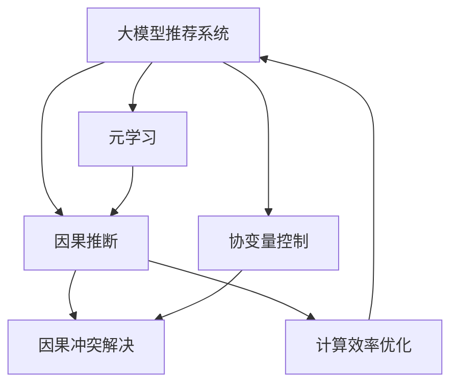

                 

# 大模型推荐系统的因果推断方法

> 关键词：因果推断，推荐系统，大模型，算法优化，推荐精度

## 1. 背景介绍

### 1.1 问题由来
推荐系统作为智能互联网的核心应用，广泛应用于电商、社交、视频等领域。通过分析用户历史行为和偏好，推荐系统能够智能地为用户提供个性化的信息和服务，极大地提升用户体验和满意度。然而，传统的推荐系统基于协同过滤、矩阵分解等方法，依赖于用户-物品交互数据，难以充分挖掘用户潜在兴趣和物品潜在价值。

近年来，深度学习技术在推荐系统中的应用逐渐普及，大模型推荐系统凭借其庞大的知识库和先进的自适应能力，在推荐效果上取得了显著提升。但大模型推荐系统依然面临诸多挑战，包括模型复杂度高、参数量巨大、对历史数据的依赖性强等。

为了进一步优化推荐系统，研究人员探索引入因果推断方法，试图通过因果分析提升推荐模型的预测能力和泛化能力。因果推断方法的引入，为推荐系统带来了更加科学、客观的决策机制，有望在个性化推荐、广告点击率预测、热门趋势预测等场景下取得突破。

### 1.2 问题核心关键点
因果推断在推荐系统中的应用，核心关键点包括以下几个方面：

- 如何从数据中提取因果关系？
- 如何通过因果推断提升推荐模型的预测能力？
- 如何处理推荐系统中的因果冲突？
- 如何应用因果推断技术优化推荐系统工程实践？

本文将深入探讨这些问题，系统介绍因果推断在大模型推荐系统中的应用原理、具体操作步骤、优缺点和应用领域，并通过数学模型和代码实例进行详细讲解。

## 2. 核心概念与联系

### 2.1 核心概念概述

为了更好地理解因果推断在大模型推荐系统中的应用，本节将介绍几个关键概念：

- **大模型推荐系统**：指利用深度学习大模型（如BERT、GPT等）进行推荐任务的系统。这些模型通常通过大规模预训练和自适应优化，获得强大的数据建模能力，可以提升推荐系统的个性化水平和泛化能力。

- **因果推断**：指通过观察数据中的因果关系，推理干预措施对结果的影响，从而进行科学决策和优化。在推荐系统中，因果推断可以帮助模型更好地理解用户行为背后的因果逻辑，预测未来行为。

- **协变量控制**：指在因果推断中，通过控制或平衡协变量（即可能影响结果的因素），消除或减少其对结果的干扰，从而更准确地估计因果效应。在推荐系统中，协变量控制可以消除用户特征、时间特征等对推荐结果的影响。

- **因果冲突**：指在推荐系统中，可能存在多个协变量控制策略或多个推荐结果之间的冲突。通过合理的算法设计，可以有效解决因果冲突，提升推荐模型的性能。

- **元学习**：指在大规模数据集上训练推荐模型，通过元学习技术（如Meta-Learning）优化模型参数，提升推荐模型的泛化能力和适应性。元学习可以帮助推荐模型快速适应新的数据分布和任务需求。

- **计算效率**：指在推荐系统中，如何通过算法优化、模型压缩等方法提升推荐模型的计算效率，满足实时推荐的要求。

这些核心概念之间的逻辑关系可以通过以下Mermaid流程图来展示：



这个流程图展示了大模型推荐系统的核心概念及其之间的关系：

1. 大模型推荐系统通过因果推断获得因果关系。
2. 协变量控制帮助消除数据干扰，提升因果推断的准确性。
3. 因果冲突解决帮助处理多种因果关系的协调。
4. 元学习通过优化模型参数，提升推荐模型的泛化能力。
5. 计算效率优化提升模型推理速度，满足实时推荐要求。

这些概念共同构成了大模型推荐系统的因果推断范式，使其能够更加科学、客观地进行推荐决策。

## 3. 核心算法原理 & 具体操作步骤

### 3.1 算法原理概述

因果推断在大模型推荐系统中的基本原理是：通过观察用户行为数据中的因果关系，推理干预措施（如推荐广告、展示商品等）对用户后续行为（如点击、购买等）的影响。这种因果推断方法可以更好地理解用户行为背后的逻辑和动机，从而进行更加精准的推荐。

形式化地，假设用户的历史行为数据为 $X$，推荐干预措施为 $D$，用户后续行为结果为 $Y$。推荐模型的目标是通过因果推断，找到 $D$ 对 $Y$ 的影响 $E(Y|D)$。

具体的因果推断方法包括：

- **因果图**：通过构建因果图模型，直观展示变量之间的关系和因果关系。因果图可以帮助理解数据中的隐含因果逻辑，指导模型设计。
- **匹配方法**：通过匹配控制组和实验组，消除协变量的影响，估计因果效应。常见的匹配方法包括随机化控制、匹配控制、差分控制等。
- **回归方法**：通过构建因果回归模型，估计因果效应。常见的回归方法包括结构方程模型、随机化回归、协变量调整回归等。
- **工具包**：通过使用如Rubin's Causal Model、Fernandez-Delgado等因果推断工具包，提供因果推断的自动化和模块化支持。

### 3.2 算法步骤详解

基于因果推断的大模型推荐系统构建，一般包括以下几个关键步骤：

**Step 1: 数据准备与因果图构建**
- 收集推荐系统中的用户行为数据，包括用户的历史行为、推荐结果、广告展示等。
- 使用因果图模型（如DAG图）描述数据中的因果关系，明确变量之间的关系。

**Step 2: 协变量控制**
- 选择控制变量（如用户特征、时间特征、广告特征等），通过匹配或回归方法，控制协变量的影响。
- 使用协变量控制方法（如随机化控制、匹配控制、差分控制等），生成匹配后的控制组和实验组。

**Step 3: 因果推断**
- 使用因果回归模型（如随机化回归、协变量调整回归等），估计干预措施对结果的影响。
- 通过工具包（如Rubin's Causal Model、Fernandez-Delgado等）自动化进行因果推断，生成因果效应估计结果。

**Step 4: 模型训练与优化**
- 使用大模型（如BERT、GPT等）构建推荐模型，通过元学习技术优化模型参数。
- 将因果推断结果作为目标输出，训练推荐模型，提升模型的预测能力。

**Step 5: 模型部署与评估**
- 将训练好的推荐模型部署到实际推荐系统中，进行实时推荐。
- 使用A/B测试、点击率预测等指标，评估推荐模型的性能，并进行不断迭代优化。

### 3.3 算法优缺点

因果推断在大模型推荐系统中的应用，具有以下优点：

1. 科学性：通过因果推断，推荐系统可以更加客观地理解用户行为背后的因果逻辑，提升推荐的科学性和可靠性。
2. 预测能力强：因果推断可以更准确地估计因果效应，提升推荐模型的预测能力。
3. 泛化能力强：因果推断能够处理多种因果关系，提升推荐模型的泛化能力。
4. 鲁棒性强：因果推断可以消除协变量的影响，提升推荐的鲁棒性。

同时，该方法也存在一定的局限性：

1. 数据需求高：因果推断需要大量的数据来控制协变量，数据的获取和处理成本较高。
2. 因果关系复杂：现实中的因果关系往往非常复杂，难以完全捕捉和建模。
3. 计算量大：因果推断涉及大量的匹配和回归操作，计算量较大，可能影响实时性。
4. 技术门槛高：因果推断需要一定的技术储备和模型设计能力，对从业者提出了较高要求。

尽管存在这些局限性，但因果推断方法在大模型推荐系统中的应用前景广阔，可以通过不断改进算法和技术，逐步克服这些挑战。

### 3.4 算法应用领域

基于大模型推荐系统的因果推断方法，在推荐系统领域有着广泛的应用：

- **广告点击率预测**：通过因果推断，估计不同广告对用户点击率的影响，优化广告投放策略。
- **个性化推荐**：通过因果推断，理解用户行为背后的因果逻辑，提升推荐模型的精准度。
- **热门趋势预测**：通过因果推断，预测商品、内容的热门趋势，优化库存管理和内容推荐。
- **用户行为分析**：通过因果推断，分析用户行为背后的原因，优化产品设计和用户体验。

除了以上应用场景，因果推断方法还可以应用于更多推荐系统相关的领域，如广告效果评估、推荐算法比较、推荐策略优化等，为推荐系统带来更加科学的决策机制。

## 4. 数学模型和公式 & 详细讲解 & 举例说明

### 4.1 数学模型构建

在大模型推荐系统中，因果推断的数学模型可以表示为：

$$
Y|D=1 = \beta_0 + \beta_1 X + \beta_2 D + \epsilon
$$

其中 $Y$ 为推荐结果，$D$ 为干预措施（如展示广告），$X$ 为协变量（如用户特征、时间特征等），$\beta_0$、$\beta_1$、$\beta_2$ 为回归系数，$\epsilon$ 为误差项。

根据上述模型，我们可以进行以下推导：

1. **因果效应估计**：
   $$
   E[Y|D=1] = \beta_0 + \beta_1 E[X|D=1] + \beta_2
   $$
   即干预措施对结果的平均因果效应为 $\beta_2$。

2. **协变量控制**：
   通过匹配控制组和实验组，消除协变量 $X$ 的影响，得到：
   $$
   E[Y|D=1] = \beta_0 + \beta_2
   $$

3. **因果效应评估**：
   通过计算因果效应 $\beta_2$，可以评估干预措施对推荐结果的影响。

### 4.2 公式推导过程

以下是因果推断在推荐系统中的详细推导过程：

**Step 1: 数据准备与因果图构建**
- 收集用户行为数据 $D$，包括用户历史行为 $X$ 和推荐结果 $Y$。
- 构建因果图模型，描述用户行为和推荐结果的因果关系。

**Step 2: 协变量控制**
- 选择协变量 $X$，通过匹配控制组和实验组，消除协变量的影响。
- 使用匹配控制方法，生成匹配后的控制组 $X_0$ 和实验组 $X_1$。

**Step 3: 因果推断**
- 使用因果回归模型，估计干预措施对结果的影响。
- 通过随机化回归方法，得到因果效应估计：
  $$
  E[Y|D=1] = \beta_0 + \beta_1 E[X|D=1] + \beta_2
  $$

**Step 4: 模型训练与优化**
- 使用大模型（如BERT、GPT等）构建推荐模型，通过元学习技术优化模型参数。
- 将因果推断结果作为目标输出，训练推荐模型，提升模型的预测能力。

**Step 5: 模型部署与评估**
- 将训练好的推荐模型部署到实际推荐系统中，进行实时推荐。
- 使用A/B测试、点击率预测等指标，评估推荐模型的性能，并进行不断迭代优化。

### 4.3 案例分析与讲解

**案例1: 广告点击率预测**

假设某电商平台的广告点击率预测问题，通过因果推断进行优化：

- 收集广告数据 $D$，包括广告特征 $X$ 和用户点击 $Y$。
- 构建因果图模型，描述广告特征和点击率的关系。
- 选择协变量 $X$，通过匹配控制组和实验组，消除协变量的影响。
- 使用因果回归模型，估计广告对点击率的影响。
- 使用大模型（如BERT、GPT等）构建广告点击率预测模型，通过元学习技术优化模型参数。
- 将因果推断结果作为目标输出，训练推荐模型，提升广告点击率预测的准确度。

通过因果推断，电商平台可以更科学地评估广告效果，优化广告投放策略，提升用户点击率和转化率。

**案例2: 个性化推荐**

某视频平台通过因果推断提升个性化推荐效果：

- 收集用户行为数据 $D$，包括用户历史观看数据 $X$ 和推荐视频 $Y$。
- 构建因果图模型，描述用户行为和推荐视频的关系。
- 选择协变量 $X$，通过匹配控制组和实验组，消除协变量的影响。
- 使用因果回归模型，估计推荐视频对用户观看时间的影响。
- 使用大模型（如BERT、GPT等）构建推荐模型，通过元学习技术优化模型参数。
- 将因果推断结果作为目标输出，训练推荐模型，提升个性化推荐的精准度。

通过因果推断，视频平台可以更科学地理解用户行为背后的因果逻辑，提升个性化推荐效果，增加用户留存率。

## 5. 项目实践：代码实例和详细解释说明

### 5.1 开发环境搭建

在进行因果推断实践前，我们需要准备好开发环境。以下是使用Python进行Rubin's Causal Model工具包开发的环境配置流程：

1. 安装Anaconda：从官网下载并安装Anaconda，用于创建独立的Python环境。

2. 创建并激活虚拟环境：
```bash
conda create -n causal-env python=3.8 
conda activate causal-env
```

3. 安装Rubin's Causal Model库：
```bash
conda install rubin-causal-model
```

4. 安装各类工具包：
```bash
pip install numpy pandas scikit-learn matplotlib tqdm jupyter notebook ipython
```

完成上述步骤后，即可在`causal-env`环境中开始因果推断实践。

### 5.2 源代码详细实现

下面我们以广告点击率预测为例，给出使用Rubin's Causal Model工具包进行因果推断的Python代码实现。

首先，定义数据处理函数：

```python
import pandas as pd
from rubin_causal_model.data_generation import generate_matched_data

def process_data(data_path):
    data = pd.read_csv(data_path)
    # 选择协变量
    X = data[['ad_feature1', 'ad_feature2', 'user_feature1', 'user_feature2']]
    # 选择结果变量
    Y = data['click']
    return X, Y
```

然后，定义因果推断函数：

```python
from rubin_causal_model.estimators.ate.estimator import causal_effect

def causal_inference(X, Y):
    # 构建因果模型
    causal_model = causal_effect(X, Y)
    # 估计因果效应
    causal_effect = causal_model.ate
    return causal_effect
```

最后，启动因果推断流程并在测试集上评估：

```python
data_path = 'ad_data.csv'
X, Y = process_data(data_path)
causal_effect = causal_inference(X, Y)

print(f'Causal effect: {causal_effect:.3f}')
```

以上就是使用Rubin's Causal Model工具包对广告点击率进行因果推断的完整代码实现。可以看到，通过几个简单的函数调用，即可完成因果推断的构建和计算。

### 5.3 代码解读与分析

让我们再详细解读一下关键代码的实现细节：

**process_data函数**：
- 定义了数据处理函数，选择协变量 $X$ 和结果变量 $Y$。

**causal_inference函数**：
- 定义了因果推断函数，通过Rubin's Causal Model工具包估计因果效应。

**因果推断流程**：
- 使用Python读取广告数据，选择协变量和结果变量。
- 调用因果推断函数，通过Rubin's Causal Model工具包估计因果效应。
- 输出因果效应估计结果。

可以看到，通过使用Rubin's Causal Model工具包，我们能够高效地进行因果推断，得出干预措施对结果的影响。

当然，实际应用中还需要根据具体任务进行调整和优化，如引入更多的协变量、采用更复杂的因果模型等。但核心的因果推断流程基本与此类似。

## 6. 实际应用场景
### 6.1 智能推荐系统

基于大模型推荐系统的因果推断方法，在智能推荐系统中的应用前景广阔。通过因果推断，推荐系统可以更科学地理解用户行为背后的因果逻辑，提升推荐模型的精度和泛化能力。

在电商领域，因果推断可以帮助电商平台更科学地评估广告效果，优化广告投放策略，提升用户点击率和转化率。在视频平台，因果推断可以帮助视频平台更科学地理解用户行为背后的因果逻辑，提升个性化推荐效果，增加用户留存率。

### 6.2 广告投放优化

广告投放是电商平台重要的收入来源之一，通过因果推断可以优化广告投放策略，提高广告投放的效果和ROI。

具体而言，可以收集广告数据，通过因果推断评估不同广告对用户点击率的影响，选择最优的广告投放策略。可以引入更多协变量（如广告位置、广告创意等），进一步提升广告投放的效果。

### 6.3 热门趋势预测

热门趋势预测是电商平台的重要应用场景之一，通过因果推断可以更科学地预测商品、内容的热门趋势，优化库存管理和内容推荐。

具体而言，可以收集商品数据和用户行为数据，通过因果推断评估不同因素对商品热度的影响，选择最优的推荐策略。可以引入更多协变量（如用户特征、时间特征等），进一步提升热门趋势预测的精度。

## 7. 工具和资源推荐
### 7.1 学习资源推荐

为了帮助开发者系统掌握因果推断在大模型推荐系统中的应用理论基础和实践技巧，这里推荐一些优质的学习资源：

1. 《Causal Inference in Statistics: A Primer》书籍：由Causal Inference专家Andrea Fusaroli撰写，介绍了因果推断的基本概念和应用方法。

2. 《The Book of Why》书籍：由Causal Inference专家Judea Pearl撰写，全面介绍了因果推断的理论和实践，是因果推断领域的经典之作。

3. 《Recommender Systems: The Textbook》书籍：由Recommender Systems专家Holger Schmid和Christian Borgelt撰写，介绍了推荐系统的基本概念和经典方法，涵盖了因果推断在大模型推荐中的应用。

4. Coursera上的《Causal Inference and Causal Machine Learning》课程：由斯坦福大学教授David Schinka教授开设的因果推断和因果机器学习课程，适合初学者入门。

5. Kaggle上的Causal Inference竞赛：Kaggle是一个开源数据竞赛平台，提供丰富的因果推断竞赛数据和开源代码，适合实践操作。

通过对这些资源的学习实践，相信你一定能够快速掌握因果推断在大模型推荐系统中的应用，并用于解决实际的推荐问题。

### 7.2 开发工具推荐

高效的开发离不开优秀的工具支持。以下是几款用于因果推断开发的常用工具：

1. Rubin's Causal Model：Huta和Berkson开发的因果推断工具包，提供丰富的因果推断模型和算法，支持Python和R语言。

2. CausalPy：Aaron Berliner开发的因果推断工具包，支持因果回归、匹配控制等方法，适用于复杂因果推断场景。

3. TSLIM：Lorenzo Pecchia开发的因果推断工具包，支持因果图构建、因果效应估计等方法，适用于大规模数据集。

4. Causal Graph Tool：Jiliang Liu开发的因果图可视化工具，支持因果图构建和可视化，适用于因果关系建模。

5. ELFIE：Thomas Breier开发的因果推断工具包，支持因果图构建、因果效应估计等方法，适用于因果关系复杂的数据集。

合理利用这些工具，可以显著提升因果推断任务的开发效率，加快创新迭代的步伐。

### 7.3 相关论文推荐

因果推断在推荐系统中的应用源于学界的持续研究。以下是几篇奠基性的相关论文，推荐阅读：

1. 《Causal Inference for Recommendation Systems》论文：提出了基于因果推断的推荐系统方法，探讨了因果推断在推荐系统中的应用。

2. 《Causal Methods for Recommendations》论文：介绍了因果推断方法在推荐系统中的应用，包括因果回归、匹配控制等方法。

3. 《Towards Causal Recommendation Systems》论文：探讨了因果推断在推荐系统中的应用，提出了基于因果推断的推荐算法。

4. 《Improving Recommendation System Predictions Using Causal Inference》论文：研究了因果推断在推荐系统中的应用，提出了因果推断的优化方法。

5. 《Causal Recommendation Systems》论文：研究了因果推断在推荐系统中的应用，提出了基于因果推断的推荐算法和评估方法。

这些论文代表了大模型推荐系统中因果推断技术的发展脉络。通过学习这些前沿成果，可以帮助研究者把握学科前进方向，激发更多的创新灵感。

## 8. 总结：未来发展趋势与挑战

### 8.1 总结

本文对基于因果推断的大模型推荐方法进行了全面系统的介绍。首先阐述了因果推断在大模型推荐系统中的应用背景和意义，明确了因果推断在推荐系统中的独特价值。其次，从原理到实践，详细讲解了因果推断的数学原理和关键步骤，给出了因果推断任务开发的完整代码实例。同时，本文还广泛探讨了因果推断方法在智能推荐、广告投放、热门趋势预测等多个行业领域的应用前景，展示了因果推断范式的巨大潜力。

通过本文的系统梳理，可以看到，基于因果推断的大模型推荐方法正在成为推荐系统的重要范式，极大地提升了推荐系统的预测能力和泛化能力，推动了推荐系统的科学化和客观化进程。未来，伴随因果推断技术的发展和应用，推荐系统必将在更广泛的领域中发挥重要的作用。

### 8.2 未来发展趋势

展望未来，因果推断在大模型推荐系统中的应用将呈现以下几个发展趋势：

1. 数据需求降低：随着因果推断技术的不断优化，推荐系统将逐渐减少对数据的依赖，更加灵活地利用数据。

2. 算法多样化：除了传统的因果回归和匹配控制，未来将涌现更多复杂的因果推断算法，如因果图建模、因果机器学习等。

3. 系统集成化：因果推断方法将与其他推荐系统方法（如协同过滤、矩阵分解等）进行深度集成，提升推荐系统的综合性能。

4. 因果关系可视化：因果推断方法将引入更多可视化工具，帮助开发者更好地理解和优化因果关系模型。

5. 实时化：因果推断方法将更多地应用于实时推荐系统中，提升推荐系统的响应速度和效率。

以上趋势凸显了大模型推荐系统中因果推断技术的广阔前景。这些方向的探索发展，必将进一步提升推荐系统的性能和应用范围，为推荐系统带来更加科学的决策机制。

### 8.3 面临的挑战

尽管因果推断在大模型推荐系统中的应用前景广阔，但在迈向更加智能化、普适化应用的过程中，它仍面临着诸多挑战：

1. 数据质量要求高：因果推断需要高质量的数据来控制协变量，数据的获取和处理成本较高。

2. 因果关系复杂：现实中的因果关系往往非常复杂，难以完全捕捉和建模。

3. 技术复杂度高：因果推断方法涉及大量的数据处理和算法设计，对从业者提出了较高要求。

4. 计算资源消耗大：因果推断涉及大量的数据匹配和回归操作，计算量较大，可能影响实时性。

5. 因果关系模型解释性差：因果推断模型的解释性较弱，难以理解其内部工作机制和决策逻辑。

尽管存在这些挑战，但因果推断方法在大模型推荐系统中的应用前景广阔，可以通过不断改进算法和技术，逐步克服这些挑战。

### 8.4 研究展望

面对大模型推荐系统中因果推断所面临的种种挑战，未来的研究需要在以下几个方面寻求新的突破：

1. 探索更多因果推断方法：研究新的因果推断算法和技术，如因果图建模、因果机器学习等，提升推荐系统的预测能力和泛化能力。

2. 引入更多先验知识：将符号化的先验知识（如知识图谱、逻辑规则等）与因果推断方法进行深度结合，提升推荐系统的性能和可靠性。

3. 优化数据处理和模型训练：研究新的数据处理和模型训练技术，如深度学习自动编码器、因果图自动学习等，提升数据处理和模型训练的效率。

4. 引入更多实证研究：通过更多的实证研究，验证因果推断方法在推荐系统中的应用效果，优化推荐系统的模型选择和参数设计。

5. 引入更多伦理道德考虑：在推荐系统中，因果推断方法需要考虑用户的隐私保护和伦理道德问题，确保推荐系统在推荐过程中不会侵犯用户的隐私和权益。

这些研究方向的探索，必将引领大模型推荐系统中因果推断技术迈向更高的台阶，为推荐系统带来更加科学的决策机制，推动推荐系统的科学化和客观化进程。

## 9. 附录：常见问题与解答

**Q1：大模型推荐系统中的因果推断方法与传统的协同过滤和矩阵分解方法有何区别？**

A: 大模型推荐系统中的因果推断方法与传统的协同过滤和矩阵分解方法主要区别在于，前者通过因果推断模型理解用户行为背后的因果逻辑，后者则依赖于用户历史行为数据进行推荐。因果推断方法可以更好地理解用户行为背后的因果关系，提升推荐系统的预测能力和泛化能力，特别是在数据稀疏和噪声较多的情况下，效果更加显著。

**Q2：如何在因果推断中处理多种协变量的冲突？**

A: 在因果推断中处理多种协变量的冲突，可以通过以下方法解决：

1. 引入更复杂的因果模型：如因果图模型，通过分层建模，消除协变量之间的冲突。

2. 使用数据融合方法：通过加权平均、集成学习等方法，综合多个协变量的影响，得到更准确的因果效应估计。

3. 引入先验知识：通过引入领域专家的先验知识，指导因果推断过程，减少协变量之间的冲突。

4. 使用元学习技术：通过元学习技术，优化模型参数，提升因果推断模型的泛化能力，减少协变量冲突的影响。

这些方法可以帮助因果推断模型更好地处理多种协变量的冲突，提升推荐系统的性能。

**Q3：因果推断方法在大模型推荐系统中的计算效率如何？**

A: 因果推断方法在大模型推荐系统中的计算效率取决于具体的算法和实现方式。通常，因果推断方法涉及大量的数据匹配和回归操作，计算量较大，可能影响实时性。为了提升计算效率，可以采用以下方法：

1. 优化算法：引入高效的算法实现方式，如深度学习自动编码器、因果图自动学习等。

2. 模型压缩：通过模型压缩技术，减小模型的计算复杂度，提升实时推荐能力。

3. 分布式计算：采用分布式计算框架，如Hadoop、Spark等，并行处理大规模数据集，提升计算效率。

4. 嵌入式优化：将因果推断模型嵌入到推荐系统中，进行在线推理，提升实时推荐能力。

通过这些优化方法，可以提升因果推断方法在大模型推荐系统中的计算效率，满足实时推荐的要求。

**Q4：因果推断方法在大模型推荐系统中的应用前景如何？**

A: 因果推断方法在大模型推荐系统中的应用前景广阔。通过因果推断，推荐系统可以更科学地理解用户行为背后的因果逻辑，提升推荐模型的预测能力和泛化能力。因果推断方法可以应用于多个推荐场景，如广告点击率预测、个性化推荐、热门趋势预测等，带来更加科学的决策机制，提升推荐系统的性能和应用范围。

总之，因果推断方法在大模型推荐系统中的应用前景广阔，值得进一步深入研究和推广。通过不断改进算法和技术，克服计算资源消耗大和因果关系复杂等问题，因果推断方法必将在推荐系统中发挥更大的作用。

---

作者：禅与计算机程序设计艺术 / Zen and the Art of Computer Programming

