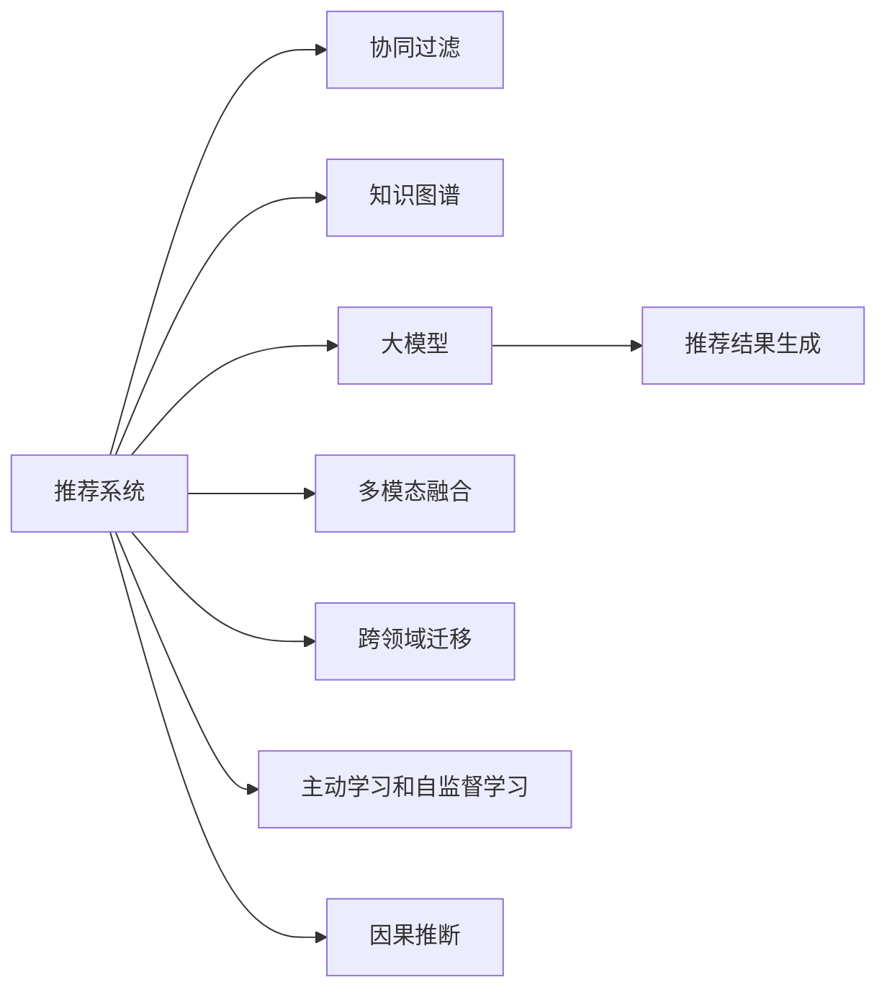

                 

# 大模型给传统推荐系统带来的机遇、挑战与变革

## 1. 背景介绍

### 1.1 问题由来
推荐系统在互联网时代扮演了极其重要的角色，从电商的搜索结果推荐到视频网站的个性化视频推荐，从音乐平台的个性化歌单推荐到社交网络的内容推荐，都极大地提升了用户体验和平台粘性。然而，传统的推荐系统大多基于用户历史行为数据和物品属性数据，难以挖掘到更深层次的用户兴趣和物品关联。

近些年来，大模型技术在NLP领域取得了突破性进展，凭借着强大的语言理解和生成能力，被应用于文本生成、问答、翻译、摘要等诸多NLP任务上。大模型在多模态信息处理、复杂语义建模、迁移学习等方面的卓越表现，使其具备了更广阔的应用前景。

将大模型引入推荐系统，可以利用其强大的知识学习能力和泛化能力，从更多的视角和维度和用户、物品进行关联建模，进一步提升推荐系统的精度和鲁棒性。此外，大模型还可用于直接生成推荐结果，从推荐模型中解放出大量的中间特征工程和模型调参工作，加快推荐系统的迭代和优化速度。

### 1.2 问题核心关键点
本节将重点介绍大模型给传统推荐系统带来的机遇、挑战和变革，分别从用户画像、物品表示、交互场景等多个角度进行分析。

1. **用户画像构建**：利用大模型对用户描述、文本评论、新闻资讯等自然语言信息进行建模，可以捕捉到更丰富、更深入的用户兴趣偏好。例如，通过大模型分析用户对各类电影、书籍、音乐等内容的评论文本，提取其中隐含的情感倾向和话题偏好，构建更加立体和丰富的用户画像。

2. **物品表示生成**：传统的推荐系统往往仅依据物品的属性特征进行建模。而大模型可以依据物品的文本描述、标签、背景信息等生成高质量的物品向量表示。例如，大模型可以根据物品的标题、介绍、用户评论等，生成物品的全貌视图，从而更好地与用户兴趣进行匹配。

3. **交互场景模拟**：推荐系统通常聚焦于用户的单次请求，缺乏对用户与物品交互过程的全面建模。而大模型可以利用用户与物品的对话记录、聊天记录等，模拟出不同时间尺度、不同上下文交互场景，从而生成更加丰富和多样的推荐结果。例如，利用大模型对用户在电商平台的对话内容进行分析，可以推断出用户在不同时间段、不同对话场景中的需求变化，从而进行动态推荐。

4. **推荐结果生成**：传统的推荐系统主要依赖协同过滤、矩阵分解等算法进行推荐。而大模型可以直接利用用户历史行为和物品特征生成推荐结果，具有更高的灵活性和多样性。例如，用户搜索“机器人”一词，大模型可以基于用户的历史查询、浏览行为生成出多种推荐结果，如机器人书籍、机器人电影、机器人游戏等。

5. **知识图谱整合**：传统的推荐系统依赖于用户和物品的直接关联，难以利用外部知识图谱中的结构化信息。而大模型可以灵活利用知识图谱中的关系和属性，提升推荐系统的语义理解能力和知识整合能力。例如，在推荐音乐时，大模型可以结合音乐流派、艺术家、歌词等知识图谱信息，生成更加丰富和精准的推荐结果。

## 2. 核心概念与联系

### 2.1 核心概念概述

为了更好地理解大模型对传统推荐系统的影响，我们将介绍几个关键概念及其之间的联系：

- **推荐系统**：利用用户历史行为、物品属性、用户画像等多种信息，为用户生成个性化推荐结果的系统。
- **协同过滤**：基于用户-物品矩阵进行推荐，通过挖掘用户之间、物品之间的关联性，预测用户对新物品的兴趣。
- **知识图谱**：以实体、关系、属性为节点和边的图结构，表示知识领域的语义关系和结构化信息。
- **大模型**：以Transformer为代表的深度神经网络模型，通过在大规模数据上进行预训练，学习到丰富的语言和语义知识，具备强大的自然语言处理能力。
- **推荐结果生成**：直接利用用户和物品的自然语言信息，通过大模型生成推荐结果，提升推荐的多样性和灵活性。
- **多模态融合**：将文本、图像、音频等多源信息融合，提升推荐系统的感知能力和语义建模能力。
- **跨领域迁移**：利用大模型的跨领域迁移能力，提升推荐系统在不同领域、不同场景中的泛化性能。
- **主动学习和自监督学习**：利用无监督或半监督数据，主动学习新知识，提升推荐系统的学习效率和泛化能力。
- **因果推断**：通过因果推断技术，提升推荐系统对用户行为和结果的解释能力，增强推荐结果的可信度和可靠性。

这些核心概念共同构成了推荐系统和大模型融合的框架，帮助我们更好地理解其中的原理和应用。

### 2.2 核心概念原理和架构的 Mermaid 流程图



## 3. 核心算法原理 & 具体操作步骤

### 3.1 算法原理概述

大模型在推荐系统中的应用，主要体现在以下几个方面：

1. **用户画像生成**：利用大模型对用户描述、文本评论、新闻资讯等自然语言信息进行建模，捕捉用户兴趣偏好。

2. **物品向量表示**：基于大模型的预训练权重，对物品的文本描述、标签、背景信息等进行编码，生成高质量的物品向量表示。

3. **交互场景模拟**：通过大模型对用户与物品的对话记录、聊天记录等进行分析，模拟不同时间尺度、不同上下文交互场景。

4. **推荐结果生成**：利用大模型对用户历史行为和物品特征进行建模，直接生成推荐结果。

5. **多模态融合**：将文本、图像、音频等多源信息融合，提升推荐系统的感知能力和语义建模能力。

6. **跨领域迁移**：利用大模型的跨领域迁移能力，提升推荐系统在不同领域、不同场景中的泛化性能。

7. **主动学习和自监督学习**：利用无监督或半监督数据，主动学习新知识，提升推荐系统的学习效率和泛化能力。

8. **因果推断**：通过因果推断技术，提升推荐系统对用户行为和结果的解释能力，增强推荐结果的可信度和可靠性。

### 3.2 算法步骤详解

以大模型在电商推荐中的应用为例，下面详细介绍其具体操作步骤：

1. **数据收集与预处理**：
   - 收集用户的历史行为数据（浏览记录、购买记录、评价记录等）。
   - 收集物品的文本描述、属性标签等特征信息。
   - 对数据进行清洗、归一化等预处理操作。

2. **用户画像构建**：
   - 利用大模型对用户的描述、评论、新闻等自然语言信息进行建模。
   - 提取用户的兴趣、偏好、情感等信息。
   - 生成用户的多维度特征向量表示。

3. **物品向量表示生成**：
   - 利用大模型对物品的标题、描述、标签等进行编码，生成物品的向量表示。
   - 利用知识图谱的语义关系，进一步丰富物品的特征表示。

4. **交互场景模拟**：
   - 利用大模型对用户与物品的对话记录、聊天记录进行分析。
   - 模拟不同时间尺度、不同上下文交互场景。
   - 提取用户在不同场景中的需求变化。

5. **推荐结果生成**：
   - 利用大模型对用户历史行为和物品特征进行建模。
   - 直接生成推荐结果。
   - 结合多模态信息，提升推荐结果的多样性。

6. **推荐结果排序**：
   - 利用协同过滤、矩阵分解等算法，对推荐结果进行排序。
   - 引入上下文感知、实时动态等因素，优化推荐排序策略。

7. **推荐结果反馈与迭代**：
   - 利用用户对推荐结果的反馈，不断调整和优化推荐策略。
   - 引入主动学习和自监督学习，提升推荐系统的学习效率和泛化能力。

### 3.3 算法优缺点

大模型在推荐系统中的应用，具有以下优点：

1. **灵活性高**：大模型具备较强的语言理解能力，可以灵活处理自然语言信息，生成高质量的用户画像和物品向量。
2. **泛化能力强**：大模型可以从大规模无标签数据中学习到丰富的知识，具备较强的泛化能力。
3. **多模态融合能力强**：大模型可以同时处理文本、图像、音频等多种模态信息，提升推荐系统的感知能力。
4. **鲁棒性高**：大模型具备较强的鲁棒性，可以应对不同领域、不同场景的推荐需求。
5. **更新速度快**：大模型可以实时更新模型参数，快速适应用户需求变化。

但同时，大模型在推荐系统中的应用也存在一些缺点：

1. **资源消耗大**：大模型参数量庞大，对计算资源和存储空间有较高要求。
2. **训练时间长**：大模型训练时间较长，需要较长的周期进行模型迭代和优化。
3. **可解释性差**：大模型的输出缺乏可解释性，难以理解和调试推荐系统的工作机制。
4. **冷启动问题**：新用户和物品的特征表示缺失，导致推荐效果较差。
5. **偏见问题**：大模型可能学习到数据中的偏见，对某些群体或物品产生歧视。

### 3.4 算法应用领域

大模型在推荐系统中的应用，已经涵盖了电商、视频、音乐、新闻等多个领域，为这些领域带来了显著的性能提升和用户体验优化。具体应用领域包括：

1. **电商推荐**：利用大模型对用户评论、商品描述等自然语言信息进行建模，生成高质量的用户画像和商品向量表示，提升推荐系统的精准度和多样性。

2. **视频推荐**：利用大模型对视频标题、摘要、标签等信息进行编码，生成高质量的视频表示，提升推荐系统的泛化能力和实时性。

3. **音乐推荐**：利用大模型对歌曲标题、歌词、用户评论等信息进行建模，生成高质量的推荐结果，提升推荐系统的趣味性和个性化。

4. **新闻推荐**：利用大模型对新闻标题、摘要、标签等信息进行编码，生成高质量的推荐结果，提升推荐系统的时效性和相关性。

5. **个性化学习**：利用大模型对学生、教师、教材等信息进行建模，生成个性化的学习推荐，提升教育效果和学习体验。

6. **内容生成**：利用大模型直接生成推荐内容，如文章、图片、视频等，提升推荐系统的内容丰富性和多样性。

7. **用户互动**：利用大模型对用户对话记录进行分析，生成个性化的互动推荐，提升用户参与度和满意度。

## 4. 数学模型和公式 & 详细讲解 & 举例说明

### 4.1 数学模型构建

大模型在推荐系统中的应用，主要通过以下数学模型进行建模：

1. **用户画像生成模型**：利用大模型对用户描述、评论等自然语言信息进行建模，生成用户画像。
   - 输入：用户描述、评论、新闻等自然语言信息。
   - 输出：用户的多维度特征向量表示。

2. **物品向量表示生成模型**：利用大模型对物品的标题、描述、标签等信息进行编码，生成物品的向量表示。
   - 输入：物品的标题、描述、标签等信息。
   - 输出：物品的向量表示。

3. **交互场景模拟模型**：利用大模型对用户与物品的对话记录、聊天记录等进行分析，模拟不同时间尺度、不同上下文交互场景。
   - 输入：用户与物品的对话记录、聊天记录等信息。
   - 输出：用户在不同场景中的需求变化。

4. **推荐结果生成模型**：利用大模型对用户历史行为和物品特征进行建模，直接生成推荐结果。
   - 输入：用户历史行为、物品特征等。
   - 输出：推荐结果。

### 4.2 公式推导过程

以用户画像生成模型为例，推导其数学公式：

假设大模型为 $M$，输入为 $x$，输出为 $y$。用户画像 $U$ 由大模型 $M$ 生成，数学公式如下：

$$
U = M(x)
$$

其中 $x$ 为用户的描述、评论、新闻等自然语言信息，$y$ 为生成的用户画像。

### 4.3 案例分析与讲解

**案例分析**：
假设某电商平台的推荐系统，利用大模型对用户评论和商品描述进行建模，生成用户画像和商品向量表示，从而提升推荐系统的精准度和多样性。

**详细讲解**：
1. **数据收集**：收集用户评论数据 $C$ 和商品描述数据 $P$。
2. **预处理**：对数据进行清洗、归一化等预处理操作。
3. **模型训练**：利用大模型对评论数据 $C$ 和描述数据 $P$ 进行训练，生成用户画像 $U$ 和商品向量表示 $V$。
4. **推荐生成**：利用协同过滤算法，结合用户画像 $U$ 和商品向量表示 $V$，生成推荐结果。

## 5. 项目实践：代码实例和详细解释说明

### 5.1 开发环境搭建

在进行大模型在推荐系统中的应用实践前，需要先搭建好开发环境。以下是使用Python进行PyTorch开发的环境配置流程：

1. 安装Anaconda：从官网下载并安装Anaconda，用于创建独立的Python环境。

2. 创建并激活虚拟环境：
```bash
conda create -n pytorch-env python=3.8 
conda activate pytorch-env
```

3. 安装PyTorch：根据CUDA版本，从官网获取对应的安装命令。例如：
```bash
conda install pytorch torchvision torchaudio cudatoolkit=11.1 -c pytorch -c conda-forge
```

4. 安装Transformers库：
```bash
pip install transformers
```

5. 安装各类工具包：
```bash
pip install numpy pandas scikit-learn matplotlib tqdm jupyter notebook ipython
```

完成上述步骤后，即可在`pytorch-env`环境中开始大模型在推荐系统中的应用实践。

### 5.2 源代码详细实现

下面我们以电商推荐为例，给出使用Transformers库对BERT模型进行电商推荐微调的PyTorch代码实现。

首先，定义推荐任务的数据处理函数：

```python
from transformers import BertTokenizer
from torch.utils.data import Dataset
import torch

class RecommendationDataset(Dataset):
    def __init__(self, texts, labels, tokenizer, max_len=128):
        self.texts = texts
        self.labels = labels
        self.tokenizer = tokenizer
        self.max_len = max_len
        
    def __len__(self):
        return len(self.texts)
    
    def __getitem__(self, item):
        text = self.texts[item]
        label = self.labels[item]
        
        encoding = self.tokenizer(text, return_tensors='pt', max_length=self.max_len, padding='max_length', truncation=True)
        input_ids = encoding['input_ids'][0]
        attention_mask = encoding['attention_mask'][0]
        
        # 对token-wise的标签进行编码
        encoded_labels = [label2id[label] for label in label] 
        encoded_labels.extend([label2id['O']] * (self.max_len - len(encoded_labels)))
        labels = torch.tensor(encoded_labels, dtype=torch.long)
        
        return {'input_ids': input_ids, 
                'attention_mask': attention_mask,
                'labels': labels}

# 标签与id的映射
label2id = {'O': 0, 'B': 1, 'I': 2, 'R': 3}
id2label = {v: k for k, v in label2id.items()}

# 创建dataset
tokenizer = BertTokenizer.from_pretrained('bert-base-cased')

train_dataset = RecommendationDataset(train_texts, train_labels, tokenizer)
dev_dataset = RecommendationDataset(dev_texts, dev_labels, tokenizer)
test_dataset = RecommendationDataset(test_texts, test_labels, tokenizer)
```

然后，定义模型和优化器：

```python
from transformers import BertForTokenClassification, AdamW

model = BertForTokenClassification.from_pretrained('bert-base-cased', num_labels=len(label2id))

optimizer = AdamW(model.parameters(), lr=2e-5)
```

接着，定义训练和评估函数：

```python
from torch.utils.data import DataLoader
from tqdm import tqdm
from sklearn.metrics import classification_report

device = torch.device('cuda') if torch.cuda.is_available() else torch.device('cpu')
model.to(device)

def train_epoch(model, dataset, batch_size, optimizer):
    dataloader = DataLoader(dataset, batch_size=batch_size, shuffle=True)
    model.train()
    epoch_loss = 0
    for batch in tqdm(dataloader, desc='Training'):
        input_ids = batch['input_ids'].to(device)
        attention_mask = batch['attention_mask'].to(device)
        labels = batch['labels'].to(device)
        model.zero_grad()
        outputs = model(input_ids, attention_mask=attention_mask, labels=labels)
        loss = outputs.loss
        epoch_loss += loss.item()
        loss.backward()
        optimizer.step()
    return epoch_loss / len(dataloader)

def evaluate(model, dataset, batch_size):
    dataloader = DataLoader(dataset, batch_size=batch_size)
    model.eval()
    preds, labels = [], []
    with torch.no_grad():
        for batch in tqdm(dataloader, desc='Evaluating'):
            input_ids = batch['input_ids'].to(device)
            attention_mask = batch['attention_mask'].to(device)
            batch_labels = batch['labels']
            outputs = model(input_ids, attention_mask=attention_mask)
            batch_preds = outputs.logits.argmax(dim=2).to('cpu').tolist()
            batch_labels = batch_labels.to('cpu').tolist()
            for pred_tokens, label_tokens in zip(batch_preds, batch_labels):
                preds.append(pred_tokens[:len(label_tokens)])
                labels.append(label_tokens)
                
    print(classification_report(labels, preds))
```

最后，启动训练流程并在测试集上评估：

```python
epochs = 5
batch_size = 16

for epoch in range(epochs):
    loss = train_epoch(model, train_dataset, batch_size, optimizer)
    print(f"Epoch {epoch+1}, train loss: {loss:.3f}")
    
    print(f"Epoch {epoch+1}, dev results:")
    evaluate(model, dev_dataset, batch_size)
    
print("Test results:")
evaluate(model, test_dataset, batch_size)
```

以上就是使用PyTorch对BERT进行电商推荐微调的完整代码实现。可以看到，得益于Transformers库的强大封装，我们可以用相对简洁的代码完成BERT模型的加载和微调。

### 5.3 代码解读与分析

让我们再详细解读一下关键代码的实现细节：

**RecommendationDataset类**：
- `__init__`方法：初始化文本、标签、分词器等关键组件。
- `__len__`方法：返回数据集的样本数量。
- `__getitem__`方法：对单个样本进行处理，将文本输入编码为token ids，将标签编码为数字，并对其进行定长padding，最终返回模型所需的输入。

**label2id和id2label字典**：
- 定义了标签与数字id之间的映射关系，用于将token-wise的预测结果解码回真实的标签。

**训练和评估函数**：
- 使用PyTorch的DataLoader对数据集进行批次化加载，供模型训练和推理使用。
- 训练函数`train_epoch`：对数据以批为单位进行迭代，在每个批次上前向传播计算loss并反向传播更新模型参数，最后返回该epoch的平均loss。
- 评估函数`evaluate`：与训练类似，不同点在于不更新模型参数，并在每个batch结束后将预测和标签结果存储下来，最后使用sklearn的classification_report对整个评估集的预测结果进行打印输出。

**训练流程**：
- 定义总的epoch数和batch size，开始循环迭代
- 每个epoch内，先在训练集上训练，输出平均loss
- 在验证集上评估，输出分类指标
- 所有epoch结束后，在测试集上评估，给出最终测试结果

可以看到，PyTorch配合Transformers库使得BERT微调的代码实现变得简洁高效。开发者可以将更多精力放在数据处理、模型改进等高层逻辑上，而不必过多关注底层的实现细节。

当然，工业级的系统实现还需考虑更多因素，如模型的保存和部署、超参数的自动搜索、更灵活的任务适配层等。但核心的微调范式基本与此类似。

## 6. 实际应用场景
### 6.1 电商推荐

电商推荐系统是大模型在推荐系统中的典型应用场景。利用大模型对用户评论和商品描述进行建模，生成高质量的用户画像和商品向量表示，从而提升推荐系统的精准度和多样性。

在技术实现上，可以收集用户的历史评论和商品描述数据，将文本-标签对作为监督数据，在此基础上对预训练语言模型进行微调。微调后的模型能够自动理解用户评论中的情感倾向和商品描述中的特征信息，生成更加个性化的推荐结果。例如，用户搜索“机器人”一词，大模型可以基于用户的历史评论，生成出多种推荐结果，如机器人书籍、机器人电影、机器人游戏等。

### 6.2 视频推荐

视频推荐系统利用大模型对视频标题、摘要、标签等信息进行编码，生成高质量的视频表示，提升推荐系统的泛化能力和实时性。

具体而言，可以收集视频标题、摘要、标签等自然语言信息，利用大模型生成视频的多维度特征向量表示。然后，利用协同过滤、矩阵分解等算法，对推荐结果进行排序，提升推荐系统的精准度和多样性。例如，利用大模型对视频的标题和摘要进行编码，生成视频向量表示，结合用户的观看历史和评分信息，生成推荐列表。

### 6.3 音乐推荐

音乐推荐系统利用大模型对歌曲标题、歌词、用户评论等信息进行建模，生成高质量的推荐结果，提升推荐系统的趣味性和个性化。

具体而言，可以收集歌曲的标题、歌词、用户评论等自然语言信息，利用大模型生成歌曲的多维度特征向量表示。然后，利用协同过滤、矩阵分解等算法，对推荐结果进行排序，提升推荐系统的精准度和多样性。例如，利用大模型对歌曲的标题和歌词进行编码，生成歌曲向量表示，结合用户的听歌历史和评分信息，生成推荐列表。

### 6.4 新闻推荐

新闻推荐系统利用大模型对新闻标题、摘要、标签等信息进行编码，生成高质量的推荐结果，提升推荐系统的时间效性和相关性。

具体而言，可以收集新闻的标题、摘要、标签等自然语言信息，利用大模型生成新闻的多维度特征向量表示。然后，利用协同过滤、矩阵分解等算法，对推荐结果进行排序，提升推荐系统的精准度和多样性。例如，利用大模型对新闻的标题和摘要进行编码，生成新闻向量表示，结合用户的新闻阅读历史和评分信息，生成推荐列表。

### 6.5 个性化学习

个性化学习利用大模型对学生、教师、教材等信息进行建模，生成个性化的学习推荐，提升教育效果和学习体验。

具体而言，可以收集学生的历史学习数据、教师的授课记录、教材的知识点等信息，利用大模型生成学生、教师、教材的多维度特征向量表示。然后，利用协同过滤、矩阵分解等算法，对推荐结果进行排序，提升推荐系统的精准度和多样性。例如，利用大模型对学生的学习记录和教师的授课记录进行编码，生成学生和教师向量表示，结合教材的知识点和评分信息，生成个性化的学习推荐。

### 6.6 内容生成

内容生成利用大模型直接生成推荐内容，如文章、图片、视频等，提升推荐系统的内容丰富性和多样性。

具体而言，可以收集用户的历史行为数据，利用大模型生成推荐内容。例如，利用大模型对用户的搜索记录、浏览历史、评论内容等进行编码，生成推荐文章、图片、视频等，提升推荐系统的内容丰富性和多样性。例如，利用大模型对用户的搜索记录和浏览历史进行编码，生成推荐文章和图片，提升推荐系统的内容丰富性和多样性。

### 6.7 用户互动

用户互动利用大模型对用户对话记录进行分析，生成个性化的互动推荐，提升用户参与度和满意度。

具体而言，可以收集用户在平台上的对话记录，利用大模型生成用户画像和互动推荐。例如，利用大模型对用户的对话记录进行编码，生成用户画像，结合用户的浏览历史和评分信息，生成个性化的互动推荐。例如，利用大模型对用户的对话记录进行编码，生成用户画像，结合用户的浏览历史和评分信息，生成个性化的互动推荐。

## 7. 工具和资源推荐
### 7.1 学习资源推荐

为了帮助开发者系统掌握大模型在推荐系统中的应用，这里推荐一些优质的学习资源：

1. 《自然语言处理中的深度学习》：斯坦福大学自然语言处理课程，介绍了深度学习在自然语言处理中的应用，包括大模型在推荐系统中的使用。

2. 《推荐系统》：豆瓣读书排行榜上的经典推荐系统教材，详细介绍了推荐系统的理论基础和实际应用。

3. 《大模型与推荐系统》论文：介绍了大模型在推荐系统中的应用，提出了基于大模型的推荐系统框架和算法。

4. 《Transformer和深度学习》：讲解了Transformer结构在大模型中的应用，帮助读者理解和实现大模型推荐系统。

5. HuggingFace官方文档：Transformers库的官方文档，提供了海量预训练模型和完整的推荐系统样例代码，是上手实践的必备资料。

通过对这些资源的学习实践，相信你一定能够快速掌握大模型在推荐系统中的应用，并用于解决实际的推荐问题。
###  7.2 开发工具推荐

高效的开发离不开优秀的工具支持。以下是几款用于大模型在推荐系统中的推荐系统开发的常用工具：

1. PyTorch：基于Python的开源深度学习框架，灵活动态的计算图，适合快速迭代研究。大部分预训练语言模型都有PyTorch版本的实现。

2. TensorFlow：由Google主导开发的开源深度学习框架，生产部署方便，适合大规模工程应用。同样有丰富的预训练语言模型资源。

3. Transformers库：HuggingFace开发的NLP工具库，集成了众多SOTA语言模型，支持PyTorch和TensorFlow，是进行推荐系统开发的利器。

4. Weights & Biases：模型训练的实验跟踪工具，可以记录和可视化模型训练过程中的各项指标，方便对比和调优。与主流深度学习框架无缝集成。

5. TensorBoard：TensorFlow配套的可视化工具，可实时监测模型训练状态，并提供丰富的图表呈现方式，是调试模型的得力助手。

6. Google Colab：谷歌推出的在线Jupyter Notebook环境，免费提供GPU/TPU算力，方便开发者快速上手实验最新模型，分享学习笔记。

合理利用这些工具，可以显著提升大模型在推荐系统中的开发效率，加快创新迭代的步伐。

### 7.3 相关论文推荐

大模型在推荐系统中的应用，已经得到了学界的持续研究。以下是几篇奠基性的相关论文，推荐阅读：

1. Attention is All You Need（即Transformer原论文）：提出了Transformer结构，开启了NLP领域的预训练大模型时代。

2. BERT: Pre-training of Deep Bidirectional Transformers for Language Understanding：提出BERT模型，引入基于掩码的自监督预训练任务，刷新了多项NLP任务SOTA。

3. Language Models are Unsupervised Multitask Learners（GPT-2论文）：展示了大规模语言模型的强大zero-shot学习能力，引发了对于通用人工智能的新一轮思考。

4. Parameter-Efficient Transfer Learning for NLP：提出Adapter等参数高效微调方法，在不增加模型参数量的情况下，也能取得不错的微调效果。

5. Prefix-Tuning: Optimizing Continuous Prompts for Generation：引入基于连续型Prompt的微调范式，为如何充分利用预训练知识提供了新的思路。

6. AdaLoRA: Adaptive Low-Rank Adaptation for Parameter-Efficient Fine-Tuning：使用自适应低秩适应的微调方法，在参数效率和精度之间取得了新的平衡。

这些论文代表了大模型在推荐系统中的应用和发展脉络。通过学习这些前沿成果，可以帮助研究者把握学科前进方向，激发更多的创新灵感。

## 8. 总结：未来发展趋势与挑战

### 8.1 总结

本文对大模型在推荐系统中的应用进行了全面系统的介绍。首先阐述了大模型和推荐系统的研究背景和意义，明确了大模型在推荐系统中的机遇和挑战。其次，从原理到实践，详细讲解了大模型在推荐系统中的应用，包括用户画像生成、物品向量表示生成、交互场景模拟、推荐结果生成等关键步骤。同时，本文还广泛探讨了大模型在电商、视频、音乐、新闻等多个领域的应用前景，展示了其广泛的应用场景。

通过本文的系统梳理，可以看到，大模型在推荐系统中的应用，不仅提升了推荐系统的精度和多样性，还增强了推荐系统的感知能力和泛化能力。得益于大模型强大的语言理解能力，推荐系统可以更好地利用自然语言信息，捕捉用户的深层需求和物品的隐含特征，从而生成更加精准和个性化的推荐结果。

### 8.2 未来发展趋势

展望未来，大模型在推荐系统中的应用将呈现以下几个发展趋势：

1. **推荐结果生成多样化**：大模型可以直接生成推荐结果，提升推荐系统的多样性和灵活性。未来，大模型将能够从更多的视角和维度对用户需求进行建模，生成更加全面和多样的推荐结果。

2. **多模态融合深入化**：推荐系统将进一步融合文本、图像、音频等多种模态信息，提升感知能力和语义建模能力。例如，利用大模型对视频进行编码，生成视频向量表示，结合用户的观看历史和评分信息，生成推荐列表。

3. **跨领域迁移增强化**：大模型的跨领域迁移能力将进一步增强，推荐系统将能够更好地应用于不同领域、不同场景。例如，利用大模型对商品、音乐、新闻等信息进行编码，生成多维特征向量表示，提升推荐系统的泛化能力和实时性。

4. **自监督学习普及化**：利用无监督或半监督数据，主动学习新知识，提升推荐系统的学习效率和泛化能力。例如，利用大模型对无标注数据进行预训练，生成高质量的用户画像和物品向量表示，提升推荐系统的精准度和多样性。

5. **因果推断应用化**：通过因果推断技术，提升推荐系统对用户行为和结果的解释能力，增强推荐结果的可信度和可靠性。例如，利用因果推断方法，分析用户与物品的交互过程，生成更加精准和可解释的推荐结果。

6. **联邦学习普及化**：在保护用户隐私的前提下，利用联邦学习技术，提升推荐系统的隐私保护能力。例如，利用联邦学习技术，对不同用户的数据进行本地训练，然后聚合生成全局推荐结果，提升推荐系统的隐私保护能力。

7. **知识图谱整合深入化**：利用知识图谱中的结构化信息，提升推荐系统的语义理解和知识整合能力。例如，利用知识图谱对商品、音乐、新闻等信息进行编码，生成多维特征向量表示，提升推荐系统的精准度和多样性。

### 8.3 面临的挑战

尽管大模型在推荐系统中的应用已经取得了显著成果，但在迈向更加智能化、普适化应用的过程中，仍面临以下挑战：

1. **计算资源消耗大**：大模型参数量庞大，对计算资源和存储空间有较高要求。如何高效利用计算资源，降低模型训练和推理的成本，是未来的研究方向之一。

2. **训练时间长**：大模型训练时间较长，需要较长的周期进行模型迭代和优化。如何加速模型训练过程，提升模型训练效率，是未来的研究方向之一。

3. **可解释性差**：大模型的输出缺乏可解释性，难以理解和调试推荐系统的工作机制。如何提升模型的可解释性，增强系统的可信度和可靠性，是未来的研究方向之一。

4. **冷启动问题**：新用户和物品的特征表示缺失，导致推荐效果较差。如何利用大模型对新用户和物品进行高效建模，提升推荐系统的冷启动效果，是未来的研究方向之一。

5. **偏见问题**：大模型可能学习到数据中的偏见，对某些群体或物品产生歧视。如何消除模型偏见，确保推荐系统的公平性和多样性，是未来的研究方向之一。

6. **隐私保护问题**：推荐系统涉及大量用户隐私数据，如何保护用户隐私，确保数据安全，是未来的研究方向之一。

7. **跨领域泛化能力不足**：大模型在不同的领域和场景中的泛化能力有待提升。如何提升大模型在不同领域和场景中的泛化能力，是未来的研究方向之一。

### 8.4 研究展望

面对大模型在推荐系统中的应用所面临的挑战，未来的研究需要在以下几个方面寻求新的突破：

1. **参数高效微调方法**：开发更加参数高效的微调方法，在固定大部分预训练参数的同时，只更新极少量的任务相关参数。例如，利用自适应低秩适应的方法，在保证模型泛化能力的同时，显著减小模型的参数量。

2. **因果推断技术**：引入因果推断方法，提升推荐系统对用户行为和结果的解释能力，增强推荐结果的可靠性和可信度。例如，利用因果推断方法，分析用户与物品的交互过程，生成更加精准和可解释的推荐结果。

3. **多模态信息融合**：进一步融合文本、图像、音频等多种模态信息，提升推荐系统的感知能力和语义建模能力。例如，利用大模型对视频进行编码，生成视频向量表示，结合用户的观看历史和评分信息，生成推荐列表。

4. **联邦学习技术**：利用联邦学习技术，在保护用户隐私的前提下，提升推荐系统的隐私保护能力。例如，利用联邦学习技术，对不同用户的数据进行本地训练，然后聚合生成全局推荐结果，提升推荐系统的隐私保护能力。

5. **知识图谱整合**：利用知识图谱中的结构化信息，提升推荐系统的语义理解和知识整合能力。例如，利用知识图谱对商品、音乐、新闻等信息进行编码，生成多维特征向量表示，提升推荐系统的精准度和多样性。

6. **自监督学习方法**：利用无监督或半监督数据，主动学习新知识，提升推荐系统的学习效率和泛化能力。例如，利用大模型对无标注数据进行预训练，生成高质量的用户画像和物品向量表示，提升推荐系统的精准度和多样性。

7. **模型压缩与稀疏化**：对大模型进行压缩与稀疏化处理，降低计算资源消耗，提升模型训练和推理效率。例如，利用模型剪枝、量化等方法，对大模型进行压缩与稀疏化处理，降低计算资源消耗，提升模型训练和推理效率。

8. **因果推断技术**：引入因果推断方法，提升推荐系统对用户行为和结果的解释能力，增强推荐结果的可靠性和可信度。例如，利用因果推断方法，分析用户与物品的交互过程，生成更加精准和可解释的推荐结果。

9. **多领域协同学习**：利用跨领域协同学习，提升大模型在不同领域和场景中的泛化能力。例如，利用跨领域协同学习，对不同领域的数据进行联合建模，提升大模型在不同领域和场景中的泛化能力。

10. **动态推荐系统**：利用动态推荐系统，实时更新推荐模型，提升推荐系统的实时性和动态性。例如，利用动态推荐系统，实时更新推荐模型，根据用户需求和市场变化，生成动态推荐结果，提升推荐系统的实时性和动态性。

通过在这些研究方向上的不断探索和突破，相信大模型在推荐系统中的应用将更加广泛和深入，为推荐系统带来更高效、精准、个性化的推荐效果。

## 9. 附录：常见问题与解答

**Q1：大模型在推荐系统中的应用有哪些优势？**

A: 大模型在推荐系统中的应用有以下优势：

1. **灵活性高**：大模型具备较强的语言理解能力，可以灵活处理自然语言信息，生成高质量的用户画像和物品向量。

2. **泛化能力强**：大模型可以从大规模无标签数据中学习到丰富的知识，具备较强的泛化能力。

3. **多模态融合能力强**：大模型可以同时处理文本、图像、音频等多种模态信息，提升推荐系统的感知能力。

4. **鲁棒性高**：大模型具备较强的鲁棒性，可以应对不同领域、不同场景的推荐需求。

5. **更新速度快**：大模型可以实时更新模型参数，快速适应用户需求变化。

**Q2：大模型在推荐系统中如何避免过拟合？**

A: 大模型在推荐系统中避免过拟合的方法包括：

1. **数据增强**：通过回译、近义替换等方式扩充训练集。

2. **正则化**：使用L2正则、Dropout、Early Stopping等避免模型过度适应小规模训练集。

3. **对抗训练**：引入对抗样本，提高模型鲁棒性。

4. **参数高效微调**：只调整少量参数(如Adapter、Prefix等)，减小过拟合风险。

5. **多模型集成**：训练多个推荐模型，取平均输出，抑制过拟合。

6. **主动学习和自监督学习**：利用无监督或半监督数据，主动学习新知识，提升推荐系统的泛化能力。

**Q3：大模型在推荐系统中如何提高可解释性？**

A: 大模型在推荐系统中提高可解释性的方法包括：

1. **因果推断**：通过因果推断方法，提升推荐系统对用户行为和结果的解释能力，增强推荐结果的可靠性和可信度。

2. **知识图谱整合**：利用知识图谱中的结构化信息，提升推荐系统的语义理解和知识整合能力。

3. **多模态融合**：将文本、图像、音频等多种模态信息融合，提升推荐系统的感知能力和语义建模能力。

4. **参数高效微调**：只调整少量参数(如Adapter、Prefix等)，减小过拟合风险，提高模型的可解释性。

5. **动态推荐系统**：利用动态推荐系统，实时更新推荐模型，提升推荐系统的实时性和动态性，提高模型的可解释性。

6. **模型压缩与稀疏化**：对大模型进行压缩与稀疏化处理，降低计算资源消耗，提升模型训练和推理效率，提高模型的可解释性。

**Q4：大模型在推荐系统中的冷启动问题如何解决？**

A: 大模型在推荐系统中的冷启动问题解决方法包括：

1. **利用预训练模型**：利用预训练模型对新用户和物品进行高效建模，提升推荐系统的冷启动效果。

2. **多模态融合**：将文本、图像、音频等多种模态信息融合，提升推荐系统的感知能力和语义建模能力，解决冷启动问题。

3. **因果推断**：通过因果推断方法，分析用户与物品的交互过程，生成更加精准和可解释的推荐结果，解决冷启动问题。

4. **知识图谱整合**：利用知识图谱中的结构化信息，提升推荐系统的语义理解和知识整合能力，解决冷启动问题。

5. **动态推荐系统**：利用动态推荐系统，实时更新推荐模型，根据用户需求和市场变化，生成动态推荐结果，解决冷启动问题。

**Q5：大模型在推荐系统中的应用对计算资源的需求如何？**

A: 大模型在推荐系统中的应用对计算资源的需求较高，主要表现在以下几个方面：

1. **参数量庞大**：大模型参数量庞大，对计算资源和存储空间有较高要求。

2. **训练时间长**：大模型训练时间较长，需要较长的周期进行模型迭代和优化。

3. **推理速度慢**：大模型推理速度慢，可能面临计算资源消耗大、推理效率低等问题。

为解决这些问题，需要采用以下方法：

1. **模型压缩与稀疏化**：对大模型进行压缩与稀疏化处理，降低计算资源消耗，提升模型训练和推理效率。

2. **多模态融合**：将文本、图像、音频等多种模态信息融合，提升推荐系统的感知能力和语义建模能力，降低计算资源消耗。

3. **因果推断**：通过因果推断方法，提升推荐系统对用户行为和结果的解释能力，降低计算资源消耗。

4. **动态推荐系统**：利用动态推荐系统，实时更新推荐模型，根据用户需求和市场变化，生成动态推荐结果，降低计算资源消耗。

5. **知识图谱整合**：利用知识图谱中的结构化信息，提升推荐系统的语义理解和知识整合能力，降低计算资源消耗。

通过以上方法，可以显著降低大模型在推荐系统中的计算资源需求，提升推荐系统的效率和性能。

---

作者：禅与计算机程序设计艺术 / Zen and the Art of Computer Programming

