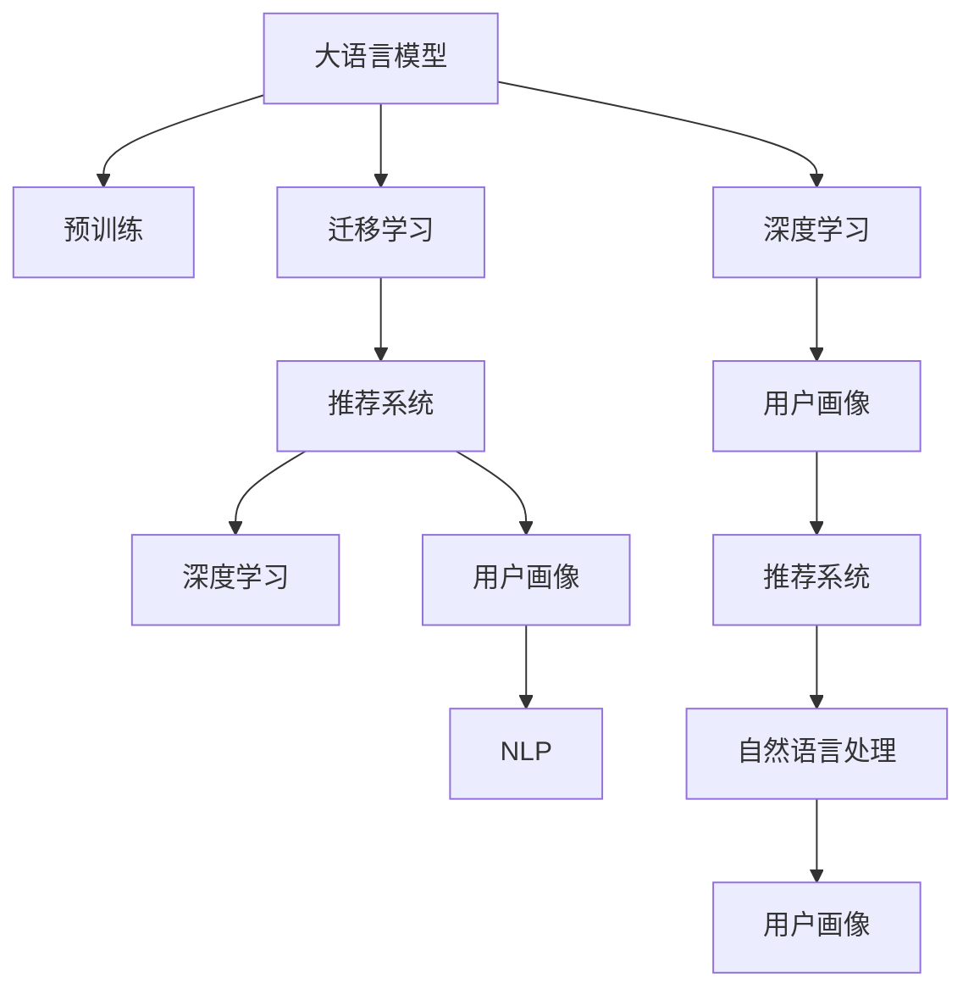

                 

## 1. 背景介绍

### 1.1 问题由来
随着互联网的迅猛发展和电子商务的普及，推荐系统成为了互联网公司获取商业价值的重要手段。传统的协同过滤、基于内容的推荐方法在用户画像不够完善、数据冷启动问题突出的场景下，推荐效果不尽如人意。与此同时，大规模预训练语言模型（Large Language Models, LLMs）如BERT、GPT-3等在自然语言处理（NLP）领域取得巨大成功，引起了学术界和工业界的高度关注。

在推荐系统领域，如何有效利用大语言模型的预训练知识和下游任务（如用户行为预测、文本分类等）进行迁移学习，成为了热门的研究课题。通过在大规模无标签文本数据上进行预训练，大语言模型可以学习到广泛的知识，包括文本语义、实体关系、情感倾向等。利用这些知识，可以对用户的意图和偏好进行更深入的理解，从而提高推荐系统的精准度和个性化程度。

### 1.2 问题核心关键点
本节将介绍几个关键问题，这些问题是大模型视角下推荐系统优化的核心所在：

1. **大语言模型如何与推荐系统融合**：如何将大语言模型的知识与推荐算法结合起来，提升推荐系统的表现。
2. **用户行为理解的多维度建模**：如何综合利用文本、行为等数据，建立更全面的用户画像。
3. **用户行为预测的深度学习应用**：如何在大模型基础上进行微调，实现用户行为预测的精准化。
4. **个性化推荐模型的稳定性和鲁棒性**：如何在保证模型灵活性的同时，提升其稳定性和抗干扰能力。
5. **推荐系统的未来发展方向**：如何基于大模型进行创新，探索推荐系统的新范式。

这些问题通过大语言模型的应用得到了新的解答，为推荐系统的发展提供了新的方向。

### 1.3 问题研究意义
深入理解用户的意图和行为，是提升推荐系统效果的关键。传统的推荐系统主要依赖于用户行为数据，难以充分挖掘用户的多方面信息。而利用大语言模型，可以从文本、情感、实体等多个维度全面解析用户行为，从而极大地提高推荐系统的精准度和个性化程度。

大模型视角下的推荐系统研究，不仅能解决推荐系统冷启动问题，还能提供新的解决方案，应对推荐系统中出现的异常数据、噪声等问题。此外，大语言模型还能促进推荐系统向多样化、个性化、智能化方向发展，为推荐系统的应用领域打开新的窗口。

## 2. 核心概念与联系

### 2.1 核心概念概述

为了更好地理解大语言模型在推荐系统中的应用，本节将介绍几个密切相关的核心概念：

- **大语言模型（Large Language Models, LLMs）**：如BERT、GPT等基于Transformer的模型，通过在大规模无标签文本数据上进行预训练，学习到语言知识，具备强大的自然语言处理能力。
- **预训练（Pre-training）**：指在大规模无标签文本数据上，通过自监督学习任务训练通用语言模型的过程。常见的预训练任务包括掩码语言模型、下一句预测等。
- **迁移学习（Transfer Learning）**：将一个领域学习到的知识，迁移应用到另一个不同但相关的领域的学习范式。大模型的预训练-微调过程即是一种典型的迁移学习方式。
- **推荐系统（Recommendation System）**：根据用户历史行为和兴趣爱好，为用户推荐合适物品的系统，旨在提升用户体验和商家收益。
- **深度学习（Deep Learning）**：基于神经网络的机器学习技术，用于解决复杂的推荐问题。
- **用户画像（User Profile）**：通过用户的行为、文本、社会关系等数据构建的用户的综合画像，用于推荐系统中的用户行为预测。
- **自然语言处理（NLP）**：使用计算机处理和理解自然语言的技术，如文本分类、实体识别、情感分析等。

这些概念之间的逻辑关系可以通过以下Mermaid流程图来展示：



这个流程图展示了大语言模型、预训练、迁移学习与推荐系统之间的紧密联系，揭示了它们在大模型视角下推荐系统中的应用路径。

## 3. 核心算法原理 & 具体操作步骤
### 3.1 算法原理概述

基于大语言模型视角下的推荐系统，本质上是一个有监督的迁移学习过程。其核心思想是：利用大语言模型在海量无标签文本数据上进行预训练，学习到通用的语言知识。然后将这些知识迁移到推荐系统的用户行为理解中，提升用户行为预测的准确性。

形式化地，假设大语言模型为 $M_{\theta}$，其中 $\theta$ 为预训练得到的模型参数。给定推荐系统中的用户 $u$ 和商品 $i$，用户行为数据为 $(x_i, y_i)$，其中 $x_i$ 为历史行为数据（如浏览记录、购买记录），$y_i$ 为用户是否购买商品 $i$。推荐系统的目标是构建一个预测模型 $M_{\hat{\theta}}$，使得：

$$
\hat{\theta}=\mathop{\arg\min}_{\theta} \mathcal{L}(M_{\theta},\{x_i\}_{i=1}^N)
$$

其中 $\mathcal{L}$ 为针对推荐系统的损失函数，用于衡量模型预测与实际标签之间的差异。常见的损失函数包括交叉熵损失、均方误差损失等。

通过梯度下降等优化算法，微调过程不断更新模型参数 $\theta$，最小化损失函数 $\mathcal{L}$，使得模型预测逼近真实标签。由于 $\theta$ 已经通过预训练获得了较好的初始化，因此即便在小规模数据集上，微调也能较快收敛到理想的模型参数 $\hat{\theta}$。

### 3.2 算法步骤详解

基于大语言模型视角下的推荐系统微调，一般包括以下几个关键步骤：

**Step 1: 准备预训练模型和数据集**
- 选择合适的预训练语言模型 $M_{\theta}$ 作为初始化参数，如 BERT、GPT 等。
- 准备推荐系统中的用户行为数据集 $D=\{(x_i,y_i)\}_{i=1}^N$，划分为训练集、验证集和测试集。

**Step 2: 添加任务适配层**
- 根据推荐系统的任务类型，在预训练模型顶层设计合适的输出层和损失函数。
- 对于二分类任务（如用户是否购买商品），通常在顶层添加线性分类器和交叉熵损失函数。
- 对于多分类任务（如商品评分预测），使用分类器输出概率分布，并以负对数似然为损失函数。

**Step 3: 设置微调超参数**
- 选择合适的优化算法及其参数，如 AdamW、SGD 等，设置学习率、批大小、迭代轮数等。
- 设置正则化技术及强度，包括权重衰减、Dropout、Early Stopping 等。
- 确定冻结预训练参数的策略，如仅微调顶层，或全部参数都参与微调。

**Step 4: 执行梯度训练**
- 将训练集数据分批次输入模型，前向传播计算损失函数。
- 反向传播计算参数梯度，根据设定的优化算法和学习率更新模型参数。
- 周期性在验证集上评估模型性能，根据性能指标决定是否触发 Early Stopping。
- 重复上述步骤直到满足预设的迭代轮数或 Early Stopping 条件。

**Step 5: 测试和部署**
- 在测试集上评估微调后模型 $M_{\hat{\theta}}$ 的性能，对比微调前后的精度提升。
- 使用微调后的模型对新样本进行推理预测，集成到实际的应用系统中。
- 持续收集新的用户行为数据，定期重新微调模型，以适应数据分布的变化。

以上是基于大语言模型视角下的推荐系统微调的一般流程。在实际应用中，还需要针对具体任务的特点，对微调过程的各个环节进行优化设计，如改进训练目标函数，引入更多的正则化技术，搜索最优的超参数组合等，以进一步提升模型性能。

### 3.3 算法优缺点

基于大语言模型视角下的推荐系统微调方法具有以下优点：
1. 数据要求低。利用大语言模型的通用知识，可以在较少标注样本的情况下，实现精准的用户行为预测。
2. 模型效果显著。微调后的模型通常具有更高的泛化能力，能够适应不同领域和不同用户的行为模式。
3. 适应性强。通过微调可以灵活应对数据分布变化，提升推荐系统的长期稳定性和鲁棒性。

同时，该方法也存在一定的局限性：
1. 计算资源需求高。预训练大模型的计算需求巨大，微调过程也需要高性能计算资源支持。
2. 过拟合风险高。小规模数据集的微调存在过拟合风险，需要通过正则化技术等手段缓解。
3. 可解释性差。大模型的决策过程难以解释，缺乏透明度。
4. 性能依赖模型质量。微调效果受预训练模型和微调算法的影响较大。

尽管存在这些局限性，但就目前而言，基于大语言模型视角下的推荐系统微调方法仍是大模型在推荐系统中的应用主流。未来相关研究的重点在于如何进一步降低微调对计算资源的依赖，提高模型的少样本学习和跨领域迁移能力，同时兼顾可解释性和伦理安全性等因素。

### 3.4 算法应用领域

基于大语言模型视角下的推荐系统微调方法，在电子商务、在线教育、智能家居等多个领域都有广泛的应用：

- **电子商务**：通过分析用户浏览、购买记录，利用预训练语言模型微调预测用户是否购买某商品，推荐个性化的商品组合。
- **在线教育**：分析学生的学习行为、课程评价，预测学生的学习兴趣和需求，推荐个性化的学习资源。
- **智能家居**：通过分析用户的日程安排、家庭设备使用记录，预测用户的行为模式，推荐个性化的家居服务和产品。
- **金融服务**：分析客户的交易记录、行为数据，预测客户的金融需求，推荐个性化的金融产品和服务。
- **医疗健康**：分析患者的医疗记录、病历信息，预测患者的疾病风险，推荐个性化的医疗服务。

除了上述这些经典应用外，大语言模型微调还被创新性地应用到更多场景中，如可控推荐、知识图谱增强、多模态推荐等，为推荐系统的应用领域打开了新的窗口。随着预训练模型和微调方法的不断进步，相信推荐系统必将在更广阔的应用领域取得新的突破。

## 4. 数学模型和公式 & 详细讲解  
### 4.1 数学模型构建

本节将使用数学语言对基于大语言模型视角下的推荐系统微调过程进行更加严格的刻画。

记大语言模型为 $M_{\theta}$，其中 $\theta$ 为预训练得到的模型参数。假设推荐系统中的用户 $u$ 和商品 $i$，用户行为数据为 $(x_i, y_i)$，其中 $x_i$ 为历史行为数据，$y_i$ 为用户是否购买商品 $i$。

定义模型 $M_{\theta}$ 在用户行为数据 $(x,y)$ 上的损失函数为 $\ell(M_{\theta}(x),y)$，则在用户行为数据集 $D=\{(x_i,y_i)\}_{i=1}^N$ 上的经验风险为：

$$
\mathcal{L}(\theta) = \frac{1}{N} \sum_{i=1}^N \ell(M_{\theta}(x_i),y_i)
$$

微调的优化目标是最小化经验风险，即找到最优参数：

$$
\theta^* = \mathop{\arg\min}_{\theta} \mathcal{L}(\theta)
$$

在实践中，我们通常使用基于梯度的优化算法（如SGD、Adam等）来近似求解上述最优化问题。设 $\eta$ 为学习率，$\lambda$ 为正则化系数，则参数的更新公式为：

$$
\theta \leftarrow \theta - \eta \nabla_{\theta}\mathcal{L}(\theta) - \eta\lambda\theta
$$

其中 $\nabla_{\theta}\mathcal{L}(\theta)$ 为损失函数对参数 $\theta$ 的梯度，可通过反向传播算法高效计算。

### 4.2 公式推导过程

以下我们以用户是否购买商品的二分类任务为例，推导交叉熵损失函数及其梯度的计算公式。

假设模型 $M_{\theta}$ 在输入 $x$ 上的输出为 $\hat{y}=M_{\theta}(x) \in [0,1]$，表示用户购买商品的概率。真实标签 $y \in \{0,1\}$。则二分类交叉熵损失函数定义为：

$$
\ell(M_{\theta}(x),y) = -[y\log \hat{y} + (1-y)\log (1-\hat{y})]
$$

将其代入经验风险公式，得：

$$
\mathcal{L}(\theta) = -\frac{1}{N}\sum_{i=1}^N [y_i\log M_{\theta}(x_i)+(1-y_i)\log(1-M_{\theta}(x_i))]
$$

根据链式法则，损失函数对参数 $\theta_k$ 的梯度为：

$$
\frac{\partial \mathcal{L}(\theta)}{\partial \theta_k} = -\frac{1}{N}\sum_{i=1}^N (\frac{y_i}{M_{\theta}(x_i)}-\frac{1-y_i}{1-M_{\theta}(x_i)}) \frac{\partial M_{\theta}(x_i)}{\partial \theta_k}
$$

其中 $\frac{\partial M_{\theta}(x_i)}{\partial \theta_k}$ 可进一步递归展开，利用自动微分技术完成计算。

在得到损失函数的梯度后，即可带入参数更新公式，完成模型的迭代优化。重复上述过程直至收敛，最终得到适应推荐系统任务的最优模型参数 $\theta^*$。

## 5. 项目实践：代码实例和详细解释说明
### 5.1 开发环境搭建

在进行推荐系统微调实践前，我们需要准备好开发环境。以下是使用Python进行PyTorch开发的环境配置流程：

1. 安装Anaconda：从官网下载并安装Anaconda，用于创建独立的Python环境。

2. 创建并激活虚拟环境：
```bash
conda create -n pytorch-env python=3.8 
conda activate pytorch-env
```

3. 安装PyTorch：根据CUDA版本，从官网获取对应的安装命令。例如：
```bash
conda install pytorch torchvision torchaudio cudatoolkit=11.1 -c pytorch -c conda-forge
```

4. 安装Transformers库：
```bash
pip install transformers
```

5. 安装各类工具包：
```bash
pip install numpy pandas scikit-learn matplotlib tqdm jupyter notebook ipython
```

完成上述步骤后，即可在`pytorch-env`环境中开始微调实践。

### 5.2 源代码详细实现

下面我们以商品推荐任务为例，给出使用Transformers库对BERT模型进行推荐系统微调的PyTorch代码实现。

首先，定义推荐系统任务的数据处理函数：

```python
from transformers import BertTokenizer
from torch.utils.data import Dataset
import torch

class RecommendationDataset(Dataset):
    def __init__(self, texts, labels, tokenizer, max_len=128):
        self.texts = texts
        self.labels = labels
        self.tokenizer = tokenizer
        self.max_len = max_len
        
    def __len__(self):
        return len(self.texts)
    
    def __getitem__(self, item):
        text = self.texts[item]
        label = self.labels[item]
        
        encoding = self.tokenizer(text, return_tensors='pt', max_length=self.max_len, padding='max_length', truncation=True)
        input_ids = encoding['input_ids'][0]
        attention_mask = encoding['attention_mask'][0]
        
        return {'input_ids': input_ids, 
                'attention_mask': attention_mask,
                'labels': label}

# 标签与id的映射
tag2id = {'buy': 0, 'not_buy': 1}
id2tag = {v: k for k, v in tag2id.items()}

# 创建dataset
tokenizer = BertTokenizer.from_pretrained('bert-base-cased')

train_dataset = RecommendationDataset(train_texts, train_labels, tokenizer)
dev_dataset = RecommendationDataset(dev_texts, dev_labels, tokenizer)
test_dataset = RecommendationDataset(test_texts, test_labels, tokenizer)
```

然后，定义模型和优化器：

```python
from transformers import BertForTokenClassification, AdamW

model = BertForTokenClassification.from_pretrained('bert-base-cased', num_labels=2)

optimizer = AdamW(model.parameters(), lr=2e-5)
```

接着，定义训练和评估函数：

```python
from torch.utils.data import DataLoader
from tqdm import tqdm
from sklearn.metrics import classification_report

device = torch.device('cuda') if torch.cuda.is_available() else torch.device('cpu')
model.to(device)

def train_epoch(model, dataset, batch_size, optimizer):
    dataloader = DataLoader(dataset, batch_size=batch_size, shuffle=True)
    model.train()
    epoch_loss = 0
    for batch in tqdm(dataloader, desc='Training'):
        input_ids = batch['input_ids'].to(device)
        attention_mask = batch['attention_mask'].to(device)
        labels = batch['labels'].to(device)
        model.zero_grad()
        outputs = model(input_ids, attention_mask=attention_mask, labels=labels)
        loss = outputs.loss
        epoch_loss += loss.item()
        loss.backward()
        optimizer.step()
    return epoch_loss / len(dataloader)

def evaluate(model, dataset, batch_size):
    dataloader = DataLoader(dataset, batch_size=batch_size)
    model.eval()
    preds, labels = [], []
    with torch.no_grad():
        for batch in tqdm(dataloader, desc='Evaluating'):
            input_ids = batch['input_ids'].to(device)
            attention_mask = batch['attention_mask'].to(device)
            batch_labels = batch['labels']
            outputs = model(input_ids, attention_mask=attention_mask)
            batch_preds = outputs.logits.argmax(dim=2).to('cpu').tolist()
            batch_labels = batch_labels.to('cpu').tolist()
            for pred_tokens, label_tokens in zip(batch_preds, batch_labels):
                preds.append(pred_tokens[:len(label_tokens)])
                labels.append(label_tokens)
                
    print(classification_report(labels, preds))
```

最后，启动训练流程并在测试集上评估：

```python
epochs = 5
batch_size = 16

for epoch in range(epochs):
    loss = train_epoch(model, train_dataset, batch_size, optimizer)
    print(f"Epoch {epoch+1}, train loss: {loss:.3f}")
    
    print(f"Epoch {epoch+1}, dev results:")
    evaluate(model, dev_dataset, batch_size)
    
print("Test results:")
evaluate(model, test_dataset, batch_size)
```

以上就是使用PyTorch对BERT进行商品推荐任务微调的完整代码实现。可以看到，得益于Transformers库的强大封装，我们可以用相对简洁的代码完成BERT模型的加载和微调。

### 5.3 代码解读与分析

让我们再详细解读一下关键代码的实现细节：

**RecommendationDataset类**：
- `__init__`方法：初始化文本、标签、分词器等关键组件。
- `__len__`方法：返回数据集的样本数量。
- `__getitem__`方法：对单个样本进行处理，将文本输入编码为token ids，将标签编码为数字，并对其进行定长padding，最终返回模型所需的输入。

**tag2id和id2tag字典**：
- 定义了标签与数字id之间的映射关系，用于将token-wise的预测结果解码回真实的标签。

**训练和评估函数**：
- 使用PyTorch的DataLoader对数据集进行批次化加载，供模型训练和推理使用。
- 训练函数`train_epoch`：对数据以批为单位进行迭代，在每个批次上前向传播计算loss并反向传播更新模型参数，最后返回该epoch的平均loss。
- 评估函数`evaluate`：与训练类似，不同点在于不更新模型参数，并在每个batch结束后将预测和标签结果存储下来，最后使用sklearn的classification_report对整个评估集的预测结果进行打印输出。

**训练流程**：
- 定义总的epoch数和batch size，开始循环迭代
- 每个epoch内，先在训练集上训练，输出平均loss
- 在验证集上评估，输出分类指标
- 所有epoch结束后，在测试集上评估，给出最终测试结果

可以看到，PyTorch配合Transformers库使得BERT微调的代码实现变得简洁高效。开发者可以将更多精力放在数据处理、模型改进等高层逻辑上，而不必过多关注底层的实现细节。

当然，工业级的系统实现还需考虑更多因素，如模型的保存和部署、超参数的自动搜索、更灵活的任务适配层等。但核心的微调范式基本与此类似。

## 6. 实际应用场景
### 6.1 智能推荐系统

基于大语言模型视角下的推荐系统，可以广泛应用于智能推荐系统的构建。传统推荐系统主要依赖用户的历史行为数据，难以深入理解用户的真实意图和偏好。而利用大语言模型的预训练知识，可以从文本、情感、实体等多个维度全面解析用户行为，从而极大地提高推荐系统的精准度和个性化程度。

在技术实现上，可以收集用户的文本评论、描述、社交媒体信息等文本数据，将其作为推荐系统的输入，同时结合用户的浏览、购买行为数据，使用微调后的模型进行推荐预测。通过这种方式，推荐系统不仅能捕捉到用户的短期行为，还能从文本中挖掘出用户的长期偏好和兴趣，提供更为精准和个性化的推荐结果。

### 6.2 个性化广告投放

大语言模型视角下的推荐系统还能应用于个性化广告投放。广告主需要找到最适合用户的广告内容，提升广告点击率和转化率。通过微调模型，广告投放平台可以分析用户的兴趣爱好、行为习惯，预测用户的广告响应概率，并根据预测结果智能推荐广告，实现精准投放。

在实际应用中，广告投放平台可以收集用户的浏览记录、点击记录、购买记录等行为数据，结合用户的文本信息（如社交媒体评论、博客文章等），使用微调后的模型进行推荐预测。通过这种方式，广告平台可以实现高效的广告推荐，提升广告效果和用户满意度。

### 6.3 金融产品推荐

金融服务行业需要向用户推荐个性化的金融产品，帮助用户理财、投资等。传统的金融推荐系统主要依赖用户的账户数据、历史交易记录等，难以充分挖掘用户的金融需求。而利用大语言模型，可以从用户的文本信息中挖掘出更深层次的金融需求，从而提供更为精准的推荐服务。

在具体实践中，金融服务提供商可以收集用户的社交媒体信息、金融评论、投资兴趣等文本数据，结合用户的交易记录、风险偏好等行为数据，使用微调后的模型进行推荐预测。通过这种方式，金融服务提供商可以实现精准的产品推荐，提升用户粘性和忠诚度，同时提升自身的业务转化率。

### 6.4 未来应用展望

随着大语言模型和推荐系统技术的不断发展，基于大语言模型视角下的推荐系统必将在更广阔的应用领域取得新的突破。

在智慧医疗领域，利用大语言模型可以从患者的文本信息中挖掘出更深层次的医疗需求，从而提供个性化的医疗服务，提升诊疗效果。

在智能家居领域，通过分析用户的日程安排、生活习惯等文本信息，结合用户的家居设备使用行为，使用微调后的模型进行推荐预测，实现个性化的家居服务和产品推荐。

在教育培训领域，利用大语言模型可以从学生的文本信息中挖掘出更深层次的学习需求和兴趣，从而提供个性化的学习资源推荐，提升学习效果和体验。

此外，在智能制造、智能城市、智能交通等多个领域，基于大语言模型视角下的推荐系统也将不断涌现，为各行各业提供新的解决方案，助力产业升级和数字化转型。

## 7. 工具和资源推荐
### 7.1 学习资源推荐

为了帮助开发者系统掌握大语言模型视角下推荐系统的理论基础和实践技巧，这里推荐一些优质的学习资源：

1. 《Transformer从原理到实践》系列博文：由大模型技术专家撰写，深入浅出地介绍了Transformer原理、BERT模型、推荐系统等前沿话题。

2. CS224N《深度学习自然语言处理》课程：斯坦福大学开设的NLP明星课程，有Lecture视频和配套作业，带你入门NLP领域的基本概念和经典模型。

3. 《Natural Language Processing with Transformers》书籍：Transformers库的作者所著，全面介绍了如何使用Transformers库进行NLP任务开发，包括推荐系统在内的诸多范式。

4. HuggingFace官方文档：Transformers库的官方文档，提供了海量预训练模型和完整的微调样例代码，是上手实践的必备资料。

5. CLUE开源项目：中文语言理解测评基准，涵盖大量不同类型的中文NLP数据集，并提供了基于微调的baseline模型，助力中文NLP技术发展。

通过对这些资源的学习实践，相信你一定能够快速掌握大语言模型视角下推荐系统的精髓，并用于解决实际的推荐系统问题。
###  7.2 开发工具推荐

高效的开发离不开优秀的工具支持。以下是几款用于大语言模型视角下推荐系统开发的常用工具：

1. PyTorch：基于Python的开源深度学习框架，灵活动态的计算图，适合快速迭代研究。大部分预训练语言模型都有PyTorch版本的实现。

2. TensorFlow：由Google主导开发的开源深度学习框架，生产部署方便，适合大规模工程应用。同样有丰富的预训练语言模型资源。

3. Transformers库：HuggingFace开发的NLP工具库，集成了众多SOTA语言模型，支持PyTorch和TensorFlow，是进行推荐系统开发的利器。

4. Weights & Biases：模型训练的实验跟踪工具，可以记录和可视化模型训练过程中的各项指标，方便对比和调优。与主流深度学习框架无缝集成。

5. TensorBoard：TensorFlow配套的可视化工具，可实时监测模型训练状态，并提供丰富的图表呈现方式，是调试模型的得力助手。

6. Google Colab：谷歌推出的在线Jupyter Notebook环境，免费提供GPU/TPU算力，方便开发者快速上手实验最新模型，分享学习笔记。

合理利用这些工具，可以显著提升大语言模型视角下推荐系统的开发效率，加快创新迭代的步伐。

### 7.3 相关论文推荐

大语言模型和推荐系统的发展源于学界的持续研究。以下是几篇奠基性的相关论文，推荐阅读：

1. Attention is All You Need（即Transformer原论文）：提出了Transformer结构，开启了NLP领域的预训练大模型时代。

2. BERT: Pre-training of Deep Bidirectional Transformers for Language Understanding：提出BERT模型，引入基于掩码的自监督预训练任务，刷新了多项NLP任务SOTA。

3. Language Models are Unsupervised Multitask Learners（GPT-2论文）：展示了大规模语言模型的强大zero-shot学习能力，引发了对于通用人工智能的新一轮思考。

4. Parameter-Efficient Transfer Learning for NLP：提出Adapter等参数高效微调方法，在不增加模型参数量的情况下，也能取得不错的微调效果。

5. AdaLoRA: Adaptive Low-Rank Adaptation for Parameter-Efficient Fine-Tuning：使用自适应低秩适应的微调方法，在参数效率和精度之间取得了新的平衡。

这些论文代表了大语言模型视角下推荐系统的发展脉络。通过学习这些前沿成果，可以帮助研究者把握学科前进方向，激发更多的创新灵感。

## 8. 总结：未来发展趋势与挑战

### 8.1 总结

本文对基于大语言模型视角下的推荐系统进行了全面系统的介绍。首先阐述了大语言模型和推荐系统研究的背景和意义，明确了在大模型视角下推荐系统优化的核心所在。其次，从原理到实践，详细讲解了基于大语言模型视角下推荐系统的数学原理和关键步骤，给出了推荐系统微调的完整代码实例。同时，本文还广泛探讨了推荐系统在大语言模型中的应用场景，展示了其广阔的发展前景。此外，本文精选了推荐系统学习的资源，力求为开发者提供全方位的技术指引。

通过本文的系统梳理，可以看到，基于大语言模型视角下的推荐系统研究，不仅能解决推荐系统冷启动问题，还能提供新的解决方案，应对推荐系统中出现的异常数据、噪声等问题。未来，伴随大语言模型和推荐系统的不断进步，基于大语言模型视角下的推荐系统必将在更广阔的应用领域取得新的突破。

### 8.2 未来发展趋势

展望未来，基于大语言模型视角下的推荐系统将呈现以下几个发展趋势：

1. 用户行为理解的深度化。未来推荐系统将能够从更多维度的数据中解析用户行为，包括文本、视频、音频等多种形式，从而提升推荐系统的精准度和个性化程度。

2. 推荐算法的复杂化。随着推荐系统应用场景的复杂化，推荐算法也将更加复杂多样。除了传统的协同过滤、基于内容的推荐外，将涌现更多基于深度学习、强化学习等高级算法。

3. 推荐系统的泛化能力提升。未来推荐系统将能够处理更多样化的数据，适应更多领域和更多用户，从而实现跨领域、跨用户、跨时段的推荐。

4. 推荐系统的公平性和透明性提升。未来推荐系统将更加注重用户的隐私保护和公平性，通过可解释性增强用户信任，提升推荐系统的社会价值。

5. 推荐系统的智能性提升。未来推荐系统将结合多模态数据、知识图谱等外置知识，实现更加智能化和自动化。

6. 推荐系统的安全性提升。未来推荐系统将更加注重模型的安全性和鲁棒性，避免恶意数据的干扰，提升系统的抗攻击能力。

以上趋势凸显了大语言模型视角下推荐系统的广阔前景。这些方向的探索发展，必将进一步提升推荐系统的性能和应用范围，为推荐系统的应用领域打开新的窗口。

### 8.3 面临的挑战

尽管基于大语言模型视角下的推荐系统研究取得了一定进展，但在迈向更加智能化、普适化应用的过程中，它仍面临着诸多挑战：

1. 数据质量和多样性不足。虽然大语言模型可以处理多种形式的数据，但在实际应用中，数据质量和多样性往往难以保证，可能限制推荐系统的效果。

2. 计算资源需求高。大语言模型的计算需求巨大，推荐系统微调过程也需要高性能计算资源支持。如何在资源受限的情况下进行高效的推荐，是未来的重要研究方向。

3. 模型泛化能力差。预训练模型和微调模型在不同领域和不同用户上的泛化能力不足，可能限制推荐系统的应用范围。

4. 可解释性差。大语言模型推荐的决策过程难以解释，缺乏透明度。如何赋予推荐系统更强的可解释性，将是亟待攻克的难题。

5. 隐私保护不足。推荐系统需要处理大量用户数据，如何保护用户隐私，避免数据滥用，是未来需要重点解决的问题。

6. 推荐系统的公平性问题。推荐系统可能存在算法偏见，如何确保推荐系统的公平性，避免对某些用户或群体的歧视，也是未来的研究重点。

尽管存在这些挑战，但通过不断优化算法、改善数据质量、增强可解释性和安全性，基于大语言模型视角下的推荐系统必将在未来取得更大突破。

### 8.4 研究展望

面对大语言模型视角下推荐系统所面临的种种挑战，未来的研究需要在以下几个方面寻求新的突破：

1. 探索多模态数据融合的推荐系统。结合文本、图像、音频等多种形式的数据，从多维度解析用户行为，提升推荐系统的泛化能力和精准度。

2. 研究基于深度学习的推荐算法。开发更加复杂多样的推荐算法，结合强化学习、因果推断等技术，提升推荐系统的智能性和自动化。

3. 引入外置知识提升推荐系统。结合知识图谱、规则库等外置知识，提升推荐系统的推荐效果和可靠性。

4. 注重推荐系统的公平性和透明性。通过可解释性增强用户信任，提升推荐系统的社会价值。

5. 提高推荐系统的抗干扰能力。开发鲁棒性更强的推荐模型，避免推荐系统受到恶意数据或攻击的影响。

6. 注重用户隐私保护。采用差分隐私等技术，保护用户数据隐私，增强用户信任。

这些研究方向的探索，必将引领大语言模型视角下推荐系统迈向更高的台阶，为推荐系统的发展提供新的方向。面向未来，基于大语言模型视角下的推荐系统需要与其他人工智能技术进行更深入的融合，如知识表示、因果推理、强化学习等，多路径协同发力，共同推动推荐系统的进步。只有勇于创新、敢于突破，才能不断拓展推荐系统的边界，让智能技术更好地服务于人类社会。

## 9. 附录：常见问题与解答

**Q1：大语言模型微调是否适用于所有推荐系统任务？**

A: 大语言模型微调在大多数推荐系统任务上都能取得不错的效果，特别是对于数据量较小的任务。但对于一些特定领域的任务，如医疗、法律等，仅仅依靠通用语料预训练的模型可能难以很好地适应。此时需要在特定领域语料上进一步预训练，再进行微调，才能获得理想效果。此外，对于一些需要时效性、个性化很强的任务，如对话、推荐等，微调方法也需要针对性的改进优化。

**Q2：微调过程中如何选择合适的学习率？**

A: 微调的学习率一般要比预训练时小1-2个数量级，如果使用过大的学习率，容易破坏预训练权重，导致过拟合。一般建议从1e-5开始调参，逐步减小学习率，直至收敛。也可以使用warmup策略，在开始阶段使用较小的学习率，再逐渐过渡到预设值。需要注意的是，不同的优化器(如AdamW、Adafactor等)以及不同的学习率调度策略，可能需要设置不同的学习率阈值。

**Q3：采用大模型微调时会面临哪些资源瓶颈？**

A: 目前主流的预训练大模型动辄以亿计的参数规模，对算力、内存、存储都提出了很高的要求。GPU/TPU等高性能设备是必不可少的，但即便如此，超大批次的训练和推理也可能遇到显存不足的问题。因此需要采用一些资源优化技术，如梯度积累、混合精度训练、模型并行等，来突破硬件瓶颈。同时，模型的存储和读取也可能占用大量时间和空间，需要采用模型压缩、稀疏化存储等方法进行优化。

**Q4：如何缓解微调过程中的过拟合问题？**

A: 过拟合是微调面临的主要挑战，尤其是在标注数据不足的情况下。常见的缓解策略包括：
1. 数据增强：通过回译、近义替换等方式扩充训练集
2. 正则化：使用L2正则、Dropout、Early Stopping等避免过拟合
3. 对抗训练：引入对抗样本，提高模型鲁棒性
4. 参数高效微调：只调整少量参数(如Adapter、Prefix等)，减小过拟合风险
5. 多模型集成：训练多个微调模型，取平均输出，抑制过拟合

这些策略往往需要根据具体任务和数据特点进行灵活组合。只有在数据、模型、训练、推理等各环节进行全面优化，才能最大限度地发挥大模型微调的威力。

**Q5：微调模型在落地部署时需要注意哪些问题？**

A: 将微调模型转化为实际应用，还需要考虑以下因素：
1. 模型裁剪：去除不必要的层和参数，减小模型尺寸，加快推理速度
2. 量化加速：将浮点模型转为定点模型，压缩存储空间，提高计算效率
3. 服务化封装：将模型封装为标准化服务接口，便于集成调用
4. 弹性伸缩：根据请求流量动态调整资源配置，平衡服务质量和成本
5. 监控告警：实时采集系统指标，设置异常告警阈值，确保服务稳定性
6. 安全防护：采用访问鉴权、数据脱敏等措施，保障数据和模型安全

大语言模型微调为推荐系统提供了强大的能力，但如何在保证性能的同时，确保系统的稳定性和安全性，还需要工程实践的不断打磨。唯有从数据、算法、工程、业务等多个维度协同发力，才能真正实现人工智能技术在推荐系统中的规模化落地。总之，微调需要开发者根据具体任务，不断迭代和优化模型、数据和算法，方能得到理想的效果。

---

作者：禅与计算机程序设计艺术 / Zen and the Art of Computer Programming

