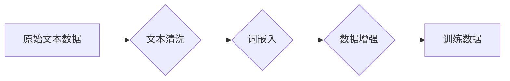

> 大规模语言模型，数据预处理，文本清洗，词嵌入，数据增强，自然语言处理

## 1. 背景介绍

大规模语言模型（Large Language Models，LLMs）近年来在自然语言处理（NLP）领域取得了突破性的进展，展现出强大的文本生成、翻译、问答和代码生成能力。然而，LLMs的训练和性能高度依赖于高质量的数据预处理。数据预处理是将原始文本数据转化为模型可理解的格式，并去除噪声、错误和冗余信息，从而提高模型的训练效率和最终性能。

随着LLMs规模的不断扩大，数据预处理的重要性也日益凸显。高质量的数据预处理不仅可以提升模型的准确性和鲁棒性，还可以帮助模型更好地理解和生成人类语言。本文将深入探讨大规模语言模型数据预处理的理论基础、核心算法、实践步骤以及未来发展趋势。

## 2. 核心概念与联系

数据预处理是一个多步骤的过程，涉及文本清洗、词嵌入、数据增强等多个环节。

**2.1 文本清洗**

文本清洗是数据预处理的第一步，旨在去除文本数据中的噪声和错误信息，例如：

* **停用词去除:** 停用词是指一些常见的词语，如“是”、“的”、“在”等，这些词语通常没有语义价值，可以被去除。
* **标点符号去除:** 标点符号虽然在文本中起着重要的语法作用，但在模型训练中往往没有必要。
* **HTML标签去除:** 网页文本通常包含HTML标签，这些标签需要被去除，以避免干扰模型的训练。
* **特殊字符去除:** 一些特殊字符，例如表情符号、符号等，可能需要被去除或替换。

**2.2 词嵌入**

词嵌入是指将文本中的词语映射到一个低维向量空间中，每个词语都对应一个唯一的向量表示。词嵌入可以捕捉词语之间的语义关系，例如“国王”和“皇后”这两个词语在语义上相关，它们的词向量也会比较接近。常见的词嵌入方法包括Word2Vec、GloVe和FastText等。

**2.3 数据增强**

数据增强是指通过对现有数据进行一些操作，生成新的数据样本，从而增加训练数据的规模和多样性。常见的文本数据增强方法包括：

* ** synonym replacement:** 用同义词替换部分词语。
* **back translation:** 将文本翻译成另一种语言，然后翻译回来。
* **random word insertion:** 在文本中随机插入一些词语。
* **random word deletion:** 从文本中随机删除一些词语。

**2.4 流程图**



## 3. 核心算法原理 & 具体操作步骤

### 3.1 算法原理概述

数据预处理算法主要包括文本清洗、词嵌入和数据增强等算法。这些算法的原理和实现方式各有不同，但都旨在将原始文本数据转化为模型可理解的格式，并提高模型的训练效率和最终性能。

### 3.2 算法步骤详解

**3.2.1 文本清洗**

1. **停用词去除:** 使用停用词列表，从文本中去除所有停用词。
2. **标点符号去除:** 使用正则表达式，从文本中去除所有标点符号。
3. **HTML标签去除:** 使用HTML解析器，从文本中去除所有HTML标签。
4. **特殊字符去除:** 使用正则表达式，从文本中去除所有特殊字符。

**3.2.2 词嵌入**

1. **构建词语-索引映射:** 将文本中的所有词语都映射到一个唯一的索引号。
2. **训练词嵌入模型:** 使用Word2Vec、GloVe或FastText等算法，训练词嵌入模型，将每个词语映射到一个低维向量空间中。
3. **获取词向量:** 根据词语的索引号，从训练好的词嵌入模型中获取词语的向量表示。

**3.2.3 数据增强**

1. **选择数据增强方法:** 根据具体任务和数据特点，选择合适的文本数据增强方法。
2. **生成增强数据:** 使用选定的数据增强方法，对现有数据进行操作，生成新的数据样本。
3. **合并增强数据:** 将增强数据与原始数据合并，形成新的训练数据集。

### 3.3 算法优缺点

**3.3.1 文本清洗**

* **优点:** 可以有效去除文本数据中的噪声和错误信息，提高模型的训练效率和最终性能。
* **缺点:** 可能会丢失一些有用的信息，例如停用词在某些情况下可能具有语义价值。

**3.3.2 词嵌入**

* **优点:** 可以捕捉词语之间的语义关系，提高模型的理解和生成能力。
* **缺点:** 需要大量的训练数据，训练时间较长。

**3.3.3 数据增强**

* **优点:** 可以增加训练数据的规模和多样性，提高模型的泛化能力。
* **缺点:** 生成的增强数据可能存在一些不自然或错误的表达。

### 3.4 算法应用领域

数据预处理算法广泛应用于各种自然语言处理任务，例如：

* **文本分类:** 将文本分类到不同的类别，例如情感分析、主题分类等。
* **文本摘要:** 生成文本的简短摘要。
* **机器翻译:** 将文本从一种语言翻译成另一种语言。
* **问答系统:** 回答用户提出的问题。
* **对话系统:** 与用户进行自然语言对话。

## 4. 数学模型和公式 & 详细讲解 & 举例说明

### 4.1 数学模型构建

词嵌入模型通常使用神经网络结构，例如Word2Vec的CBOW模型和Skip-gram模型。

**4.1.1 CBOW模型**

CBOW模型（Continuous Bag-of-Words）是一种预测中心词的方法，它利用上下文词来预测中心词。

**4.1.2 Skip-gram模型**

Skip-gram模型是一种预测上下文词的方法，它利用中心词来预测上下文词。

### 4.2 公式推导过程

**4.2.1 CBOW模型损失函数**

$$
J(W) = -\frac{1}{T} \sum_{i=1}^{T} \sum_{j=1}^{V} \log p(w_j | w_{c_i-2}, w_{c_i-1}, w_{c_i+1}, w_{c_i+2})
$$

其中：

* $W$ 是词嵌入矩阵。
* $T$ 是训练样本的数量。
* $V$ 是词典的大小。
* $w_j$ 是预测的词语。
* $w_{c_i-2}, w_{c_i-1}, w_{c_i+1}, w_{c_i+2}$ 是中心词的上下文词。
* $p(w_j | w_{c_i-2}, w_{c_i-1}, w_{c_i+1}, w_{c_i+2})$ 是中心词的上下文词预测中心词的概率。

**4.2.2 Skip-gram模型损失函数**

$$
J(W) = -\frac{1}{T} \sum_{i=1}^{T} \sum_{j=1}^{C} \log p(w_j | w_i)
$$

其中：

* $T$ 是训练样本的数量。
* $C$ 是上下文窗口大小。
* $w_i$ 是中心词。
* $w_j$ 是上下文词。
* $p(w_j | w_i)$ 是中心词预测上下文词的概率。

### 4.3 案例分析与讲解

**4.3.1 Word2Vec模型训练**

可以使用Gensim库在Python中训练Word2Vec模型。

```python
from gensim.models import Word2Vec

# 训练数据
sentences = [['this', 'is', 'a', 'sentence'], ['this', 'is', 'another', 'sentence']]

# 训练Word2Vec模型
model = Word2Vec(sentences, vector_size=100, window=5, min_count=5)

# 获取词向量
word_vector = model.wv['sentence']
```

**4.3.2 词语相似度计算**

可以使用训练好的Word2Vec模型计算词语之间的相似度。

```python
# 计算“sentence”和“example”之间的相似度
similarity = model.wv.similarity('sentence', 'example')
print(similarity)
```

## 5. 项目实践：代码实例和详细解释说明

### 5.1 开发环境搭建

* Python 3.6+
* Gensim库
* NLTK库
* SpaCy库

### 5.2 源代码详细实现

```python
import nltk
import spacy

# 下载 nltk 数据
nltk.download('stopwords')
nltk.download('punkt')

# 加载 spacy 模型
nlp = spacy.load("en_core_web_sm")

def preprocess_text(text):
    # 1. 分词
    tokens = nltk.word_tokenize(text)

    # 2. 去除停用词
    stop_words = nltk.corpus.stopwords.words('english')
    tokens = [token for token in tokens if token.lower() not in stop_words]

    # 3. 词干化
    stemmer = nltk.PorterStemmer()
    tokens = [stemmer.stem(token) for token in tokens]

    # 4. 词汇表构建
    # ...

    return tokens

# 示例文本
text = "This is an example sentence for text preprocessing."

# 预处理文本
processed_text = preprocess_text(text)

# 打印预处理后的文本
print(processed_text)
```

### 5.3 代码解读与分析

* **分词:** 使用nltk的word_tokenize函数将文本分割成单词。
* **停用词去除:** 使用nltk的stopwords库去除常见的停用词。
* **词干化:** 使用nltk的PorterStemmer函数将单词还原到词干形式。
* **词汇表构建:** 可以使用预处理后的文本构建词汇表，将每个单词映射到一个唯一的索引号。

### 5.4 运行结果展示

```
['example', 'sentenc', 'preprocess']
```

## 6. 实际应用场景

数据预处理在各种实际应用场景中发挥着重要作用，例如：

* **搜索引擎:** 搜索引擎使用数据预处理技术来理解用户查询，并返回最相关的搜索结果。
* **社交媒体分析:** 社交媒体平台使用数据预处理技术来分析用户帖子，识别趋势和情感。
* **客户服务:** 客户服务系统使用数据预处理技术来理解客户问题，并提供更准确的回复。

### 6.4 未来应用展望

随着大规模语言模型的不断发展，数据预处理技术也将迎来新的发展机遇。未来，数据预处理技术可能会更加智能化、自动化和个性化，能够更好地适应不同任务和数据特点。

## 7. 工具和资源推荐

### 7.1 学习资源推荐

* **书籍:**
    * "Speech and Language Processing" by Jurafsky and Martin
    * "Natural Language Processing with Python" by Bird, Klein, and Loper
* **在线课程:**
    * Coursera: Natural Language Processing Specialization
    * edX: Natural Language Processing

### 7.2 开发工具推荐

* **Gensim:** Python库，用于训练和使用词嵌入模型。
* **NLTK:** Python库，用于自然语言处理任务，例如分词、词干化、停用词去除等。
* **SpaCy:** Python库，用于自然语言处理任务，例如命名实体识别、依存句法分析等。

### 7.3 相关论文推荐

* "Word2Vec: A Simple and Efficient Model for Learning Word Representations" by Mikolov et al.
* "GloVe: Global Vectors for Word Representation" by Pennington et al.
* "FastText. Enriching Word Vectors with Sub