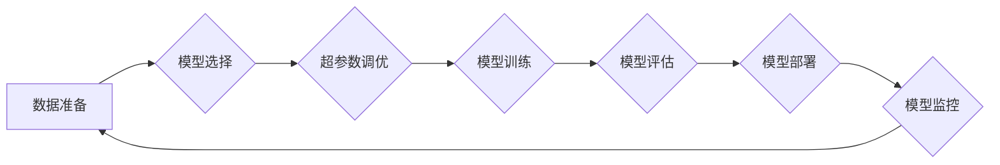

> 大语言模型、Transformer、深度学习、训练工程、DeepSpeed、模型调优、分布式训练

## 1. 背景介绍

近年来，大语言模型（LLM）在自然语言处理领域取得了显著的突破，展现出强大的文本生成、翻译、问答和代码生成能力。这些模型通常基于Transformer架构，拥有数十亿甚至数千亿的参数，需要海量数据和强大的计算资源进行训练。

训练大型语言模型是一个复杂而耗时的过程，需要解决许多技术挑战，例如模型参数的存储和更新、数据并行和模型并行、梯度累积和优化算法等。为了更高效地训练和部署大型语言模型，业界涌现出许多开源工具和框架，其中DeepSpeed是一个备受关注的训练优化框架。

## 2. 核心概念与联系

**2.1  大语言模型（LLM）**

大语言模型是指参数量巨大、训练数据海量、能够理解和生成人类语言的深度学习模型。它们通常基于Transformer架构，能够捕捉文本中的长距离依赖关系，从而实现更准确和流畅的文本生成。

**2.2  Transformer架构**

Transformer是一种专门用于处理序列数据的深度学习架构，其核心是自注意力机制（Self-Attention）。自注意力机制能够捕捉文本中不同词之间的关系，即使这些词相隔很远，也能有效地理解上下文信息。

**2.3  DeepSpeed框架**

DeepSpeed是一个开源的深度学习训练优化框架，专门针对大型模型的训练和部署而设计。它提供了一系列功能，例如模型并行、数据并行、梯度累积、混合精度训练等，能够显著提高大型模型的训练效率和性能。

**2.4  训练工程实践**

训练工程是指从数据准备到模型部署的全流程管理和优化，包括数据清洗、数据增强、模型选择、超参数调优、模型评估和部署等环节。

**2.5  模型调优**

模型调优是指通过调整模型参数、训练策略和硬件配置等方式，提高模型的性能和效率的过程。

**Mermaid 流程图**



## 3. 核心算法原理 & 具体操作步骤

### 3.1  算法原理概述

DeepSpeed框架的核心算法原理包括：

* **模型并行:** 将模型参数分布到多个GPU上进行训练，提高训练速度。
* **数据并行:** 将训练数据分布到多个GPU上进行训练，提高训练效率。
* **梯度累积:** 将多个梯度累积在一起再更新模型参数，减少内存占用和提高训练稳定性。
* **混合精度训练:** 使用低精度浮点数进行计算，提高训练速度和内存效率。

### 3.2  算法步骤详解

**3.2.1 模型并行**

将模型参数分布到多个GPU上，每个GPU负责训练模型的一部分参数。常用的模型并行策略包括：

* **数据并行:** 将数据分布到多个GPU上，每个GPU训练模型的全部参数，但使用不同的数据子集。
* **模型并行:** 将模型参数分布到多个GPU上，每个GPU负责训练模型的一部分参数。

**3.2.2 数据并行**

将训练数据分布到多个GPU上，每个GPU训练模型的全部参数，但使用不同的数据子集。

**3.2.3 梯度累积**

将多个梯度累积在一起再更新模型参数，减少内存占用和提高训练稳定性。

**3.2.4 混合精度训练**

使用低精度浮点数进行计算，提高训练速度和内存效率。

### 3.3  算法优缺点

**优点:**

* 提高训练速度和效率。
* 降低内存占用。
* 提高模型训练的稳定性。

**缺点:**

* 模型并行和数据并行的实现较为复杂。
* 混合精度训练需要额外的硬件支持。

### 3.4  算法应用领域

DeepSpeed框架广泛应用于大型语言模型的训练和部署，例如：

* **文本生成:** 生成高质量的文本内容，例如文章、故事、诗歌等。
* **机器翻译:** 将文本从一种语言翻译成另一种语言。
* **问答系统:** 回答用户提出的问题。
* **代码生成:** 生成代码片段。

## 4. 数学模型和公式 & 详细讲解 & 举例说明

### 4.1  数学模型构建

大语言模型通常基于Transformer架构，其核心是自注意力机制。自注意力机制可以计算每个词与所有其他词之间的相关性，从而捕捉文本中的长距离依赖关系。

**4.1.1  自注意力机制**

自注意力机制的数学公式如下：

$$
Attention(Q, K, V) = softmax(\frac{QK^T}{\sqrt{d_k}})V
$$

其中：

* $Q$：查询矩阵
* $K$：键矩阵
* $V$：值矩阵
* $d_k$：键向量的维度
* $softmax$：softmax函数

**4.1.2  Transformer架构**

Transformer架构由多个编码器和解码器层组成。每个编码器和解码器层包含多个自注意力层和前馈神经网络层。

### 4.2  公式推导过程

自注意力机制的公式推导过程如下：

1. 将查询矩阵 $Q$、键矩阵 $K$ 和值矩阵 $V$ 进行矩阵乘法，得到一个分数矩阵。
2. 对分数矩阵进行softmax归一化，得到每个词与所有其他词之间的相关性分数。
3. 将相关性分数与值矩阵 $V$ 进行矩阵乘法，得到每个词的加权和，即注意力输出。

### 4.3  案例分析与讲解

**4.3.1  文本生成**

在文本生成任务中，自注意力机制可以帮助模型捕捉文本中的上下文信息，生成更流畅和连贯的文本。例如，在生成一个句子时，模型可以利用自注意力机制来理解每个词的含义以及它与其他词之间的关系，从而生成更合理的句子结构。

**4.3.2  机器翻译**

在机器翻译任务中，自注意力机制可以帮助模型捕捉源语言和目标语言之间的对应关系，提高翻译的准确性和流畅度。例如，在将英文翻译成中文时，模型可以利用自注意力机制来理解每个英文词的含义以及它与其他英文词之间的关系，并将其翻译成相应的中文词语。

## 5. 项目实践：代码实例和详细解释说明

### 5.1  开发环境搭建

**5.1.1  硬件要求**

* 多个GPU，例如NVIDIA Tesla V100或A100。
* 充足的内存，至少64GB。

**5.1.2  软件环境**

* Python 3.7+
* PyTorch 1.7+
* DeepSpeed 0.8+

### 5.2  源代码详细实现

```python
import torch
import deepspeed

# 定义模型
class Transformer(torch.nn.Module):
    # ...

# 创建DeepSpeed引擎
model = Transformer()
engine = deepspeed.initialize(
    model=model,
    config=deepspeed.config.DeepSpeedConfig(),
)

# 训练模型
for epoch in range(num_epochs):
    for batch in dataloader:
        # ...
        loss = engine.backward(loss)
        engine.step()

```

### 5.3  代码解读与分析

* `deepspeed.initialize()` 函数用于初始化DeepSpeed引擎，并配置模型训练参数。
* `engine.backward()` 函数用于计算梯度。
* `engine.step()` 函数用于更新模型参数。

### 5.4  运行结果展示

DeepSpeed框架可以显著提高大型语言模型的训练速度和效率。

## 6. 实际应用场景

### 6.1  文本生成

DeepSpeed可以用于训练大型文本生成模型，例如GPT-3，用于生成高质量的文本内容，例如文章、故事、诗歌等。

### 6.2  机器翻译

DeepSpeed可以用于训练大型机器翻译模型，例如T5，用于将文本从一种语言翻译成另一种语言。

### 6.3  问答系统

DeepSpeed可以用于训练大型问答系统模型，例如BERT，用于回答用户提出的问题。

### 6.4  未来应用展望

DeepSpeed框架在未来将继续推动大型语言模型的训练和应用，例如：

* **多模态学习:** 将文本、图像、音频等多种模态数据融合在一起进行学习。
* **个性化服务:** 根据用户的需求和偏好生成个性化的文本内容。
* **自动代码生成:** 自动生成代码片段，提高软件开发效率。

## 7. 工具和资源推荐

### 7.1  学习资源推荐

* DeepSpeed官方文档: https://www.deepspeed.ai/docs/
* Transformer论文: https://arxiv.org/abs/1706.03762

### 7.2  开发工具推荐

* PyTorch: https://pytorch.org/
* CUDA: https://developer.nvidia.com/cuda-downloads

### 7.3  相关论文推荐

* DeepSpeed: https://arxiv.org/abs/2003.09782
* Megatron-LM: https://arxiv.org/abs/1905.03180

## 8. 总结：未来发展趋势与挑战

### 8.1  研究成果总结

DeepSpeed框架为大型语言模型的训练和部署提供了高效的解决方案，显著提高了训练速度和效率。

### 8.2  未来发展趋势

未来，DeepSpeed框架将继续发展，朝着以下方向发展：

* **更强大的并行策略:** 支持更大的模型规模和数据规模。
* **更智能的训练策略:** 自动调整超参数，提高训练效率。
* **更广泛的应用场景:** 应用于更多领域，例如多模态学习、个性化服务等。

### 8.3  面临的挑战

DeepSpeed框架也面临一些挑战，例如：

* **模型规模的限制:** 随着模型规模的不断增长，训练和部署成本也会随之增加。
* **数据获取和标注的困难:** 大型语言模型需要海量数据进行训练，数据获取和标注成本较高。
* **伦理和安全问题:** 大型语言模型可能存在一些伦理和安全问题，例如生成虚假信息、传播偏见等。

### 8.4  研究展望

未来，我们需要继续研究和探索新的方法，以克服这些挑战，推动大型语言模型的健康发展。

## 9. 附录：常见问题与解答

**9.1  如何安装DeepSpeed？**

可以使用pip安装DeepSpeed：

```
pip install deepspeed
```

**9.2  如何配置DeepSpeed参数？**

可以使用DeepSpeed配置文件来配置模型训练参数。配置文件的格式为YAML。

**9.3  如何使用DeepSpeed训练模型？**

可以使用DeepSpeed提供的API来训练模型。

**9.4  如何部署DeepSpeed模型？**

可以使用DeepSpeed提供的工具来部署模型。


作者：禅与计算机程序设计艺术 / Zen and the Art of Computer Programming 
<end_of_turn>