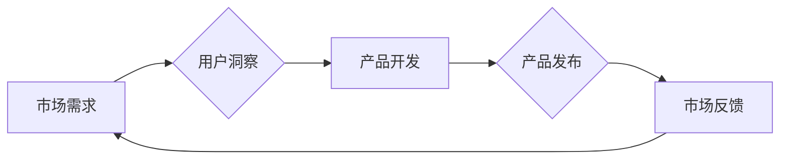

> 市场需求、创业、数据分析、用户洞察、产品开发、商业模式、技术趋势、创新、市场定位

## 1. 背景介绍

在瞬息万变的科技时代，创业者们面临着前所未有的机遇和挑战。想要在激烈的市场竞争中脱颖而出，成功打造出具有市场竞争力的产品，就必须深刻理解市场需求，并将其转化为产品开发的指引。

传统的市场调研方法往往耗时费力，难以捕捉到用户需求的细微变化。而随着大数据、人工智能等技术的快速发展，创业者们拥有了更强大的工具和手段，可以更精准地洞察市场需求，并将其转化为产品开发的决策依据。

## 2. 核心概念与联系

### 2.1 市场需求

市场需求是指消费者对特定商品或服务的期望和购买意愿。它是一个动态的概念，会随着社会发展、经济环境、用户需求等因素的变化而不断演变。

### 2.2 用户洞察

用户洞察是指通过对用户行为、需求、痛点等进行深入分析，从而获得对用户心理、需求和行为模式的深刻理解。

### 2.3 产品开发

产品开发是指从市场需求出发，通过设计、研发、测试等环节，将产品概念转化为可供用户使用的实际产品。

**核心概念与联系流程图:**



## 3. 核心算法原理 & 具体操作步骤

### 3.1 算法原理概述

在市场需求分析中，常用的算法包括：

* **聚类算法:** 将用户群体按照相似度进行分类，识别潜在的用户需求。
* **关联规则挖掘算法:** 发现用户行为之间的关联关系，例如哪些产品经常被一起购买。
* **预测分析算法:** 利用历史数据预测未来的市场趋势和用户需求。

### 3.2 算法步骤详解

以聚类算法为例，其具体操作步骤如下：

1. **数据收集:** 收集用户行为数据，例如购买记录、浏览历史、评价信息等。
2. **数据预处理:** 对数据进行清洗、转换、归一化等处理，使其适合算法的输入。
3. **聚类算法选择:** 根据数据特点和分析目标，选择合适的聚类算法，例如K-means聚类、层次聚类等。
4. **聚类模型训练:** 使用训练数据训练聚类模型，并确定聚类数量。
5. **聚类结果分析:** 对聚类结果进行分析，识别不同用户群体的特征和需求。

### 3.3 算法优缺点

**聚类算法的优点:**

* 可以发现用户群体的潜在结构。
* 不需要预先定义用户类别。
* 可以用于识别用户需求的细分。

**聚类算法的缺点:**

* 聚类结果的 interpretability 较低。
* 需要确定聚类数量，这可能是一个主观判断。
* 对噪声数据敏感。

### 3.4 算法应用领域

聚类算法广泛应用于市场需求分析、用户画像、产品推荐等领域。

## 4. 数学模型和公式 & 详细讲解 & 举例说明

### 4.1 数学模型构建

在市场需求分析中，可以使用数学模型来描述用户需求和市场趋势。例如，可以使用需求函数来描述用户对特定商品的需求量与价格之间的关系。

**需求函数:**

$$Q = a - bP$$

其中：

* $Q$：需求量
* $P$：价格
* $a$：需求弹性系数
* $b$：价格弹性系数

### 4.2 公式推导过程

需求函数的推导过程基于经济学理论，假设用户对商品的需求量与价格成反比关系。

### 4.3 案例分析与讲解

假设某商品的需求弹性系数为 2，价格弹性系数为 0.5。当价格为 10 元时，需求量为 100 个。

根据需求函数，我们可以计算出当价格为 12 元时，需求量为：

$$Q = 100 - 0.5 * (12 - 10) = 98$$

## 5. 项目实践：代码实例和详细解释说明

### 5.1 开发环境搭建

可以使用 Python 语言和相关库来实现市场需求分析项目。

### 5.2 源代码详细实现

```python
import pandas as pd
from sklearn.cluster import KMeans

# 数据加载
data = pd.read_csv('user_data.csv')

# 数据预处理
data['purchase_amount'] = data['purchase_amount'].apply(lambda x: x / 100)

# 聚类模型训练
kmeans = KMeans(n_clusters=3)
kmeans.fit(data[['purchase_amount', 'browsing_time']])

# 聚类结果分析
data['cluster'] = kmeans.labels_
print(data.groupby('cluster').mean())
```

### 5.3 代码解读与分析

这段代码首先加载用户数据，然后对数据进行预处理，例如将购买金额转换为浮点数。接着，使用 KMeans 聚类算法对用户进行聚类，并根据聚类结果分析不同用户群体的特征。

### 5.4 运行结果展示

运行结果会显示出不同用户群体的平均购买金额和浏览时间，帮助创业者了解用户需求的细分。

## 6. 实际应用场景

### 6.1 产品定位

通过对市场需求的分析，创业者可以更精准地定位产品目标用户，并根据用户需求进行产品设计和开发。

### 6.2 市场营销

市场需求分析可以帮助创业者制定更有效的市场营销策略，例如针对不同用户群体进行个性化营销。

### 6.3 产品迭代

通过收集用户反馈和市场数据，创业者可以不断迭代产品，使其更符合用户需求。

### 6.4 未来应用展望

随着人工智能、大数据等技术的不断发展，市场需求分析将更加精准、智能化。

## 7. 工具和资源推荐

### 7.1 学习资源推荐

* **书籍:** 《数据分析实战》、《用户洞察》、《产品经理的创业指南》
* **在线课程:** Coursera、edX、Udemy 等平台提供数据分析、用户洞察等方面的课程。

### 7.2 开发工具推荐

* **数据分析工具:** Python、R、Tableau、Power BI 等
* **用户洞察工具:** Google Analytics、Mixpanel、Amplitude 等

### 7.3 相关论文推荐

* **用户需求分析:** 《用户需求建模方法综述》、《用户需求分析与产品设计》
* **市场需求预测:** 《基于机器学习的市场需求预测模型》、《大数据时代市场需求预测》

## 8. 总结：未来发展趋势与挑战

### 8.1 研究成果总结

市场需求分析已经成为创业者不可或缺的工具，帮助他们更好地理解用户需求，并将其转化为产品开发的指引。

### 8.2 未来发展趋势

未来市场需求分析将更加智能化、个性化，并与人工智能、大数据等技术深度融合。

### 8.3 面临的挑战

* 如何更精准地捕捉用户需求的动态变化。
* 如何有效地处理海量数据，并从中挖掘出有价值的洞察。
* 如何将市场需求分析结果转化为可操作的决策。

### 8.4 研究展望

未来研究将重点关注以下几个方面：

* 开发更智能、更精准的市场需求分析算法。
* 建立更完善的市场需求分析框架和模型。
* 探索市场需求分析与人工智能、大数据等技术的融合应用。

## 9. 附录：常见问题与解答

### 9.1 如何收集用户数据？

可以通过多种方式收集用户数据，例如：

* 网站访问日志
* 应用程序使用数据
* 用户调查问卷
* 社交媒体数据

### 9.2 如何处理用户数据？

在处理用户数据时，需要确保数据安全和隐私。

### 9.3 如何评估市场需求分析结果？

可以通过比较市场需求分析结果与实际市场表现进行评估。

作者：禅与计算机程序设计艺术 / Zen and the Art of Computer Programming


<end_of_turn>