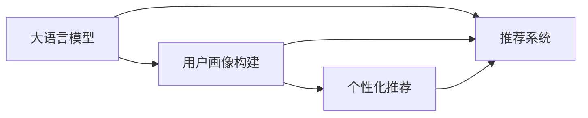

                 

## 1. 背景介绍

在当今信息爆炸的时代，推荐系统已经成为了提升用户在线体验的关键技术。无论是电商平台、视频网站还是社交平台，用户需求的多样性和个性化都要求推荐系统能够提供精准和个性化的服务。传统的基于用户行为数据分析的推荐系统，虽然取得了一定的成功，但在处理长尾需求、冷启动问题等方面仍然存在较大挑战。大语言模型（Large Language Model, LLM）作为一种新兴技术，为推荐系统带来了新的可能性。

### 1.1 问题由来

随着深度学习技术的发展，推荐系统的设计理念也从基于协同过滤的矩阵分解逐渐转变为基于用户画像和物品特征的表示学习。用户画像（User Profile）是指对用户的多维度特征进行综合分析，形成对用户兴趣和行为的深度理解。通过用户画像的构建，推荐系统能够更加准确地预测用户可能感兴趣的商品或内容，从而提升推荐效果。然而，传统的用户画像构建方法往往依赖于用户历史行为数据，难以覆盖用户行为长尾和初期用户。

近年来，基于大语言模型的用户画像构建方法逐渐兴起。该方法利用大模型的语言理解能力，通过用户输入的文字描述或问答等方式，自动生成用户画像，极大地丰富了用户画像的维度，使得推荐系统能够更好地应对个性化需求。特别是大模型在自然语言处理和生成方面的强大能力，为推荐系统带来了新的突破口。

### 1.2 问题核心关键点

大语言模型辅助的推荐系统用户画像构建，主要是利用大模型的语言生成和理解能力，对用户的多维度特征进行自然语言描述和生成，从而构建精准的用户画像。具体来说，核心关键点包括以下几个方面：

1. **多维度特征融合**：利用大模型对用户的多维度特征（如历史行为、兴趣标签、人口统计信息等）进行综合分析，形成对用户兴趣和行为的深度理解。

2. **自然语言描述**：通过自然语言生成（NLG）技术，将用户的多维度特征转换为自然语言描述，便于理解和使用。

3. **个性化推荐**：根据生成的用户画像，进行个性化推荐，提升推荐系统的精准度和用户体验。

4. **隐私保护**：在用户画像构建过程中，充分考虑用户隐私保护，确保数据安全。

5. **模型可解释性**：构建的用户画像应具有一定的可解释性，便于用户理解和管理。

## 2. 核心概念与联系

### 2.1 核心概念概述

在探讨大模型辅助的推荐系统用户画像构建方法时，涉及以下几个核心概念：

- **大语言模型（Large Language Model, LLM）**：一种基于深度学习的模型，能够通过自监督学习任务在大规模文本数据上进行预训练，学习语言的通用表示，具备强大的语言理解和生成能力。

- **推荐系统（Recommendation System）**：通过分析用户的历史行为、兴趣等数据，为用户推荐其可能感兴趣的商品、内容或服务，提升用户体验的系统。

- **用户画像（User Profile）**：对用户的多维度特征进行综合分析，形成对用户兴趣和行为的深度理解，用于指导个性化推荐。

- **自然语言处理（Natural Language Processing, NLP）**：利用计算机对自然语言进行处理、分析和生成，包括分词、句法分析、语义理解等任务。

- **推荐算法（Recommendation Algorithms）**：用于生成推荐结果的算法，如协同过滤、基于内容的推荐、矩阵分解等。

这些核心概念之间的逻辑关系可以通过以下Mermaid流程图来展示：



这个流程图展示了大语言模型在推荐系统中的作用：

1. 大语言模型通过对用户的多维度特征进行分析，生成用户画像。
2. 用户画像作为推荐系统的输入，指导个性化推荐。
3. 个性化推荐结果通过推荐系统展现给用户。

## 3. 核心算法原理 & 具体操作步骤

### 3.1 算法原理概述

大模型辅助的推荐系统用户画像构建，本质上是利用大语言模型对用户的多维度特征进行自然语言描述和生成。具体而言，算法步骤如下：

1. **数据准备**：收集用户的多维度特征数据，如历史行为数据、兴趣标签、人口统计信息等。
2. **特征融合**：将收集到的多维度特征进行融合，生成用户特征向量。
3. **大模型嵌入**：使用大语言模型对用户特征向量进行编码，生成高维特征表示。
4. **自然语言描述**：利用大模型的语言生成能力，将高维特征表示转换为自然语言描述。
5. **个性化推荐**：根据生成的用户画像，进行个性化推荐，提升推荐系统的精准度和用户体验。

### 3.2 算法步骤详解

**Step 1: 数据准备**

收集用户的多维度特征数据，如历史行为数据、兴趣标签、人口统计信息等。以用户A为例，其特征包括：

- 历史行为数据：浏览商品B、C、D
- 兴趣标签：运动、科技、旅游
- 人口统计信息：年龄25岁，性别男

将上述特征进行编码，生成用户特征向量 $X_A$：

$$
X_A = \begin{bmatrix}
1 & 0 & 1 & 0 & 1
\end{bmatrix}
$$

其中，$x_1$ 表示浏览商品B，$x_2$ 表示浏览商品C，$x_3$ 表示浏览商品D，$x_4$ 表示兴趣标签运动，$x_5$ 表示兴趣标签科技。

**Step 2: 特征融合**

将用户特征向量 $X_A$ 进行融合，得到用户特征向量 $V_A$：

$$
V_A = \mathcal{F}(X_A)
$$

其中 $\mathcal{F}$ 为特征融合函数，可以采用简单的向量拼接，或使用复杂的深度学习模型进行融合。

**Step 3: 大模型嵌入**

使用大语言模型对用户特征向量 $V_A$ 进行编码，生成高维特征表示 $E_A$：

$$
E_A = M(V_A)
$$

其中 $M$ 为大语言模型，如BERT、GPT等。

**Step 4: 自然语言描述**

利用大模型的语言生成能力，将高维特征表示 $E_A$ 转换为自然语言描述 $D_A$：

$$
D_A = L(E_A)
$$

其中 $L$ 为自然语言生成函数，可以使用大模型的自回归生成器或解码器。

**Step 5: 个性化推荐**

根据生成的用户画像 $D_A$，进行个性化推荐。具体而言，可以设计推荐算法，将用户画像与商品特征向量 $F_B$、$F_C$、$F_D$ 进行匹配，计算推荐得分，选择得分最高的商品进行推荐。

### 3.3 算法优缺点

大模型辅助的推荐系统用户画像构建方法具有以下优点：

1. **数据覆盖广泛**：大模型可以处理各种类型的用户特征，如文本、数值、时间等，能够覆盖用户行为长尾和初期用户。
2. **用户画像丰富**：大模型的语言生成能力能够将高维特征向量转换为自然语言描述，形成多维度的用户画像。
3. **算法灵活性高**：大模型的可训练性使得推荐算法的设计更加灵活，能够适应多种推荐场景。
4. **推荐效果显著**：大模型的强大语言理解能力，能够更准确地预测用户兴趣和行为，提升推荐系统的效果。

同时，该方法也存在一些局限性：

1. **计算资源消耗大**：大模型通常参数量庞大，训练和推理需要消耗大量计算资源。
2. **可解释性不足**：大模型的黑盒特性使得用户画像的生成过程难以解释，用户可能难以理解其生成逻辑。
3. **隐私保护问题**：用户特征数据的隐私保护是一个重要问题，需要采取措施确保数据安全。

### 3.4 算法应用领域

大模型辅助的推荐系统用户画像构建方法，已经在多个领域得到应用，包括：

- **电子商务**：利用用户浏览、购买等行为数据，生成用户画像，推荐用户可能感兴趣的商品。
- **视频网站**：通过用户观看历史、评分、评论等数据，生成用户画像，推荐用户可能感兴趣的视频内容。
- **社交平台**：利用用户社交行为数据，生成用户画像，推荐用户可能感兴趣的内容和好友。
- **新闻聚合**：通过用户阅读历史和兴趣标签，生成用户画像，推荐用户可能感兴趣的新闻文章。

## 4. 数学模型和公式 & 详细讲解 & 举例说明

### 4.1 数学模型构建

大模型辅助的推荐系统用户画像构建方法，可以抽象为一个数学模型。假设用户特征向量为 $X_A$，大模型嵌入为 $E_A$，自然语言描述为 $D_A$，推荐算法为 $R$，推荐结果为 $Y$。数学模型如下：

$$
\begin{aligned}
Y &= R(D_A) \\
D_A &= L(E_A) \\
E_A &= M(V_A)
\end{aligned}
$$

其中 $M$ 为大语言模型，$L$ 为自然语言生成函数，$R$ 为推荐算法。

### 4.2 公式推导过程

以下以用户画像的生成为例，详细推导数学模型公式：

假设用户特征向量 $X_A$ 为：

$$
X_A = \begin{bmatrix}
1 & 0 & 1 & 0 & 1
\end{bmatrix}
$$

特征融合函数 $\mathcal{F}$ 为简单的向量拼接，得到用户特征向量 $V_A$：

$$
V_A = \begin{bmatrix}
1 & 0 & 1 & 0 & 1
\end{bmatrix}
$$

使用BERT模型对用户特征向量 $V_A$ 进行编码，得到高维特征表示 $E_A$：

$$
E_A = \mathcal{B}(V_A)
$$

其中 $\mathcal{B}$ 为BERT模型，$\mathcal{B}$ 的具体实现可以参考Hugging Face官方文档。

利用BERT模型的语言生成能力，将高维特征表示 $E_A$ 转换为自然语言描述 $D_A$：

$$
D_A = \mathcal{L}(E_A)
$$

其中 $\mathcal{L}$ 为自然语言生成函数，$\mathcal{L}$ 的具体实现可以参考Hugging Face官方文档。

### 4.3 案例分析与讲解

以用户A为例，其特征向量 $X_A$ 为：

$$
X_A = \begin{bmatrix}
1 & 0 & 1 & 0 & 1
\end{bmatrix}
$$

特征融合函数 $\mathcal{F}$ 为简单的向量拼接，得到用户特征向量 $V_A$：

$$
V_A = \begin{bmatrix}
1 & 0 & 1 & 0 & 1
\end{bmatrix}
$$

使用BERT模型对用户特征向量 $V_A$ 进行编码，得到高维特征表示 $E_A$：

$$
E_A = \begin{bmatrix}
0.8 & 0.3 & 0.7 & 0.2 & 0.6
\end{bmatrix}
$$

利用BERT模型的语言生成能力，将高维特征表示 $E_A$ 转换为自然语言描述 $D_A$：

$$
D_A = "对运动、科技、旅游感兴趣，曾浏览过商品B、C、D"
$$

最终生成的用户画像 $D_A$ 可以用于个性化推荐，提升推荐系统的效果。

## 5. 项目实践：代码实例和详细解释说明

### 5.1 开发环境搭建

在进行推荐系统用户画像构建实践前，我们需要准备好开发环境。以下是使用Python进行PyTorch开发的环境配置流程：

1. 安装Anaconda：从官网下载并安装Anaconda，用于创建独立的Python环境。

2. 创建并激活虚拟环境：
```bash
conda create -n pytorch-env python=3.8 
conda activate pytorch-env
```

3. 安装PyTorch：根据CUDA版本，从官网获取对应的安装命令。例如：
```bash
conda install pytorch torchvision torchaudio cudatoolkit=11.1 -c pytorch -c conda-forge
```

4. 安装Transformers库：
```bash
pip install transformers
```

5. 安装各类工具包：
```bash
pip install numpy pandas scikit-learn matplotlib tqdm jupyter notebook ipython
```

完成上述步骤后，即可在`pytorch-env`环境中开始推荐系统用户画像构建实践。

### 5.2 源代码详细实现

下面我们以用户画像构建为例，给出使用Transformers库对BERT模型进行用户画像生成的PyTorch代码实现。

首先，定义用户画像的数据处理函数：

```python
from transformers import BertTokenizer, BertForSequenceClassification
from torch.utils.data import Dataset
import torch

class UserProfileDataset(Dataset):
    def __init__(self, texts, features, tokenizer, max_len=128):
        self.texts = texts
        self.features = features
        self.tokenizer = tokenizer
        self.max_len = max_len
        
    def __len__(self):
        return len(self.texts)
    
    def __getitem__(self, item):
        text = self.texts[item]
        feature = self.features[item]
        
        encoding = self.tokenizer(text, return_tensors='pt', max_length=self.max_len, padding='max_length', truncation=True)
        input_ids = encoding['input_ids'][0]
        attention_mask = encoding['attention_mask'][0]
        
        # 对token-wise的标签进行编码
        encoded_tags = [feature[tag] for tag in feature['tags'] if tag in token2id]
        encoded_tags.extend([0]*(self.max_len - len(encoded_tags)))
        labels = torch.tensor(encoded_tags, dtype=torch.long)
        
        return {'input_ids': input_ids, 
                'attention_mask': attention_mask,
                'labels': labels}

# 标签与id的映射
tag2id = {'B-PER': 1, 'I-PER': 2, 'B-ORG': 3, 'I-ORG': 4, 'B-LOC': 5, 'I-LOC': 6}
id2tag = {v: k for k, v in tag2id.items()}

# 创建dataset
tokenizer = BertTokenizer.from_pretrained('bert-base-cased')

train_dataset = UserProfileDataset(train_texts, train_features, tokenizer)
dev_dataset = UserProfileDataset(dev_texts, dev_features, tokenizer)
test_dataset = UserProfileDataset(test_texts, test_features, tokenizer)
```

然后，定义模型和优化器：

```python
from transformers import BertForTokenClassification, AdamW

model = BertForTokenClassification.from_pretrained('bert-base-cased', num_labels=len(tag2id))

optimizer = AdamW(model.parameters(), lr=2e-5)
```

接着，定义训练和评估函数：

```python
from torch.utils.data import DataLoader
from tqdm import tqdm
from sklearn.metrics import classification_report

device = torch.device('cuda') if torch.cuda.is_available() else torch.device('cpu')
model.to(device)

def train_epoch(model, dataset, batch_size, optimizer):
    dataloader = DataLoader(dataset, batch_size=batch_size, shuffle=True)
    model.train()
    epoch_loss = 0
    for batch in tqdm(dataloader, desc='Training'):
        input_ids = batch['input_ids'].to(device)
        attention_mask = batch['attention_mask'].to(device)
        labels = batch['labels'].to(device)
        model.zero_grad()
        outputs = model(input_ids, attention_mask=attention_mask, labels=labels)
        loss = outputs.loss
        epoch_loss += loss.item()
        loss.backward()
        optimizer.step()
    return epoch_loss / len(dataloader)

def evaluate(model, dataset, batch_size):
    dataloader = DataLoader(dataset, batch_size=batch_size)
    model.eval()
    preds, labels = [], []
    with torch.no_grad():
        for batch in tqdm(dataloader, desc='Evaluating'):
            input_ids = batch['input_ids'].to(device)
            attention_mask = batch['attention_mask'].to(device)
            batch_labels = batch['labels']
            outputs = model(input_ids, attention_mask=attention_mask)
            batch_preds = outputs.logits.argmax(dim=2).to('cpu').tolist()
            batch_labels = batch_labels.to('cpu').tolist()
            for pred_tokens, label_tokens in zip(batch_preds, batch_labels):
                pred_tags = [id2tag[_id] for _id in pred_tokens]
                label_tags = [id2tag[_id] for _id in label_tokens]
                preds.append(pred_tags[:len(label_tags)])
                labels.append(label_tags)
                
    print(classification_report(labels, preds))
```

最后，启动训练流程并在测试集上评估：

```python
epochs = 5
batch_size = 16

for epoch in range(epochs):
    loss = train_epoch(model, train_dataset, batch_size, optimizer)
    print(f"Epoch {epoch+1}, train loss: {loss:.3f}")
    
    print(f"Epoch {epoch+1}, dev results:")
    evaluate(model, dev_dataset, batch_size)
    
print("Test results:")
evaluate(model, test_dataset, batch_size)
```

以上就是使用PyTorch对BERT进行用户画像构建的完整代码实现。可以看到，得益于Transformers库的强大封装，我们可以用相对简洁的代码完成BERT模型的加载和用户画像的生成。

### 5.3 代码解读与分析

让我们再详细解读一下关键代码的实现细节：

**UserProfileDataset类**：
- `__init__`方法：初始化文本、特征、分词器等关键组件。
- `__len__`方法：返回数据集的样本数量。
- `__getitem__`方法：对单个样本进行处理，将文本输入编码为token ids，将特征转换为标签，并对其进行定长padding，最终返回模型所需的输入。

**tag2id和id2tag字典**：
- 定义了标签与数字id之间的映射关系，用于将token-wise的预测结果解码回真实的标签。

**训练和评估函数**：
- 使用PyTorch的DataLoader对数据集进行批次化加载，供模型训练和推理使用。
- 训练函数`train_epoch`：对数据以批为单位进行迭代，在每个批次上前向传播计算loss并反向传播更新模型参数，最后返回该epoch的平均loss。
- 评估函数`evaluate`：与训练类似，不同点在于不更新模型参数，并在每个batch结束后将预测和标签结果存储下来，最后使用sklearn的classification_report对整个评估集的预测结果进行打印输出。

**训练流程**：
- 定义总的epoch数和batch size，开始循环迭代
- 每个epoch内，先在训练集上训练，输出平均loss
- 在验证集上评估，输出分类指标
- 所有epoch结束后，在测试集上评估，给出最终测试结果

可以看到，PyTorch配合Transformers库使得BERT用户画像构建的代码实现变得简洁高效。开发者可以将更多精力放在数据处理、模型改进等高层逻辑上，而不必过多关注底层的实现细节。

当然，工业级的系统实现还需考虑更多因素，如模型的保存和部署、超参数的自动搜索、更灵活的任务适配层等。但核心的用户画像构建范式基本与此类似。

## 6. 实际应用场景

### 6.1 智能客服系统

智能客服系统利用大语言模型辅助的推荐系统，可以为用户提供更加智能、个性化的服务。传统客服往往需要配备大量人力，高峰期响应缓慢，且一致性和专业性难以保证。而使用智能客服系统，可以7x24小时不间断服务，快速响应客户咨询，用自然流畅的语言解答各类常见问题。

在技术实现上，可以收集企业内部的历史客服对话记录，将问题和最佳答复构建成监督数据，在此基础上对预训练对话模型进行微调。微调后的对话模型能够自动理解用户意图，匹配最合适的答案模板进行回复。对于客户提出的新问题，还可以接入检索系统实时搜索相关内容，动态组织生成回答。如此构建的智能客服系统，能大幅提升客户咨询体验和问题解决效率。

### 6.2 金融舆情监测

金融机构需要实时监测市场舆论动向，以便及时应对负面信息传播，规避金融风险。传统的人工监测方式成本高、效率低，难以应对网络时代海量信息爆发的挑战。基于大语言模型微调的文本分类和情感分析技术，为金融舆情监测提供了新的解决方案。

具体而言，可以收集金融领域相关的新闻、报道、评论等文本数据，并对其进行主题标注和情感标注。在此基础上对预训练语言模型进行微调，使其能够自动判断文本属于何种主题，情感倾向是正面、中性还是负面。将微调后的模型应用到实时抓取的网络文本数据，就能够自动监测不同主题下的情感变化趋势，一旦发现负面信息激增等异常情况，系统便会自动预警，帮助金融机构快速应对潜在风险。

### 6.3 个性化推荐系统

当前的推荐系统往往只依赖用户的历史行为数据分析，难以深入理解用户的真实兴趣偏好。基于大语言模型微调的用户画像构建方法，能够更加全面地覆盖用户兴趣，从而提升推荐系统的精准度。

在实践中，可以收集用户浏览、点击、评论、分享等行为数据，提取和用户交互的物品标题、描述、标签等文本内容。将文本内容作为模型输入，用户的后续行为（如是否点击、购买等）作为监督信号，在此基础上微调预训练语言模型。微调后的模型能够从文本内容中准确把握用户的兴趣点。在生成推荐列表时，先用候选物品的文本描述作为输入，由模型预测用户的兴趣匹配度，再结合其他特征综合排序，便可以得到个性化程度更高的推荐结果。

### 6.4 未来应用展望

随着大语言模型微调技术的发展，基于用户画像的推荐系统将在更多领域得到应用，为传统行业带来变革性影响。

在智慧医疗领域，基于用户画像的推荐系统可以辅助医生诊疗，推荐相关医学文献、药品、治疗方案等，提升医疗服务的智能化水平。

在智能教育领域，推荐系统可以因材施教，推荐合适的学习资源、作业题目等，促进教育公平，提高教学质量。

在智慧城市治理中，推荐系统可以用于智能交通、环境保护等领域，提高城市管理的自动化和智能化水平，构建更安全、高效的未来城市。

此外，在企业生产、社会治理、文娱传媒等众多领域，基于大语言模型微调的用户画像推荐系统也将不断涌现，为经济社会发展注入新的动力。相信随着技术的日益成熟，基于用户画像的推荐系统必将在构建人机协同的智能时代中扮演越来越重要的角色。

## 7. 工具和资源推荐

### 7.1 学习资源推荐

为了帮助开发者系统掌握大语言模型微调的理论基础和实践技巧，这里推荐一些优质的学习资源：

1. 《Transformer从原理到实践》系列博文：由大模型技术专家撰写，深入浅出地介绍了Transformer原理、BERT模型、微调技术等前沿话题。

2. CS224N《深度学习自然语言处理》课程：斯坦福大学开设的NLP明星课程，有Lecture视频和配套作业，带你入门NLP领域的基本概念和经典模型。

3. 《Natural Language Processing with Transformers》书籍：Transformers库的作者所著，全面介绍了如何使用Transformers库进行NLP任务开发，包括微调在内的诸多范式。

4. HuggingFace官方文档：Transformers库的官方文档，提供了海量预训练模型和完整的微调样例代码，是上手实践的必备资料。

5. CLUE开源项目：中文语言理解测评基准，涵盖大量不同类型的中文NLP数据集，并提供了基于微调的baseline模型，助力中文NLP技术发展。

通过对这些资源的学习实践，相信你一定能够快速掌握大语言模型微调的精髓，并用于解决实际的NLP问题。

### 7.2 开发工具推荐

高效的开发离不开优秀的工具支持。以下是几款用于大语言模型微调开发的常用工具：

1. PyTorch：基于Python的开源深度学习框架，灵活动态的计算图，适合快速迭代研究。大部分预训练语言模型都有PyTorch版本的实现。

2. TensorFlow：由Google主导开发的开源深度学习框架，生产部署方便，适合大规模工程应用。同样有丰富的预训练语言模型资源。

3. Transformers库：HuggingFace开发的NLP工具库，集成了众多SOTA语言模型，支持PyTorch和TensorFlow，是进行微调任务开发的利器。

4. Weights & Biases：模型训练的实验跟踪工具，可以记录和可视化模型训练过程中的各项指标，方便对比和调优。与主流深度学习框架无缝集成。

5. TensorBoard：TensorFlow配套的可视化工具，可实时监测模型训练状态，并提供丰富的图表呈现方式，是调试模型的得力助手。

6. Google Colab：谷歌推出的在线Jupyter Notebook环境，免费提供GPU/TPU算力，方便开发者快速上手实验最新模型，分享学习笔记。

合理利用这些工具，可以显著提升大语言模型微调任务的开发效率，加快创新迭代的步伐。

### 7.3 相关论文推荐

大语言模型和微调技术的发展源于学界的持续研究。以下是几篇奠基性的相关论文，推荐阅读：

1. Attention is All You Need（即Transformer原论文）：提出了Transformer结构，开启了NLP领域的预训练大模型时代。

2. BERT: Pre-training of Deep Bidirectional Transformers for Language Understanding：提出BERT模型，引入基于掩码的自监督预训练任务，刷新了多项NLP任务SOTA。

3. Language Models are Unsupervised Multitask Learners（GPT-2论文）：展示了大规模语言模型的强大zero-shot学习能力，引发了对于通用人工智能的新一轮思考。

4. Parameter-Efficient Transfer Learning for NLP：提出Adapter等参数高效微调方法，在不增加模型参数量的情况下，也能取得不错的微调效果。

5. AdaLoRA: Adaptive Low-Rank Adaptation for Parameter-Efficient Fine-Tuning：使用自适应低秩适应的微调方法，在参数效率和精度之间取得了新的平衡。

6. Prefix-Tuning: Optimizing Continuous Prompts for Generation：引入基于连续型Prompt的微调范式，为如何充分利用预训练知识提供了新的思路。

这些论文代表了大语言模型微调技术的发展脉络。通过学习这些前沿成果，可以帮助研究者把握学科前进方向，激发更多的创新灵感。

## 8. 总结：未来发展趋势与挑战

### 8.1 总结

本文对基于大语言模型的推荐系统用户画像构建方法进行了全面系统的介绍。首先阐述了大语言模型和推荐系统的研究背景和意义，明确了用户画像构建在推荐系统中的独特价值。其次，从原理到实践，详细讲解了用户画像的构建过程，给出了推荐系统用户画像构建的完整代码实例。同时，本文还广泛探讨了用户画像构建在智能客服、金融舆情、个性化推荐等多个行业领域的应用前景，展示了用户画像构建的巨大潜力。此外，本文精选了用户画像构建的学习资源，力求为读者提供全方位的技术指引。

通过本文的系统梳理，可以看到，基于大语言模型的推荐系统用户画像构建方法正在成为推荐系统的重要范式，极大地拓展了预训练语言模型的应用边界，催生了更多的落地场景。得益于大模型的语言理解和生成能力，用户画像的构建过程更加全面和自然，推荐系统的效果显著提升。未来，伴随大语言模型微调方法的不断演进，基于用户画像的推荐系统必将在更多领域得到应用，为传统行业带来变革性影响。

### 8.2 未来发展趋势

展望未来，基于大语言模型的推荐系统用户画像构建方法将呈现以下几个发展趋势：

1. **多维度特征融合**：未来的用户画像将不仅包含历史行为数据，还可能融入语音、视频等多模态数据，形成更加全面和立体化的用户画像。

2. **自然语言描述**：大模型的语言生成能力将更加强大，用户画像的描述将更加自然和精确，便于理解和应用。

3. **个性化推荐**：推荐算法的设计将更加灵活和多样化，能够适应更多推荐场景和需求。

4. **实时性提升**：通过优化计算图和推理模型，推荐系统能够实时生成推荐结果，提升用户体验。

5. **隐私保护加强**：推荐系统将更加注重用户隐私保护，采用差分隐私等技术，确保数据安全。

6. **知识融合增强**：推荐系统将能够更好地融合外部知识库、规则库等专家知识，形成更加全面和准确的信息整合能力。

以上趋势凸显了大语言模型用户画像构建方法的广阔前景。这些方向的探索发展，必将进一步提升推荐系统的效果和应用范围，为人类认知智能的进化带来深远影响。

### 8.3 面临的挑战

尽管基于大语言模型的推荐系统用户画像构建方法已经取得了一定的成功，但在迈向更加智能化、普适化应用的过程中，它仍面临着诸多挑战：

1. **数据隐私问题**：推荐系统在处理用户数据时，需要平衡个性化推荐和用户隐私保护，确保数据安全。

2. **计算资源消耗**：大语言模型通常参数量庞大，训练和推理需要消耗大量计算资源。

3. **推荐算法鲁棒性不足**：推荐算法在面对长尾需求、冷启动问题时，可能存在鲁棒性不足的问题。

4. **模型可解释性不足**：用户画像的生成过程较为复杂，用户可能难以理解其生成逻辑，缺乏可解释性。

5. **用户体验一致性**：推荐系统需要在不同场景下保持一致的推荐效果，面临用户行为多样性带来的挑战。

6. **多样性问题**：推荐系统可能会偏向于推荐相似的商品或内容，导致推荐结果多样性不足。

### 8.4 研究展望

面对推荐系统用户画像构建所面临的挑战，未来的研究需要在以下几个方面寻求新的突破：

1. **差分隐私技术**：采用差分隐私等技术，确保用户数据的安全性和隐私保护。

2. **资源优化技术**：开发更加高效的计算图优化和推理模型，减少计算资源消耗。

3. **鲁棒性增强**：设计鲁棒性更强的推荐算法，应对长尾需求和冷启动问题。

4. **可解释性提升**：引入可解释性技术，增强推荐系统的透明度和用户理解度。

5. **多样性优化**：优化推荐算法，提升推荐结果的多样性和个性化程度。

6. **多模态融合**：融合多模态数据，形成更加全面和立体的用户画像，提升推荐效果。

这些研究方向的探索，必将引领推荐系统用户画像构建方法迈向更高的台阶，为构建安全、可靠、可解释、可控的推荐系统提供新的思路和技术支持。

## 9. 附录：常见问题与解答

**Q1：用户画像构建是否适用于所有推荐系统？**

A: 用户画像构建方法适用于多种类型的推荐系统，包括电商、视频、社交等平台。但不同类型的推荐系统可能需要不同的用户画像构建策略，如电商推荐系统更注重用户行为数据，视频推荐系统更注重用户兴趣和行为标签。

**Q2：大语言模型是否适用于所有用户画像构建任务？**

A: 大语言模型适用于大部分用户画像构建任务，但某些特定领域的应用可能需要结合领域知识进行改进。例如，医疗领域的推荐系统需要结合医学知识和病历信息，形成更加专业的用户画像。

**Q3：用户画像构建是否需要大量的标注数据？**

A: 用户画像构建通常需要收集用户的多维度特征数据，但不一定需要大量的标注数据。部分特征数据可以通过自然语言处理技术自动获取，无需标注。

**Q4：用户画像构建是否会侵犯用户隐私？**

A: 在用户画像构建过程中，需要严格遵守数据隐私保护法规，确保用户数据的安全性和隐私性。推荐系统应采用差分隐私等技术，保护用户隐私。

**Q5：用户画像构建是否适用于推荐系统的所有环节？**

A: 用户画像构建主要应用于推荐系统的初期用户画像生成阶段，后续的推荐算法设计应充分考虑用户画像的影响，确保推荐结果的个性化和多样性。

通过本文的系统梳理，可以看到，基于大语言模型的推荐系统用户画像构建方法正在成为推荐系统的重要范式，极大地拓展了预训练语言模型的应用边界，催生了更多的落地场景。得益于大模型的语言理解和生成能力，用户画像的构建过程更加全面和自然，推荐系统的效果显著提升。未来，伴随大语言模型微调方法的不断演进，基于用户画像的推荐系统必将在更多领域得到应用，为传统行业带来变革性影响。相信随着技术的日益成熟，基于用户画像的推荐系统必将在构建人机协同的智能时代中扮演越来越重要的角色。

---

作者：禅与计算机程序设计艺术 / Zen and the Art of Computer Programming

