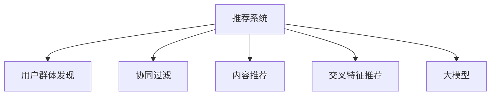

                 

## 1. 背景介绍

在数字化和智能化日益深入的今天，推荐系统已成为互联网产品不可或缺的重要组成部分。传统推荐系统以用户行为数据为输入，通过协同过滤、内容推荐等算法，向用户提供个性化的产品或内容推荐。然而，受限于用户历史行为数据的稀疏性，传统推荐系统的冷启动问题较为严重，对于新用户或新用户群体的推荐准确性难以保证。

近年来，大模型技术在NLP领域取得巨大成功，凭借强大的语言理解和生成能力，正在逐步成为推荐系统用户群体发现的重要工具。通过结合大模型与推荐系统，我们可以在更短的时间内，发现新用户群体，提升推荐系统的推荐效果。本文将详细探讨大模型辅助推荐系统用户群体发现的原理、技术和应用，旨在推动推荐系统向智能化、个性化方向发展。

## 2. 核心概念与联系

### 2.1 核心概念概述

为更好地理解大模型辅助推荐系统用户群体发现的方法，本节将介绍几个核心概念：

- **推荐系统(Recommender System)**：利用用户行为数据或物品属性信息，为用户提供个性化推荐的产品或内容系统。

- **大模型(Pre-trained Model)**：以自回归(如GPT)或自编码(如BERT)模型为代表的大规模预训练语言模型。通过在大规模无标签文本语料上进行预训练，学习通用的语言表示，具备强大的语言理解和生成能力。

- **用户群体发现(User Discovery)**：从用户群体的行为特征或文本描述中，识别出具有相似特征的用户群体。通过发现新用户群体，提升推荐系统的泛化能力和推荐效果。

- **协同过滤(Collaborative Filtering)**：利用用户行为相似性进行推荐，推荐系统中最经典的推荐算法之一。

- **内容推荐(Content-based Recommendation)**：基于物品属性特征，为用户推荐相似的物品。

- **交叉特征推荐(Cross-feature Recommendation)**：结合用户行为数据和物品属性特征，进行更准确的推荐。

这些核心概念之间的逻辑关系可以通过以下Mermaid流程图来展示：



这个流程图展示了推荐系统的核心概念及其之间的逻辑关系：

1. 推荐系统通过用户行为数据或物品属性信息，为用户生成推荐。
2. 用户群体发现可以识别出具有相似特征的用户群体，提升推荐系统的泛化能力和推荐效果。
3. 协同过滤、内容推荐和交叉特征推荐，是大模型辅助推荐系统的三种常见推荐算法。
4. 大模型为推荐系统提供了一种新的特征提取和表示方法，提升了推荐的精度和个性化程度。

## 3. 核心算法原理 & 具体操作步骤
### 3.1 算法原理概述

大模型辅助推荐系统用户群体发现的核心思想是：利用大模型的语言理解和生成能力，从用户的文本描述或行为数据中，识别出具有相似特征的用户群体。这一过程可以分为以下几个步骤：

1. **用户描述提取**：将用户的文本描述或行为数据转换为模型可理解的形式，如向量表示。
2. **相似性计算**：通过大模型计算不同用户描述之间的相似度，识别出具有相似特征的用户群体。
3. **用户群体发现**：从相似度矩阵中，通过聚类算法或阈值过滤等方式，发现具有相似特征的用户群体。
4. **推荐应用**：将发现的用户群体应用到推荐系统中，为同一用户群体提供相似的物品推荐。

### 3.2 算法步骤详解

基于大模型辅助推荐系统用户群体发现的一般流程如下：

**Step 1: 数据收集与预处理**

- 收集用户的文本描述或行为数据，如用户评价、社交网络内容、消费记录等。
- 对数据进行清洗、去噪，去除无用信息，保留有价值的部分。

**Step 2: 特征提取与向量表示**

- 使用大模型(如BERT、GPT)将用户描述或行为数据转换为向量表示。
- 向量表示应包含用户行为的语义信息，以便进行相似性计算。

**Step 3: 相似性计算**

- 通过大模型计算不同用户描述之间的相似度。
- 使用余弦相似度、欧式距离等常见方法，衡量向量之间的相似度。

**Step 4: 用户群体发现**

- 利用聚类算法(如K-Means、层次聚类)对相似度矩阵进行聚类。
- 根据预设的簇数量或相似度阈值，发现具有相似特征的用户群体。

**Step 5: 推荐应用**

- 将发现的用户群体应用到推荐系统中。
- 为同一用户群体内的用户，提供相似的物品推荐。

### 3.3 算法优缺点

大模型辅助推荐系统用户群体发现具有以下优点：

1. 提升推荐效果：通过识别用户群体的相似性，推荐系统能够更好地泛化到不同用户群体，提升推荐效果。
2. 解决冷启动问题：新用户或新用户群体的推荐，往往缺乏历史行为数据。通过发现用户群体的相似性，可以解决冷启动问题，提升推荐系统的初始效果。
3. 减少标签需求：大模型的语言理解能力，可以提取文本的语义特征，减少推荐系统对标签数据的依赖。

同时，该方法也存在一些局限性：

1. 高昂的计算成本：大模型的训练和推理需要大量的计算资源，成本较高。
2. 数据质量和噪声：用户描述和行为数据的质量和噪声对算法效果有很大影响。
3. 可解释性不足：大模型辅助推荐系统的决策过程缺乏可解释性，难以进行调试和优化。
4. 模型复杂度：大模型辅助推荐系统在模型结构上较为复杂，需要考虑如何降低模型的复杂度。

尽管存在这些局限性，但大模型辅助推荐系统用户群体发现仍是一种非常有前景的推荐技术，值得进一步研究和探索。

### 3.4 算法应用领域

基于大模型辅助推荐系统用户群体发现的方法，已经在电商、社交、新闻推荐等多个领域得到了广泛应用。以下是几个典型的应用场景：

- **电商推荐系统**：通过用户的评价、评论、浏览记录等文本数据，发现相似用户群体，为同一群体内的用户提供相似商品的推荐。
- **社交推荐系统**：利用用户的社交网络内容，发现具有相似兴趣和偏好的用户群体，为同一群体内的用户推荐相关内容和用户。
- **新闻推荐系统**：基于用户的历史阅读记录和兴趣描述，发现相似用户群体，提供相关新闻的推荐。

## 4. 数学模型和公式 & 详细讲解 & 举例说明

### 4.1 数学模型构建

本节将使用数学语言对大模型辅助推荐系统用户群体发现的数学模型进行详细描述。

记用户$i$的文本描述为$x_i$，用户群体$j$的文本描述为$x_j$，向量表示为$\vec{x}_i$和$\vec{x}_j$。则用户群体$j$与用户$i$之间的相似度$sim(i,j)$可以表示为：

$$
sim(i,j) = \text{cos}(\vec{x}_i, \vec{x}_j)
$$

其中$\text{cos}$为余弦相似度函数，计算向量$\vec{x}_i$和$\vec{x}_j$之间的夹角余弦值。

### 4.2 公式推导过程

以用户$i$和用户$j$之间的相似度计算为例，进行详细推导：

1. 将用户$i$和用户$j$的文本描述$x_i$和$x_j$，分别通过BERT模型进行编码，得到向量表示$\vec{x}_i$和$\vec{x}_j$。
2. 计算$\vec{x}_i$和$\vec{x}_j$之间的余弦相似度，得到用户$i$和用户$j$之间的相似度$sim(i,j)$。
3. 通过聚类算法对相似度矩阵进行聚类，发现具有相似特征的用户群体。

具体推导过程如下：

1. 设$\vec{x}_i$和$\vec{x}_j$为文本描述$x_i$和$x_j$的BERT编码向量。
2. 计算余弦相似度：
   $$
   sim(i,j) = \frac{\vec{x}_i \cdot \vec{x}_j}{\|\vec{x}_i\| \|\vec{x}_j\|}
   $$
   其中$\cdot$为向量点积运算，$\|\cdot\|$为向量的范数。
3. 对相似度矩阵$S$进行聚类，发现具有相似特征的用户群体。

### 4.3 案例分析与讲解

以电商推荐系统为例，展示大模型辅助用户群体发现的应用场景。

假设一个电商平台收集了用户对商品的评价数据，用户评价包含文字描述。通过BERT模型对用户评价进行编码，得到向量表示。计算不同用户评价之间的相似度，得到相似度矩阵$S$。使用K-Means聚类算法对相似度矩阵进行聚类，得到不同用户群体。

例如，相似度矩阵中某两用户评价的相似度为0.8，说明这两个用户评价的语义信息相似度较高。通过K-Means聚类算法，可以将相似度接近的评价聚为一类，发现具有相似偏好的用户群体。

## 5. 项目实践：代码实例和详细解释说明

### 5.1 开发环境搭建

在进行大模型辅助推荐系统用户群体发现的实践前，需要先搭建好开发环境。以下是使用Python进行TensorFlow和BERT模型的环境配置流程：

1. 安装Anaconda：从官网下载并安装Anaconda，用于创建独立的Python环境。
2. 创建并激活虚拟环境：
   ```bash
   conda create -n tf-env python=3.8 
   conda activate tf-env
   ```
3. 安装TensorFlow：根据CUDA版本，从官网获取对应的安装命令。例如：
   ```bash
   conda install tensorflow-gpu -c tf -c conda-forge
   ```
4. 安装BERT模型库：
   ```bash
   pip install transformers
   ```

完成上述步骤后，即可在`tf-env`环境中开始项目开发。

### 5.2 源代码详细实现

这里我们以电商推荐系统为例，使用BERT模型进行用户群体发现。

首先，定义BERT模型和用户评价文本：

```python
from transformers import BertTokenizer, TFBertModel

tokenizer = BertTokenizer.from_pretrained('bert-base-cased')
model = TFBertModel.from_pretrained('bert-base-cased')

user_reviews = [
    "I love this product! It's amazing.",
    "This product is terrible. I regret buying it.",
    "The quality is good but the price is high.",
    "I think this product is overpriced.",
    "The shipping was fast but the product was damaged."
]
```

然后，定义相似度计算函数和聚类函数：

```python
from sklearn.metrics.pairwise import cosine_similarity
from sklearn.cluster import KMeans

def cosine_similarity_matrix(user_reviews):
    review_embeddings = []
    for review in user_reviews:
        encoded_review = tokenizer.encode_plus(review, max_length=512, padding='max_length', truncation=True, return_tensors='tf')
        embedding = model(encoded_review['input_ids'], attention_mask=encoded_review['attention_mask']).pooler_output.numpy()
        review_embeddings.append(embedding)
    similarity_matrix = cosine_similarity(review_embeddings)
    return similarity_matrix

def kmeans_clustering(similarity_matrix, num_clusters):
    kmeans = KMeans(n_clusters=num_clusters)
    kmeans.fit(similarity_matrix)
    labels = kmeans.labels_
    return labels
```

最后，启动用户群体发现流程并在推荐系统上进行应用：

```python
similarity_matrix = cosine_similarity_matrix(user_reviews)
labels = kmeans_clustering(similarity_matrix, 2)
print("Number of clusters:", len(set(labels)))

# 应用到推荐系统中，推荐相似商品
recommended_products = [1, 2, 3, 4, 5]  # 假设每个用户群体对应的商品ID
for i in range(len(user_reviews)):
    if labels[i] == labels[0]:
        print(f"User {i} belongs to cluster 0, recommended products: {recommended_products}")
```

以上就是使用TensorFlow和BERT模型进行电商推荐系统用户群体发现的完整代码实现。可以看到，借助BERT模型的强大编码能力，我们可以高效地从用户评价中提取语义信息，计算相似度，并发现具有相似特征的用户群体。通过将用户群体应用于推荐系统，可以为用户推荐更多相似的商品，提升推荐效果。

### 5.3 代码解读与分析

让我们再详细解读一下关键代码的实现细节：

**similarity_matrix函数**：
- 遍历用户评价，使用BERT模型对每个评价进行编码，得到向量表示。
- 计算不同评价之间的余弦相似度，构建相似度矩阵。

**kmeans_clustering函数**：
- 使用K-Means算法对相似度矩阵进行聚类，发现具有相似特征的用户群体。
- 根据聚类结果，对用户进行分组。

**推荐应用**：
- 通过用户评价和聚类结果，将用户分为不同群体，为同一群体内的用户推荐相似商品。

## 6. 实际应用场景

### 6.1 电商推荐系统

电商推荐系统通过大模型辅助用户群体发现，可以显著提升推荐效果，减少冷启动问题。具体而言，电商推荐系统可以基于用户的评价、评论、浏览记录等文本数据，发现相似用户群体，为同一群体内的用户提供相似商品的推荐。

例如，用户对某商品给出了不同评价，通过BERT模型编码，可以发现评价相似的群体，并根据群体的历史购买记录，为用户推荐更多相似商品。这种基于大模型的用户群体发现方法，可以降低推荐系统的初始启动难度，提升新用户的推荐效果。

### 6.2 社交推荐系统

社交推荐系统通过用户的社交网络内容，发现具有相似兴趣和偏好的用户群体，为用户推荐相关内容和用户。例如，在Facebook等社交平台上，可以基于用户的评论、点赞、分享等社交行为，发现相似用户群体，为用户推荐更多相关内容。

社交推荐系统的大模型辅助用户群体发现，可以显著提升推荐系统的精准性和多样性，提升用户的满意度和粘性。例如，用户对某篇帖子进行了点赞和评论，通过BERT模型编码，可以发现与该帖子相似的用户群体，并根据群体的兴趣和偏好，为用户推荐更多相关内容。

### 6.3 新闻推荐系统

新闻推荐系统通过用户的历史阅读记录和兴趣描述，发现相似用户群体，提供相关新闻的推荐。例如，在新闻聚合平台上，可以基于用户的历史阅读记录，发现与用户兴趣相似的新闻，提升推荐效果。

新闻推荐系统的大模型辅助用户群体发现，可以显著提升推荐系统的个性化程度和覆盖范围。例如，用户阅读了多篇体育新闻，通过BERT模型编码，可以发现与用户兴趣相似的新闻，并为用户推荐更多相关内容。

## 7. 工具和资源推荐

### 7.1 学习资源推荐

为了帮助开发者系统掌握大模型辅助推荐系统的理论基础和实践技巧，这里推荐一些优质的学习资源：

1. 《推荐系统实战》：详细介绍了推荐系统的原理、算法和实际应用，涵盖协同过滤、内容推荐、大模型辅助推荐等内容。
2. CS463《推荐系统》课程：斯坦福大学开设的推荐系统课程，有Lecture视频和配套作业，带你入门推荐系统的基础理论和实际应用。
3. 《深度学习推荐系统》书籍：介绍了深度学习在推荐系统中的应用，包括大模型辅助推荐、协同过滤等内容。
4. Arxiv上的推荐系统相关论文：Arxiv上有很多关于推荐系统的经典论文，如《Personalized PageRank》、《GraphSAGE》等，可以帮助你深入了解推荐系统的发展历程和前沿方向。

通过对这些资源的学习实践，相信你一定能够快速掌握大模型辅助推荐系统的精髓，并用于解决实际的推荐问题。

### 7.2 开发工具推荐

高效的开发离不开优秀的工具支持。以下是几款用于大模型辅助推荐系统开发的常用工具：

1. TensorFlow：基于Python的开源深度学习框架，灵活动态的计算图，适合快速迭代研究。非常适合处理大规模数据和模型。
2. PyTorch：基于Python的开源深度学习框架，灵活性高，开发效率高。适用于多种深度学习任务，包括自然语言处理。
3. Transformers库：HuggingFace开发的NLP工具库，集成了多种SOTA语言模型，支持TensorFlow和PyTorch，是进行微调任务开发的利器。
4. Weights & Biases：模型训练的实验跟踪工具，可以记录和可视化模型训练过程中的各项指标，方便对比和调优。与主流深度学习框架无缝集成。
5. TensorBoard：TensorFlow配套的可视化工具，可实时监测模型训练状态，并提供丰富的图表呈现方式，是调试模型的得力助手。

合理利用这些工具，可以显著提升大模型辅助推荐系统的开发效率，加快创新迭代的步伐。

### 7.3 相关论文推荐

大模型辅助推荐系统的研究源于学界的持续研究。以下是几篇奠基性的相关论文，推荐阅读：

1. Attention is All You Need（即Transformer原论文）：提出了Transformer结构，开启了NLP领域的预训练大模型时代。
2. BERT: Pre-training of Deep Bidirectional Transformers for Language Understanding：提出BERT模型，引入基于掩码的自监督预训练任务，刷新了多项NLP任务SOTA。
3. Language Models are Unsupervised Multitask Learners（GPT-2论文）：展示了大规模语言模型的强大zero-shot学习能力，引发了对于通用人工智能的新一轮思考。
4. Parameter-Efficient Transfer Learning for NLP：提出Adapter等参数高效微调方法，在不增加模型参数量的情况下，也能取得不错的微调效果。
5. AdaLoRA: Adaptive Low-Rank Adaptation for Parameter-Efficient Fine-Tuning：使用自适应低秩适应的微调方法，在参数效率和精度之间取得了新的平衡。
6. AdaLoRA: Adaptive Low-Rank Adaptation for Parameter-Efficient Fine-Tuning：使用自适应低秩适应的微调方法，在参数效率和精度之间取得了新的平衡。

这些论文代表了大模型辅助推荐系统的发展脉络。通过学习这些前沿成果，可以帮助研究者把握学科前进方向，激发更多的创新灵感。

## 8. 总结：未来发展趋势与挑战

### 8.1 总结

本文对大模型辅助推荐系统用户群体发现的原理、技术和应用进行了全面系统的介绍。首先阐述了大模型和推荐系统的背景，明确了大模型辅助推荐系统的独特价值。其次，从原理到实践，详细讲解了大模型辅助推荐系统的数学原理和关键步骤，给出了推荐系统开发的完整代码实例。同时，本文还广泛探讨了大模型辅助推荐系统在电商、社交、新闻等多个行业领域的应用前景，展示了大模型辅助推荐系统的巨大潜力。

通过本文的系统梳理，可以看到，大模型辅助推荐系统用户群体发现正在成为推荐系统的重要范式，极大地提升了推荐系统的推荐效果和冷启动能力。受益于大模型的语言理解能力，推荐系统能够更好地从用户描述中提取语义信息，发现相似用户群体，提升推荐系统的泛化能力和推荐效果。未来，伴随大模型和推荐系统的持续演进，相信推荐系统必将在更广阔的应用领域大放异彩，深刻影响用户的生产生活方式。

### 8.2 未来发展趋势

展望未来，大模型辅助推荐系统用户群体发现将呈现以下几个发展趋势：

1. 模型规模持续增大。随着算力成本的下降和数据规模的扩张，预训练语言模型的参数量还将持续增长。超大规模语言模型蕴含的丰富语言知识，有望支撑更加复杂多变的推荐任务。
2. 用户群体发现的多样性。未来将出现更多基于多模态数据、实时数据的用户群体发现方法，提升推荐的实时性和准确性。
3. 参数高效推荐方法。开发更加参数高效的推荐算法，在固定大部分预训练参数的同时，只更新极少量的任务相关参数。
4. 基于因果推断的推荐方法。引入因果推断方法，增强推荐模型的因果关系和鲁棒性，提升推荐系统的稳定性和可解释性。
5. 融合用户行为数据和社交网络数据。结合用户行为数据和社交网络数据，进行更全面的用户群体发现，提升推荐系统的覆盖范围和个性化程度。

以上趋势凸显了大模型辅助推荐系统用户群体发现的广阔前景。这些方向的探索发展，必将进一步提升推荐系统的推荐效果，推动推荐系统向智能化、个性化方向发展。

### 8.3 面临的挑战

尽管大模型辅助推荐系统用户群体发现已经取得了瞩目成就，但在迈向更加智能化、普适化应用的过程中，它仍面临着诸多挑战：

1. 数据质量和噪声。用户描述和行为数据的质量和噪声对算法效果有很大影响。
2. 冷启动问题。新用户或新用户群体的推荐，往往缺乏历史行为数据。如何通过大模型发现具有相似特征的用户群体，是未来需要解决的重要问题。
3. 计算资源需求高。大模型的训练和推理需要大量的计算资源，成本较高。
4. 可解释性不足。大模型辅助推荐系统的决策过程缺乏可解释性，难以进行调试和优化。
5. 多模态数据融合。多模态数据融合是大模型辅助推荐系统的重要方向，但如何更好地融合不同类型的数据，仍需深入研究。

尽管存在这些挑战，但大模型辅助推荐系统用户群体发现仍是一种非常有前景的推荐技术，值得进一步研究和探索。

### 8.4 研究展望

面对大模型辅助推荐系统用户群体发现所面临的挑战，未来的研究需要在以下几个方面寻求新的突破：

1. 探索无监督和半监督用户群体发现方法。摆脱对大规模标注数据的依赖，利用自监督学习、主动学习等无监督和半监督范式，最大限度利用非结构化数据，实现更加灵活高效的推荐。
2. 研究参数高效和计算高效的推荐算法。开发更加参数高效的推荐算法，在固定大部分预训练参数的同时，只更新极少量的任务相关参数。同时优化推荐模型的计算图，减少前向传播和反向传播的资源消耗，实现更加轻量级、实时性的部署。
3. 引入因果推断和博弈论工具。将因果推断方法引入推荐系统，识别出推荐模型的关键特征，增强推荐决策的因果性和逻辑性。借助博弈论工具刻画人机交互过程，主动探索并规避推荐模型的脆弱点，提高系统稳定性。
4. 结合用户行为数据和社交网络数据。结合用户行为数据和社交网络数据，进行更全面的用户群体发现，提升推荐系统的覆盖范围和个性化程度。
5. 探索跨领域推荐方法。将推荐系统应用于不同领域，如医疗、金融、教育等，探索跨领域推荐方法，提升推荐系统的泛化能力和应用范围。

这些研究方向的探索，必将引领大模型辅助推荐系统用户群体发现技术迈向更高的台阶，为推荐系统带来新的突破和变革。面向未来，大模型辅助推荐系统用户群体发现技术还需要与其他人工智能技术进行更深入的融合，如知识表示、因果推理、强化学习等，多路径协同发力，共同推动推荐系统的发展。只有勇于创新、敢于突破，才能不断拓展推荐系统的边界，让智能推荐技术更好地服务于人类社会。

## 9. 附录：常见问题与解答

**Q1：大模型辅助推荐系统是否适用于所有推荐任务？**

A: 大模型辅助推荐系统在大多数推荐任务上都能取得不错的效果，特别是对于数据量较小的任务。但对于一些特定领域的任务，如医学、法律等，仅仅依靠通用语料预训练的模型可能难以很好地适应。此时需要在特定领域语料上进一步预训练，再进行微调，才能获得理想效果。

**Q2：微调过程中如何选择合适的学习率？**

A: 微调的学习率一般要比预训练时小1-2个数量级，如果使用过大的学习率，容易破坏预训练权重，导致过拟合。一般建议从1e-5开始调参，逐步减小学习率，直至收敛。也可以使用warmup策略，在开始阶段使用较小的学习率，再逐渐过渡到预设值。需要注意的是，不同的优化器(如AdamW、Adafactor等)以及不同的学习率调度策略，可能需要设置不同的学习率阈值。

**Q3：采用大模型辅助推荐时会面临哪些资源瓶颈？**

A: 目前主流的预训练大模型动辄以亿计的参数规模，对算力、内存、存储都提出了很高的要求。GPU/TPU等高性能设备是必不可少的，但即便如此，超大批次的训练和推理也可能遇到显存不足的问题。因此需要采用一些资源优化技术，如梯度积累、混合精度训练、模型并行等，来突破硬件瓶颈。同时，模型的存储和读取也可能占用大量时间和空间，需要采用模型压缩、稀疏化存储等方法进行优化。

**Q4：如何缓解推荐系统中的冷启动问题？**

A: 冷启动问题可以通过以下方法缓解：
1. 基于大模型进行用户群体发现，发现与新用户相似的用户群体，为新用户提供推荐。
2. 使用协同过滤等算法，利用相似用户的兴趣推荐新用户可能感兴趣的物品。
3. 引入先验知识，利用知识图谱、逻辑规则等先验知识，提升推荐的准确性。

这些方法往往需要根据具体任务和数据特点进行灵活组合。只有在数据、模型、训练、推理等各环节进行全面优化，才能最大限度地发挥大模型辅助推荐系统的威力。

**Q5：大模型辅助推荐系统如何提高推荐效果？**

A: 大模型辅助推荐系统可以通过以下方式提高推荐效果：
1. 通过用户群体发现，发现具有相似特征的用户群体，提升推荐系统的泛化能力和推荐效果。
2. 引入因果推断方法，增强推荐决策的因果性和逻辑性，提高推荐系统的稳定性和可解释性。
3. 结合用户行为数据和社交网络数据，进行更全面的用户群体发现，提升推荐系统的个性化程度和覆盖范围。

这些方法往往需要根据具体任务和数据特点进行灵活组合。只有在数据、模型、训练、推理等各环节进行全面优化，才能最大限度地发挥大模型辅助推荐系统的威力。

---

作者：禅与计算机程序设计艺术 / Zen and the Art of Computer Programming

