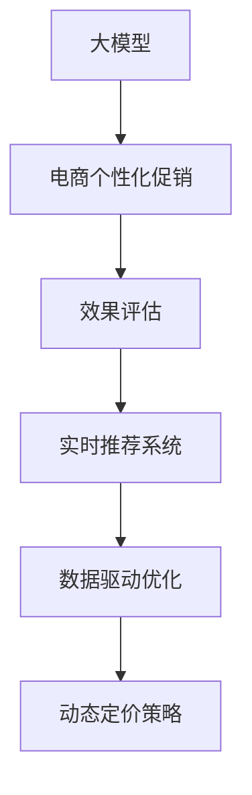

                 

# 大模型驱动的电商个性化促销效果预测与优化

> 关键词：大模型, 电商, 个性化促销, 效果预测, 优化策略, 实时推荐, 广告效果, 用户行为, 数据驱动

## 1. 背景介绍

在快速发展的电子商务时代，个性化促销成为商家提升转化率和增加用户粘性的重要手段。然而，如何高效、精准地策划个性化促销活动，并实时评估其效果，已成为电商企业的核心挑战。大模型驱动的个性化促销效果预测与优化方法，通过深度学习和大规模预训练语言模型的强大能力，有望大幅提升促销活动的效果评估和管理效率。

### 1.1 问题由来
随着电子商务平台的日趋成熟，竞争愈发激烈，商家需要通过各种手段吸引用户，提升销售额。个性化促销活动由于其灵活性和针对性，成为商家常用的营销手段之一。然而，如何精准设计个性化促销活动，以及如何实时评估其效果，都是令人头疼的问题。传统的人工设计和事后分析方法，往往存在耗时长、精度低等局限性，难以满足现代电商的快速响应和高效决策需求。

### 1.2 问题核心关键点
1. **个性化促销效果评估**：如何构建有效的评估指标，准确反映个性化促销对用户行为的影响？
2. **实时推荐系统**：如何在促销活动进行中实时推荐商品，提升用户转化率？
3. **数据驱动优化**：如何利用用户行为数据驱动促销活动的优化，避免无效推广？
4. **动态定价策略**：如何在促销活动中动态调整商品价格，实现最佳收益？

### 1.3 问题研究意义
大模型驱动的电商个性化促销效果预测与优化方法，通过深度学习和大规模预训练语言模型的强大能力，可以帮助电商企业更精准地设计促销活动，实时监测和优化促销效果，显著提升用户转化率和销售额。这不仅能够降低人工成本，还能提高决策效率和准确性，为电商行业带来革命性的变化。

## 2. 核心概念与联系

### 2.1 核心概念概述

为更好地理解基于大模型的电商个性化促销优化方法，本节将介绍几个密切相关的核心概念：

- **大模型(大语言模型)**：以自回归(如GPT)或自编码(如BERT)模型为代表的大规模预训练语言模型。通过在大规模无标签文本语料上进行预训练，学习通用的语言表示，具备强大的语言理解和生成能力。

- **电商个性化促销**：通过分析用户行为数据，针对不同用户群体和购物场景，设计个性化、动态的促销活动，提升用户购买意愿和满意度。

- **效果评估**：对个性化促销活动的效果进行量化评估，了解活动对用户行为和业务指标的影响。

- **实时推荐系统**：在个性化促销活动进行中，实时根据用户行为和市场变化，推荐可能感兴趣的商品，提升用户购物体验。

- **数据驱动优化**：利用用户行为数据和市场反馈，动态调整促销策略，优化推广效果。

- **动态定价策略**：在促销活动中，根据用户行为和市场变化，动态调整商品价格，实现最佳收益。

这些核心概念之间的逻辑关系可以通过以下Mermaid流程图来展示：



这个流程图展示了大模型在电商个性化促销优化中的核心作用：

1. 大模型通过预训练获得基础能力。
2. 电商个性化促销在活动设计、效果评估、实时推荐等方面广泛应用大模型的能力。
3. 数据驱动优化和动态定价策略，依赖于大模型对用户行为的深刻理解，以及对市场变化的快速响应。

## 3. 核心算法原理 & 具体操作步骤
### 3.1 算法原理概述

大模型驱动的电商个性化促销优化方法，本质上是一个深度学习驱动的数据挖掘和优化过程。其核心思想是：利用大模型在无标签数据上预训练获得的基础语言表示能力，结合电商促销活动的具体需求，构建有效的促销效果预测模型，实时监测促销效果，并根据反馈数据动态调整促销策略，实现最大化收益。

形式化地，假设电商平台有促销活动 $C$，对应的用户行为数据集 $D=\{(x_i,y_i)\}_{i=1}^N$，其中 $x_i$ 表示用户行为数据，$y_i$ 表示促销活动的效果指标（如转化率、平均订单价值等）。大模型的预训练参数为 $\theta$。促销优化算法如下：

1. **预训练模型**：在大规模无标签数据上预训练大模型，学习通用的语言表示。
2. **模型适配**：针对促销活动，对大模型进行微调，构建预测模型。
3. **效果评估**：利用预测模型对用户行为数据进行预测，评估促销活动的效果。
4. **动态调整**：根据预测效果，动态调整促销策略，优化促销活动。

### 3.2 算法步骤详解

大模型驱动的电商个性化促销优化方法包括以下几个关键步骤：

**Step 1: 准备预训练模型和数据集**
- 选择合适的预训练大模型 $M_{\theta}$ 作为初始化参数，如 BERT、GPT 等。
- 准备电商促销活动的用户行为数据集 $D$，划分为训练集、验证集和测试集。

**Step 2: 模型适配**
- 根据促销活动的具体需求，选择合适的输出层和损失函数。例如，对于转化率预测，可以使用二分类交叉熵损失函数。
- 将用户行为数据 $x$ 作为输入，促销活动效果 $y$ 作为标签，微调大模型，使其能够预测促销活动的效果。

**Step 3: 效果评估**
- 利用微调后的模型对用户行为数据进行预测，计算预测值与真实值之间的误差。
- 根据误差计算指标，如MAE（平均绝对误差）、RMSE（均方根误差）等，评估促销活动的效果。

**Step 4: 动态调整**
- 根据效果评估结果，动态调整促销策略，如商品价格、促销内容等。
- 实时更新预测模型，重新评估促销活动效果，形成闭环优化。

**Step 5: 运行优化**
- 在电商平台上部署优化后的预测模型，实时监测促销活动效果。
- 根据实时反馈数据，不断调整促销策略，实现最大化收益。

### 3.3 算法优缺点

大模型驱动的电商个性化促销优化方法具有以下优点：
1. **精度高**：利用大模型的强大语言理解能力，能够精准评估促销活动效果。
2. **灵活性高**：可以实时监测和优化促销活动，适应市场变化和用户需求。
3. **数据驱动**：根据用户行为数据驱动促销策略，提升决策准确性和效果。
4. **可扩展性**：支持多商品、多促销活动的优化，具备良好的可扩展性。

同时，该方法也存在一定的局限性：
1. **数据依赖性强**：需要大量用户行为数据进行训练，数据获取成本较高。
2. **计算资源消耗大**：大模型的训练和部署需要大量计算资源，对硬件要求较高。
3. **过拟合风险**：若数据集过小或标注偏差，模型可能过拟合，影响泛化能力。
4. **隐私风险**：用户行为数据涉及隐私，需要采取严格的数据保护措施。

尽管存在这些局限性，但就目前而言，大模型驱动的电商个性化促销优化方法仍是电商营销领域的重要技术手段。未来相关研究的重点在于如何进一步降低数据依赖，提高模型的泛化能力和计算效率，同时兼顾隐私保护。

### 3.4 算法应用领域

大模型驱动的电商个性化促销优化方法已经在电商领域得到了广泛的应用，覆盖了从活动设计到实时优化等多个环节，例如：

- **活动设计**：利用大模型对用户行为数据进行分析，挖掘用户兴趣点和购买倾向，设计个性化的促销活动。
- **效果评估**：构建预测模型，实时评估促销活动对用户行为的影响，量化活动效果。
- **实时推荐**：在促销活动进行中，实时根据用户行为和市场变化，推荐可能感兴趣的商品，提升用户购物体验。
- **动态定价**：根据用户行为和市场变化，动态调整商品价格，实现最佳收益。
- **用户留存**：通过个性化促销活动提升用户满意度，增加用户留存率，增强品牌忠诚度。

除了上述这些经典应用外，大模型驱动的促销优化方法还在个性化推荐、广告投放优化、市场分析等诸多电商应用场景中得到广泛应用，推动了电商行业的智能化进程。

## 4. 数学模型和公式 & 详细讲解 & 举例说明（备注：数学公式请使用latex格式，latex嵌入文中独立段落使用 $$，段落内使用 $)
### 4.1 数学模型构建

本节将使用数学语言对大模型驱动的电商个性化促销优化方法进行更加严格的刻画。

记大模型为 $M_{\theta}$，用户行为数据为 $x$，促销活动效果为 $y$。定义模型 $M_{\theta}$ 在输入 $x$ 上的输出为 $\hat{y}=M_{\theta}(x)$。

假设电商促销活动的效果可以由 $\hat{y}$ 预测，则效果评估公式为：

$$
\mathcal{L}(\theta) = \frac{1}{N}\sum_{i=1}^N \ell(\hat{y_i}, y_i)
$$

其中 $\ell$ 为预测误差损失函数，如均方误差、交叉熵等。

优化目标是最小化预测误差，即：

$$
\theta^* = \mathop{\arg\min}_{\theta} \mathcal{L}(\theta)
$$

在实践中，我们通常使用基于梯度的优化算法（如Adam、SGD等）来近似求解上述最优化问题。设 $\eta$ 为学习率，则参数的更新公式为：

$$
\theta \leftarrow \theta - \eta \nabla_{\theta}\mathcal{L}(\theta)
$$

其中 $\nabla_{\theta}\mathcal{L}(\theta)$ 为损失函数对参数 $\theta$ 的梯度，可通过反向传播算法高效计算。

### 4.2 公式推导过程

以下我们以转化率预测为例，推导预测误差损失函数的计算公式。

假设模型 $M_{\theta}$ 在输入 $x$ 上的输出为 $\hat{y}=M_{\theta}(x) \in [0,1]$，表示样本属于正类的概率。真实标签 $y \in \{0,1\}$。则二分类交叉熵损失函数定义为：

$$
\ell(\hat{y},y) = -[y\log \hat{y} + (1-y)\log (1-\hat{y})]
$$

将其代入效果评估公式，得：

$$
\mathcal{L}(\theta) = -\frac{1}{N}\sum_{i=1}^N [y_i\log M_{\theta}(x_i)+(1-y_i)\log(1-M_{\theta}(x_i))]
$$

根据链式法则，损失函数对参数 $\theta_k$ 的梯度为：

$$
\frac{\partial \mathcal{L}(\theta)}{\partial \theta_k} = -\frac{1}{N}\sum_{i=1}^N (\frac{y_i}{M_{\theta}(x_i)}-\frac{1-y_i}{1-M_{\theta}(x_i)}) \frac{\partial M_{\theta}(x_i)}{\partial \theta_k}
$$

其中 $\frac{\partial M_{\theta}(x_i)}{\partial \theta_k}$ 可进一步递归展开，利用自动微分技术完成计算。

在得到损失函数的梯度后，即可带入参数更新公式，完成模型的迭代优化。重复上述过程直至收敛，最终得到适应电商促销活动的最优模型参数 $\theta^*$。

## 5. 项目实践：代码实例和详细解释说明
### 5.1 开发环境搭建

在进行电商个性化促销优化实践前，我们需要准备好开发环境。以下是使用Python进行PyTorch开发的环境配置流程：

1. 安装Anaconda：从官网下载并安装Anaconda，用于创建独立的Python环境。

2. 创建并激活虚拟环境：
```bash
conda create -n pytorch-env python=3.8 
conda activate pytorch-env
```

3. 安装PyTorch：根据CUDA版本，从官网获取对应的安装命令。例如：
```bash
conda install pytorch torchvision torchaudio cudatoolkit=11.1 -c pytorch -c conda-forge
```

4. 安装TensorFlow：从官网下载并安装TensorFlow，方便进行深度学习模型的开发和训练。

5. 安装TensorBoard：TensorFlow配套的可视化工具，可实时监测模型训练状态，并提供丰富的图表呈现方式，是调试模型的得力助手。

6. 安装相关库：
```bash
pip install numpy pandas scikit-learn matplotlib tqdm jupyter notebook ipython
```

完成上述步骤后，即可在`pytorch-env`环境中开始电商个性化促销优化实践。

### 5.2 源代码详细实现

下面我们以电商转化率预测任务为例，给出使用PyTorch对BERT模型进行电商个性化促销优化实践的代码实现。

首先，定义电商转化率预测任务的数据处理函数：

```python
from transformers import BertTokenizer
from torch.utils.data import Dataset
import torch

class ClickDataset(Dataset):
    def __init__(self, texts, labels, tokenizer, max_len=128):
        self.texts = texts
        self.labels = labels
        self.tokenizer = tokenizer
        self.max_len = max_len
        
    def __len__(self):
        return len(self.texts)
    
    def __getitem__(self, item):
        text = self.texts[item]
        label = self.labels[item]
        
        encoding = self.tokenizer(text, return_tensors='pt', max_length=self.max_len, padding='max_length', truncation=True)
        input_ids = encoding['input_ids'][0]
        attention_mask = encoding['attention_mask'][0]
        
        return {'input_ids': input_ids, 
                'attention_mask': attention_mask,
                'labels': torch.tensor(label, dtype=torch.long)}
```

然后，定义模型和优化器：

```python
from transformers import BertForTokenClassification, AdamW

model = BertForTokenClassification.from_pretrained('bert-base-cased', num_labels=2)

optimizer = AdamW(model.parameters(), lr=2e-5)
```

接着，定义训练和评估函数：

```python
from torch.utils.data import DataLoader
from tqdm import tqdm
from sklearn.metrics import classification_report

device = torch.device('cuda') if torch.cuda.is_available() else torch.device('cpu')
model.to(device)

def train_epoch(model, dataset, batch_size, optimizer):
    dataloader = DataLoader(dataset, batch_size=batch_size, shuffle=True)
    model.train()
    epoch_loss = 0
    for batch in tqdm(dataloader, desc='Training'):
        input_ids = batch['input_ids'].to(device)
        attention_mask = batch['attention_mask'].to(device)
        labels = batch['labels'].to(device)
        model.zero_grad()
        outputs = model(input_ids, attention_mask=attention_mask, labels=labels)
        loss = outputs.loss
        epoch_loss += loss.item()
        loss.backward()
        optimizer.step()
    return epoch_loss / len(dataloader)

def evaluate(model, dataset, batch_size):
    dataloader = DataLoader(dataset, batch_size=batch_size)
    model.eval()
    preds, labels = [], []
    with torch.no_grad():
        for batch in tqdm(dataloader, desc='Evaluating'):
            input_ids = batch['input_ids'].to(device)
            attention_mask = batch['attention_mask'].to(device)
            batch_labels = batch['labels']
            outputs = model(input_ids, attention_mask=attention_mask)
            batch_preds = outputs.logits.argmax(dim=2).to('cpu').tolist()
            batch_labels = batch_labels.to('cpu').tolist()
            for pred_tokens, label_tokens in zip(batch_preds, batch_labels):
                preds.append(pred_tokens[:len(label_tokens)])
                labels.append(label_tokens)
                
    print(classification_report(labels, preds))
```

最后，启动训练流程并在测试集上评估：

```python
epochs = 5
batch_size = 16

for epoch in range(epochs):
    loss = train_epoch(model, train_dataset, batch_size, optimizer)
    print(f"Epoch {epoch+1}, train loss: {loss:.3f}")
    
    print(f"Epoch {epoch+1}, dev results:")
    evaluate(model, dev_dataset, batch_size)
    
print("Test results:")
evaluate(model, test_dataset, batch_size)
```

以上就是使用PyTorch对BERT进行电商转化率预测任务优化的完整代码实现。可以看到，得益于Transformers库的强大封装，我们可以用相对简洁的代码完成BERT模型的加载和优化。

### 5.3 代码解读与分析

让我们再详细解读一下关键代码的实现细节：

**ClickDataset类**：
- `__init__`方法：初始化文本、标签、分词器等关键组件。
- `__len__`方法：返回数据集的样本数量。
- `__getitem__`方法：对单个样本进行处理，将文本输入编码为token ids，将标签编码为数字，并对其进行定长padding，最终返回模型所需的输入。

**BertForTokenClassification模型**：
- 使用Bert模型作为预测模型的基础，通过添加输出层和标签进行微调。

**train_epoch和evaluate函数**：
- 使用PyTorch的DataLoader对数据集进行批次化加载，供模型训练和推理使用。
- 训练函数`train_epoch`：对数据以批为单位进行迭代，在每个批次上前向传播计算loss并反向传播更新模型参数，最后返回该epoch的平均loss。
- 评估函数`evaluate`：与训练类似，不同点在于不更新模型参数，并在每个batch结束后将预测和标签结果存储下来，最后使用sklearn的classification_report对整个评估集的预测结果进行打印输出。

**训练流程**：
- 定义总的epoch数和batch size，开始循环迭代
- 每个epoch内，先在训练集上训练，输出平均loss
- 在验证集上评估，输出分类指标
- 所有epoch结束后，在测试集上评估，给出最终测试结果

可以看到，PyTorch配合Transformers库使得BERT微调的代码实现变得简洁高效。开发者可以将更多精力放在数据处理、模型改进等高层逻辑上，而不必过多关注底层的实现细节。

当然，工业级的系统实现还需考虑更多因素，如模型的保存和部署、超参数的自动搜索、更灵活的任务适配层等。但核心的优化方法基本与此类似。

## 6. 实际应用场景
### 6.1 智能客服系统

基于大模型驱动的电商个性化促销优化方法，可以应用于智能客服系统的构建。传统客服往往需要配备大量人力，高峰期响应缓慢，且一致性和专业性难以保证。而使用优化后的智能客服系统，可以7x24小时不间断服务，快速响应客户咨询，用自然流畅的语言解答各类常见问题。

在技术实现上，可以收集企业内部的历史客服对话记录，将问题和最佳答复构建成监督数据，在此基础上对预训练对话模型进行优化。优化后的对话模型能够自动理解用户意图，匹配最合适的答案模板进行回复。对于客户提出的新问题，还可以接入检索系统实时搜索相关内容，动态组织生成回答。如此构建的智能客服系统，能大幅提升客户咨询体验和问题解决效率。

### 6.2 金融舆情监测

金融机构需要实时监测市场舆论动向，以便及时应对负面信息传播，规避金融风险。传统的人工监测方式成本高、效率低，难以应对网络时代海量信息爆发的挑战。基于大模型驱动的电商个性化促销优化方法中的效果评估技术，为金融舆情监测提供了新的解决方案。

具体而言，可以收集金融领域相关的新闻、报道、评论等文本数据，并对其进行主题标注和情感标注。在此基础上对预训练语言模型进行优化，使其能够自动判断文本属于何种主题，情感倾向是正面、中性还是负面。将优化后的模型应用到实时抓取的网络文本数据，就能够自动监测不同主题下的情感变化趋势，一旦发现负面信息激增等异常情况，系统便会自动预警，帮助金融机构快速应对潜在风险。

### 6.3 个性化推荐系统

当前的推荐系统往往只依赖用户的历史行为数据进行物品推荐，无法深入理解用户的真实兴趣偏好。基于大模型驱动的电商个性化促销优化方法中的实时推荐系统，可以用于个性化推荐系统的构建。

在实践中，可以收集用户浏览、点击、评论、分享等行为数据，提取和用户交互的物品标题、描述、标签等文本内容。将文本内容作为模型输入，用户的后续行为（如是否点击、购买等）作为监督信号，在此基础上优化预训练语言模型。优化后的模型能够从文本内容中准确把握用户的兴趣点。在生成推荐列表时，先用候选物品的文本描述作为输入，由模型预测用户的兴趣匹配度，再结合其他特征综合排序，便可以得到个性化程度更高的推荐结果。

### 6.4 未来应用展望

随着大模型驱动的电商个性化促销优化方法的不断发展，基于大模型的微调方法将在更多领域得到应用，为各行各业带来变革性影响。

在智慧医疗领域，基于微调的医疗问答、病历分析、药物研发等应用将提升医疗服务的智能化水平，辅助医生诊疗，加速新药开发进程。

在智能教育领域，微调技术可应用于作业批改、学情分析、知识推荐等方面，因材施教，促进教育公平，提高教学质量。

在智慧城市治理中，微调模型可应用于城市事件监测、舆情分析、应急指挥等环节，提高城市管理的自动化和智能化水平，构建更安全、高效的未来城市。

此外，在企业生产、社会治理、文娱传媒等众多领域，基于大模型微调的人工智能应用也将不断涌现，为经济社会发展注入新的动力。相信随着技术的日益成熟，微调方法将成为人工智能落地应用的重要范式，推动人工智能技术在各个领域的应用和发展。

## 7. 工具和资源推荐
### 7.1 学习资源推荐

为了帮助开发者系统掌握大模型驱动的电商个性化促销优化方法的理论基础和实践技巧，这里推荐一些优质的学习资源：

1. 《深度学习框架PyTorch实战》系列博文：由PyTorch官方社区维护，系统介绍了PyTorch的安装、配置、优化等实战经验。

2. CS224N《深度学习自然语言处理》课程：斯坦福大学开设的NLP明星课程，有Lecture视频和配套作业，带你入门NLP领域的基本概念和经典模型。

3. 《Transformers 3.0深度学习框架》书籍：介绍最新的深度学习框架，涵盖大模型在电商、金融、医疗等多个领域的应用。

4. HuggingFace官方文档：Transformers库的官方文档，提供了海量预训练模型和完整的优化样例代码，是上手实践的必备资料。

5. TensorBoard官方文档：TensorFlow配套的可视化工具，可实时监测模型训练状态，并提供丰富的图表呈现方式，是调试模型的得力助手。

通过对这些资源的学习实践，相信你一定能够快速掌握大模型驱动的电商个性化促销优化方法的精髓，并用于解决实际的电商问题。
###  7.2 开发工具推荐

高效的开发离不开优秀的工具支持。以下是几款用于大模型驱动的电商个性化促销优化开发的常用工具：

1. PyTorch：基于Python的开源深度学习框架，灵活动态的计算图，适合快速迭代研究。大部分预训练语言模型都有PyTorch版本的实现。

2. TensorFlow：由Google主导开发的开源深度学习框架，生产部署方便，适合大规模工程应用。同样有丰富的预训练语言模型资源。

3. Transformers库：HuggingFace开发的NLP工具库，集成了众多SOTA语言模型，支持PyTorch和TensorFlow，是进行电商个性化促销优化开发的利器。

4. Weights & Biases：模型训练的实验跟踪工具，可以记录和可视化模型训练过程中的各项指标，方便对比和调优。与主流深度学习框架无缝集成。

5. Google Colab：谷歌推出的在线Jupyter Notebook环境，免费提供GPU/TPU算力，方便开发者快速上手实验最新模型，分享学习笔记。

合理利用这些工具，可以显著提升电商个性化促销优化任务的开发效率，加快创新迭代的步伐。

### 7.3 相关论文推荐

大模型驱动的电商个性化促销优化方法的发展源于学界的持续研究。以下是几篇奠基性的相关论文，推荐阅读：

1. Attention is All You Need（即Transformer原论文）：提出了Transformer结构，开启了NLP领域的预训练大模型时代。

2. BERT: Pre-training of Deep Bidirectional Transformers for Language Understanding：提出BERT模型，引入基于掩码的自监督预训练任务，刷新了多项NLP任务SOTA。

3. Deep Learning for Personalized Product Recommendation：研究了基于深度学习的产品推荐算法，探讨了在电商领域中个性化推荐的应用。

4. Contextual Embeddings from Language Models are Universal and Robust：研究了预训练语言模型在推荐系统中的应用，探讨了上下文嵌入的通用性和鲁棒性。

5. Deep Learning and Recommender Systems：综合介绍了深度学习在推荐系统中的应用，探讨了如何利用用户行为数据驱动推荐算法的优化。

这些论文代表了大模型驱动的电商个性化促销优化方法的发展脉络。通过学习这些前沿成果，可以帮助研究者把握学科前进方向，激发更多的创新灵感。

## 8. 总结：未来发展趋势与挑战

### 8.1 总结

本文对大模型驱动的电商个性化促销优化方法进行了全面系统的介绍。首先阐述了电商促销活动的背景和需求，明确了电商个性化促销优化方法在提升促销活动效果、实时优化等方面的核心价值。其次，从原理到实践，详细讲解了大模型在电商促销优化中的应用，给出了微调任务开发的完整代码实例。同时，本文还广泛探讨了电商个性化促销优化方法在智能客服、金融舆情、个性化推荐等多个行业领域的应用前景，展示了微调范式的巨大潜力。此外，本文精选了电商个性化促销优化方法的各类学习资源，力求为读者提供全方位的技术指引。

通过本文的系统梳理，可以看到，大模型驱动的电商个性化促销优化方法在电商营销领域已经取得了显著的成效，极大地提升了促销活动的决策效率和效果。未来，伴随预训练语言模型和微调方法的持续演进，基于大模型的微调方法必将在更多领域得到应用，为电商行业带来革命性的变化。

### 8.2 未来发展趋势

展望未来，大模型驱动的电商个性化促销优化方法将呈现以下几个发展趋势：

1. **自动化程度提高**：利用大模型的语言理解和生成能力，自动设计促销活动，降低人工干预成本。
2. **实时优化能力增强**：通过实时监测和反馈，动态调整促销策略，实现最大化收益。
3. **跨领域应用扩展**：从电商领域扩展到金融、医疗、教育等更多领域，实现多场景的个性化优化。
4. **数据驱动的优化**：通过分析用户行为数据，实现更精准的个性化推荐和优化。
5. **知识图谱的融合**：将知识图谱与大模型结合，增强推荐系统的知识整合能力。
6. **隐私保护和伦理考量**：在数据采集和使用过程中，加强隐私保护和伦理考量，确保用户数据安全。

以上趋势凸显了大模型驱动的电商个性化促销优化技术的广阔前景。这些方向的探索发展，必将进一步提升电商促销活动的智能化水平，为电商行业带来革命性的变化。

### 8.3 面临的挑战

尽管大模型驱动的电商个性化促销优化方法已经取得了瞩目成就，但在迈向更加智能化、普适化应用的过程中，它仍面临着诸多挑战：

1. **数据依赖性强**：需要大量用户行为数据进行训练，数据获取成本较高。
2. **计算资源消耗大**：大模型的训练和部署需要大量计算资源，对硬件要求较高。
3. **过拟合风险**：若数据集过小或标注偏差，模型可能过拟合，影响泛化能力。
4. **隐私风险**：用户行为数据涉及隐私，需要采取严格的数据保护措施。
5. **市场变化快**：电商市场变化迅速，模型需要快速适应新的促销策略和市场趋势。

尽管存在这些挑战，但就目前而言，大模型驱动的电商个性化促销优化方法仍是电商营销领域的重要技术手段。未来相关研究的重点在于如何进一步降低数据依赖，提高模型的泛化能力和计算效率，同时兼顾隐私保护和市场变化。

### 8.4 研究展望

面对大模型驱动的电商个性化促销优化方法所面临的种种挑战，未来的研究需要在以下几个方面寻求新的突破：

1. **数据增强技术**：探索更多无监督和半监督的学习方法，降低对标注数据的依赖。
2. **模型压缩和量化**：研究模型压缩和量化技术，减少计算资源消耗。
3. **泛化能力提升**：采用更多的正则化技术和数据增强方法，提高模型的泛化能力。
4. **隐私保护技术**：研究隐私保护技术，确保用户数据安全和隐私。
5. **动态模型更新**：研究动态模型更新技术，快速适应市场变化和用户需求。

这些研究方向的探索，必将引领大模型驱动的电商个性化促销优化方法迈向更高的台阶，为电商行业带来革命性的变化。面向未来，大模型驱动的电商个性化促销优化方法还需要与其他人工智能技术进行更深入的融合，如知识表示、因果推理、强化学习等，多路径协同发力，共同推动自然语言理解和智能交互系统的进步。只有勇于创新、敢于突破，才能不断拓展语言模型的边界，让智能技术更好地造福人类社会。

## 9. 附录：常见问题与解答

**Q1：大模型驱动的电商个性化促销优化方法是否适用于所有电商平台？**

A: 大模型驱动的电商个性化促销优化方法适用于大部分电商平台，但不同平台的用户行为数据和业务需求有所差异，需要根据具体情况进行调整。例如，针对C2C平台和B2B平台，需要设计不同的促销策略和评估指标。

**Q2：电商个性化促销优化中如何避免过拟合？**

A: 电商个性化促销优化中避免过拟合的方法包括：
1. 数据增强：通过回译、近义替换等方式扩充训练集。
2. 正则化：使用L2正则、Dropout、Early Stopping等避免过拟合。
3. 对抗训练：引入对抗样本，提高模型鲁棒性。
4. 参数高效微调：只调整少量参数(如Adapter、Prefix等)，减小过拟合风险。

这些方法往往需要根据具体任务和数据特点进行灵活组合，以最大限度地避免过拟合。

**Q3：电商个性化促销优化中如何实现实时推荐？**

A: 电商个性化促销优化中实现实时推荐的方法包括：
1. 实时数据流处理：利用流式计算框架如Apache Flink、Apache Storm等，实时处理用户行为数据。
2. 流式模型更新：利用在线学习技术，实时更新推荐模型。
3. 增量训练：在实时数据流中，通过增量训练方法，不断优化推荐模型。
4. 分布式计算：利用分布式计算框架如Spark、Dask等，提升实时推荐系统的计算能力。

这些方法可以确保在电商促销活动进行中，实时根据用户行为和市场变化，推荐可能感兴趣的商品，提升用户购物体验。

**Q4：电商个性化促销优化中如何实现动态定价？**

A: 电商个性化促销优化中实现动态定价的方法包括：
1. 用户行为建模：利用大模型对用户行为进行分析，建立用户画像和偏好模型。
2. 动态定价算法：根据用户画像和市场动态，动态调整商品价格。
3. 实时监控：实时监控市场变化和用户反馈，调整定价策略。
4. A/B测试：通过A/B测试，评估不同定价策略的效果，优化定价模型。

这些方法可以确保在促销活动中，根据用户行为和市场变化，动态调整商品价格，实现最佳收益。

**Q5：电商个性化促销优化中如何保证模型的泛化能力？**

A: 电商个性化促销优化中保证模型的泛化能力的方法包括：
1. 数据增强：通过回译、近义替换等方式扩充训练集。
2. 正则化：使用L2正则、Dropout、Early Stopping等避免过拟合。
3. 对抗训练：引入对抗样本，提高模型鲁棒性。
4. 泛化评估：在验证集和测试集上进行泛化评估，确保模型在未见过的数据上表现良好。
5. 模型压缩和量化：研究模型压缩和量化技术，减少计算资源消耗。

这些方法可以确保在电商个性化促销优化过程中，模型能够适应不同场景和数据分布，具备良好的泛化能力。

**Q6：电商个性化促销优化中如何实现用户隐私保护？**

A: 电商个性化促销优化中实现用户隐私保护的方法包括：
1. 数据匿名化：对用户数据进行匿名化处理，保护用户隐私。
2. 数据加密：采用加密技术，确保数据传输过程中的安全性。
3. 访问控制：对数据进行严格的访问控制，限制数据访问权限。
4. 隐私政策：制定明确的隐私政策，告知用户数据的使用方式和范围。
5. 法律合规：遵守相关法律法规，确保数据处理合法合规。

这些方法可以确保在电商个性化促销优化过程中，保护用户隐私，确保用户数据安全。

---

作者：禅与计算机程序设计艺术 / Zen and the Art of Computer Programming

