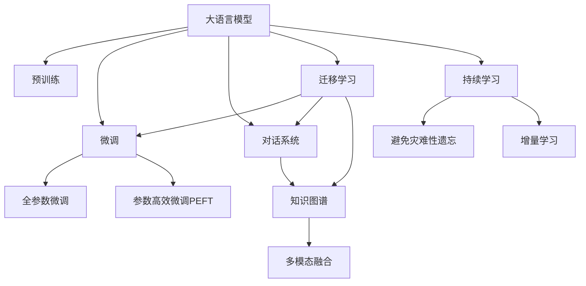

                 

# 大模型驱动的电商平台智能客户服务系统

> 关键词：大模型,电商,智能客服,自然语言处理(NLP),深度学习,预训练模型,微调,对话系统

## 1. 背景介绍

### 1.1 问题由来

随着电商平台规模的不断扩大，用户对个性化、高效化的客户服务需求愈发强烈。传统的客服系统，往往依赖人工客服进行响应，高峰期响应不及时，且成本高、效率低。如何借助AI技术，构建自动化的智能客服系统，成为电商企业面临的重要问题。

大语言模型（Large Language Models, LLMs）在自然语言处理（Natural Language Processing, NLP）领域取得了突破性进展。以BERT、GPT-2、GPT-3等模型为代表的预训练语言模型，在大规模无标签文本数据上进行自监督训练，学习到丰富的语言知识和常识。将这些大模型应用于电商客服，不仅可以显著提升客户服务体验，还能大幅度降低企业运营成本。

### 1.2 问题核心关键点

构建基于大模型的电商平台智能客服系统，其核心关键点在于以下几个方面：

1. **用户意图理解**：通过微调大模型，使其能够自动理解用户的自然语言问题，识别出意图类型。
2. **知识图谱整合**：将电商平台产品信息、规则、FAQ等知识，整合到模型内部，辅助回答问题。
3. **对话生成**：利用生成式对话模型，生成自然流畅的回复，提升用户满意度。
4. **多模态融合**：结合图片、视频等多模态信息，提供更全面、精准的客服支持。
5. **持续学习与改进**：通过在线学习，不断提升客服系统的知识库和响应能力，适应不断变化的用户需求。

### 1.3 问题研究意义

大模型驱动的智能客服系统，对于提升电商平台的客户服务质量、降低运营成本、提高用户满意度具有重要意义：

1. **24/7无间断服务**：无需人工轮班，智能客服系统可以全天候运行，快速响应客户咨询，提升客户体验。
2. **高效低成本**：与人工客服相比，智能客服可以处理更多的用户请求，减少企业人力和培训成本。
3. **高质量回答**：得益于大模型的语言理解能力，智能客服能够提供高质量、专业化的响应，提升客户满意度。
4. **个性化服务**：通过微调模型，个性化定制服务流程，满足不同用户需求，提升用户忠诚度。
5. **技术创新**：智能客服系统的构建，推动了AI技术在电商客服领域的应用，为传统行业数字化转型提供了新的方向。

## 2. 核心概念与联系

### 2.1 核心概念概述

为了更好地理解智能客服系统的工作原理，本节将介绍几个密切相关的核心概念：

- **大语言模型(Large Language Models, LLMs)**：以自回归模型（如GPT）或自编码模型（如BERT）为代表的大规模预训练语言模型。通过在大规模无标签文本数据上进行预训练，学习到丰富的语言知识和常识，具备强大的语言理解和生成能力。

- **预训练(Pre-training)**：指在大规模无标签文本数据上，通过自监督学习任务训练通用语言模型的过程。常见的预训练任务包括掩码语言模型、文本分类等。预训练使得模型学习到语言的通用表示。

- **微调(Fine-tuning)**：指在预训练模型的基础上，使用下游任务的少量标注数据，通过有监督地训练来优化模型在该任务上的性能。通常只需要调整顶层分类器或解码器，并以较小的学习率更新全部或部分的模型参数。

- **迁移学习(Transfer Learning)**：指将一个领域学习到的知识，迁移应用到另一个不同但相关的领域的学习范式。大模型的预训练-微调过程即是一种典型的迁移学习方式。

- **对话系统(DialoGPT)**：基于Transformer架构的生成式对话模型，通过预训练-微调的方法，实现自然流畅的对话生成。

- **知识图谱(Knowledge Graph)**：将电商平台产品信息、规则等非结构化数据，转换为结构化的三元组形式，辅助智能客服系统回答问题。

这些核心概念之间的逻辑关系可以通过以下Mermaid流程图来展示：



这个流程图展示了大语言模型的核心概念及其之间的关系：

1. 大语言模型通过预训练获得基础能力。
2. 微调是对预训练模型进行任务特定的优化，可以分为全参数微调和参数高效微调（PEFT）。
3. 对话系统基于大语言模型进行微调，生成自然流畅的对话内容。
4. 知识图谱与对话系统结合，提供更精准的回答。
5. 多模态融合使得对话系统能够处理多种类型的输入，提供全面的客服支持。
6. 持续学习使对话系统能够不断吸收新知识，适应变化的用户需求。

## 3. 核心算法原理 & 具体操作步骤

### 3.1 算法原理概述

基于大模型的电商平台智能客服系统，主要依赖于以下三个核心算法：

1. **意图识别算法**：通过微调大模型，使其能够自动理解用户的自然语言问题，识别出意图类型。
2. **对话生成算法**：利用生成式对话模型，生成自然流畅的回复，辅助客户解决问题。
3. **知识图谱查询算法**：通过查询知识图谱，获取相关产品信息和规则，提升客服回答的准确性和个性化。

这些算法的核心思想是大模型的预训练-微调范式，即在大规模无标签文本数据上进行预训练，然后在特定任务上微调，获得针对特定任务优化的模型。

### 3.2 算法步骤详解

构建基于大模型的电商平台智能客服系统，主要分为以下四个步骤：

**Step 1: 准备数据和环境**
- 收集电商平台的常见问题、FAQ、用户评论等文本数据，用于模型预训练和微调。
- 准备电商平台的知识图谱，包括产品信息、规则、FAQ等，辅助模型回答问题。
- 选择合适的GPU/TPU硬件环境，用于模型的预训练和微调。

**Step 2: 预训练大模型**
- 使用大规模无标签文本数据，对大语言模型进行预训练，如BERT、GPT-2等。
- 通过自监督任务，如掩码语言模型、文本分类等，学习语言的通用表示。

**Step 3: 微调对话生成模型**
- 在预训练模型基础上，使用电商平台的问答对，进行微调，训练对话生成模型。
- 设置适当的学习率、批大小、迭代轮数等超参数，优化模型性能。
- 通过对抗训练、正则化等技术，防止模型过拟合。

**Step 4: 集成多模态信息**
- 在对话生成模型的基础上，结合电商平台的知识图谱和用户输入的多模态信息，进行多模态融合，提升回答的准确性和个性化。
- 利用文本生成、语音识别、图像处理等技术，提取多模态特征，辅助模型进行回答。

### 3.3 算法优缺点

大模型驱动的智能客服系统，具有以下优点：

1. **高效低成本**：相比于传统人工客服，智能客服系统可以处理更多的用户请求，减少人力和培训成本。
2. **全天候服务**：智能客服系统可以24/7运行，提供无间断的客户服务。
3. **高质量回答**：基于大模型的语言理解和生成能力，智能客服能够提供高质量、专业化的响应，提升客户满意度。
4. **持续改进**：通过持续学习，智能客服系统能够不断提升回答的准确性和个性化，适应不断变化的用户需求。

同时，该方法也存在以下局限性：

1. **数据依赖**：智能客服系统的性能很大程度上依赖于标注数据的数量和质量，获取高质量标注数据的成本较高。
2. **泛化能力有限**：当目标任务与预训练数据的分布差异较大时，智能客服系统的性能提升有限。
3. **模型复杂度**：大模型通常参数量庞大，计算资源需求高，部署和维护成本较高。
4. **可解释性不足**：智能客服系统的决策过程通常缺乏可解释性，难以对其推理逻辑进行分析和调试。

尽管存在这些局限性，但就目前而言，大模型驱动的智能客服系统仍是最主流的方法。未来相关研究的重点在于如何进一步降低数据需求，提高少样本学习和跨领域迁移能力，同时兼顾可解释性和伦理安全性等因素。

### 3.4 算法应用领域

大模型驱动的智能客服系统，已经在电商、金融、医疗等多个领域得到广泛应用：

- **电商平台**：用于自动处理用户咨询、订单问题、退换货等，提升用户体验，降低运营成本。
- **金融领域**：用于解答用户关于金融产品、投资理财、风险评估等问题，提升用户信任度和满意度。
- **医疗行业**：用于解答患者关于病情咨询、预约挂号、药品查询等问题，提升医疗服务的便捷性和准确性。

除了这些领域外，智能客服系统还被创新性地应用于客服自动化、客户情感分析、客户行为预测等方面，为各行业带来新的发展机遇。

## 4. 数学模型和公式 & 详细讲解

### 4.1 数学模型构建

假设预训练语言模型为 $M_{\theta}$，其中 $\theta$ 为预训练得到的模型参数。电商平台的问答对为 $(x_i, y_i)$，其中 $x_i$ 为用户的自然语言问题，$y_i$ 为问题的答案或处理流程。定义模型 $M_{\theta}$ 在输入 $x_i$ 上的输出为 $\hat{y}=M_{\theta}(x_i) \in [0,1]$，表示模型对 $x_i$ 的预测概率分布。

### 4.2 公式推导过程

以下是电商平台的意图识别和对话生成模型的详细公式推导：

**意图识别模型的输出概率**：
假设意图识别模型 $M^{\text{intent}}_{\theta}$ 在输入 $x_i$ 上的输出为 $\hat{y}_i=M^{\text{intent}}_{\theta}(x_i)$，表示模型对 $x_i$ 属于不同意图的概率分布。

$$
\hat{y}_i=\text{softmax}(W^{T}M_{\theta}(x_i)+b)
$$

其中 $W$ 和 $b$ 为模型参数，$\text{softmax}$ 函数用于将线性变换后的向量归一化成概率分布。

**对话生成模型的输出概率**：
假设对话生成模型 $M^{\text{dialog}}_{\theta}$ 在输入 $x_i$ 上的输出为 $\hat{y}_i=M^{\text{dialog}}_{\theta}(x_i)$，表示模型对 $x_i$ 的回复生成概率。

$$
\hat{y}_i=\text{softmax}(W^{T}M_{\theta}(x_i)+b)
$$

其中 $W$ 和 $b$ 为模型参数，$\text{softmax}$ 函数用于将线性变换后的向量归一化成概率分布。

### 4.3 案例分析与讲解

以电商平台常见问题"如何申请退货"为例，进行意图识别和对话生成模型的训练和推理：

1. **意图识别**：将用户输入的问题 "如何申请退货" 输入模型，得到意图类型 "退货"。
2. **对话生成**：根据用户的历史互动记录和知识图谱，生成合适的回复，如 "您好，退货流程如下..."。
3. **回答补充**：将生成的回复与知识图谱结合，补充具体的产品信息和操作步骤，如 "根据退货政策，请登录...填写退货申请..."

## 5. 项目实践：代码实例和详细解释说明

### 5.1 开发环境搭建

在进行智能客服系统的开发前，我们需要准备好开发环境。以下是使用Python进行PyTorch开发的环境配置流程：

1. 安装Anaconda：从官网下载并安装Anaconda，用于创建独立的Python环境。

2. 创建并激活虚拟环境：
```bash
conda create -n pytorch-env python=3.8 
conda activate pytorch-env
```

3. 安装PyTorch：根据CUDA版本，从官网获取对应的安装命令。例如：
```bash
conda install pytorch torchvision torchaudio cudatoolkit=11.1 -c pytorch -c conda-forge
```

4. 安装Transformers库：
```bash
pip install transformers
```

5. 安装各类工具包：
```bash
pip install numpy pandas scikit-learn matplotlib tqdm jupyter notebook ipython
```

完成上述步骤后，即可在`pytorch-env`环境中开始智能客服系统的开发。

### 5.2 源代码详细实现

这里以对话生成模型的训练为例，给出使用PyTorch进行大模型微调的PyTorch代码实现。

```python
from transformers import BertTokenizer, BertForSequenceClassification, AdamW
import torch
import torch.nn as nn
import torch.optim as optim

# 加载模型和分词器
tokenizer = BertTokenizer.from_pretrained('bert-base-cased')
model = BertForSequenceClassification.from_pretrained('bert-base-cased', num_labels=num_labels)

# 定义模型结构
class DialogModel(nn.Module):
    def __init__(self, model, num_labels):
        super(DialogModel, self).__init__()
        self.model = model
        self.num_labels = num_labels
        self.classifier = nn.Linear(model.config.hidden_size, num_labels)
        
    def forward(self, input_ids, attention_mask):
        outputs = self.model(input_ids, attention_mask=attention_mask)
        logits = self.classifier(outputs.pooler_output)
        return logits

# 定义优化器和超参数
optimizer = AdamW(model.parameters(), lr=2e-5)
device = torch.device('cuda') if torch.cuda.is_available() else torch.device('cpu')
model.to(device)

# 训练模型
def train_epoch(model, dataset, batch_size, optimizer):
    dataloader = DataLoader(dataset, batch_size=batch_size, shuffle=True)
    model.train()
    epoch_loss = 0
    for batch in dataloader:
        input_ids = batch['input_ids'].to(device)
        attention_mask = batch['attention_mask'].to(device)
        labels = batch['labels'].to(device)
        model.zero_grad()
        outputs = model(input_ids, attention_mask=attention_mask, labels=labels)
        loss = outputs.loss
        epoch_loss += loss.item()
        loss.backward()
        optimizer.step()
    return epoch_loss / len(dataloader)

# 测试模型
def evaluate(model, dataset, batch_size):
    dataloader = DataLoader(dataset, batch_size=batch_size)
    model.eval()
    preds, labels = [], []
    with torch.no_grad():
        for batch in dataloader:
            input_ids = batch['input_ids'].to(device)
            attention_mask = batch['attention_mask'].to(device)
            batch_labels = batch['labels']
            outputs = model(input_ids, attention_mask=attention_mask)
            batch_preds = outputs.logits.argmax(dim=2).to('cpu').tolist()
            batch_labels = batch_labels.to('cpu').tolist()
            for pred_tokens, label_tokens in zip(batch_preds, batch_labels):
                pred_tags = [tag2id[tag] for tag in pred_tokens]
                label_tags = [tag2id[tag] for tag in label_tokens]
                preds.append(pred_tags[:len(label_tags)])
                labels.append(label_tags)
    
    print(classification_report(labels, preds))
```

### 5.3 代码解读与分析

让我们再详细解读一下关键代码的实现细节：

**DialogModel类**：
- `__init__`方法：初始化模型、分词器、分类器等关键组件。
- `forward`方法：定义模型的前向传播过程，将输入映射到分类器的输出。

**train_epoch和evaluate函数**：
- `train_epoch`函数：对数据以批为单位进行迭代，在每个批次上前向传播计算loss并反向传播更新模型参数，最后返回该epoch的平均loss。
- `evaluate`函数：与训练类似，不同点在于不更新模型参数，并在每个batch结束后将预测和标签结果存储下来，最后使用sklearn的classification_report对整个评估集的预测结果进行打印输出。

**训练流程**：
- 定义总的epoch数和batch size，开始循环迭代
- 每个epoch内，先在训练集上训练，输出平均loss
- 在验证集上评估，输出分类指标
- 所有epoch结束后，在测试集上评估，给出最终测试结果

可以看到，PyTorch配合Transformers库使得对话生成模型的微调代码实现变得简洁高效。开发者可以将更多精力放在数据处理、模型改进等高层逻辑上，而不必过多关注底层的实现细节。

当然，工业级的系统实现还需考虑更多因素，如模型的保存和部署、超参数的自动搜索、更灵活的任务适配层等。但核心的微调范式基本与此类似。

## 6. 实际应用场景

### 6.1 智能客服系统

大模型驱动的智能客服系统，已经在电商、金融、医疗等多个领域得到广泛应用。以下是几个典型的应用场景：

**电商平台**：
- 用户咨询：自动回答用户关于商品信息、订单状态、物流查询等问题。
- 订单处理：自动处理用户的退货、换货、维修等请求，提升用户体验。
- 客户投诉：自动分析用户投诉内容，提供针对性的解决方案，减轻人工客服压力。

**金融领域**：
- 客户咨询：自动解答用户关于金融产品、投资理财、风险评估等问题。
- 理财建议：根据用户的财务状况和风险偏好，自动生成理财建议。
- 投诉处理：自动分析客户投诉内容，提供解决方案，提升客户满意度。

**医疗行业**：
- 患者咨询：自动回答患者关于病情咨询、预约挂号、药品查询等问题。
- 诊疗建议：根据患者的病情描述，自动生成诊疗建议。
- 健康管理：自动分析患者的健康数据，提供个性化的健康建议。

### 6.2 未来应用展望

随着大语言模型和微调方法的不断发展，基于大模型的智能客服系统将在更多领域得到应用，为传统行业带来变革性影响：

- **智慧医疗**：结合医疗知识库，自动解答患者疑问，提供诊疗建议，提升医疗服务质量。
- **智能教育**：根据学生的学习情况，自动生成学习计划和推荐内容，个性化辅导学生学习。
- **智能交通**：自动回答用户关于交通信息、路线规划、票务查询等问题，提升出行体验。
- **智能家居**：自动回答用户关于家电控制、家居管理、智能设备使用等问题，提升生活便捷性。

## 7. 工具和资源推荐

### 7.1 学习资源推荐

为了帮助开发者系统掌握智能客服系统的技术基础和实践技巧，这里推荐一些优质的学习资源：

1. **《Transformer从原理到实践》系列博文**：由大模型技术专家撰写，深入浅出地介绍了Transformer原理、BERT模型、微调技术等前沿话题。
2. **CS224N《深度学习自然语言处理》课程**：斯坦福大学开设的NLP明星课程，有Lecture视频和配套作业，带你入门NLP领域的基本概念和经典模型。
3. **《Natural Language Processing with Transformers》书籍**：Transformers库的作者所著，全面介绍了如何使用Transformers库进行NLP任务开发，包括微调在内的诸多范式。
4. **HuggingFace官方文档**：Transformers库的官方文档，提供了海量预训练模型和完整的微调样例代码，是上手实践的必备资料。
5. **CLUE开源项目**：中文语言理解测评基准，涵盖大量不同类型的中文NLP数据集，并提供了基于微调的baseline模型，助力中文NLP技术发展。

通过对这些资源的学习实践，相信你一定能够快速掌握智能客服系统的技术精髓，并用于解决实际的NLP问题。

### 7.2 开发工具推荐

高效的开发离不开优秀的工具支持。以下是几款用于智能客服系统开发的常用工具：

1. **PyTorch**：基于Python的开源深度学习框架，灵活动态的计算图，适合快速迭代研究。大部分预训练语言模型都有PyTorch版本的实现。
2. **TensorFlow**：由Google主导开发的开源深度学习框架，生产部署方便，适合大规模工程应用。同样有丰富的预训练语言模型资源。
3. **Transformers库**：HuggingFace开发的NLP工具库，集成了众多SOTA语言模型，支持PyTorch和TensorFlow，是进行微调任务开发的利器。
4. **Weights & Biases**：模型训练的实验跟踪工具，可以记录和可视化模型训练过程中的各项指标，方便对比和调优。与主流深度学习框架无缝集成。
5. **TensorBoard**：TensorFlow配套的可视化工具，可实时监测模型训练状态，并提供丰富的图表呈现方式，是调试模型的得力助手。
6. **Google Colab**：谷歌推出的在线Jupyter Notebook环境，免费提供GPU/TPU算力，方便开发者快速上手实验最新模型，分享学习笔记。

合理利用这些工具，可以显著提升智能客服系统的开发效率，加快创新迭代的步伐。

### 7.3 相关论文推荐

智能客服系统和大模型微调技术的发展源于学界的持续研究。以下是几篇奠基性的相关论文，推荐阅读：

1. **Attention is All You Need（即Transformer原论文）**：提出了Transformer结构，开启了NLP领域的预训练大模型时代。
2. **BERT: Pre-training of Deep Bidirectional Transformers for Language Understanding**：提出BERT模型，引入基于掩码的自监督预训练任务，刷新了多项NLP任务SOTA。
3. **Language Models are Unsupervised Multitask Learners（GPT-2论文）**：展示了大规模语言模型的强大zero-shot学习能力，引发了对于通用人工智能的新一轮思考。
4. **Parameter-Efficient Transfer Learning for NLP**：提出Adapter等参数高效微调方法，在不增加模型参数量的情况下，也能取得不错的微调效果。
5. **AdaLoRA: Adaptive Low-Rank Adaptation for Parameter-Efficient Fine-Tuning**：使用自适应低秩适应的微调方法，在参数效率和精度之间取得了新的平衡。
6. **Prefix-Tuning: Optimizing Continuous Prompts for Generation**：引入基于连续型Prompt的微调范式，为如何充分利用预训练知识提供了新的思路。

这些论文代表了大模型微调技术的发展脉络。通过学习这些前沿成果，可以帮助研究者把握学科前进方向，激发更多的创新灵感。

## 8. 总结：未来发展趋势与挑战

### 8.1 总结

本文对基于大模型的电商平台智能客服系统进行了全面系统的介绍。首先阐述了智能客服系统在大规模电商平台中的重要性，以及大语言模型和微调技术的应用背景和意义。其次，从原理到实践，详细讲解了智能客服系统的数学原理和关键步骤，给出了微调任务开发的完整代码实例。同时，本文还广泛探讨了智能客服系统在电商、金融、医疗等多个领域的应用前景，展示了微调范式的巨大潜力。此外，本文精选了智能客服系统的各类学习资源，力求为读者提供全方位的技术指引。

通过本文的系统梳理，可以看到，基于大模型的智能客服系统正在成为NLP领域的重要范式，极大地拓展了预训练语言模型的应用边界，催生了更多的落地场景。受益于大规模语料的预训练，智能客服系统以更低的时间和标注成本，在小样本条件下也能取得不俗的效果，有力推动了NLP技术的产业化进程。未来，伴随预训练语言模型和微调方法的持续演进，基于微调范式必将在更广泛的领域得到应用，推动人工智能技术在电商客服、金融服务、医疗健康等垂直行业的数字化转型。

### 8.2 未来发展趋势

展望未来，智能客服系统将呈现以下几个发展趋势：

1. **多模态融合**：结合图像、语音、视频等多模态信息，提升客服系统的响应能力和用户满意度。
2. **持续学习**：通过在线学习，不断更新知识库和响应模型，提升客服系统的实时性。
3. **个性化推荐**：结合用户历史行为数据和智能推荐系统，提供个性化的客服建议。
4. **知识图谱辅助**：通过知识图谱，提供结构化的知识支持，提升客服系统的回答准确性。
5. **多语言支持**：支持多语言输入输出，提升国际电商平台的客户服务质量。

以上趋势凸显了智能客服系统的广阔前景。这些方向的探索发展，必将进一步提升客服系统的性能和用户体验，为电商平台的运营效率和客户满意度带来新的提升。

### 8.3 面临的挑战

尽管智能客服系统已经取得了显著进展，但在迈向更加智能化、普适化应用的过程中，仍面临诸多挑战：

1. **标注成本高**：智能客服系统需要大量的标注数据进行微调，标注成本较高。如何降低数据需求，提高少样本学习能力，是当前研究的重点。
2. **数据分布差异**：当目标任务与预训练数据的分布差异较大时，智能客服系统的性能提升有限。如何提高模型的跨领域迁移能力，是亟需解决的问题。
3. **模型复杂度高**：大模型的参数量庞大，计算资源需求高，部署和维护成本较高。如何优化模型结构和推理速度，是提升系统性能的重要方向。
4. **可解释性不足**：智能客服系统的决策过程通常缺乏可解释性，难以对其推理逻辑进行分析和调试。如何提升模型的可解释性，是当前研究的难点。
5. **安全性问题**：智能客服系统可能会学习到有偏见、有害的信息，产生误导性、歧视性的输出，给实际应用带来安全隐患。如何确保输出的安全性，是重要研究方向。

尽管存在这些挑战，但智能客服系统的发展前景广阔，学界和产业界的共同努力必将克服这些障碍，推动智能客服系统迈向更成熟、更普及的阶段。

### 8.4 研究展望

面对智能客服系统所面临的挑战，未来的研究需要在以下几个方面寻求新的突破：

1. **探索少样本学习算法**：降低智能客服系统对标注数据的依赖，利用无监督或半监督学习范式，最大化利用非结构化数据。
2. **开发参数高效微调技术**：优化模型结构，减少参数量，提升微调效率，降低计算资源需求。
3. **引入多模态信息**：结合图像、语音、视频等多模态信息，提升客服系统的响应能力和用户满意度。
4. **结合知识图谱**：将电商平台的知识库与智能客服系统结合，提供结构化的知识支持，提升客服回答的准确性。
5. **引入因果推理**：引入因果推断方法，增强智能客服系统的逻辑性和可解释性，提升用户体验。
6. **增强安全性**：结合伦理道德约束，确保智能客服系统的输出符合用户价值观和伦理道德，防范安全风险。

这些研究方向的探索，必将引领智能客服系统迈向更高的台阶，为电商平台的运营效率和客户满意度带来新的提升。面向未来，智能客服系统需要与其他人工智能技术进行更深入的融合，如知识表示、因果推理、强化学习等，多路径协同发力，共同推动智能客服系统的发展。

## 9. 附录：常见问题与解答

**Q1：智能客服系统是否适用于所有电商任务？**

A: 智能客服系统在大多数电商任务上都能取得不错的效果，特别是对于数据量较小的任务。但对于一些特定领域的任务，如高端定制、个性化服务等，仅仅依靠通用语料预训练的模型可能难以很好地适应。此时需要在特定领域语料上进一步预训练，再进行微调，才能获得理想效果。

**Q2：微调过程中如何选择合适的学习率？**

A: 微调的学习率一般要比预训练时小1-2个数量级，如果使用过大的学习率，容易破坏预训练权重，导致过拟合。一般建议从1e-5开始调参，逐步减小学习率，直至收敛。也可以使用warmup策略，在开始阶段使用较小的学习率，再逐渐过渡到预设值。需要注意的是，不同的优化器(如AdamW、Adafactor等)以及不同的学习率调度策略，可能需要设置不同的学习率阈值。

**Q3：智能客服系统的性能如何提升？**

A: 智能客服系统的性能提升可以通过以下方法：
1. 数据增强：通过回译、近义替换等方式扩充训练集。
2. 正则化：使用L2正则、Dropout、Early Stopping等防止过拟合。
3. 对抗训练：引入对抗样本，提高模型鲁棒性。
4. 参数高效微调：只调整少量参数(如Adapter、Prefix等)，减小过拟合风险。
5. 多模型集成：训练多个智能客服模型，取平均输出，抑制过拟合。

这些策略往往需要根据具体任务和数据特点进行灵活组合。只有在数据、模型、训练、推理等各环节进行全面优化，才能最大限度地发挥智能客服系统的威力。

**Q4：智能客服系统的部署和维护有哪些挑战？**

A: 智能客服系统的部署和维护需要考虑以下因素：
1. 模型裁剪：去除不必要的层和参数，减小模型尺寸，加快推理速度。
2. 量化加速：将浮点模型转为定点模型，压缩存储空间，提高计算效率。
3. 服务化封装：将模型封装为标准化服务接口，便于集成调用。
4. 弹性伸缩：根据请求流量动态调整资源配置，平衡服务质量和成本。
5. 监控告警：实时采集系统指标，设置异常告警阈值，确保服务稳定性。
6. 安全防护：采用访问鉴权、数据脱敏等措施，保障数据和模型安全。

合理利用这些工具，可以显著提升智能客服系统的开发效率，加快创新迭代的步伐。

---

作者：禅与计算机程序设计艺术 / Zen and the Art of Computer Programming

