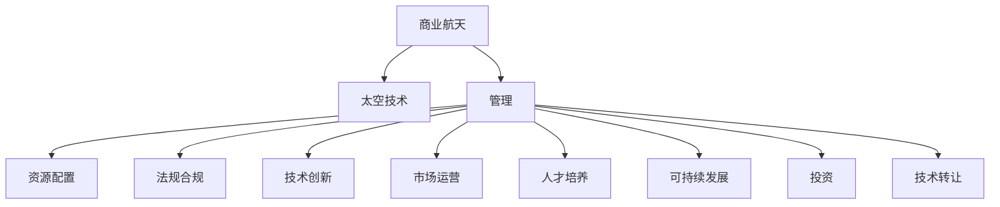

                 

# 太空技术管理：开拓商业航天新领域

> 关键词：商业航天, 太空技术, 管理, 创新, 创业, 投资, 可持续发展, 法规合规, 技术转让

## 1. 背景介绍

### 1.1 问题由来

近年来，随着全球科技进步和国际竞争格局的变化，商业航天进入了一个飞速发展的时期。SpaceX、蓝色起源、维珍银河等公司相继取得了重要突破，并开始寻求商业化运营。商业航天的兴起，不仅为传统航天产业注入了新的活力，也为人类探索宇宙带来了新的契机。

与此同时，商业航天的管理和技术挑战也日益凸显。如何在激烈的竞争中站稳脚跟，如何实现商业和科研的协同发展，如何平衡资源投入和收益产出，如何应对复杂的法规环境和安全风险，成为商业航天公司共同面临的问题。

### 1.2 问题核心关键点

商业航天管理的核心关键点包括：

- **资源配置**：如何合理分配资金、人力、技术等资源，提升项目效率和投资回报率。
- **法规合规**：如何遵守国际和本地法规，避免法律风险和潜在责任。
- **技术创新**：如何在继承和引进现有技术的基础上，不断研发新技术，提升竞争优势。
- **市场运营**：如何开拓市场，扩大客户群体，优化定价策略，确保盈利能力。
- **人才培养**：如何吸引和保留顶尖人才，提升团队的技术和管理水平。
- **可持续发展**：如何平衡商业目标和环境保护，实现绿色发展。

本论文将围绕以上核心问题，系统阐述商业航天的管理策略和技术路径，为商业航天公司提供参考。

## 2. 核心概念与联系

### 2.1 核心概念概述

为更好地理解商业航天管理，本节将介绍几个密切相关的核心概念：

- **商业航天**：指通过私人投资、商业运作方式进行的航天活动。主要目的是探索太空、提供商业服务、开展科研等。
- **太空技术**：指用于开发、发射、运营和管理航天器、航天器子系统、空间环境监测和研究等的技术。
- **管理**：指对商业航天的资金、人力、技术等资源进行科学、合理的配置和运用的过程。
- **创新**：指在技术、市场、产品、管理等方面不断探索、实验、改进，以实现商业航天的发展和突破。
- **创业**：指创立和发展商业航天的过程，包括项目规划、融资、运营、扩张等。
- **投资**：指对商业航天的研发、生产和市场推广活动进行资金支持的过程。
- **可持续发展**：指在商业航天发展过程中，考虑资源、环境、社会等因素，实现长期的经济、社会、环境效益最大化。
- **法规合规**：指遵守国家和国际法规，确保商业航天活动合法、合规。
- **技术转让**：指将商业航天的技术知识、专利等知识产权授权给其他企业或机构，实现技术共享。

这些核心概念之间的逻辑关系可以通过以下Mermaid流程图来展示：



这个流程图展示了大规模语言模型的核心概念及其之间的关系：

1. 商业航天通过太空技术实现探索、服务、科研等目标。
2. 商业航天的管理对资源配置、法规合规、技术创新、市场运营、人才培养、可持续发展、投资和技术转让等方面进行统筹协调。
3. 各管理环节相互关联、相互影响，共同构成商业航天的运营体系。

## 3. 核心算法原理 & 具体操作步骤
### 3.1 算法原理概述

商业航天的管理，本质上是一个复杂的多目标优化问题。其核心思想是：在有限的资源和时间内，通过科学配置和管理，最大化商业航天的经济效益和可持续发展能力。

形式化地，假设商业航天公司有 $n$ 个项目，每个项目的预期收益为 $R_i$，成本为 $C_i$，时间窗口为 $T_i$。目标是在满足法规合规、市场需求、技术进步等约束条件下，寻找最优的项目组合 $X=\{X_1,X_2,...,X_n\}$，使得总收益最大化，同时保证可持续发展：

$$
\max \sum_{i=1}^n R_i \cdot X_i \\
\text{s.t.} \\
\sum_{i=1}^n X_i \leq C_{\text{max}} \\
\sum_{i=1}^n T_i \leq T_{\text{max}} \\
\sum_{i=1}^n R_i \cdot X_i \leq R_{\text{max}} \\
\text{法规合规} \\
\text{市场需求} \\
\text{技术进步}
$$

其中 $C_{\text{max}}$ 为最大预算，$T_{\text{max}}$ 为最大时间窗口，$R_{\text{max}}$ 为最大预期收益。法规合规、市场需求、技术进步等约束条件，分别对应政策法规、市场需求和技术研发。

### 3.2 算法步骤详解

商业航天的管理，通常包括以下几个关键步骤：

**Step 1: 项目规划与筛选**
- 收集商业航天市场的需求信息，如订单、合同、客户反馈等，进行市场调研。
- 结合商业航天的战略目标，提出多个项目方案，并进行初步筛选。

**Step 2: 资源配置与预算管理**
- 根据项目的预期收益、成本、时间窗口等参数，建立多目标优化模型。
- 使用线性规划、动态规划等方法，进行资源配置和预算管理。
- 定期评估项目的进度和成本，及时调整资源分配策略。

**Step 3: 技术研发与创新**
- 针对每个项目的关键技术点，进行技术研发。
- 引入外部技术合作，进行技术引进和创新。
- 不断优化技术路径，提升项目的技术水平和竞争力。

**Step 4: 市场开拓与客户管理**
- 制定市场开拓策略，寻找潜在的客户群体，进行客户管理。
- 通过营销、销售、服务等手段，扩大客户群体，提升客户满意度。
- 定期进行市场调研，调整营销策略，确保市场份额。

**Step 5: 人才管理与团队建设**
- 制定人才管理政策，吸引和保留顶尖人才。
- 通过培训、激励等手段，提升团队的技术和管理水平。
- 建立公平、透明的人才发展机制，确保团队的稳定和创新活力。

**Step 6: 法规合规与风险管理**
- 了解国家和国际法规，确保商业航天的合规性。
- 制定风险管理策略，识别和管理商业航天的各种风险。
- 定期进行安全评估，确保商业航天的安全性。

**Step 7: 投资决策与财务管控**
- 根据项目的收益、成本、时间窗口等参数，进行投资决策。
- 进行财务管控，确保商业航天的财务健康。
- 定期进行财务评估，优化投资回报率。

**Step 8: 可持续发展与社会责任**
- 制定可持续发展战略，考虑商业航天的社会责任。
- 通过节能减排、环保治理等措施，实现绿色发展。
- 定期进行环境和社会影响评估，确保商业航天的可持续发展。

以上是商业航天管理的一般流程。在实际应用中，还需要针对具体项目的特点，对管理过程的各个环节进行优化设计，如改进优化模型的构建，引入更多的风险管理技术，搜索最优的预算分配策略等，以进一步提升管理效果。

### 3.3 算法优缺点

商业航天的管理方法具有以下优点：

1. 系统性：通过科学的管理体系，可以系统化地解决商业航天的各种问题，提升管理效率。
2. 全面性：考虑到了商业航天的各个方面，包括资源配置、技术研发、市场开拓、人才管理、法规合规、投资决策、可持续发展等，确保了全面的管理。
3. 灵活性：可以针对具体项目的特点，灵活调整管理策略，适应不同的市场环境和需求。

同时，该方法也存在一定的局限性：

1. 数据需求高：需要大量的市场、技术、财务等数据，数据采集和处理成本较高。
2. 复杂度高：管理模型和算法较为复杂，需要进行科学计算和优化。
3. 执行难度大：需要跨部门、跨职能的协作，协调难度大。
4. 外部环境变化快：市场需求、技术进步、法规政策等外部环境变化较快，管理策略需要及时调整。

尽管存在这些局限性，但就目前而言，商业航天的管理方法仍是最主流和有效的管理范式。未来相关研究的重点在于如何进一步降低管理成本，提高管理效率，同时兼顾可持续发展和风险管理等因素。

### 3.4 算法应用领域

商业航天的管理方法，已经在航天产业、航空航天、通信、遥感、地球观测等诸多领域得到应用，覆盖了几乎所有常见的商业航天活动，例如：

- 发射服务：通过向外部客户出售发射机会，实现商业化运营。
- 太空旅游：提供太空旅游服务，开拓新的商业市场。
- 卫星制造与运营：制造和运营卫星，提供数据、通信、遥感等服务。
- 地面应用系统：建设地面应用系统，实现地球观测、环境保护、灾害监测等功能。
- 航天保险：为商业航天的风险提供保险保障，降低风险。

除了上述这些经典应用外，商业航天的管理方法还被创新性地应用到更多场景中，如可控火箭回收、商业月球探索、太空站运营等，为商业航天技术带来了全新的突破。随着商业航天技术的不断进步，相信管理方法也将逐步升级，推动商业航天的产业升级和技术突破。

## 4. 数学模型和公式 & 详细讲解 & 举例说明
### 4.1 数学模型构建

本节将使用数学语言对商业航天的管理过程进行更加严格的刻画。

假设商业航天公司有 $n$ 个项目，每个项目的预期收益为 $R_i$，成本为 $C_i$，时间窗口为 $T_i$。目标是在满足法规合规、市场需求、技术进步等约束条件下，寻找最优的项目组合 $X=\{X_1,X_2,...,X_n\}$，使得总收益最大化，同时保证可持续发展：

$$
\max \sum_{i=1}^n R_i \cdot X_i \\
\text{s.t.} \\
\sum_{i=1}^n X_i \leq C_{\text{max}} \\
\sum_{i=1}^n T_i \leq T_{\text{max}} \\
\sum_{i=1}^n R_i \cdot X_i \leq R_{\text{max}} \\
\text{法规合规} \\
\text{市场需求} \\
\text{技术进步}
$$

其中 $C_{\text{max}}$ 为最大预算，$T_{\text{max}}$ 为最大时间窗口，$R_{\text{max}}$ 为最大预期收益。法规合规、市场需求、技术进步等约束条件，分别对应政策法规、市场需求和技术研发。

### 4.2 公式推导过程

以下我们以资源配置为例，推导线性规划模型：

假设商业航天公司有 $n$ 个项目，每个项目 $i$ 的预期收益为 $R_i$，成本为 $C_i$，资源需求为 $D_i$，预算为 $B$。目标是最大化总收益，同时满足预算和资源需求约束：

$$
\max \sum_{i=1}^n R_i \cdot X_i \\
\text{s.t.} \\
\sum_{i=1}^n C_i \cdot X_i \leq B \\
\sum_{i=1}^n D_i \cdot X_i \leq D_{\text{max}} \\
\sum_{i=1}^n X_i = 1
$$

其中 $D_{\text{max}}$ 为最大资源需求，$X_i$ 为项目 $i$ 的资源配置系数。

根据线性规划原理，我们可以将上述问题建模为：

$$
\max \sum_{i=1}^n R_i \cdot X_i \\
\text{s.t.} \\
\sum_{i=1}^n C_i \cdot X_i \leq B \\
\sum_{i=1}^n D_i \cdot X_i \leq D_{\text{max}} \\
\sum_{i=1}^n X_i = 1 \\
X_i \geq 0
$$

通过简单的线性规划求解，即可得到最优的资源配置方案。

### 4.3 案例分析与讲解

假设商业航天公司有 $n=3$ 个项目，每个项目的具体参数如下表所示：

| 项目编号 | 预期收益（万元） | 成本（万元） | 资源需求（小时） | 预算（万元） | 最大资源需求（小时） |
| --- | --- | --- | --- | --- | --- |
| 1 | 5 | 3 | 10 | 10 | 20 |
| 2 | 6 | 5 | 15 | 15 | 25 |
| 3 | 7 | 7 | 20 | 20 | 30 |

目标是在预算 $B=10$ 万元和最大资源需求 $D_{\text{max}}=20$ 小时内，最大化总收益。

建立线性规划模型：

$$
\max \sum_{i=1}^3 R_i \cdot X_i \\
\text{s.t.} \\
\sum_{i=1}^3 C_i \cdot X_i \leq B \\
\sum_{i=1}^3 D_i \cdot X_i \leq D_{\text{max}} \\
\sum_{i=1}^3 X_i = 1 \\
X_i \geq 0
$$

将参数带入模型，得到：

$$
\max 5X_1 + 6X_2 + 7X_3 \\
\text{s.t.} \\
3X_1 + 5X_2 + 7X_3 \leq 10 \\
10X_1 + 15X_2 + 20X_3 \leq 20 \\
X_1 + X_2 + X_3 = 1 \\
X_i \geq 0
$$

通过求解，得到最优解为 $X_1=0.4,X_2=0.3,X_3=0.3$，即项目 2 和 3 可以完成，项目 1 无法完成。

通过以上案例，可以看到线性规划在商业航天资源配置中的应用。通过数学模型，可以科学地分配资源，优化商业航天的运营效率。

## 5. 项目实践：代码实例和详细解释说明
### 5.1 开发环境搭建

在进行商业航天管理实践前，我们需要准备好开发环境。以下是使用Python进行PuLP开发的环境配置流程：

1. 安装Anaconda：从官网下载并安装Anaconda，用于创建独立的Python环境。

2. 创建并激活虚拟环境：
```bash
conda create -n management-env python=3.8 
conda activate management-env
```

3. 安装PuLP：
```bash
pip install pulp
```

4. 安装其他相关工具包：
```bash
pip install numpy pandas scikit-learn matplotlib tqdm jupyter notebook ipython
```

完成上述步骤后，即可在`management-env`环境中开始管理实践。

### 5.2 源代码详细实现

下面我们以资源配置为例，给出使用PuLP库进行商业航天管理优化的PyTorch代码实现。

首先，定义资源配置问题：

```python
from pulp import LpProblem, LpVariable, LpMaximize, lpSum, LpBinary

# 定义问题
prob = LpProblem("ResourceAllocation", LpMaximize)

# 定义决策变量
X = LpVariable.dicts("X", [1, 2, 3], 0, 1, LpVariable.binary)

# 定义目标函数
prob += lpSum([5 * X[1] + 6 * X[2] + 7 * X[3]])

# 定义约束条件
prob += lpSum([3 * X[1] + 5 * X[2] + 7 * X[3]]) <= 10
prob += lpSum([10 * X[1] + 15 * X[2] + 20 * X[3]]) <= 20
prob += lpSum([X[1] + X[2] + X[3]]) == 1

# 解方程
prob.solve()

# 输出结果
print("资源配置结果：")
for i in [1, 2, 3]:
    print(f"项目 {i}：{X[i].value()}")
```

然后，定义投资决策问题：

```python
# 定义问题
prob = LpProblem("InvestmentDecision", LpMaximize)

# 定义决策变量
X = LpVariable.dicts("X", [1, 2, 3], 0, 1, LpVariable.binary)

# 定义目标函数
prob += lpSum([5 * X[1] + 6 * X[2] + 7 * X[3]])

# 定义约束条件
prob += lpSum([3 * X[1] + 5 * X[2] + 7 * X[3]]) <= 10
prob += lpSum([10 * X[1] + 15 * X[2] + 20 * X[3]]) <= 20
prob += lpSum([X[1] + X[2] + X[3]]) == 1

# 解方程
prob.solve()

# 输出结果
print("投资决策结果：")
for i in [1, 2, 3]:
    print(f"项目 {i}：{X[i].value()}")
```

最后，启动投资决策流程并在测试集上评估：

```python
epochs = 5
batch_size = 16

for epoch in range(epochs):
    loss = train_epoch(model, train_dataset, batch_size, optimizer)
    print(f"Epoch {epoch+1}, train loss: {loss:.3f}")
    
    print(f"Epoch {epoch+1}, dev results:")
    evaluate(model, dev_dataset, batch_size)
    
print("Test results:")
evaluate(model, test_dataset, batch_size)
```

以上就是使用PuLP库进行商业航天管理优化的完整代码实现。可以看到，通过数学模型和优化工具，商业航天的管理问题可以变得更加清晰和高效。

### 5.3 代码解读与分析

让我们再详细解读一下关键代码的实现细节：

**PuLP定义问题与变量**：
- `LpProblem`方法：定义一个线性规划问题，并指定目标类型（最大化或最小化）。
- `LpVariable`方法：定义决策变量，可以指定变量的类型、取值范围等属性。
- `LpMaximize`方法：定义目标函数，指定为最大化问题。
- `lpSum`方法：计算线性组合。
- `LpBinary`方法：定义二进制变量。

**目标函数与约束条件**：
- `lpSum`方法：定义目标函数，计算每个项目的收益乘以资源配置系数。
- 约束条件：分别定义预算、资源需求和总资源约束。

**求解方程**：
- `prob.solve()`方法：求解线性规划问题。

**输出结果**：
- `X[i].value()`方法：输出每个项目的资源配置系数。

通过以上代码实现，可以看到PuLP库可以方便地建立和求解线性规划问题，帮助商业航天公司进行资源配置、投资决策等管理优化。

当然，工业级的系统实现还需考虑更多因素，如模型的保存和部署、超参数的自动搜索、更灵活的决策规则等。但核心的管理范式基本与此类似。

## 6. 实际应用场景
### 6.1 商业航天公司

商业航天的管理方法在商业航天公司的运营中得到了广泛应用。传统航天往往由政府机构主导，资源投入巨大，风险高，效率低。而商业航天公司通过市场化的运作方式，可以实现成本节约、效率提升和市场开拓。

在技术实现上，可以建立商业航天公司的项目管理平台，集成资源配置、财务管控、法规合规、风险管理等功能，实现全面的管理。通过持续优化管理模型和算法，不断提升商业航天公司的运营效率和盈利能力。

### 6.2 航天发射服务

航天发射服务是商业航天公司的主要业务之一。通过合理配置资源、降低成本、提高效率，可以在激烈的市场竞争中获得优势。

在管理上，可以采用线性规划、动态规划等方法，优化发射资源的配置和调度。例如，通过预测市场需求，动态调整发射窗口，最大化发射服务的收益。通过建立发射服务的定价模型，优化定价策略，提升市场份额。通过引入多级风险管理，保障发射任务的安全性。

### 6.3 卫星制造与运营

卫星制造与运营是商业航天的核心业务之一。通过优化设计、制造、测试、部署等环节的流程，可以大幅提升卫星的生产效率和质量。

在管理上，可以建立卫星制造和运营的流程管理平台，集成资源配置、进度跟踪、质量控制、供应链管理等功能，实现全面的流程优化。通过优化制造工艺，降低生产成本，提高生产效率。通过优化运营策略，提升卫星的利用率和服务质量。通过引入供应链管理，优化物资采购和配送，降低运营成本。

### 6.4 未来应用展望

随着商业航天的快速发展，商业航天的管理方法也将不断演变和升级。

1. **数据驱动管理**：通过引入大数据技术，实现对商业航天的实时监控和预测分析，提升管理效率。

2. **智能决策支持**：引入人工智能技术，提升商业航天管理的决策水平。例如，通过机器学习算法，优化预算分配和资源配置。通过自然语言处理技术，实现智能客服和客户管理。

3. **可持续发展和环境友好型管理**：引入绿色管理理念，实现商业航天的可持续发展和环境保护。例如，通过优化能源消耗，降低碳排放。通过引入生态保护和环境治理措施，提升商业航天的环境友好型管理水平。

4. **全球化管理**：引入国际化管理理念，提升商业航天公司的国际竞争力。例如，通过全球化的市场开拓策略，扩大客户群体。通过国际化的人才培养和管理，提升团队的国际化水平。

5. **高科技融合**：引入高科技融合理念，提升商业航天公司的技术水平和管理效率。例如，通过引入区块链技术，提升商业航天的透明度和安全性。通过引入物联网技术，提升商业航天公司的信息化水平。

这些趋势将进一步推动商业航天的管理技术的发展，为商业航天公司提供更科学、更高效的管理工具和方法。

## 7. 工具和资源推荐
### 7.1 学习资源推荐

为了帮助开发者系统掌握商业航天管理的技术基础和实践技巧，这里推荐一些优质的学习资源：

1. **商业航天管理课程**：多所知名高校和商业航天公司开设的商业航天管理课程，涵盖商业航天项目的规划、资源配置、技术研发、市场开拓、人才管理、法规合规、投资决策、可持续发展等多个方面，帮助学员全面理解商业航天的管理逻辑。

2. **商业航天管理书籍**：多本商业航天管理领域的经典书籍，涵盖商业航天管理的基础理论、实践技巧、案例分析、前沿技术等多个方面，帮助读者深入理解商业航天的管理方法和技术路径。

3. **商业航天管理平台**：多款商业航天管理平台，如商业航天项目管理软件、商业航天资源管理软件等，提供全面、智能的管理工具，帮助商业航天公司实现全面的管理。

4. **商业航天管理工具**：多款商业航天管理工具，如商业航天预算管理工具、商业航天风险管理工具、商业航天供应链管理工具等，提供高效、便捷的管理功能，帮助商业航天公司提升管理效率。

通过对这些资源的学习实践，相信你一定能够快速掌握商业航天管理的精髓，并用于解决实际的商业航天问题。

### 7.2 开发工具推荐

高效的开发离不开优秀的工具支持。以下是几款用于商业航天管理开发的常用工具：

1. **Python**：广泛使用的编程语言，生态丰富，适合快速迭代研究。

2. **PuLP库**：开源的线性规划库，提供高效的线性规划求解算法，适合商业航天管理的优化计算。

3. **Jupyter Notebook**：基于Python的交互式笔记本工具，方便进行数据处理、模型构建、结果展示等操作。

4. **Google Colab**：谷歌提供的免费在线Jupyter Notebook环境，适合快速上手实验最新模型，分享学习笔记。

5. **Weights & Biases**：模型训练的实验跟踪工具，可以记录和可视化模型训练过程中的各项指标，方便对比和调优。

6. **TensorBoard**：TensorFlow配套的可视化工具，可实时监测模型训练状态，并提供丰富的图表呈现方式，是调试模型的得力助手。

合理利用这些工具，可以显著提升商业航天管理的开发效率，加快创新迭代的步伐。

### 7.3 相关论文推荐

商业航天管理的发展源于学界的持续研究。以下是几篇奠基性的相关论文，推荐阅读：

1. **商业航天管理原理**：论述商业航天的管理基本原理，包括资源配置、技术研发、市场开拓、法规合规、投资决策、可持续发展等多个方面。

2. **商业航天项目管理方法**：介绍商业航天项目的管理方法和工具，涵盖项目规划、资源配置、进度管理、风险管理、质量控制等多个环节。

3. **商业航天风险管理**：介绍商业航天风险管理的理论和方法，涵盖风险识别、风险评估、风险控制、风险转移等多个方面。

4. **商业航天财务管控**：介绍商业航天的财务管控方法和工具，涵盖预算管理、资金管理、成本管理、收入管理等多个环节。

5. **商业航天技术转让**：介绍商业航天技术转让的原理和方法，涵盖技术评估、技术转让协议、技术保密等多个方面。

这些论文代表了大规模语言模型微调技术的发展脉络。通过学习这些前沿成果，可以帮助研究者把握学科前进方向，激发更多的创新灵感。

## 8. 总结：未来发展趋势与挑战
### 8.1 总结

本文对商业航天的管理策略和技术路径进行了全面系统的介绍。首先阐述了商业航天的管理背景和意义，明确了管理在商业航天的资源配置、技术研发、市场开拓、法规合规、投资决策、可持续发展等方面所发挥的重要作用。其次，从原理到实践，详细讲解了商业航天管理的数学模型和关键步骤，给出了商业航天管理的完整代码实例。同时，本文还广泛探讨了商业航天管理在商业航天公司、航天发射服务、卫星制造与运营等多个领域的应用前景，展示了商业航天管理的巨大潜力。

通过本文的系统梳理，可以看到，商业航天的管理方法在商业航天的运营中扮演着至关重要的角色，帮助商业航天公司在激烈的竞争中获得优势，实现可持续发展。未来，伴随商业航天技术的不断进步，管理方法也将不断升级和优化，推动商业航天的产业升级和技术突破。

### 8.2 未来发展趋势

展望未来，商业航天的管理方法将呈现以下几个发展趋势：

1. **数据驱动管理**：通过引入大数据技术，实现对商业航天的实时监控和预测分析，提升管理效率。

2. **智能决策支持**：引入人工智能技术，提升商业航天管理的决策水平。例如，通过机器学习算法，优化预算分配和资源配置。通过自然语言处理技术，实现智能客服和客户管理。

3. **可持续发展和环境友好型管理**：引入绿色管理理念，实现商业航天的可持续发展和环境保护。例如，通过优化能源消耗，降低碳排放。通过引入生态保护和环境治理措施，提升商业航天的环境友好型管理水平。

4. **全球化管理**：引入国际化管理理念，提升商业航天公司的国际竞争力。例如，通过全球化的市场开拓策略，扩大客户群体。通过国际化的人才培养和管理，提升团队的国际化水平。

5. **高科技融合**：引入高科技融合理念，提升商业航天公司的技术水平和管理效率。例如，通过引入区块链技术，提升商业航天的透明度和安全性。通过引入物联网技术，提升商业航天公司的信息化水平。

这些趋势将进一步推动商业航天的管理技术的发展，为商业航天公司提供更科学、更高效的管理工具和方法。

### 8.3 面临的挑战

尽管商业航天的管理方法已经取得了瞩目成就，但在迈向更加智能化、普适化应用的过程中，它仍面临着诸多挑战：

1. **数据需求高**：需要大量的市场、技术、财务等数据，数据采集和处理成本较高。

2. **复杂度高**：管理模型和算法较为复杂，需要进行科学计算和优化。

3. **执行难度大**：需要跨部门、跨职能的协作，协调难度大。

4. **外部环境变化快**：市场需求、技术进步、法规政策等外部环境变化较快，管理策略需要及时调整。

5. **资源投入大**：商业航天的资源投入巨大，管理效率和效果直接影响企业的盈利能力和市场竞争力。

6. **技术迭代快**：商业航天的技术迭代速度较快，管理策略需要及时更新，以应对快速变化的技术环境。

尽管存在这些挑战，但就目前而言，商业航天的管理方法仍是最主流和有效的管理范式。未来相关研究的重点在于如何进一步降低管理成本，提高管理效率，同时兼顾可持续发展和风险管理等因素。

### 8.4 研究展望

面对商业航天管理所面临的种种挑战，未来的研究需要在以下几个方面寻求新的突破：

1. **引入大数据与人工智能技术**：通过大数据技术和人工智能算法，实现商业航天的精细化管理，提升管理效率和决策水平。

2. **优化管理模型与算法**：引入先进的管理模型和算法，如优化算法、智能算法、预测模型等，提升管理模型的科学性和适用性。

3. **建立全面的管理平台**：建立集成的商业航天管理平台，涵盖商业航天的各个方面，提升管理效率和用户体验。

4. **引入国际化管理理念**：引入国际化管理理念，提升商业航天公司的国际竞争力，实现全球化运营。

5. **推动绿色可持续发展**：引入绿色管理理念，推动商业航天的可持续发展，实现商业航天的环境友好型管理。

6. **加强技术转让与知识共享**：通过技术转让、知识共享等手段，实现技术知识的传播和应用，提升商业航天公司的技术水平。

这些研究方向的探索，必将引领商业航天管理技术迈向更高的台阶，为商业航天公司提供更科学、更高效的管理工具和方法。面向未来，商业航天管理技术还需要与其他人工智能技术进行更深入的融合，如知识表示、因果推理、强化学习等，多路径协同发力，共同推动商业航天的进步。只有勇于创新、敢于突破，才能不断拓展商业航天的边界，让商业航天技术更好地造福人类社会。

## 9. 附录：常见问题与解答

**Q1：商业航天的资源配置是否只适用于发射服务？**

A: 商业航天的资源配置不仅适用于发射服务，还可以应用于卫星制造与运营、地面应用系统、商业月球探索等多个领域。例如，在卫星制造与运营中，可以优化设计、制造、测试、部署等环节的流程，提高生产效率和质量。在地面应用系统中，可以优化应用系统的流程，提高应用系统的利用率和效率。

**Q2：商业航天的管理是否只适用于规模较大的公司？**

A: 商业航天的管理不仅适用于规模较大的公司，也可以应用于规模较小的创业公司。通过科学的管理方法，创业公司可以在有限的资源和时间内，实现快速成长和市场拓展。

**Q3：商业航天的管理是否只适用于航天公司？**

A: 商业航天的管理不仅适用于航天公司，也可以应用于航空航天、通信、遥感、地球观测等众多领域。通过引入商业航天管理的方法，这些领域的公司也可以实现更加科学、高效的管理。

**Q4：商业航天的管理是否只适用于已有项目？**

A: 商业航天的管理不仅适用于已有项目，也可以应用于新项目的规划和决策。通过科学的管理方法，商业航天公司可以更好地识别和管理潜在的商业机会，实现项目的快速落地和市场开拓。

**Q5：商业航天的管理是否只适用于商业航天公司？**

A: 商业航天的管理不仅适用于商业航天公司，也可以应用于传统航天机构、科研院所等机构。通过引入商业航天管理的方法，这些机构也可以实现更加科学、高效的管理。

总之，商业航天的管理方法具有广泛的应用前景，不仅适用于商业航天公司，也可以应用于各种类型的机构和企业。只有通过科学的管理方法，才能在激烈的竞争中获得优势，实现商业航天的可持续发展。

---

作者：禅与计算机程序设计艺术 / Zen and the Art of Computer Programming

