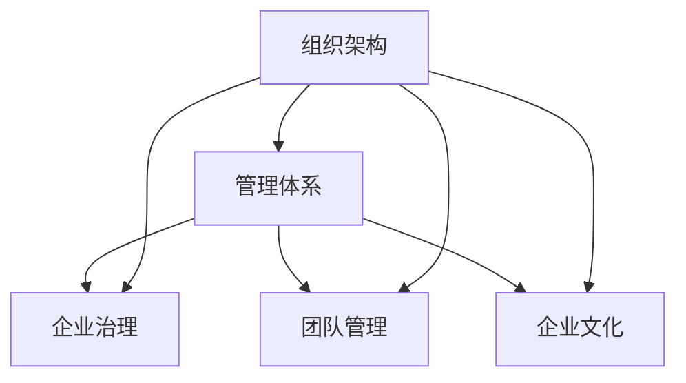

                 

# 好的管理者和普通管理者的差距：体系的重要性

> 关键词：组织架构,管理体系,企业治理,团队管理,企业文化

## 1. 背景介绍

在快速变化和不确定性增加的商业环境中，管理者的角色变得越来越重要。但并非所有管理者都能有效地领导团队、驱动创新、实现目标。实际上，有许多因素可以决定一个管理者是否优秀。在这篇文章中，我们将探讨一个好的管理者和普通管理者的主要区别，特别是管理体系的重要性。

### 1.1 管理者的重要性

在任何组织中，管理者都是不可或缺的一部分。他们负责设定目标、规划战略、分配资源、激励员工、解决冲突以及实施变革。一个好的管理者可以激发团队潜力，提高生产力，增强组织适应能力，推动企业成长。而普通管理者则可能无法有效地完成这些任务，导致组织绩效低下，甚至停滞不前。

### 1.2 管理者的角色和责任

管理者在组织中承担着多重角色，包括但不限于：

- **战略规划者**：制定和实施组织战略，确保组织目标的实现。
- **资源分配者**：合理分配资源，确保资源的有效利用。
- **决策制定者**：在复杂情况下做出有效决策，确保组织的可持续发展。
- **团队激励者**：激发员工潜力，提升团队士气和生产力。
- **变革推动者**：引导组织适应变化，推动持续改进和创新。

## 2. 核心概念与联系

### 2.1 核心概念概述

为了更好地理解好的管理者和普通管理者的差距，我们需要了解一些核心概念：

- **组织架构**：指企业内部的结构布局，包括管理层级、部门划分、职责分工等。
- **管理体系**：指管理活动的管理方式、流程和工具，涉及决策、沟通、激励等方面。
- **企业治理**：指企业如何确保高效、透明、合规的运营，包括董事会、股东、管理层等层面的关系和机制。
- **团队管理**：指如何组建、领导和管理一个高效、协作的团队，确保成员间的沟通与协作。
- **企业文化**：指组织成员共同遵守的价值观、行为准则和工作方式，影响组织凝聚力和创新能力。

### 2.2 核心概念原理和架构的 Mermaid 流程图



这个流程图展示了核心概念之间的联系：组织架构是基础，管理体系是核心，企业治理和团队管理是支撑，企业文化是土壤。一个良好的管理体系能够确保组织架构的合理性、企业治理的透明性、团队管理的有效性以及企业文化的健康性，从而形成一个良性循环。

## 3. 核心算法原理 & 具体操作步骤

### 3.1 算法原理概述

一个好的管理体系可以显著提升组织绩效和管理者的有效性。它的关键在于以下几个方面：

- **系统化管理**：通过明确的管理流程和标准，确保管理活动的连续性和一致性。
- **数据驱动决策**：利用数据和分析工具，做出科学合理的决策。
- **全面沟通**：确保信息在组织内部流畅传递，促进团队协作和决策一致性。
- **绩效评估与激励**：建立科学、公正的绩效评估机制，激发员工的积极性和创造力。

### 3.2 算法步骤详解

下面是基于上述原理的具体操作步骤：

1. **确立管理架构**：明确组织的目标、部门划分、职责分工等。
2. **制定管理流程**：设计明确的管理流程和标准，确保活动的连续性和一致性。
3. **实施数据管理**：建立数据收集、存储、分析和利用的机制，支持科学决策。
4. **促进全面沟通**：利用沟通工具和平台，确保信息流畅传递，增强团队协作。
5. **建立绩效评估体系**：设定科学的绩效评估标准和方法，激励员工绩效。
6. **持续改进与创新**：定期评估管理体系的效果，根据反馈进行优化和创新。

### 3.3 算法优缺点

一个好的管理体系具有以下优点：

- **提升效率**：通过系统化管理，减少冗余和浪费，提高管理效率。
- **增强一致性**：明确的管理流程和标准，确保所有管理活动的一致性和连续性。
- **促进透明度**：数据驱动决策和全面沟通，提高管理活动的透明度。
- **激发创新**：科学绩效评估和持续改进，激发员工的创新潜力和积极性。

然而，它也存在一些缺点：

- **成本高**：建立和维护一个完善的体系需要大量资源和投入。
- **复杂性高**：需要专业知识和管理技能，实施和维护较为复杂。
- **灵活性不足**：一旦体系建立，修改和调整可能需要较长时间。

### 3.4 算法应用领域

一个好的管理体系适用于各种类型的组织，包括但不限于：

- **大型企业**：复杂的组织结构需要严格的管理体系来确保高效运营。
- **初创公司**：虽然规模小，但需要明确的流程和标准来确保快速发展和规范运作。
- **跨国公司**：不同国家的文化和法规要求不同的管理体系，需要灵活调整。
- **非营利组织**：需要透明和有效的管理来保证资金使用和项目实施。
- **政府机构**：需要高效的治理和透明的决策来服务公众。

## 4. 数学模型和公式 & 详细讲解 & 举例说明

### 4.1 数学模型构建

为了更好地理解管理体系的科学性，我们可以构建一个简单的数学模型。假设一个企业有n个部门，每个部门有m个员工，其生产效率可以用以下公式表示：

$$
\text{生产效率} = \sum_{i=1}^n \sum_{j=1}^m \text{员工i,j的效率} \times \text{员工i,j的贡献}
$$

其中，员工效率和贡献受到多种因素的影响，包括教育背景、工作经验、技能水平、激励措施等。

### 4.2 公式推导过程

通过上述模型，我们可以推导出以下公式：

$$
\frac{\partial \text{生产效率}}{\partial \text{员工i,j的效率}} = \text{员工i,j的贡献}
$$

这意味着，提高员工效率可以直接提高生产效率。通过科学的管理体系，我们可以最大化员工效率，从而最大化生产效率。

### 4.3 案例分析与讲解

考虑一家大型制造企业，其生产效率可以用上述模型表示。通过科学的管理体系，企业可以确保每个员工的工作高效、有序、一致，从而提升整体生产效率。例如，建立明确的生产流程和质量标准，利用数据监控和分析工具，定期进行绩效评估和员工培训，可以显著提高生产效率。

## 5. 项目实践：代码实例和详细解释说明

### 5.1 开发环境搭建

为了实践管理体系，我们需要搭建相应的开发环境。以下是使用Python进行开发的环境配置流程：

1. 安装Python：从官网下载并安装Python，确保版本最新。
2. 安装相关库：使用pip安装管理相关的Python库，如Pandas、NumPy、Matplotlib等。
3. 设置开发环境：配置开发工具，如PyCharm或Jupyter Notebook。
4. 数据准备：收集和整理组织的数据，包括员工信息、部门信息、生产数据等。

### 5.2 源代码详细实现

下面是一个简化的代码示例，用于模拟管理系统的数据处理和分析：

```python
import pandas as pd
import numpy as np
import matplotlib.pyplot as plt

# 数据准备
data = pd.read_csv('employee_data.csv')

# 数据处理
department = data.groupby('department')['efficiency'].mean()
plt.bar(department, department)
plt.title('Average Efficiency by Department')
plt.show()

# 数据分析
efficiency = data['efficiency']
contributions = data['contributions']
total_efficiency = efficiency * contributions
plt.hist(total_efficiency, bins=20)
plt.title('Total Efficiency Distribution')
plt.show()
```

### 5.3 代码解读与分析

上述代码展示了如何通过数据处理和分析，来评估组织中的生产效率和员工贡献。首先，利用Pandas库对员工数据进行分组和计算平均效率。然后，通过NumPy库进行数据处理和分析，可视化生产效率的分布。

## 6. 实际应用场景

### 6.1 制造业

在制造业中，一个好的管理体系可以显著提升生产效率和产品质量。例如，通过建立标准化的生产流程和质量标准，利用数据监控和分析工具，定期进行绩效评估和员工培训，可以显著提高生产效率。

### 6.2 零售业

在零售业中，一个好的管理体系可以优化库存管理、提高销售效率、增强客户体验。例如，利用数据和分析工具，建立科学的库存管理系统和销售预测模型，确保库存充足且不积压，提高客户满意度和忠诚度。

### 6.3 服务业

在服务业中，一个好的管理体系可以提升服务质量和客户满意度。例如，通过建立标准化的服务流程和质量标准，利用客户反馈和数据分析工具，定期进行绩效评估和员工培训，可以显著提高服务质量和客户满意度。

## 7. 工具和资源推荐

### 7.1 学习资源推荐

为了帮助管理者提升管理能力，以下是一些优秀的学习资源：

1. **管理学经典书籍**：如《管理学》、《组织行为学》等，提供基础知识和理论框架。
2. **在线课程**：如Coursera、edX上的管理学课程，系统学习管理方法和工具。
3. **管理培训**：参加管理培训班或研讨会，深入学习和交流管理经验。
4. **专业期刊**：如《哈佛商业评论》、《管理评论》等，了解最新的管理研究和实践。

### 7.2 开发工具推荐

为了实现科学管理，以下是一些常用的开发工具：

1. **项目管理工具**：如Jira、Trello等，帮助规划和跟踪项目进度。
2. **数据分析工具**：如Python的Pandas、NumPy、SciPy等，支持数据处理和分析。
3. **可视化工具**：如Tableau、Power BI等，帮助数据可视化和管理分析。
4. **沟通工具**：如Slack、Microsoft Teams等，支持团队沟通和协作。

### 7.3 相关论文推荐

以下是几篇管理学的经典论文，推荐阅读：

1. **《组织架构与组织绩效：一个系统性分析》**：探讨了组织架构对组织绩效的影响，提供了系统性分析框架。
2. **《管理体系创新：一个案例研究》**：分析了一家企业通过管理体系创新提升绩效的案例，提供了实践经验。
3. **《数据驱动的管理决策》**：讨论了数据在管理决策中的应用，提出了科学决策的方法。
4. **《团队激励与管理：理论和实践》**：探讨了团队激励和管理的方法，提供了理论和实践的结合。
5. **《企业文化建设与管理》**：讨论了企业文化对组织绩效的影响，提出了建设和管理企业文化的方法。

## 8. 总结：未来发展趋势与挑战

### 8.1 研究成果总结

在管理学的研究中，已经取得了很多成果。例如，组织架构对组织绩效的影响、数据驱动的管理决策、团队激励和管理等。这些研究成果为企业提供了科学的管理方法，推动了组织的发展和创新。

### 8.2 未来发展趋势

未来的管理趋势可能包括：

- **数字化转型**：通过数字化技术提升管理效率和质量，实现智能管理。
- **跨领域融合**：将管理学与其他学科如经济学、心理学、社会学等融合，提供更全面的管理视角。
- **全球化管理**：面对全球化挑战，需要建立灵活、多元化的管理体系。
- **可持续发展**：注重环境保护和可持续发展，推动绿色管理。
- **人本管理**：强调员工福祉和心理健康，实现人性化的管理。

### 8.3 面临的挑战

尽管管理体系在管理实践中取得了一定成功，但也面临一些挑战：

- **资源投入高**：建立和维护一个好的管理体系需要大量资源和时间。
- **管理复杂性**：管理活动涉及多方面因素，难以全面把握和优化。
- **变革难度大**：管理变革需要广泛共识和支持，难以迅速推行。
- **员工抵触**：员工对新管理体系的不适应和抵触，可能影响管理效果。
- **文化差异**：不同文化背景下的管理方法需要灵活调整。

### 8.4 研究展望

未来的研究方向可能包括：

- **智能化管理**：通过人工智能和机器学习提升管理效率和决策质量。
- **全员参与管理**：鼓励员工参与管理，提升管理透明度和效果。
- **绩效评估创新**：探索更科学、公正的绩效评估方法，激励员工创新。
- **文化建设与管理**：探索企业文化建设和管理的新方法，增强组织凝聚力。
- **跨文化管理**：研究跨文化管理的最佳实践，促进全球化管理。

## 9. 附录：常见问题与解答

**Q1: 一个好的管理体系是否适用于所有类型的组织？**

A: 一个好的管理体系适用于大多数类型的组织，但需要根据具体情况进行调整和优化。例如，在创业公司，可能更加注重灵活性和快速反应；在大型企业，可能更加注重规范性和标准化。

**Q2: 建立一个好的管理体系需要多少资源？**

A: 建立一个好的管理体系需要大量资源，包括人力、时间和财务投入。但通过科学的管理方法，可以在长期内节省更多资源，提高组织绩效。

**Q3: 数据在管理体系中的作用是什么？**

A: 数据是科学管理的基础，通过数据分析和可视化，管理者可以更好地理解组织状况，做出科学决策，提升管理效果。

**Q4: 如何处理员工对新管理体系的抵触情绪？**

A: 通过沟通和培训，帮助员工理解新管理体系的必要性和益处，逐步消除抵触情绪。建立反馈机制，及时解决员工问题，增强员工参与感和归属感。

**Q5: 如何保持管理体系的灵活性？**

A: 在建立管理体系时，应考虑到未来变化和不确定性，设计灵活的管理机制，确保管理体系可以及时调整和优化。

---

作者：禅与计算机程序设计艺术 / Zen and the Art of Computer Programming

