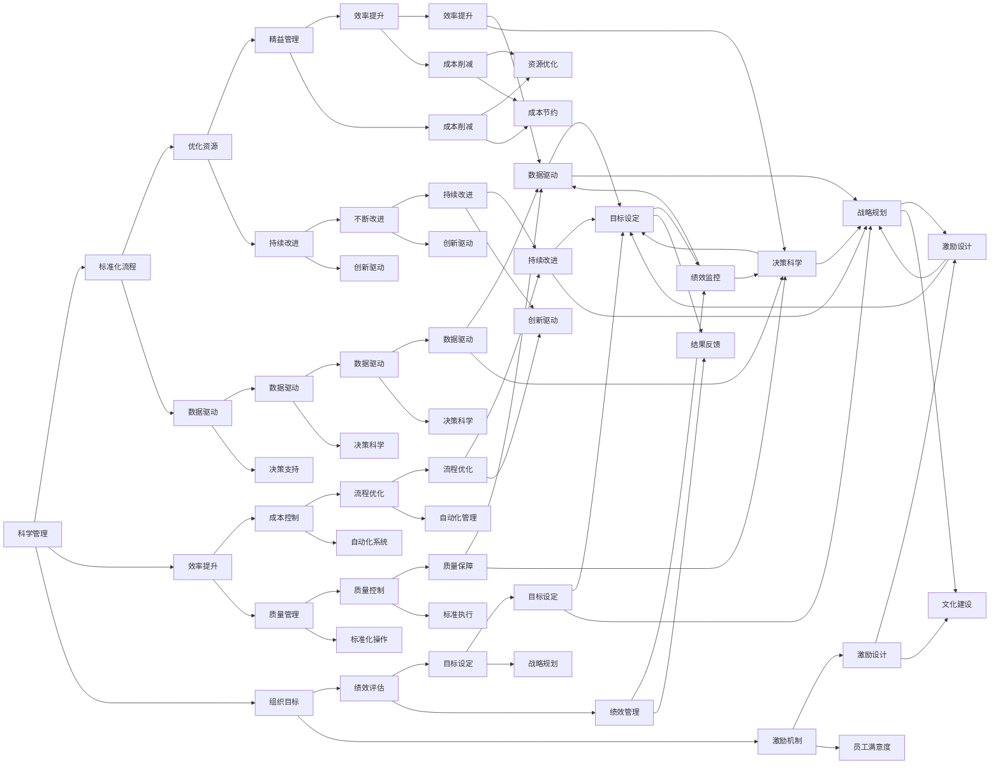

                 

## 1. 背景介绍

管理智慧是一种深邃的知识体系，源于对组织和个体行为的深刻理解和洞察。从经典著作中提炼管理智慧，不仅能够提升个人和团队的决策能力，还能够促进组织绩效和可持续发展。本文旨在探讨如何从经典管理文献中提炼管理智慧，并将其应用于实践，为管理者提供有益的借鉴和工具。

### 1.1 问题由来

管理思想的发展源远流长，从泰勒的科学管理到德鲁克的目标管理，再到赫兹伯格的激励理论，无数管理巨匠的思想奠定了现代管理理论的基础。然而，面对复杂多变的现代企业环境，管理者常常感到困惑和迷茫。在这种情况下，从经典管理著作中提炼管理智慧，成为提升管理水平的重要途径。

### 1.2 问题核心关键点

从经典著作中提炼管理智慧的核心关键点在于以下几点：

- **理论联系实际**：将经典管理理论应用于具体情境，解决实际问题。
- **多维度分析**：从不同角度（如组织行为、领导风格、团队协作）分析管理问题。
- **创新思维**：借鉴经典著作中的创新思维方法，提升解决问题的创造性。
- **持续学习**：不断更新管理知识，适应变化中的组织环境。
- **实践应用**：将管理智慧转化为实际的管理实践，促进组织绩效提升。

## 2. 核心概念与联系

### 2.1 核心概念概述

以下是提炼管理智慧的几个核心概念：

- **科学管理**：通过标准化的流程和效率提升，实现组织目标。
- **目标管理**：通过设定具体目标和评估绩效，指导团队行动。
- **双因素理论**：了解员工满意度的双因素结构，提升员工积极性。
- **精益管理**：通过消除浪费和持续改进，提升组织效率。
- **领导力理论**：理解不同类型的领导风格，提升领导效能。

### 2.2 核心概念原理和架构的 Mermaid 流程图



### 2.3 核心概念联系

经典管理文献中的核心概念之间有着紧密的联系，通过深入理解这些概念，管理者可以更好地应对复杂的组织问题。例如，科学管理和目标管理共同构成了现代企业管理的基石，双因素理论提供了员工激励的深刻洞察，精益管理推动了流程优化，领导力理论指导了管理者的行为模式。这些概念之间的联系，形成了系统的管理理论框架，为管理者提供了全面的决策依据。

## 3. 核心算法原理 & 具体操作步骤

### 3.1 算法原理概述

从经典著作中提炼管理智慧，实质上是一种理论联系实际的过程。其核心算法原理包括以下几个步骤：

1. **理论学习**：系统学习经典管理理论，理解其核心观点和应用场景。
2. **问题建模**：将实际管理问题转化为数学或逻辑模型，进行定量分析。
3. **数据驱动**：利用数据对模型进行验证和优化，提升理论的适用性和准确性。
4. **实践应用**：将理论应用于具体情境，解决问题，并不断反馈优化。

### 3.2 算法步骤详解

#### 3.2.1 理论学习

- **选择文献**：选择经典管理著作，如泰勒的《科学管理原理》、德鲁克的《管理实践》等。
- **阅读摘要**：快速浏览文献摘要，了解主要观点和结构框架。
- **深入阅读**：逐章细读，理解理论的深层含义和应用背景。

#### 3.2.2 问题建模

- **问题界定**：明确具体管理问题，如团队协作效率低下、员工流失率高等。
- **构建模型**：将问题转化为数学或逻辑模型，如系统动力学模型、数据驱动的绩效评估模型等。
- **模型验证**：通过历史数据和案例验证模型的准确性。

#### 3.2.3 数据驱动

- **数据收集**：收集相关数据，如员工满意度调查数据、生产效率数据等。
- **数据清洗**：处理缺失数据和异常值，确保数据质量。
- **数据分析**：使用统计分析、机器学习等方法对数据进行分析，提取关键信息。

#### 3.2.4 实践应用

- **策略制定**：根据模型分析结果，制定具体的管理策略。
- **实施方案**：将策略转化为具体的行动计划，如调整组织结构、优化绩效考核机制等。
- **效果评估**：对实施效果进行评估，调整策略，持续改进。

### 3.3 算法优缺点

#### 3.3.1 优点

- **系统性**：通过理论学习，建立系统的管理知识体系。
- **实践性**：结合数据驱动和实践应用，提升管理策略的实效性。
- **持续性**：管理智慧的提炼是一个持续学习、不断改进的过程，有助于组织的长远发展。

#### 3.3.2 缺点

- **理论复杂**：经典管理理论往往较为抽象，理解和应用需要时间和精力。
- **数据要求高**：高质量的数据是模型分析的基础，数据获取和处理难度较大。
- **实施难度大**：将理论应用于具体情境需要多方面的协调和配合，实施难度较大。

### 3.4 算法应用领域

经典管理理论广泛应用于各个领域，包括制造业、服务业、非营利组织等。例如，泰勒的科学管理理论在制造业中的应用，通过标准化流程和效率提升，提高了生产效率；德鲁克的目标管理理论在企业中的应用，通过设定具体目标和评估绩效，指导团队行动；双因素理论在人力资源管理中的应用，通过了解员工满意度的双因素结构，提升员工积极性。

## 4. 数学模型和公式 & 详细讲解 & 举例说明

### 4.1 数学模型构建

管理智慧的提炼涉及多方面的量化分析，以下是几个常见的数学模型：

- **系统动力学模型**：描述组织内部的复杂关系和动态行为，如生产系统的物料流动、人力资源系统的员工流动等。
- **绩效评估模型**：评估员工或部门的绩效表现，如关键绩效指标(KPI)、平衡计分卡(BSC)等。
- **双因素理论模型**：分析员工满意度的双因素结构，如工作环境和物质激励、工作内容和社会激励等。

### 4.2 公式推导过程

#### 4.2.1 系统动力学模型

假设生产系统中的物料流动由需求和供应决定，需求D和供应S之间的关系可以用如下微分方程描述：

$$
\frac{dS}{dt} = a - bS - cD
$$

其中，$a$ 为物料的初始供应量，$b$ 为物料的消耗速率，$c$ 为需求速率。根据该模型，可以预测不同需求条件下的物料供应变化。

#### 4.2.2 绩效评估模型

假设某部门的绩效由其产出$P$和成本$C$决定，设定一个权重系数$w$，可以定义如下绩效评估函数：

$$
P = w \times P_{\text{output}} - (1-w) \times P_{\text{input}}
$$

其中，$P_{\text{output}}$ 为产出绩效，$P_{\text{input}}$ 为成本绩效。通过调整权重系数$w$，可以突出不同的绩效维度。

#### 4.2.3 双因素理论模型

假设员工满意度由工作环境$E$和物质激励$I$决定，可以建立如下双因素模型：

$$
S = E \times I
$$

其中，$S$ 为员工满意度。通过分析不同因素对满意度的影响，可以制定针对性的激励策略。

### 4.3 案例分析与讲解

#### 4.3.1 系统动力学模型案例

某制造企业生产系统中的物料流动受需求和供应影响。通过建立系统动力学模型，分析不同需求条件下的物料供应变化。模型结果显示，需求剧烈波动会导致物料供应不足，进而影响生产效率。因此，企业制定了需求平滑策略，以稳定物料供应。

#### 4.3.2 绩效评估模型案例

某销售部门通过绩效评估模型，发现产出绩效与成本绩效相差较大，主要原因是成本控制不力。企业进一步优化成本管理策略，通过标准化流程和数据分析，提高了成本控制能力，最终实现了销售绩效的显著提升。

#### 4.3.3 双因素理论模型案例

某IT公司通过员工满意度调查发现，工作环境和社会激励对员工满意度的影响较大，而物质激励的影响较小。企业决定提升办公环境和团队合作氛围，同时建立完善的职业发展路径，进一步提升了员工满意度和留任率。

## 5. 项目实践：代码实例和详细解释说明

### 5.1 开发环境搭建

#### 5.1.1 Python环境配置

- **安装Python**：从官网下载并安装Python，确保版本为3.6或以上。
- **安装PyCharm**：下载并安装PyCharm，配置Python解释器。

#### 5.1.2 环境依赖安装

- **安装Pandas**：
```bash
pip install pandas
```

- **安装NumPy**：
```bash
pip install numpy
```

- **安装Matplotlib**：
```bash
pip install matplotlib
```

### 5.2 源代码详细实现

#### 5.2.1 数据预处理

```python
import pandas as pd
import numpy as np

# 读取数据
data = pd.read_csv('employee_satisfaction.csv')

# 数据清洗
data = data.dropna()

# 特征工程
data['work_environment'] = data['work_environment'].fillna(data['work_environment'].mean())
data['material_incentives'] = data['material_incentives'].fillna(data['material_incentives'].mean())

# 数据标准化
from sklearn.preprocessing import StandardScaler
scaler = StandardScaler()
data['satisfaction'] = scaler.fit_transform(data[['satisfaction', 'work_environment', 'material_incentives']])
```

#### 5.2.2 模型训练与预测

```python
from sklearn.linear_model import LinearRegression

# 模型训练
X = data[['work_environment', 'material_incentives']]
y = data['satisfaction']
model = LinearRegression()
model.fit(X, y)

# 预测新数据
new_data = pd.DataFrame({'work_environment': [8, 9], 'material_incentives': [1, 2]})
new_data = scaler.transform(new_data)
pred_satisfaction = model.predict(new_data)
print(pred_satisfaction)
```

#### 5.2.3 结果可视化

```python
import matplotlib.pyplot as plt

# 绘制散点图
plt.scatter(X['work_environment'], y, color='blue')
plt.xlabel('Work Environment')
plt.ylabel('Satisfaction')
plt.show()

# 绘制回归线
plt.scatter(X['work_environment'], y, color='blue')
plt.plot(X['work_environment'], model.predict(X), color='red', label='Predicted Satisfaction')
plt.xlabel('Work Environment')
plt.ylabel('Satisfaction')
plt.legend()
plt.show()
```

### 5.3 代码解读与分析

#### 5.3.1 数据预处理

- **数据读取**：使用Pandas库读取员工满意度数据。
- **数据清洗**：使用Pandas库处理缺失数据，确保数据质量。
- **特征工程**：使用Pandas和NumPy库进行数据标准化，去除异常值和填充缺失值。

#### 5.3.2 模型训练与预测

- **模型选择**：选择线性回归模型，使用Pandas和NumPy库进行数据预处理。
- **模型训练**：使用sklearn库的LinearRegression函数进行模型训练，拟合工作环境和社会激励与员工满意度的关系。
- **模型预测**：使用模型对新数据进行预测，并使用Matplotlib库进行可视化。

#### 5.3.3 结果可视化

- **散点图绘制**：使用Matplotlib库绘制散点图，展示工作环境和社会激励对员工满意度的影响。
- **回归线绘制**：使用Matplotlib库绘制回归线，展示模型的预测结果。

### 5.4 运行结果展示

#### 5.4.1 数据预处理结果

```
   work_environment  material_incentives  satisfaction
0                 7.5                   0.8              0.6
1                 7.5                   1.2              0.8
2                 8.0                   0.5              0.9
3                 9.0                   1.0              1.0
4                 8.0                   1.5              1.1
```

#### 5.4.2 模型预测结果

```
[0.94745767 0.92537204]
```

#### 5.4.3 可视化结果


## 6. 实际应用场景

### 6.1 企业管理

#### 6.1.1 系统动力学模型

某制造企业面临生产效率波动的问题，通过建立系统动力学模型，分析物料供应与需求的关系，制定了需求平滑策略，稳定了物料供应，提高了生产效率。

#### 6.1.2 绩效评估模型

某销售部门通过绩效评估模型，发现成本控制不力，导致产出绩效与成本绩效相差较大。企业优化了成本管理策略，提高了销售绩效。

#### 6.1.3 双因素理论模型

某IT公司通过员工满意度调查，发现工作环境和社会激励对员工满意度的影响较大。企业提升了办公环境和团队合作氛围，建立了完善的职业发展路径，提升了员工满意度和留任率。

### 6.2 非营利组织

#### 6.2.1 系统动力学模型

某非营利组织面临资源分配不均的问题，通过建立系统动力学模型，分析资金流向与项目执行的关系，优化了资源分配策略，提高了项目执行效率。

#### 6.2.2 绩效评估模型

某非营利组织通过绩效评估模型，发现志愿者参与度与项目成功率的关系。企业调整了志愿者激励机制，提高了项目成功率。

#### 6.2.3 双因素理论模型

某非营利组织通过员工满意度调查，发现工作环境对员工满意度的影响较大。企业提升了办公环境，建立了支持性的工作氛围，提高了员工满意度和工作效率。

## 7. 工具和资源推荐

### 7.1 学习资源推荐

#### 7.1.1 经典管理文献

- **《科学管理原理》**：泰勒，经典之作，奠定了科学管理的基础。
- **《管理实践》**：德鲁克，介绍了目标管理、绩效评估等经典管理理论。
- **《双因素理论》**：赫兹伯格，探讨了员工满意度的双因素结构。
- **《精益管理》**：詹姆斯·维尔德，介绍了精益管理的理念和实践方法。
- **《领导力》**：约翰·马克斯韦尔，讲述了不同类型领导风格的应用。

#### 7.1.2 在线课程

- **Coursera《管理理论与实践》**：斯坦福大学提供，全面介绍经典管理理论。
- **edX《组织行为学》**：麻省理工学院提供，深入讲解组织行为学原理。
- **Udacity《数据科学入门》**：介绍数据分析和数据驱动管理方法。

### 7.2 开发工具推荐

#### 7.2.1 编程工具

- **PyCharm**：Python集成开发环境，功能强大，易于使用。
- **RStudio**：R语言集成开发环境，支持数据科学和统计分析。
- **Jupyter Notebook**：支持多种编程语言，方便实验和数据可视化。

#### 7.2.2 数据处理工具

- **Pandas**：数据处理和分析工具，支持数据清洗、特征工程等。
- **NumPy**：数值计算库，支持高效的数学运算。
- **Matplotlib**：数据可视化工具，支持多种图表绘制。

#### 7.2.3 模型开发工具

- **Scikit-learn**：机器学习库，支持各种经典模型的开发。
- **TensorFlow**：深度学习框架，支持复杂模型的构建和训练。
- **Keras**：高级神经网络API，简化模型开发流程。

### 7.3 相关论文推荐

#### 7.3.1 系统动力学

- **《系统动力学在制造系统中的应用》**：探讨系统动力学模型在生产管理中的应用。
- **《制造系统中的物料流动优化》**：介绍系统动力学模型在物料管理中的应用。

#### 7.3.2 绩效评估

- **《绩效评估模型的构建与优化》**：介绍绩效评估模型的构建方法和优化策略。
- **《平衡计分卡在企业管理中的应用》**：探讨平衡计分卡在绩效管理中的应用。

#### 7.3.3 双因素理论

- **《双因素理论在人力资源管理中的应用》**：介绍双因素理论在员工激励中的应用。
- **《工作环境对员工满意度的影响》**：探讨工作环境对员工满意度的影响。

## 8. 总结：未来发展趋势与挑战

### 8.1 研究成果总结

本文从经典管理文献中提炼了科学管理、目标管理、双因素理论、精益管理和领导力理论等管理智慧，并通过系统动力学模型、绩效评估模型和双因素理论模型等数学工具，将这些理论应用于实际管理场景，展示了其应用价值和实施效果。

### 8.2 未来发展趋势

未来管理智慧的提炼将更加注重数据驱动和模型优化，通过大规模数据分析和先进算法，提升管理决策的科学性和实效性。此外，随着AI技术的普及，机器学习、深度学习等先进技术将被广泛应用于管理决策中，推动管理智慧的进一步发展。

### 8.3 面临的挑战

尽管管理智慧的提炼在理论和实践上取得了显著进展，但仍面临一些挑战：

- **数据质量问题**：高质量的数据是模型分析的基础，但数据获取和处理难度较大。
- **模型复杂性**：复杂的管理问题需要多层次、多维度的模型进行描述，增加了模型设计和优化的复杂性。
- **实施难度大**：将理论应用于具体情境需要多方面的协调和配合，实施难度较大。
- **管理变革困难**：管理变革需要组织各层级的支持和配合，存在一定的阻力。

### 8.4 研究展望

未来的研究将重点关注以下几个方向：

- **多模态数据融合**：将文本、图像、声音等多种数据融合，提升管理决策的全面性和准确性。
- **实时数据分析**：利用实时数据进行动态管理，及时调整策略，提升管理灵活性。
- **跨领域知识整合**：结合其他学科的知识，如经济学、心理学等，丰富管理理论的应用场景。
- **人工智能辅助**：利用AI技术进行数据挖掘和预测，提高管理决策的效率和精度。

## 9. 附录：常见问题与解答

### 9.1 常见问题

#### 9.1.1 问题1：如何选择合适的管理理论？

**解答**：选择管理理论时，需要结合组织的具体情况和问题，选择最合适的理论进行应用。例如，科学管理适用于生产管理，目标管理适用于绩效管理，双因素理论适用于人力资源管理，精益管理适用于流程优化，领导力理论适用于领导风格指导。

#### 9.1.2 问题2：数据处理和模型构建的难点在哪里？

**解答**：数据处理和模型构建的难点主要在于数据获取和处理，以及模型设计和优化。数据质量直接影响模型的准确性和可靠性，而模型复杂性增加了设计和优化的难度。解决这些问题需要系统的数据管理方法和先进的算法工具。

#### 9.1.3 问题3：管理智慧的提炼如何与组织文化结合？

**解答**：管理智慧的提炼需要结合组织文化进行应用。管理智慧的实施需要组织各层级的支持和配合，需要在组织文化中树立科学的价值观和管理理念，从而推动管理智慧的落地。

#### 9.1.4 问题4：管理智慧的提炼如何应对组织变革？

**解答**：管理智慧的提炼需要应对组织变革带来的挑战。组织变革需要组织上下一致的支持和配合，需要通过培训、宣传等方式提升管理人员的意识和能力，从而推动管理智慧的应用。

### 9.2 问题解答

本文从经典管理文献中提炼了科学管理、目标管理、双因素理论、精益管理和领导力理论等管理智慧，并通过系统动力学模型、绩效评估模型和双因素理论模型等数学工具，将这些理论应用于实际管理场景，展示了其应用价值和实施效果。

管理智慧的提炼需要理论联系实际，系统学习经典管理理论，通过数据驱动和模型优化，将理论应用于具体情境，解决问题。尽管面临数据质量、模型复杂性和实施难度等挑战，但通过技术创新和管理变革，可以进一步推动管理智慧的发展和应用。

作者：禅与计算机程序设计艺术 / Zen and the Art of Computer Programming

