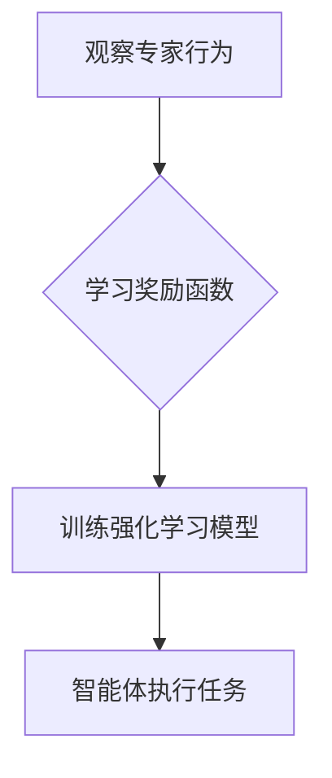

> 强化学习，逆强化学习，强化学习算法，逆强化学习算法，深度强化学习，应用场景

## 1. 背景介绍

在人工智能领域，强化学习 (Reinforcement Learning, RL) 作为一种模仿人类学习的智能算法，近年来取得了显著进展，并在机器人控制、游戏 AI、推荐系统等领域展现出强大的应用潜力。强化学习的核心思想是通过试错学习，让智能体在与环境交互的过程中不断优化策略，以最大化累积的奖励。

然而，在现实世界中，获取精确的奖励函数往往非常困难，甚至不可行。这时，逆强化学习 (Inverse Reinforcement Learning, IRL) 就显得尤为重要。逆强化学习的目标是，从观察到的示范行为中学习出隐藏的奖励函数，从而推断出智能体的决策策略。

## 2. 核心概念与联系

**2.1 强化学习 (RL)**

强化学习的核心要素包括：

* **智能体 (Agent):**  与环境交互的决策者。
* **环境 (Environment):** 智能体所处的外部世界。
* **状态 (State):** 环境的当前状态。
* **动作 (Action):** 智能体可以采取的行动。
* **奖励 (Reward):** 环境对智能体动作的反馈，可以是正向或负向。
* **策略 (Policy):** 智能体在不同状态下选择动作的规则。

强化学习的目标是通过学习一个最优策略，使得智能体在与环境交互的过程中获得最大的累积奖励。

**2.2 逆强化学习 (IRL)**

逆强化学习的目标是，从观察到的示范行为中学习出隐藏的奖励函数。

假设我们观察到一个专家在某个环境中执行的一系列动作，我们可以通过逆强化学习来推断出专家所遵循的奖励函数。

**2.3 RL 与 IRL 的联系**

强化学习和逆强化学习是相互补充的。

* 强化学习可以用来训练智能体，使其在已知奖励函数的情况下学习最优策略。
* 逆强化学习可以用来学习隐藏的奖励函数，从而为强化学习提供更有效的指导。

**2.4 Mermaid 流程图**



## 3. 核心算法原理 & 具体操作步骤

### 3.1 算法原理概述

逆强化学习算法的核心思想是，通过最小化示范行为与学习到的奖励函数之间的差异，来学习出隐藏的奖励函数。

常见的逆强化学习算法包括：

* **最大似然估计 (Maximum Likelihood Estimation, MLE)**
* **支持向量机 (Support Vector Machine, SVM)**
* **深度学习 (Deep Learning)**

### 3.2 算法步骤详解

以最大似然估计为例，逆强化学习算法的具体步骤如下：

1. **收集示范行为数据:** 从专家或其他可靠来源收集到一系列示范行为数据。
2. **构建状态空间和动作空间:** 根据环境的特点，定义智能体的状态空间和动作空间。
3. **假设奖励函数的形式:** 假设奖励函数的形式，例如线性函数或多项式函数。
4. **使用最大似然估计方法学习奖励函数参数:** 通过最小化示范行为与学习到的奖励函数之间的差异，来学习出奖励函数的参数。
5. **验证奖励函数的有效性:** 使用学习到的奖励函数训练强化学习模型，并评估模型在实际环境中的性能。

### 3.3 算法优缺点

**优点:**

* 可以学习出隐藏的奖励函数，从而为强化学习提供更有效的指导。
* 可以利用现有的示范行为数据，无需人工标注奖励函数。

**缺点:**

* 需要大量的示范行为数据。
* 假设奖励函数的形式可能会影响学习结果。
* 难以处理复杂的环境和任务。

### 3.4 算法应用领域

逆强化学习在以下领域具有广泛的应用前景:

* **机器人控制:** 从专家演示中学习机器人控制策略。
* **游戏 AI:** 从人类玩家的策略中学习游戏 AI。
* **推荐系统:** 从用户行为数据中学习用户偏好。
* **医疗诊断:** 从专家诊断案例中学习疾病诊断策略。

## 4. 数学模型和公式 & 详细讲解 & 举例说明

### 4.1 数学模型构建

假设智能体在环境中执行一系列动作，每个动作对应一个状态转移和一个奖励值。我们可以用一个状态转移概率矩阵 $P$ 和一个奖励函数 $R$ 来描述环境的行为。

* $P(s', r | s, a)$ 表示从状态 $s$ 执行动作 $a$ 后，转移到状态 $s'$ 并获得奖励 $r$ 的概率。
* $R(s, a)$ 表示在状态 $s$ 执行动作 $a$ 时获得的奖励。

### 4.2 公式推导过程

逆强化学习的目标是学习出奖励函数 $R(s, a)$。我们可以使用最大似然估计方法来学习奖励函数参数。

假设我们观察到专家执行的一系列动作序列 $\{a_1, a_2, ..., a_T\}$，对应的状态序列 $\{s_1, s_2, ..., s_T\}$。

最大似然估计的目标是找到一个奖励函数 $R(s, a)$，使得观察到的动作序列的概率最大化。

$$
\max_{R(s, a)} \prod_{t=1}^{T} P(s_t', r_t | s_t, a_t)
$$

其中，$P(s_t', r_t | s_t, a_t)$ 是状态转移概率和奖励函数的联合概率。

### 4.3 案例分析与讲解

假设我们想学习一个机器人控制策略，让机器人从起点移动到终点。我们可以从专家演示中收集到机器人执行的一系列动作序列，并使用最大似然估计方法学习出奖励函数。

例如，我们可以假设奖励函数的形式为：

$$
R(s, a) = \begin{cases}
1 & \text{如果动作 } a \text{ 导致机器人接近终点} \\
-1 & \text{如果动作 } a \text{ 导致机器人远离终点} \\
0 & \text{其他情况}
\end{cases}
$$

通过学习这个奖励函数，我们可以训练一个强化学习模型，让机器人学会从起点移动到终点。

## 5. 项目实践：代码实例和详细解释说明

### 5.1 开发环境搭建

* Python 3.7+
* TensorFlow 2.0+
* OpenAI Gym

### 5.2 源代码详细实现

```python
import gym
import tensorflow as tf

# 定义奖励函数
def reward_function(state, action):
    # ...

# 定义强化学习模型
class Agent(tf.keras.Model):
    def __init__(self):
        super(Agent, self).__init__()
        # ...

    def call(self, state):
        # ...

# 创建强化学习环境
env = gym.make('CartPole-v1')

# 创建强化学习模型
agent = Agent()

# 训练强化学习模型
for episode in range(1000):
    state = env.reset()
    done = False
    while not done:
        # 选择动作
        action = agent(state)
        # 执行动作
        next_state, reward, done, _ = env.step(action)
        # 更新模型参数
        agent.train_on_batch(state, reward)
        # 更新状态
        state = next_state

# 测试强化学习模型
state = env.reset()
while True:
    # 选择动作
    action = agent(state)
    # 执行动作
    next_state, reward, done, _ = env.step(action)
    # 显示环境状态
    env.render()
    # 更新状态
    state = next_state
    if done:
        break
```

### 5.3 代码解读与分析

* 代码首先定义了奖励函数和强化学习模型。
* 然后创建了强化学习环境和模型实例。
* 接着训练强化学习模型，并使用训练好的模型进行测试。

### 5.4 运行结果展示

运行代码后，可以观察到强化学习模型在环境中学习并执行任务的过程。

## 6. 实际应用场景

逆强化学习在以下领域具有广泛的应用前景:

* **机器人控制:** 从专家演示中学习机器人控制策略，例如让机器人学会如何抓取物体或导航到目标位置。
* **游戏 AI:** 从人类玩家的策略中学习游戏 AI，例如让游戏 AI 学会玩围棋或策略游戏。
* **推荐系统:** 从用户行为数据中学习用户偏好，例如推荐用户可能感兴趣的商品或内容。
* **医疗诊断:** 从专家诊断案例中学习疾病诊断策略，例如帮助医生诊断癌症或其他疾病。

### 6.4 未来应用展望

随着人工智能技术的不断发展，逆强化学习的应用场景将会更加广泛。

例如，未来我们可以利用逆强化学习来：

* 学习人类的复杂行为模式，例如学习人类的语言或社交行为。
* 训练更智能的机器人，使其能够更好地与人类交互和协作。
* 开发更个性化的推荐系统，为用户提供更精准的推荐。

## 7. 工具和资源推荐

### 7.1 学习资源推荐

* **书籍:**
    * Reinforcement Learning: An Introduction by Richard S. Sutton and Andrew G. Barto
    * Inverse Reinforcement Learning by Pieter Abbeel and Andrew Y. Ng
* **课程:**
    * Stanford CS234: Reinforcement Learning
    * Berkeley CS188: Artificial Intelligence

### 7.2 开发工具推荐

* **TensorFlow:** 深度学习框架
* **PyTorch:** 深度学习框架
* **OpenAI Gym:** 强化学习环境

### 7.3 相关论文推荐

* **Learning from Demonstrations** by Abbeel and Ng (2004)
* **Maximum Entropy Inverse Reinforcement Learning** by Ziebart et al. (2008)
* **Deep Inverse Reinforcement Learning** by Finn et al. (2016)

## 8. 总结：未来发展趋势与挑战

### 8.1 研究成果总结

逆强化学习近年来取得了显著进展，在学习隐藏的奖励函数和训练智能体方面展现出强大的潜力。

### 8.2 未来发展趋势

未来逆强化学习的研究方向包括:

* **处理更复杂的环境和任务:** 
* **学习更鲁棒和泛化的奖励函数:** 
* **结合深度学习技术:** 

### 8.3 面临的挑战

逆强化学习仍然面临一些挑战，例如:

* **数据需求:** 逆强化学习需要大量的示范行为数据。
* **奖励函数假设:** 假设奖励函数的形式可能会影响学习结果。
* **可解释性:** 逆强化学习模型的决策过程难以解释。

### 8.4 研究展望

尽管面临挑战，但逆强化学习仍然是一个充满希望的研究领域。随着人工智能技术的不断发展，相信逆强化学习将在未来发挥越来越重要的作用。

## 9. 附录：常见问题与解答

**Q1: 逆强化学习与强化学习有什么区别？**

**A1:** 强化学习的目标是学习一个最优策略，使得智能体在已知奖励函数的情况下获得最大的累积奖励。而逆强化学习的目标是学习隐藏的奖励函数，从而为强化学习提供更有效的指导。

**Q2: 逆强化学习需要多少数据？**

**A2:** 逆强化学习需要大量的示范行为数据。数据量的大小取决于环境的复杂度和任务的难度。

**Q3: 如何选择奖励函数的形式？**

**A3:** 选择奖励函数的形式是一个重要的步骤，它会影响学习结果。可以选择线性函数、多项式函数或其他形式的函数。

**Q4: 逆强化学习的模型可解释性如何？**

**A4:** 逆强化学习模型的决策过程难以解释。这仍然是一个需要进一步研究的问题。


作者：禅与计算机