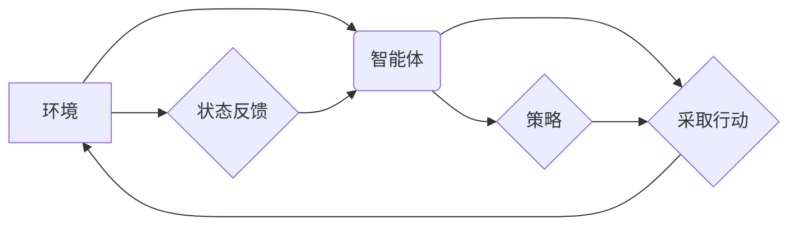

> 强化学习，Reinforcement Learning，航空航天，应用，挑战，控制，优化，决策

## 1. 背景介绍

航空航天领域一直以来都是科技发展的前沿阵地，其复杂性、安全性要求极高，对智能控制和决策的需求日益迫切。传统控制方法往往依赖于预先设定的规则和模型，难以应对复杂、动态变化的环境。而强化学习（Reinforcement Learning，RL）作为一种机器学习范式，能够通过与环境交互学习最优策略，展现出强大的适应性和泛化能力，为航空航天领域带来了新的机遇。

RL的核心思想是通过奖励机制引导智能体学习最优行为。智能体在与环境交互的过程中，根据采取的行动获得奖励或惩罚，并根据这些反馈信息不断调整策略，最终学习到能够最大化奖励的策略。这种学习方式与人类学习的模式相似，能够有效解决传统方法难以处理的复杂决策问题。

## 2. 核心概念与联系

**2.1 强化学习核心概念**

* **智能体 (Agent):**  与环境交互并采取行动的实体。
* **环境 (Environment):** 智能体所处的外部世界，会根据智能体的行动产生状态变化并给予奖励或惩罚。
* **状态 (State):** 环境在特定时刻的描述，代表着环境的当前情况。
* **行动 (Action):** 智能体可以采取的可选行为。
* **奖励 (Reward):** 环境对智能体行动的反馈，可以是正向奖励或负向惩罚。
* **策略 (Policy):** 智能体根据当前状态选择行动的规则。

**2.2 RL与航空航天领域的联系**

RL在航空航天领域具有广泛的应用前景，例如：

* **飞行控制:** RL可以用于设计更加智能、鲁棒的飞行控制系统，能够应对复杂的气象条件和飞行任务。
* **导航与路径规划:** RL可以帮助无人机或航天器在复杂环境中自主导航和规划路径，提高效率和安全性。
* **资源管理:** RL可以用于优化航天器资源分配，例如燃料、电力等，延长任务执行时间。
* **故障诊断与修复:** RL可以学习识别航天器故障模式，并制定相应的修复策略。

**2.3 RL架构示意图**



## 3. 核心算法原理 & 具体操作步骤

**3.1 算法原理概述**

RL算法的核心是通过强化信号（奖励）来引导智能体学习最优策略。常见的RL算法包括：

* **Q-学习:** 通过构建Q表，学习每个状态-动作对的价值函数，选择价值最高的动作。
* **SARSA:** 与Q-学习类似，但更新Q值时使用当前状态和采取的动作，更注重在线学习。
* **Deep Q-Network (DQN):** 使用深度神经网络来逼近Q函数，能够处理高维状态空间。
* **Policy Gradient:** 直接优化策略函数，避免构建Q函数，更适合连续动作空间。

**3.2 算法步骤详解**

以Q-学习为例，其基本步骤如下：

1. 初始化Q表，将所有状态-动作对的价值函数设置为0。
2. 智能体从初始状态开始，随机选择一个动作并执行。
3. 环境根据智能体的行动产生新的状态和奖励。
4. 更新Q表：

$$Q(s,a) = Q(s,a) + \alpha [r + \gamma \max_{a'} Q(s',a') - Q(s,a)]$$

其中：

* $Q(s,a)$ 是状态$s$下采取动作$a$的价值函数。
* $\alpha$ 是学习率，控制着学习速度。
* $r$ 是从状态$s$采取动作$a$后获得的奖励。
* $\gamma$ 是折扣因子，控制着未来奖励的权重。
* $s'$ 是执行动作$a$后进入的新状态。
* $\max_{a'} Q(s',a')$ 是在新状态$s'$下所有动作的价值函数的最大值。

5. 重复步骤2-4，直到智能体学习到最优策略。

**3.3 算法优缺点**

**优点:**

* 能够学习复杂决策问题。
* 不需要预先定义规则和模型。
* 具有较强的泛化能力。

**缺点:**

* 训练过程可能需要大量时间和数据。
* 容易陷入局部最优解。
* 奖励设计对算法性能影响很大。

**3.4 算法应用领域**

RL算法广泛应用于各个领域，例如：

* 游戏AI
* 机器人控制
* 自动驾驶
* 金融投资
* 电力系统优化

## 4. 数学模型和公式 & 详细讲解 & 举例说明

**4.1 数学模型构建**

RL问题可以建模为马尔可夫决策过程 (MDP)，其包含以下要素：

* 状态空间 $S$：所有可能的系统状态。
* 动作空间 $A$：智能体可以采取的所有动作。
* 转移概率 $P(s',r|s,a)$：从状态 $s$ 执行动作 $a$ 后，转移到状态 $s'$ 并获得奖励 $r$ 的概率。
* 奖励函数 $R(s,a)$：智能体在状态 $s$ 执行动作 $a$ 后获得的奖励。
* 策略 $\pi(a|s)$：智能体在状态 $s$ 下选择动作 $a$ 的概率分布。

**4.2 公式推导过程**

RL算法的目标是找到最优策略 $\pi^*$，使得智能体在与环境交互的过程中获得最大的累积奖励。

最优策略的定义是：

$$\pi^*(a|s) = \arg\max_{\pi} \mathbb{E}_{\pi}[R(s,a)]$$

其中，$\mathbb{E}_{\pi}$ 表示对策略 $\pi$ 下的期望。

**4.3 案例分析与讲解**

例如，考虑一个简单的强化学习问题：智能体在一个二维网格世界中移动，目标是找到通往奖励位置的路径。

* 状态空间 $S$：网格中的每个位置。
* 动作空间 $A$：向上、向下、向左、向右四个方向。
* 转移概率 $P(s',r|s,a)$：根据动作 $a$ 和当前位置 $s$，计算智能体移动到下一个位置 $s'$ 的概率，以及获得的奖励 $r$。
* 奖励函数 $R(s,a)$：到达奖励位置获得最大奖励，其他位置获得较小的奖励或惩罚。

通过使用RL算法，例如Q-学习，智能体可以学习到最优策略，找到通往奖励位置的路径。

## 5. 项目实践：代码实例和详细解释说明

**5.1 开发环境搭建**

* Python 3.x
* TensorFlow 或 PyTorch
* OpenAI Gym

**5.2 源代码详细实现**

```python
import gym
import numpy as np

# 定义环境
env = gym.make('CartPole-v1')

# 定义学习参数
learning_rate = 0.1
discount_factor = 0.99
episodes = 1000

# 初始化Q表
q_table = np.zeros((env.observation_space.n, env.action_space.n))

# 训练循环
for episode in range(episodes):
    state = env.reset()
    done = False

    while not done:
        # 选择动作
        action = np.argmax(q_table[state])

        # 执行动作
        next_state, reward, done, _ = env.step(action)

        # 更新Q表
        q_table[state, action] = q_table[state, action] + learning_rate * (reward + discount_factor * np.max(q_table[next_state]) - q_table[state, action])

        # 更新状态
        state = next_state

    print(f"Episode {episode+1} completed")

# 测试
state = env.reset()
while True:
    action = np.argmax(q_table[state])
    state, reward, done, _ = env.step(action)
    env.render()
    if done:
        break
env.close()
```

**5.3 代码解读与分析**

* 代码首先定义了环境和学习参数。
* 然后初始化Q表，Q表是一个二维数组，存储每个状态-动作对的价值函数。
* 训练循环中，智能体从初始状态开始，根据Q表选择动作，执行动作后获得奖励和下一个状态。
* 根据Q-learning公式更新Q表，使价值函数朝着最优策略的方向调整。
* 训练完成后，使用训练好的Q表测试智能体的性能。

**5.4 运行结果展示**

运行代码后，智能体将在环境中学习并最终能够完成任务，例如在CartPole-v1环境中，智能体能够平衡杆子持续一段时间。

## 6. 实际应用场景

**6.1 飞行控制**

RL可以用于设计更加智能、鲁棒的飞行控制系统，例如：

* **自动驾驶飞机:** RL可以帮助飞机自主飞行，避开障碍物，并根据天气条件调整飞行路径。
* **无人机编队飞行:** RL可以使多个无人机协同工作，形成编队飞行，提高效率和安全性。
* **卫星姿态控制:** RL可以帮助卫星调整姿态，保持稳定运行。

**6.2 导航与路径规划**

RL可以帮助无人机或航天器在复杂环境中自主导航和规划路径，例如：

* **火星探测器路径规划:** RL可以帮助火星探测器在火星表面自主导航，避开障碍物，并探索新的区域。
* **无人机避障飞行:** RL可以使无人机在飞行过程中避开障碍物，提高安全性。
* **太空垃圾清理:** RL可以帮助机器人自主识别和清理太空垃圾，维护太空环境。

**6.3 资源管理**

RL可以用于优化航天器资源分配，例如：

* **燃料管理:** RL可以帮助航天器优化燃料使用，延长任务执行时间。
* **电力分配:** RL可以帮助航天器根据不同任务需求分配电力资源，提高效率。
* **数据存储:** RL可以帮助航天器优化数据存储策略，提高数据利用率。

**6.4 未来应用展望**

RL在航空航天领域的应用前景广阔，未来可能在以下方面得到进一步发展：

* **更复杂的场景:** RL算法能够处理更复杂的场景，例如多目标协同、动态环境等。
* **更智能的决策:** RL算法能够学习更智能的决策，例如预测未来事件、制定长期策略等。
* **更安全的系统:** RL算法能够提高系统的安全性，例如故障诊断、安全保障等。

## 7. 工具和资源推荐

**7.1 学习资源推荐**

* **书籍:**
    * Reinforcement Learning: An Introduction by Richard S. Sutton and Andrew G. Barto
    * Deep Reinforcement Learning Hands-On by Maxim Lapan
* **在线课程:**
    * Coursera: Reinforcement Learning Specialization by David Silver
    * Udacity: Deep Reinforcement Learning Nanodegree

**7.2 开发工具推荐**

* **TensorFlow:** 深度学习框架，支持RL算法的实现。
* **PyTorch:** 深度学习框架，支持RL算法的实现。
* **OpenAI Gym:** RL环境库，提供各种标准的RL环境。

**7.3 相关论文推荐**

* Deep Reinforcement Learning for Robotics by OpenAI
* Proximal Policy Optimization Algorithms by John Schulman et al.
* Asynchronous Methods for Deep Reinforcement Learning by Volodymyr Mnih et al.

## 8. 总结：未来发展趋势与挑战

**8.1 研究成果总结**

近年来，RL在航空航天领域取得