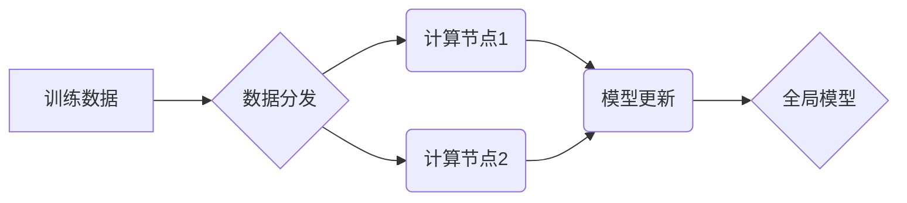

> 强化学习，并行，分布式，算法，实现方案，性能优化，深度学习

## 1. 背景介绍

强化学习 (Reinforcement Learning, RL) 作为机器学习领域的重要分支，近年来取得了显著进展，在机器人控制、游戏 AI、推荐系统等领域展现出强大的应用潜力。然而，传统的 RL 算法通常需要大量的训练时间和计算资源，这限制了其在实际应用中的推广。

随着计算能力的不断提升，并行和分布式计算技术逐渐成为 RL 训练的热门研究方向。通过将训练任务分解到多个计算节点上并行执行，可以显著缩短训练时间，提高训练效率。

## 2. 核心概念与联系

**2.1 并行与分布式计算**

* **并行计算:** 指在多个处理器或计算节点上同时执行相同的任务，以加速计算速度。
* **分布式计算:** 指将一个大型计算任务分解成多个子任务，分别在不同的计算节点上执行，并通过网络进行数据交换和协作。

**2.2 强化学习与并行/分布式计算的结合**

将并行和分布式计算技术应用于 RL 训练，可以有效解决传统 RL 算法训练时间长、资源消耗大的问题。

**2.3 架构图**



## 3. 核心算法原理 & 具体操作步骤

**3.1 算法原理概述**

并行和分布式 RL 算法的核心思想是将 RL 训练任务分解到多个计算节点上并行执行，每个节点训练一个局部模型，然后通过聚合机制将这些局部模型的更新信息合并到全局模型中。

**3.2 算法步骤详解**

1. **数据分发:** 将训练数据均匀地分配到各个计算节点。
2. **并行训练:** 每个计算节点使用局部数据训练自己的模型。
3. **模型更新:** 每个节点将模型参数更新信息发送到全局模型服务器。
4. **全局模型聚合:** 全局模型服务器将所有节点的模型更新信息进行聚合，更新全局模型。
5. **重复步骤2-4:** 直到训练完成或达到预设的性能指标。

**3.3 算法优缺点**

* **优点:**
    * 训练速度更快。
    * 可以利用更多计算资源。
    * 适用于大规模数据集和复杂模型。
* **缺点:**
    * 需要考虑数据并行和模型并行的协调问题。
    * 需要额外的通信和同步成本。

**3.4 算法应用领域**

* 机器人控制
* 游戏 AI
* 推荐系统
* 自动驾驶

## 4. 数学模型和公式 & 详细讲解 & 举例说明

**4.1 数学模型构建**

强化学习的数学模型通常由以下几个部分组成:

* **状态空间:** 表示系统可能存在的各种状态。
* **动作空间:** 表示系统在每个状态下可以采取的各种动作。
* **奖励函数:** 用于评估系统在每个状态下采取某个动作的结果。
* **价值函数:** 用于估计从某个状态开始采取一系列动作所能获得的总奖励。

**4.2 公式推导过程**

* **Bellman 方程:** 这是 RL 算法的核心公式，用于描述价值函数的更新规则。

$$
V(s) = \max_{\alpha} \sum_{s' \in S} P(s' | s, \alpha) [r(s, \alpha, s') + \gamma V(s')]
$$

其中:

* $V(s)$ 是状态 $s$ 的价值函数。
* $\alpha$ 是动作。
* $P(s' | s, \alpha)$ 是从状态 $s$ 执行动作 $\alpha$ 进入状态 $s'$ 的概率。
* $r(s, \alpha, s')$ 是在状态 $s$ 执行动作 $\alpha$ 进入状态 $s'$ 得到的奖励。
* $\gamma$ 是折扣因子，用于权衡未来奖励的价值。

**4.3 案例分析与讲解**

例如，在玩游戏时，我们可以将游戏状态表示为玩家的位置、游戏角色的生命值等信息，动作表示为玩家可以采取的各种操作，奖励函数表示为获得分数或完成任务的奖励，价值函数表示为从当前状态开始玩游戏所能获得的总分。

## 5. 项目实践：代码实例和详细解释说明

**5.1 开发环境搭建**

* Python 3.x
* TensorFlow 或 PyTorch
* CUDA 和 cuDNN (可选，用于 GPU 加速)

**5.2 源代码详细实现**

```python
import tensorflow as tf

# 定义模型
model = tf.keras.Sequential([
    tf.keras.layers.Dense(128, activation='relu'),
    tf.keras.layers.Dense(64, activation='relu'),
    tf.keras.layers.Dense(1)
])

# 定义损失函数和优化器
loss_fn = tf.keras.losses.MeanSquaredError()
optimizer = tf.keras.optimizers.Adam()

# 定义训练函数
def train_step(x, y):
    with tf.GradientTape() as tape:
        predictions = model(x)
        loss = loss_fn(y, predictions)
    gradients = tape.gradient(loss, model.trainable_variables)
    optimizer.apply_gradients(zip(gradients, model.trainable_variables))
    return loss

# 数据分发和并行训练
# ...

# 模型更新和全局模型聚合
# ...
```

**5.3 代码解读与分析**

* 代码定义了一个简单的深度学习模型，用于预测强化学习的价值函数。
* 使用 TensorFlow 的 `GradientTape` 来计算梯度，并使用 `Adam` 优化器更新模型参数。
* `train_step` 函数定义了单个训练步骤的逻辑，包括前向传播、损失计算、反向传播和参数更新。
* 数据分发和并行训练的具体实现需要根据实际情况进行调整。

**5.4 运行结果展示**

* 通过监控训练过程中的损失函数值，可以评估模型的训练效果。
* 可以使用测试集进行评估，验证模型的泛化能力。

## 6. 实际应用场景

**6.1 机器人控制**

* 使用 RL 算法训练机器人控制策略，使其能够在复杂环境中自主导航、抓取物体等。

**6.2 游戏 AI**

* 使用 RL 算法训练游戏 AI，使其能够学习游戏规则并制定策略，与人类玩家进行对抗。

**6.3 推荐系统**

* 使用 RL 算法训练推荐系统，使其能够根据用户的历史行为和偏好推荐更精准的商品或内容。

**6.4 自动驾驶**

* 使用 RL 算法训练自动驾驶系统，使其能够在复杂路况下安全驾驶。

**6.5 未来应用展望**

* RL 算法在医疗、金融、能源等领域也具有广阔的应用前景。

## 7. 工具和资源推荐

**7.1 学习资源推荐**

* **书籍:**
    * Reinforcement Learning: An Introduction by Richard S. Sutton and Andrew G. Barto
    * Deep Reinforcement Learning Hands-On by Maxim Lapan
* **在线课程:**
    * Coursera: Reinforcement Learning Specialization by David Silver
    * Udacity: Deep Reinforcement Learning Nanodegree

**7.2 开发工具推荐**

* TensorFlow
* PyTorch
* OpenAI Gym

**7.3 相关论文推荐**

* Deep Q-Network (DQN)
* Proximal Policy Optimization (PPO)
* Trust Region Policy Optimization (TRPO)

## 8. 总结：未来发展趋势与挑战

**8.1 研究成果总结**

近年来，RL 算法取得了显著进展，在多个领域取得了成功应用。

**8.2 未来发展趋势**

* **更强大的模型:** 研究更强大的 RL 算法，例如基于 Transformer 的 RL 算法。
* **更有效的训练方法:** 研究更有效的 RL 训练方法，例如基于进化算法的 RL 算法。
* **更广泛的应用场景:** 将 RL 算法应用到更多领域，例如医疗、金融、能源等。

**8.3 面临的挑战**

* **样本效率:** RL 算法通常需要大量的训练数据，这在某些领域难以实现。
* **安全性和可靠性:** RL 算法训练出的模型可能存在安全性和可靠性问题，需要进行充分的测试和验证。
* **解释性和可解释性:** RL 算法的决策过程通常难以解释，这限制了其在某些领域的应用。

**8.4 研究展望**

未来，RL 领域的研究将继续朝着更强大、更有效、更安全、更可解释的方向发展。


## 9. 附录：常见问题与解答

**9.1 Q: 并行和分布式 RL 的训练速度提升有多大？**

**A:** 并行和分布式 RL 的训练速度提升取决于多个因素，例如数据集大小、模型复杂度、计算资源等。一般来说，可以显著缩短训练时间，甚至可以将训练时间缩短到原来的几分之一。

**9.2 Q: 并行和分布式 RL 的实现难度大吗？**

**A:** 并行和分布式 RL 的实现难度相对较高，需要考虑数据并行、模型并行、通信和同步等问题。但是，随着开源工具和框架的不断发展，实现难度也在逐渐降低。

**9.3 Q: 并行和分布式 RL 的应用场景有哪些？**

**A:** 并行和分布式 RL 的应用场景非常广泛，例如机器人控制、游戏 AI、推荐系统、自动驾驶等。

作者：禅与计算机程序设计艺术 / Zen and the Art of Computer Programming


<end_of_turn>