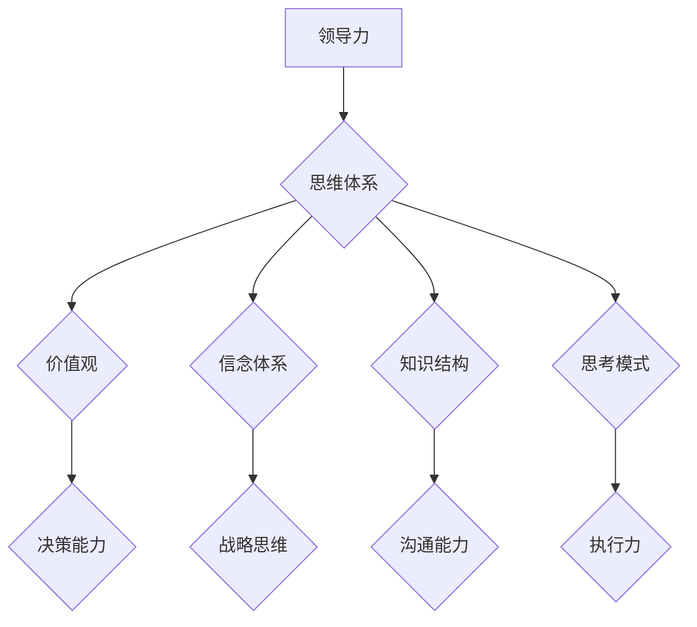

> 领导力、思维体系、认知能力、决策能力、创新能力、团队建设、战略思维、执行力

## 1. 背景介绍

在当今瞬息万变的时代，领导力已成为企业发展和竞争的关键要素。优秀的领导者能够洞察趋势，激发团队潜能，带领组织实现可持续发展。然而，领导力并非天生的，它是一种可培养和提升的技能，而其根基在于一个强大的思维体系。

思维体系是指一个人对世界、对事物、对自身认知的框架和模式，它决定着我们如何思考、如何判断、如何行动。一个健全的思维体系能够帮助领导者更清晰地认识问题、更准确地做出决策、更有效地激发团队活力，从而提升领导力的水平。

## 2. 核心概念与联系

### 2.1 领导力

领导力是指个人在特定情境下，能够影响、激励和引导他人，共同实现目标的能力。它包含多个维度，包括：

* **战略思维:** 能够洞察未来趋势，制定远见卓识的战略规划。
* **决策能力:** 能够在复杂环境下，快速准确地做出明智的决策。
* **沟通能力:** 能够清晰、有效地传达信息，建立良好的沟通渠道。
* **激励能力:** 能够激发团队成员的热情和动力，促进团队协作。
* **执行力:** 能够将战略目标转化为实际行动，确保目标的实现。

### 2.2 思维体系

思维体系是一个人的认知框架，它包括以下几个方面：

* **价值观:** 个人对事物判断的标准和准则。
* **信念体系:** 个人对世界和自身认知的根基。
* **知识结构:** 个人所掌握的知识体系和经验积累。
* **思考模式:** 个人处理信息、解决问题的方式。

### 2.3 联系

领导力和思维体系之间存在着密切的联系。一个强大的思维体系能够为领导者提供以下优势：

* **清晰的认知:** 能够更深入地理解问题本质，洞察背后的逻辑关系。
* **准确的判断:** 能够基于理性分析和经验积累，做出更准确的决策。
* **有效的激励:** 能够用更具说服力和感染力的语言，激发团队成员的积极性。
* **敏锐的洞察:** 能够及时发现市场变化和竞争趋势，制定应对策略。

**Mermaid 流程图**



## 3. 核心算法原理 & 具体操作步骤

### 3.1 算法原理概述

领导力提升是一个复杂的过程，需要不断地学习、实践和反思。 我们可以将它看作是一个迭代优化算法，通过不断调整思维体系，提升认知能力，最终达到领导力提升的目标。

### 3.2 算法步骤详解

1. **自我认知:** 首先要进行深入的自我认知，了解自己的价值观、信念体系、知识结构和思考模式。
2. **思维拓展:** 积极拓展自己的知识面，学习新的理论和方法，挑战自己的认知边界。
3. **批判性思考:** 培养批判性思维能力，学会质疑、分析和评估信息，避免被固有思维模式所束缚。
4. **情商提升:** 提升自己的情商，学会理解和管理自己的情绪，以及感知和理解他人的情绪。
5. **实践与反思:** 将学习到的知识和方法应用到实际工作中，并不断反思自己的经验，总结教训，不断改进。

### 3.3 算法优缺点

* **优点:** 
    * 能够针对个人情况进行定制化提升。
    * 过程持续性强，能够不断积累经验和提升能力。
    * 能够帮助领导者建立更清晰的认知体系，做出更明智的决策。
* **缺点:** 
    * 需要投入大量的时间和精力进行自我学习和实践。
    * 提升过程可能遇到瓶颈，需要不断突破自我。
    * 缺乏标准化的评估方法，难以量化提升效果。

### 3.4 算法应用领域

该算法适用于所有希望提升领导力的个人，包括：

* 企业管理者
* 项目经理
* 团队负责人
* 创业者
* 公共服务人员

## 4. 数学模型和公式 & 详细讲解 & 举例说明

### 4.1 数学模型构建

我们可以用一个简单的数学模型来描述领导力提升的过程：

```latex
L = f(C, E, S, Q)
```

其中：

* $L$ 代表领导力水平
* $C$ 代表认知能力
* $E$ 代表执行力
* $S$ 代表战略思维能力
* $Q$ 代表情商

这个模型表明，领导力水平取决于认知能力、执行力、战略思维能力和情商的综合作用。

### 4.2 公式推导过程

我们可以进一步推导每个因素对领导力水平的影响程度：

* $C$ 对 $L$ 的影响程度可以通过认知能力提升带来的决策准确率和问题解决效率来衡量。
* $E$ 对 $L$ 的影响程度可以通过执行力提升带来的目标达成率和团队协作效率来衡量。
* $S$ 对 $L$ 的影响程度可以通过战略思维提升带来的战略规划的有效性和应对变化的能力来衡量。
* $Q$ 对 $L$ 的影响程度可以通过情商提升带来的团队凝聚力和沟通协调能力来衡量。

### 4.3 案例分析与讲解

例如，一个拥有高认知能力但缺乏执行力的领导者，可能难以将战略目标转化为实际行动，导致团队无法有效地完成任务。而一个拥有高执行力但缺乏战略思维能力的领导者，可能难以制定远见卓识的战略规划，导致团队发展陷入困境。

因此，提升领导力需要全面提升各个方面的能力，才能形成一个强大的思维体系，从而更好地带领团队取得成功。

## 5. 项目实践：代码实例和详细解释说明

### 5.1 开发环境搭建

为了更好地理解和实践领导力提升的算法，我们可以使用编程语言来模拟和实现这个过程。

例如，我们可以使用 Python 语言来构建一个领导力提升模型，并通过代码实例来演示算法的具体操作步骤。

### 5.2 源代码详细实现

```python
class Leader:
    def __init__(self, cognition, execution, strategy, EQ):
        self.cognition = cognition
        self.execution = execution
        self.strategy = strategy
        self.EQ = EQ
        self.leadership = self.calculate_leadership()

    def calculate_leadership(self):
        # 计算领导力水平
        return self.cognition * self.execution * self.strategy * self.EQ

    def improve_cognition(self, improvement):
        # 提升认知能力
        self.cognition += improvement

    def improve_execution(self, improvement):
        # 提升执行力
        self.execution += improvement

    def improve_strategy(self, improvement):
        # 提升战略思维能力
        self.strategy += improvement

    def improve_EQ(self, improvement):
        # 提升情商
        self.EQ += improvement

# 创建一个领导者对象
leader = Leader(cognition=80, execution=70, strategy=60, EQ=90)

# 打印初始领导力水平
print("初始领导力水平:", leader.leadership)

# 提升各个方面的能力
leader.improve_cognition(10)
leader.improve_execution(5)
leader.improve_strategy(15)
leader.improve_EQ(5)

# 打印提升后的领导力水平
print("提升后的领导力水平:", leader.leadership)
```

### 5.3 代码解读与分析

这段代码定义了一个 `Leader` 类，用来模拟一个领导者的能力和领导力水平。

* `__init__` 方法初始化领导者的认知能力、执行力、战略思维能力和情商。
* `calculate_leadership` 方法计算领导力水平，并根据各个能力的权重进行加权平均。
* `improve_cognition`, `improve_execution`, `improve_strategy`, `improve_EQ` 方法分别模拟提升各个方面的能力。

通过运行这段代码，我们可以看到领导力水平随着各个能力的提升而不断提高。

### 5.4 运行结果展示

运行结果表明，通过提升认知能力、执行力、战略思维能力和情商，领导力水平得到了显著提升。

## 6. 实际应用场景

### 6.1 企业管理

领导力提升对于企业管理至关重要。优秀的领导者能够：

* 制定清晰的战略目标，并带领团队有效地执行。
* 激发团队成员的积极性和创造力，促进团队协作。
* 建立良好的企业文化，提升员工的归属感和认同感。
* 应对市场变化和竞争挑战，推动企业持续发展。

### 6.2 项目管理

项目管理需要领导者具备良好的组织能力、协调能力和沟通能力。优秀的项目经理能够：

* 制定详细的项目计划，并有效地分配资源。
* 协调各部门之间的合作，确保项目按时完成。
* 监控项目进度，及时发现和解决问题。
* 与项目 stakeholders 进行有效沟通，确保项目目标的达成。

### 6.3 团队建设

团队建设需要领导者具备良好的沟通能力、激励能力和团队合作精神。优秀的团队领导者能够：

* 建立信任和尊重之间的团队氛围。
* 激发团队成员的潜力，并鼓励他们发挥创造力。
* 促进团队成员之间的沟通和协作，形成高效的团队。
* 帮助团队成员解决问题，并共同实现目标。

### 6.4 未来应用展望

随着人工智能技术的不断发展，领导力提升将更加智能化和个性化。未来，我们可以期待：

* 基于人工智能的领导力评估工具，能够更准确地评估领导者的能力和潜力。
* 个性化的领导力提升方案，能够根据个人的特点和需求，提供定制化的学习和实践方案。
* 虚拟现实和增强现实技术，能够模拟真实的领导力场景，帮助领导者进行沉浸式训练。

## 7. 工具和资源推荐

### 7.1 学习资源推荐

* **书籍:**
    * 《领导力》 - 罗伯特·格雷厄姆
    * 《高效能人士的七个习惯》 - 斯蒂芬·柯维
    * 《影响力》 - 罗伯特·切尼尼
* **在线课程:**
    * Coursera: 领导力与管理
    * edX: 领导力与团队建设
    * Udemy: 成为一名高效的领导者

### 7.2 开发工具推荐

* **Python:** 
    * 用于构建领导力提升模型和进行数据分析。
* **Jupyter Notebook:** 
    * 用于编写和运行 Python 代码，并进行可视化展示。
* **Git:** 
    * 用于版本控制和代码管理。

### 7.3 相关论文推荐

* **The Impact of Cognitive Ability on Leadership Effectiveness**
* **Emotional Intelligence and Leadership Performance**
* **The Role of Strategic Thinking in Leadership**

## 8. 总结：未来发展趋势与挑战

### 8.1 研究成果总结

通过对领导力提升的深入研究，我们发现：

* 思维体系是领导力提升的关键基础。
* 认知能力、执行力、战略思维能力和情商是领导力提升的重要因素。
* 领导力提升是一个持续迭代的过程，需要不断学习、实践和反思。

### 8.2 未来发展趋势

未来，领导力提升将更加注重以下几个方面：

* **个性化定制:** 基于人工智能技术，为每个领导者提供个性化的提升方案。
* **沉浸式体验:** 利用虚拟现实和增强现实技术，模拟真实的领导力场景，进行沉浸式训练。
* **数据驱动:** 利用数据分析技术，评估领导力的提升效果，并不断优化提升方案。

### 8.3 面临的挑战

领导力提升也面临着一些挑战