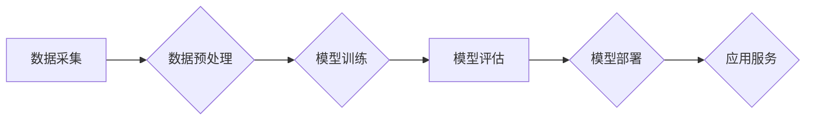

> 大模型、创业、人工智能、深度学习、Transformer、模型训练、应用场景、商业价值

## 1. 背景介绍

近年来，人工智能（AI）技术取得了飞速发展，其中大模型作为AI领域的新兴技术，展现出强大的潜力，正在深刻地改变着我们生活的方方面面。大模型是指参数规模庞大、训练数据海量的人工智能模型，其强大的学习能力和泛化能力使其能够在自然语言处理、计算机视觉、语音识别等多个领域取得突破性进展。

大模型的出现，为创业者提供了全新的机遇。其强大的功能和广泛的应用场景，为创业者提供了构建创新产品和服务的无限可能。本文将深入探讨大模型在创业领域的应用，分析其核心概念、技术原理、应用场景以及未来发展趋势，为创业者提供参考和指导。

## 2. 核心概念与联系

大模型的本质是通过深度学习算法，在海量数据上进行训练，学习到复杂的模式和规律。其核心概念包括：

* **深度学习:** 深度学习是一种机器学习的子领域，利用多层神经网络模拟人类大脑的学习过程，能够自动提取数据中的特征和模式。
* **Transformer:** Transformer是一种新型的深度学习架构，其自注意力机制能够有效捕捉文本中的长距离依赖关系，在自然语言处理领域取得了显著的成果。
* **大规模参数:** 大模型的参数数量通常在数十亿甚至数千亿级别，这使得其能够学习到更复杂的知识和模式。
* **海量数据:** 大模型的训练需要大量的训练数据，才能有效地学习到数据中的规律和模式。

**大模型架构流程图:**



## 3. 核心算法原理 & 具体操作步骤

### 3.1  算法原理概述

大模型的训练主要基于深度学习算法，其中Transformer架构是目前最流行的模型架构之一。Transformer模型的核心是自注意力机制，它能够有效地捕捉文本中的长距离依赖关系，从而提高模型的理解和生成能力。

### 3.2  算法步骤详解

大模型的训练过程可以概括为以下步骤：

1. **数据采集和预处理:** 收集大量相关数据，并进行清洗、格式化等预处理操作，使其能够被模型所理解。
2. **模型构建:** 根据任务需求选择合适的模型架构，例如Transformer，并设置模型参数。
3. **模型训练:** 使用训练数据对模型进行训练，通过调整模型参数，使模型能够准确地预测或生成目标输出。
4. **模型评估:** 使用测试数据对模型进行评估，衡量模型的性能，例如准确率、召回率等。
5. **模型部署:** 将训练好的模型部署到实际应用环境中，使其能够为用户提供服务。

### 3.3  算法优缺点

**优点:**

* 强大的学习能力：大模型能够学习到复杂的模式和规律，从而实现更精准的预测和生成。
* 泛化能力强：大模型在训练数据之外的未知数据上也能表现出良好的性能。
* 应用场景广泛：大模型可以应用于自然语言处理、计算机视觉、语音识别等多个领域。

**缺点:**

* 训练成本高：大模型的训练需要大量的计算资源和时间，成本较高。
* 数据依赖性强：大模型的性能取决于训练数据的质量和数量，数据不足或质量低劣会导致模型性能下降。
* 可解释性差：大模型的决策过程较为复杂，难以解释其背后的逻辑，这可能会导致模型的信任度降低。

### 3.4  算法应用领域

大模型在以下领域具有广泛的应用前景：

* **自然语言处理:** 文本生成、机器翻译、问答系统、情感分析等。
* **计算机视觉:** 图像识别、物体检测、图像分割、视频分析等。
* **语音识别:** 语音转文本、语音合成、语音助手等。
* **推荐系统:** 商品推荐、内容推荐、个性化服务等。
* **医疗健康:** 疾病诊断、药物研发、医疗影像分析等。

## 4. 数学模型和公式 & 详细讲解 & 举例说明

### 4.1  数学模型构建

大模型的训练过程本质上是一个优化问题，目标是找到模型参数，使得模型在训练数据上的损失函数最小。损失函数通常是模型预测值与真实值的差值，常用的损失函数包括均方误差（MSE）、交叉熵损失（Cross-Entropy Loss）等。

### 4.2  公式推导过程

假设模型的输出为 $y$，真实值是 $t$，损失函数为 $L(y,t)$，则模型训练的目标是：

$$
\min_{\theta} \mathcal{L}(\theta) = \frac{1}{N} \sum_{i=1}^{N} L(y_i, t_i)
$$

其中，$\theta$ 是模型参数，$N$ 是训练数据的数量。

通过梯度下降算法，不断更新模型参数，使得损失函数逐渐减小。梯度下降算法的基本公式为：

$$
\theta = \theta - \eta \nabla_{\theta} \mathcal{L}(\theta)
$$

其中，$\eta$ 是学习率，$\nabla_{\theta} \mathcal{L}(\theta)$ 是损失函数对模型参数的梯度。

### 4.3  案例分析与讲解

例如，在自然语言处理任务中，可以使用交叉熵损失函数来衡量模型预测的概率分布与真实概率分布之间的差异。假设模型预测某个词的概率分布为 $p = (p_1, p_2, ..., p_V)$，真实概率分布为 $t = (t_1, t_2, ..., t_V)$，其中 $V$ 是词典的大小。则交叉熵损失函数为：

$$
\mathcal{L}(p, t) = - \sum_{i=1}^{V} t_i \log p_i
$$

## 5. 项目实践：代码实例和详细解释说明

### 5.1  开发环境搭建

大模型的开发通常需要强大的计算资源和专业的开发环境。常用的开发环境包括：

* **云计算平台:** AWS、Google Cloud、Azure 等云计算平台提供强大的计算资源和机器学习服务，可以方便地进行大模型的训练和部署。
* **本地机器:** 对于小型模型，可以使用本地机器进行训练和部署，但需要配置强大的硬件设备，例如GPU。

### 5.2  源代码详细实现

由于大模型的代码实现较为复杂，这里只提供一个简单的代码示例，展示如何使用Python和TensorFlow框架构建一个简单的Transformer模型。

```python
import tensorflow as tf

# 定义Transformer模型
class Transformer(tf.keras.Model):
    def __init__(self, vocab_size, embedding_dim, num_heads, num_layers):
        super(Transformer, self).__init__()
        self.embedding = tf.keras.layers.Embedding(vocab_size, embedding_dim)
        self.transformer_layers = tf.keras.layers.StackedRNNCells([
            tf.keras.layers.MultiHeadAttention(num_heads=num_heads, key_dim=embedding_dim)
            for _ in range(num_layers)
        ])

    def call(self, inputs):
        x = self.embedding(inputs)
        x = self.transformer_layers(x)
        return x

# 实例化模型
model = Transformer(vocab_size=10000, embedding_dim=128, num_heads=8, num_layers=6)

# 编译模型
model.compile(optimizer='adam', loss='sparse_categorical_crossentropy', metrics=['accuracy'])

# 训练模型
model.fit(x_train, y_train, epochs=10)
```

### 5.3  代码解读与分析

这段代码定义了一个简单的Transformer模型，并使用TensorFlow框架进行训练。

* `Embedding`层将输入的词索引转换为词向量。
* `StackedRNNCells`层堆叠了多个`MultiHeadAttention`层，构成Transformer的编码器部分。
* `MultiHeadAttention`层是Transformer模型的核心，它能够有效地捕捉文本中的长距离依赖关系。
* `compile`方法配置了模型的优化器、损失函数和评价指标。
* `fit`方法训练模型，使用训练数据进行模型参数的更新。

### 5.4  运行结果展示

训练完成后，可以使用测试数据评估模型的性能，例如计算模型的准确率。

## 6. 实际应用场景

大模型在各个领域都有着广泛的应用场景：

### 6.1  自然语言处理

* **机器翻译:** 大模型可以实现高质量的机器翻译，例如Google Translate。
* **文本摘要:** 大模型可以自动生成文本摘要，例如新闻文章的摘要。
* **聊天机器人:** 大模型可以构建更智能的聊天机器人，例如微软的Tay。

### 6.2  计算机视觉

* **图像识别:** 大模型可以识别图像中的物体，例如Google Photos的图像识别功能。
* **物体检测:** 大模型可以检测图像中物体的位置和类别，例如自动驾驶汽车的物体检测系统。
* **图像生成:** 大模型可以生成逼真的图像，例如DALL-E 2。

### 6.3  语音识别

* **语音转文本:** 大模型可以将语音转换为文本，例如语音助手Siri。
* **语音合成:** 大模型可以将文本转换为语音，例如语音播报系统。

### 6.4  未来应用展望

随着大模型技术的不断发展，其应用场景将会更加广泛，例如：

* **个性化教育:** 根据学生的学习情况，提供个性化的学习内容和辅导。
* **医疗诊断:** 辅助医生进行疾病诊断，提高诊断准确率。
* **科学研究:** 加速科学研究的进程，例如药物研发、材料科学等。

## 7. 工具和资源推荐

### 7.1  学习资源推荐

* **书籍:**
    * 《深度学习》
    * 《Transformer 详解》
* **在线课程:**
    * Coursera上的深度学习课程
    * fast.ai的深度学习课程

### 7.2  开发工具推荐

* **TensorFlow:** 开源深度学习框架，支持大模型的训练和部署。
* **PyTorch:** 开源深度学习框架，灵活易用，适合研究和开发。
* **HuggingFace:** 提供预训练的大模型和相关的工具和资源。

### 7.3  相关论文推荐

* 《Attention Is All You Need》
* 《BERT: Pre-training of Deep Bidirectional Transformers for Language Understanding》
* 《GPT-3: Language Models are Few-Shot Learners》

## 8. 总结：未来发展趋势与挑战

### 8.1  研究成果总结

大模型技术取得了显著的进展，在自然语言处理、计算机视觉等领域取得了突破性成果。大模型的出现，为人工智能的发展带来了新的机遇和挑战。

### 8.2  未来发展趋势

* **模型规模的进一步扩大:** 未来，大模型的规模将会继续扩大，参数数量将会达到数万亿甚至数千亿级别。
* **模型训练效率的提升:** 研究人员将致力于开发更有效的训练算法和硬件平台，降低大模型的训练成本和时间。
* **模型的泛化能力和鲁棒性增强:** 研究人员将致力于提高大模型在不同领域和数据上的泛化能力和鲁棒性，使其能够更好地应对现实世界中的复杂场景。

### 8.3  面临的挑战

* **数据获取和隐私保护:** 大模型的训练需要海量数据，如何获取高质量的数据并保护用户隐私是一个重要的挑战。
* **计算资源需求:** 大模型的训练需要大量的计算资源，这对于资源有限的机构和个人来说是一个很大的负担。
* **可解释性和安全性:** 大模型的决策过程较为复杂，难以解释其背后的逻辑，这可能会导致模型的信任度降低。此外，大模型也可能被用于恶意目的，例如生成虚假信息、进行网络攻击等，因此需要加强模型的安全性和可控性。

### 8.4  研究展望

未来，大模型技术