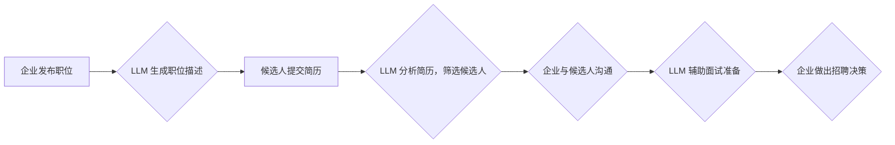

> 人工智能，LLM，招聘助手，人才匹配，自然语言处理，机器学习，深度学习

## 1. 背景介绍

在当今数字化时代，人才竞争日益激烈。企业需要高效、精准地找到最合适的候选人，以满足不断变化的业务需求。传统的招聘流程往往耗时费力，依赖于人工筛选和面试，效率低下，难以全面评估候选人的能力和潜力。

近年来，人工智能（AI）技术蓬勃发展，特别是大型语言模型（LLM）的出现，为招聘领域带来了革命性的变革。LLM 拥有强大的自然语言处理能力，能够理解和生成人类语言，并从海量文本数据中提取关键信息。

## 2. 核心概念与联系

**2.1  LLM 的核心概念**

LLM 是指训练规模庞大、参数数量众多的深度学习模型，能够理解和生成人类语言。它们通过学习海量文本数据，掌握了语言的语法、语义和上下文关系，从而能够执行各种自然语言处理任务，例如文本生成、翻译、问答、摘要等。

**2.2  招聘助手与 LLM 的联系**

招聘助手是一种利用 AI 技术辅助招聘流程的工具。LLM 可以作为招聘助手的核心引擎，发挥其强大的语言理解和生成能力，帮助企业实现以下功能：

* **简历筛选:**  LLM 可以自动分析候选人的简历，提取关键信息，例如技能、经验、教育背景等，并根据企业的需求进行筛选，快速找到符合条件的候选人。
* **职位描述生成:** LLM 可以根据企业的职位要求，自动生成清晰、准确的职位描述，吸引更多符合条件的候选人。
* **面试准备:** LLM 可以帮助候选人准备面试，提供常见面试问题和答案，并模拟面试场景，帮助候选人提升面试技巧。
* **候选人评估:** LLM 可以分析候选人的语言表达、沟通能力等，提供候选人的综合评估，帮助企业做出更准确的招聘决策。

**2.3  LLM 在招聘领域的流程图**



## 3. 核心算法原理 & 具体操作步骤

**3.1  算法原理概述**

LLM 的核心算法是基于 Transformer 架构的深度神经网络。Transformer 模型能够有效捕捉文本序列中的长距离依赖关系，从而实现更准确的语言理解和生成。

**3.2  算法步骤详解**

1. **数据预处理:** 将文本数据进行清洗、分词、标记等预处理操作，使其能够被模型理解。
2. **模型训练:** 使用大量的文本数据训练 Transformer 模型，使其能够学习语言的语法、语义和上下文关系。
3. **模型评估:** 使用测试数据评估模型的性能，例如准确率、召回率等。
4. **模型部署:** 将训练好的模型部署到服务器上，使其能够用于实际应用。

**3.3  算法优缺点**

* **优点:**
    * 强大的语言理解和生成能力
    * 可以处理长文本序列
    * 能够捕捉文本中的长距离依赖关系
* **缺点:**
    * 训练成本高
    * 模型参数量大，需要大量的计算资源
    * 容易受到训练数据质量的影响

**3.4  算法应用领域**

LLM 的应用领域非常广泛，包括：

* 自然语言处理
* 机器翻译
* 文本摘要
* 问答系统
* 聊天机器人
* 代码生成
* 等等

## 4. 数学模型和公式 & 详细讲解 & 举例说明

**4.1  数学模型构建**

Transformer 模型的核心是注意力机制，它能够学习文本序列中不同词之间的关系，并赋予每个词不同的权重。注意力机制的数学公式如下：

$$
Attention(Q, K, V) = softmax(\frac{QK^T}{\sqrt{d_k}})V
$$

其中：

* $Q$：查询矩阵
* $K$：键矩阵
* $V$：值矩阵
* $d_k$：键向量的维度
* $softmax$：softmax 函数

**4.2  公式推导过程**

注意力机制的公式通过计算查询向量 $Q$ 与键向量 $K$ 的点积，并使用 softmax 函数将其归一化，得到每个键向量对应的权重。然后，将这些权重与值向量 $V$ 进行加权求和，得到最终的输出。

**4.3  案例分析与讲解**

例如，在翻译句子 "The cat sat on the mat" 时，注意力机制可以学习到 "cat" 与 "sat" 之间的语义关系，并将 "mat" 作为 "sat" 的上下文信息，从而更准确地翻译成 "猫坐在垫子上"。

## 5. 项目实践：代码实例和详细解释说明

**5.1  开发环境搭建**

* Python 3.7+
* TensorFlow 或 PyTorch
* CUDA 和 cuDNN

**5.2  源代码详细实现**

```python
import tensorflow as tf

# 定义 Transformer 模型
class Transformer(tf.keras.Model):
    def __init__(self, vocab_size, embedding_dim, num_heads, num_layers):
        super(Transformer, self).__init__()
        self.embedding = tf.keras.layers.Embedding(vocab_size, embedding_dim)
        self.transformer_layers = [
            tf.keras.layers.MultiHeadAttention(num_heads=num_heads, key_dim=embedding_dim)
            for _ in range(num_layers)
        ]
        self.dense = tf.keras.layers.Dense(vocab_size)

    def call(self, inputs):
        # ...
```

**5.3  代码解读与分析**

* `embedding` 层将单词转换为向量表示。
* `transformer_layers` 包含多个 Transformer 层，每个层包含多头注意力机制和前馈神经网络。
* `dense` 层将 Transformer 输出转换为单词概率分布。

**5.4  运行结果展示**

训练好的 Transformer 模型可以用于各种自然语言处理任务，例如文本生成、机器翻译、问答系统等。

## 6. 实际应用场景

**6.1  简历筛选**

LLM 可以分析候选人的简历，提取关键信息，例如技能、经验、教育背景等，并根据企业的需求进行筛选，快速找到符合条件的候选人。

**6.2  职位描述生成**

LLM 可以根据企业的职位要求，自动生成清晰、准确的职位描述，吸引更多符合条件的候选人。

**6.3  面试准备**

LLM 可以帮助候选人准备面试，提供常见面试问题和答案，并模拟面试场景，帮助候选人提升面试技巧。

**6.4  未来应用展望**

* **个性化招聘:** 根据候选人的兴趣和技能，推荐合适的职位和公司。
* **虚拟面试:** 使用 AI 虚拟助手进行面试，提高招聘效率。
* **人才预测:** 利用 LLM 分析人才市场趋势，预测未来人才需求。

## 7. 工具和资源推荐

**7.1  学习资源推荐**

* **书籍:**
    * 《深度学习》
    * 《自然语言处理》
* **在线课程:**
    * Coursera
    * edX
    * fast.ai

**7.2  开发工具推荐**

* **TensorFlow:** 开源深度学习框架
* **PyTorch:** 开源深度学习框架
* **Hugging Face:** 提供预训练的 LLM 模型和工具

**7.3  相关论文推荐**

* 《Attention Is All You Need》
* 《BERT: Pre-training of Deep Bidirectional Transformers for Language Understanding》
* 《GPT-3: Language Models are Few-Shot Learners》

## 8. 总结：未来发展趋势与挑战

**8.1  研究成果总结**

LLM 在招聘领域取得了显著的成果，例如提高了简历筛选效率、优化了职位描述生成、辅助了面试准备等。

**8.2  未来发展趋势**

* **模型规模和性能提升:** 随着计算资源的不断发展，LLM 的规模和性能将进一步提升，能够处理更复杂的任务。
* **多模态学习:** LLM 将与其他模态数据，例如图像、音频等进行融合，实现更全面的人才评估。
* **伦理和公平性:** 需要关注 LLM 在招聘领域的伦理和公平性问题，避免算法歧视和偏见。

**8.3  面临的挑战**

* **数据质量:** LLM 的性能依赖于训练数据的质量，需要收集和清洗高质量的招聘数据。
* **解释性和透明度:** LLM 的决策过程往往难以解释，需要提高模型的透明度和可解释性。
* **安全性和隐私性:** 需要确保 LLM 在招聘过程中保护候选人的隐私信息，防止数据泄露和滥用。

**8.4  研究展望**

未来，LLM 在招聘领域的应用将更加广泛和深入，为企业和候选人提供更智能、高效、公平的招聘服务。


## 9. 附录：常见问题与解答

**9.1  LLM 是否会取代招聘人员？**

LLM 可以辅助招聘人员完成一些重复性工作，例如简历筛选和职位描述生成，但它并不会完全取代招聘人员。招聘人员仍然需要负责评估候选人的综合能力、进行面试和最终做出招聘决策。

**9.2  如何确保 LLM 在招聘过程中公平公正？**

需要使用公平的训练数据，并对模型进行定期评估，以确保其不会产生歧视或偏见。

**9.3  LLM 的数据安全和隐私保护如何保障？**

需要采取相应的技术措施，例如数据加密、匿名化等，保护候选人的隐私信息。

作者：禅与计算机程序设计艺术 / Zen and the Art of Computer Programming 


<end_of_turn>