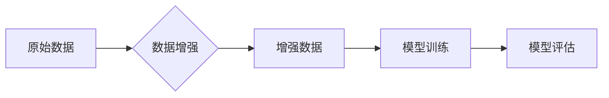

> 数据增强、过拟合、机器学习、深度学习、模型泛化能力

## 1. 背景介绍

在机器学习和深度学习领域，训练模型的性能通常取决于训练数据的质量和数量。然而，现实世界中，高质量的标注数据往往稀缺且昂贵。为了解决这个问题，数据增强技术应运而生，它通过对现有数据的变换和修改，生成新的训练样本，从而有效地扩充训练数据集，提升模型的泛化能力。

过拟合是机器学习模型训练过程中一个常见的问题，是指模型在训练数据上表现良好，但在未见过的数据上表现较差。过拟合的原因是模型过于复杂，学习了训练数据中的噪声和随机性，导致模型无法很好地泛化到新的数据。数据增强可以有效地缓解过拟合问题，因为它可以增加训练数据的多样性，使模型学习到更通用的特征。

## 2. 核心概念与联系

数据增强是一种通过对原始数据进行各种变换，生成新的训练样本的技术。这些变换可以是图像、文本、音频等不同类型数据的，其目的是增加训练数据的多样性，从而提高模型的泛化能力。

**数据增强与过拟合的关系：**

过拟合是指模型在训练数据上表现良好，但在未见过的数据上表现较差。数据增强可以有效地缓解过拟合问题，因为它可以增加训练数据的多样性，使模型学习到更通用的特征。

**数据增强与模型泛化能力的关系：**

模型泛化能力是指模型在未见过的数据上表现的能力。数据增强可以提高模型的泛化能力，因为它可以使模型学习到更通用的特征。

**数据增强流程图：**



## 3. 核心算法原理 & 具体操作步骤

### 3.1  算法原理概述

数据增强算法的原理是通过对原始数据进行各种变换，生成新的训练样本，从而增加训练数据的多样性。这些变换可以是图像、文本、音频等不同类型数据的，其目的是使模型学习到更通用的特征，从而提高模型的泛化能力。

### 3.2  算法步骤详解

1. **选择数据增强技术：**根据数据的类型和任务需求，选择合适的增强技术。例如，对于图像数据，可以采用旋转、缩放、裁剪、翻转等变换；对于文本数据，可以采用词嵌入、 synonym replacement、back translation 等技术。
2. **参数设置：**根据具体任务和数据特点，设置数据增强技术的参数。例如，旋转角度、缩放比例、裁剪区域等。
3. **数据增强：**使用选择的增强技术对原始数据进行变换，生成新的训练样本。
4. **数据评估：**评估增强后的数据是否满足需求，例如，是否增加了数据的多样性，是否降低了模型的过拟合风险。

### 3.3  算法优缺点

**优点：**

* 能够有效地增加训练数据的数量和多样性。
* 可以有效地缓解过拟合问题，提高模型的泛化能力。
* 相对简单易实现，成本较低。

**缺点：**

* 增强后的数据可能与真实数据存在偏差，导致模型性能下降。
* 需要根据具体任务和数据特点选择合适的增强技术和参数，否则可能会导致模型性能下降。

### 3.4  算法应用领域

数据增强技术广泛应用于各种机器学习和深度学习领域，例如：

* **计算机视觉：**图像分类、目标检测、图像分割等。
* **自然语言处理：**文本分类、情感分析、机器翻译等。
* **语音识别：**语音识别、语音合成等。

## 4. 数学模型和公式 & 详细讲解 & 举例说明

### 4.1  数学模型构建

数据增强算法通常可以看作是一种概率模型，它定义了对原始数据进行变换的概率分布。例如，对于图像数据，可以定义一个旋转角度的概率分布，使得图像以不同的角度进行旋转。

### 4.2  公式推导过程

数据增强算法的具体公式推导过程取决于具体的增强技术。例如，对于图像的旋转增强，可以利用旋转矩阵进行变换，公式如下：

$$
R(\theta) = \begin{bmatrix}
\cos(\theta) & -\sin(\theta) \\
\sin(\theta) & \cos(\theta)
\end{bmatrix}
$$

其中，$\theta$ 是旋转角度。

### 4.3  案例分析与讲解

假设我们有一个图像数据集，用于训练一个图像分类模型。为了提高模型的泛化能力，我们可以使用数据增强技术对图像进行旋转增强。

我们可以定义一个旋转角度的概率分布，例如，以均匀分布的方式选择旋转角度，范围为0到360度。然后，对每个图像进行旋转变换，生成新的训练样本。

通过这种方式，我们可以增加训练数据的多样性，使模型学习到更通用的特征，从而提高模型的泛化能力。

## 5. 项目实践：代码实例和详细解释说明

### 5.1  开发环境搭建

本项目使用Python语言进行开发，所需的库包括：

* TensorFlow 或 PyTorch：深度学习框架
* OpenCV：图像处理库
* NumPy：数值计算库

### 5.2  源代码详细实现

```python
import tensorflow as tf
from tensorflow.keras.preprocessing.image import ImageDataGenerator

# 定义数据增强参数
datagen = ImageDataGenerator(
    rotation_range=20,
    width_shift_range=0.2,
    height_shift_range=0.2,
    shear_range=0.2,
    zoom_range=0.2,
    horizontal_flip=True,
    fill_mode='nearest'
)

# 加载训练数据
train_generator = datagen.flow_from_directory(
    'data/train',
    target_size=(224, 224),
    batch_size=32,
    class_mode='categorical'
)

# 训练模型
model = tf.keras.models.Sequential([
    # ... 模型结构 ...
])
model.compile(optimizer='adam',
              loss='categorical_crossentropy',
              metrics=['accuracy'])
model.fit(train_generator, epochs=10)
```

### 5.3  代码解读与分析

* `ImageDataGenerator`类提供了多种数据增强功能，例如旋转、缩放、平移、剪切、翻转等。
* `flow_from_directory`方法可以从目录中加载图像数据，并自动生成标签。
* `rotation_range`参数控制图像旋转的角度范围。
* `width_shift_range`和`height_shift_range`参数控制图像水平和垂直方向的平移范围。
* `shear_range`参数控制图像的剪切角度范围。
* `zoom_range`参数控制图像的缩放范围。
* `horizontal_flip`参数控制是否水平翻转图像。
* `fill_mode`参数控制图像填充方式。

### 5.4  运行结果展示

通过运行上述代码，可以观察到训练过程中模型的准确率和损失值的变化趋势。

## 6. 实际应用场景

### 6.1  图像分类

在图像分类任务中，数据增强可以有效地增加训练数据的数量和多样性，从而提高模型的泛化能力。例如，在识别不同类型的动物的图像分类任务中，可以使用数据增强技术对动物图像进行旋转、缩放、裁剪等变换，生成新的训练样本，从而提高模型对不同角度、大小、位置的动物图像的识别准确率。

### 6.2  目标检测

在目标检测任务中，数据增强可以帮助模型学习到更通用的目标特征，从而提高模型对不同场景、不同角度、不同尺度的目标的检测准确率。例如，在检测车辆的图像目标检测任务中，可以使用数据增强技术对车辆图像进行旋转、缩放、裁剪等变换，生成新的训练样本，从而提高模型对不同角度、不同尺度的车辆的检测准确率。

### 6.3  图像分割

在图像分割任务中，数据增强可以帮助模型学习到更精细的图像细节，从而提高模型对图像的分割准确率。例如，在分割医学图像中的器官的图像分割任务中，可以使用数据增强技术对器官图像进行旋转、缩放、裁剪等变换，生成新的训练样本，从而提高模型对不同角度、不同尺度的器官的分割准确率。

### 6.4  未来应用展望

随着人工智能技术的不断发展，数据增强技术将会在更多领域得到应用。例如，在自动驾驶、医疗诊断、机器人控制等领域，数据增强技术可以帮助模型学习到更丰富的知识和经验，从而提高模型的性能和可靠性。

## 7. 工具和资源推荐

### 7.1  学习资源推荐

* **书籍：**
    * 《Deep Learning》 by Ian Goodfellow, Yoshua Bengio, and Aaron Courville
    * 《Hands-On Machine Learning with Scikit-Learn, Keras & TensorFlow》 by Aurélien Géron
* **在线课程：**
    * Coursera: Deep Learning Specialization
    * Udacity: Deep Learning Nanodegree
* **博客和网站：**
    * TensorFlow Blog: https://blog.tensorflow.org/
    * PyTorch Blog: https://pytorch.org/blog/

### 7.2  开发工具推荐

* **TensorFlow:** https://www.tensorflow.org/
* **PyTorch:** https://pytorch.org/
* **OpenCV:** https://opencv.org/

### 7.3  相关论文推荐

* **Data Augmentation for Deep Learning: A Survey** by Shorten and Khoshgoftaar (2019)
* **CutMix: Regularization Strategy to Train Strong Classifiers with Localizable Features** by Yun et al. (2019)
* **Mixup: Beyond Empirical Risk Minimization** by Zhang et al. (2018)

## 8. 总结：未来发展趋势与挑战

### 8.1  研究成果总结

数据增强技术在机器学习和深度学习领域取得了显著的成果，有效地缓解了过拟合问题，提高了模型的泛化能力。

### 8.2  未来发展趋势

未来，数据增强技术将会朝着以下几个方向发展：

* **更智能的数据增强：**利用人工智能技术，自动生成更有效的增强策略，并根据模型的训练情况动态调整增强策略。
* **跨模态数据增强：**将不同模态的数据进行融合，例如将图像和文本数据进行结合，生成更丰富的训练样本。
* **对抗性数据增强：**生成对抗性样本，提高模型对攻击的鲁棒性。

### 8.3  面临的挑战

数据增强技术也面临着一些挑战：

* **增强后的数据质量：**需要保证增强后的数据质量，避免引入噪声或偏差。
* **计算资源消耗：**一些数据增强技术需要大量的计算资源，这可能会限制其在实际应用中的推广。
* **数据隐私问题：**在某些情况下，数据增强可能会泄露敏感信息，需要考虑数据隐私问题。

### 8.4  研究展望

未来，数据增强技术的研究将继续深入，探索更智能、更有效的增强策略，并解决数据增强技术面临的挑战，使其在更多领域得到应用。

## 9. 附录：常见问题与解答

**1. 数据增强会降低模型的性能吗？**

数据增强通常不会降低模型的性能，反而可以提高模型的性能。但是，如果数据增强的方式不当，可能会导致模型性能下降。因此，需要根据具体任务和数据特点选择合适的增强技术和参数。

**2. 数据增强需要多少数据才能有效？**

数据增强的效果与训练数据的数量有关。对于小规模数据集，数据增强可以起到显著的提升效果。对于大规模数据集，数据增强仍然可以提高模型的性能，但提升效果可能相对较小。

**3. 数据增强有哪些常见的技术？**

常见的图像数据增强技术包括旋转、缩放、裁剪、翻转、加噪声等。常见的文本数据增强技术包括词嵌入、 synonym replacement、back translation 等。

**4. 如何选择合适的增强技术和参数？**

选择合适的增强