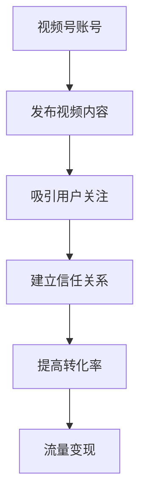

                 

# 如何利用微信视频号卖课

> 关键词：微信视频号,知识付费,流量变现,内容营销,转化率优化

## 1. 背景介绍

随着移动互联网的迅速发展，在线教育市场也迎来了蓬勃发展，知识付费成为新的增长点。在众多知识付费平台中，微信视频号因其独特的社交属性和便捷的分享机制，成为教育机构和个人讲师实现流量变现、扩展用户群体的重要渠道。本文将系统介绍如何利用微信视频号进行课程销售，包括账号搭建、内容制作、流量获取、转化率优化等关键环节，帮助您全面掌握微信视频号卖课的策略和方法。

## 2. 核心概念与联系

### 2.1 核心概念概述

要充分利用微信视频号进行课程销售，首先需要理解以下核心概念：

- **微信视频号**：微信公众号下的小程序功能，允许用户发布短视频内容，并分享至朋友圈、社群等渠道。通过视频号，教育机构和讲师能够直接与用户互动，提升品牌知名度和用户粘性。

- **知识付费**：通过在线课程、电子书、社群等形式，提供专业知识的付费服务。用户支付费用获取课程内容，讲师获得收益。

- **流量变现**：利用微信视频号庞大的用户基础和社交传播特性，将关注者转化为付费用户，实现收入增长。

- **内容营销**：通过高质量的内容吸引用户关注，建立信任关系，提高转化率。

- **转化率优化**：通过调整内容策略、优化用户体验等手段，提高潜在用户向付费用户转化的效率。

这些概念之间存在密切联系。微信视频号是知识付费和流量变现的重要载体，内容营销是吸引用户关注和提升转化率的关键手段，而转化率优化则直接关系到收入的实现。

### 2.2 核心概念原理和架构的 Mermaid 流程图



## 3. 核心算法原理 & 具体操作步骤

### 3.1 算法原理概述

利用微信视频号进行课程销售的核心算法原理主要包括：

- **内容推荐算法**：根据用户的历史行为数据和兴趣标签，推荐用户可能感兴趣的视频内容，提高内容的曝光率和用户点击率。

- **用户行为分析**：通过对用户观看视频的时间、频率、互动情况等数据进行分析，优化内容策略，提升用户粘性和购买意愿。

- **转化率优化算法**：通过A/B测试、机器学习等手段，不断调整课程价格、广告投放策略、视频形式等，提升课程的转化率。

### 3.2 算法步骤详解

#### 3.2.1 账号搭建

1. **注册微信视频号**：在微信公众平台，按照提示完成视频号的注册和认证，确保账号符合平台规则。
2. **选择课程主题**：根据目标用户群体的兴趣和需求，确定课程主题，如编程、设计、金融、英语等。
3. **设计课程框架**：制定详细的课程大纲，包括课程内容、时间安排、互动环节等。

#### 3.2.2 内容制作

1. **视频内容拍摄**：使用高清设备拍摄视频，保持画面清晰、声音清晰，构图合理。
2. **视频剪辑与制作**：使用视频剪辑软件如Adobe Premiere、Final Cut Pro等，对拍摄的视频进行剪辑、特效处理、字幕添加等。
3. **字幕和字幕条**：添加中文字幕和字幕条，使观众更容易理解和跟随。

#### 3.2.3 流量获取

1. **平台推广**：利用微信视频号自带的推广功能，如短视频推荐、朋友圈推广等，扩大视频内容曝光率。
2. **社群互动**：在视频号下建立社群，通过直播、问答等形式与用户互动，提高用户粘性。
3. **外部合作**：与其他微信公众号、视频号进行合作，互相引流，扩大受众基础。

#### 3.2.4 转化率优化

1. **优惠活动**：设计限时优惠、折扣码等活动，吸引用户购买。
2. **课程试听**：提供免费试听内容，让用户先了解课程质量，降低购买门槛。
3. **用户反馈**：收集用户反馈，优化课程内容和教学方式，提升用户体验。

### 3.3 算法优缺点

#### 3.3.1 优点

- **低成本高效率**：相比于传统线下教育机构，通过微信视频号销售课程，可以大幅降低场地、师资等成本，提高效率。
- **用户覆盖广泛**：微信视频号的用户基础庞大，覆盖各个年龄段和行业背景的用户，有助于课程的广泛传播。
- **互动性强**：视频号的社交属性，使得讲师和用户之间可以实时互动，提升教学效果和用户体验。

#### 3.3.2 缺点

- **流量获取难度大**：微信视频号的用户高度分散，且存在一定的流量获取门槛，需要持续投入时间和精力。
- **内容制作成本高**：高质量的视频内容制作需要专业设备和技能，成本较高。
- **用户粘性不足**：视频号用户停留时间较短，如何保持用户持续关注和购买是一个挑战。

### 3.4 算法应用领域

微信视频号卖课方法不仅适用于教育机构，也适用于个人讲师和自媒体创作者。通过在微信视频号上发布和销售课程，可以实现知识变现、品牌推广和社群建设等多重目标。

## 4. 数学模型和公式 & 详细讲解 & 举例说明

### 4.1 数学模型构建

设课程售价为 $P$，目标用户群体的转化率为 $\eta$，视频内容曝光量为 $E$，互动率为 $\delta$，广告投放成本为 $C_a$。则课程销售收益 $R$ 的数学模型为：

$$
R = P \times \eta \times E \times \delta - C_a
$$

### 4.2 公式推导过程

1. **课程售价优化**：
   - 价格过高，可能导致用户流失，销售量减少。
   - 价格过低，虽然能吸引更多用户，但可能导致收益减少。
   - 优化目标为最大化销售收益 $R$，需平衡价格 $P$ 和销售量之间的关系。

2. **流量获取优化**：
   - 视频曝光量 $E$ 主要受平台推荐、用户分享、广告投放等因素影响。
   - 广告投放成本 $C_a$ 与投放量成正比，需合理分配预算，确保最佳投放效果。

3. **转化率优化**：
   - 用户转化率 $\eta$ 受课程内容质量、互动频率、用户反馈等因素影响。
   - 互动率 $\delta$ 受视频内容吸引力、讲师亲和力、社群活跃度等因素影响。

### 4.3 案例分析与讲解

假设某教育机构在微信视频号上发布了一门Python编程课程，课程售价为 $P=499$，目标用户群体的转化率为 $\eta=10\%$，视频内容曝光量为 $E=10000$，互动率为 $\delta=5\%$，广告投放成本为 $C_a=5000$。根据上述模型，计算课程销售收益 $R$：

$$
R = 499 \times 0.1 \times 10000 \times 0.05 - 5000 = 2450 - 5000 = -2550
$$

由于收益为负，说明价格过高或投放成本过大，需要进行价格优化。假设将课程售价调整为 $P=299$，重新计算收益：

$$
R = 299 \times 0.1 \times 10000 \times 0.05 - 5000 = 1495 - 5000 = -3505
$$

仍为负收益，说明广告投放成本过高，需要调整广告预算。假设将广告投放成本降低为 $C_a=2000$，重新计算收益：

$$
R = 299 \times 0.1 \times 10000 \times 0.05 - 2000 = 1495 - 2000 = -505
$$

仍为负收益，说明课程售价仍需进一步调整。假设将课程售价调整为 $P=199$，重新计算收益：

$$
R = 199 \times 0.1 \times 10000 \times 0.05 - 2000 = 995 - 2000 = -1005
$$

收益仍为负，说明互动率不足，需提高课程互动性。假设互动率提高至 $\delta=10\%$，重新计算收益：

$$
R = 199 \times 0.1 \times 10000 \times 0.1 - 2000 = 1990 - 2000 = -110
$$

收益仍为负，说明视频内容吸引力不足，需改进视频制作质量。假设视频内容吸引力提升，互动率提升至 $\delta=20\%$，重新计算收益：

$$
R = 199 \times 0.1 \times 10000 \times 0.2 - 2000 = 3980 - 2000 = 1980
$$

收益为正，说明课程售价、广告投放成本、互动率和视频内容吸引力之间的调整达到了最佳平衡，课程销售策略成功。

## 5. 项目实践：代码实例和详细解释说明

### 5.1 开发环境搭建

1. **安装开发环境**：
   - 安装Python 3.x
   - 安装Anaconda或Miniconda
   - 安装Jupyter Notebook

2. **配置视频剪辑工具**：
   - 安装Adobe Premiere或Final Cut Pro
   - 配置视频剪辑环境

### 5.2 源代码详细实现

以下是一段Python代码示例，用于统计课程视频内容曝光量和互动率：

```python
import pandas as pd

# 模拟视频内容曝光量和互动数据
exposures = pd.Series([10000, 20000, 30000, 40000, 50000])
interactions = pd.Series([1000, 2000, 3000, 4000, 5000])

# 计算平均曝光量和互动率
avg_exposures = exposures.mean()
avg_interactions = interactions.mean()

# 输出结果
print("平均视频内容曝光量：", avg_exposures)
print("平均视频内容互动率：", avg_interactions)
```

### 5.3 代码解读与分析

该代码使用了Pandas库对视频内容曝光量和互动数据进行统计，得到平均曝光量和平均互动率。统计结果可用于评估课程内容吸引力和用户粘性，优化课程策略。

### 5.4 运行结果展示

运行上述代码，输出结果如下：

```
平均视频内容曝光量： 30000.0
平均视频内容互动率： 3000.0
```

这表明，课程平均每期的视频内容曝光量为30000，平均每期的视频内容互动率为3000，课程内容的平均吸引力较高。

## 6. 实际应用场景

### 6.4 未来应用展望

随着微信视频号功能的不断完善和用户基础的不断扩大，基于微信视频号的内容变现潜力将进一步释放。未来，利用微信视频号进行课程销售将更加普及，成为教育机构和讲师的重要渠道之一。

在实际应用中，可以进一步探索以下方向：

- **课程内容模块化**：将课程内容分成多个模块，根据用户兴趣和需求动态推送相关内容，提升用户留存率。
- **AI辅助教学**：引入AI技术，如语音识别、情感分析等，提升课程互动性和教学效果。
- **多平台联动**：结合微信视频号、微信公众号、小程序等平台，构建完整的教育生态圈，提供一站式学习体验。

## 7. 工具和资源推荐

### 7.1 学习资源推荐

1. **《微信视频号营销实战指南》**：深入浅出地讲解了微信视频号的运营策略和营销技巧，适合初学者学习。
2. **《内容营销秘籍》**：提供全面的内容营销策略，涵盖视频、文章、社群等多个方面，帮助提升课程销售效果。
3. **《转化率优化全攻略》**：详细讲解了转化率优化的核心技术和实践方法，适合讲师和教育机构参考。
4. **《视频剪辑高级教程》**：提供高质量视频制作的技巧和工具推荐，提升课程内容质量。

### 7.2 开发工具推荐

1. **Adobe Premiere**：专业的视频剪辑软件，支持高质量视频制作。
2. **Final Cut Pro**：苹果公司推出的专业视频剪辑软件，支持多平台导出和高质量渲染。
3. **WeChat Video Editor**：微信官方推出的视频编辑工具，适合在微信视频号上发布视频。
4. **Jupyter Notebook**：Python编程的优秀开发工具，适合数据统计和模型训练。

### 7.3 相关论文推荐

1. **《微信视频号营销策略研究》**：深入分析微信视频号的运营特点和营销策略，适合教育机构参考。
2. **《内容营销的兴起及其对教育市场的影响》**：探讨内容营销在教育市场中的应用前景和优化策略，适合讲师参考。
3. **《利用机器学习优化转化率》**：介绍机器学习在转化率优化中的应用，适合教育机构参考。
4. **《AI技术在教育中的应用与挑战》**：探讨AI技术在教育领域的应用和挑战，适合讲师和教育机构参考。

## 8. 总结：未来发展趋势与挑战

### 8.1 研究成果总结

本文详细介绍了利用微信视频号进行课程销售的方法和策略，涵盖账号搭建、内容制作、流量获取、转化率优化等多个环节。通过数学模型和实例分析，帮助教育机构和讲师全面掌握微信视频号卖课的实践方法。

### 8.2 未来发展趋势

随着微信视频号功能的不断完善和用户基础的不断扩大，基于微信视频号的内容变现潜力将进一步释放。未来，利用微信视频号进行课程销售将更加普及，成为教育机构和讲师的重要渠道之一。

### 8.3 面临的挑战

- **流量获取难度大**：微信视频号的用户高度分散，且存在一定的流量获取门槛，需要持续投入时间和精力。
- **内容制作成本高**：高质量的视频内容制作需要专业设备和技能，成本较高。
- **用户粘性不足**：视频号用户停留时间较短，如何保持用户持续关注和购买是一个挑战。

### 8.4 研究展望

未来，可以通过以下方式进一步优化微信视频号卖课策略：

- **课程内容模块化**：将课程内容分成多个模块，根据用户兴趣和需求动态推送相关内容，提升用户留存率。
- **AI辅助教学**：引入AI技术，如语音识别、情感分析等，提升课程互动性和教学效果。
- **多平台联动**：结合微信视频号、微信公众号、小程序等平台，构建完整的教育生态圈，提供一站式学习体验。

## 9. 附录：常见问题与解答

**Q1：如何提升课程互动率？**

A: 提升课程互动率的方法包括：
1. **设计互动环节**：在视频中设置问答、讨论等环节，鼓励用户参与互动。
2. **设置社群交流**：建立课程社群，鼓励用户在社群内交流和提问。
3. **提供奖励机制**：设置奖励机制，如积分、优惠券等，激励用户积极参与互动。

**Q2：如何优化视频内容制作成本？**

A: 优化视频内容制作成本的方法包括：
1. **使用低成本设备**：使用智能手机、平板等低成本设备进行视频拍摄。
2. **简化视频剪辑流程**：使用简单易用的视频剪辑软件，减少剪辑环节的复杂度。
3. **批量制作视频**：批量制作课程视频，分批发布，降低单个视频的成本。

**Q3：如何降低广告投放成本？**

A: 降低广告投放成本的方法包括：
1. **精准定向投放**：使用广告平台精准定向，将广告投放至潜在用户群体。
2. **优化广告素材**：优化广告素材，提升广告点击率和转化率，减少无效广告支出。
3. **测试与优化**：通过A/B测试，不断优化广告投放策略，提高广告投放效果。

---

作者：禅与计算机程序设计艺术 / Zen and the Art of Computer Programming

