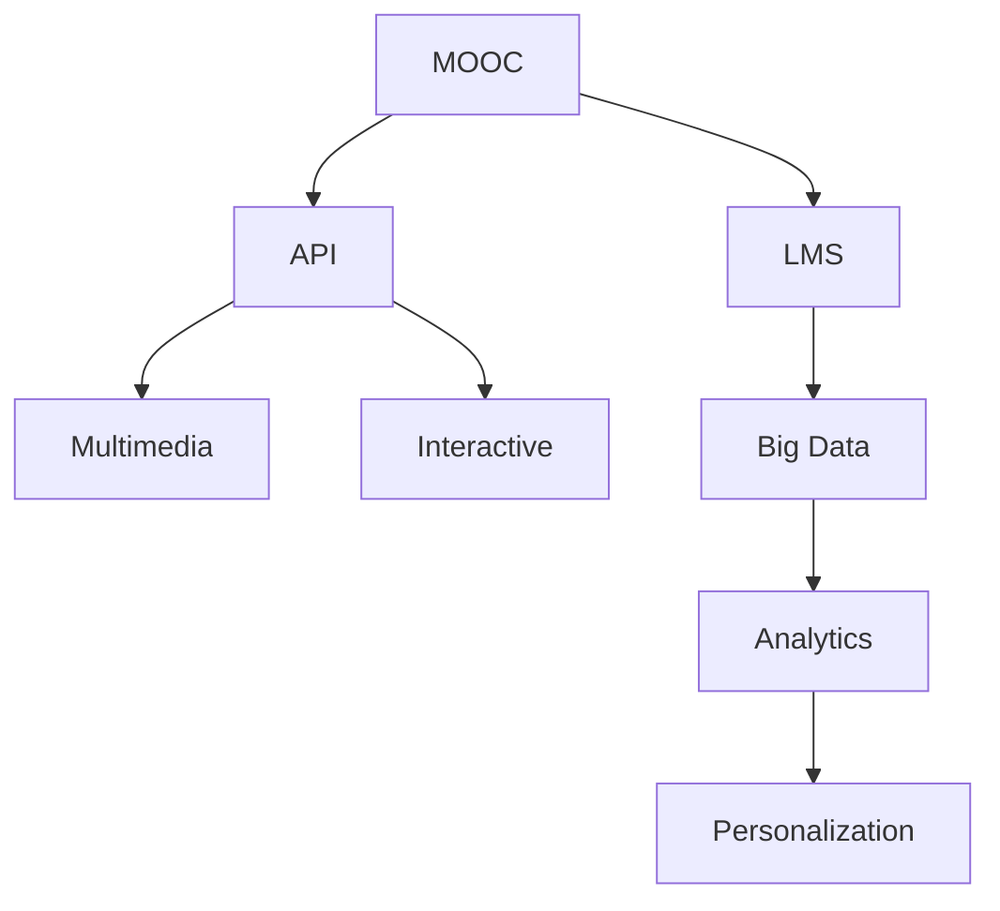

                 

# 如何利用技术能力创建在线课程

## 1. 背景介绍

随着互联网技术的飞速发展，在线教育成为教育行业的新兴热点。传统教育模式已无法满足人们对高效、个性化学习的需求。在线课程以其灵活、便捷、互动性强等特点，迅速吸引了全球数亿学习者的关注。然而，高质量的在线课程不仅仅是讲师内容的堆砌，更离不开先进的技术支撑。本文将从技术角度深入探讨如何利用技术能力创建在线课程。

## 2. 核心概念与联系

### 2.1 核心概念概述

为了更好地理解在线课程的技术实现，本节将介绍几个关键概念：

- **MOOC（大规模开放在线课程）**：一种通过互联网免费提供给全球学习者的在线课程模式。典型代表包括Coursera、edX、Udacity等平台。

- **LMS（学习管理系统）**：用于支持在线课程管理和学习的系统。主要包括课程创建、教学管理、学生互动等功能。

- **API（应用程序编程接口）**：在线课程与外界系统交互的标准接口，用于课程内容的发布、学习数据的收集、学籍管理等。

- **多媒体技术**：包括视频、音频、图文等多种形式的教学内容，通过流媒体技术进行实时播放和点播。

- **交互技术**：如虚拟现实(VR)、增强现实(AR)、在线讨论区、实时问答等，提升学习者的互动体验。

- **大数据分析**：通过对学习数据的收集和分析，提供个性化学习建议，优化课程内容。

这些核心概念之间通过以下Mermaid流程图来展示：



这个流程图展示了MOOC、LMS、API、多媒体、交互技术和大数据分析在在线课程中的联系。MOOC平台通过LMS进行课程管理和学习，API用于课程内容的发布和学籍管理，多媒体技术提供丰富的教学资源，交互技术增强学习体验，大数据分析通过个性化学习建议来优化课程内容。

## 3. 核心算法原理 & 具体操作步骤

### 3.1 算法原理概述

在线课程的核心在于内容设计和个性化学习。通过先进的算法和模型，可以实现高效的内容制作和个性化推荐。本节将详细介绍其中的关键算法原理和具体操作步骤。

- **内容生成算法**：包括文本生成、图像生成、视频编辑等，用于构建丰富的教学资源。
- **推荐算法**：如协同过滤、基于内容的推荐、矩阵分解等，用于个性化课程推荐。
- **评估算法**：如学习行为分析、学习成果评估等，用于衡量课程效果。

### 3.2 算法步骤详解

在线课程的创建通常包括以下几个关键步骤：

**Step 1: 课程设计**
- 确定课程目标和结构，设计教学大纲，选择合适的教学内容。
- 设计课程评估标准，明确学习成果和考核方式。

**Step 2: 内容制作**
- 利用多媒体技术制作教学视频、音频、演示文稿等。
- 编写教学脚本、练习题、阅读材料等，构建完整的课程资源。

**Step 3: LMS系统搭建**
- 选择合适的LMS平台，进行课程创建和设置。
- 添加教学视频、文档、练习题等资源，设计课程评估和互动功能。

**Step 4: 接口开发**
- 设计API接口，用于课程发布、学习数据收集、学籍管理等功能。
- 使用Python、Java、Ruby等语言进行接口开发，确保与外部系统兼容。

**Step 5: 数据分析与优化**
- 通过大数据分析工具收集学习行为数据，分析课程效果。
- 根据分析结果优化课程内容和教学策略，提升学习体验。

**Step 6: 部署上线**
- 将课程发布到MOOC平台或自有网站，通过API提供学习接口。
- 设置课程注册、登录、学习、互动等功能，确保课程稳定运行。

### 3.3 算法优缺点

在线课程创建的优势在于灵活性和互动性，但也存在一些挑战：

**优点**：
- 学习时间和地点灵活，适应多样化学习需求。
- 利用大数据和个性化推荐，提升学习效果。
- 互动技术增强学习体验，提高学习动机。

**缺点**：
- 课程质量依赖于讲师和内容制作，难以保证一致性。
- 学习自我管理能力要求高，容易产生学习倦怠。
- 技术实现复杂，需要多学科人才合作。

### 3.4 算法应用领域

在线课程的应用范围非常广泛，涵盖了从基础教育到职业培训的多个领域：

- **基础教育**：小学、初中、高中等阶段的学科课程。
- **职业教育**：技能培训、职业认证等课程。
- **终身学习**：兴趣课程、生活技能、语言学习等。
- **企业培训**：员工技能提升、职业发展等。
- **学术研究**：科学实验、论文写作等课程。

## 4. 数学模型和公式 & 详细讲解

### 4.1 数学模型构建

在线课程的质量评估和推荐系统设计离不开数学模型的支持。本节将介绍几个关键数学模型及其构建方法。

- **协同过滤模型**：通过用户行为数据，推荐与用户偏好相似的其他课程。
- **矩阵分解模型**：通过分解用户行为矩阵，获取用户和课程的潜在特征，进行精准推荐。
- **深度学习模型**：如CNN、RNN、Transformer等，用于生成高质量的教学内容。

### 4.2 公式推导过程

以协同过滤模型为例，推导其计算公式：

设用户$u$对课程$i$的评分$R_{ui}$为$R$，对课程$j$的评分$R_{uj}$为$R_j$。协同过滤模型的目标是通过相似性度量，为用户推荐评分较高的课程。假设用户$u$和课程$i$的评分相似度为$\theta_{ui}$，则推荐相似度$sim(u,i)$为：

$$
sim(u,i) = \theta_{ui} = \frac{R_{ui}R_i}{\sqrt{R_{ui}R_j} \sqrt{R_iR_j}}
$$

推荐课程$j$的评分预测值为：

$$
\hat{R}_{uj} = R_j \cdot sim(u,i)
$$

其中$R_i$为课程$i$的平均评分。

### 4.3 案例分析与讲解

假设有两个用户$u$和$v$，他们分别对三门课程$A$、$B$、$C$的评分如下：

| 用户 | 课程 | 评分 |
|------|------|------|
| $u$  | $A$  | 4    |
| $u$  | $B$  | 5    |
| $u$  | $C$  | 3    |
| $v$  | $A$  | 5    |
| $v$  | $B$  | 4    |
| $v$  | $C$  | 2    |

假设课程$A$、$B$、$C$的平均评分分别为5、4、3。根据协同过滤模型，计算$u$和$v$对课程$D$的评分预测值：

- $u$和$A$的相似度为：$\theta_{uA} = \frac{4 \cdot 5}{\sqrt{4 \cdot 5} \sqrt{5 \cdot 5}} = 0.8$
- $v$和$A$的相似度为：$\theta_{vA} = \frac{5 \cdot 5}{\sqrt{5 \cdot 4} \sqrt{5 \cdot 5}} = 0.8$
- $v$和$B$的相似度为：$\theta_{vB} = \frac{4 \cdot 4}{\sqrt{4 \cdot 4} \sqrt{4 \cdot 4}} = 1.0$
- $v$和$C$的相似度为：$\theta_{vC} = \frac{2 \cdot 3}{\sqrt{2 \cdot 3} \sqrt{3 \cdot 3}} = 0.6$
- $D$的平均评分为：$R_D = \frac{4+5+3}{3} = 4$

因此，$u$和$v$对课程$D$的评分预测值分别为：

$$
\hat{R}_{uD} = 4 \cdot 0.8 = 3.2
$$
$$
\hat{R}_{vD} = 4 \cdot 1.0 = 4.0
$$

### 5. 项目实践：代码实例和详细解释说明

#### 5.1 开发环境搭建

在进行在线课程创建之前，我们需要准备好开发环境。以下是使用Python进行Flask开发的环境配置流程：

1. 安装Anaconda：从官网下载并安装Anaconda，用于创建独立的Python环境。

2. 创建并激活虚拟环境：
```bash
conda create -n flask-env python=3.8 
conda activate flask-env
```

3. 安装Flask：
```bash
pip install Flask
```

4. 安装其他工具包：
```bash
pip install Flask-WTF Flask-SQLAlchemy 
```

完成上述步骤后，即可在`flask-env`环境中开始在线课程的开发。

#### 5.2 源代码详细实现

下面以一个简单的在线课程管理系统为例，展示如何使用Flask框架进行课程创建和学籍管理。

首先，定义课程和学籍数据模型：

```python
from flask_sqlalchemy import SQLAlchemy

db = SQLAlchemy(app)

class Course(db.Model):
    id = db.Column(db.Integer, primary_key=True)
    name = db.Column(db.String(128), unique=True)
    description = db.Column(db.Text)
    url = db.Column(db.String(128))
    start_date = db.Column(db.DateTime)
    end_date = db.Column(db.DateTime)
    status = db.Column(db.String(20))

class Enrollment(db.Model):
    id = db.Column(db.Integer, primary_key=True)
    course_id = db.Column(db.Integer, db.ForeignKey('course.id'))
    user_id = db.Column(db.Integer, db.ForeignKey('user.id'))
    status = db.Column(db.String(20))
```

然后，定义API接口和用户认证逻辑：

```python
from flask import request, jsonify
from flask_jwt_extended import JWTManager, jwt_required, create_access_token

app = Flask(__name__)
app.config['SECRET_KEY'] = 'super-secret'
app.config['SQLALCHEMY_DATABASE_URI'] = 'sqlite:///courses.db'

jwt = JWTManager(app)

@jwt_required
def get_courses():
    courses = Course.query.all()
    return jsonify([course.to_json() for course in courses])

@app.route('/enroll', methods=['POST'])
@jwt_required
def enroll_course():
    user_id = request.json.get('user_id')
    course_id = request.json.get('course_id')
    enrollment = Enrollment(course_id=course_id, user_id=user_id, status='active')
    db.session.add(enrollment)
    db.session.commit()
    return jsonify({'success': True}), 201

@app.route('/unenroll', methods=['POST'])
@jwt_required
def unenroll_course():
    user_id = request.json.get('user_id')
    course_id = request.json.get('course_id')
    enrollment = Enrollment.query.filter_by(course_id=course_id, user_id=user_id).first()
    if enrollment:
        enrollment.status = 'inactive'
        db.session.commit()
        return jsonify({'success': True}), 201
    else:
        return jsonify({'success': False}), 400

@app.route('/login', methods=['POST'])
def login():
    username = request.json.get('username')
    password = request.json.get('password')
    user = User.query.filter_by(username=username).first()
    if user and user.check_password(password):
        access_token = create_access_token(identity=user.id)
        return jsonify(access_token=access_token), 200
    else:
        return jsonify({'success': False}), 401
```

最后，运行Flask应用：

```python
if __name__ == '__main__':
    app.run(debug=True)
```

以上代码展示了Flask框架的基本用法，包括API接口的定义、用户认证逻辑、数据库操作等。

#### 5.3 代码解读与分析

让我们再详细解读一下关键代码的实现细节：

**Course和Enrollment模型**：
- `Course`模型表示课程，包括课程名称、描述、URL、开始和结束日期、状态等字段。
- `Enrollment`模型表示学籍，包括学籍ID、课程ID、用户ID、状态等字段。

**API接口**：
- `get_courses`函数：通过JWT认证，获取当前用户的所有课程信息。
- `enroll_course`函数：通过JWT认证，当前用户注册选修指定课程。
- `unenroll_course`函数：通过JWT认证，当前用户取消选修指定课程。
- `login`函数：通过JWT认证，用户登录并获取访问令牌。

**运行Flask应用**：
- 使用`app.run(debug=True)`启动Flask应用，监听本地8000端口。
- 调试模式`debug=True`开启后，所有错误信息都会实时输出到控制台。

### 5.4 运行结果展示

运行Flask应用后，可以通过浏览器访问`http://localhost:8000/courses`查看所有课程信息，并通过`POST /enroll`和`POST /unenroll`进行课程选修和取消选修。

## 6. 实际应用场景

### 6.1 智慧教育平台

在线课程技术在智慧教育平台中得到了广泛应用，提升了教育资源利用率和教育质量。智慧教育平台通过在线课程和互动技术，打破了时间和空间的限制，让更多人享受到优质教育资源。

典型应用包括：
- **MOOC平台**：如Coursera、edX、Udacity等，提供各类学科课程和专业培训。
- **校内在线教学系统**：如智慧树、雨课堂等，辅助学校进行课堂教学和课程评估。
- **远程教育系统**：如Zoom、腾讯课堂等，提供实时互动和资源共享功能。

### 6.2 企业员工培训

在线课程在企业员工培训中同样具有重要意义。通过在线课程，企业可以随时随地对员工进行技能培训和职业发展，提升员工能力和企业竞争力。

典型应用包括：
- **企业内部培训系统**：如企业大学、华为云大学等，提供在线课程和互动功能。
- **职业认证课程**：如微软认证、AWS认证等，提供在线考试和认证服务。
- **技能提升课程**：如IT技能、英语培训等，提供互动学习体验。

### 6.3 社会学习社区

在线课程在社会学习社区中也大放异彩。通过在线课程，用户可以自由选择自己感兴趣的课程和互动社区，实现个性化学习。

典型应用包括：
- **开源学习平台**：如CSDN学院、慕课网等，提供各类编程、技术、生活课程。
- **社区讨论区**：如知乎、Stack Overflow等，提供问答和讨论功能。
- **短视频学习平台**：如哔哩哔哩、西瓜视频等，提供互动和分享功能。

## 7. 工具和资源推荐

### 7.1 学习资源推荐

为了帮助开发者系统掌握在线课程的技术实现，这里推荐一些优质的学习资源：

1. **《Python Web Development with Flask》**：一本讲解Flask框架开发的经典书籍，适合初学者快速上手。
2. **《Web Development with Flask》系列视频教程**：由Flask官方提供，详细讲解Flask框架和API接口开发。
3. **《TensorFlow for Deep Learning》**：一本讲解TensorFlow深度学习的畅销书籍，涵盖各种在线课程开发技巧。
4. **Coursera官方课程**：提供系统化的在线课程开发和LMS系统搭建课程。
5. **Udacity官方课程**：提供实践导向的在线课程开发课程，注重项目实践和案例分析。

通过对这些资源的学习实践，相信你一定能够快速掌握在线课程开发的技术要点，并用于解决实际问题。

### 7.2 开发工具推荐

高效的开发离不开优秀的工具支持。以下是几款用于在线课程开发的常用工具：

1. **Flask**：Python开发的轻量级Web框架，易于上手，灵活性好，适合快速迭代开发。
2. **Django**：Python开发的高级Web框架，功能强大，社区活跃，适合复杂应用开发。
3. **MySQL**：广泛使用的关系型数据库，适合存储和查询课程和学籍数据。
4. **MongoDB**：面向文档的NoSQL数据库，适合存储和查询课程视频、文档等非结构化数据。
5. **Keras/TensorFlow**：用于深度学习模型开发，支持图像、语音、文本等多种形式的教学内容。
6. **Jupyter Notebook**：交互式编程环境，适合快速原型设计和代码调试。

合理利用这些工具，可以显著提升在线课程开发的效率，加快创新迭代的步伐。

### 7.3 相关论文推荐

在线课程技术的发展离不开学界的持续研究。以下是几篇奠基性的相关论文，推荐阅读：

1. **《Educational Data Mining and Statistical Learning: A Survey》**：回顾教育数据分析和机器学习技术，总结在线课程评估和推荐系统的研究进展。
2. **《Collaborative Filtering for Recommender Systems》**：经典协同过滤算法，用于在线课程推荐系统。
3. **《Deep Learning for Image Recognition》**：使用深度学习生成高质量的教学图片和视频内容。
4. **《Big Data Analytics in Online Learning》**：介绍大数据分析技术在在线课程中的应用，提高学习效果和课程优化。
5. **《Personalized Learning in Online Education》**：讨论在线课程个性化推荐技术，提升学习体验和效果。

这些论文代表了大规模在线课程技术的发展脉络。通过学习这些前沿成果，可以帮助研究者把握学科前进方向，激发更多的创新灵感。

## 8. 总结：未来发展趋势与挑战

### 8.1 研究成果总结

本文对利用技术能力创建在线课程的方法进行了系统介绍。通过介绍MOOC、LMS、API、多媒体技术、交互技术和大数据分析等关键概念，详细讲解了在线课程的核心算法原理和具体操作步骤。同时，我们通过代码实例展示了如何使用Flask框架进行在线课程开发，并分析了其运行结果。最后，我们从实际应用场景和未来发展趋势的角度，探讨了在线课程技术的发展前景和面临的挑战。

### 8.2 未来发展趋势

展望未来，在线课程技术将呈现以下几个发展趋势：

1. **个性化推荐系统**：利用大数据分析和协同过滤技术，实现更加精准的个性化课程推荐。
2. **互动技术**：引入VR、AR、实时问答等技术，提升学习体验和互动效果。
3. **跨平台学习**：通过移动端应用、Web端网站、VR头显等，提供多平台无缝学习体验。
4. **多模态学习**：结合图像、视频、音频等多模态数据，实现更加全面和丰富的学习内容。
5. **智能化评估**：利用AI技术进行学习效果评估，提供个性化学习建议和反馈。

### 8.3 面临的挑战

尽管在线课程技术已经取得了显著成果，但在迈向更加智能化、普适化应用的过程中，它仍面临诸多挑战：

1. **数据安全和隐私**：在线课程涉及大量学习数据，如何保护用户隐私和数据安全，是亟待解决的问题。
2. **学习动机和自我管理**：如何激励学习者持续学习，避免学习倦怠，是一个需要深入研究的课题。
3. **课程质量和内容更新**：课程内容和质量依赖于讲师和内容制作，如何保证课程的一致性和更新速度，是一个重要挑战。
4. **技术复杂性和维护成本**：在线课程涉及多种技术和工具，如何简化技术实现和降低维护成本，是一个实际问题。

### 8.4 研究展望

面对在线课程技术所面临的挑战，未来的研究需要在以下几个方面寻求新的突破：

1. **安全技术**：开发更加高效和安全的加密算法和认证机制，保障学习数据和用户隐私。
2. **学习激励机制**：设计更具激励性和可控性的学习动机模型，提升学习者的持续学习效果。
3. **内容管理系统**：开发智能化的课程内容管理系统，自动生成和更新课程内容。
4. **跨平台集成**：探索跨平台学习系统的设计和实现，提升学习体验和效率。
5. **多模态融合**：研究多模态数据的融合和应用，提升学习内容的丰富性和多样性。

这些研究方向将引领在线课程技术迈向更高的台阶，为构建智能、高效、个性化的在线学习平台提供新的思路和动力。总之，在线课程技术需要在数据、技术、用户等多个维度进行全面优化，才能真正实现其价值和潜力。

---

作者：禅与计算机程序设计艺术 / Zen and the Art of Computer Programming

