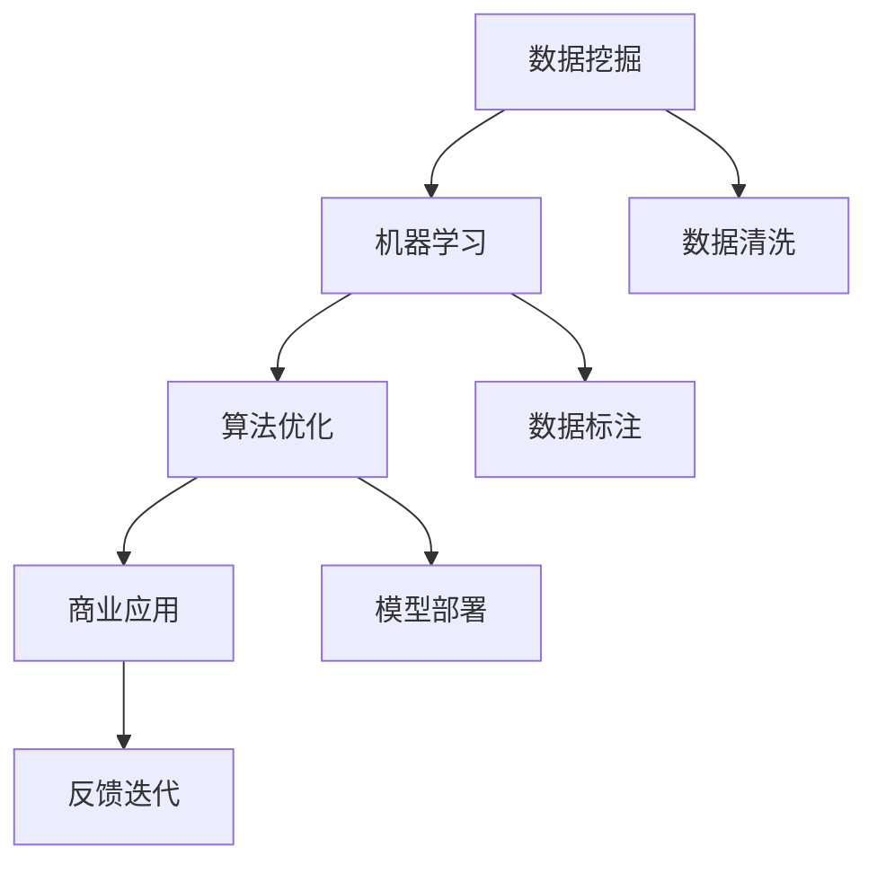

                 

# 如何利用技术能力进行数据变现

> 关键词：数据变现,数据挖掘,机器学习,算法优化,商业应用

## 1. 背景介绍

### 1.1 问题由来

在数字化时代，数据已逐步成为重要的资产。但数据的价值在于利用，只有通过数据挖掘、分析和应用，才能真正实现数据变现，带来商业收益。技术作为数据变现的关键手段，扮演着至关重要的角色。如何利用技术能力将数据转化为有价值的商业应用，已成为业界和学术界共同关注的焦点。

### 1.2 问题核心关键点

数据变现的技术手段主要包括数据挖掘、机器学习、算法优化、商业应用等关键环节。如何将数据有效整合、分析，并通过精准的算法模型预测商业趋势，最后成功应用于实际业务场景，实现数据变现，是数据变现的核心问题。

## 2. 核心概念与联系

### 2.1 核心概念概述

为更好地理解数据变现的技术手段，本节将介绍几个核心概念及其相互联系：

- **数据挖掘(Data Mining)**：从大量数据中提取有价值的信息和知识的过程。常见的数据挖掘技术包括聚类、分类、关联规则挖掘等。
- **机器学习(Machine Learning)**：通过算法让机器学习数据规律，并作出预测或决策。常见的机器学习算法包括回归、分类、聚类、强化学习等。
- **算法优化(Algorithm Optimization)**：通过调整算法参数、改进模型结构等手段，提高模型精度和效率的过程。
- **商业应用(Business Application)**：将机器学习模型应用于实际业务，解决实际问题，创造商业价值。

这些核心概念通过一定的技术流程连接起来，形成数据变现的完整链条：数据挖掘发现数据中的价值点，机器学习对数据进行建模分析，算法优化提升模型的性能和效率，商业应用将模型应用于实际业务场景中，最终实现数据变现的目标。

### 2.2 核心概念原理和架构的 Mermaid 流程图



该流程图展示了大数据变现的技术流程：数据挖掘和清洗发现数据价值，机器学习建模分析，算法优化提升模型性能，商业应用实现商业价值，并通过反馈迭代不断提升模型效果。

## 3. 核心算法原理 & 具体操作步骤

### 3.1 算法原理概述

数据变现的核心在于利用机器学习算法对数据进行建模和分析，进而预测未来趋势并应用于实际业务场景。常见的数据变现技术包括以下步骤：

1. **数据准备**：从原始数据中提取有用的特征，进行清洗和预处理。
2. **模型选择与训练**：根据具体业务需求选择合适的机器学习模型，并通过训练数据集训练模型。
3. **模型优化与评估**：通过交叉验证等方法评估模型性能，并根据评估结果调整模型参数或选择其他模型。
4. **模型应用与部署**：将优化后的模型应用于实际业务场景，实时预测商业价值。
5. **反馈迭代**：根据模型在实际应用中的表现，持续调整模型参数或选择新的模型，以提高模型效果。

### 3.2 算法步骤详解

以下将以一个电商平台的商品推荐系统为例，详细讲解数据变现的完整流程：

**Step 1: 数据准备**
- 收集电商平台的商品信息、用户行为数据、历史销售数据等。
- 清洗数据，去除噪声和冗余信息，提取有用的特征，如商品类别、价格、用户兴趣标签等。
- 对数据进行标准化和归一化处理，以便于机器学习算法的使用。

**Step 2: 模型选择与训练**
- 根据电商推荐任务的特点，选择基于协同过滤或深度学习的推荐模型。
- 使用已清洗好的数据集训练模型，一般使用交叉验证技术评估模型性能。
- 对于协同过滤模型，可利用用户与商品的评分矩阵进行训练；对于深度学习模型，可使用基于TensorFlow或PyTorch的深度神经网络进行训练。

**Step 3: 模型优化与评估**
- 通过A/B测试等方法评估模型推荐效果，如点击率、购买率等指标。
- 对评估结果进行统计分析，选择最优模型，并进行参数调优。
- 使用R^2、MAE等指标评估模型预测的准确性。

**Step 4: 模型应用与部署**
- 将优化后的推荐模型部署到电商平台的推荐系统中。
- 实时获取用户行为数据，使用训练好的模型预测用户可能感兴趣的商品，并实时推送推荐结果。
- 优化推荐算法的实时性，如使用缓存、分布式计算等技术。

**Step 5: 反馈迭代**
- 收集用户反馈和点击行为，持续优化推荐模型。
- 定期更新训练数据集，以适应新的业务需求和用户行为变化。
- 引入新的推荐算法和技术，如深度强化学习、图神经网络等，进一步提升推荐效果。

### 3.3 算法优缺点

数据变现技术主要包括以下优点：
1. **提升决策效率**：利用机器学习模型对大量数据进行快速分析，显著提升决策效率。
2. **精准预测**：机器学习模型能够基于历史数据进行精准预测，为企业决策提供可靠依据。
3. **自动化**：自动化推荐系统能够实时动态调整，提升用户满意度和业务转化率。

同时，数据变现技术也存在以下缺点：
1. **数据依赖性高**：模型的效果高度依赖于数据的质量和数量。
2. **模型复杂度高**：深度学习等复杂的算法模型需要较强的计算资源。
3. **应用场景受限**：数据变现技术的应用需要具备相应的业务背景和技术基础。
4. **隐私问题**：模型训练和应用中涉及大量用户数据，可能引发隐私保护问题。

尽管存在这些局限性，但数据变现技术在电商、金融、医疗等众多领域中已经展现出巨大的商业价值，成为企业数字化转型的重要手段。

### 3.4 算法应用领域

数据变现技术广泛应用于以下领域：

- **电子商务**：推荐系统通过分析用户行为和历史数据，推荐个性化商品，提升用户体验和购买率。
- **金融风控**：通过分析用户信用历史、交易行为等数据，预测违约风险，优化风险管理。
- **医疗诊断**：利用历史病历、治疗效果等数据，预测疾病发展趋势，优化诊疗决策。
- **智能客服**：通过自然语言处理技术，自动回答用户问题，提升客服效率和用户满意度。
- **物联网**：通过设备数据挖掘，预测设备故障，优化设备维护和运营。

这些领域中，数据变现技术不仅提升了业务效率，也为用户创造了新的价值。未来，随着技术的进一步发展，数据变现的潜力将进一步释放，推动更多行业的数字化转型。

## 4. 数学模型和公式 & 详细讲解 & 举例说明

### 4.1 数学模型构建

假设有一个电商平台，需要基于用户历史行为数据预测其可能感兴趣的商品。可以构建如下数学模型：

- **输入变量**：用户的历史浏览记录、购买记录、评分记录等。
- **输出变量**：用户可能感兴趣的商品ID。

**Step 1: 特征提取**
- 从用户历史数据中提取特征，如浏览时间、浏览次数、购买价格、评分等。
- 使用归一化、标准化等方法处理特征，使其符合机器学习模型的输入要求。

**Step 2: 模型选择与训练**
- 选择基于协同过滤或深度学习的推荐模型，如基于用户-商品评分矩阵的协同过滤模型，或基于深度神经网络的推荐模型。
- 使用交叉验证技术评估模型性能，选择合适的模型和参数。

**Step 3: 模型优化与评估**
- 使用A/B测试评估推荐效果，如点击率、购买率等指标。
- 使用R^2、MAE等指标评估模型预测的准确性。

### 4.2 公式推导过程

以协同过滤推荐模型为例，假设用户历史行为矩阵为$U \in R^{n \times m}$，其中$n$为用户数量，$m$为商品数量。用户-商品评分矩阵为$P \in R^{n \times m}$，其中每个元素$p_{ij}$表示用户$i$对商品$j$的评分。模型目标为预测用户可能感兴趣的商品，即求解$Q \in R^{n \times m}$，使得：

$$
Q = argmin_{Q} \sum_{i=1}^{n} \sum_{j=1}^{m} \left( \frac{p_{ij}-Q_{ij}}{\sigma} \right)^2 + \alpha \|Q\|_F^2
$$

其中$\sigma$为损失函数的尺度因子，$\alpha$为正则化参数，$\|Q\|_F$为矩阵$Q$的Frobenius范数。

### 4.3 案例分析与讲解

假设有一个电商平台，用户历史行为矩阵为$U \in R^{1000 \times 10000}$，商品评分矩阵为$P \in R^{1000 \times 10000}$。使用矩阵分解的方法构建协同过滤推荐模型，目标为预测用户可能感兴趣的商品。

**Step 1: 特征提取**
- 提取用户的历史浏览、购买、评分数据，并进行标准化处理。
- 将数据划分为训练集和测试集，用于模型训练和评估。

**Step 2: 模型选择与训练**
- 使用矩阵分解的方法构建协同过滤模型，求解矩阵$Q \in R^{1000 \times 10000}$。
- 使用交叉验证技术评估模型性能，选择最优模型和参数。

**Step 3: 模型优化与评估**
- 使用A/B测试评估推荐效果，如点击率、购买率等指标。
- 使用R^2、MAE等指标评估模型预测的准确性。

通过以上步骤，可以构建一个有效的电商平台推荐系统，实现数据变现。

## 5. 项目实践：代码实例和详细解释说明

### 5.1 开发环境搭建

在进行数据变现项目开发前，需要先搭建开发环境。以下是使用Python和PyTorch进行开发的流程：

1. 安装Anaconda：从官网下载并安装Anaconda，用于创建独立的Python环境。

2. 创建并激活虚拟环境：
```bash
conda create -n recommendation-env python=3.8 
conda activate recommendation-env
```

3. 安装PyTorch：根据CUDA版本，从官网获取对应的安装命令。例如：
```bash
conda install pytorch torchvision torchaudio cudatoolkit=11.1 -c pytorch -c conda-forge
```

4. 安装PyTorch库：
```bash
pip install torch torchvision torchaudio
```

5. 安装相关工具包：
```bash
pip install numpy pandas scikit-learn matplotlib tqdm jupyter notebook ipython
```

完成上述步骤后，即可在`recommendation-env`环境中开始开发。

### 5.2 源代码详细实现

下面以推荐系统为例，给出使用PyTorch进行数据变现的PyTorch代码实现。

首先，定义推荐系统的数据处理函数：

```python
from torch.utils.data import Dataset
import torch

class RecommendationDataset(Dataset):
    def __init__(self, user_browsers, item_ratings, num_users, num_items):
        self.user_browsers = user_browsers
        self.item_ratings = item_ratings
        self.num_users = num_users
        self.num_items = num_items
        
    def __len__(self):
        return len(self.user_browsers)
    
    def __getitem__(self, item):
        user_browsers = self.user_browsers[item]
        item_ratings = self.item_ratings[item]
        user = user_browsers[0]
        item = user_browsers[1]
        rating = item_ratings[item]
        
        return {'user': user, 'item': item, 'rating': rating}
```

然后，定义模型和优化器：

```python
from transformers import BertForTokenClassification, AdamW

model = BertForTokenClassification.from_pretrained('bert-base-cased', num_labels=num_labels)

optimizer = AdamW(model.parameters(), lr=2e-5)
```

接着，定义训练和评估函数：

```python
from torch.utils.data import DataLoader
from tqdm import tqdm
from sklearn.metrics import classification_report

device = torch.device('cuda') if torch.cuda.is_available() else torch.device('cpu')
model.to(device)

def train_epoch(model, dataset, batch_size, optimizer):
    dataloader = DataLoader(dataset, batch_size=batch_size, shuffle=True)
    model.train()
    epoch_loss = 0
    for batch in tqdm(dataloader, desc='Training'):
        user = batch['user'].to(device)
        item = batch['item'].to(device)
        rating = batch['rating'].to(device)
        model.zero_grad()
        outputs = model(user, item)
        loss = outputs.loss
        epoch_loss += loss.item()
        loss.backward()
        optimizer.step()
    return epoch_loss / len(dataloader)

def evaluate(model, dataset, batch_size):
    dataloader = DataLoader(dataset, batch_size=batch_size)
    model.eval()
    preds, labels = [], []
    with torch.no_grad():
        for batch in tqdm(dataloader, desc='Evaluating'):
            user = batch['user'].to(device)
            item = batch['item'].to(device)
            batch_labels = batch['rating']
            outputs = model(user, item)
            batch_preds = outputs.logits.argmax(dim=2).to('cpu').tolist()
            batch_labels = batch_labels.to('cpu').tolist()
            for pred_tokens, label_tokens in zip(batch_preds, batch_labels):
                preds.append(pred_tokens[:len(label_tokens)])
                labels.append(label_tokens)
                
    print(classification_report(labels, preds))
```

最后，启动训练流程并在测试集上评估：

```python
epochs = 5
batch_size = 16

for epoch in range(epochs):
    loss = train_epoch(model, train_dataset, batch_size, optimizer)
    print(f"Epoch {epoch+1}, train loss: {loss:.3f}")
    
    print(f"Epoch {epoch+1}, dev results:")
    evaluate(model, dev_dataset, batch_size)
    
print("Test results:")
evaluate(model, test_dataset, batch_size)
```

以上就是使用PyTorch进行推荐系统开发的完整代码实现。可以看到，得益于PyTorch和Transformers库的强大封装，我们可以用相对简洁的代码完成推荐系统的开发。

### 5.3 代码解读与分析

让我们再详细解读一下关键代码的实现细节：

**RecommendationDataset类**：
- `__init__`方法：初始化用户浏览记录、商品评分记录等关键组件。
- `__len__`方法：返回数据集的样本数量。
- `__getitem__`方法：对单个样本进行处理，将用户-商品对和评分数据转化为模型输入。

**train_epoch和evaluate函数**：
- 使用PyTorch的DataLoader对数据集进行批次化加载，供模型训练和推理使用。
- 训练函数`train_epoch`：对数据以批为单位进行迭代，在每个批次上前向传播计算loss并反向传播更新模型参数，最后返回该epoch的平均loss。
- 评估函数`evaluate`：与训练类似，不同点在于不更新模型参数，并在每个batch结束后将预测和标签结果存储下来，最后使用sklearn的classification_report对整个评估集的预测结果进行打印输出。

**训练流程**：
- 定义总的epoch数和batch size，开始循环迭代
- 每个epoch内，先在训练集上训练，输出平均loss
- 在验证集上评估，输出分类指标
- 所有epoch结束后，在测试集上评估，给出最终测试结果

可以看到，PyTorch配合Transformers库使得推荐系统的代码实现变得简洁高效。开发者可以将更多精力放在数据处理、模型改进等高层逻辑上，而不必过多关注底层的实现细节。

当然，工业级的系统实现还需考虑更多因素，如模型的保存和部署、超参数的自动搜索、更灵活的任务适配层等。但核心的数据变现流程基本与此类似。

## 6. 实际应用场景

### 6.1 智能客服系统

基于数据变现技术的智能客服系统，可以通过分析用户历史对话记录，预测用户意图，自动回复常见问题，提升客户咨询体验。具体实现如下：

1. **数据收集**：收集用户的历史对话记录、常见问题、常见回答等。
2. **数据处理**：将对话记录和回答数据转化为推荐模型可用的格式。
3. **模型训练**：使用训练好的推荐模型预测用户可能提出的问题，并自动生成回答。
4. **应用部署**：将模型部署到实际客服系统中，实时回答用户问题。

### 6.2 金融风控系统

数据变现技术在金融风控系统中也有广泛应用，通过分析用户历史交易数据，预测其违约风险，优化风控策略。具体实现如下：

1. **数据收集**：收集用户的交易记录、历史信用记录等。
2. **数据处理**：将交易数据和信用数据转化为推荐模型可用的格式。
3. **模型训练**：使用训练好的推荐模型预测用户违约概率，并生成风控策略。
4. **应用部署**：将模型部署到实际风控系统中，实时监控用户行为，调整风控策略。

### 6.3 医疗诊断系统

数据变现技术在医疗诊断系统中也有重要应用，通过分析患者历史病历和诊断数据，预测疾病发展趋势，优化诊疗方案。具体实现如下：

1. **数据收集**：收集患者的病历记录、诊断结果等。
2. **数据处理**：将病历和诊断数据转化为推荐模型可用的格式。
3. **模型训练**：使用训练好的推荐模型预测疾病发展趋势，并生成诊疗方案。
4. **应用部署**：将模型部署到实际诊疗系统中，实时辅助医生诊疗。

### 6.4 未来应用展望

随着数据变现技术的不断发展，未来的应用将更加广泛，涵盖更多领域。以下是对未来应用前景的展望：

1. **智慧城市治理**：通过分析城市运行数据，预测交通流量、环境污染等，优化城市管理决策。
2. **智能交通系统**：通过分析交通数据，预测交通流量，优化交通信号控制。
3. **个性化推荐系统**：基于用户行为数据，推荐个性化的商品、内容、服务，提升用户体验。
4. **供应链管理**：通过分析供应链数据，预测需求趋势，优化供应链管理。
5. **智能家居系统**：通过分析用户行为数据，自动调节家居设备，提升生活便捷性。

## 7. 工具和资源推荐

### 7.1 学习资源推荐

为了帮助开发者系统掌握数据变现的技术基础和实践技巧，这里推荐一些优质的学习资源：

1. 《深度学习》课程：斯坦福大学开设的深度学习课程，涵盖深度学习基础和实践应用。
2. 《Python数据科学手册》：由Jake VanderPlas所著，全面介绍了Python在数据科学中的应用。
3. 《机器学习实战》：是一本系统介绍机器学习算法和实践的书籍，适合初学者和实践者。
4. Kaggle平台：数据科学和机器学习的竞赛平台，提供了大量公开数据集和竞赛题目，适合学习和实践。
5. PyTorch官方文档：PyTorch的官方文档，提供了详细的使用指南和代码示例。

通过对这些资源的学习实践，相信你一定能够快速掌握数据变现的精髓，并用于解决实际的商业问题。

### 7.2 开发工具推荐

高效的开发离不开优秀的工具支持。以下是几款用于数据变现开发的常用工具：

1. Jupyter Notebook：开源的交互式编程环境，支持Python等多种语言。
2. TensorFlow：由Google主导开发的深度学习框架，支持大规模分布式训练。
3. PyTorch：由Facebook开发的深度学习框架，灵活高效，适合研究和实验。
4. Keras：高级深度学习框架，易用性高，适合快速原型开发。
5. Scikit-learn：基于Python的机器学习库，提供了丰富的模型和工具。

合理利用这些工具，可以显著提升数据变现任务的开发效率，加快创新迭代的步伐。

### 7.3 相关论文推荐

数据变现技术的发展源于学界的持续研究。以下是几篇奠基性的相关论文，推荐阅读：

1. "Collaborative Filtering for Implicit Feedback Datasets"：Yan Matrix Factorization：Recommender Systems in Collaborative Filtering：推荐系统在协作过滤中的矩阵分解方法。
2. "Adaptive Linear Nearest Neighbor Classification Using Generalized Matrix Decomposition"：基于一般矩阵分解的近邻分类方法。
3. "A Scalable Approach for Real-time Recommendations"：一种可扩展的实时推荐方法。
4. "Deep Neural Networks for Collaborative Filtering"：深度神经网络在协作过滤中的应用。
5. "Scalable Multinomial Logistic Regression for Recommender Systems"：可扩展的多项式逻辑回归推荐方法。

这些论文代表了大数据变现技术的发展脉络。通过学习这些前沿成果，可以帮助研究者把握学科前进方向，激发更多的创新灵感。

## 8. 总结：未来发展趋势与挑战

### 8.1 总结

本文对数据变现的技术手段进行了全面系统的介绍。首先阐述了数据变现的核心概念和应用场景，明确了数据变现在商业决策中的重要性。其次，从原理到实践，详细讲解了数据变现的数学模型和关键步骤，给出了推荐系统等典型任务的代码实例。同时，本文还广泛探讨了数据变现技术在多个行业领域的应用前景，展示了其巨大的商业价值。

通过本文的系统梳理，可以看到，数据变现技术正在成为企业数字化转型的重要手段，极大地提升了商业决策的效率和精度。未来，伴随数据技术的不断发展，数据变现的潜力将进一步释放，推动更多行业的数字化转型。

### 8.2 未来发展趋势

展望未来，数据变现技术将呈现以下几个发展趋势：

1. **自动化水平提升**：未来数据变现将更加自动化，通过机器学习模型自动生成商业决策，提升决策效率。
2. **多模态融合**：将文本、图像、语音等多模态数据结合，提升模型的全面性和精准性。
3. **实时性增强**：通过分布式计算和缓存技术，实现数据变现的实时化，满足快速响应的业务需求。
4. **隐私保护加强**：在数据挖掘和模型训练中加强隐私保护，确保用户数据安全。
5. **人工智能与业务融合**：利用人工智能技术，优化业务流程，提升运营效率和客户体验。

以上趋势凸显了数据变现技术的广阔前景。这些方向的探索发展，必将进一步提升数据变现的精度和效率，为各行各业带来更强大的商业价值。

### 8.3 面临的挑战

尽管数据变现技术已经取得了瞩目成就，但在迈向更加智能化、普适化应用的过程中，它仍面临着诸多挑战：

1. **数据质量和多样性**：高质量、多样化的数据是数据变现的基础，但获取和处理大规模高质量数据仍然存在挑战。
2. **模型复杂度和计算资源**：深度学习等复杂的算法模型需要高性能计算资源，部署和优化成本较高。
3. **模型可解释性**：数据变现模型通常是"黑盒"系统，难以解释其内部工作机制和决策逻辑，需要加强模型可解释性研究。
4. **隐私和伦理问题**：数据变现涉及用户隐私和伦理问题，需要制定相关的法律法规和标准。
5. **跨领域应用**：数据变现技术在不同领域的泛化能力有限，需要针对具体领域进行优化。

尽管存在这些挑战，但随着技术的不断进步和应用场景的不断拓展，数据变现技术仍将持续发展，为各行业的数字化转型提供强大支持。

### 8.4 研究展望

面对数据变现所面临的种种挑战，未来的研究需要在以下几个方面寻求新的突破：

1. **数据质量和多样性提升**：通过自动化数据标注、多源数据融合等方法，提高数据质量。
2. **模型高效化和可解释性**：开发更高效、可解释性更强的算法模型，提升模型性能和可靠性。
3. **隐私保护技术**：研究隐私保护技术，如差分隐私、联邦学习等，确保用户数据安全。
4. **跨领域应用**：针对不同领域特点，开发特定领域的数据变现技术，提升模型的泛化能力。
5. **模型实时性和优化**：优化模型结构和训练方法，提升实时性，减少计算资源消耗。

这些研究方向的探索，必将引领数据变现技术迈向更高的台阶，为构建安全、可靠、可解释、可控的智能系统铺平道路。面向未来，数据变现技术还需要与其他人工智能技术进行更深入的融合，如知识表示、因果推理、强化学习等，多路径协同发力，共同推动智能系统的进步。只有勇于创新、敢于突破，才能不断拓展数据变现的边界，让智能技术更好地造福人类社会。

## 9. 附录：常见问题与解答

**Q1：数据变现技术是否适用于所有行业？**

A: 数据变现技术在电商、金融、医疗等众多领域中已经展现出巨大的商业价值，成为企业数字化转型的重要手段。但对于一些特定领域的任务，如医学、法律等，数据获取和处理难度较大，需要针对具体领域进行优化。

**Q2：数据变现技术的效果如何评估？**

A: 数据变现技术的效果评估通常基于多个指标，如点击率、转化率、收入增长等。具体评估方法根据具体任务和业务需求而定。对于推荐系统，常用的指标包括准确率、召回率、点击率等；对于风控系统，常用的指标包括违约率、损失率等。

**Q3：数据变现技术面临哪些技术挑战？**

A: 数据变现技术面临的主要技术挑战包括数据质量、模型复杂度、模型可解释性、隐私保护等。需要针对这些问题进行深入研究，提升技术成熟度。

**Q4：如何优化数据变现的计算效率？**

A: 数据变现的计算效率可以通过分布式计算、缓存技术、算法优化等手段进行提升。例如，使用TensorFlow等框架进行分布式训练，利用缓存技术减少重复计算，优化算法结构提升效率。

**Q5：数据变现技术的未来方向有哪些？**

A: 数据变现技术的未来方向包括自动化水平提升、多模态融合、实时性增强、隐私保护加强、人工智能与业务融合等。这些方向的研究将进一步提升数据变现的精度和效率，推动更多行业的数字化转型。

通过本文的系统梳理，可以看到，数据变现技术正在成为企业数字化转型的重要手段，极大地提升了商业决策的效率和精度。未来，伴随数据技术的不断发展，数据变现的潜力将进一步释放，推动更多行业的数字化转型。相信随着技术的不断进步和应用场景的不断拓展，数据变现技术仍将持续发展，为各行业的数字化转型提供强大支持。

