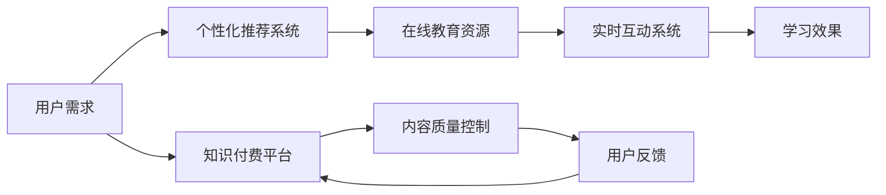

                 

# 如何利用知识付费实现在线教育与家庭教育指导？

在当今信息爆炸的时代，知识付费平台作为一种新兴的教育和信息获取方式，正受到越来越多人的关注。本文将从在线教育和家庭教育两个角度，探讨如何利用知识付费实现高质量的指导和教学服务。通过深度分析核心概念、算法原理，并结合实际应用案例，本文旨在为您提供一个全面且实用的指导方案。

## 1. 背景介绍

随着互联网技术的快速发展，在线教育市场正迅速崛起。疫情的爆发更是加速了线上教育的普及。在线教育打破了传统教育的时间和空间限制，使学习变得更为灵活和便捷。同时，随着人们生活水平的提高，家长们也更加注重孩子的全面发展，家庭教育指导的需求日益增加。知识付费平台作为连接教育资源和用户需求的重要桥梁，为在线教育和家庭教育指导提供了新的思路和解决方案。

### 1.1 问题由来

1. **教育资源不均**：城乡、区域间的教育资源分配不均，尤其在偏远地区，优质教育资源匮乏。
2. **家庭教育需求增加**：现代家庭对子女的全面发展要求更高，尤其是父母的教育水平参差不齐，需要专业指导。
3. **时间成本增加**：家长工作繁忙，很难抽时间亲自辅导孩子。

### 1.2 问题核心关键点

1. **高效匹配**：如何通过知识付费平台高效匹配优质的教育资源和家长需求。
2. **个性化推荐**：根据不同年龄段和需求，提供个性化的教育内容和指导方案。
3. **实时互动**：提供在线实时互动和答疑服务，提升学习效果。
4. **内容质量控制**：确保知识付费平台提供的教育内容和指导方案的高质量。

## 2. 核心概念与联系

### 2.1 核心概念概述

1. **知识付费平台**：指通过平台化的方式，将教育资源（如视频课程、直播授课、在线答疑等）转化为付费服务，为用户提供高质量的教育指导和内容服务。
2. **在线教育**：通过互联网技术，将教育资源在线化，使学习过程不受时间和空间限制，实现灵活、自主的学习方式。
3. **家庭教育指导**：家长通过平台获取科学育子方法、教育策略、心理辅导等内容，帮助孩子全面发展。
4. **个性化推荐系统**：利用大数据和算法，根据用户行为和偏好，推荐最合适的教育资源和内容。
5. **实时互动系统**：提供在线问答、实时讨论等互动服务，提升学习效果。

### 2.2 核心概念原理和架构的 Mermaid 流程图



这个流程图展示了知识付费平台的核心流程：

1. 用户通过平台表达需求。
2. 个性化推荐系统根据需求，推荐合适的教育资源。
3. 用户选择资源进行学习。
4. 实时互动系统提供答疑、讨论等服务，提升学习效果。
5. 内容质量控制确保资源质量。
6. 用户反馈用于持续优化。

## 3. 核心算法原理 & 具体操作步骤

### 3.1 算法原理概述

知识付费平台的核心算法主要包括个性化推荐和实时互动系统。这两个系统利用算法和数据技术，实现高质量的教育资源匹配和互动。

1. **个性化推荐算法**：基于用户行为数据和内容特征，推荐最符合用户需求的教育资源。
2. **实时互动系统**：利用自然语言处理（NLP）技术，实现用户和教师之间的实时问答和互动。

### 3.2 算法步骤详解

#### 3.2.1 个性化推荐系统

1. **用户画像构建**：通过用户注册信息、历史行为数据（如观看视频、参与讨论等）构建用户画像。
2. **内容特征提取**：对教育资源（如视频、文章）进行特征提取，包括视频时长、难度、主题等。
3. **相似度计算**：使用协同过滤、内容基推荐等算法计算用户与教育资源的相似度。
4. **推荐结果排序**：根据相似度对推荐结果排序，优先展示最符合用户需求的教育资源。

#### 3.2.2 实时互动系统

1. **用户提问与回答**：用户提出问题，教师或其他专家在线回答。
2. **自然语言处理**：使用NLP技术，如意图识别、情感分析等，理解用户意图和情感。
3. **答案生成与反馈**：生成高质量的回答，并通过NLP技术进行语义理解，进行互动和反馈。

### 3.3 算法优缺点

#### 3.3.1 个性化推荐系统

**优点**：
1. **精准匹配**：通过数据分析，精准匹配用户需求和教育资源。
2. **动态更新**：根据用户反馈和行为变化，动态调整推荐结果。

**缺点**：
1. **数据隐私**：收集和处理用户数据可能涉及隐私问题。
2. **算法偏见**：推荐算法可能存在偏见，影响用户体验。

#### 3.3.2 实时互动系统

**优点**：
1. **实时答疑**：实时解答用户疑问，提高学习效率。
2. **个性化互动**：根据用户情感和意图，提供个性化指导。

**缺点**：
1. **回答质量**：回答质量受专家水平影响。
2. **系统延迟**：实时响应需要高并发处理能力。

### 3.4 算法应用领域

个性化推荐系统和实时互动系统在多个领域都有广泛应用：

1. **在线教育**：推荐适合学生水平和兴趣的课程内容，实现个性化学习。
2. **企业培训**：根据员工需求推荐培训课程，提升职业技能。
3. **心理咨询**：通过实时互动系统，提供心理支持和辅导。
4. **语言学习**：推荐适合用户水平的语言学习资源，进行实时互动。

## 4. 数学模型和公式 & 详细讲解 & 举例说明

### 4.1 数学模型构建

1. **个性化推荐模型**：基于协同过滤的推荐模型，形式化表示为：
   $$
   y = \alpha_0 + \sum_{i=1}^n (\alpha_i x_i) + \sum_{j=1}^m (\beta_j y_j) + \epsilon
   $$
   其中 $x$ 为用户行为数据，$y$ 为推荐结果，$\alpha$ 和 $\beta$ 为模型参数，$\epsilon$ 为噪声项。

2. **实时互动模型**：基于NLP的问答系统，利用意图识别和情感分析技术，形式化表示为：
   $$
   y = f(x, w)
   $$
   其中 $x$ 为输入文本，$w$ 为模型参数，$f$ 为预测函数。

### 4.2 公式推导过程

1. **协同过滤推荐公式推导**：
   $$
   \hat{y} = (\alpha_0 + \sum_{i=1}^n (\alpha_i x_i)) + \sum_{j=1}^m (\beta_j y_j)
   $$
   其中 $\hat{y}$ 为预测结果，$x_i$ 为第 $i$ 个用户行为特征，$y_j$ 为第 $j$ 个教育资源特征。

2. **NLP问答系统公式推导**：
   $$
   y = f(x, w) = \sigma(g(x, w))
   $$
   其中 $\sigma$ 为激活函数，$g$ 为预测函数，$x$ 为输入文本，$w$ 为模型参数。

### 4.3 案例分析与讲解

**案例**：某在线教育平台推荐用户课程

**步骤**：
1. **用户画像构建**：根据用户注册信息和学习行为，构建用户画像。
2. **内容特征提取**：对课程视频进行特征提取，如视频时长、难度、主题等。
3. **协同过滤推荐**：利用协同过滤算法，计算用户与课程视频之间的相似度，生成推荐列表。
4. **推荐结果排序**：根据相似度对推荐结果进行排序，优先展示最符合用户需求的视频。

## 5. 项目实践：代码实例和详细解释说明

### 5.1 开发环境搭建

1. **选择编程语言和框架**：Python 配合 TensorFlow 或 PyTorch 进行推荐系统开发。
2. **环境配置**：安装 TensorFlow、Scikit-learn、NLTK 等必要库。
3. **数据集准备**：准备用户行为数据和课程特征数据，使用 Pandas、NumPy 等处理。

### 5.2 源代码详细实现

#### 5.2.1 用户画像构建

```python
import pandas as pd
from sklearn.decomposition import TruncatedSVD

# 读取用户行为数据
user_data = pd.read_csv('user_behavior.csv')

# 特征工程：提取用户行为特征
user_features = user_data[['watch_time', 'course_score', 'user_age']]

# 协同过滤推荐：使用SVD降维
svd = TruncatedSVD(n_components=20)
user_porfile = svd.fit_transform(user_features)
```

#### 5.2.2 内容特征提取

```python
# 读取课程数据
course_data = pd.read_csv('course_data.csv')

# 特征工程：提取课程特征
course_features = course_data[['video_duration', 'course_difficulty', 'course_theme']]

# 协同过滤推荐：使用SVD降维
svd = TruncatedSVD(n_components=20)
course_porfile = svd.fit_transform(course_features)
```

#### 5.2.3 推荐结果生成

```python
# 计算用户与课程之间的相似度
similarity = user_porfile.dot(course_porfile.T)

# 生成推荐列表
recommendation = pd.DataFrame(similarity).nlargest(5, axis=1).index.tolist()
```

### 5.3 代码解读与分析

1. **用户画像构建**：通过用户行为数据进行降维，生成用户画像。
2. **内容特征提取**：对课程视频进行特征提取，使用SVD进行降维。
3. **相似度计算**：计算用户与课程之间的相似度，生成推荐列表。

### 5.4 运行结果展示

```python
# 打印推荐结果
print(recommendation)
```

## 6. 实际应用场景

### 6.1 在线教育

在线教育平台通过知识付费，提供优质的课程资源和个性化推荐服务。学生可以根据自己的需求和兴趣，选择适合的课程进行学习。实时互动系统则进一步提升学习效果，学生可以在线提问，教师实时答疑，进行深入交流。

### 6.2 家庭教育指导

家长通过知识付费平台获取科学育子方法、教育策略、心理辅导等内容。平台根据家长的需求，推荐适合的教育资源，并进行实时互动指导。家长可以更好地了解和引导孩子的成长，实现全面发展。

### 6.3 企业培训

企业通过知识付费平台提供员工培训课程，根据员工需求推荐适合的课程内容。实时互动系统则提供在线答疑、讨论等服务，提升培训效果。

### 6.4 未来应用展望

未来，知识付费平台将进一步完善个性化推荐和实时互动系统，提升用户体验。同时，引入更多教育专家和内容，确保教育资源的丰富性和多样性。

## 7. 工具和资源推荐

### 7.1 学习资源推荐

1. **Coursera**：提供大量在线课程和专业培训，涵盖计算机科学、商业管理等多个领域。
2. **edX**：提供全球知名大学和机构的教育资源，包括在线学位课程。
3. **Udemy**：提供多语言在线课程，涵盖编程、设计、语言学习等多个领域。
4. **Khan Academy**：提供免费的教育资源，包括K-12基础教育和编程课程。
5. **Coursera for Business**：为企业提供在线培训课程，提升员工职业技能。

### 7.2 开发工具推荐

1. **Python**：灵活性高、库资源丰富，适合数据处理和算法开发。
2. **TensorFlow**：强大的深度学习框架，适合搭建推荐系统。
3. **PyTorch**：灵活性高、易于调试，适合构建实时互动系统。
4. **Jupyter Notebook**：便于编写和调试代码，支持交互式编程。
5. **NLTK**：Python的自然语言处理库，提供丰富的NLP工具。

### 7.3 相关论文推荐

1. **A Survey on Deep Learning-based Recommendation Systems**：综述了基于深度学习的推荐系统研究现状。
2. **A Survey on Deep Learning for Recommendation Systems**：介绍了深度学习在推荐系统中的应用。
3. **A Survey on Online Learning for Recommender Systems**：综述了在线学习在推荐系统中的应用。
4. **Deep Neural Networks for Recommendation**：介绍了深度神经网络在推荐系统中的应用。
5. **Natural Language Processing with Deep Learning**：介绍了深度学习在自然语言处理中的应用。

## 8. 总结：未来发展趋势与挑战

### 8.1 研究成果总结

本文深入探讨了利用知识付费平台实现在线教育和家庭教育指导的方法，详细介绍了个性化推荐和实时互动系统的算法原理和操作步骤。通过代码实例和实际应用场景，展示了知识付费平台在教育领域的应用前景。

### 8.2 未来发展趋势

1. **个性化推荐系统**：将进一步利用大数据和算法，实现更精准的推荐。
2. **实时互动系统**：利用NLP技术，提供更高质量的答疑和互动服务。
3. **跨领域应用**：将知识付费平台应用到更多领域，如企业培训、心理咨询等。

### 8.3 面临的挑战

1. **数据隐私**：如何保护用户数据隐私，防止信息泄露。
2. **算法偏见**：如何消除推荐算法的偏见，提供公平的推荐服务。
3. **实时响应**：如何提高实时互动系统的响应速度，确保服务质量。
4. **内容质量**：如何保证知识付费平台提供的内容高质量，符合用户需求。

### 8.4 研究展望

1. **隐私保护**：引入隐私保护技术，如差分隐私、联邦学习等，保护用户数据隐私。
2. **公平性**：开发公平推荐算法，确保推荐结果的公平性和多样性。
3. **高效计算**：引入高效的计算和存储技术，提高实时互动系统的响应速度。
4. **内容质量控制**：建立严格的内容审核机制，确保知识付费平台提供的内容高质量。

## 9. 附录：常见问题与解答

**Q1：为什么需要利用知识付费平台实现在线教育？**

A：知识付费平台提供优质的教育资源和个性化推荐服务，帮助用户高效学习和成长。在线教育打破了时间和空间限制，使学习更加灵活和自主。

**Q2：如何保证个性化推荐系统的推荐质量？**

A：需要采用先进的算法和大量高质量的数据进行训练。同时，引入用户反馈机制，动态调整推荐结果，提升推荐质量。

**Q3：如何处理实时互动系统中的回答质量问题？**

A：引入专家审核机制，对回答进行质量评估和审核。同时，使用NLP技术，提升回答的语义理解和准确性。

**Q4：如何保护用户数据隐私？**

A：采用差分隐私、联邦学习等隐私保护技术，保护用户数据隐私。同时，严格遵守相关法律法规，保障用户数据安全。

**Q5：如何提升实时互动系统的响应速度？**

A：引入高效的计算和存储技术，如分布式计算、缓存机制等。同时，优化算法和代码，提升系统的并发处理能力。

---

作者：禅与计算机程序设计艺术 / Zen and the Art of Computer Programming

