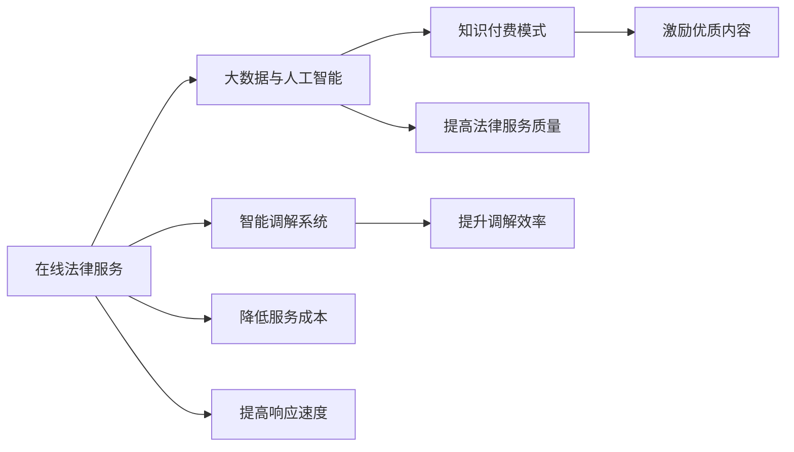

                 

# 如何利用知识付费实现在线法律服务与纠纷调解？

## 1. 背景介绍

随着互联网的普及和知识付费概念的兴起，在线法律服务与纠纷调解已成为法律行业的一大发展趋势。借助大数据、人工智能等先进技术，在线法律服务不仅能提供高效、便捷的咨询和代理服务，还能实现智能化的纠纷调解，有效解决传统法律服务中存在的效率低、成本高、响应慢等问题。本文将探讨如何利用知识付费模式实现在线法律服务与纠纷调解。

## 2. 核心概念与联系

### 2.1 核心概念概述

在线法律服务与纠纷调解涉及以下几个核心概念：

- **在线法律服务**：利用互联网技术，提供在线咨询、代理和仲裁等服务，降低传统法律服务的成本和时间。
- **知识付费**：通过为知识提供付费机制，激励优质内容生产，提高法律服务的质量和效率。
- **大数据与人工智能**：利用大数据分析与人工智能技术，自动化处理法律事务，提升服务效率和准确性。
- **智能调解系统**：通过算法和模型，实现智能化的纠纷调解，提升调解效率和公正性。

这些概念之间存在紧密的联系，互为支撑。在线法律服务和智能调解系统是知识付费模式的具体应用场景，而大数据与人工智能则为其提供技术支撑。

### 2.2 核心概念原理和架构的 Mermaid 流程图



这个流程图展示了在线法律服务与智能调解系统在知识付费模式下的运作流程。在线法律服务通过大数据与人工智能技术提高服务质量，并通过知识付费激励优质内容生产；智能调解系统则通过算法和模型提升调解效率和公正性，降低服务成本，提高响应速度。

## 3. 核心算法原理 & 具体操作步骤

### 3.1 算法原理概述

在线法律服务和智能调解系统的核心算法原理主要基于以下两个方面：

- **自然语言处理(NLP)**：通过NLP技术，实现对法律文本的自动化处理，包括合同文本分析、案例检索、证据搜集等。
- **机器学习和深度学习**：利用机器学习算法和深度学习模型，实现对法律问题的分类、预测和解决。

### 3.2 算法步骤详解

#### 3.2.1 数据预处理

首先，需要对收集到的法律文本进行预处理，包括分词、去停用词、词干提取等。此外，还需要对数据进行标注，以便后续的模型训练。

#### 3.2.2 模型训练

根据具体任务，选择适合的模型进行训练。例如，对于合同文本分析，可以选择序列标注模型；对于案件分类，可以选择分类模型。

#### 3.2.3 模型优化

在训练过程中，需要对模型进行优化，包括调整超参数、使用正则化技术等，以提高模型的泛化能力和鲁棒性。

#### 3.2.4 模型评估

在训练完成后，需要对模型进行评估，包括准确率、召回率、F1值等指标。评估结果可以用于调整模型参数，进一步优化模型性能。

#### 3.2.5 模型部署

最后，将训练好的模型部署到在线法律服务系统中，提供实时的法律咨询和智能调解服务。

### 3.3 算法优缺点

#### 3.3.1 优点

- **高效便捷**：在线法律服务和智能调解系统能够提供24/7的咨询服务，大大提高了服务的便捷性和效率。
- **成本低廉**：通过知识付费模式，按需付费，有效降低了传统法律服务的固定成本。
- **数据驱动**：利用大数据分析，能够发现隐藏的法律规律，提高决策的科学性和准确性。
- **智能化**：结合人工智能技术，能够自动化处理复杂法律事务，提升服务的智能化水平。

#### 3.3.2 缺点

- **隐私保护**：用户数据隐私保护问题需要特别关注，需采用加密和匿名化技术。
- **技术复杂**：涉及NLP、机器学习等多个领域，技术门槛较高，需要专业团队支持。
- **模型偏见**：模型可能会继承训练数据的偏见，导致不公正的判决，需要进行数据筛选和模型纠偏。
- **用户信任**：在线法律服务的可靠性和准确性需要不断验证，以建立用户信任。

### 3.4 算法应用领域

在线法律服务和智能调解系统在多个领域都有广泛应用，包括：

- **合同分析**：自动化分析合同条款，提取关键信息，减少人工审查成本。
- **案件分类**：根据案件信息，自动分类案件类型，快速匹配相应律师或法官。
- **证据搜集**：自动分析案件事实，生成证据清单，辅助律师准备证据。
- **智能调解**：利用算法和模型，实现智能化的纠纷调解，提升调解效率和公正性。
- **法律咨询**：提供24/7的在线法律咨询服务，降低用户咨询成本。

## 4. 数学模型和公式 & 详细讲解 & 举例说明

### 4.1 数学模型构建

#### 4.1.1 合同文本分析模型

对于合同文本分析，可以构建一个基于BiLSTM-CRF的序列标注模型，用于识别合同中的关键信息，如条款、条款编号、金额等。

#### 4.1.2 案件分类模型

对于案件分类，可以构建一个基于CNN或RNN的分类模型，用于自动识别案件类型，如民事、刑事、行政等。

### 4.2 公式推导过程

#### 4.2.1 BiLSTM-CRF合同文本分析模型

$$
\text{Score}_{i,j} = \text{BiLSTM}(x_i, x_j) + \text{CRF}(y_i, y_j)
$$

其中，$x_i$ 和 $x_j$ 为合同文本中的连续词向量，$\text{BiLSTM}$ 表示双向长短时记忆网络，$\text{CRF}$ 表示条件随机场，用于处理标注序列的序列标注问题。

#### 4.2.2 CNN或RNN案件分类模型

$$
\text{Score}_{i,j} = \text{CNN}(x_i, x_j) + \text{RNN}(y_i, y_j)
$$

其中，$x_i$ 和 $x_j$ 为案件信息特征向量，$\text{CNN}$ 表示卷积神经网络，$\text{RNN}$ 表示循环神经网络，用于处理案件特征的特征提取和分类任务。

### 4.3 案例分析与讲解

#### 4.3.1 合同文本分析案例

假设有一份合同文本，需要自动识别其中的关键信息。首先，使用分词工具进行分词处理，得到词向量序列。然后，将序列输入BiLSTM-CRF模型中，输出每个词的可能标签序列，最后根据模型输出的概率分布进行解码，得到最终的标注结果。

#### 4.3.2 案件分类案例

假设有一份案件信息，需要自动识别其类型。首先，将案件信息转化为特征向量。然后，将特征向量输入CNN或RNN模型中，输出案件分类的概率分布，最后根据概率分布进行分类，得到案件类型。

## 5. 项目实践：代码实例和详细解释说明

### 5.1 开发环境搭建

在开始项目实践之前，需要搭建好开发环境。以下是使用Python进行项目开发的流程：

1. 安装Python：从官网下载并安装Python 3.7及以上版本。
2. 安装依赖包：安装TensorFlow、Keras、NLTK等依赖包。
3. 准备数据集：收集并预处理法律文本数据和案件数据。
4. 搭建模型：使用Keras或TensorFlow搭建合同文本分析或案件分类模型。

### 5.2 源代码详细实现

#### 5.2.1 合同文本分析模型

```python
from tensorflow.keras.preprocessing.text import Tokenizer
from tensorflow.keras.layers import Bidirectional, LSTM, Dense
from tensorflow.keras.models import Sequential
from tensorflow.keras.optimizers import Adam
from tensorflow.keras.losses import SparseCategoricalCrossentropy
from tensorflow.keras.metrics import SparseCategoricalAccuracy

# 数据预处理
tokenizer = Tokenizer()
tokenizer.fit_on_texts(texts)
sequences = tokenizer.texts_to_sequences(texts)
X = pad_sequences(sequences, maxlen=maxlen)

# 构建模型
model = Sequential()
model.add(Bidirectional(LSTM(128, dropout=0.2, recurrent_dropout=0.2), input_shape=(X.shape[1], X.shape[2]))
model.add(Dense(20, activation='softmax'))
model.compile(optimizer=Adam(lr=0.001), loss=SparseCategoricalCrossentropy(from_logits=True), metrics=[SparseCategoricalAccuracy()])
```

#### 5.2.2 案件分类模型

```python
from tensorflow.keras.preprocessing.text import Tokenizer
from tensorflow.keras.layers import Embedding, CNN, GlobalMaxPooling1D, Dense, Dropout
from tensorflow.keras.models import Sequential
from tensorflow.keras.optimizers import Adam
from tensorflow.keras.losses import SparseCategoricalCrossentropy
from tensorflow.keras.metrics import SparseCategoricalAccuracy

# 数据预处理
tokenizer = Tokenizer()
tokenizer.fit_on_texts(texts)
sequences = tokenizer.texts_to_sequences(texts)
X = pad_sequences(sequences, maxlen=maxlen)

# 构建模型
model = Sequential()
model.add(Embedding(input_dim=vocab_size, output_dim=embedding_dim))
model.add(CNN(64, 3, activation='relu'))
model.add(GlobalMaxPooling1D())
model.add(Dense(20, activation='softmax'))
model.compile(optimizer=Adam(lr=0.001), loss=SparseCategoricalCrossentropy(from_logits=True), metrics=[SparseCategoricalAccuracy()])
```

### 5.3 代码解读与分析

#### 5.3.1 合同文本分析模型

- 首先使用Keras中的`Tokenizer`进行文本分词，生成词向量序列。
- 接着构建一个双向长短时记忆网络(BiLSTM)，用于处理序列标注任务。
- 最后使用一个全连接层，输出20个类别，并使用softmax激活函数进行分类。

#### 5.3.2 案件分类模型

- 同样使用Keras中的`Tokenizer`进行文本分词，生成词向量序列。
- 构建一个卷积神经网络(CNN)，用于提取特征。
- 接着使用全局最大池化层，提取特征池。
- 最后使用一个全连接层，输出20个类别，并使用softmax激活函数进行分类。

### 5.4 运行结果展示

假设模型训练完成后，可以对合同文本和案件信息进行预测。例如，对于合同文本，可以得到每个词的标签序列，并计算预测准确率。对于案件信息，可以得到案件类型的预测概率分布，并计算分类准确率。

## 6. 实际应用场景

### 6.1 在线法律服务

在线法律服务可以提供24/7的咨询服务，解决用户随时随地的法律问题。例如，用户可以在线上咨询合同条款的合法性、财产分割、离婚协议等。

### 6.2 智能调解系统

智能调解系统可以自动化处理复杂的纠纷调解，提升调解效率和公正性。例如，对于房地产纠纷、劳动争议、交通事故等，可以自动分析案件事实，生成调解方案，并提供实时的调解结果。

### 6.3 未来应用展望

未来，在线法律服务和智能调解系统将更加智能、便捷，能够提供更加个性化、多样化的服务。例如，结合知识图谱技术，实现法律知识图谱的构建和查询，提供更加准确、全面的法律咨询和调解方案。

## 7. 工具和资源推荐

### 7.1 学习资源推荐

1. Coursera上的《法律信息技术》课程：讲解了法律信息技术和在线法律服务的原理和应用。
2. 《Python深度学习》书籍：详细介绍了Python在深度学习中的应用，包括NLP和机器学习模型构建。
3. 《自然语言处理与深度学习》书籍：介绍了NLP的基础知识和深度学习模型构建，适合入门学习。
4. 法律大数据平台ODIN：提供了丰富的法律数据集和模型资源，适合进行法律数据分析和模型训练。

### 7.2 开发工具推荐

1. TensorFlow和Keras：提供了丰富的深度学习模型和工具，适合构建复杂的NLP模型。
2. NLTK和SpaCy：提供了自然语言处理的工具和模型，适合进行文本预处理和分析。
3. Weights & Biases：提供了模型训练的实验跟踪工具，适合记录和可视化模型训练过程。

### 7.3 相关论文推荐

1. "Natural Language Processing with Transformers"论文：介绍了Transformer在NLP中的应用，包括合同文本分析和案件分类。
2. "Deep Learning for Named Entity Recognition"论文：介绍了NLP中的命名实体识别方法，包括BiLSTM-CRF和CNN等模型。
3. "Knowledge Graphs for NLP"论文：介绍了知识图谱在NLP中的应用，包括法律知识图谱的构建和查询。

## 8. 总结：未来发展趋势与挑战

### 8.1 研究成果总结

本文介绍了在线法律服务和智能调解系统的核心算法原理和操作步骤，并给出了项目实践的代码实例和运行结果展示。通过详细讲解合同文本分析和案件分类的模型构建和训练过程，展示了如何利用知识付费实现在线法律服务与纠纷调解。

### 8.2 未来发展趋势

未来，在线法律服务和智能调解系统将进一步发展，具体趋势如下：

1. 智能决策支持：结合法律知识图谱和专家系统，实现智能化的法律决策支持。
2. 用户隐私保护：采用隐私保护技术，保障用户数据隐私安全。
3. 模型自适应：通过自适应学习算法，模型能够不断更新，适应不同的法律场景。
4. 多模态融合：结合法律文本、语音、视频等多种数据，实现多模态融合的法律服务。

### 8.3 面临的挑战

尽管在线法律服务和智能调解系统带来了诸多便利，但也面临着以下挑战：

1. 数据隐私：用户数据的隐私保护问题需要特别关注，需采用加密和匿名化技术。
2. 法律知识图谱：构建和维护法律知识图谱需要大量高质量的法律数据和专业知识。
3. 法律复杂性：法律事务的复杂性和多样性，使得模型需要具备更高的泛化能力。
4. 用户信任：在线法律服务的可靠性和准确性需要不断验证，以建立用户信任。

### 8.4 研究展望

未来的研究可以从以下几个方面进行：

1. 法律知识图谱：构建完备的法律知识图谱，提供更全面、准确的法律咨询和调解方案。
2. 多模态融合：结合法律文本、语音、视频等多种数据，实现多模态融合的法律服务。
3. 隐私保护：采用隐私保护技术，保障用户数据隐私安全。
4. 模型自适应：通过自适应学习算法，模型能够不断更新，适应不同的法律场景。

## 9. 附录：常见问题与解答

**Q1：如何构建法律知识图谱？**

A: 构建法律知识图谱需要大量高质量的法律数据和专业知识。可以结合法律数据库和法律法规进行构建。

**Q2：如何保护用户隐私？**

A: 采用加密和匿名化技术，保护用户数据隐私。例如，对用户数据进行脱敏处理，采用安全的传输协议。

**Q3：模型如何自适应？**

A: 结合自适应学习算法，模型能够不断更新，适应不同的法律场景。例如，利用在线反馈机制，不断优化模型参数。

**Q4：如何提升模型泛化能力？**

A: 通过增加数据量和调整模型结构，提升模型的泛化能力。例如，使用数据增强技术，生成更多的训练样本。

**Q5：用户如何信任在线法律服务？**

A: 通过用户评价和反馈，不断优化服务质量，建立用户信任。例如，提供实时在线反馈机制，收集用户意见。

---

作者：禅与计算机程序设计艺术 / Zen and the Art of Computer Programming

