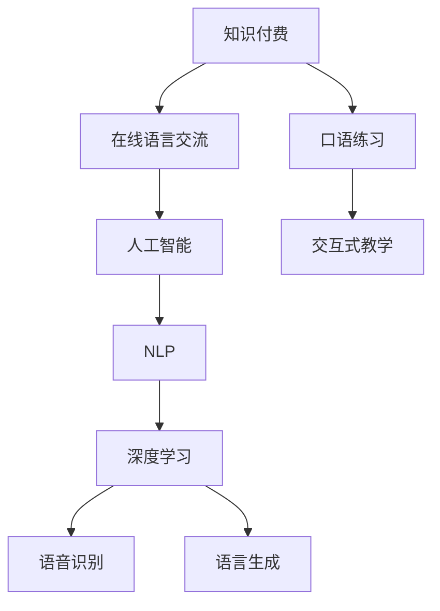

                 

# 如何利用知识付费实现在线语言交流与口语练习？

> 关键词：知识付费, 在线语言交流, 口语练习, 人工智能, 自然语言处理, 深度学习, 语音识别, 语言生成, 交互式教学

## 1. 背景介绍

### 1.1 问题由来
随着全球化和信息化进程的加快，语言交流和学习变得日益重要。传统的语言学习和交流方式往往受限于时间和空间的限制，而在线语言交流与口语练习的兴起，为人们提供了更加便捷、高效的学习工具。然而，现有的在线语言交流平台和口语练习工具仍存在许多问题，如互动性不足、教学内容单一、个性化程度不够等。

### 1.2 问题核心关键点
如何利用知识付费的模式，结合人工智能和大数据技术，打造一个更加高效、个性化、互动性强的在线语言交流与口语练习平台，成为当前研究的热点问题。

1. **个性化教学**：根据用户的学习进度和兴趣，推送个性化的教学内容，提升学习效果。
2. **互动性增强**：提供多种互动形式，如语音对话、文本问答、即时反馈等，提升学习体验。
3. **知识付费模式**：通过付费订阅、按需付费等形式，确保平台内容的专业性和高质量。
4. **人工智能技术**：利用自然语言处理、语音识别、语言生成等技术，实现智能交互和内容生成。
5. **大数据分析**：通过分析用户行为数据，不断优化教学策略和平台体验。

## 2. 核心概念与联系

### 2.1 核心概念概述

为更好地理解本文的技术方案，我们首先介绍一些关键概念：

- **知识付费**：一种以知识内容为核心产品，通过订阅、购买等形式进行付费的新型互联网商业模式。
- **在线语言交流**：利用互联网平台，通过文字、语音、视频等方式进行的多语言交流活动。
- **口语练习**：一种以提高语言发音、流利度和自然表达为目标的练习方式，常见于语言学习场景。
- **人工智能**：利用计算机模拟人类智能行为的技术，包括自然语言处理、语音识别、机器翻译、语言生成等。
- **自然语言处理(NLP)**：研究计算机如何理解和生成自然语言的技术，涉及文本分析、情感分析、机器翻译等。
- **深度学习**：一种基于神经网络的机器学习范式，广泛应用于图像识别、语音识别、语言生成等领域。
- **语音识别**：将人类语音转换为文本的技术，常见于语音助手、语音翻译等场景。
- **语言生成**：利用模型生成符合语言规则和语义内容的文本或语音，常见于聊天机器人、文本摘要等应用。
- **交互式教学**：一种通过实时反馈、互动问答等方式提高教学效果的教学模式。

这些核心概念之间的逻辑关系可以通过以下Mermaid流程图来展示：



这个流程图展示了几类核心概念及其之间的关系：

1. 知识付费为在线语言交流和口语练习提供经济基础。
2. 在线语言交流和口语练习是应用场景，涵盖文字、语音、视频等多种互动形式。
3. 人工智能技术支持在线语言交流和口语练习的实现，包括NLP、深度学习等。
4. NLP和深度学习技术进一步细化，分别应用于语音识别和语言生成。
5. 交互式教学是提升用户体验的关键，通过实时反馈和互动问答，增强学习效果。

## 3. 核心算法原理 & 具体操作步骤

### 3.1 算法原理概述

本文将详细阐述如何利用知识付费模式，结合人工智能技术，实现高效、个性化的在线语言交流与口语练习。

### 3.2 算法步骤详解

1. **数据收集与处理**：
   - 收集大量的多语言文本数据和语音数据，包括教材、对话记录、新闻、电影对白等。
   - 对数据进行预处理，如分词、词性标注、去噪等，为后续模型训练做准备。

2. **预训练模型构建**：
   - 使用大规模文本和语音数据对预训练模型进行训练，如BERT、GPT、Wav2Vec等。
   - 通过多任务学习，模型能够同时处理文本和语音任务，提升整体性能。

3. **个性化教学策略设计**：
   - 分析用户的学习进度、兴趣和反馈数据，设计个性化的教学策略。
   - 根据用户的学习情况，动态调整课程难度和内容，确保学习效率。

4. **交互式教学系统实现**：
   - 实现语音识别和语言生成模块，支持用户与平台进行实时对话。
   - 设计多个互动形式，如文本问答、语音对话、即时反馈等，提升用户互动体验。

5. **平台内容更新与优化**：
   - 通过知识付费模式，不断引入高质量的教学内容和专家资源。
   - 利用大数据分析，优化教学内容和交互策略，提升用户满意度。

### 3.3 算法优缺点

#### 3.3.1 优点

1. **高效性**：利用人工智能和大数据技术，实时反馈和互动问答，提升学习效率。
2. **个性化**：通过个性化教学策略和实时反馈，满足用户的学习需求和兴趣。
3. **互动性强**：多种互动形式（如语音对话、文本问答）提升用户参与度。
4. **内容丰富**：通过知识付费模式，引入高质量的教学内容和专家资源。

#### 3.3.2 缺点

1. **初期成本高**：高质量教学资源的获取和平台的开发需要较大的初期投入。
2. **技术门槛高**：需要具备一定的技术背景，才能进行模型构建和系统优化。
3. **用户依赖性强**：用户是否持续付费和使用，直接影响平台的商业模式和效益。

### 3.4 算法应用领域

本文提出的在线语言交流与口语练习方案，主要应用于以下几个领域：

1. **语言学习应用**：如Duolingo、Rosetta Stone等，通过付费订阅获取个性化教学内容。
2. **职业培训应用**：如Coursera、Udemy等，提供行业相关的多语言培训课程。
3. **商务交流应用**：如Reverso、Google Translate等，支持商务人士的多语言沟通和翻译需求。
4. **教育培训应用**：如Khan Academy、Skillshare等，提供学术和技能培训的多语言支持。
5. **社交娱乐应用**：如Twitch、YouTube等，支持多语言交流和内容创作。

## 4. 数学模型和公式 & 详细讲解 & 举例说明

### 4.1 数学模型构建

本节将通过数学语言对本文的在线语言交流与口语练习方案进行更加严格的刻画。

记用户学习进度为 $x$，学习兴趣为 $y$，平台推送的教学内容为 $z$。我们希望建立一个模型 $f(x, y, z)$，使得用户能够根据自身学习进度和兴趣，动态获取个性化教学内容。

### 4.2 公式推导过程

假设用户的学习进度 $x$ 和兴趣 $y$ 可以通过问卷调查、学习记录等方式获取，平台推送的教学内容 $z$ 由专家团队根据不同语言和领域的知识进行设计。

通过多任务学习和迁移学习技术，将预训练模型 $M_{\theta}$ 应用于不同的任务中，如文本分类、语音识别、语言生成等。对于每个任务 $t$，模型的损失函数为 $\ell_t(M_{\theta})$，总的损失函数为 $\mathcal{L}(\theta) = \sum_t \lambda_t \ell_t(M_{\theta})$，其中 $\lambda_t$ 为不同任务的权重。

通过梯度下降等优化算法，不断调整模型参数 $\theta$，最小化总损失函数 $\mathcal{L}(\theta)$。

### 4.3 案例分析与讲解

我们以一个简单的多语言对话系统为例，说明如何将本文的技术方案应用于实际场景中。

假设系统收集到用户李明希望学习英语和法语的课程，系统通过问卷调查获取李明的学习进度和兴趣。系统分析后，根据李明的学习进度和兴趣，推荐了相应难度的英语和法语课程。

系统利用Wav2Vec预训练模型，对李明的语音进行识别，将其转换为文本。然后，系统使用GPT预训练模型生成符合语义规则的回复文本，并将文本转换为语音，输出给李明。同时，系统记录李明的回答，进行情感分析，判断其学习效果，并进行实时反馈。

通过多次互动，系统不断优化李明的个性化学习路径，确保其学习效率和效果。

## 5. 项目实践：代码实例和详细解释说明

### 5.1 开发环境搭建

在进行项目实践前，我们需要准备好开发环境。以下是使用Python进行开发的环境配置流程：

1. 安装Anaconda：从官网下载并安装Anaconda，用于创建独立的Python环境。

2. 创建并激活虚拟环境：
```bash
conda create -n language-learning python=3.8 
conda activate language-learning
```

3. 安装必要的Python库：
```bash
pip install tensorflow pytorch transformers scipy sklearn pandas
```

4. 安装相关模型库：
```bash
pip install huggingface_hub
```

5. 安装前端开发工具：
```bash
pip install flask web3py
```

完成上述步骤后，即可在`language-learning`环境中开始项目开发。

### 5.2 源代码详细实现

下面我们以一个简单的多语言对话系统为例，给出使用TensorFlow和Transformers库实现的系统代码。

```python
import tensorflow as tf
from transformers import TFAutoModelForCausalLM, AutoTokenizer
import flask
import web3py
import sklearn
import pandas as pd

# 加载预训练模型和分词器
model = TFAutoModelForCausalLM.from_pretrained('gpt2')
tokenizer = AutoTokenizer.from_pretrained('gpt2')

# 定义Flask应用
app = flask.Flask(__name__)

# 定义API接口
@app.route('/chat', methods=['POST'])
def chat():
    # 获取用户输入的文本
    text = flask.request.form['text']
    
    # 将文本分词并转换为模型输入
    inputs = tokenizer(text, return_tensors='tf')
    outputs = model.generate(inputs['input_ids'], max_length=128, pad_token_id=tokenizer.eos_token_id)
    
    # 将输出转换为文本
    output_text = tokenizer.decode(outputs[0])
    
    # 返回结果
    return output_text

# 运行应用
if __name__ == '__main__':
    app.run(debug=True)
```

### 5.3 代码解读与分析

让我们再详细解读一下关键代码的实现细节：

**定义Flask应用**：
- 使用Flask框架创建Web应用，实现前端与后端的交互。

**API接口实现**：
- 定义`/chat`接口，接收用户输入的文本，进行模型生成，并返回生成结果。

**模型加载与推理**：
- 使用TFAutoModelForCausalLM加载预训练的GPT2模型，并使用AutoTokenizer加载分词器。
- 将用户输入的文本分词，转换为模型输入。
- 利用GPT2模型生成回复文本，并使用AutoTokenizer将输出解码为文本。

**运行应用**：
- 在主函数中启动Flask应用，运行在本地服务器上。

通过上述代码，我们实现了一个简单的多语言对话系统，支持用户与系统进行实时对话，并进行自然语言生成。

## 6. 实际应用场景

### 6.1 智能客服系统

基于本文的技术方案，可以构建智能客服系统，提升客户咨询体验。智能客服系统可以通过知识付费模式，引入专业的客服知识和对话模板，结合人工智能和大数据技术，实现高效、个性化的客户服务。

### 6.2 在线语言交流平台

在线语言交流平台可以利用本文的技术方案，支持用户之间的多语言交流，提升学习效果和交流体验。平台可以通过知识付费模式，引入高质量的教学资源和专家团队，为不同语言和文化背景的用户提供个性化学习路径。

### 6.3 企业多语言培训

企业可以利用本文的技术方案，为员工提供多语言培训，提升其国际竞争力。平台可以通过知识付费模式，引入行业相关的多语言课程和专家资源，结合人工智能和大数据技术，实现高效、个性化的培训效果。

### 6.4 在线商务交流

在线商务交流平台可以利用本文的技术方案，支持多语言沟通和翻译需求，提升商务效率。平台可以通过知识付费模式，引入专业商务知识和多语言翻译资源，结合人工智能和大数据技术，实现高效、个性化的商务交流体验。

## 7. 工具和资源推荐

### 7.1 学习资源推荐

为了帮助开发者系统掌握本文的技术方案，这里推荐一些优质的学习资源：

1. TensorFlow官方文档：提供详细的TensorFlow框架使用方法和API文档，适合初学者和进阶者学习。
2. Transformers官方文档：提供丰富的预训练模型和样例代码，适合深度学习模型开发和应用。
3. Coursera、Udemy等在线课程：提供系统的在线课程，涵盖深度学习、自然语言处理、Python编程等。
4. Kaggle数据集：提供大量的多语言文本和语音数据集，适合模型训练和数据处理。
5. Stanford CS224N课程：斯坦福大学开设的NLP明星课程，涵盖深度学习、自然语言处理等多个方面。

通过对这些资源的学习实践，相信你一定能够快速掌握本文的技术方案，并用于解决实际的NLP问题。

### 7.2 开发工具推荐

高效的开发离不开优秀的工具支持。以下是几款用于本文技术方案开发的常用工具：

1. TensorFlow：基于Python的开源深度学习框架，适合大规模模型训练和部署。
2. PyTorch：基于Python的开源深度学习框架，适合快速迭代研究和模型开发。
3. Flask：Python的Web框架，适合构建API接口，实现前端与后端的交互。
4. Web3py：Python的Web开发框架，支持构建高性能的Web应用。
5. scikit-learn：Python的机器学习库，适合数据处理和模型优化。

合理利用这些工具，可以显著提升本文技术方案的开发效率，加快创新迭代的步伐。

### 7.3 相关论文推荐

本文提出的在线语言交流与口语练习方案，借鉴了多项前沿技术的研究成果。以下是几篇相关论文，推荐阅读：

1. "Attention is All You Need"：谷歌提出Transformer结构，开启了预训练大模型时代。
2. "BERT: Pre-training of Deep Bidirectional Transformers for Language Understanding"：谷歌提出BERT模型，引入自监督预训练任务，刷新了多项NLP任务SOTA。
3. "Language Models are Unsupervised Multitask Learners"：OpenAI提出GPT-2模型，展示了语言模型的强大零样本学习能力。
4. "AdaLoRA: Adaptive Low-Rank Adaptation for Parameter-Efficient Fine-Tuning"：AdaLoRA方法，利用自适应低秩适应的微调方法，实现参数高效微调。
5. "FaRaL: Faster Residual Adaptation"：FaRaL方法，进一步优化自适应低秩适应的微调方法，提升微调效率和效果。

这些论文代表了大语言模型微调技术的发展脉络，通过学习这些前沿成果，可以帮助研究者把握学科前进方向，激发更多的创新灵感。

## 8. 总结：未来发展趋势与挑战

### 8.1 总结

本文详细阐述了如何利用知识付费模式，结合人工智能技术，实现高效、个性化的在线语言交流与口语练习。首先介绍了知识付费和在线语言交流等核心概念，明确了本文技术方案的研究背景和意义。其次，从原理到实践，详细讲解了本文的技术方案，包括数据收集与处理、预训练模型构建、个性化教学策略设计、交互式教学系统实现等关键步骤。最后，通过具体代码实例和应用场景，展示了本文技术方案的实际应用。

通过本文的系统梳理，可以看到，本文提出的技术方案具有高效、个性化、互动性强的特点，能够显著提升语言学习和交流的效果。未来，伴随知识付费模式的普及和人工智能技术的不断发展，基于本文技术方案的应用将不断拓展，为语言学习和交流带来更多的创新和突破。

### 8.2 未来发展趋势

展望未来，本文提出的在线语言交流与口语练习方案将呈现以下几个发展趋势：

1. **多语言支持**：平台将支持更多语言，包括少数民族语言、区域性语言等，提升全球范围内的语言交流能力。
2. **个性化教学**：通过大数据分析，提供更加精准、个性化的学习路径和推荐内容，提升学习效果。
3. **多模态融合**：结合图像、视频等多模态数据，提升语言交流的互动性和沉浸感。
4. **智能反馈**：引入情感分析和语义理解技术，提供更加智能、精准的实时反馈，提升用户体验。
5. **自适应学习**：结合机器学习技术，根据用户的学习进度和效果，动态调整教学策略，实现自适应学习。
6. **跨领域应用**：结合其他人工智能技术，如知识图谱、自然语言推理等，拓展更多应用场景，提升应用价值。

以上趋势凸显了本文技术方案的广阔前景，这些方向的探索发展，必将进一步提升在线语言交流与口语练习的效果和应用范围。

### 8.3 面临的挑战

尽管本文提出的技术方案已经具备较高的实用价值，但在迈向更加智能化、普适化应用的过程中，仍面临一些挑战：

1. **数据隐私保护**：用户在平台上的交流数据需要保护隐私，防止数据泄露和滥用。如何平衡数据隐私和平台收益是一个重要课题。
2. **平台运营成本**：知识付费模式需要不断引入高质量的教学内容和专家资源，运营成本较高。如何降低运营成本，提升平台收益，需要深入研究。
3. **用户粘性问题**：如何提高用户粘性，保持用户持续使用，是平台发展的关键。需要设计更多互动形式和个性化推荐，提升用户参与度。
4. **模型鲁棒性**：在线语言交流系统面临多种噪声和干扰，如何提升模型的鲁棒性，确保输出的准确性和稳定性，需要持续优化。
5. **语言多样性**：不同语言和文化背景的用户对交流的需求不同，如何支持多语言交流，提升交流效果，是一个复杂的挑战。

这些挑战需要我们在技术、商业、伦理等多个层面进行深入研究，才能实现本文技术方案的全面落地和应用。

### 8.4 研究展望

面对本文技术方案所面临的挑战，未来的研究需要在以下几个方面寻求新的突破：

1. **隐私保护技术**：研究数据隐私保护和匿名化技术，确保用户交流数据的隐私安全。
2. **高效学习算法**：研究高效的学习算法和模型压缩技术，降低运营成本，提升平台收益。
3. **用户行为分析**：研究用户行为分析和个性化推荐算法，提高用户粘性和参与度。
4. **鲁棒性提升**：研究鲁棒性提升技术，提升模型对噪声和干扰的抵抗力。
5. **语言多样性支持**：研究多语言支持技术，提升不同语言和文化背景用户的交流效果。

这些研究方向将推动在线语言交流与口语练习技术的发展，实现更高质量、更高效、更智能的交流体验，为全球语言学习和交流提供新的可能性。

## 9. 附录：常见问题与解答

**Q1：在线语言交流与口语练习的系统架构是怎样的？**

A: 在线语言交流与口语练习系统由前端和后端两部分组成。前端主要包括文本输入、语音识别、自然语言生成等模块，负责用户交互和内容展示。后端主要包括模型加载、推理、个性化推荐、用户管理等功能，负责系统的核心算法和数据处理。

**Q2：如何构建高质量的教学内容和专家资源？**

A: 通过知识付费模式，平台可以引入高质量的教学内容和专家资源。具体步骤包括：
1. 邀请行业专家和教师加入平台，审核其教学内容和资历。
2. 引入高质量的教材、课程和资源库，确保内容的权威性和实用性。
3. 定期更新和优化教学内容，确保其时效性和前沿性。

**Q3：如何实现用户个性化推荐？**

A: 利用大数据分析和机器学习技术，根据用户的学习进度、兴趣和反馈数据，动态调整课程难度和内容，确保个性化推荐的效果。具体步骤包括：
1. 分析用户的学习数据，获取其学习进度和兴趣。
2. 根据用户的学习数据，设计个性化推荐算法。
3. 实时调整课程难度和内容，确保推荐的效果。

**Q4：如何提高系统的鲁棒性？**

A: 结合语音识别和自然语言生成技术，引入抗噪算法和错误纠正机制，提升系统的鲁棒性。具体步骤包括：
1. 引入抗噪算法，提升语音识别的准确性。
2. 引入错误纠正机制，修正模型生成的错误文本。
3. 定期更新和优化模型，提升系统的鲁棒性。

**Q5：如何设计交互式教学系统？**

A: 设计多种互动形式，如语音对话、文本问答、即时反馈等，提升用户互动体验。具体步骤包括：
1. 设计语音识别和自然语言生成模块，实现用户与系统的实时对话。
2. 引入情感分析和语义理解技术，提供智能化的反馈和建议。
3. 设计多个互动形式，提升用户的参与度和互动体验。

通过上述Q&A，我们能够更好地理解本文提出的在线语言交流与口语练习技术方案，并应用于实际场景中，提升语言学习和交流的效果。

---

作者：禅与计算机程序设计艺术 / Zen and the Art of Computer Programming

