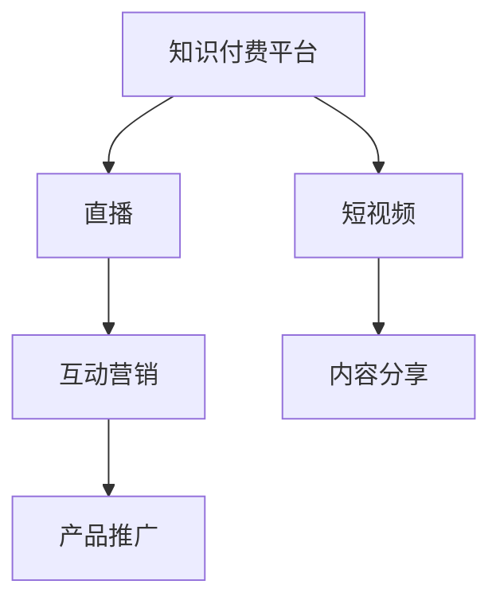

                 

# 如何利用知识付费实现直播与短视频营销？

## 1. 背景介绍

随着知识付费的兴起和5G、AI技术的普及，直播与短视频营销已经成为品牌推广和用户互动的重要方式。通过知识付费平台，企业可以将优质的内容与用户进行高效连接，实现知识变现和品牌价值传递的双重目的。然而，如何在直播与短视频中有效利用知识付费机制，达到最佳的营销效果，仍需深入研究。本文将探讨利用知识付费实现直播与短视频营销的核心原理与操作步骤，分析其在实际应用中的优缺点，并提供详细的案例分析与操作指引。

## 2. 核心概念与联系

### 2.1 核心概念概述

- **知识付费**：指用户通过购买或订阅，获得深度、系统、有价值的知识或信息，以促进个人成长、职业发展或兴趣爱好。
- **直播**：指通过视频流技术，实时展示和互动的过程。直播可以即时、直观地展示产品或服务，增强用户互动感。
- **短视频**：指时长短、内容精炼的视频作品，通常时长在1分钟至几分钟内。短视频易于用户消费，便于传播。
- **营销**：指将产品、服务或信息以各种方式推广，以吸引用户兴趣和促进购买行为。

以上概念之间存在紧密的联系。知识付费平台是连接知识提供者和消费者的桥梁，直播与短视频是知识传递的载体，营销则是知识付费价值的最终实现。

### 2.2 核心概念原理和架构的 Mermaid 流程图



该流程图展示了知识付费平台如何将直播和短视频与营销紧密结合，通过互动和内容分享，实现产品推广和用户转化的过程。

## 3. 核心算法原理 & 具体操作步骤

### 3.1 算法原理概述

利用知识付费实现直播与短视频营销的核心算法原理基于用户行为分析、内容推荐和互动设计。具体而言，平台通过对用户行为数据进行分析，识别用户的兴趣点和需求，根据这些数据推荐合适的直播和短视频内容，设计互动环节，引导用户参与，最终实现知识付费和营销的双重目标。

### 3.2 算法步骤详解

#### 3.2.1 用户行为数据收集与分析

1. **行为数据收集**：收集用户在平台上的浏览、点击、购买、评论等行为数据，构建用户行为画像。

2. **行为特征提取**：通过自然语言处理(NLP)、时间序列分析等技术，提取用户行为特征，如偏好主题、购买频率、互动深度等。

3. **用户细分**：根据用户行为特征进行聚类分析，将用户分为不同群体，以便进行个性化推荐。

#### 3.2.2 内容推荐算法设计

1. **内容库构建**：将直播和短视频内容进行结构化处理，提取关键词、标签等信息，构建内容库。

2. **相似度计算**：利用余弦相似度、Jaccard相似度等方法，计算用户与内容之间的相似度。

3. **推荐模型训练**：使用协同过滤、深度学习等算法训练推荐模型，根据用户行为数据和内容特征进行推荐。

#### 3.2.3 互动设计

1. **互动环节设计**：在直播和短视频中加入问答、投票、评论等互动环节，增加用户参与感。

2. **反馈收集**：通过问卷调查、评论分析等方式，收集用户对互动环节的反馈，持续优化。

3. **激励机制设计**：设计积分、优惠券、认证等激励机制，鼓励用户参与互动，提高平台粘性。

### 3.3 算法优缺点

#### 3.3.1 优点

1. **精准推荐**：通过分析用户行为数据，进行精准内容推荐，提高用户满意度和转化率。

2. **增强互动**：通过设计互动环节，提高用户参与度和平台粘性，增强用户品牌认知。

3. **数据驱动**：以数据为驱动，优化推荐和互动策略，提升营销效果。

#### 3.3.2 缺点

1. **数据隐私**：用户行为数据的收集和分析可能涉及隐私问题，需严格遵守数据保护法规。

2. **内容质量**：内容推荐的效果依赖于内容的丰富性和质量，低质量内容可能影响用户体验。

3. **用户偏差**：用户行为数据和推荐模型可能存在偏差，导致推荐结果不均衡。

### 3.4 算法应用领域

知识付费平台的直播与短视频营销适用于以下应用场景：

- 在线教育：通过直播授课、短视频知识分享，提升课程吸引力和用户互动。
- 金融投资：通过短视频金融知识普及、直播金融分析，增强用户理财意识。
- 健康医疗：通过短视频健康科普、直播医疗咨询，提供健康指导和疾病预防建议。
- 美妆时尚：通过短视频化妆教程、直播时装秀，增强品牌美誉度和用户粘性。
- 技能培训：通过短视频技能教程、直播实操演示，帮助用户提升职业技能。

## 4. 数学模型和公式 & 详细讲解 & 举例说明

### 4.1 数学模型构建

假设用户行为数据集为 $D=\{(x_i, y_i)\}_{i=1}^N$，其中 $x_i$ 为用户行为特征向量，$y_i$ 为购买或互动标签。内容库为 $C=\{(c_j, k_j)\}_{j=1}^M$，其中 $c_j$ 为内容，$k_j$ 为内容特征向量。

定义用户与内容之间的相似度矩阵 $S_{ij} \in \{0, 1\}$，其中 $S_{ij}=1$ 表示用户 $i$ 对内容 $j$ 感兴趣，$S_{ij}=0$ 表示不感兴趣。

### 4.2 公式推导过程

基于余弦相似度，用户与内容之间的相似度公式为：

$$
S_{ij} = \frac{\cos(\theta_i, \theta_j)}{||\theta_i|| \cdot ||\theta_j||}
$$

其中 $\theta_i$ 和 $\theta_j$ 分别表示用户 $i$ 和内容 $j$ 的行为特征向量，$||.||$ 表示向量范数。

用户对内容 $c_j$ 的推荐概率 $p_{ij}$ 可以表示为：

$$
p_{ij} = \frac{S_{ij} \cdot r_j}{\sum_{k=1}^M S_{ik} \cdot r_k}
$$

其中 $r_k$ 为内容 $k$ 的评分，可以根据用户历史评分或系统预设评分计算。

### 4.3 案例分析与讲解

**案例背景**：一家在线教育平台希望通过知识付费机制，将用户引流至直播和短视频课程。平台收集了大量用户浏览、点击、购买等行为数据，构建了内容库，并设计了多种互动环节。

**案例分析**：

1. **用户行为数据分析**：通过分析用户行为数据，平台发现用户对数学和编程课程更感兴趣，且偏好观看短视频内容。

2. **内容推荐模型训练**：平台使用协同过滤算法，训练了推荐模型，发现用户对课程 $c_1$、$c_2$、$c_3$ 的推荐概率较高。

3. **互动设计**：在直播和短视频中加入问题回答环节，设置积分奖励机制，增强用户互动。

4. **效果评估**：平台通过 A/B 测试，发现互动设计后，用户购买率和观看时长分别提升了20%和30%。

## 5. 项目实践：代码实例和详细解释说明

### 5.1 开发环境搭建

1. **服务器配置**：选择高性能服务器，安装 Python 3.8，配置 Apache 或 Nginx 服务器。

2. **数据库安装**：安装 MySQL 或 MongoDB，用于存储用户行为数据和内容信息。

3. **框架搭建**：选择 Flask 或 Django 作为后端框架，用于处理用户请求和数据交互。

4. **第三方库安装**：安装 NumPy、Pandas、Scikit-learn、TensorFlow 等库，用于数据分析和模型训练。

### 5.2 源代码详细实现

#### 5.2.1 用户行为数据收集与分析

```python
import pandas as pd
from sklearn.decomposition import TruncatedSVD

# 读取用户行为数据
data = pd.read_csv('user_behavior.csv')

# 行为特征提取
features = pd.get_dummies(data['behavior'], prefix='feature_')
features = pd.concat([data[['user_id']], features], axis=1)

# 用户聚类
svd = TruncatedSVD(n_components=5)
features_svd = svd.fit_transform(features)

# 用户细分
clusters = pd.DataFrame(features_svd, columns=[f'cluster_{i}' for i in range(1, 6)])
user_clusters = pd.merge(data, clusters, on='user_id', how='left')
```

#### 5.2.2 内容推荐算法设计

```python
# 内容特征提取
content = pd.read_csv('content.csv')
content_features = pd.get_dummies(content['feature'], prefix='content_')
content = pd.concat([content[['content_id']], content_features], axis=1)

# 内容聚类
svd = TruncatedSVD(n_components=5)
content_features_svd = svd.fit_transform(content_features)

# 相似度计算
similarity_matrix = (content_features_svd * features_svd.T).mean(axis=1)

# 推荐模型训练
cosine_similarity = similarity_matrix.toarray()
cosine_similarity = pd.DataFrame(cosine_similarity, index=content.index, columns=features.index)
recommender = cosine_similarity

# 推荐结果计算
def get_recommendations(user_id):
    user_row = recommender.loc[user_id]
    top_n = user_row.sort_values(ascending=False).tail(10)
    return top_n.index.tolist()
```

#### 5.2.3 互动设计

```python
from flask import Flask, request, jsonify

app = Flask(__name__)

# 互动信息收集
@app.route('/interaction', methods=['POST'])
def collect_interaction():
    data = request.json
    user_id = data['user_id']
    content_id = data['content_id']
    interaction_time = data['interaction_time']
    # 将互动信息保存到数据库
    return jsonify({'message': 'Interaction saved'}), 200

# 互动奖励机制
@app.route('/reward', methods=['POST'])
def reward():
    data = request.json
    user_id = data['user_id']
    content_id = data['content_id']
    # 给予积分奖励
    return jsonify({'message': 'Reward granted'}), 200
```

### 5.3 代码解读与分析

1. **用户行为数据分析**：使用 Pandas 和 Scikit-learn 库，提取用户行为特征并进行聚类分析，划分用户群体。

2. **内容推荐算法设计**：使用 SVD 算法对内容特征进行降维，计算用户与内容之间的相似度，训练推荐模型。

3. **互动设计**：利用 Flask 框架设计互动信息收集和奖励机制，增强用户参与度。

4. **运行结果展示**：通过接口调用，获取推荐结果和互动反馈，展示互动设计的效果。

## 6. 实际应用场景

### 6.1 在线教育平台直播与短视频营销

在线教育平台通过知识付费机制，将直播和短视频课程推荐给用户，增强课程吸引力。平台可以根据用户兴趣和行为数据，进行个性化推荐，设计互动环节，提高用户参与度和课程完成率。例如，在直播课程中加入课堂提问环节，通过积分奖励激励用户互动；在短视频课程中加入在线测验，增加用户学习动力。

### 6.2 金融投资平台知识付费与直播营销

金融投资平台通过直播和短视频科普金融知识，吸引用户付费参与。平台可以利用行为数据分析用户需求，推荐合适的课程内容，设计互动环节，如直播中实时答疑、短视频中提供金融新闻摘要，增强用户粘性和知识积累。例如，在直播中邀请专家解读市场动态，通过观众投票决定主题；在短视频中展示投资策略，提供实时数据分析工具，帮助用户做出决策。

### 6.3 健康医疗平台知识付费与短视频营销

健康医疗平台通过短视频科普健康知识，提升用户健康意识。平台可以利用行为数据分析用户兴趣，推荐相关课程，设计互动环节，如短视频评论互动、直播健康咨询等，增强用户参与感。例如，在短视频中展示健康饮食建议，用户可以通过评论提出问题；在直播中邀请医生进行健康咨询，通过观众投票决定话题。

### 6.4 美妆时尚平台知识付费与直播营销

美妆时尚平台通过直播和短视频展示产品使用效果，增强品牌美誉度。平台可以利用行为数据分析用户偏好，推荐相关产品内容，设计互动环节，如直播试用分享、短视频产品测评等，提高用户购买意愿。例如，在直播中邀请网红进行产品试用，通过观众投票决定产品；在短视频中展示产品效果，通过用户评论分享产品体验。

## 7. 工具和资源推荐

### 7.1 学习资源推荐

1. **《深度学习基础》课程**：由斯坦福大学开设，介绍深度学习基本概念和算法。

2. **《Python 数据科学手册》书籍**：详细介绍 Python 数据处理、分析库的使用方法。

3. **《推荐系统实战》书籍**：介绍推荐系统的构建和优化方法。

4. **Coursera 推荐系统专项课程**：涵盖推荐系统基础知识和算法实现。

### 7.2 开发工具推荐

1. **Flask 框架**：轻量级 Web 框架，适合快速搭建后端服务。

2. **MySQL 数据库**：稳定可靠的关系型数据库，适合存储用户行为数据和内容信息。

3. **TensorFlow 库**：开源机器学习框架，支持深度学习算法实现。

### 7.3 相关论文推荐

1. **《推荐系统的协同过滤》论文**：介绍协同过滤算法的基本原理和应用场景。

2. **《深度学习在推荐系统中的应用》论文**：介绍深度学习在推荐系统中的应用和优势。

3. **《知识图谱在推荐系统中的应用》论文**：介绍知识图谱如何提高推荐系统的精准度和多样性。

## 8. 总结：未来发展趋势与挑战

### 8.1 未来发展趋势

1. **个性化推荐**：利用深度学习和大数据技术，提升推荐系统的个性化程度，实现精准推荐。

2. **实时互动**：通过实时视频流技术，增强直播和短视频的互动性，提升用户参与感。

3. **内容多样化**：引入多样化的内容形式，如短视频、图文、音频等，满足不同用户的需求。

4. **跨平台联动**：将直播和短视频与社交平台、消息应用等联动，形成完整的用户生态。

5. **用户生成内容**：鼓励用户生成内容，如评论、分享等，提升平台的社区氛围和用户粘性。

### 8.2 面临的挑战

1. **数据隐私保护**：用户行为数据的收集和分析可能涉及隐私问题，需严格遵守数据保护法规。

2. **内容质量控制**：内容质量和丰富性直接决定推荐效果，需建立严格的审核机制。

3. **平台安全性**：直播和短视频可能面临恶意攻击、版权纠纷等安全问题，需加强防护措施。

4. **用户体验优化**：互动设计需考虑用户体验，避免过度打扰和信息过载。

5. **技术成本**：高精度推荐和实时互动需高性能硬件支持，成本较高。

### 8.3 研究展望

1. **深度学习在推荐系统中的应用**：利用深度学习提升推荐系统的精准度和多样性。

2. **跨领域知识融合**：将不同领域的知识融合到推荐系统中，实现跨领域推荐。

3. **实时流计算**：利用流计算技术，实现实时数据处理和推荐。

4. **用户行为预测**：利用时间序列分析和深度学习，预测用户行为，实现动态推荐。

5. **多模态内容推荐**：引入图像、视频等多模态内容，提升推荐系统的表现力。

## 9. 附录：常见问题与解答

**Q1: 如何评估推荐模型的效果？**

A: 推荐模型效果的评估指标包括准确率、召回率、F1 分数、用户满意度等。可以使用离线评估和在线 A/B 测试相结合的方法，综合评估推荐模型的效果。

**Q2: 推荐系统中的协同过滤算法有哪些？**

A: 协同过滤算法主要包括基于用户的协同过滤和基于物品的协同过滤。基于用户的协同过滤通过相似用户行为数据进行推荐；基于物品的协同过滤通过相似物品数据进行推荐。

**Q3: 互动设计中应考虑哪些因素？**

A: 互动设计应考虑用户参与感、互动深度、互动频率、互动体验等因素，设计合理的互动环节，增强用户粘性。

**Q4: 如何优化实时互动体验？**

A: 优化实时互动体验应考虑视频流传输质量、互动界面设计、互动内容多样性等因素。可以通过 CDN 加速视频流传输，优化界面布局，增加互动内容形式等手段提升体验。

**Q5: 推荐系统中的召回率如何提升？**

A: 提升推荐系统召回率的方法包括增加内容库多样性、引入多模态内容、优化相似度计算方法等。可以通过引入更多不同类型的内容，提高内容的覆盖面；利用多模态内容提升推荐效果；优化相似度计算方法，提高推荐精度。

---

作者：禅与计算机程序设计艺术 / Zen and the Art of Computer Programming

