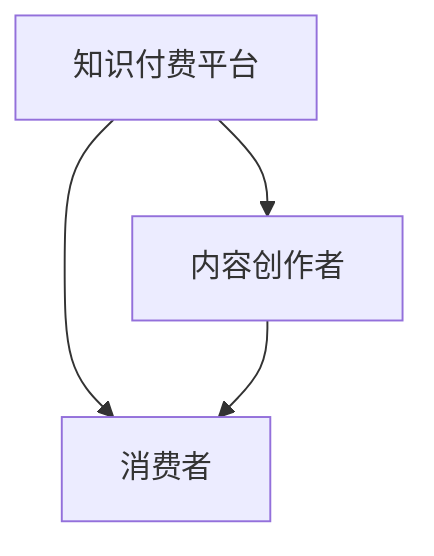

                 

# 如何利用知识付费实现跨界合作共赢？

## 1. 背景介绍

### 1.1 问题由来
在数字化和互联网时代，知识付费成为一种新兴的经济形态。平台、内容创作者和消费者之间的合作方式，正在经历从单向输出到双向互动的转变。知识付费不再仅仅是个人知识传播的手段，更成为了连接知识提供者和消费者之间的桥梁，形成了知识共享和价值交换的新模式。

然而，知识付费平台和内容创作者面临诸多挑战。例如，平台如何吸引和激励优质内容创作者，保障其合法权益；创作者如何提升内容和产品的竞争力，扩大受众覆盖；消费者如何获得真正有价值的知识，提升学习效果。

在这一背景下，如何通过知识付费模式实现跨界合作共赢，成为了值得深入探讨的问题。本文将从背景、核心概念、算法原理、实际操作、应用领域、数学模型、项目实践、应用场景、工具资源、总结展望以及常见问题解答等多个角度，全面解析知识付费中的跨界合作共赢之道。

## 2. 核心概念与联系

### 2.1 核心概念概述

- **知识付费平台**：提供内容付费服务的互联网平台，连接内容创作者与消费者，通过订阅、单次购买等方式实现知识价值的交换。
- **内容创作者**：包括学者、专家、作家、教师、自由职业者等，在平台发布知识内容，并通过粉丝打赏、订阅费、课程销售等方式获得收益。
- **消费者**：平台的用户，包括个人学习者、企业培训需求者等，通过购买付费内容满足知识需求，提升个人或组织能力。
- **知识共享**：在平台和创作者之间，消费者可以免费访问部分内容，形成知识流动。
- **价值交换**：内容创作者通过提供有价值的知识获取收入，消费者通过支付费用获得高质量的知识内容，形成双向的价值交换。

### 2.2 核心概念联系

知识付费生态中的各个主体相互依存，共同构成了知识价值流转的闭环。平台作为连接器，需要提供用户友好的使用体验和技术支持；内容创作者提供高质量的知识，是生态的核心；消费者作为需求方，是知识的最终受益者。通过跨界合作，各方可以共享资源、分担风险，实现共赢。

这种联系可以用Mermaid流程图表示：



该图表明，平台通过内容创作者提供服务，消费者通过平台获取知识，创作者和消费者之间也直接互动，形成了互动共赢的良性循环。

## 3. 核心算法原理 & 具体操作步骤
### 3.1 算法原理概述

知识付费中的跨界合作共赢，可以通过以下算法原理实现：

1. **平台推荐算法**：利用机器学习模型，根据用户的浏览、订阅、购买等行为数据，推荐感兴趣的内容，提升用户体验。
2. **创作者激励机制**：设计合理的激励机制，如广告分成、版权分成、粉丝打赏等，保障创作者收益，激励其持续输出优质内容。
3. **消费者学习路径设计**：通过路径规划算法，帮助消费者构建系统化的学习路径，提升学习效果。
4. **社区互动算法**：利用社区算法，鼓励用户之间的互动交流，形成学习社区，增强知识传播的广度和深度。

### 3.2 算法步骤详解

以内容推荐算法为例，其具体操作步骤如下：

1. **数据收集**：平台收集用户行为数据，如浏览历史、订阅列表、购买记录等。
2. **特征工程**：对收集的数据进行特征提取，如内容标签、用户兴趣标签、时间戳等。
3. **模型训练**：使用机器学习算法（如协同过滤、深度学习等）训练推荐模型。
4. **内容推荐**：根据用户的实时行为数据，实时推荐感兴趣的内容。
5. **反馈优化**：收集用户对推荐内容的反馈数据，持续优化模型，提升推荐效果。

### 3.3 算法优缺点

知识付费平台中的推荐算法主要优点包括：
- 提升用户体验，增加用户粘性。
- 发现优质内容，提升内容价值。
- 提高用户满意度，增加平台收入。

缺点则可能包括：
- 数据隐私问题，如何保护用户隐私。
- 算法公平性问题，避免推荐偏差。
- 模型复杂度问题，提高推荐准确率的同时降低计算成本。

### 3.4 算法应用领域

知识付费推荐算法广泛应用于以下领域：

1. **个性化内容推荐**：根据用户行为数据，推荐个性化课程、书籍、文章等。
2. **学习路径规划**：设计用户的学习路径，帮助其系统化学习。
3. **热点内容推送**：根据热门话题或事件，推送相关内容，增加用户参与度。
4. **广告精准投放**：通过推荐算法，精准投放广告，提升广告效果。

## 4. 数学模型和公式 & 详细讲解 & 举例说明

### 4.1 数学模型构建

在知识付费推荐算法中，常用的数学模型包括协同过滤和深度学习。以协同过滤为例，其模型可以表示为：

$$
P(r_{ui}) = \text{sigmoid}(\theta^T \phi(u) \cdot \phi(i)^T + b)
$$

其中，$P(r_{ui})$ 表示用户 $u$ 对内容 $i$ 的评分概率，$\theta$ 为模型参数，$\phi(u)$ 和 $\phi(i)$ 分别为用户和内容的特征向量，$b$ 为偏置项。

### 4.2 公式推导过程

协同过滤的推导过程如下：
1. **相似度计算**：计算用户之间的相似度，得到邻域用户 $U$。
2. **评分预测**：根据邻域用户的评分，预测目标用户的评分。
3. **参数更新**：通过梯度下降等优化算法，更新模型参数。

### 4.3 案例分析与讲解

以Netflix的协同过滤推荐算法为例，Netflix通过用户的历史观看记录，构建邻域用户集，利用用户之间的相似度，预测用户对未观看内容评分，最终推荐用户可能感兴趣的内容。

## 5. 项目实践：代码实例和详细解释说明

### 5.1 开发环境搭建

在知识付费平台的开发中，需要搭建一个基于Python的开发环境。

1. 安装Anaconda：
```bash
conda install anaconda
```

2. 创建虚拟环境：
```bash
conda create -n knowledge-payment python=3.8
conda activate knowledge-payment
```

3. 安装相关库：
```bash
pip install pandas numpy scikit-learn matplotlib seaborn
```

4. 配置开发工具：
```bash
pip install jupyter notebook
```

### 5.2 源代码详细实现

以下是一个使用协同过滤算法实现内容推荐的Python代码示例：

```python
import pandas as pd
from sklearn.metrics.pairwise import cosine_similarity

# 加载数据
data = pd.read_csv('user_data.csv')

# 用户行为数据
user_behavior = data[['user_id', 'content_id', 'rating']]
user_behavior.columns = ['user_id', 'content_id', 'rating']

# 计算用户-内容评分矩阵
rating_matrix = user_behavior.pivot_table(index='user_id', columns='content_id', values='rating', fill_value=0)

# 计算用户之间的相似度
similarity_matrix = cosine_similarity(rating_matrix.values)

# 推荐内容
def recommend_content(user_id, top_n=10):
    similarity = similarity_matrix[user_id]
    sorted_indices = similarity.argsort()[::-1]
    recommendation = [user_behavior.iloc[i]['content_id'] for i in sorted_indices[1:top_n]]
    return recommendation

# 示例
user_id = 1
recommendations = recommend_content(user_id)
print(f"推荐内容: {recommendations}")
```

### 5.3 代码解读与分析

上述代码中，我们首先加载了用户行为数据，并构建了用户-内容评分矩阵。接着，利用cosine_similarity计算用户之间的相似度，并根据相似度排序，推荐用户可能感兴趣的内容。

## 6. 实际应用场景

### 6.1 知识付费平台推荐系统

知识付费平台推荐系统是知识付费生态的核心。通过推荐算法，平台可以提升用户粘性，增加平台收入。例如，Coursera和Udacity等在线教育平台，通过推荐个性化课程，帮助用户系统化学习，提升学习效果。

### 6.2 企业内部培训

企业可以利用知识付费平台，为员工提供定制化的培训课程。通过推荐算法，根据员工的工作职责和职业发展路径，推荐适合的课程内容，提升员工的技能水平。

### 6.3 个人学习规划

个人可以通过知识付费平台，制定系统化的学习计划。通过推荐算法，根据个人的学习目标和进度，推荐合适的课程和学习材料，提升学习效率。

### 6.4 未来应用展望

未来，知识付费平台将结合更多智能技术，如自然语言处理、图像识别等，提供更为丰富和多样化的知识内容。同时，平台将更加注重用户反馈，优化推荐算法，提升用户体验。

## 7. 工具和资源推荐

### 7.1 学习资源推荐

1. **《推荐系统基础与实战》**：系统介绍了推荐系统的基本原理、算法实现和应用案例。
2. **Kaggle推荐系统竞赛**：参与Kaggle推荐系统竞赛，实践推荐算法，提升实战能力。
3. **Coursera《推荐系统》课程**：由斯坦福大学教授讲授，深入浅出地讲解推荐系统原理。
4. **《Python推荐系统实战》**：实用指南，提供完整的推荐系统开发流程和代码实现。

### 7.2 开发工具推荐

1. **Jupyter Notebook**：强大的数据科学开发工具，支持Python和R语言。
2. **Spark**：分布式计算框架，适用于大数据推荐系统的开发。
3. **TensorFlow和PyTorch**：深度学习框架，支持推荐算法的实现。
4. **AWS SageMaker**：云平台服务，支持推荐系统模型的训练和部署。

### 7.3 相关论文推荐

1. **《协同过滤推荐系统》**：介绍协同过滤算法的原理和实现。
2. **《深度学习推荐系统》**：介绍深度学习在推荐系统中的应用。
3. **《推荐系统中的知识表示与推理》**：研究如何利用知识表示提升推荐效果。

## 8. 总结：未来发展趋势与挑战

### 8.1 总结

本文从知识付费的背景、核心概念、算法原理、具体操作步骤、应用领域等多个角度，全面解析了知识付费中的跨界合作共赢之道。通过平台推荐算法、创作者激励机制、消费者学习路径设计、社区互动算法等手段，实现了各方的共赢。

通过本文的系统梳理，可以看到知识付费生态中的各主体相互依存，通过跨界合作，共享资源、分担风险，实现了良好的生态循环。未来，随着技术的发展，知识付费平台将更加智能和高效，为内容创作者和消费者带来更多的价值。

### 8.2 未来发展趋势

未来，知识付费平台将呈现以下发展趋势：

1. **个性化推荐系统**：利用机器学习和深度学习技术，提供个性化推荐，提升用户体验。
2. **多模态推荐**：结合文本、图像、视频等多种模态数据，提升推荐准确性和多样性。
3. **社区驱动推荐**：通过社区算法，鼓励用户之间的互动交流，形成知识社区。
4. **智能化推荐**：利用自然语言处理和图像识别技术，提升推荐效果。
5. **智能化激励机制**：设计更加智能化的激励机制，保障创作者收益。

这些趋势将推动知识付费平台向更加智能化、个性化和社区化的方向发展，为创作者和消费者提供更好的服务。

### 8.3 面临的挑战

尽管知识付费平台在不断发展，但仍面临诸多挑战：

1. **数据隐私问题**：如何保护用户隐私，防止数据滥用。
2. **算法公平性**：避免推荐算法中的偏见，保障公平性。
3. **推荐效果提升**：提高推荐算法的准确性和效率，提升用户体验。
4. **创作者收益保障**：设计合理的激励机制，保障创作者收益。
5. **社区互动管理**：如何管理社区互动，防止恶意行为。

这些挑战需要各方共同努力，才能实现知识付费平台的健康发展。

### 8.4 研究展望

未来，知识付费平台的研究方向包括：

1. **多模态推荐系统**：结合多种模态数据，提升推荐效果。
2. **公平性算法**：研究公平性算法，避免偏见和歧视。
3. **隐私保护技术**：研究隐私保护技术，保障用户隐私。
4. **智能激励机制**：设计智能化的激励机制，保障创作者收益。
5. **知识社区管理**：研究社区管理算法，提升社区质量。

这些研究方向将推动知识付费平台向更加公平、智能和社区化的方向发展，为创作者和消费者提供更好的服务。

## 9. 附录：常见问题与解答

**Q1：如何设计合理的激励机制，保障创作者收益？**

A: 合理的激励机制是知识付费平台成功的关键。以下是几种常见的激励机制：

1. **广告分成**：通过平台广告收入的分成，保障创作者收益。
2. **版权分成**：通过内容版权的分成，保障创作者收益。
3. **粉丝打赏**：通过用户打赏，保障创作者收益。
4. **订阅费**：通过用户订阅，保障创作者收益。
5. **课程销售**：通过课程销售，保障创作者收益。

设计合理的激励机制，需要平衡平台、创作者和消费者之间的利益，保障各方的合法权益。

**Q2：如何提升推荐算法的准确性和效率？**

A: 提升推荐算法的准确性和效率，可以从以下几个方面入手：

1. **数据质量**：保证数据的准确性和多样性，提升推荐效果。
2. **算法优化**：优化算法模型，提高推荐准确性。
3. **特征工程**：设计合理的特征提取方法，提升特征质量。
4. **模型选择**：选择合适的推荐算法，如协同过滤、深度学习等。
5. **实时更新**：实时更新推荐模型，提升推荐效果。

通过以上方法，可以显著提升推荐算法的准确性和效率，提升用户体验。

**Q3：如何保护用户隐私，防止数据滥用？**

A: 保护用户隐私是知识付费平台的重要任务。以下是几种常见的隐私保护措施：

1. **数据匿名化**：对用户数据进行匿名化处理，防止数据泄露。
2. **访问控制**：限制对用户数据的访问权限，防止滥用。
3. **数据加密**：对用户数据进行加密处理，防止数据泄露。
4. **用户权限管理**：允许用户管理自己的数据权限，保障数据安全。
5. **隐私政策**：制定明确的隐私政策，保障用户知情权。

通过以上措施，可以保护用户隐私，防止数据滥用，保障用户权益。

---

作者：禅与计算机程序设计艺术 / Zen and the Art of Computer Programming

