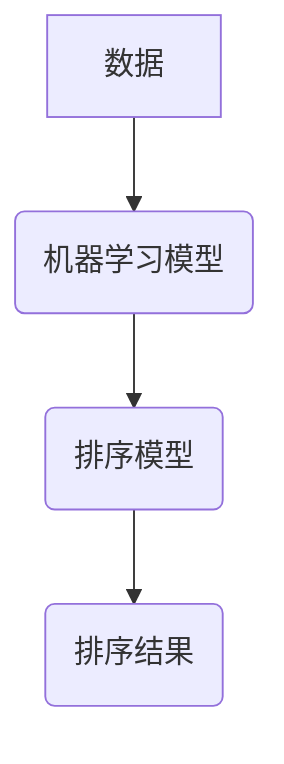

> 智能排序, 算法, 数据结构, 效率, 复杂度, 应用场景, 未来趋势

## 1. 背景介绍

在当今数据爆炸的时代，高效的排序算法已成为数据处理和分析的核心技术。传统的排序算法，如冒泡排序、插入排序、归并排序等，虽然在理论上已得到完善，但在面对海量数据时，其效率往往难以满足实际需求。随着人工智能技术的快速发展，智能排序技术应运而生，旨在通过学习和分析数据特征，实现更智能、更高效的排序。

智能排序技术融合了人工智能、数据结构和算法等多学科的优势，其核心思想是利用机器学习算法对数据进行建模，并根据模型预测的数据关系，进行排序。与传统的排序算法不同，智能排序算法能够根据数据的具体情况，动态调整排序策略，从而提高排序效率和准确性。

## 2. 核心概念与联系

**2.1 核心概念**

* **排序算法:**  用于将数据按照特定规则排列的算法。
* **数据结构:**  用于存储和组织数据的结构。
* **机器学习:**  一种人工智能技术，通过学习数据样本，建立模型，并进行预测。
* **深度学习:**  机器学习的一种高级形式，利用多层神经网络进行特征提取和学习。

**2.2 联系**

智能排序技术将机器学习算法与排序算法相结合，通过学习数据特征，构建排序模型，从而实现智能排序。



## 3. 核心算法原理 & 具体操作步骤

**3.1 算法原理概述**

智能排序算法的核心原理是利用机器学习模型学习数据特征，并根据模型预测的数据关系进行排序。常见的智能排序算法包括：

* **基于深度学习的排序算法:**  利用深度神经网络学习数据特征，并预测数据之间的排序关系。
* **基于树结构的排序算法:**  将数据构建成树形结构，并利用树的结构进行排序。
* **基于图结构的排序算法:**  将数据表示成图结构，并利用图的结构进行排序。

**3.2 算法步骤详解**

以基于深度学习的排序算法为例，其具体操作步骤如下：

1. **数据预处理:**  对原始数据进行清洗、转换和特征提取，以便于模型训练。
2. **模型训练:**  利用深度学习算法训练排序模型，并根据训练数据学习数据特征和排序关系。
3. **模型评估:**  利用测试数据评估模型的性能，并根据评估结果进行模型调优。
4. **排序预测:**  将待排序数据输入到训练好的模型中，模型根据学习到的特征和排序关系，预测数据的排序结果。

**3.3 算法优缺点**

**优点:**

* **高效率:**  智能排序算法能够根据数据特征动态调整排序策略，从而提高排序效率。
* **高准确性:**  智能排序算法能够学习数据之间的复杂关系，从而提高排序准确性。
* **可扩展性强:**  智能排序算法能够处理海量数据，并随着数据量的增加，其效率和准确性仍然保持较高水平。

**缺点:**

* **训练成本高:**  训练智能排序模型需要大量的计算资源和时间。
* **模型解释性差:**  深度学习模型的内部机制复杂，难以解释其排序决策。
* **数据依赖性强:**  智能排序算法的性能取决于训练数据的质量和数量。

**3.4 算法应用领域**

智能排序技术在各个领域都有广泛的应用，例如：

* **搜索引擎:**  用于对搜索结果进行排序，提高用户体验。
* **电商平台:**  用于对商品进行排序，推荐用户感兴趣的商品。
* **社交媒体:**  用于对用户动态进行排序，展示用户感兴趣的内容。
* **推荐系统:**  用于对用户进行个性化推荐。

## 4. 数学模型和公式 & 详细讲解 & 举例说明

**4.1 数学模型构建**

智能排序算法通常采用深度学习模型，其数学模型可以表示为：

$$
f(x) = \sigma(W_L \sigma(W_{L-1} \cdots \sigma(W_1 x)) + b)
$$

其中：

* $f(x)$ 表示模型输出，即排序结果。
* $x$ 表示输入数据。
* $W_i$ 表示第 $i$ 层神经网络的权重矩阵。
* $b$ 表示偏置项。
* $\sigma$ 表示激活函数。

**4.2 公式推导过程**

深度学习模型的训练过程是通过优化模型参数来最小化损失函数的过程。损失函数通常定义为预测结果与真实结果之间的差异。常用的损失函数包括均方误差 (MSE) 和交叉熵损失 (Cross-Entropy Loss)。

**4.3 案例分析与讲解**

以基于深度学习的商品排序为例，假设我们有一个电商平台，需要对商品进行排序，以便于用户浏览和购买。我们可以使用深度学习模型学习商品特征和用户偏好，并根据模型预测的排序结果，对商品进行排序。

例如，我们可以将商品的标题、描述、价格、评价等信息作为输入数据，并利用深度学习模型学习这些特征之间的关系。模型训练完成后，我们可以将新的商品输入到模型中，模型会根据学习到的特征和用户偏好，预测该商品的排序结果。

## 5. 项目实践：代码实例和详细解释说明

**5.1 开发环境搭建**

* 操作系统: Ubuntu 20.04
* Python 版本: 3.8
* 深度学习框架: TensorFlow 2.0

**5.2 源代码详细实现**

```python
import tensorflow as tf

# 定义模型结构
model = tf.keras.models.Sequential([
    tf.keras.layers.Embedding(input_dim=10000, output_dim=128),
    tf.keras.layers.LSTM(units=64),
    tf.keras.layers.Dense(units=1, activation='sigmoid')
])

# 编译模型
model.compile(optimizer='adam', loss='binary_crossentropy', metrics=['accuracy'])

# 训练模型
model.fit(x_train, y_train, epochs=10)

# 预测排序结果
predictions = model.predict(x_test)
```

**5.3 代码解读与分析**

* **Embedding 层:** 将商品特征向量化，并将每个特征映射到一个低维向量空间。
* **LSTM 层:** 学习商品特征之间的时序关系，捕捉商品序列特征。
* **Dense 层:** 将 LSTM 层的输出映射到排序结果，输出值表示商品的排序分数。

**5.4 运行结果展示**

训练完成后，我们可以使用测试数据评估模型的性能，并根据评估结果进行模型调优。

## 6. 实际应用场景

**6.1 搜索引擎排序**

智能排序技术可以用于对搜索结果进行排序，提高用户体验。例如，Google 使用深度学习模型学习用户搜索行为和网页内容特征，并根据模型预测的排序结果，对搜索结果进行排序。

**6.2 电商平台商品排序**

智能排序技术可以用于对商品进行排序，推荐用户感兴趣的商品。例如，淘宝使用深度学习模型学习用户购买历史、浏览记录和商品特征，并根据模型预测的排序结果，对商品进行排序。

**6.3 社交媒体动态排序**

智能排序技术可以用于对用户动态进行排序，展示用户感兴趣的内容。例如，Facebook 使用深度学习模型学习用户好友关系、兴趣爱好和动态内容特征，并根据模型预测的排序结果，对用户动态进行排序。

**6.4 未来应用展望**

智能排序技术在未来将有更广泛的应用场景，例如：

* **个性化推荐:**  根据用户的个人喜好和行为，提供更精准的商品、服务和内容推荐。
* **医疗诊断:**  根据患者的症状和病史，预测疾病类型和治疗方案。
* **金融风险控制:**  根据用户的交易记录和信用评分，预测金融风险。

## 7. 工具和资源推荐

**7.1 学习资源推荐**

* **书籍:**
    * 深度学习
    * 人工智能
* **在线课程:**
    * Coursera: 深度学习
    * Udacity: 机器学习工程师
* **开源项目:**
    * TensorFlow
    * PyTorch

**7.2 开发工具推荐**

* **Python:**  人工智能开发的常用语言。
* **TensorFlow:**  开源深度学习框架。
* **PyTorch:**  开源深度学习框架。
* **Jupyter Notebook:**  交互式编程环境。

**7.3 相关论文推荐**

* **Attention Is All You Need**
* **BERT: Pre-training of Deep Bidirectional Transformers for Language Understanding**
* **EfficientNet: Rethinking Model Scaling for Convolutional Neural Networks**

## 8. 总结：未来发展趋势与挑战

**8.1 研究成果总结**

智能排序技术在近年来取得了显著进展，其效率和准确性不断提高。深度学习算法的应用使得智能排序算法能够学习数据之间的复杂关系，并实现更精准的排序。

**8.2 未来发展趋势**

* **模型效率提升:**  研究更轻量级、更高效的深度学习模型，以降低智能排序算法的计算成本。
* **解释性增强:**  研究更易于解释的深度学习模型，以便于理解智能排序算法的决策过程。
* **数据隐私保护:**  研究保护用户数据隐私的智能排序算法，以确保用户数据安全。

**8.3 面临的挑战**

* **数据质量:**  智能排序算法的性能取决于训练数据的质量和数量。
* **模型解释性:**  深度学习模型的内部机制复杂，难以解释其排序决策。
* **数据隐私保护:**  智能排序算法需要处理大量用户数据，需要确保用户数据安全。

**8.4 研究展望**

未来，智能排序技术将继续朝着更高效、更准确、更安全的方向发展。研究人员将继续探索新的算法和模型，以解决智能排序技术面临的挑战，并将其应用于更多领域。

## 9. 附录：常见问题与解答

**9.1 如何选择合适的智能排序算法？**

选择合适的智能排序算法需要根据具体应用场景和数据特点进行选择。例如，对于海量数据，可以选择基于树结构或图结构的排序算法；对于需要学习用户偏好的场景，可以选择基于深度学习的排序算法。

**9.2 如何评估智能排序算法的性能？**

常用的评估指标包括准确率、召回率、F1-score等。

**9.3 如何保护用户数据隐私？**

可以使用差分隐私等技术来保护用户数据隐私。


作者：禅与计算机程序设计艺术 / Zen and the Art of Computer Programming 
<end_of_turn>