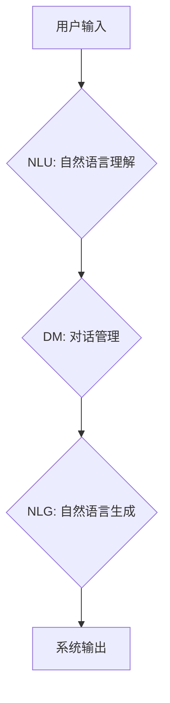

> CUI, 数字产品, 人机交互, 自然语言处理, 虚拟现实, 增强现实, 跨平台, 跨设备

## 1. 背景介绍

随着人工智能、虚拟现实 (VR)、增强现实 (AR) 等技术的快速发展，传统的图形用户界面 (GUI) 已经难以满足用户日益增长的交互需求。新的交互方式，例如自然语言交互、手势识别、语音识别等，正在逐渐成为主流。其中，基于自然语言的交互方式，即 **CUI (Conversational User Interface)**，因其更接近人类的自然沟通方式，而备受关注。

CUI 是一种以对话形式进行人机交互的界面，它允许用户使用自然语言与系统进行交流，就像与真人对话一样。CUI 的出现，标志着人机交互进入了一个新的时代，它将彻底改变我们与数字产品交互的方式。

## 2. 核心概念与联系

CUI 的核心概念是将自然语言理解和生成技术与用户界面设计相结合，实现更自然、更直观、更便捷的人机交互。

**CUI 的核心技术包括：**

* **自然语言理解 (NLU)：** 能够理解用户输入的自然语言，将其转换为机器可理解的结构化数据。
* **自然语言生成 (NLG)：** 能够根据机器的理解结果，生成自然流畅的文本回复。
* **对话管理 (DM)：** 负责管理对话流程，理解用户意图，并提供相应的回复。

**CUI 与其他技术的关系：**

CUI 可以与其他技术相结合，实现更丰富的交互体验。例如：

* **VR/AR 技术：** CUI 可以与 VR/AR 技术相结合，为用户提供沉浸式的交互体验。
* **机器学习 (ML)：** CUI 可以利用机器学习技术，不断学习用户的行为模式，提供更个性化的交互体验。
* **大数据 (Big Data)：** CUI 可以利用大数据分析技术，了解用户的需求和偏好，提供更精准的推荐和服务。

**Mermaid 流程图：**



## 3. 核心算法原理 & 具体操作步骤

### 3.1  算法原理概述

CUI 的核心算法主要包括自然语言理解 (NLU) 和自然语言生成 (NLG) 算法。

* **NLU 算法：** 主要用于识别用户输入中的实体、关系和意图。常用的 NLU 算法包括：
    * **词袋模型 (Bag-of-Words)：** 将文本表示为词的集合，忽略词的顺序。
    * **TF-IDF：** 统计词在文档中的重要性，用于关键词提取和文本分类。
    * **深度学习模型 (RNN, LSTM, BERT)：** 可以学习文本的语义和上下文信息，提高 NLU 的准确率。

* **NLG 算法：** 主要用于根据机器的理解结果，生成自然流畅的文本回复。常用的 NLG 算法包括：
    * **模板填充：** 使用预定义的模板，将机器理解的结果填充到模板中。
    * **序列生成模型 (Seq2Seq)：** 使用深度学习模型，学习文本的生成规律，生成更自然流畅的回复。

### 3.2  算法步骤详解

**NLU 算法步骤：**

1. **文本预处理：** 将用户输入的文本进行清洗、分词、词形还原等操作，去除停用词、标点符号等无用信息。
2. **特征提取：** 使用词袋模型、TF-IDF 等算法，提取文本中的关键词和特征。
3. **实体识别：** 使用命名实体识别 (NER) 算法，识别文本中的实体，例如人名、地名、机构名等。
4. **关系抽取：** 使用关系抽取算法，识别文本中的关系，例如“张三是北京大学的学生”。
5. **意图识别：** 使用意图识别算法，识别用户输入的意图，例如“查询天气”、“预订酒店”等。

**NLG 算法步骤：**

1. **理解机器理解结果：** 将机器理解的结果，例如实体、关系、意图等，转换为机器可理解的结构化数据。
2. **选择合适的回复模板：** 根据用户输入的意图，选择合适的回复模板。
3. **填充回复模板：** 将机器理解的结果填充到回复模板中，生成自然流畅的文本回复。

### 3.3  算法优缺点

**NLU 算法：**

* **优点：** 可以理解用户输入的自然语言，提高人机交互的自然度。
* **缺点：** 准确率仍然存在一定差距，难以理解复杂的语义和上下文信息。

**NLG 算法：**

* **优点：** 可以生成自然流畅的文本回复，提高用户体验。
* **缺点：** 生成回复的质量仍然存在一定差距，难以生成个性化、富有创意的回复。

### 3.4  算法应用领域

CUI 算法在各个领域都有广泛的应用，例如：

* **智能客服：** 提供 24 小时在线客服服务，自动解答用户常见问题。
* **语音助手：** 例如 Siri、Alexa、Google Assistant 等，可以理解用户的语音指令，并执行相应的操作。
* **智能家居：** 可以通过语音控制家电设备，例如空调、电视、灯光等。
* **教育培训：** 提供个性化的学习辅导，帮助学生更好地理解知识。

## 4. 数学模型和公式 & 详细讲解 & 举例说明

### 4.1  数学模型构建

CUI 的数学模型主要用于描述用户与系统的交互过程，以及对话管理的逻辑。

**对话状态跟踪 (DST)：**

DST 模型用于跟踪对话的上下文信息，理解用户的意图和需求。常用的 DST 模型包括：

* **隐马尔可夫模型 (HMM)：** 用于建模对话状态的转移概率。
* **条件随机场 (CRF)：** 用于建模对话状态和用户输入之间的关系。
* **深度学习模型 (RNN, LSTM)：** 可以学习对话的上下文信息，提高 DST 的准确率。

**数学公式：**

* **HMM 状态转移概率：**

$$P(s_t | s_{t-1})$$

* **CRF 状态概率：**

$$P(y_t | x_t, y_{<t})$$

**其中：**

* $s_t$ 表示对话状态 t。
* $s_{t-1}$ 表示对话状态 t-1。
* $x_t$ 表示用户输入 t。
* $y_t$ 表示对话状态 t 的标签。

### 4.2  公式推导过程

HMM 状态转移概率的推导过程：

1. 假设对话状态转移是一个马尔可夫过程，即对话状态只依赖于前一个状态。
2. 则状态转移概率可以表示为：

$$P(s_t | s_{t-1})$$

3. 其中，$P(s_t | s_{t-1})$ 表示从状态 $s_{t-1}$ 转移到状态 $s_t$ 的概率。

### 4.3  案例分析与讲解

**案例：**

用户输入： “今天天气怎么样？”

**对话状态跟踪过程：**

1. 用户输入 “今天天气怎么样？”，系统识别出用户意图是查询天气。
2. 系统根据用户意图，将对话状态更新为 “查询天气”。
3. 系统根据天气预报数据，生成相应的回复，例如 “今天天气晴朗”。

**数学模型应用：**

在该案例中，DST 模型可以用于跟踪对话状态，理解用户意图。HMM 或 CRF 模型可以用于建模对话状态的转移概率，预测用户下一步的意图。

## 5. 项目实践：代码实例和详细解释说明

### 5.1  开发环境搭建

* **操作系统：** Ubuntu 20.04 LTS
* **编程语言：** Python 3.8
* **开发工具：** VS Code
* **库依赖：**
    * NLTK
    * SpaCy
    * Rasa

### 5.2  源代码详细实现

```python
# 导入必要的库
import nltk
import spacy

# 下载 NLTK 数据
nltk.download('punkt')
nltk.download('averaged_perceptron_tagger')

# 加载 SpaCy 模型
nlp = spacy.load("en_core_web_sm")

# 定义一个函数，用于处理用户输入
def process_user_input(text):
    # 使用 SpaCy 进行分词和词性标注
    doc = nlp(text)

    # 提取关键信息，例如实体、关系等
    entities = [(ent.text, ent.label_) for ent in doc.ents]
    # ...

    # 返回处理后的结果
    return result

# 定义一个函数，用于生成系统回复
def generate_response(intent, entities):
    # 根据意图和实体，生成相应的回复
    # ...
    return response

# 主程序
if __name__ == "__main__":
    while True:
        # 获取用户输入
        user_input = input("用户：")

        # 处理用户输入
        processed_input = process_user_input(user_input)

        # 识别用户意图
        intent = recognize_intent(processed_input)

        # 生成系统回复
        response = generate_response(intent, processed_input['entities'])

        # 输出系统回复
        print("系统：", response)
```

### 5.3  代码解读与分析

* **代码结构：** 代码分为三个主要部分：用户输入处理、意图识别和系统回复生成。
* **用户输入处理：** 使用 SpaCy 进行分词和词性标注，提取关键信息，例如实体、关系等。
* **意图识别：** 使用机器学习模型识别用户意图，例如查询天气、预订酒店等。
* **系统回复生成：** 根据用户意图和实体，生成相应的回复。

### 5.4  运行结果展示

```
用户：今天天气怎么样？
系统：今天天气晴朗。
```

## 6. 实际应用场景

### 6.1  智能客服

CUI 可以用于构建智能客服系统，提供 24 小时在线客服服务，自动解答用户常见问题，例如：

* 查询订单状态
* 退换货流程
* 产品信息
* 常见问题解答

### 6.2  语音助手

CUI 可以用于构建语音助手，例如 Siri、Alexa、Google Assistant 等，可以理解用户的语音指令，并执行相应的操作，例如：

* 设置闹钟
* 播放音乐
* 发送短信
* 控制智能家居设备

### 6.3  教育培训

CUI 可以用于构建个性化的教育培训系统，例如：

* 提供个性化的学习辅导
* 答疑解惑
* 进行在线考试
* 提供学习进度跟踪

### 6.4  未来应用展望

CUI 的应用场景非常广泛，未来将有更多新的应用场景出现，例如：

* **医疗保健：** CUI 可以用于辅助医生诊断疾病、提供患者咨询服务。
* **金融服务：** CUI 可以用于提供个性化的理财建议、办理金融业务。
* **娱乐休闲：** CUI 可以用于构建沉浸式的游戏体验、提供个性化的内容推荐。

## 7. 工具和资源推荐

### 7.1  学习资源推荐

* **书籍：**
    * 《深度学习》
    * 《自然语言处理》
    * 《对话系统》
* **在线课程：**
    * Coursera
    * edX
    * Udacity

### 7.2  开发工具推荐

* **Rasa：** 开源对话平台，用于构建 CUI 应用。
* **Dialogflow：** Google 提供的对话平台，用于构建 CUI 应用。
* **Amazon Lex：** Amazon 提供的对话平台，用于构建 CUI 应用。

### 7.3  相关论文推荐

* **BERT：** Devlin et al. (2018)
* **GPT-3