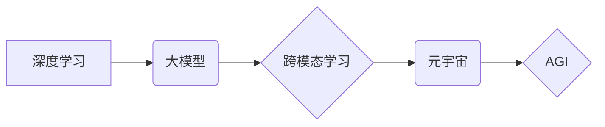

> 人工智能，深度学习，Transformer，大模型，元宇宙，AGI，伦理

## 1. 背景介绍

人工智能（AI）技术近年来发展迅速，从最初的局限于特定领域的应用，逐渐发展到涵盖各个领域的广泛应用。李开复，作为一位享誉全球的人工智能专家，在《AI 2.0 时代的趋势》一文中，深刻洞察了当前AI技术发展现状，并对未来发展趋势进行了深入分析。

文章指出，我们正处于人工智能的第二个黄金时代，即AI 2.0时代。与AI 1.0时代相比，AI 2.0时代具有以下显著特点：

* **深度学习的兴起**: 深度学习算法的突破性进展，使得AI模型能够从海量数据中学习更复杂的模式，从而实现更精准、更智能的应用。
* **大模型的涌现**: 随着计算能力的提升和数据量的爆炸式增长，大规模的AI模型开始出现，这些模型拥有更强的泛化能力和适应性，能够应用于更广泛的领域。
* **跨模态学习的突破**: AI模型开始能够处理多种数据类型，例如文本、图像、音频等，实现跨模态的理解和交互，为更智能的应用提供了基础。
* **元宇宙的兴起**: 元宇宙概念的提出，为AI技术提供了新的应用场景，例如虚拟现实、增强现实等，将AI技术与人类体验深度融合。

## 2. 核心概念与联系

AI 2.0时代的核心概念包括深度学习、大模型、Transformer、元宇宙等。这些概念相互关联，共同推动着AI技术的进步。

**Mermaid 流程图：**



* **深度学习**: 基于多层神经网络的机器学习算法，能够从海量数据中学习复杂的模式。
* **大模型**: 拥有数亿甚至数十亿参数的AI模型，能够处理更复杂的任务，并具有更强的泛化能力。
* **Transformer**: 一种新型的深度学习架构，能够有效处理序列数据，例如文本和语音，在自然语言处理领域取得了突破性进展。
* **元宇宙**: 一种虚拟世界，将现实世界与虚拟世界融合，为AI技术提供了新的应用场景。
* **AGI**: 全球智能，指能够像人类一样思考、学习和解决问题的AI系统。

## 3. 核心算法原理 & 具体操作步骤

### 3.1  算法原理概述

深度学习算法的核心原理是利用多层神经网络模拟人类大脑的学习过程。每个神经元接收来自其他神经元的输入，并通过激活函数进行处理，最终输出到下一层神经元。通过训练，神经网络能够学习到输入数据与输出数据的映射关系，从而实现对数据的预测、分类、识别等任务。

### 3.2  算法步骤详解

深度学习算法的训练过程通常包括以下步骤：

1. **数据预处理**: 将原始数据进行清洗、转换、归一化等处理，使其能够被深度学习模型所接受。
2. **模型构建**: 根据具体的任务需求，选择合适的深度学习模型架构，并设置模型参数。
3. **模型训练**: 使用训练数据对模型进行训练，通过调整模型参数，使得模型能够准确地预测或分类数据。
4. **模型评估**: 使用测试数据对模型进行评估，并根据评估结果进行模型调优。
5. **模型部署**: 将训练好的模型部署到实际应用场景中，用于进行预测、分类、识别等任务。

### 3.3  算法优缺点

**优点**:

* **高精度**: 深度学习算法能够从海量数据中学习到复杂的模式，从而实现高精度的预测和分类。
* **自动化学习**: 深度学习算法能够自动学习数据特征，无需人工特征工程。
* **泛化能力强**: 经过充分训练的深度学习模型能够对新的数据进行有效预测和分类。

**缺点**:

* **数据依赖性强**: 深度学习算法需要大量的训练数据才能达到较高的精度。
* **计算资源消耗大**: 训练深度学习模型需要大量的计算资源，例如GPU。
* **可解释性差**: 深度学习模型的内部工作机制较为复杂，难以解释其决策过程。

### 3.4  算法应用领域

深度学习算法已广泛应用于各个领域，例如：

* **计算机视觉**: 图像识别、物体检测、图像分割等。
* **自然语言处理**: 文本分类、机器翻译、语音识别等。
* **推荐系统**: 商品推荐、内容推荐等。
* **医疗诊断**: 疾病诊断、影像分析等。
* **金融风险控制**: 欺诈检测、信用评估等。

## 4. 数学模型和公式 & 详细讲解 & 举例说明

### 4.1  数学模型构建

深度学习模型的核心是神经网络，其数学模型可以表示为多层感知机（MLP）。MLP由输入层、隐藏层和输出层组成，每一层都由多个神经元组成。每个神经元接收来自上一层的输入信号，并通过激活函数进行处理，最终输出到下一层神经元。

### 4.2  公式推导过程

假设一个神经网络有 $L$ 层，第 $l$ 层有 $N_l$ 个神经元，则神经网络的输出可以表示为：

$$
y = f_L(W_L \cdot f_{L-1}(W_{L-1} \cdot ... \cdot f_1(W_1 \cdot x))
$$

其中：

* $x$ 是输入向量
* $W_l$ 是第 $l$ 层神经元的权重矩阵
* $f_l$ 是第 $l$ 层神经元的激活函数
* $y$ 是输出向量

### 4.3  案例分析与讲解

例如，在图像识别任务中，输入向量 $x$ 是图像像素值，输出向量 $y$ 是图像类别概率分布。通过训练，神经网络能够学习到权重矩阵 $W_l$ 和激活函数 $f_l$，使得模型能够准确地预测图像类别。

## 5. 项目实践：代码实例和详细解释说明

### 5.1  开发环境搭建

使用Python语言开发深度学习项目，需要安装以下软件包：

* TensorFlow 或 PyTorch：深度学习框架
* NumPy：数值计算库
* Matplotlib：数据可视化库

### 5.2  源代码详细实现

以下是一个简单的图像分类示例代码，使用TensorFlow框架实现：

```python
import tensorflow as tf

# 定义模型结构
model = tf.keras.models.Sequential([
    tf.keras.layers.Conv2D(32, (3, 3), activation='relu', input_shape=(28, 28, 1)),
    tf.keras.layers.MaxPooling2D((2, 2)),
    tf.keras.layers.Conv2D(64, (3, 3), activation='relu'),
    tf.keras.layers.MaxPooling2D((2, 2)),
    tf.keras.layers.Flatten(),
    tf.keras.layers.Dense(10, activation='softmax')
])

# 编译模型
model.compile(optimizer='adam',
              loss='sparse_categorical_crossentropy',
              metrics=['accuracy'])

# 训练模型
model.fit(x_train, y_train, epochs=5)

# 评估模型
loss, accuracy = model.evaluate(x_test, y_test)
print('Test loss:', loss)
print('Test accuracy:', accuracy)
```

### 5.3  代码解读与分析

* **模型结构**: 代码定义了一个简单的卷积神经网络模型，包含两层卷积层、两层池化层、一层全连接层和一层输出层。
* **激活函数**: 使用ReLU激活函数，可以提高模型的表达能力。
* **损失函数**: 使用交叉熵损失函数，用于分类任务。
* **优化器**: 使用Adam优化器，可以加速模型训练。
* **训练过程**: 使用训练数据训练模型，并设置训练轮数（epochs）。
* **评估过程**: 使用测试数据评估模型的性能，并打印测试损失和准确率。

### 5.4  运行结果展示

训练完成后，可以将模型应用于新的图像数据进行预测。

## 6. 实际应用场景

### 6.1  医疗诊断

深度学习算法可以用于辅助医生进行疾病诊断，例如：

* **影像分析**: 利用深度学习算法对医学影像进行分析，例如X光片、CT扫描、MRI等，可以帮助医生识别肿瘤、骨折等病变。
* **病理学诊断**: 利用深度学习算法对病理切片进行分析，可以帮助医生诊断癌症、感染等疾病。

### 6.2  金融风险控制

深度学习算法可以用于金融风险控制，例如：

* **欺诈检测**: 利用深度学习算法分析交易数据，可以识别异常交易行为，从而预防欺诈行为。
* **信用评估**: 利用深度学习算法分析客户的信用历史数据，可以评估客户的信用风险，从而为贷款决策提供参考。

### 6.3  智能客服

深度学习算法可以用于构建智能客服系统，例如：

* **聊天机器人**: 利用深度学习算法训练聊天机器人，可以与用户进行自然语言对话，解答用户的问题，提供服务。
* **语音助手**: 利用深度学习算法训练语音助手，可以理解用户的语音指令，并执行相应的操作。

### 6.4  未来应用展望

随着AI技术的不断发展，深度学习算法将在更多领域得到应用，例如：

* **自动驾驶**: 深度学习算法可以用于训练自动驾驶汽车，使其能够感知周围环境，做出决策，实现自动驾驶。
* **个性化推荐**: 深度学习算法可以用于个性化推荐，例如推荐商品、内容、服务等，提高用户体验。
* **药物研发**: 深度学习算法可以用于药物研发，例如预测药物的活性，加速药物研发过程。

## 7. 工具和资源推荐

### 7.1  学习资源推荐

* **在线课程**: Coursera、edX、Udacity等平台提供深度学习相关的在线课程。
* **书籍**: 《深度学习》、《动手学深度学习》等书籍对深度学习原理和应用进行了详细介绍。
* **博客**: TensorFlow、PyTorch等深度学习框架的官方博客提供了最新的技术资讯和应用案例。

### 7.2  开发工具推荐

* **TensorFlow**: Google开发的开源深度学习框架，支持多种硬件平台，拥有丰富的功能和生态系统。
* **PyTorch**: Facebook开发的开源深度学习框架，以其灵活性和易用性而闻名。
* **Keras**: 一个高层深度学习API，可以运行在TensorFlow、Theano等底层框架之上，简化模型开发过程。

### 7.3  相关论文推荐

* **《ImageNet Classification with Deep Convolutional Neural Networks》**: AlexNet论文，标志着深度学习在图像识别领域的突破。
* **《Attention Is All You Need》**: Transformer论文，提出了一种新的序列模型架构，在自然语言处理领域取得了突破性进展。
* **《BERT: Pre-training of Deep Bidirectional Transformers for Language Understanding》**: BERT论文，提出了一种新的预训练语言模型，在自然语言理解任务中取得了优异的性能。

## 8. 总结：未来发展趋势与挑战

### 8.1  研究成果总结

AI 2.0时代取得了显著的成果，深度学习算法在各个领域取得了突破性进展，大模型的涌现为AI技术提供了新的发展方向，元宇宙概念为AI技术提供了新的应用场景。

### 8.2  未来发展趋势

* **模型规模的进一步扩大**: 大模型将继续朝着更大的规模发展，从而提升模型的性能和泛化能力。
* **多模态学习的深入研究**: AI模型将能够处理多种数据类型，实现跨模态的理解和交互。
* **AI伦理的关注**: 随着AI技术的不断发展，AI伦理问题将更加重要，需要制定相应的规范和制度，确保AI技术安全、可控、可持续发展。

### 8.3  面临的挑战