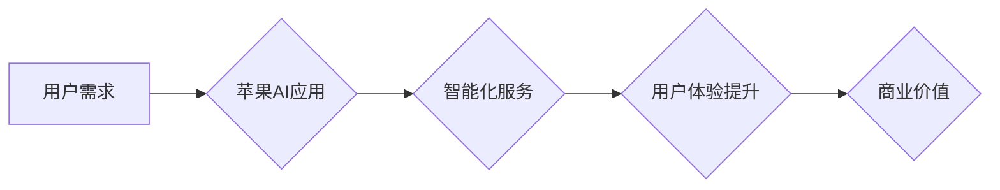

> 苹果, AI应用, 产业,  机器学习, 深度学习, 自然语言处理, 计算机视觉,  商业模式

## 1. 背景介绍

近年来，人工智能（AI）技术飞速发展，已渗透到生活的方方面面。从智能手机的语音助手到自动驾驶汽车，AI正在改变着我们的生活方式。作为科技巨头，苹果也积极布局AI领域，并将其融入到产品和服务中。2023年，苹果发布了一系列AI应用，标志着苹果正式迈入AI应用产业的时代。

## 2. 核心概念与联系

### 2.1 AI应用的定义

AI应用是指利用人工智能技术，为用户提供智能化服务的软件应用程序。这些应用通常能够通过机器学习、深度学习等算法，从海量数据中学习，并根据用户的需求提供个性化、智能化的服务。

### 2.2 苹果AI应用的优势

苹果拥有强大的硬件、软件和生态系统，为其AI应用提供了坚实的基础。

* **硬件优势:** 苹果自研的芯片，例如A系列芯片，拥有强大的计算能力，能够支持复杂的AI算法运行。
* **软件优势:** 苹果的iOS和macOS操作系统，以及其开发工具和框架，为AI应用开发提供了完善的生态系统。
* **生态优势:** 苹果拥有庞大的用户群体和完善的应用商店，为AI应用的推广和普及提供了广阔的市场。

### 2.3 AI应用的商业模式

苹果的AI应用采用多种商业模式，包括：

* **订阅模式:** 用户需要付费订阅才能使用AI应用的全部功能。
* **内购模式:** 用户可以在使用AI应用的过程中，购买额外的功能或内容。
* **数据驱动模式:** 苹果通过收集用户的数据，为其AI应用提供训练数据，并通过数据分析提供个性化服务。

**Mermaid 流程图**



## 3. 核心算法原理 & 具体操作步骤

### 3.1  算法原理概述

苹果AI应用的核心算法主要包括机器学习、深度学习和自然语言处理等。

* **机器学习:** 是一种人工智能技术，通过算法学习数据中的模式，并根据这些模式进行预测或分类。
* **深度学习:** 是一种更高级的机器学习技术，利用多层神经网络来模拟人类大脑的学习过程。
* **自然语言处理:** 是一种人工智能技术，旨在使计算机能够理解和处理人类语言。

### 3.2  算法步骤详解

以语音识别为例，其算法步骤如下：

1. **音频采集:** 使用麦克风采集用户的语音信号。
2. **音频预处理:** 对采集到的语音信号进行降噪、增强等处理，提高语音信号的质量。
3. **语音特征提取:** 从语音信号中提取特征，例如音素、频率、能量等。
4. **模型训练:** 使用机器学习或深度学习算法，训练语音识别模型。
5. **语音识别:** 将提取的语音特征输入到训练好的模型中，识别用户的语音内容。

### 3.3  算法优缺点

**优点:**

* **高精度:** 随着算法的不断改进，AI应用的精度越来越高。
* **自动化:** AI应用能够自动完成许多重复性任务，提高效率。
* **个性化:** AI应用能够根据用户的需求提供个性化服务。

**缺点:**

* **数据依赖:** AI应用需要大量的数据进行训练，数据质量直接影响应用的性能。
* **算法复杂:** AI算法的训练和部署需要专业的技术人员。
* **伦理问题:** AI应用的应用可能带来一些伦理问题，例如隐私泄露、算法偏见等。

### 3.4  算法应用领域

AI应用的应用领域非常广泛，包括：

* **智能助手:** 例如Siri、Alexa等，能够理解用户的语音指令，并提供相应的服务。
* **图像识别:** 例如人脸识别、物体识别等，能够识别图像中的内容。
* **自然语言处理:** 例如机器翻译、文本摘要等，能够理解和处理人类语言。
* **推荐系统:** 例如电商平台的商品推荐、音乐平台的歌曲推荐等，能够根据用户的喜好推荐相关内容。

## 4. 数学模型和公式 & 详细讲解 & 举例说明

### 4.1  数学模型构建

在机器学习中，常用的数学模型包括线性回归、逻辑回归、支持向量机等。

**线性回归模型:**

假设我们有一个数据集，包含n个样本，每个样本都有一个输入特征x和一个输出标签y。线性回归模型试图找到一条直线，能够尽可能地拟合这些样本点。

**公式:**

```latex
y = w_0 + w_1 * x
```

其中，$w_0$和$w_1$是模型的参数，需要通过训练数据进行学习。

### 4.2  公式推导过程

线性回归模型的目标是找到最优的参数$w_0$和$w_1$，使得模型的预测结果与实际标签之间的误差最小。常用的误差函数是均方误差（MSE）。

**公式:**

```latex
MSE = \frac{1}{n} \sum_{i=1}^{n} (y_i - \hat{y}_i)^2
```

其中，$y_i$是第i个样本的实际标签，$\hat{y}_i$是模型预测的标签。

通过最小化MSE，可以得到最优的参数$w_0$和$w_1$。

### 4.3  案例分析与讲解

例如，我们有一个数据集，包含房屋面积和房屋价格的信息。我们可以使用线性回归模型来预测房屋价格。

**数据:**

| 房屋面积 (平方米) | 房屋价格 (万元) |
|---|---|
| 60 | 100 |
| 80 | 150 |
| 100 | 200 |
| 120 | 250 |

**模型训练:**

使用线性回归模型训练上述数据，得到最优的参数$w_0$和$w_1$。

**预测:**

假设我们有一个新的房屋，面积为110平方米，我们可以使用训练好的模型来预测其价格。

```latex
\hat{y} = w_0 + w_1 * 110
```

其中，$\hat{y}$是模型预测的房屋价格。

## 5. 项目实践：代码实例和详细解释说明

### 5.1  开发环境搭建

* 操作系统: macOS
* 开发工具: Xcode
* 编程语言: Swift

### 5.2  源代码详细实现

```swift
import Foundation

class LinearRegression {
    var w0: Double
    var w1: Double

    init() {
        w0 = 0.0
        w1 = 0.0
    }

    func train(data: [(Double, Double)]) {
        // 计算模型参数
    }

    func predict(x: Double) -> Double {
        // 使用模型参数预测结果
    }
}
```

### 5.3  代码解读与分析

* `LinearRegression`类定义了一个线性回归模型。
* `train()`方法用于训练模型，根据训练数据计算模型参数$w_0$和$w_1$。
* `predict()`方法用于预测结果，根据输入特征$x$和模型参数，计算预测值$\hat{y}$。

### 5.4  运行结果展示

运行上述代码，可以训练一个线性回归模型，并使用该模型预测房屋价格。

## 6. 实际应用场景

### 6.1  智能助手

苹果的Siri智能助手利用自然语言处理技术，能够理解用户的语音指令，并提供相应的服务，例如设置提醒、发送邮件、播放音乐等。

### 6.2  图像识别

苹果的iPhone和iPad设备内置了图像识别功能，能够识别图像中的物体、场景和人脸。

### 6.3  推荐系统

苹果的App Store和iTunes Store利用推荐系统，根据用户的喜好和历史记录，推荐相关的应用和音乐。

### 6.4  未来应用展望

随着AI技术的不断发展，苹果AI应用的应用场景将更加广泛，例如：

* **医疗保健:** AI可以辅助医生诊断疾病、制定治疗方案。
* **教育:** AI可以个性化教学，帮助学生提高学习效率。
* **金融:** AI可以用于欺诈检测、风险评估等。

## 7. 工具和资源推荐

### 7.1  学习资源推荐

* **斯坦福大学CS229课程:** https://cs229.stanford.edu/
* **机器学习公开课:** https://www.coursera.org/learn/machine-learning

### 7.2  开发工具推荐

* **Xcode:** https://developer.apple.com/xcode/
* **TensorFlow:** https://www.tensorflow.org/

### 7.3  相关论文推荐

* **《ImageNet Classification with Deep Convolutional Neural Networks》:** https://arxiv.org/abs/1202.1038
* **《Attention Is All You Need》:** https://arxiv.org/abs/1706.03762

## 8. 总结：未来发展趋势与挑战

### 8.1  研究成果总结

苹果在AI领域取得了显著的成果，其AI应用已融入到产品和服务中，为用户提供智能化体验。

### 8.2  未来发展趋势

未来，苹果AI应用将朝着以下趋势发展：

* **更智能化:** AI应用将更加智能化，能够更好地理解用户的需求，提供更个性化的服务。
* **更广泛的应用场景:** AI应用将应用于更多领域，例如医疗保健、教育、金融等。
* **更强大的计算能力:** 随着芯片技术的进步，AI应用将拥有更强大的计算能力，能够处理更复杂的任务。

### 8.3  面临的挑战

苹果AI应用也面临一些挑战：

* **数据隐私:** AI应用需要大量的数据进行训练，如何保护用户数据隐私是一个重要问题。
* **算法偏见:** AI算法可能存在偏见，导致不公平的结果。
* **伦理问题:** AI应用的应用可能带来一些伦理问题，例如算法透明度、责任归属等。

### 8.4  研究展望

未来，苹果需要继续加大对AI技术的投入，解决上述挑战，推动AI应用的健康发展。

## 9. 附录：常见问题与解答

### 9.1  Q1: 苹果AI应用的安全性如何保证？

**A1:** 苹果重视用户隐私和数据安全，其AI应用采用多种安全措施，例如数据加密、身份验证等，确保用户数据安全。

### 9.2  Q2: 苹果AI应用的算法是否透明？

**A2:** 苹果致力于提高AI算法的透明度，并提供相关信息给用户，帮助用户了解算法的工作原理。

### 9.3  Q3: 苹果AI应用的未来发展方向是什么？

**A3:** 苹果将继续加大对AI技术的投入，将AI应用扩展到更多领域，为用户提供更智能化、更便捷的服务。


作者：禅与计算机程序设计艺术 / Zen and the Art of Computer Programming 
<end_of_turn>