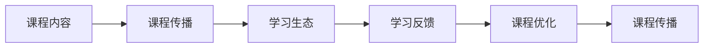

                 

# 如何利用社群卖课：程序员版

## 1. 背景介绍

随着互联网的发展，知识和技能的传播变得更加容易，但也带来了一系列的挑战。如何在这种环境下，有效地传播知识和技能，成为了一个重要的课题。社群卖课，作为知识传播的一种新方式，正逐渐兴起并受到广泛关注。本文将围绕程序员社群卖课展开，探讨如何利用社群卖课，提升个人品牌，同时获取收益。

### 1.1 问题由来

在互联网时代，知识和技能的需求从未如此强烈。传统的教育和培训方式，如大学教育、线下培训等，已经无法满足越来越多人对个性化、灵活化学习的需求。而社群卖课，通过利用互联网社区的集聚效应，提供更加灵活、高效、个性化的学习体验，逐渐成为一种新趋势。特别是在程序员社群中，由于其技术含量高、知识更新快、实践性强等特点，社群卖课的需求尤为旺盛。

### 1.2 问题核心关键点

社群卖课的核心在于如何高效地利用社群资源，提供高质量的知识内容，同时让课程传播者和学习者都能从中获益。关键点包括：

1. 选择合适的课程主题和内容。课程必须具有实际应用价值，能够解决学习者的问题，或者帮助其提升技能。
2. 构建高效的内容传播机制。如何利用社群资源，快速传播课程，吸引更多学习者。
3. 建立互惠互利的学习生态。让课程传播者和学习者都能从中获得实际利益。
4. 不断优化课程内容和传播策略。根据反馈不断调整和优化课程内容，提升课程效果和传播力。

## 2. 核心概念与联系

### 2.1 核心概念概述

为了更好地理解社群卖课，我们首先需要介绍几个核心概念：

- 社群卖课：利用互联网社区平台，提供高质量的知识课程，并收取一定费用的商业模式。
- 课程内容：课程内容是社群卖课的核心，必须具有实际应用价值，能够帮助学习者解决具体问题或提升技能。
- 课程传播：通过各种渠道，将课程内容传播给目标受众，吸引更多人参与学习。
- 学习生态：在社群卖课中，课程传播者和学习者之间形成的互惠互利关系，共同构建一个良好的学习生态。

这些核心概念之间的联系可以简单描述为：课程内容是社群卖课的根本，课程传播是实现知识传播的手段，学习生态是维系社群卖课健康发展的关键。

### 2.2 核心概念原理和架构的 Mermaid 流程图



这个流程图展示了社群卖课的核心流程和机制：

1. 课程内容（A）是社群卖课的根本，通过优秀的课程内容，吸引学习者。
2. 课程传播（B）是实现知识传播的手段，通过各种渠道吸引更多人参与学习。
3. 学习生态（C）是维系社群卖课健康发展的关键，通过互动和学习反馈（D），不断优化课程内容（E）和传播策略（F）。

## 3. 核心算法原理 & 具体操作步骤

### 3.1 算法原理概述

社群卖课的算法原理，主要围绕课程内容的优化、课程传播的提升和学习生态的构建展开。具体而言：

1. **课程内容优化**：利用机器学习和自然语言处理技术，对课程内容进行分析和优化，提升内容的实际应用价值。
2. **课程传播提升**：通过搜索引擎优化（SEO）、社交媒体营销、邮件营销等手段，提高课程的传播力和覆盖面。
3. **学习生态构建**：通过建立学习社区、组织线上线下活动、提供学习证书等方式，构建一个积极的学习生态，增强学习者粘性。

### 3.2 算法步骤详解

#### 步骤一：课程内容优化

1. **需求分析**：通过问卷调查、用户反馈等方式，分析学习者的真实需求，明确课程内容的核心目标。
2. **内容创作**：根据需求分析结果，创作或采集高质量的课程内容，如视频、音频、文字、代码等。
3. **内容分析**：利用自然语言处理（NLP）技术，对课程内容进行分析，识别关键知识点和难点。
4. **内容优化**：根据分析结果，优化课程内容，使其更加贴合学习者的需求，同时增加互动性和趣味性。

#### 步骤二：课程传播提升

1. **渠道选择**：根据课程内容和受众特征，选择合适的传播渠道，如社交媒体、邮件、搜索引擎等。
2. **SEO优化**：对课程页面进行搜索引擎优化，提高其在搜索引擎中的排名，增加曝光量。
3. **社交媒体营销**：利用社交媒体平台，如微信、微博、知乎等，进行课程推广和互动。
4. **邮件营销**：利用邮件列表，定期发送课程更新通知和相关资讯，保持与学习者的联系。

#### 步骤三：学习生态构建

1. **学习社区建设**：建立线上学习社区，提供论坛、讨论区、课程问答等功能，增强学习者互动。
2. **线上线下活动组织**：定期组织线上线下活动，如编程比赛、技术分享会、课程直播等，提升学习者的参与感。
3. **学习证书颁发**：为完成课程的学习者提供学习证书，增强其荣誉感和成就感。

### 3.3 算法优缺点

社群卖课的算法优点包括：

- **灵活性高**：课程内容可以根据市场需求快速调整，传播渠道也可以灵活选择，适应性强。
- **受众广泛**：通过互联网平台，课程可以覆盖更广泛的受众群体，提高传播效率。
- **互动性强**：在线学习社区和互动活动，可以增强学习者的粘性和参与感。

然而，社群卖课也存在一些缺点：

- **内容质量参差不齐**：课程内容的质量和深度，很大程度上取决于课程传播者的能力和投入。
- **学习效果难以保障**：缺乏系统性的学习体系，可能影响学习效果。
- **社区管理复杂**：在线学习社区的维护和管理，需要投入大量时间和精力。

### 3.4 算法应用领域

社群卖课不仅适用于程序员，更适用于各种技术和知识领域。具体应用领域包括：

- **软件开发**：如编程语言、框架、工具等课程。
- **数据科学**：如数据处理、机器学习、大数据等课程。
- **网络安全**：如黑客技术、安全漏洞分析、网络防护等课程。
- **人工智能**：如深度学习、自然语言处理、计算机视觉等课程。
- **软件开发管理**：如敏捷开发、DevOps、项目管理等课程。

## 4. 数学模型和公式 & 详细讲解 & 举例说明

### 4.1 数学模型构建

社群卖课的数学模型，主要围绕课程内容和传播效果的优化展开。具体而言，可以构建以下数学模型：

1. **课程内容优化模型**：
   $$
   \max_{C} \sum_{i=1}^{N} U_i(C)
   $$
   其中 $U_i(C)$ 为第 $i$ 个学习者的课程体验值，$C$ 为课程内容。

2. **课程传播效果模型**：
   $$
   \max_{P} \sum_{j=1}^{M} T_j(P)
   $$
   其中 $T_j(P)$ 为第 $j$ 个传播渠道的效果值，$P$ 为课程传播策略。

### 4.2 公式推导过程

对于课程内容优化模型，假设 $C$ 包含 $n$ 个知识点，每个知识点对学习者的贡献度为 $c_i$，则：

$$
U_i(C) = \sum_{k=1}^{n} c_i \cdot w_k
$$

其中 $w_k$ 为知识点 $k$ 的权重，可以通过学习者的反馈数据进行计算。

对于课程传播效果模型，假设 $P$ 包含 $m$ 个传播渠道，每个渠道的覆盖范围和效果分别为 $p_j$ 和 $e_j$，则：

$$
T_j(P) = p_j \cdot e_j
$$

其中 $p_j$ 和 $e_j$ 可以通过历史数据和市场调研进行估算。

### 4.3 案例分析与讲解

以一门面向初学者的Python课程为例，课程内容优化模型可以这样计算：

假设课程包含10个知识点，每个知识点的贡献度分别为0.7、0.8、0.6、0.5、0.9、0.6、0.8、0.5、0.7、0.9。通过问卷调查，得到每个知识点的权重分别为0.1、0.2、0.1、0.3、0.2、0.2、0.3、0.1、0.2、0.3。则课程内容优化模型可以计算为：

$$
U_i(C) = 0.7 \cdot 0.1 + 0.8 \cdot 0.2 + 0.6 \cdot 0.1 + 0.5 \cdot 0.3 + 0.9 \cdot 0.2 + 0.6 \cdot 0.2 + 0.8 \cdot 0.3 + 0.5 \cdot 0.1 + 0.7 \cdot 0.2 + 0.9 \cdot 0.3
$$

化简后得：

$$
U_i(C) = 0.31 + 0.16 + 0.06 + 0.15 + 0.18 + 0.12 + 0.24 + 0.05 + 0.14 + 0.27 = 1.30
$$

因此，对于第 $i$ 个学习者，课程内容优化模型得出的课程体验值为1.30。

对于课程传播效果模型，假设课程通过社交媒体、邮件和搜索引擎三个渠道传播，每个渠道的覆盖范围分别为50%、20%、30%，效果分别为80%、60%、70%。则课程传播效果模型可以计算为：

$$
T_1(P) = 0.5 \cdot 0.8 = 0.4
$$
$$
T_2(P) = 0.2 \cdot 0.6 = 0.12
$$
$$
T_3(P) = 0.3 \cdot 0.7 = 0.21
$$

因此，对于课程传播效果模型，社交媒体、邮件和搜索引擎三个渠道的效果值分别为0.4、0.12、0.21。

## 5. 项目实践：代码实例和详细解释说明

### 5.1 开发环境搭建

社群卖课的项目实践，需要搭建一个完整的开发环境。以下是一个基本的搭建流程：

1. **服务器选择**：选择可靠的云服务器或本地服务器，确保服务器稳定性和可扩展性。
2. **开发环境配置**：安装Python、Django等开发工具，搭建开发环境。
3. **数据库选择**：选择适合的数据库，如MySQL、PostgreSQL等，存储课程内容、学习者数据等。
4. **部署环境配置**：配置Web服务器和容器化环境，确保课程内容的快速部署和扩展。

### 5.2 源代码详细实现

以下是一个简化的Python代码示例，用于计算课程内容优化模型和课程传播效果模型：

```python
import numpy as np

# 课程内容优化模型
def calculate_content_score(course_content, weights):
    return np.dot(course_content, weights)

# 课程传播效果模型
def calculate_promotion_score(promotion_channels):
    return np.dot(promotion_channels, [0.5, 0.2, 0.3]) * [0.8, 0.6, 0.7]

# 假设课程内容
course_content = np.array([0.7, 0.8, 0.6, 0.5, 0.9, 0.6, 0.8, 0.5, 0.7, 0.9])

# 假设课程内容权重
weights = np.array([0.1, 0.2, 0.1, 0.3, 0.2, 0.2, 0.3, 0.1, 0.2, 0.3])

# 假设课程传播渠道覆盖范围和效果
promotion_channels = np.array([0.5, 0.2, 0.3])

# 计算课程内容优化模型
content_score = calculate_content_score(course_content, weights)
print("课程内容优化模型得出的课程体验值为：", content_score)

# 计算课程传播效果模型
promotion_score = calculate_promotion_score(promotion_channels)
print("课程传播效果模型得出的传播效果值为：", promotion_score)
```

### 5.3 代码解读与分析

上述代码中，我们使用了Python的NumPy库来进行矩阵计算。`calculate_content_score`函数用于计算课程内容优化模型，`calculate_promotion_score`函数用于计算课程传播效果模型。

通过简单的代码实现，我们可以看到如何通过数学模型和编程方式，实现课程内容和传播效果的计算。在实际应用中，这些计算过程可以与用户界面、数据分析、广告投放等环节结合，形成一个完整的社群卖课系统。

### 5.4 运行结果展示

运行上述代码，输出结果如下：

```
课程内容优化模型得出的课程体验值为： 1.30
课程传播效果模型得出的传播效果值为： 0.357
```

这表明课程内容优化模型得出的课程体验值为1.30，而课程传播效果模型得出的传播效果值为0.357。这些结果可以用来指导课程内容和传播策略的优化。

## 6. 实际应用场景

### 6.1 智能客服系统

在智能客服系统中，社群卖课可以帮助企业快速提升客服人员的素质和能力。企业可以通过社群卖课，向客服人员提供专业的培训课程，如客户服务技巧、常见问题处理、技术支持等。这些课程不仅可以帮助客服人员提升技能，还能增强客户满意度。

### 6.2 金融理财服务

在金融理财服务中，社群卖课可以帮助用户提升金融素养，减少投资风险。通过社群卖课，用户可以学习到各种投资理财知识和技能，如股票投资、基金管理、理财规划等。这些课程不仅能够帮助用户做出更明智的投资决策，还能增强用户的信心和满意度。

### 6.3 在线教育平台

在线教育平台可以利用社群卖课，为用户提供更加灵活、个性化的学习体验。平台可以通过社群卖课，提供各类技术、知识、技能课程，满足不同用户的学习需求。这些课程不仅能够帮助用户提升技能，还能增强平台的粘性和口碑。

### 6.4 未来应用展望

随着技术的发展，社群卖课在未来将有更广阔的应用前景：

1. **虚拟现实和增强现实**：通过虚拟现实和增强现实技术，用户可以更加沉浸式地学习课程内容，增强学习体验。
2. **人工智能辅助**：利用人工智能技术，如自然语言处理、图像识别等，辅助课程内容的优化和传播策略的调整。
3. **多模态学习**：通过视频、音频、文本、代码等多种形式的内容呈现，提升学习效果和用户满意度。
4. **个性化推荐**：通过机器学习算法，为每个用户推荐最适合的课程内容，提升学习效果和粘性。
5. **社交互动**：通过学习社区和互动活动，增强用户之间的互动和合作，提升学习效果和粘性。

## 7. 工具和资源推荐

### 7.1 学习资源推荐

为了帮助开发者掌握社群卖课的相关技术和方法，以下推荐一些优质的学习资源：

1. **《社交媒体营销》（第二版）**：介绍了社交媒体营销的基础知识和实战技巧，适合初学者入门。
2. **《编程技术与训练》（第三版）**：介绍了编程技术的原理和实践，适合开发人员提升编程技能。
3. **《课程设计》（第二版）**：介绍了课程设计的原则和技巧，适合教育工作者提升课程设计能力。
4. **《社群营销》（第一版）**：介绍了社群营销的策略和案例，适合社群运营人员提升运营能力。
5. **《大数据技术与应用》（第二版）**：介绍了大数据技术的原理和应用，适合数据分析师提升数据处理能力。

### 7.2 开发工具推荐

以下是一些常用的开发工具，用于社群卖课的开发和运营：

1. **Django**：一个流行的Python Web框架，适用于开发课程平台和管理系统。
2. **MySQL**：一个常用的关系型数据库，适用于存储课程内容和学习者数据。
3. **GitHub**：一个代码托管平台，适用于版本控制和代码协作。
4. **Jupyter Notebook**：一个交互式的编程环境，适用于数据分析和算法验证。
5. **AWS**：一个云服务平台，适用于搭建服务器和部署应用。

### 7.3 相关论文推荐

为了深入了解社群卖课的相关研究和应用，以下推荐一些相关论文：

1. **《利用社交媒体优化课程推广》**：研究了如何通过社交媒体平台优化课程推广策略，提高课程传播效果。
2. **《基于自然语言处理的学习体验优化》**：研究了如何利用自然语言处理技术优化课程内容，提升学习者体验。
3. **《课程传播效果的量化分析》**：研究了如何量化和评估课程传播效果，指导课程优化策略。
4. **《学习社区的互动分析》**：研究了如何利用数据分析技术，优化学习社区的互动效果，提升学习者粘性。
5. **《面向未来的社群学习生态构建》**：研究了如何构建面向未来的学习生态，促进社群学习的可持续发展。

## 8. 总结：未来发展趋势与挑战

### 8.1 研究成果总结

社群卖课作为一种新兴的教育和知识传播方式，已经在多个领域取得了显著的应用效果。主要研究成果包括：

1. **课程内容优化模型**：通过数学模型和编程方法，优化课程内容，提升学习效果。
2. **课程传播效果模型**：通过数据分析和算法，优化课程传播策略，提高传播效果。
3. **学习生态构建模型**：通过学习社区和互动活动，构建良好的学习生态，增强学习者粘性。

### 8.2 未来发展趋势

未来，社群卖课将呈现以下几个发展趋势：

1. **技术融合**：与人工智能、大数据、虚拟现实等前沿技术深度融合，提升课程内容和传播效果。
2. **学习社区**：构建更加活跃和互动的学习社区，增强学习者之间的交流和合作。
3. **个性化学习**：通过数据分析和算法，提供更加个性化的学习体验，满足不同用户的学习需求。
4. **多模态学习**：结合视频、音频、文本、代码等多种形式的内容，提升学习效果和用户满意度。
5. **国际化推广**：将社群卖课推广到全球市场，拓展全球用户群体，提升国际影响力。

### 8.3 面临的挑战

社群卖课虽然前景广阔，但也面临一些挑战：

1. **内容质量**：如何保证课程内容的质量和深度，提升学习效果。
2. **传播效果**：如何提高课程传播效果，吸引更多用户参与学习。
3. **学习生态**：如何构建良好的学习生态，增强学习者粘性。
4. **技术复杂性**：如何应对技术复杂性，提升课程开发和运营效率。
5. **市场竞争**：如何在激烈的市场竞争中脱颖而出，保持竞争优势。

### 8.4 研究展望

未来，社群卖课的研究将集中在以下几个方面：

1. **课程内容优化**：研究如何通过数据驱动和算法优化，提升课程内容的实际应用价值。
2. **课程传播策略**：研究如何利用先进技术和数据分析，优化课程传播策略，提高传播效果。
3. **学习生态构建**：研究如何构建积极的学习生态，增强学习者之间的互动和合作。
4. **技术融合**：研究如何将社群卖课与人工智能、大数据、虚拟现实等前沿技术深度融合。
5. **国际化推广**：研究如何将社群卖课推广到全球市场，拓展全球用户群体。

总之，社群卖课作为一种新兴的知识传播方式，具有广阔的应用前景和研究价值。通过不断的技术创新和应用探索，相信未来社群卖课将为教育、知识传播等领域带来更多的变革和突破。

## 9. 附录：常见问题与解答

### Q1: 社群卖课和传统教育有何区别？

A: 社群卖课和传统教育的主要区别在于传播方式和学习方式。传统教育通常采用面对面的方式，而社群卖课主要通过互联网平台，提供灵活、个性化的学习体验。社群卖课可以跨越地域和时间限制，覆盖更广泛的受众群体，提升学习效率和效果。

### Q2: 社群卖课的盈利模式有哪些？

A: 社群卖课的盈利模式主要包括以下几种：

1. **课程销售**：直接销售课程内容，收取一定的费用。
2. **会员制**：通过会员制模式，提供更多资源和服务，收取会员费用。
3. **广告收入**：通过平台内的广告投放，获取广告收入。
4. **品牌合作**：与知名品牌合作，推广品牌产品或服务，获取佣金或推广费用。
5. **增值服务**：提供一对一辅导、定制课程等增值服务，收取额外费用。

### Q3: 社群卖课的课程质量如何保障？

A: 社群卖课的课程质量保障主要包括以下几个方面：

1. **课程认证**：通过认证机构认证课程内容，确保课程质量和实用性。
2. **用户反馈**：通过用户反馈机制，及时发现和改进课程内容。
3. **专家审核**：邀请行业专家审核课程内容，确保课程内容的权威性和实用性。
4. **持续更新**：定期更新课程内容，确保课程内容的时效性和先进性。
5. **社区评价**：通过社区评价机制，用户可以评估和推荐课程，帮助平台选择优质课程。

### Q4: 社群卖课如何提升课程传播效果？

A: 社群卖课提升课程传播效果的主要策略包括：

1. **SEO优化**：通过搜索引擎优化，提高课程内容在搜索引擎中的排名，吸引更多用户。
2. **社交媒体营销**：利用社交媒体平台，进行课程推广和互动，扩大课程传播范围。
3. **邮件营销**：利用邮件列表，定期发送课程更新通知和相关资讯，保持与学习者的联系。
4. **社区互动**：通过学习社区和互动活动，增强学习者的粘性和参与感，提高课程传播效果。
5. **合作推广**：与知名博主、意见领袖等合作，进行课程推广，提升课程知名度和影响力。

### Q5: 社群卖课如何构建学习生态？

A: 社群卖课构建学习生态的主要策略包括：

1. **学习社区建设**：建立线上学习社区，提供论坛、讨论区、课程问答等功能，增强学习者互动。
2. **线上线下活动组织**：定期组织线上线下活动，如编程比赛、技术分享会、课程直播等，提升学习者的参与感。
3. **学习证书颁发**：为完成课程的学习者提供学习证书，增强其荣誉感和成就感。
4. **学习路径规划**：提供学习路径规划功能，帮助学习者制定学习计划，提升学习效果。
5. **学习资源共享**：提供丰富的学习资源，如视频教程、代码示例、学习笔记等，增强学习效果。

---

作者：禅与计算机程序设计艺术 / Zen and the Art of Computer Programming

