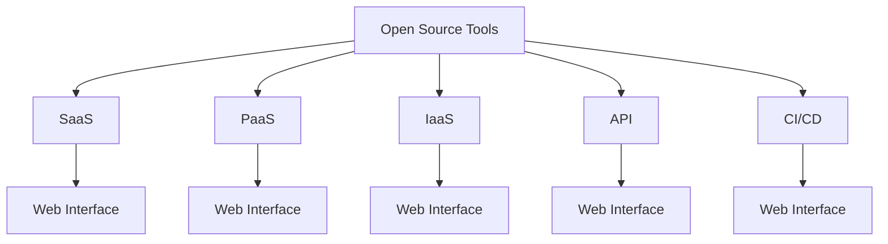

                 

# 如何将开源工具转化为SaaS产品

## 1. 背景介绍

在软件开发领域，开源工具一直以来都是程序员和开发者们的得力助手，它们为项目开发提供了强大的支持。然而，尽管开源工具的功能丰富、性能强大，但它们往往需要开发者具备一定的技术背景，并且依赖本地的开发环境，这对于没有专业技能的小团队或者个人开发者来说，可能难以轻易上手。

为了解决这一问题，许多企业和技术公司开始将开源工具转化为SaaS产品，即通过云计算的方式提供服务，使得开发者可以在不安装任何软件的情况下，直接通过浏览器访问和使用工具，大大降低了使用门槛，也简化了项目的部署和运维过程。

本文将详细介绍如何将开源工具转化为SaaS产品，涵盖从核心概念到具体实施步骤的全方位内容。

## 2. 核心概念与联系

### 2.1 核心概念概述

在将开源工具转化为SaaS产品的过程中，涉及到多个关键概念，它们相互联系，共同构成了SaaS产品的核心架构。

- **SaaS (Software as a Service)**：即软件即服务，是一种通过互联网提供软件服务的方式，用户无需安装软件即可使用。
- **PaaS (Platform as a Service)**：即平台即服务，提供的是应用程序开发和运行的平台，用户可以在上面部署和管理应用。
- **IaaS (Infrastructure as a Service)**：即基础设施即服务，提供的是计算资源（如服务器、存储、网络等），用户可以使用这些资源来搭建和运行应用。
- **Open Source Tools**：即开源工具，指通过开放源代码的方式共享的软件，用户可以自由修改和分发。
- **API (Application Programming Interface)**：即应用程序编程接口，用于不同软件组件之间的通信和交互。
- **CI/CD (Continuous Integration/Continuous Delivery)**：即持续集成/持续交付，是一种软件开发生命周期的自动化实践，用于提高开发和交付的效率和质量。

这些概念之间的逻辑关系可以通过以下Mermaid流程图来展示：



这个流程图展示了大语言模型的核心概念及其之间的关系：

1. 开源工具作为初始资源，可以通过PaaS、IaaS和API等形式转化为SaaS产品。
2. SaaS产品通过Web界面提供服务，用户无需安装任何软件即可使用。
3. PaaS和IaaS提供了计算资源和运行平台，确保SaaS产品的稳定性和可扩展性。
4. API用于连接不同模块，实现数据的交互和功能的整合。
5. CI/CD用于自动化开发和交付流程，提高效率和质量。

这些概念共同构成了SaaS产品的完整架构，使得开源工具能够以更易用、更高效的方式服务于广大用户。

## 3. 核心算法原理 & 具体操作步骤

### 3.1 算法原理概述

将开源工具转化为SaaS产品的核心算法原理是面向服务的架构(Software as a Service Architecture)，即通过云计算平台提供服务，用户只需要通过浏览器访问API，即可实现数据的传输和功能的调用。

其核心步骤如下：

1. **选择合适的云计算平台**：根据需求选择合适的云计算平台，如AWS、Google Cloud、Azure等，这些平台提供丰富的计算资源和灵活的配置选项。
2. **迁移和部署开源工具**：将开源工具迁移到云计算平台上，并进行部署和配置，确保其在云环境中的正常运行。
3. **设计API接口**：根据SaaS产品的功能需求，设计API接口，使得不同的模块和组件能够通过网络进行通信和数据交互。
4. **实现CI/CD流程**：引入CI/CD工具，实现代码的持续集成和持续交付，确保软件开发的自动化和高质量交付。
5. **构建Web界面**：开发Web界面，提供用户友好的使用体验，使得用户可以通过浏览器访问和操作SaaS产品。

### 3.2 算法步骤详解

以下详细介绍如何将开源工具转化为SaaS产品的详细步骤：

**Step 1: 选择云计算平台**

- 根据需求选择适合的云计算平台，如AWS、Google Cloud、Azure等。
- 考虑平台的可用性、稳定性、价格等因素，选择最适合自己业务需求的云平台。

**Step 2: 迁移和部署开源工具**

- 将开源工具迁移到选择的云计算平台上，如AWS的Elastic Beanstalk、Google Cloud的App Engine等。
- 根据云平台的要求进行配置和部署，确保工具在云环境中的正常运行。

**Step 3: 设计API接口**

- 根据SaaS产品的功能需求，设计API接口，定义数据传输和功能调用的规则。
- 使用RESTful API的标准，确保API接口的易用性和通用性。

**Step 4: 实现CI/CD流程**

- 引入CI/CD工具，如Jenkins、GitLab CI/CD等，自动化构建和部署流程。
- 设计CI/CD的流水线，确保代码的持续集成和持续交付。

**Step 5: 构建Web界面**

- 开发Web界面，提供用户友好的使用体验。
- 使用前端框架，如React、Vue.js等，构建动态和交互式的用户界面。

**Step 6: 测试和部署**

- 在云平台上测试SaaS产品的性能和稳定性。
- 部署SaaS产品到生产环境，确保其在实际使用中的表现。

### 3.3 算法优缺点

将开源工具转化为SaaS产品有以下优点：

- **降低使用门槛**：用户无需安装任何软件，只需要通过浏览器即可访问和使用，降低了使用门槛。
- **提高开发效率**：通过自动化CI/CD流程，减少了手工操作的环节，提高了开发效率。
- **提升可扩展性**：云平台提供丰富的计算资源和灵活的配置选项，可以按需扩展，适应业务需求的变化。

然而，该方法也存在一些缺点：

- **依赖网络环境**：SaaS产品的使用依赖于网络环境，网络故障可能导致服务中断。
- **数据安全性问题**：云平台上的数据传输和存储可能存在安全风险，需要采取相应的安全措施。
- **成本问题**：虽然使用云平台的成本较低，但需要考虑持续的计算和存储费用，以及数据传输成本。

尽管如此，将开源工具转化为SaaS产品依然是当前软件开发的一个重要趋势，通过云平台提供的强大计算能力和灵活部署方式，可以大大提升软件的可扩展性和使用效率。

### 3.4 算法应用领域

将开源工具转化为SaaS产品广泛应用于多个领域，例如：

- **软件开发**：提供代码编辑器、编译器、调试器等工具的SaaS版本，使得开发者可以在云端进行开发和调试。
- **数据分析**：提供数据可视化、统计分析等工具的SaaS版本，使得用户可以通过浏览器访问和使用。
- **项目管理**：提供项目管理工具的SaaS版本，如Jira、Trello等，用户可以在云端进行任务分配和进度跟踪。
- **设计工具**：提供设计工具的SaaS版本，如Sketch、Figma等，设计师可以在云端进行设计和管理。
- **云游戏**：提供云游戏的SaaS版本，用户无需安装游戏客户端，直接在浏览器中即可玩。

这些领域的SaaS产品为开发者和用户提供了全新的使用体验，极大地提升了工作效率和协作效率。

## 4. 数学模型和公式 & 详细讲解 & 举例说明

### 4.1 数学模型构建

本节将使用数学语言对SaaS产品的构建过程进行更加严格的刻画。

记云计算平台为 $P$，其中 $P$ 提供计算资源和运行平台。设 $T$ 为开源工具，用户通过API访问 $T$ 提供的功能 $f$。设计 $I$ 为Web界面，提供用户交互的界面。则SaaS产品的数学模型可表示为：

$$
S = P + T + I
$$

其中 $S$ 表示SaaS产品，$P$ 表示云计算平台，$T$ 表示开源工具，$I$ 表示Web界面。

### 4.2 公式推导过程

以下推导SaaS产品的构建过程所需的公式。

假设用户请求执行功能 $f$，则SaaS产品的响应过程如下：

1. 用户通过Web界面 $I$ 发送请求。
2. API接收请求并转发给云计算平台 $P$。
3. $P$ 根据请求调用开源工具 $T$ 提供的功能 $f$。
4. $T$ 执行功能 $f$ 并返回结果。
5. $P$ 将结果返回给API。
6. API将结果返回给Web界面 $I$，并呈现给用户。

这个过程可以用以下公式表示：

$$
\text{响应} = I \rightarrow API \rightarrow P \rightarrow T \rightarrow f \rightarrow P \rightarrow API \rightarrow I \rightarrow \text{结果}
$$

### 4.3 案例分析与讲解

**案例：云编译器**

假设开发了一个云编译器，可以将代码编译成可执行文件。其SaaS产品的构建过程如下：

1. 用户通过Web界面提交代码。
2. API接收代码并转发给云计算平台。
3. 云计算平台分配计算资源，并运行代码编译过程。
4. 编译器调用开源编译工具执行编译任务。
5. 编译器返回编译结果，并发送给API。
6. API将编译结果返回给Web界面，并呈现给用户。

这个过程可以用以下公式表示：

$$
\text{响应} = I \rightarrow API \rightarrow P \rightarrow T \rightarrow \text{编译器} \rightarrow f \rightarrow P \rightarrow API \rightarrow I \rightarrow \text{结果}
$$

其中 $I$ 为Web界面，$P$ 为云计算平台，$T$ 为开源编译工具，$f$ 为编译器提供的功能。

## 5. 项目实践：代码实例和详细解释说明

### 5.1 开发环境搭建

在进行SaaS产品开发前，需要先搭建好开发环境。以下是使用Python进行Flask开发的环境配置流程：

1. 安装Anaconda：从官网下载并安装Anaconda，用于创建独立的Python环境。

2. 创建并激活虚拟环境：
```bash
conda create -n flask-env python=3.8 
conda activate flask-env
```

3. 安装Flask：
```bash
pip install Flask
```

4. 安装相关工具包：
```bash
pip install flask-cors flask-restful flask-marshmallow
```

完成上述步骤后，即可在`flask-env`环境中开始SaaS产品开发。

### 5.2 源代码详细实现

下面我们以云编译器为例，给出使用Flask构建SaaS产品的PyTorch代码实现。

首先，定义Web接口的路由和视图函数：

```python
from flask import Flask, request, jsonify

app = Flask(__name__)

@app.route('/submit_code', methods=['POST'])
def submit_code():
    code = request.json.get('code')
    result = compile_and_run(code)
    return jsonify(result), 200

def compile_and_run(code):
    # 调用编译器执行代码编译
    # ...
    return result
```

然后，实现编译器的功能：

```python
from subprocess import Popen, PIPE

def compile_and_run(code):
    with open('code.py', 'w') as f:
        f.write(code)
    process = Popen(['python', '-c', 'exec(code)'], stdout=PIPE, stderr=PIPE)
    result, _ = process.communicate()
    return result
```

最后，运行SaaS产品并测试：

```python
if __name__ == '__main__':
    app.run(host='0.0.0.0', port=5000)
```

以上就是一个简单的云编译器SaaS产品的代码实现。可以看到，通过Flask框架，我们可以轻松地实现Web接口和API接口，调用编译器执行代码编译，并返回编译结果。

### 5.3 代码解读与分析

让我们再详细解读一下关键代码的实现细节：

**submit_code函数**：
- 定义了一个POST请求路由，用于接收用户提交的代码。
- 从请求中获取代码，并调用compile_and_run函数执行编译。
- 返回编译结果给用户。

**compile_and_run函数**：
- 定义了一个编译器函数，用于执行代码编译。
- 将代码写入本地文件，使用Popen调用Python执行代码，并获取编译结果。
- 返回编译结果给API接口。

**主程序**：
- 启动Flask应用，监听请求并响应。
- 将应用部署在云平台上，通过API接口提供服务。

**运行测试**：
- 运行SaaS产品，并在Web界面提交代码，观察编译结果。

## 6. 实际应用场景

### 6.1 软件开发

云编译器是SaaS产品的一个重要应用场景，可以提供代码编译、代码运行、代码调试等服务，使得开发者可以在云端进行代码开发和测试。

在技术实现上，可以将现有的编译器迁移到云平台上，通过API接口提供编译服务。用户可以通过Web界面上传代码，并实时查看编译结果，大大提高了代码开发的效率和协作效率。

### 6.2 数据分析

数据分析是SaaS产品的另一个重要应用场景，可以提供数据可视化、统计分析、机器学习等服务，使得用户可以通过Web界面访问和使用数据分析工具。

在技术实现上，可以将现有的数据分析工具迁移到云平台上，通过API接口提供数据服务。用户可以通过Web界面上传数据，并实时查看分析结果，大大提高了数据分析的效率和准确性。

### 6.3 云游戏

云游戏是SaaS产品的新兴应用场景，可以提供高性能、低延迟的游戏体验，使得用户无需安装游戏客户端，直接在浏览器中即可玩。

在技术实现上，可以将现有的游戏引擎迁移到云平台上，通过API接口提供游戏服务。用户可以通过Web界面选择游戏，并实时进行游戏操作，大大提高了游戏的可访问性和用户体验。

### 6.4 未来应用展望

随着SaaS产品技术的不断进步，未来其在各个领域的应用将更加广泛，带来更加便捷和高效的使用体验。

在智慧城市治理中，SaaS产品可以提供城市管理、公共服务、智慧交通等服务，提高城市管理的智能化水平。

在智能制造中，SaaS产品可以提供设备监控、生产调度、质量控制等服务，提升制造业的自动化和智能化水平。

在金融服务中，SaaS产品可以提供金融交易、风险评估、客户服务等服务，提高金融服务的效率和质量。

总之，SaaS产品通过云计算平台提供的强大计算能力和灵活部署方式，能够大大提升软件的可扩展性和使用效率，为各行各业带来全新的应用模式和商业模式。

## 7. 工具和资源推荐

### 7.1 学习资源推荐

为了帮助开发者系统掌握SaaS产品的开发技巧，这里推荐一些优质的学习资源：

1. 《Cloud Computing: Concepts, Technology, and Architecture》书籍：全面介绍了云计算的概念、技术和架构，是学习SaaS产品的必备资料。

2. 《Designing Cloud-Based Applications》在线课程：由云平台提供商提供的免费课程，讲解如何在云平台上构建和部署应用。

3. AWS文档：AWS提供的官方文档，涵盖了云平台的各种服务和工具的使用方法。

4. Google Cloud文档：Google Cloud提供的官方文档，涵盖了云平台的各种服务和工具的使用方法。

5. Microsoft Azure文档：Microsoft Azure提供的官方文档，涵盖了云平台的各种服务和工具的使用方法。

通过对这些资源的学习实践，相信你一定能够快速掌握SaaS产品的开发技巧，并用于解决实际的业务问题。

### 7.2 开发工具推荐

高效的开发离不开优秀的工具支持。以下是几款用于SaaS产品开发的常用工具：

1. Flask：Python开发的轻量级Web框架，适合构建API接口和Web界面。

2. Docker：开源容器技术，可以在不同环境中快速部署和运行应用。

3. Kubernetes：开源容器编排工具，可以实现应用的自动部署、扩展和管理。

4. Ansible：开源自动化工具，可以实现云平台资源的自动化部署和配置。

5. Terraform：开源基础设施即代码工具，可以将云平台资源描述为代码，实现自动化的资源部署和管理。

6. Jenkins：开源持续集成和持续交付工具，可以实现代码的自动构建、测试和部署。

合理利用这些工具，可以显著提升SaaS产品的开发效率，加快创新迭代的步伐。

### 7.3 相关论文推荐

SaaS产品技术的发展源于学界的持续研究。以下是几篇奠基性的相关论文，推荐阅读：

1. Cloud Computing: Concepts, Technology, and Architecture：介绍了云计算的概念、技术和架构，奠定了SaaS产品的发展基础。

2. Designing Cloud-Based Applications：讲解了如何在云平台上构建和部署应用，提供了丰富的案例和实践经验。

3. SaaS Architectures: Challenges and Considerations：讨论了SaaS架构设计和实施中的挑战和考虑因素，提供了有价值的参考。

这些论文代表了大语言模型微调技术的发展脉络。通过学习这些前沿成果，可以帮助研究者把握学科前进方向，激发更多的创新灵感。

## 8. 总结：未来发展趋势与挑战

### 8.1 研究成果总结

本文对将开源工具转化为SaaS产品的核心概念、算法原理和具体操作步骤进行了全面系统的介绍。首先阐述了SaaS产品的核心架构和开发流程，详细讲解了云计算平台、API接口、Web界面、CI/CD等关键组件的作用和实现方式。其次，通过云编译器的代码实现，展示了SaaS产品的具体开发过程和技术细节。最后，分析了SaaS产品在各个领域的应用前景，并给出了未来发展趋势和面临的挑战。

通过本文的系统梳理，可以看到，将开源工具转化为SaaS产品是当前软件开发的一个重要趋势，通过云计算平台提供的强大计算能力和灵活部署方式，可以大大提升软件的可扩展性和使用效率。未来，随着云计算技术的不断进步和SaaS产品的广泛应用，必将进一步推动各行业的数字化转型和智能化升级。

### 8.2 未来发展趋势

展望未来，SaaS产品的技术将呈现以下几个发展趋势：

1. **容器化和微服务架构**：通过容器化和微服务架构，提高应用的弹性、可扩展性和可维护性，使得SaaS产品更加灵活和高效。

2. **无服务器架构**：通过无服务器架构，减少硬件资源的浪费和成本，提升应用的响应速度和资源利用率。

3. **自动化部署和运维**：通过自动化部署和运维工具，减少手工操作的环节，提高部署和运维的效率和质量。

4. **数据驱动的决策**：通过大数据分析和机器学习，实现业务决策的自动化和智能化，提升业务运营的效率和效果。

5. **多云融合和混合云架构**：通过多云融合和混合云架构，实现资源的优化配置和跨云服务的使用，提升应用的稳定性和可靠性。

这些趋势将引领SaaS产品技术的发展，推动各行业的数字化转型和智能化升级，带来更大的商业价值和社会效益。

### 8.3 面临的挑战

尽管SaaS产品技术已经取得了瞩目成就，但在迈向更加智能化、普适化应用的过程中，它仍面临着诸多挑战：

1. **网络延迟和带宽问题**：云平台上的数据传输和访问可能存在网络延迟和带宽问题，影响应用性能。

2. **数据安全和隐私问题**：云平台上的数据存储和传输可能存在安全风险，需要采取相应的安全措施。

3. **计算资源和成本问题**：云平台上的计算资源和存储资源可能会带来高昂的成本，需要合理规划和管理。

4. **用户接口和体验问题**：Web界面的用户接口和用户体验可能存在不足，影响用户的使用体验。

5. **跨平台兼容性问题**：不同的操作系统和浏览器可能存在兼容性问题，影响应用的稳定性。

6. **资源消耗和效率问题**：云平台上的资源消耗和应用效率可能存在问题，需要优化资源使用和应用设计。

这些挑战需要开发者不断优化和改进，以提升SaaS产品的性能和可靠性，满足用户需求。

### 8.4 研究展望

面对SaaS产品面临的种种挑战，未来的研究需要在以下几个方面寻求新的突破：

1. **提升网络性能和稳定性**：通过优化网络架构和传输协议，减少网络延迟和带宽问题，提升应用的响应速度和稳定性。

2. **加强数据安全和隐私保护**：引入数据加密、访问控制等技术，保障云平台上的数据安全和隐私。

3. **优化资源使用和成本控制**：通过弹性计算和资源管理技术，优化云平台上的资源使用，降低成本。

4. **提升Web界面的用户体验**：通过前端技术优化，提升Web界面的用户接口和用户体验，提高用户的使用满意度。

5. **增强跨平台兼容性**：通过统一的API接口和标准，实现不同平台之间的互操作性和兼容性。

6. **提高应用效率和性能**：通过优化应用设计和算法，提高应用的效率和性能，减少资源消耗和延迟。

这些研究方向将引领SaaS产品技术的进步，推动各行业的数字化转型和智能化升级，带来更大的商业价值和社会效益。

## 9. 附录：常见问题与解答

**Q1：将开源工具转化为SaaS产品需要考虑哪些因素？**

A: 将开源工具转化为SaaS产品需要考虑以下因素：

1. **云计算平台的选择**：根据业务需求和资源需求，选择合适的云计算平台，如AWS、Google Cloud、Azure等。
2. **应用架构的设计**：根据业务需求，设计合理的云应用架构，包括Web界面、API接口、CI/CD等组件。
3. **数据安全和隐私**：采取合适的安全措施，保护云平台上的数据安全和隐私。
4. **网络性能和稳定性**：优化网络架构和传输协议，提升应用的响应速度和稳定性。
5. **用户接口和体验**：优化Web界面的用户接口和用户体验，提高用户的使用满意度。

**Q2：如何提升SaaS产品的性能和可靠性？**

A: 提升SaaS产品的性能和可靠性需要从多个方面进行优化：

1. **网络优化**：优化网络架构和传输协议，减少网络延迟和带宽问题，提升应用的响应速度和稳定性。
2. **安全保护**：引入数据加密、访问控制等技术，保障云平台上的数据安全和隐私。
3. **资源管理**：通过弹性计算和资源管理技术，优化云平台上的资源使用，降低成本。
4. **用户体验**：优化Web界面的用户接口和用户体验，提高用户的使用满意度。
5. **性能优化**：优化应用设计和算法，提高应用的效率和性能，减少资源消耗和延迟。

**Q3：SaaS产品的未来发展趋势是什么？**

A: SaaS产品的未来发展趋势包括：

1. **容器化和微服务架构**：通过容器化和微服务架构，提高应用的弹性、可扩展性和可维护性。
2. **无服务器架构**：通过无服务器架构，减少硬件资源的浪费和成本，提升应用的响应速度和资源利用率。
3. **自动化部署和运维**：通过自动化部署和运维工具，减少手工操作的环节，提高部署和运维的效率和质量。
4. **数据驱动的决策**：通过大数据分析和机器学习，实现业务决策的自动化和智能化。
5. **多云融合和混合云架构**：通过多云融合和混合云架构，实现资源的优化配置和跨云服务的使用。

**Q4：SaaS产品开发中需要考虑哪些关键技术？**

A: SaaS产品开发中需要考虑的关键技术包括：

1. **云计算平台**：选择合适的云计算平台，如AWS、Google Cloud、Azure等。
2. **Web界面**：开发用户友好的Web界面，提供用户交互的界面。
3. **API接口**：设计API接口，定义数据传输和功能调用的规则。
4. **CI/CD流程**：引入CI/CD工具，实现代码的持续集成和持续交付。
5. **安全保护**：采取合适的安全措施，保障数据安全和隐私。

**Q5：如何将开源工具迁移到云平台上？**

A: 将开源工具迁移到云平台上需要以下步骤：

1. **选择合适的云计算平台**：根据业务需求和资源需求，选择合适的云计算平台。
2. **迁移工具和数据**：将工具和数据迁移到云平台上，并进行配置和部署。
3. **测试和优化**：在云平台上测试工具的性能和稳定性，进行必要的优化和调整。

---

作者：禅与计算机程序设计艺术 / Zen and the Art of Computer Programming

