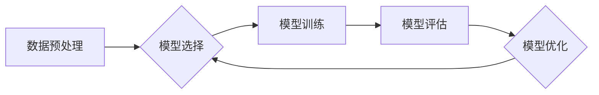

> 模型选择, 过拟合, 欠拟合, 交叉验证, 正则化, 性能指标, 机器学习

## 1. 背景介绍

在机器学习领域，模型选择是一个至关重要的步骤，它直接影响着模型的性能和泛化能力。模型选择是指在给定数据集的情况下，从众多候选模型中选择最适合该数据集的模型。

选择合适的模型对于机器学习任务至关重要。一个过拟合的模型可能在训练数据上表现出色，但在未见过的数据上表现糟糕，而一个欠拟合的模型则无法捕捉数据的复杂性，导致性能低下。

## 2. 核心概念与联系

模型选择的核心在于找到一个平衡点，既能充分拟合训练数据，又能避免过拟合，从而在未知数据上表现良好。

**模型选择流程:**



**核心概念:**

* **过拟合 (Overfitting):** 模型对训练数据拟合得太好，导致在未知数据上表现不佳。
* **欠拟合 (Underfitting):** 模型过于简单，无法捕捉数据的复杂性，导致在训练数据和未知数据上都表现不佳。
* **泛化能力 (Generalization Ability):** 模型在未知数据上的表现能力。

## 3. 核心算法原理 & 具体操作步骤

### 3.1  算法原理概述

模型选择算法通常基于以下原理：

* **性能指标:** 使用性能指标来评估模型的性能，例如准确率、召回率、F1-score等。
* **交叉验证:** 将数据划分为多个子集，使用不同的子集进行训练和测试，以评估模型的泛化能力。
* **正则化:** 通过添加惩罚项到模型的损失函数中，来防止模型过拟合。

### 3.2  算法步骤详解

1. **数据预处理:** 对数据进行清洗、转换和特征工程等操作，以提高模型的性能。
2. **模型选择:** 选择合适的模型类型，例如线性回归、逻辑回归、决策树、支持向量机等。
3. **参数调优:** 对模型的参数进行调整，以优化模型的性能。
4. **交叉验证:** 使用交叉验证技术来评估模型的泛化能力。
5. **模型评估:** 使用性能指标来评估模型的性能。
6. **模型选择:** 选择性能最好的模型。

### 3.3  算法优缺点

**优点:**

* 可以有效地避免过拟合。
* 可以评估模型的泛化能力。
* 可以找到最适合特定数据集的模型。

**缺点:**

* 计算成本较高。
* 需要一定的专业知识和经验。

### 3.4  算法应用领域

模型选择算法广泛应用于各种机器学习任务，例如：

* **分类:** 识别图像、文本、语音等数据。
* **回归:** 预测连续值，例如房价、股票价格等。
* **聚类:** 将数据点分组，例如客户分群、异常检测等。

## 4. 数学模型和公式 & 详细讲解 & 举例说明

### 4.1  数学模型构建

模型选择问题可以看作是一个优化问题，目标是找到一个模型参数向量 $\theta$，使得模型在训练数据上的损失函数最小化。

损失函数通常定义为模型预测值与真实值的差值，例如均方误差 (MSE) 或交叉熵 (Cross-Entropy)。

### 4.2  公式推导过程

假设我们使用均方误差作为损失函数，则模型的损失函数可以表示为：

$$
L(\theta) = \frac{1}{n} \sum_{i=1}^{n} (y_i - \hat{y}_i)^2
$$

其中：

* $n$ 是训练数据的样本数量。
* $y_i$ 是第 $i$ 个样本的真实值。
* $\hat{y}_i$ 是模型预测的第 $i$ 个样本的值。

为了最小化损失函数，我们可以使用梯度下降算法来更新模型参数 $\theta$。梯度下降算法的基本思想是沿着损失函数的负梯度方向更新参数，直到找到损失函数的最小值。

### 4.3  案例分析与讲解

假设我们使用线性回归模型来预测房价，训练数据包含房屋面积和房价的信息。我们可以使用模型选择算法来选择最合适的模型参数，以最小化模型的损失函数。

通过交叉验证和性能指标评估，我们可以选择一个具有良好泛化能力的模型，并将其用于预测新的房屋价格。

## 5. 项目实践：代码实例和详细解释说明

### 5.1  开发环境搭建

本项目使用 Python 语言和 scikit-learn 库进行开发。

需要安装以下软件包：

* Python 3.x
* scikit-learn

### 5.2  源代码详细实现

```python
from sklearn.model_selection import train_test_split, cross_val_score
from sklearn.linear_model import LinearRegression
from sklearn.metrics import mean_squared_error

# 加载数据
# ...

# 将数据划分为训练集和测试集
X_train, X_test, y_train, y_test = train_test_split(X, y, test_size=0.2, random_state=42)

# 创建线性回归模型
model = LinearRegression()

# 使用交叉验证评估模型性能
scores = cross_val_score(model, X_train, y_train, cv=5)
print("交叉验证得分:", scores)

# 训练模型
model.fit(X_train, y_train)

# 对测试集进行预测
y_pred = model.predict(X_test)

# 计算模型性能指标
mse = mean_squared_error(y_test, y_pred)
print("均方误差:", mse)
```

### 5.3  代码解读与分析

* `train_test_split()` 函数将数据划分为训练集和测试集。
* `cross_val_score()` 函数使用交叉验证技术评估模型性能。
* `fit()` 函数训练模型。
* `predict()` 函数对测试集进行预测。
* `mean_squared_error()` 函数计算模型性能指标。

### 5.4  运行结果展示

运行代码后，会输出模型的交叉验证得分和均方误差。

## 6. 实际应用场景

模型选择在机器学习的各个领域都有广泛的应用，例如：

* **图像识别:** 选择合适的图像分类模型，例如卷积神经网络 (CNN)。
* **自然语言处理:** 选择合适的文本分类模型，例如循环神经网络 (RNN)。
* **推荐系统:** 选择合适的推荐模型，例如协同过滤或深度学习模型。

### 6.4  未来应用展望

随着机器学习技术的不断发展，模型选择将变得更加复杂和重要。未来，模型选择领域的研究方向包括：

* **自动化模型选择:** 开发能够自动选择最优模型的算法。
* **多目标优化:** 考虑多个性能指标，选择兼顾所有指标的最佳模型。
* **迁移学习:** 利用已训练好的模型，在新的任务上进行模型选择。

## 7. 工具和资源推荐

### 7.1  学习资源推荐

* **书籍:**
    * "The Elements of Statistical Learning" by Trevor Hastie, Robert Tibshirani, and Jerome Friedman
    * "Pattern Recognition and Machine Learning" by Christopher Bishop
* **在线课程:**
    * Coursera: Machine Learning by Andrew Ng
    * edX: Introduction to Machine Learning by Columbia University

### 7.2  开发工具推荐

* **Python:** 
    * scikit-learn
    * TensorFlow
    * PyTorch

### 7.3  相关论文推荐

* "Regularization and the Bias-Variance Tradeoff" by George E. P. Box and William G. Hunter
* "Cross-Validation" by Leo Breiman and Jerome Friedman

## 8. 总结：未来发展趋势与挑战

### 8.1  研究成果总结

模型选择是机器学习领域的一个重要研究方向，已经取得了显著的成果。

* 各种模型选择算法和技术已经发展成熟，能够有效地解决模型选择问题。
* 模型选择的研究成果广泛应用于各个领域，取得了良好的应用效果。

### 8.2  未来发展趋势

未来，模型选择领域的研究将朝着以下方向发展：

* **自动化模型选择:** 开发能够自动选择最优模型的算法。
* **多目标优化:** 考虑多个性能指标，选择兼顾所有指标的最佳模型。
* **迁移学习:** 利用已训练好的模型，在新的任务上进行模型选择。

### 8.3  面临的挑战

模型选择领域也面临着一些挑战：

* **数据规模和复杂性:** 随着数据规模和复杂性的增加，模型选择变得更加困难。
* **计算资源限制:** 一些模型选择算法计算成本很高，需要大量的计算资源。
* **解释性:** 一些模型选择算法的决策过程难以解释，这可能会影响模型的信任度。

### 8.4  研究展望

尽管面临着挑战，但模型选择领域仍然是一个充满希望的研究方向。

随着人工智能技术的不断发展，相信未来会有更多新的模型选择算法和技术涌现，为机器学习的发展做出更大的贡献。

## 9. 附录：常见问题与解答

**问题 1:** 如何选择合适的模型类型？

**解答:** 选择合适的模型类型取决于具体的机器学习任务和数据特点。例如，对于分类任务，可以考虑使用逻辑回归、决策树、支持向量机等模型；对于回归任务，可以考虑使用线性回归、支持向量回归等模型。

**问题 2:** 如何进行模型参数调优？

**解答:** 模型参数调优可以使用网格搜索、随机搜索等方法。

**问题 3:** 如何评估模型的泛化能力？

**解答:** 可以使用交叉验证技术来评估模型的泛化能力。

**问题 4:** 如何避免模型过拟合？

**解答:** 可以使用正则化技术、 dropout 技术等方法来避免模型过拟合。


作者：禅与计算机程序设计艺术 / Zen and the Art of Computer Programming 
<end_of_turn>