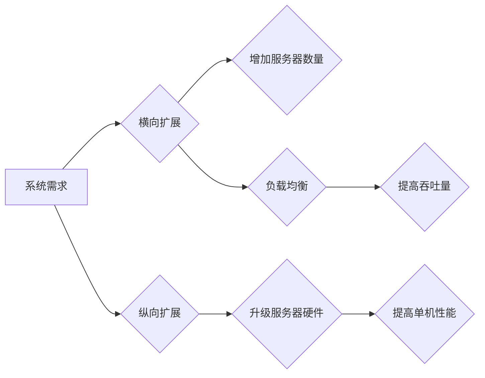

>  * 软件架构
>  * 扩展性
>  * 横向扩展
>  * 纵向扩展
>  * 高可用性
>  * 性能优化

## 1. 背景介绍

随着互联网和云计算的蓬勃发展，软件系统面临着日益增长的规模和性能需求。为了满足这些需求，软件架构需要具备良好的扩展性，能够随着业务增长而灵活地增加资源和处理能力。

扩展性是指软件系统能够随着需求变化而动态调整其资源和能力的能力。它可以分为两种主要类型：横向扩展和纵向扩展。

* **横向扩展**是指通过增加服务器数量来扩展系统容量，每个服务器承担一部分工作负载。
* **纵向扩展**是指通过升级单个服务器的硬件资源，例如增加CPU、内存或存储空间，来提高单个服务器的处理能力。

选择哪种扩展方法取决于具体的应用场景和需求。

## 2. 核心概念与联系

**横向扩展**和**纵向扩展**是两种不同的软件系统扩展方法，它们各自具有不同的优缺点。

**Mermaid 流程图：**



**横向扩展**的优势在于：

* **成本效益高:** 由于可以利用现有的硬件资源，因此成本相对较低。
* **可扩展性强:** 可以轻松地添加服务器来满足不断增长的需求。
* **高可用性:** 即使某个服务器出现故障，其他服务器仍然可以继续运行，保证系统可用性。

**横向扩展**的劣势在于：

* **复杂性高:** 需要管理多个服务器，配置和维护工作量较大。
* **数据同步问题:** 需要确保数据在多个服务器之间保持一致性。
* **网络带宽限制:** 随着服务器数量的增加，网络带宽压力也会增加。

**纵向扩展**的优势在于：

* **简单易用:** 只需要升级单个服务器的硬件资源，操作相对简单。
* **性能提升显著:** 升级硬件资源可以大幅提高单个服务器的处理能力。

**纵向扩展**的劣势在于：

* **成本高:** 升级硬件资源需要投入大量资金。
* **可扩展性有限:** 硬件资源有限，无法无限扩展系统容量。
* **单点故障风险:** 服务器出现故障会导致整个系统瘫痪。

## 3. 核心算法原理 & 具体操作步骤

### 3.1  算法原理概述

横向扩展的核心算法原理是**负载均衡**。负载均衡是指将用户请求分发到多个服务器上，以避免单个服务器过载，提高系统的整体性能和可用性。

常见的负载均衡算法包括：

* **轮询算法:** 将请求按照一定的顺序轮流分配到不同的服务器。
* **加权轮询算法:** 根据服务器的性能或负载情况，赋予不同的服务器不同的权重，然后按照权重进行请求分配。
* **最小连接数算法:** 将请求分配到连接数最少的服务器。
* **IP哈希算法:** 根据用户的IP地址将请求分配到特定的服务器。

### 3.2  算法步骤详解

**负载均衡算法的具体操作步骤如下：**

1. **请求到达负载均衡器:** 用户发送请求到负载均衡器。
2. **负载均衡器选择服务器:** 负载均衡器根据负载均衡算法选择一个合适的服务器。
3. **请求转发到服务器:** 负载均衡器将请求转发到选定的服务器。
4. **服务器处理请求:** 服务器处理请求并返回响应。
5. **响应返回用户:** 响应返回到用户。

### 3.3  算法优缺点

**负载均衡算法的优缺点如下：**

* **优点:** 提高系统性能和可用性，简化系统管理。
* **缺点:** 增加了系统复杂度，需要配置和维护负载均衡器。

### 3.4  算法应用领域

负载均衡算法广泛应用于各种互联网应用场景，例如：

* **电商平台:** 分配用户请求到不同的商品服务器，提高商品页面的响应速度。
* **社交媒体平台:** 分配用户请求到不同的用户服务器，提高用户数据访问速度。
* **视频网站:** 分配用户请求到不同的视频服务器，提高视频播放流畅度。

## 4. 数学模型和公式 & 详细讲解 & 举例说明

### 4.1  数学模型构建

**横向扩展**的数学模型可以描述为一个**多服务器系统**，其中每个服务器都具有相同的处理能力。系统总的处理能力可以表示为：

$$
T = n * t
$$

其中：

* $T$ 是系统总的处理能力。
* $n$ 是服务器的数量。
* $t$ 是单个服务器的处理能力。

**纵向扩展**的数学模型可以描述为一个**单服务器系统**，其中服务器的处理能力随着硬件资源的升级而增加。系统处理能力可以表示为：

$$
T = f(h)
$$

其中：

* $T$ 是系统处理能力。
* $h$ 是服务器的硬件资源，例如CPU、内存、存储空间。
* $f(h)$ 是硬件资源与处理能力之间的函数关系。

### 4.2  公式推导过程

**横向扩展**的公式推导过程：

* 假设每个服务器的处理能力为 $t$。
* 系统有 $n$ 个服务器。
* 系统总的处理能力为 $T = n * t$。

**纵向扩展**的公式推导过程：

* 假设服务器的硬件资源为 $h$。
* 服务器的处理能力与硬件资源之间的函数关系为 $f(h)$。
* 系统处理能力为 $T = f(h)$。

### 4.3  案例分析与讲解

**案例分析：**

假设一个电商平台需要处理每天100万个商品查询请求。

* **横向扩展方案:** 使用10个服务器，每个服务器处理能力为10万个请求/天。
* **纵向扩展方案:** 使用1个服务器，升级服务器硬件资源，使其处理能力达到100万个请求/天。

**讲解：**

在横向扩展方案中，系统总的处理能力为10个服务器 * 10万个请求/天/服务器 = 100万个请求/天。

在纵向扩展方案中，系统总的处理能力为1个服务器 * 100万个请求/天/服务器 = 100万个请求/天。

两种方案都可以满足需求，但横向扩展方案的成本相对较低，并且具有更高的可扩展性。

## 5. 项目实践：代码实例和详细解释说明

### 5.1  开发环境搭建

* 操作系统：Linux
* 编程语言：Python
* 框架：Flask
* 负载均衡器：Nginx

### 5.2  源代码详细实现

```python
from flask import Flask, request, jsonify

app = Flask(__name__)

@app.route('/api/data', methods=['GET'])
def get_data():
    # 模拟数据处理逻辑
    data = {'message': 'Hello, world!'}
    return jsonify(data)

if __name__ == '__main__':
    app.run(host='0.0.0.0', port=5000)
```

### 5.3  代码解读与分析

* 代码使用Flask框架构建了一个简单的API接口。
* `/api/data`接口接受GET请求，并返回一个JSON格式的数据。
* `app.run(host='0.0.0.0', port=5000)`启动应用，监听所有网络接口，端口为5000。

### 5.4  运行结果展示

启动应用后，访问`http://localhost:5000/api/data`，可以获取JSON格式的数据。

## 6. 实际应用场景

### 6.1  电商平台

电商平台需要处理大量的商品查询、订单处理、支付等请求。通过横向扩展，可以将请求分发到多个服务器，提高系统的处理能力和可用性。

### 6.2  社交媒体平台

社交媒体平台需要处理大量的用户数据、消息推送、内容发布等请求。通过横向扩展，可以提高系统的处理能力和用户体验。

### 6.3  视频网站

视频网站需要处理大量的视频播放、上传、下载等请求。通过横向扩展，可以提高系统的处理能力和视频播放流畅度。

### 6.4  未来应用展望

随着云计算和容器技术的不断发展，横向扩展和纵向扩展的应用场景将会更加广泛。

## 7. 工具和资源推荐

### 7.1  学习资源推荐

* **书籍:**
    * 《软件架构》
    * 《设计模式》
    * 《云计算架构》
* **在线课程:**
    * Coursera
    * Udemy
    * edX

### 7.2  开发工具推荐

* **负载均衡器:** Nginx, HAProxy
* **容器化平台:** Docker, Kubernetes
* **云计算平台:** AWS, Azure, GCP

### 7.3  相关论文推荐

* **横向扩展:**
    * "Scaling Web Applications with Nginx"
    * "Kubernetes: Container Orchestration for the Cloud"
* **纵向扩展:**
    * "Performance Optimization Techniques for Web Servers"
    * "Scaling Databases for High Performance"

## 8. 总结：未来发展趋势与挑战

### 8.1  研究成果总结

横向扩展和纵向扩展是两种重要的软件系统扩展方法，各有优缺点。随着云计算和容器技术的不断发展，横向扩展的应用场景将会更加广泛。

### 8.2  未来发展趋势

* **微服务架构:** 将大型系统分解成多个小型、独立的服务，每个服务可以独立部署和扩展。
* **Serverless 架构:** 将服务器管理的责任卸载到云服务提供商，开发者只需要关注业务逻辑。
* **人工智能驱动的扩展:** 利用人工智能技术自动识别和应对系统负载变化，实现智能扩展。

### 8.3  面临的挑战

* **复杂性:** 随着系统规模的增长，横向扩展和纵向扩展的管理和维护难度也会增加。
* **数据一致性:** 在横向扩展场景下，需要确保数据在多个服务器之间保持一致性。
* **成本:** 纵向扩展需要投入大量的硬件资源，成本较高。

### 8.4  研究展望

未来研究方向包括：

* **更智能的扩展算法:** 利用人工智能技术，开发更智能的扩展算法，能够自动识别和应对系统负载变化。
* **更有效的资源管理:** 开发更有效的资源管理机制，提高资源利用率，降低成本。
* **更安全的扩展方案:** 确保扩展过程中数据安全和系统稳定性。

## 9. 附录：常见问题与解答

### 9.1  Q1: 横向扩展和纵向扩展哪个更好？

**A1:** 没有绝对的优劣之分，选择哪种扩展方法取决于具体的应用场景和需求。

### 9.2  Q2: 如何实现横向扩展？

**A2:** 可以使用负载均衡器将请求分发到多个服务器，并使用数据库复制或缓存技术保证数据一致性。

### 9.3  Q3: 如何实现纵向扩展？

**A3:** 可以升级服务器的硬件资源，例如增加CPU、内存或存储空间。

### 9.4  Q4: 负载均衡算法有哪些？

**A4:** 常见的负载均衡算法包括轮询算法、加权轮询算法、最小连接数算法和IP哈希算法。

### 9.5  Q5: 云计算平台如何支持横向扩展？

**A5:** 云计算平台提供弹性伸缩功能，可以根据需求自动增加或减少服务器数量，实现横向扩展。


作者：禅与计算机程序设计艺术 / Zen and the Art of Computer Programming 
<end_of_turn>