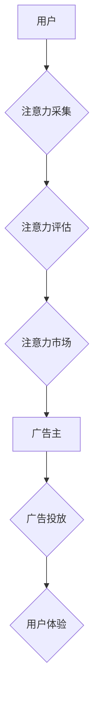

> 元宇宙、广告投放、注意力经济、深度学习、个性化推荐

## 1. 背景介绍

元宇宙概念的兴起，为数字世界带来了前所未有的机遇和挑战。其中，广告投放作为数字经济的重要组成部分，也面临着新的发展方向。传统的广告投放模式，往往依靠流量和曝光率，难以精准触达目标用户，且用户体验日益差。

注意力经济的兴起，强调了用户注意力资源的稀缺性和价值。元宇宙作为沉浸式、交互式的虚拟世界，用户在其中投入的时间和精力更多，注意力资源也更加宝贵。因此，如何有效地获取和利用用户注意力，成为元宇宙广告投放的关键。

## 2. 核心概念与联系

**2.1 注意力经济**

注意力经济是指在信息爆炸的时代，用户注意力成为稀缺资源，而能够有效获取和利用用户注意力的产品和服务，能够获得更大的价值。

**2.2 元宇宙广告投放**

元宇宙广告投放是指在元宇宙环境中，通过各种形式的广告内容，吸引用户注意力，实现商业目标。

**2.3 注意力市场**

注意力市场是指基于用户注意力价值的交易平台，用户可以将自己的注意力资源出售给广告主，广告主可以根据用户注意力价值，精准投放广告，实现更高效的广告投放。

**2.4 核心架构**



## 3. 核心算法原理 & 具体操作步骤

**3.1 算法原理概述**

注意力市场的核心算法原理是基于深度学习和个性化推荐技术，通过分析用户行为数据、兴趣偏好和注意力特征，预测用户对不同广告的注意力价值，并将其转化为可交易的注意力资源。

**3.2 算法步骤详解**

1. **用户行为数据采集:** 收集用户在元宇宙环境中的行为数据，例如浏览记录、互动行为、停留时间等。
2. **用户画像构建:** 利用机器学习算法，对用户行为数据进行分析，构建用户画像，包括用户兴趣、偏好、年龄、性别等信息。
3. **注意力特征提取:** 利用深度学习模型，提取用户对不同内容的注意力特征，例如眼动轨迹、点击行为、阅读时长等。
4. **注意力价值预测:** 基于用户画像和注意力特征，利用机器学习算法，预测用户对不同广告的注意力价值。
5. **注意力市场交易:** 建立注意力市场平台，用户可以将自己的注意力资源出售给广告主，广告主可以根据用户注意力价值，精准投放广告。

**3.3 算法优缺点**

**优点:**

* 精准投放: 根据用户注意力价值，精准投放广告，提高广告效果。
* 用户体验提升: 避免用户被无意义的广告打扰，提升用户体验。
* 价值创造: 将用户注意力资源转化为可交易的价值，创造新的商业模式。

**缺点:**

* 数据隐私: 需要收集和分析大量用户数据，需要保障用户数据隐私安全。
* 算法公平性: 需要确保算法公平公正，避免出现歧视或偏见。
* 监管挑战: 需要制定相应的法律法规，规范注意力市场的运营。

**3.4 算法应用领域**

* 元宇宙广告投放
* 个性化内容推荐
* 用户行为分析
* 市场营销

## 4. 数学模型和公式 & 详细讲解 & 举例说明

**4.1 数学模型构建**

注意力市场可以抽象为一个供求模型，其中用户注意力作为供给，广告主需求作为需求。

**4.2 公式推导过程**

* 用户注意力价值：$V_u = f(H_u, I_u)$

其中：

* $V_u$：用户 $u$ 的注意力价值
* $H_u$：用户 $u$ 的注意力特征
* $I_u$：用户 $u$ 的兴趣偏好

* 广告投放成本：$C_a = g(V_u, P_a)$

其中：

* $C_a$：广告 $a$ 的投放成本
* $V_u$：用户 $u$ 的注意力价值
* $P_a$：广告 $a$ 的广告预算

**4.3 案例分析与讲解**

假设用户 Alice 的注意力特征 $H_a$ 包括眼动轨迹、点击行为、阅读时长等，兴趣偏好 $I_a$ 包括游戏、科技、娱乐等。根据上述公式，可以计算出 Alice 对不同广告的注意力价值。

如果广告主 Bob 希望投放游戏广告，可以根据 Alice 的注意力特征和兴趣偏好，预测 Alice 对游戏广告的注意力价值，并根据预算 $P_b$ 计算出投放成本 $C_b$。

## 5. 项目实践：代码实例和详细解释说明

**5.1 开发环境搭建**

* 操作系统：Ubuntu 20.04
* Python 版本：3.8
* 框架：TensorFlow 2.0

**5.2 源代码详细实现**

```python
# 用户注意力价值预测模型
model = tf.keras.models.Sequential([
    tf.keras.layers.Dense(64, activation='relu', input_shape=(100,)),
    tf.keras.layers.Dense(32, activation='relu'),
    tf.keras.layers.Dense(1)
])

# 模型编译
model.compile(optimizer='adam', loss='mse')

# 模型训练
model.fit(X_train, y_train, epochs=10)

# 广告投放成本计算
def calculate_cost(user_attention_value, ad_budget):
    cost = user_attention_value * ad_budget
    return cost
```

**5.3 代码解读与分析**

* 用户注意力价值预测模型采用多层感知机 (MLP) 结构，输入用户注意力特征和兴趣偏好，输出用户对不同广告的注意力价值。
* 模型训练使用均方误差 (MSE) 作为损失函数，Adam 作为优化器。
* 广告投放成本计算函数根据用户注意力价值和广告预算计算出投放成本。

**5.4 运行结果展示**

模型训练完成后，可以将模型应用于实际场景，预测用户对不同广告的注意力价值，并根据预算计算出投放成本。

## 6. 实际应用场景

**6.1 元宇宙游戏广告投放**

在元宇宙游戏中，广告主可以根据玩家的注意力价值，精准投放游戏道具、虚拟物品等广告，提高广告效果。

**6.2 元宇宙社交平台广告投放**

在元宇宙社交平台，广告主可以根据用户的兴趣偏好和社交关系，精准投放商品、服务等广告，提高广告转化率。

**6.3 元宇宙教育平台广告投放**

在元宇宙教育平台，广告主可以根据学生的学习进度和兴趣爱好，精准投放学习资源、培训课程等广告，提高学习效率。

**6.4 未来应用展望**

注意力市场将成为元宇宙广告投放的重要组成部分，未来将应用于更多场景，例如元宇宙医疗、元宇宙金融等领域。

## 7. 工具和资源推荐

**7.1 学习资源推荐**

* 深度学习书籍：
    * 深度学习
    * 深度学习实践
* 元宇宙相关书籍：
    * 元宇宙：下一个互联网
    * 元宇宙：未来世界

**7.2 开发工具推荐**

* TensorFlow
* PyTorch
* Unity

**7.3 相关论文推荐**

* Attention Is All You Need
* Transformer

## 8. 总结：未来发展趋势与挑战

**8.1 研究成果总结**

注意力市场为元宇宙广告投放提供了新的思路，能够提高广告效果，提升用户体验。

**8.2 未来发展趋势**

* 算法模型的不断优化，提高注意力价值预测的准确性。
* 更多元宇宙平台的加入，形成更大的注意力市场。
* 更加细粒度的注意力分类，满足不同广告主的需求。

**8.3 面临的挑战**

* 数据隐私保护
* 算法公平性
* 监管挑战

**8.4 研究展望**

未来将继续研究注意力市场相关技术，探索更精准、更有效的广告投放方式，为元宇宙经济发展贡献力量。

## 9. 附录：常见问题与解答

**9.1 如何保障用户数据隐私？**

注意力市场平台需要严格遵守数据隐私法规，采取相应的技术措施，保障用户数据安全。

**9.2 如何避免算法出现歧视或偏见？**

需要定期评估算法模型，确保算法公平公正，并采取措施避免算法偏差。

**9.3 如何规范注意力市场的运营？**

需要制定相应的法律法规，规范注意力市场的运营，保护用户权益。


作者：禅与计算机程序设计艺术 / Zen and the Art of Computer Programming 
<end_of_turn>