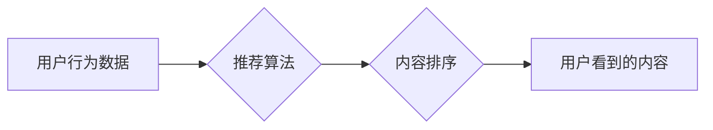

>  注意力经济、社交媒体、算法推荐、深度学习、用户行为分析、数据隐私

## 1. 背景介绍

在当今数字时代，信息爆炸式增长，人们面临着前所未有的信息过载。社交媒体平台作为信息获取和传播的主要渠道，占据了我们生活的重要部分。然而，这些平台也引发了关于“注意力经济”和“算法控制”的广泛讨论。

注意力经济是指在信息过剩的时代，人们对有限的注意力资源的争夺。社交媒体平台通过各种算法和机制，精准地推送内容，试图吸引用户的注意力，并以此获取广告收入。然而，这种“注意力经济”模式也引发了人们对数据隐私、算法透明度和信息茧房等问题的担忧。

## 2. 核心概念与联系

### 2.1 注意力经济

注意力经济的核心概念是，注意力是稀缺的资源，而信息生产者和平台为了获取用户注意力，会不断地优化内容和算法。

* **用户注意力：** 用户对特定内容或信息的关注程度，是注意力经济的核心要素。
* **信息生产者：** 包括个人、企业、媒体等，他们生产和传播信息，试图获取用户的注意力。
* **平台：** 作为信息传播的载体，平台通过算法和机制，将信息与用户连接起来，并从中获取收益。

### 2.2 社交媒体算法

社交媒体平台利用复杂的算法，分析用户行为数据，并根据用户的兴趣、偏好和社交关系，推荐个性化的内容。

* **用户行为数据：** 包括用户浏览历史、点赞、评论、分享等行为，是算法训练和优化数据的重要来源。
* **推荐算法：** 基于机器学习和深度学习技术，分析用户行为数据，预测用户对特定内容的兴趣，并推荐相关内容。
* **内容排序：** 算法会根据内容的质量、时效性、用户互动等因素，对内容进行排序，决定用户看到的顺序。

### 2.3 算法推荐机制

算法推荐机制是社交媒体平台的核心功能，它通过分析用户行为数据，预测用户对特定内容的兴趣，并推荐相关内容。

* **协同过滤：** 基于用户的相似性，推荐用户喜欢的其他用户也喜欢的物品。
* **内容过滤：** 基于内容的特征，推荐用户感兴趣的内容。
* **混合推荐：** 结合协同过滤和内容过滤，提高推荐的准确性和个性化程度。

**Mermaid 流程图**



## 3. 核心算法原理 & 具体操作步骤

### 3.1 算法原理概述

社交媒体平台的推荐算法通常基于机器学习和深度学习技术，通过训练模型，学习用户行为数据和内容特征之间的关系，从而预测用户对特定内容的兴趣。

* **监督学习：** 使用标记的数据训练模型，例如用户对特定内容的点赞或评论行为。
* **非监督学习：** 使用未标记的数据训练模型，例如用户浏览历史和社交关系。
* **深度学习：** 使用多层神经网络，学习更复杂的特征和关系。

### 3.2 算法步骤详解

1. **数据收集和预处理：** 收集用户行为数据、内容特征数据，并进行清洗、转换和特征工程。
2. **模型选择和训练：** 选择合适的机器学习或深度学习模型，并使用训练数据进行模型训练。
3. **模型评估和优化：** 使用测试数据评估模型性能，并根据评估结果调整模型参数，优化模型效果。
4. **在线推荐：** 将训练好的模型部署到线上环境，根据用户的实时行为数据，进行个性化的内容推荐。

### 3.3 算法优缺点

**优点：**

* **个性化推荐：** 能够根据用户的兴趣和偏好，推荐更符合用户需求的内容。
* **提高用户粘性：** 个性化的推荐能够提高用户的使用时长和参与度。
* **提升商业价值：** 通过精准的广告投放，提高广告转化率。

**缺点：**

* **信息茧房效应：** 用户只看到自己感兴趣的内容，导致信息孤岛和认知偏差。
* **数据隐私问题：** 收集和使用用户行为数据，可能侵犯用户隐私。
* **算法偏见：** 算法训练数据可能存在偏见，导致推荐结果不公平。

### 3.4 算法应用领域

* **社交媒体平台：** 推送个性化内容推荐，提高用户粘性。
* **电商平台：** 推荐商品，提高转化率。
* **音乐平台：** 推荐歌曲，提高用户体验。
* **新闻平台：** 推荐新闻，提高用户阅读量。

## 4. 数学模型和公式 & 详细讲解 & 举例说明

### 4.1 数学模型构建

推荐算法通常使用协同过滤或内容过滤模型。

**协同过滤模型：**

* **用户-物品评分矩阵：** 用来表示用户对不同物品的评分，例如用户对电影的评分。
* **相似度计算：** 计算用户之间的相似度或物品之间的相似度，例如基于余弦相似度或皮尔逊相关系数。
* **推荐预测：** 根据用户相似度或物品相似度，预测用户对未评分物品的评分。

**内容过滤模型：**

* **特征向量：** 将物品描述为特征向量，例如电影的类型、导演、演员等。
* **相似度计算：** 计算物品之间的特征相似度，例如余弦相似度或杰卡德相似度。
* **推荐预测：** 根据物品相似度，推荐用户可能感兴趣的物品。

### 4.2 公式推导过程

**协同过滤模型：**

* **余弦相似度：**

$$
\text{相似度} = \frac{\mathbf{u} \cdot \mathbf{v}}{\|\mathbf{u}\| \|\mathbf{v}\|}
$$

其中，$\mathbf{u}$ 和 $\mathbf{v}$ 是两个用户的评分向量，$\cdot$ 表示点积，$\|\mathbf{u}\|$ 和 $\|\mathbf{v}\|$ 表示向量的模长。

**内容过滤模型：**

* **余弦相似度：**

$$
\text{相似度} = \frac{\mathbf{i} \cdot \mathbf{j}}{\|\mathbf{i}\| \|\mathbf{j}\|}
$$

其中，$\mathbf{i}$ 和 $\mathbf{j}$ 是两个物品的特征向量，$\cdot$ 表示点积，$\|\mathbf{i}\|$ 和 $\|\mathbf{j}\|$ 表示向量的模长。

### 4.3 案例分析与讲解

**案例：**

假设有一个电影推荐系统，用户对电影的评分数据如下：

| 用户 | 电影 A | 电影 B | 电影 C |
|---|---|---|---|
| 用户 1 | 5 | 3 | 4 |
| 用户 2 | 4 | 5 | 2 |
| 用户 3 | 3 | 4 | 5 |

**分析：**

* 使用协同过滤模型，可以计算用户之间的相似度，例如用户 1 和用户 3 的相似度较高，因为他们对电影 A、B 和 C 的评分都比较接近。
* 根据用户相似度，可以推荐用户 1 可能喜欢的电影，例如用户 3 喜欢的电影 C。
* 使用内容过滤模型，可以将电影描述为特征向量，例如电影 A 是动作片，电影 B 是爱情片，电影 C 是喜剧片。
* 根据电影特征相似度，可以推荐用户 1 可能喜欢的电影，例如用户 1 喜欢的电影 A 是动作片，可以推荐其他动作片。

## 5. 项目实践：代码实例和详细解释说明

### 5.1 开发环境搭建

* **操作系统：** Ubuntu 20.04
* **编程语言：** Python 3.8
* **深度学习框架：** TensorFlow 2.0
* **数据处理库：** Pandas
* **数据可视化库：** Matplotlib

### 5.2 源代码详细实现

```python
import tensorflow as tf
from tensorflow.keras.models import Sequential
from tensorflow.keras.layers import Dense

# 构建用户-物品评分矩阵
ratings_matrix = tf.constant([
    [5, 3, 4],
    [4, 5, 2],
    [3, 4, 5]
])

# 构建模型
model = Sequential()
model.add(Dense(16, activation='relu', input_shape=(3,)))
model.add(Dense(1))

# 编译模型
model.compile(optimizer='adam', loss='mse')

# 训练模型
model.fit(ratings_matrix, ratings_matrix, epochs=100)

# 预测用户对电影 D 的评分
user_id = 0
movie_id = 3
prediction = model.predict([[user_id, movie_id]])
print(f"用户 {user_id} 对电影 {movie_id} 的预测评分：{prediction[0][0]}")
```

### 5.3 代码解读与分析

* **数据准备：** 将用户-物品评分数据转换为 TensorFlow 常量。
* **模型构建：** 使用一个简单的多层感知机模型，包含一个隐藏层和一个输出层。
* **模型编译：** 使用 Adam 优化器和均方误差损失函数编译模型。
* **模型训练：** 使用训练数据训练模型，迭代次数为 100 次。
* **模型预测：** 使用训练好的模型，预测用户对电影 D 的评分。

### 5.4 运行结果展示

运行代码后，会输出用户对电影 D 的预测评分。

## 6. 实际应用场景

### 6.1 社交媒体平台

* **个性化内容推荐：** 根据用户的兴趣和行为数据，推荐用户可能感兴趣的内容，例如新闻、视频、图片等。
* **用户群组推荐：** 根据用户的兴趣和社交关系，推荐用户可能感兴趣的群组，例如兴趣小组、行业论坛等。
* **广告精准投放：** 根据用户的兴趣和行为数据，精准地投放广告，提高广告转化率。

### 6.2 电商平台

* **商品推荐：** 根据用户的浏览历史、购买记录和兴趣偏好，推荐用户可能感兴趣的商品。
* **个性化促销：** 根据用户的购买记录和消费习惯，提供个性化的促销活动和优惠券。
* **客户服务优化：** 根据用户的咨询记录和反馈，提供更精准和有效的客户服务。

### 6.3 音乐平台

* **歌曲推荐：** 根据用户的播放历史、收藏歌曲和喜欢的音乐类型，推荐用户可能喜欢的歌曲。
* **音乐人发现：** 根据用户的音乐偏好，推荐用户可能喜欢的音乐人。
* **个性化音乐播放列表：** 根据用户的音乐偏好，自动生成个性化的音乐播放列表。

### 6.4 未来应用展望

* **增强现实 (AR) 和虚拟现实 (VR) 应用：** 在 AR 和 VR 环境中，算法可以根据用户的行为和环境，提供更个性化的体验。
* **物联网 (IoT) 应用：** 算法可以分析物联网设备产生的数据，提供更智能的设备控制和服务。
* **医疗保健应用：** 算法可以分析患者的医疗数据，提供更精准的诊断和治疗方案。

## 7. 工具和资源推荐

### 7.1 学习资源推荐

* **书籍：**
    * 《深度学习》
    * 《机器学习实战》
    * 《推荐系统》
* **在线课程：**
    * Coursera: 深度学习
    * edX: 机器学习
    * Udacity: 机器学习工程师

### 7.2 开发工具推荐

* **Python:** 广泛使用的编程语言，用于机器学习和深度学习开发。
* **TensorFlow:** 开源深度学习框架，提供丰富的工具和资源。
* **PyTorch:** 开源深度学习框架，以其灵活性和易用性而闻名。
* **Scikit-learn:** 机器学习库，提供各种算法和工具。

### 7.3 相关论文推荐

* **Collaborative Filtering for Implicit Feedback Datasets**
* **