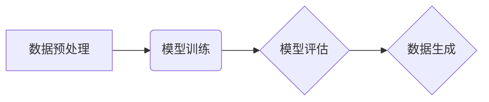

> 生成式AIGC,最小可行产品MVP,快速试错,迭代,深度学习,Transformer模型,文本生成,图像生成,代码生成

## 1. 背景介绍

近年来，人工智能（AI）领域取得了令人瞩目的进展，其中生成式人工智能（AIGC）作为一门新兴技术，迅速成为全球科技界关注的焦点。AIGC能够根据输入的文本、图像或其他数据，生成新的、原创的内容，例如文本、图像、音频、视频等。

AIGC技术的出现，为各行各业带来了前所未有的机遇。它可以帮助企业自动化内容创作、提高工作效率、创造新的商业模式。例如，在营销领域，AIGC可以生成个性化的广告文案、社交媒体内容；在教育领域，AIGC可以生成个性化的学习材料、自动批改作业；在娱乐领域，AIGC可以生成新的游戏场景、电影剧本等。

然而，AIGC技术也面临着一些挑战。例如，如何保证生成内容的质量和原创性、如何解决伦理和安全问题等。

## 2. 核心概念与联系

**2.1 生成式AIGC的核心概念**

生成式AIGC的核心概念是利用深度学习算法，训练模型能够从输入数据中学习模式和规律，并根据这些模式和规律生成新的数据。

**2.2 生成式AIGC与传统AI的关系**

传统AI主要侧重于数据分析和预测，而生成式AIGC则更侧重于数据生成。

**2.3 生成式AIGC的应用场景**

生成式AIGC的应用场景非常广泛，包括：

* 文本生成：例如，自动写作、机器翻译、聊天机器人等。
* 图像生成：例如，图像合成、图像修复、艺术创作等。
* 音频生成：例如，语音合成、音乐创作等。
* 视频生成：例如，视频剪辑、视频特效等。

**2.4 生成式AIGC的架构**

生成式AIGC的架构通常包括以下几个部分：

* 数据预处理：对输入数据进行清洗、格式化等处理。
* 模型训练：利用深度学习算法，训练模型能够生成新的数据。
* 模型评估：评估模型的生成效果，并进行调整。
* 数据生成：利用训练好的模型，生成新的数据。



## 3. 核心算法原理 & 具体操作步骤

### 3.1  算法原理概述

生成式AIGC的核心算法是基于深度学习的生成模型，其中Transformer模型是目前最流行的生成模型之一。Transformer模型利用注意力机制，能够捕捉文本中的长距离依赖关系，从而生成更流畅、更自然的文本。

### 3.2  算法步骤详解

1. **数据收集和预处理:** 收集大量文本数据，并进行清洗、格式化等预处理操作。
2. **模型构建:** 使用Transformer模型架构构建生成模型。
3. **模型训练:** 利用训练数据训练模型，优化模型参数。
4. **模型评估:** 使用测试数据评估模型的生成效果，例如困惑度、BLEU分数等。
5. **模型部署:** 将训练好的模型部署到生产环境中，用于生成新的文本。

### 3.3  算法优缺点

**优点:**

* 生成效果逼真，能够生成高质量的文本。
* 能够捕捉文本中的长距离依赖关系，生成更流畅、更自然的文本。
* 训练数据量大，模型泛化能力强。

**缺点:**

* 训练成本高，需要大量的计算资源和时间。
* 模型参数量大，部署成本高。
* 容易受到训练数据的影响，生成结果可能存在偏差。

### 3.4  算法应用领域

* 文本生成：例如，自动写作、机器翻译、聊天机器人等。
* 代码生成：例如，自动生成代码片段、代码补全等。
* 图像生成：例如，图像合成、图像修复等。

## 4. 数学模型和公式 & 详细讲解 & 举例说明

### 4.1  数学模型构建

Transformer模型的核心是注意力机制，它能够捕捉文本中的长距离依赖关系。注意力机制的数学模型可以表示为：

$$
Attention(Q, K, V) = softmax(\frac{QK^T}{\sqrt{d_k}})V
$$

其中：

* $Q$：查询矩阵
* $K$：键矩阵
* $V$：值矩阵
* $d_k$：键向量的维度
* $softmax$：softmax函数

### 4.2  公式推导过程

注意力机制的公式推导过程可以参考 Transformer 模型的论文。

### 4.3  案例分析与讲解

例如，在机器翻译任务中，输入句子是英文，输出句子是中文。Transformer模型会将英文句子转换为查询矩阵 $Q$，将目标语言的词典转换为键矩阵 $K$ 和值矩阵 $V$。然后，通过注意力机制计算每个英文单词与每个目标语言单词之间的相关性，并根据相关性权重加权求和，得到最终的翻译结果。

## 5. 项目实践：代码实例和详细解释说明

### 5.1  开发环境搭建

* Python 3.7+
* TensorFlow 2.0+
* PyTorch 1.0+
* CUDA 10.0+

### 5.2  源代码详细实现

```python
# 导入必要的库
import tensorflow as tf

# 定义Transformer模型
class Transformer(tf.keras.Model):
    def __init__(self, vocab_size, embedding_dim, num_heads, num_layers):
        super(Transformer, self).__init__()
        self.embedding = tf.keras.layers.Embedding(vocab_size, embedding_dim)
        self.transformer_layers = tf.keras.layers.StackedRNNCells([
            tf.keras.layers.MultiHeadAttention(num_heads=num_heads, key_dim=embedding_dim)
            for _ in range(num_layers)
        ])
        self.dense = tf.keras.layers.Dense(vocab_size)

    def call(self, inputs):
        # Embedding层将输入词转换为向量
        embeddings = self.embedding(inputs)
        # Transformer层处理嵌入向量
        outputs = self.transformer_layers(embeddings)
        # 全连接层将输出向量转换为概率分布
        logits = self.dense(outputs)
        return logits

# 实例化Transformer模型
model = Transformer(vocab_size=10000, embedding_dim=512, num_heads=8, num_layers=6)

# 训练模型
model.compile(optimizer='adam', loss='sparse_categorical_crossentropy', metrics=['accuracy'])
model.fit(x_train, y_train, epochs=10)

```

### 5.3  代码解读与分析

* 代码首先定义了Transformer模型的架构，包括嵌入层、Transformer层和全连接层。
* 嵌入层将输入词转换为向量。
* Transformer层利用注意力机制处理嵌入向量，捕捉文本中的长距离依赖关系。
* 全连接层将输出向量转换为概率分布，用于预测下一个词。
* 代码然后实例化Transformer模型，并使用Adam优化器、交叉熵损失函数和准确率指标进行训练。

### 5.4  运行结果展示

训练完成后，可以使用模型生成新的文本。例如，可以输入一个句子，模型会根据输入句子生成下一个词，从而生成一个完整的句子。

## 6. 实际应用场景

### 6.1 文本生成

* **自动写作:** 生成新闻报道、产品描述、博客文章等。
* **机器翻译:** 将文本从一种语言翻译成另一种语言。
* **聊天机器人:** 与用户进行自然语言对话。

### 6.2 图像生成

* **图像合成:** 生成新的图像，例如合成人物肖像、场景图像等。
* **图像修复:** 修复损坏的图像，例如修复缺失的部分、去除噪声等。
* **艺术创作:** 生成艺术作品，例如绘画、雕塑等。

### 6.3 代码生成

* **自动代码生成:** 根据需求自动生成代码片段。
* **代码补全:** 根据上下文自动补全代码。
* **代码翻译:** 将代码从一种编程语言翻译成另一种编程语言。

### 6.4 未来应用展望

* **个性化内容生成:** 根据用户的喜好生成个性化的内容，例如新闻推荐、广告推送等。
* **虚拟助手:** 开发更智能的虚拟助手，能够理解用户的自然语言指令，并执行相应的操作。
* **创意辅助工具:** 为艺术家、设计师等提供创意辅助工具，帮助他们生成新的创意。

## 7. 工具和资源推荐

### 7.1 学习资源推荐

* **书籍:**
    * 《深度学习》
    * 《Transformer模型详解》
* **在线课程:**
    * Coursera: 深度学习
    * Udacity: 自然语言处理
* **博客:**
    * The Gradient
    * Towards Data Science

### 7.2 开发工具推荐

* **TensorFlow:** 开源深度学习框架
* **PyTorch:** 开源深度学习框架
* **Hugging Face:** 提供预训练模型和工具

### 7.3 相关论文推荐

* 《Attention Is All You Need》
* 《BERT: Pre-training of Deep Bidirectional Transformers for Language Understanding》
* 《GPT-3: Language Models are Few-Shot Learners》

## 8. 总结：未来发展趋势与挑战

### 8.1 研究成果总结

近年来，生成式AIGC取得了显著进展，能够生成高质量的文本、图像、音频等内容。

### 8.2 未来发展趋势

* **模型规模和能力的提升:** 未来，生成式AIGC模型的规模和能力将会进一步提升，能够生成更复杂、更创新的内容。
* **多模态生成:** 未来，生成式AIGC将不仅仅局限于单一模态的生成，而是能够跨越文本、图像、音频等多种模态进行生成。
* **个性化定制:** 未来，生成式AIGC将更加注重个性化定制，能够根据用户的需求生成个性化的内容。

### 8.3 面临的挑战

* **数据安全和隐私:** 生成式AIGC模型需要大量的训练数据，如何保证数据安全和隐私是一个重要的挑战。
* **伦理和社会影响:** 生成式AIGC技术可能会带来一些伦理和社会问题，例如内容虚假、版权侵权等，需要引起重视。
* **可解释性和可控性:** 生成式AIGC模型的决策过程往往是复杂的，难以解释和控制，需要进一步研究。

### 8.4 研究展望

未来，生成式AIGC技术将继续发展，并应用于越来越多的领域，为人类社会带来更多便利和福祉。

## 9. 附录：常见问题与解答

**Q1: 生成式AIGC技术与传统AI技术有什么区别？**

**A1:** 传统AI主要侧重于数据分析和预测，而生成式AIGC则更侧重于数据生成。

**Q2: 生成式AIGC技术有哪些应用场景？**

**A2:** 生成式AIGC技术应用场景非常广泛，包括文本生成、图像生成、音频生成、视频生成等。

**Q3: 如何评估生成式AIGC模型的性能？**

**A3:** 可以使用困惑度、BLEU分数等指标评估生成式AIGC模型的性能。

**Q4: 生成式AIGC技术有哪些挑战？**

**A4:** 生成式AIGC技术面临着数据安全、伦理、可解释性和可控性等挑战。


作者：禅与计算机程序设计艺术 / Zen and the Art of Computer Programming 
<end_of_turn>